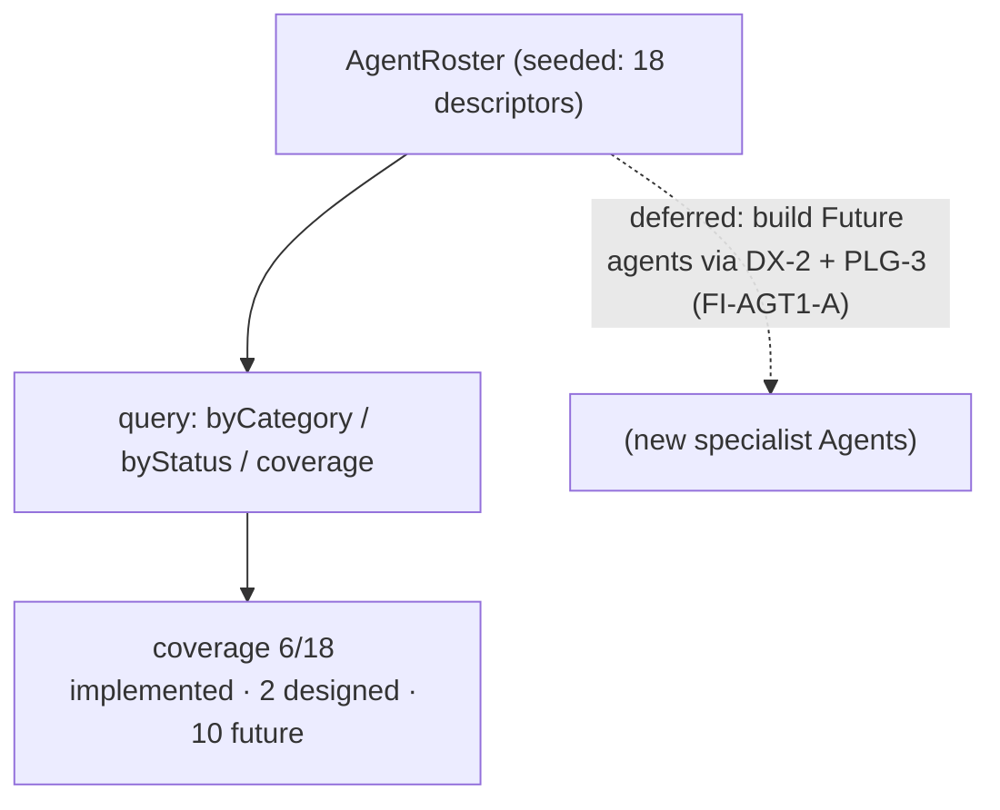

# AGT-1 — Technical Design: Agent Roadmap & Roster (Catalog Increment)

**Version:** 1.0.0
**Document Type:** Implementation Technical Design
**Document Status:** Roster increment implemented — 2026-07-29 (§0.4 = A; AGT-1 stays incremental/rolling; see [Implementation Outcome](#implementation-outcome))
**Last Updated:** 2026-07-29
**Roadmap item:** [`AGT-1`](./AI-QA-OS-Improvement-Roadmap.md#agt-1--agent-roadmap--roster) (v2.2.0, frozen) — ⚪ P3 · Effort XL (incremental) · Owner AI/Agents · Phase 4 → Vision · v2.1 → v3.x
**Modules:** `ai-qa-os-agents` (the roster catalog).
**Depends on:** none blocking. New specialist agents are scaffolded by DX-2 + PLG-3 (both deferred).

> **Scope discipline.** AGT-1 is explicitly **incremental** — grow the agent roster over releases. This increment makes the **roster a first-class, queryable catalog**: the 18 designed agents (6 implemented, 2 designed, 10 future), their category, and status. The catalog + queries are **fully validatable**. Actually *building* the future specialist agents (API/Mobile/Performance/…) is the ongoing incremental work and needs DX-2 scaffolding + PLG-3 execution SDKs (deferred, §0.3). AGT-1 stays **incremental/rolling**, not Completed.

---

## 0. Roadmap Verification & Scope

### 0.1 What AGT-1 requires
> Grow the agent roster incrementally; each new agent scaffolded by DX-2, conforming to the mediator rules. Test types beyond web UI (API, mobile, performance, security, accessibility, visual, database) each need a specialist agent. Additive by design.

### 0.2 Verified state
- Runtime `AgentRegistry` (agents) auto-registers **live `Agent` beans** by `AgentType`; `AgentType` enum (core) has the 12 wired types. **But there is no first-class *roster*** — the roadmap's catalog of 18 agents (implemented + designed + future) with categories/status lives only in the roadmap table, not in code.

### 0.3 Environment reality
- **Validatable now:** an `AgentRoster` catalog — `AgentDescriptor`s (name, category, status, implementing class) seeded from the roadmap roster, queryable by category/status + a coverage metric. Pure data + queries.
- **Deferred (the incremental work):** implementing the 10 **Future** specialist agents — each needs a prompt template + an execution engine (PLG-3 SDK) + DX-2 scaffolding + real LLM work (FI-AGT1-A). This is AGT-1's ongoing v2.1→v3.x scope.

### 0.4 / Decision for approval — scope of this increment

| Option | Approach | Trade-off |
|---|---|---|
| **A — First-class roster catalog now; specialist agents deferred (recommended)** | `AgentRoster` in `ai-qa-os-agents` — `AgentDescriptor` (name/category/`AgentStatus`/impl) seeded with the 18 roster entries; query by category/status, coverage metric. | Makes the roster explicit + programmatic (coverage, gaps) with zero blast radius; fully validatable. Doesn't build new agents (that's the deferred incremental work). |
| **B — Also implement a Future specialist agent (e.g. API Agent) now** | Add a new `Agent` impl + prompt template + wire a step. | Advances coverage by one, but each new agent needs PLG-3 execution SDKs + DX-2 scaffolding + live LLM — larger, unvalidatable here, and the roadmap says do this incrementally via DX-2/PLG-3. |

**Recommend A** — establish the roster *mechanism* + current catalog now (the tracking/coverage the roadmap wants); building the Future agents is the ongoing incremental work behind DX-2/PLG-3 (FI-AGT1-A).

> ✅ **Decision (confirmed 2026-07-29): Option A — first-class `AgentRoster` catalog (18 descriptors, query by category/status + coverage); Future specialist agents deferred (FI-AGT1-A). AGT-1 stays incremental/rolling.** Recorded as ADR-045 (number verified at implement).

---

## 1. Technical Design (Option A)

`ai-qa-os-agents`, package `com.aiqaos.agent.roster`:
- **`AgentCategory`** — `REQUIREMENT_INTELLIGENCE`, `TEST_DESIGN`, `AUTOMATION`, `EXECUTION`, `EXECUTION_INTELLIGENCE`, `REPORTING`, `NON_FUNCTIONAL`, `PLATFORM_ENGINEERING` (a display name each).
- **`AgentStatus`** — `IMPLEMENTED`, `DESIGNED`, `FUTURE`.
- **`AgentDescriptor`** — `name`, `category`, `status`, `implementingClass` (nullable, e.g. `QAAnalystAgent`).
- **`AgentRoster`** (`@Component`) — seeded with the 18 roster entries; `all()`, `byCategory(c)`, `byStatus(s)`, `find(name)`, `categories()`, and `coverage()` (implemented / total).

**Defers:** implementing the 10 Future specialist agents (FI-AGT1-A, needs DX-2 + PLG-3) · a roster dashboard surface · syncing the roster against live `AgentRegistry` beans (FI-AGT1-B).

---

## 2. Folder Structure
```
ai-qa-os-agents/.../roster/
    AgentCategory.java     [N]   AgentStatus.java [N]
    AgentDescriptor.java   [N] name + category + status + implementingClass
    AgentRoster.java       [N] @Component: seeded catalog + queries + coverage
+ unit tests: roster (total 18, status counts 6/2/10, byCategory, find, coverage, categories).
```

---

## 3–5. Classes / DB / API
Key classes above. **DB:** none (catalog is in-code). **API:** none (a roster view rides a dashboard later).

---

## 6. Sequence


---

## 7. Plan
1. **Model** — `AgentCategory`, `AgentStatus`, `AgentDescriptor`.
2. **Roster** — `AgentRoster` seeded with the 18 roadmap entries + queries + `coverage()`.
3. **Tests** — total 18; status counts (6 implemented / 2 designed / 10 future); `byCategory(NON_FUNCTIONAL)`=4; `find`; `coverage`; `categories`=8. No Mockito.
4. **Build & validate** — targeted `mvn -pl ai-qa-os-agents -am test -Dtest=… -Djacoco.skip=true -DargLine="-Xss40m"`; green.
5. **Sync docs** — tracker `AGT-1` note (roster increment landed; stays incremental/rolling); **ADR-045** (first-class agent roster catalog). Verify number at implement.

**DoD (this increment):** the platform's agent roster is a queryable catalog — 18 agents by category + status with a coverage metric — unit-proven. **Deferred:** the Future specialist agents (ongoing, via DX-2/PLG-3). AGT-1 stays incremental/rolling.

---

## Implementation Outcome

Roster increment implemented 2026-07-29 (§0.4 = A — first-class roster catalog). Recorded as **ADR-045**. **AGT-1 remains incremental/rolling.**

**Files (all new, `ai-qa-os-agents/.../roster/`):**
- `AgentCategory` (8 categories with display names), `AgentStatus` (IMPLEMENTED/DESIGNED/FUTURE), `AgentDescriptor` (name/category/status/implementingClass + `isImplemented`), `AgentRoster` (`@Component` seeded with the 18 roadmap agents; `all`/`byCategory`/`byStatus`/`find`/`categories`/`total`/`implementedCount`/`coverageRatio`).

**Validation (Maven):** `mvn -pl ai-qa-os-agents -am test -Dtest=AgentRosterTest` → **BUILD SUCCESS**; `AgentRosterTest` **7/7** (18 total; 6 implemented / 2 designed / 10 future; NON_FUNCTIONAL = the 4 specialists; implemented carry their class; future have no impl; coverage 6/18; 8 categories). Ran with `-Djacoco.skip=true -DargLine="-Xss40m"`. Plain no-arg `@Component` — no wiring traps.

**Honest scope note:** the **roster catalog + queries + coverage are unit-proven**. **Deferred (the ongoing incremental work):** building the 10 Future specialist agents via DX-2 + PLG-3 (FI-AGT1-A); reconciling the catalog against live `AgentRegistry` beans (FI-AGT1-B). AGT-1 stays incremental/rolling.

---

## Appendix — Future Ideas
- **FI-AGT1-A** — Implement the Future specialist agents (API/Mobile/Performance/Security/Accessibility/Visual/Database/Architecture/Code-Review/Release) incrementally via DX-2 scaffolding + PLG-3 execution SDKs.
- **FI-AGT1-B** — Reconcile the roster against live `AgentRegistry` beans (flag drift between catalog status and what's actually wired).

---

## Compliance Checklist
| Rule | Status |
|---|---|
| Roadmap not modified | ✅ AGT-1 metadata untouched |
| Incremental, additive | ✅ catalog only; specialist agents deferred |
| Dependency reality | ✅ in `ai-qa-os-agents`; no new dep |
| Honest status | ✅ AGT-1 stays incremental/rolling, not Completed |
| Non-breaking | ✅ additive; no schema/API |
| ADR discipline | ✅ ADR-045 to be recorded (number verified at implement) |

---

## Document Completion Status
**Status:** Roster increment implemented — 2026-07-29 (§0.4 = A). AGT-1 stays incremental/rolling. See [Implementation Outcome](#implementation-outcome). ADR-045.
**Implements:** `AGT-1` (roadmap v2.2.0, frozen) — the roster catalog increment; specialist agents deferred.
**Next step:** On approval + option choice, execute [§7](#7-step-by-step-implementation-plan) from Step 1.
