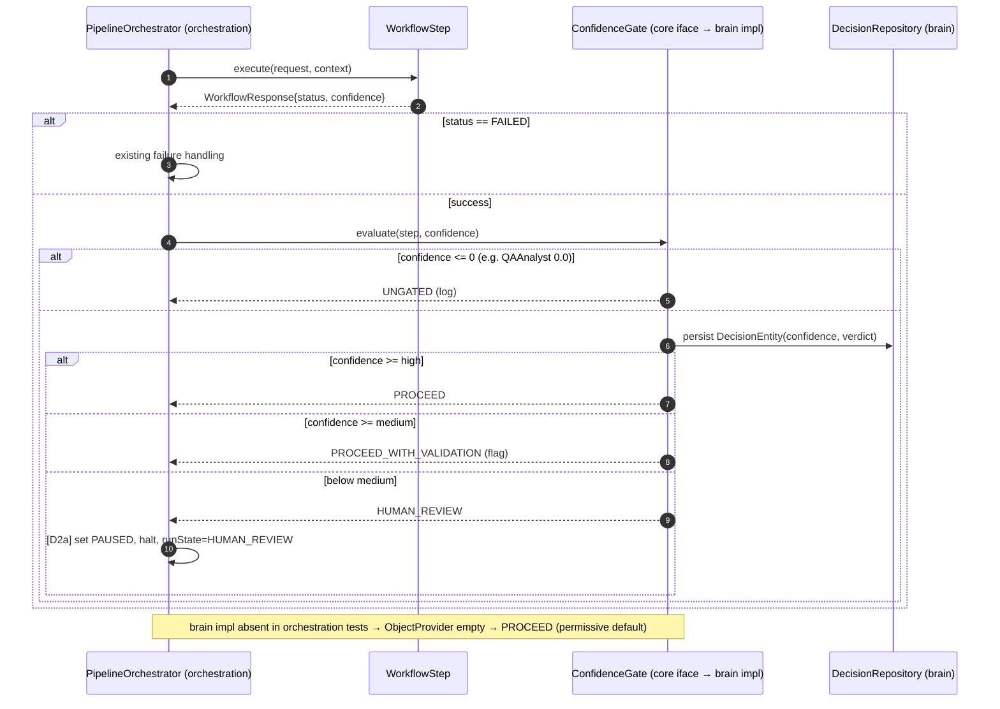

# AI-1 — Technical Design: Implement the AI Confidence Score Gate

**Version:** 1.0.0
**Document Type:** Implementation Technical Design
**Document Status:** Draft — Awaiting Approval (no code until approved)
**Last Updated:** 2026-07-22
**Roadmap item:** [`AI-1`](./AI-QA-OS-Improvement-Roadmap.md) (v2.2.0, frozen) — 🟠 P1 · Effort M · Owner AI/Brain · Phase 1 · v1.4
**Module:** `ai-qa-os-brain` (contract in `ai-qa-os-core`; integrated by `ai-qa-os-orchestration`)
**Governing ADRs:** [ADR-001](./AI-QA-OS-Architecture-Decisions.md) (QA Brain = central decision authority) · Rule 2 (all decisions through the Brain). **Prerequisite for:** AI-2 (human-in-the-loop).

> **Scope discipline.** Implements **only** AI-1: a confidence gate owned by the Brain, evaluated after each pipeline step. It does **not** implement the human-approval workflow (AI-2), does not make agents compute *better* confidence values, and does not change agent logic.

---

## 0. Roadmap Verification & Grounded Findings

### 0.1 What AI-1 requires (from the finalized roadmap)

> The Vision defines a confidence gate (≥90% auto-proceed, 70–89% proceed-with-validation, <70% human review)… No implementation exists, so every AI output is trusted equally regardless of certainty… A decision stage **owned by `ai-qa-os-brain`** (Rule 2), **evaluated after each agent output in the orchestration pipeline**, feeding the validation step. Prerequisite for AI-2 — the <70% branch has to route somewhere.

### 0.2 Verified facts (read during design)

| Fact | Detail |
|---|---|
| Confidence already exists | `com.aiqaos.core.contract.AgentResponse` has `double confidenceScore`. Agents call `response.setConfidenceScore(...)`. |
| …but it's mostly hardcoded | Most agents set `0.95`; **`QAAnalystAgent` sets `0.0`** ("No hardcoding value" — a placeholder). LLM JSON `confidence` is normalized to `0.0` when absent by `LLMResponseValidator`. |
| Gate home exists, empty | `com.aiqaos.brain.component.ConfidencePolicyManager` and `DecisionEngine` are **empty `@Component` stubs**. `DecisionEntity` (brain) already persists a `confidence` + `DecisionRepository`. |
| Pipeline shape | `AutonomousQAPipelineOrchestrator.runPipeline()` loops 9 `WorkflowStep`s, calling `executeWithRetry` → each returns `WorkflowResponse` (fields: `status`, `message`, `runState`, `outputs` map). Failure = `"FAILED".equals(status)`. |
| State machine | `WorkflowStateMachine` states: CREATED · VALIDATED · READY · RUNNING · **PAUSED** · RESUMED · COMPLETED · FAILED · CANCELLED. `RUNNING → PAUSED` is a legal transition. |

### 0.3 The architectural constraint (dictates the whole design)

**`ai-qa-os-brain` depends on `ai-qa-os-orchestration`, not the reverse** (verified in both POMs). So an orchestration step **cannot** compile-time reference a brain class — doing so would create a dependency cycle. Yet the roadmap requires the gate *owned by the Brain* but *invoked from the orchestration pipeline*.

**Resolution (forced, not a preference):**
- **Contract in `core`** (which both modules already depend on): a `ConfidenceGate` interface + `ConfidenceVerdict` enum, alongside the existing `AgentResponse`/`WorkflowResponse`.
- **Implementation in `ai-qa-os-brain`** (`ConfidencePolicyManager implements ConfidenceGate`) — the Brain owns the decision (Rule 2 / ADR-001), persists it as a `DecisionEntity`.
- **Orchestration** references only the `core` interface and receives the brain impl **at runtime** via Spring. Because orchestration's own test module does not have the brain on its classpath, the orchestrator injects `ObjectProvider<ConfidenceGate>` and uses a **safe permissive default when absent** (same pattern SEC-1/SEC-2 used for optional beans) — so existing orchestration tests keep passing.

### 0.4 The `0.0` landmine (baked-in safeguard, not a fork)

`QAAnalystAgent` reports `confidenceScore = 0.0` today. If the gate treated `0.0` as "<70% → human review," **every run would halt at QA analysis.** Therefore the gate treats **`confidence <= 0` (or absent) as "not reported → ungated → PROCEED (logged)."** It gates only when a genuine positive confidence is present. This makes AI-1 **non-disruptive** to current runs (0.95 → PROCEED; 0.0 → ungated) while the machinery is in place for real confidence values later.

---

## 1. Technical Design

### 1.1 The gate (core contract + brain impl)

- **`core`** — `ConfidenceGate` interface: `ConfidenceVerdict evaluate(ConfidenceDecisionContext ctx)` where the context carries `stepName`, `confidence`, `correlationId`. `ConfidenceVerdict` enum: `PROCEED` (≥ high), `PROCEED_WITH_VALIDATION` (medium ≤ c < high), `HUMAN_REVIEW` (below medium), `UNGATED` (confidence ≤ 0 / absent).
- **`ai-qa-os-brain`** — `ConfidencePolicyManager implements ConfidenceGate`: applies thresholds, records a `DecisionEntity` (confidence + verdict + step) via `DecisionRepository`, publishes/logs the decision. Thresholds are **configuration-driven**: `aiqaos.brain.confidence.high` (default `0.90`), `aiqaos.brain.confidence.medium` (default `0.70`).

### 1.2 Integration into the pipeline

In `AutonomousQAPipelineOrchestrator.runPipeline`, **after a step succeeds**, obtain the step's confidence and call the gate:

- **Confidence plumbing** — steps surface their agent's confidence on the response. This design adds a typed `double confidence` field to `WorkflowResponse` (core), which each step sets from its `AgentResponse.confidenceScore` (a small, uniform change; steps that have no agent output leave it `0` → UNGATED). *(Alternative plumbing options in §0.5 decision.)*
- **Routing by verdict:**
  - `PROCEED` / `UNGATED` → continue (UNGATED logged at debug).
  - `PROCEED_WITH_VALIDATION` → continue, but record the verdict and flag the step's output for the existing `LLMResponseValidator` emphasis (timeline event + decision record).
  - `HUMAN_REVIEW` → **[decision — see §0.5]** record the decision and either **pause** the pipeline (set `PAUSED`, halt further steps, return a `HUMAN_REVIEW` run-state) or **warn-and-continue**. AI-2 later turns the paused state into a real approve/resume flow.

### 1.3 What AI-1 deliberately leaves for later

- **AI-2** owns the actual human approval/resume UI + endpoint; AI-1 only produces the gated decision + (optionally) the paused state.
- **Better confidence values** from agents (esp. `QAAnalystAgent`) are the agents' concern, not AI-1.
- **Deep validation coupling** (PROCEED_WITH_VALIDATION → richer `LLMResponseValidator` behaviour) beyond recording the verdict is a follow-up.

### 0.5 / Decisions for approval

| # | Decision | Options | Recommendation |
|---|---|---|---|
| **D1 — Confidence plumbing** | How the orchestrator gets each step's confidence | **(a)** typed `WorkflowResponse.confidence` field set by each step; **(b)** read from `AutonomousQAWorkflowState` per step; **(c)** `WorkflowResponse.outputs["confidence"]` untyped map entry | **(a)** — one typed core field, uniform, least fragile |
| **D2 — HUMAN_REVIEW behaviour (pre-AI-2)** | What a `<medium` verdict does before AI-2 exists | **(a)** pause + halt (set `PAUSED`, stop pipeline, `runState=HUMAN_REVIEW`); **(b)** warn + continue (record, don't block) | **(a)** — a gate that doesn't stop isn't a gate; the `0.0`-ungated safeguard means it won't fire spuriously. But it *will* block any genuinely-low-confidence run until AI-2 — confirm that's acceptable |

*(These two are the closing question. Everything else — core-contract shape, brain ownership, ObjectProvider, `0.0`=ungated, config-driven thresholds — is fixed by the constraints above.)*

> ✅ **Decisions (confirmed 2026-07-22):**
> - **D1 = (a) typed `WorkflowResponse.confidence`** — each step sets it from its agent's `AgentResponse.confidenceScore`.
> - **D2 = (a) pause + halt** — a `HUMAN_REVIEW` verdict records the decision, sets the workflow `PAUSED` with `runState=HUMAN_REVIEW`, and stops the pipeline. The `0.0`=ungated safeguard prevents spurious halts; a genuinely low-confidence run blocks until AI-2 adds approve/resume.

---

## 2. Folder Structure

`[N]` new, `[M]` modified. `†` = depends on D1(a).

```
AI-QA-OS-Core/
├── ai-qa-os-core/src/main/java/com/aiqaos/core/
│   ├── contract/
│   │   ├── ConfidenceGate.java               [N] gate interface (both modules depend on core)
│   │   ├── ConfidenceVerdict.java            [N] enum: PROCEED / PROCEED_WITH_VALIDATION / HUMAN_REVIEW / UNGATED
│   │   ├── ConfidenceDecisionContext.java    [N] stepName, confidence, correlationId
│   │   └── WorkflowResponse.java             [M]† add typed `double confidence`
│   └── enums/ (WorkflowStatus)               [M] add HUMAN_REVIEW if absent (D2a) — verify at impl
├── ai-qa-os-brain/src/main/java/com/aiqaos/brain/
│   ├── component/ConfidencePolicyManager.java [M] empty stub → implements ConfidenceGate (thresholds, persist DecisionEntity)
│   └── config/ (BrainConfig / properties)     [M] confidence threshold properties
└── ai-qa-os-orchestration/src/main/java/com/aiqaos/workflow/pipeline/
    ├── AutonomousQAPipelineOrchestrator.java  [M] inject ObjectProvider<ConfidenceGate>; evaluate after each step; route
    └── (the 9 *Step classes)                  [M]† set WorkflowResponse.confidence from AgentResponse.confidenceScore
tests:
    ├── ai-qa-os-brain/.../ConfidencePolicyManagerTest.java   [N] threshold/verdict matrix + 0.0-ungated
    └── ai-qa-os-orchestration/.../…PipelineTest             [M] gate absent (ObjectProvider empty) → unchanged behaviour
```

---

## 3. Required Classes

| Class | Type | Module | Responsibility |
|---|---|---|---|
| `ConfidenceGate` | New | core | Interface: `evaluate(context) → verdict` |
| `ConfidenceVerdict` | New | core | Enum of the four outcomes |
| `ConfidenceDecisionContext` | New | core | Inputs to a gate evaluation |
| `WorkflowResponse` | Modified † | core | Add typed `confidence` |
| `ConfidencePolicyManager` | Modified | brain | Implements `ConfidenceGate`: thresholds (config), persists `DecisionEntity`, logs/publishes |
| `AutonomousQAPipelineOrchestrator` | Modified | orchestration | Inject `ObjectProvider<ConfidenceGate>`; after each successful step, evaluate + route |
| 9 `*Step` classes | Modified † | orchestration | Set `WorkflowResponse.confidence` from the agent's `AgentResponse.confidenceScore` |
| `WorkflowStatus` enum | Modified | core | Add `HUMAN_REVIEW`/reuse `PAUSED` (D2a) |

**Leveraged unchanged:** `DecisionEntity`, `DecisionRepository`, `AgentResponse`, `LLMResponseValidator`, `WorkflowStateMachine`.

---

## 4. Database Changes

**Conditional.** The gate persists decisions via the existing `DecisionEntity` (which already has `confidence`). If `DecisionEntity` lacks a `verdict`/`step` column needed for the audit, a **Flyway migration `V14__brain_decision_gate_fields.sql`** adds them (nullable). To confirm at implementation Step 1 — if the entity already suffices, **no migration**. No change to `ddl-auto` (validate) discipline.

---

## 5. API Changes

**None to existing endpoints.** No new REST surface (AI-2 adds the approval endpoint). Behavioural: a run may now end in a `HUMAN_REVIEW`/paused state (D2a) instead of always COMPLETED/FAILED — surfaced through the existing workflow status/`runState`, not a new API.

---

## 6. Sequence Diagram



---

## 7. Step-by-Step Implementation Plan

1. **Verify (read-only).** Confirm `DecisionEntity` fields (does it need `verdict`/`step`? → drives §4), `WorkflowStatus` enum values (need `HUMAN_REVIEW`/`PAUSED`?), and how each step obtains its `AgentResponse` (to set `confidence`).
2. **core contracts.** Add `ConfidenceGate`, `ConfidenceVerdict`, `ConfidenceDecisionContext`; add `confidence` to `WorkflowResponse` (D1a); add the status value if needed.
3. **brain impl.** `ConfidencePolicyManager implements ConfidenceGate` — config thresholds, `0.0`=UNGATED safeguard, persist `DecisionEntity`. Unit test the verdict matrix.
4. **orchestration wiring.** Inject `ObjectProvider<ConfidenceGate>`; after each successful step, read `confidence`, evaluate, route per D2. Steps set `WorkflowResponse.confidence` from their agent response.
5. **Tests.** brain `ConfidencePolicyManagerTest` (PROCEED/VALIDATION/HUMAN_REVIEW/UNGATED incl. `0.0`); confirm orchestration tests still pass with the gate **absent** (permissive default) — no regression to the quarantined-or-passing pipeline tests.
6. **Build & validate.** `mvn -pl ai-qa-os-brain -am test`; confirm the gateway/dashboard apps still compile (they get the real gate bean). Report honestly (full pipeline run needs a live env).
7. **Sync governance docs.** Tracker `AI-1` status; note AI-2 unblocked; add an ADR only if the core-contract/brain-impl split is deemed a recorded decision (recommended — it's a real architectural choice).

**Definition of Done:** the Brain owns a working confidence gate (contract in core, impl in brain); the orchestrator evaluates it after each step and routes PROCEED / PROCEED_WITH_VALIDATION / HUMAN_REVIEW; `0.0`/absent is ungated (no spurious halts); thresholds are config-driven; decisions are persisted; orchestration tests pass with the gate absent; tracker updated.

---

## Implementation Outcome

Implemented 2026-07-22 (D1 typed field; D2 pause+halt). Recorded as **ADR-010**.

**Files:**
- `core` [N] — `ConfidenceGate`, `ConfidenceVerdict` (PROCEED / PROCEED_WITH_VALIDATION / HUMAN_REVIEW / UNGATED), `ConfidenceDecisionContext`; [M] `WorkflowResponse` gains `double confidence`.
- `ai-qa-os-brain` [M] — `ConfidencePolicyManager` (empty stub → `implements ConfidenceGate`): config thresholds (`aiqaos.brain.confidence.high=0.90`, `.medium=0.70`), `0.0`=UNGATED safeguard, best-effort `DecisionEntity` persistence; brain `pom.xml` gains test scope; `ConfidencePolicyManagerTest` [N].
- `ai-qa-os-orchestration` [M] — orchestrator injects `ObjectProvider<ConfidenceGate>`, evaluates after each successful step, and on `HUMAN_REVIEW` sets `PAUSED` + `runState=HUMAN_REVIEW` and halts; the **8 agent-calling steps** each set `WorkflowResponse.confidence` from `AgentResponse.confidenceScore`; `AutonomousQAPipelineTest` constructor call updated with a no-op provider.

**No DB migration** — `DecisionEntity`'s existing `decision`/`confidence`/`userInput`/`decisionId`/`timestamp` columns suffice. **No enum change** — reused `WorkflowStatus.PAUSED`.

**Validation (JDK 25 / Maven):**
- Chain (core+brain+orchestration) compiles + installs.
- Brain `ConfidencePolicyManagerTest`: **4/4** (verdict matrix + 0.0-ungated).
- Orchestration: **BUILD SUCCESS**, 35 run / 0 fail / 4 quarantined-skipped — **no regression** (no-op gate preserves behaviour).
- Gateway + dashboard **compile** with the real gate wiring.
- **Not executed here:** a full live pipeline run exercising a real HUMAN_REVIEW pause (needs a live env + an agent that reports a genuinely low confidence — today all report 0.95/0.0, so gating is inert until FI-AI1-A).

**Consequence:** the `PAUSED` / `runState=HUMAN_REVIEW` state is produced but not yet resumable — **AI-2** turns it into an approve/resume flow.

---

## Appendix — Future Ideas (Outside Current Roadmap)

- **FI-AI1-A — Real confidence from agents** (esp. `QAAnalystAgent`, which reports `0.0`): derive confidence from LLM signals / validation, so the gate has meaningful inputs. (Agent work, not AI-1.)
- **FI-AI1-B — Feed PROCEED_WITH_VALIDATION into deeper `LLMResponseValidator` checks**, not just a recorded flag.
- **FI-AI1-C — Surface gate decisions on the dashboard** (ties to OBS-3 / GOV-1 audit).

---

## Compliance Checklist

| Rule | Status |
|---|---|
| Roadmap not modified | ✅ AI-1 metadata untouched |
| No new roadmap items/categories/modules | ✅ fills existing brain stubs + a core contract |
| Dependency rule respected | ✅ contract in `core`; brain impl; orchestration via `core` iface + ObjectProvider — no cycle |
| ADR-001 / Rule 2 | ✅ decision owned by the Brain |
| No behaviour regression | ✅ `0.0`=ungated + permissive default when gate absent |
| Out-of-scope items untouched | ✅ AI-2 approval flow, agent confidence quality deferred |

---

## Document Completion Status

**Status:** Implemented — 2026-07-22 (D1 = typed `WorkflowResponse.confidence`, D2 = pause + halt; see [Implementation Outcome](#implementation-outcome))
**Version:** 1.0.0
**Implements:** `AI-1` (roadmap v2.2.0, frozen)
**Next step:** On approval + D1/D2 choices, execute [§7](#7-step-by-step-implementation-plan) from Step 1. No code until approved.
