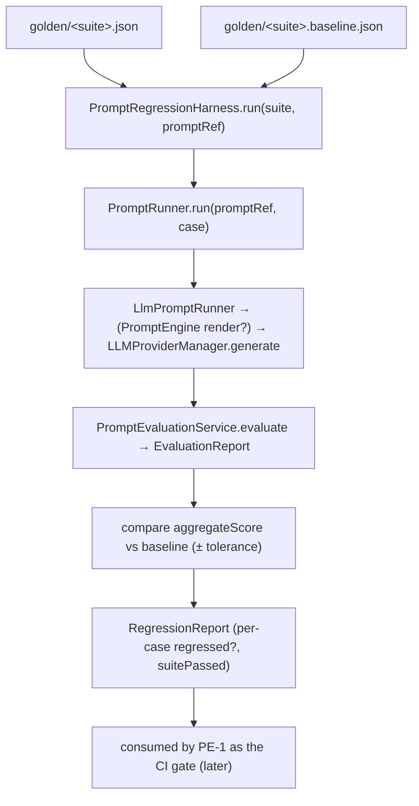

# AI-3 — Technical Design: Prompt Evaluation & Regression Harness

**Version:** 1.0.0
**Document Type:** Implementation Technical Design
**Document Status:** Implemented — 2026-07-22 (Option A committed-baseline; see [Implementation Outcome](#implementation-outcome))
**Last Updated:** 2026-07-22
**Roadmap item:** [`AI-3`](./AI-QA-OS-Improvement-Roadmap.md#ai-3--prompt-evaluation-and-regression-harness) (v2.2.0, frozen) — 🟠 P1 · Effort M · Owner AI/Eval · Phase 1 · v1.4
**Module:** `ai-qa-os-eval` (from MOD-3) consuming `ai-qa-os-intelligence` prompt versions.
**Depends on:** **MOD-3** (done — evaluators, `PromptEvaluationService`, `GoldenDatasetProvider`).

> **Scope discipline.** AI-3 builds the **runnable regression harness** on top of MOD-3: load a golden set → produce prompt outputs → evaluate → **compare against a baseline → flag regressions**. It does **not** ship the formal "Prompt Score" product, benchmark leaderboard, or the CI merge-gate (**PE-1**), A/B experiment routing (**PE-2**), or the quality dashboard (**PE-3**). It is the *engine* those operationalise.

---

## 0. Roadmap Verification & the AI-3 / PE-1 Boundary

### 0.1 What AI-3 requires

> Prompts are the platform's core logic, yet a prompt change ships with no way to know whether it improved or regressed output quality... there is no evaluation against a golden set. This is the AI equivalent of shipping code with tests disabled. **Where:** the `ai-qa-os-eval` module, consuming `intelligence` prompt versions and `memory` for golden examples. Expanded into a full programme in Category Q.

### 0.2 The boundary with PE-1 (they are adjacent — both P1/v1.4/AI-Eval)

The frozen roadmap draws a real line: AI-3 is the **harness**; PE-1 *operationalises* it into a scoring/benchmarking discipline wired into CI.

| Concern | **AI-3 (this item)** | PE-1 / PE-2 / PE-3 (later) |
|---|---|---|
| Run a golden suite through a prompt & evaluate | ✅ the engine | uses it |
| Regression detection vs a baseline | ✅ core | uses it |
| Golden dataset storage | **classpath/file JSON** (versionable, CI-friendly) | memory-backed, managed datasets (PE-1) |
| Formal **Prompt Score** per version + benchmark leaderboard | ❌ | ✅ PE-1 / PE-2 |
| **CI merge-gate** wiring (block a PR on regression) | ❌ (harness is runnable, but not the gate) | ✅ PE-1 (+ MNT-1) |
| Prompt A/B routing / leaderboard | ❌ | ✅ PE-2 |
| Dashboard | ❌ | ✅ PE-3 |

So AI-3 ships a harness that **can** be run and returns a pass/fail + regression report; making that the enforced CI gate and the productised Prompt Score is PE-1.

### 0.3 Verified seams (read during design)

| Seam | Detail |
|---|---|
| MOD-3 eval | `PromptEvaluationService.evaluate(case, output, suite, promptVersion)` → `EvaluationReport` (aggregate score, pass/fail); `Evaluator`s; `GoldenDatasetProvider`. |
| Prompt rendering | Core contract `PromptEngine<PromptRequest,PromptResponse>.renderPrompt(...)` → `PromptResponse.getRenderedContent()` (impl `PromptManagerImpl` in `intelligence`). Optional — resolves a versioned prompt. |
| LLM execution | `LLMProviderManager.generate(LLMRequest)` → `LLMResponse.getText()` (from `ai-provider`). |

### 0.4 / Decision for approval — where the regression **baseline** lives

A regression harness needs a reference point ("what the scores were before"). Two credible homes:

| Option | Baseline store | Trade-off |
|---|---|---|
| **A — Committed baseline file (recommended)** | A versioned JSON file per suite (`golden/<suite>.baseline.json`), loaded/saved by a `FileBaselineStore` | "Prompts as source code": git-diffable, deterministic, **runs in CI with no DB** (matches PE-1's CI intent), explicit "update baseline" step. Adds a small file-update flow. |
| **B — DB history** | Query MOD-3's persisted `EvaluationResultEntity` for the prior scores | Reuses MOD-3 persistence, no extra files — but **non-deterministic** (depends on DB state) and CI has no Postgres, so the harness couldn't run there; better suited to PE-3's dashboards over history. |

**Recommend A** — a regression harness's whole value is a stable, reviewable reference that runs in CI without infrastructure; a committed baseline is the standard (snapshot-test) pattern and aligns with PE-1's "wired into CI." B's persisted results still exist (MOD-3 writes them) and feed PE-3 later. This is the one decision I need before coding.

> ✅ **Decision (confirmed 2026-07-22): Option A — committed baseline file.** `FileBaselineStore` reads/writes `golden/<suite>.baseline.json`; MOD-3's DB-persisted eval results remain available for PE-3.

---

## 1. Technical Design

New classes in `ai-qa-os-eval` (packages `com.aiqaos.eval.dataset` and `com.aiqaos.eval.harness`):

### 1.1 Golden dataset (versionable)
- **`ClasspathGoldenDatasetProvider implements GoldenDatasetProvider`** — loads a suite from a classpath JSON resource (`golden/<suite>.json`) into `EvaluationCase`s (Jackson). Versionable and CI-friendly. *(MOD-3 gave the interface + an in-memory ref; memory-backed managed datasets are PE-1.)*

### 1.2 Producing outputs (the prompt runner seam)
- **`PromptRunner`** (seam) — `String run(String promptRef, EvaluationCase testCase)`: produce the actual output for a case under a named prompt version.
- **`LlmPromptRunner`** (reference impl) — optionally renders `promptRef` via `PromptEngine` (injected `ObjectProvider`, so it degrades gracefully when `intelligence` rendering isn't wired), otherwise uses the case input; then executes via `LLMProviderManager` and returns the text. This is what "consumes `intelligence` prompt versions" concretely.

### 1.3 Baseline (Option A)
- **`Baseline`** — a suite's per-case reference scores (caseId → score).
- **`BaselineStore`** (seam) + **`FileBaselineStore`** — load/save a `Baseline` as JSON (`golden/<suite>.baseline.json`).

### 1.4 The harness
- **`RegressionResult`** — per case: `caseId`, `currentScore`, `baselineScore`, `delta`, `regressed`.
- **`RegressionReport`** — the suite's results, `suitePassed` (no case regressed beyond tolerance), and summary deltas.
- **`PromptRegressionHarness`** — orchestrates: load suite (`GoldenDatasetProvider`) → for each case, `PromptRunner.run` → `PromptEvaluationService.evaluate` → compare aggregate score to `Baseline` → build `RegressionReport`. A configurable **tolerance** (default e.g. `0.05`): a case *regresses* when `current < baseline - tolerance`. Also exposes an **update-baseline** call that writes current scores as the new baseline.

### 1.5 What AI-3 defers (the seams it leaves for Category Q)
Enforced CI merge-gate + formal Prompt Score/benchmark (PE-1) · A/B routing & leaderboard (PE-2) · dashboard (PE-3) · memory-backed managed golden datasets (PE-1).

---

## 2. Folder Structure

```
ai-qa-os-eval/src/
├── main/java/com/aiqaos/eval/
│   ├── dataset/   ClasspathGoldenDatasetProvider                       [N]
│   └── harness/   PromptRunner · LlmPromptRunner                       [N]
│                  · Baseline · BaselineStore · FileBaselineStore       [N]
│                  · RegressionResult · RegressionReport                [N]
│                  · PromptRegressionHarness                            [N]
├── main/resources/golden/
│   ├── sample-suite.json            [N] example golden suite
│   └── sample-suite.baseline.json   [N] example baseline (Option A)
└── test/java/com/aiqaos/eval/harness/
    └── PromptRegressionHarnessTest.java                                [N]
```

*(All additive to the MOD-3 module. No changes to other modules; `intelligence` is consumed only through the existing `PromptEngine` core contract.)*

---

## 3. Required Classes (key)

| Class | Type | Responsibility |
|---|---|---|
| `ClasspathGoldenDatasetProvider` | New | Load a golden suite from classpath JSON |
| `PromptRunner` / `LlmPromptRunner` | New | Seam + reference for producing prompt outputs |
| `Baseline` / `BaselineStore` / `FileBaselineStore` | New | Regression reference point (Option A: file) |
| `RegressionResult` / `RegressionReport` | New | Per-case & suite regression verdict |
| `PromptRegressionHarness` | New | Orchestrate run → evaluate → compare → report |

---

## 4. Database Changes

**None.** AI-3 reuses MOD-3's persistence (eval results are already written by `PromptEvaluationService`). The baseline is a committed file (Option A), not a table.

---

## 5. API Changes

**None.** AI-3 is a library/harness consumed programmatically and by a test. Endpoints/CI-gating are PE-1/PE-3.

---

## 6. Sequence Diagram



---

## 7. Step-by-Step Implementation Plan

1. **Golden dataset loader** — `ClasspathGoldenDatasetProvider` + a `sample-suite.json` resource.
2. **Runner seam** — `PromptRunner` + `LlmPromptRunner` (LLM via `LLMProviderManager`; optional `PromptEngine` render via `ObjectProvider`).
3. **Baseline (Option A)** — `Baseline`, `BaselineStore`, `FileBaselineStore` + a `sample-suite.baseline.json`.
4. **Report types** — `RegressionResult`, `RegressionReport`.
5. **Harness** — `PromptRegressionHarness` (load → run → evaluate → compare → report; configurable tolerance; update-baseline call).
6. **Test** — `PromptRegressionHarnessTest`: a stub `PromptRunner` + tiny suite + baseline → asserts a dropped score is flagged `regressed`/`suitePassed=false`, and an equal/better score passes; no live LLM (JDK-25: hand-written stubs, no Mockito).
7. **Build & validate** — `mvn -pl ai-qa-os-eval -am test`; confirm eval tests (MOD-3's 16 + AI-3's) green and the reactor builds. Report honestly.
8. **Sync docs** — tracker `AI-3` → Completed; note it as the engine PE-1 will gate; **ADR-013** (regression baseline as a committed file — a real, PE-1-shaping decision).

**Definition of Done:** the harness loads a golden suite, produces outputs through the runner seam, evaluates via MOD-3, compares to a committed baseline, and returns a `RegressionReport` with a correct pass/fail; unit-tested; PE-1 has a concrete engine + baseline convention to wire into CI.

---

## Implementation Outcome

Implemented 2026-07-22 as **Option A — committed baseline file**. Recorded as **ADR-013**.

**Files (all new, in `ai-qa-os-eval`):**
- **dataset/** — `ClasspathGoldenDatasetProvider` (loads `golden/<suite>.json`).
- **harness/** — `PromptRunner` (seam) + `LlmPromptRunner` (LLM via `LLMProviderManager`; optional versioned-prompt render via `ObjectProvider<PromptEngine<PromptRequest,PromptResponse>>` — degrades to the case input); `Baseline` + `BaselineStore` + `FileBaselineStore` (`golden/<suite>.baseline.json`); `RegressionResult` + `RegressionReport`; `PromptRegressionHarness` (`run` + `updateBaseline`, tolerance 0.05).
- **resources/golden/** — `sample-suite.json`, `sample-suite.baseline.json`.
- **test/** — `PromptRegressionHarnessTest` (5): regression flagged on score drop, pass on meet, no-baseline = no regression, `updateBaseline` round-trip, classpath suite load.

**Validation (JDK 25 / Maven):**
- `mvn -pl ai-qa-os-eval test` → **21/21** (MOD-3's 16 + AI-3's 5), **BUILD SUCCESS**.
- No Mockito (JDK-25) — stub `PromptRunner` lambda + `@TempDir` file baseline + no-op `ObjectProvider`.

**Honest scope note:** AI-3 is the **engine**. `LlmPromptRunner`'s live LLM path and versioned-prompt rendering only activate when the module is wired into a running app with `ai-provider`/`intelligence` beans (eval is still a leaf — see MOD-3 outcome); the harness's tested path uses a stub runner. Turning `RegressionReport.isSuitePassed()` into an enforced **CI merge-gate** and a formal **Prompt Score/benchmark** is **PE-1**; A/B + leaderboard **PE-2**; dashboard **PE-3**; memory-backed managed datasets **PE-1**. The committed baseline is the reference; MOD-3's DB results remain for PE-3.

---

## Appendix — Future Ideas (Outside Current Roadmap)

- **FI-AI3-A** — Statistical regression (variance-aware thresholds / multi-sample runs) rather than a single-score delta.
- **FI-AI3-B** — Auto-open a "prompt regression" finding into the human-review queue (AI-2) when a suite fails.

---

## Compliance Checklist

| Rule | Status |
|---|---|
| Roadmap not modified | ✅ AI-3 metadata untouched |
| Dependency rule | ✅ additive to `ai-qa-os-eval`; consumes `core` `PromptEngine` + `ai-provider`; no new module deps reversed |
| PE-1/PE-2/PE-3 scope untouched | ✅ CI-gate / Prompt Score / A-B / dashboard deferred to their items |
| No behaviour change to existing modules | ✅ new classes only |
| ADR discipline | ✅ ADR-013 to be recorded (baseline-as-file) |

---

## Document Completion Status

**Status:** Implemented — 2026-07-22 (Option A — committed baseline file). See [Implementation Outcome](#implementation-outcome).
**Version:** 1.0.0
**Implements:** `AI-3` (roadmap v2.2.0, frozen)
