# AI-QA-OS — Platform Documentation

**Version:** 1.2.1
**Document Type:** Consolidated Platform Documentation
**Document Status:** Active
**Last Updated:** 2026-07-30
**Applies To:** `AI-QA-OS-Core` (1.0.0-SNAPSHOT), `ai-qa-os-dashboard-ui` (0.0.0), `AI-QA-OS-Docs` (1.1.0)

> **Scope note.** This document describes the platform **as it exists in the working tree today**, and separately identifies what the design documents specify but the code does not yet implement. Where the two diverge, the divergence is called out explicitly in [§15 Gap Analysis](#15-gap-analysis-design-vs-implementation). Nothing here is aspirational unless it is labelled as such.

> **⚠️ Status-reconciliation banner (2026-07-30).** This narrative was first written at an early snapshot and is refreshed incrementally. Many "gap" and "not built" statements below have since been closed by roadmap items (58 completed to date). **For authoritative, per-item current status, the source of truth is [`AI-QA-OS-Implementation-Tracker.md`](./AI-QA-OS-Implementation-Tracker.md) and the [`AI-QA-OS-Architecture-Decisions.md`](./AI-QA-OS-Architecture-Decisions.md) ADR log (053 ADRs).** Notable changes since the original snapshot: authentication is now real deny-by-default (SEC-1, ADR — toggle `aiqaos.security.enabled`), a strict CSP is in place (SEC-4), the AI Confidence Score gate is implemented (AI-1, ADR-010), the reactor is now **22 modules** (was 20; added `ai-qa-os-tenant` + `ai-qa-os-notification`), and local infrastructure (Postgres/Redis/Qdrant/Kafka/MinIO via a `compose` profile) is provisioned (Phase 1, ADR-053). Individual sections below carry inline corrections where they were most misleading.

---

## Table of Contents

1. [Project Overview](#1-project-overview)
   - [1.6 If You're New to AI-QA-OS](#16-if-youre-new-to-ai-qa-os) 👈 start here
   - [1.7 How a User Story Becomes a Test Report](#17-how-a-user-story-becomes-a-test-report)
2. [System Architecture](#2-system-architecture)
   - [2.7 End-to-End AI Workflow](#27-end-to-end-ai-workflow)
   - [2.8 Complete Request Lifecycle](#28-complete-request-lifecycle)
   - [2.9 Agent Communication Rules](#29-agent-communication-rules)
   - [2.10 AI Decision Flow](#210-ai-decision-flow)
   - [2.11 Provider Selection Flow](#211-provider-selection-flow)
   - [2.12 Memory Lifecycle](#212-memory-lifecycle)
   - [2.13 Prompt Lifecycle](#213-prompt-lifecycle)
   - [2.14 Module Dependency Graph](#214-module-dependency-graph)
3. [Repository Structure](#3-repository-structure)
4. [The Three Repositories](#4-the-three-repositories)
5. [Features](#5-features)
6. [Technology Stack](#6-technology-stack)
7. [Installation and Setup](#7-installation-and-setup)
8. [Configuration](#8-configuration)
9. [Running the Project](#9-running-the-project)
10. [Folder Structure](#10-folder-structure)
11. [Development Workflow](#11-development-workflow)
12. [API and Service Integration](#12-api-and-service-integration)
13. [Testing](#13-testing)
14. [Deployment Process](#14-deployment-process)
15. [Gap Analysis: Design vs Implementation](#15-gap-analysis-design-vs-implementation)
16. [Future Enhancements](#16-future-enhancements)
17. [Contributing Guidelines](#17-contributing-guidelines)
18. [License](#18-license)

---

## 1. Project Overview

### 1.1 What AI-QA-OS Is

AI-QA-OS (Artificial Intelligence Quality Assurance Operating System) is an enterprise-grade, AI-powered Quality Engineering platform. As stated in `01_PROJECT_VISION.md`:

> "The platform is designed to automatically understand software requirements, generate complete testing assets, execute automation, analyze failures, generate bug reports, produce reports, and continuously improve itself using AI."
>
> "Unlike a traditional automation framework, AI-QA-OS acts as a complete intelligent QA ecosystem where multiple AI Agents collaborate to perform end-to-end software quality engineering."

In concrete terms: you point the platform at a requirement document (a Markdown user story), and it runs an autonomous pipeline that reads the requirement, analyses it, generates test cases, generates Playwright automation scripts, executes them in a real browser, attempts to self-heal failures, analyses defects, produces a report, and feeds what it learned back into memory.

### 1.2 The Problem It Solves

Traditional QA automation requires a human to build and maintain a bespoke framework per project. The stated objectives are to:

1. Eliminate repetitive QA activities
2. Reduce automation development time
3. Improve testing quality using AI
4. Generate reusable automation code
5. Support multiple automation frameworks
6. Minimise human intervention
7. Automatically detect defects
8. Automatically generate bug reports
9. Maintain enterprise coding standards
10. Build a reusable AI operating system for Quality Engineering

### 1.3 Construction Philosophy

> "AI-QA-OS follows a **Build Once, Use Everywhere** philosophy. The platform core should be created only once. Multiple projects should consume the same platform."
> — `00_FOUNDATION_BLUEPRINT.md` §3

Every project uses the same AI Brain, Workflow Engine, Agent Framework, and Prompt System. Only project-specific configuration changes.

### 1.4 Core Principles

| Principle | Meaning |
|---|---|
| **Modularity** | "Each AI Agent must perform only one responsibility." |
| **AI First** | "Every major decision should be performed using AI instead of hardcoded logic wherever practical." |
| **Configuration Driven** | "Business rules should never be hardcoded." |
| **Reusability** | Platform core is written once, consumed by many projects |
| **Scalability** | Horizontal scale via stateless services |
| **Extensibility** | New agents and providers plug in without core changes |

Every component must additionally be **Independent, Replaceable, Extensible, Observable, and Secure** (`00_FOUNDATION_BLUEPRINT.md` §5).

### 1.5 Current Maturity

| Aspect | Status |
|---|---|
| Core platform (Java) | **Substantially implemented** — a Maven multi-module backend with three runnable Spring Boot apps |
| Autonomous pipeline | **Working end to end** — nine pipeline steps, with recorded Playwright execution runs on disk |
| Dashboard UI (React) | **Partially wired** — a minority of pages call the backend; the rest render mock data |
| Documentation repo | **Framework only** — `00-Foundation/` holds the complete architecture; the `docs/` build log has zero authored steps |
| Authentication | **Implemented and enforced** — real deny-by-default chain gated by `aiqaos.security.enabled` (SEC-1); the old `WebSecurityCustomizer.ignoring()` bypass is removed. Set the flag `false` only for open local dev |
| Test coverage | **Thin** — roughly half the backend modules have tests; the remainder and the UI have effectively none |

---

### 1.6 If You're New to AI-QA-OS

This is a long document. You do not need to read it top to bottom. Follow this path and you will understand the platform quickly, in the order that builds context naturally — *what it is*, then *how it's shaped*, then *how it runs*, then *where the gaps are*.

| # | Read this | Where | Why it comes here |
|---|---|---|---|
| 1 | **Project Vision** | [§1.1–§1.3](#11-what-ai-qa-os-is) | Understand the product before the code — what problem it solves and the "Build Once, Use Everywhere" philosophy |
| 2 | **Overall Architecture** | [§2.1–§2.2](#21-designed-layer-model) | The layer model and the runtime service map |
| 3 | **End-to-End Workflow** | [§2.7](#27-end-to-end-ai-workflow) | The single most important diagram — a requirement's full journey |
| 4 | **Module Dependency Graph** | [§2.14](#214-module-dependency-graph) | How the 22 modules relate; where `core` sits |
| 5 | **Folder Structure** | [§10](#10-folder-structure) | Now the module names have meaning, see where they live |
| 6 | **Running the Project** | [§9](#9-running-the-project) | Get it started locally |
| 7 | **Triggering a Workflow** | [§9.4](#94-trigger-an-autonomous-qa-run) | Kick off your first autonomous run |
| 8 | **AI Agent Architecture** | [§2.4](#24-designed-agent-ecosystem) + [§2.9](#29-agent-communication-rules) | The agent roster and the strict communication rules |
| 9 | **Gap Analysis** | [§15](#15-gap-analysis-design-vs-implementation) | What's designed vs actually built — read this before trusting any single claim |

If you only have five minutes, read [§1.7](#17-how-a-user-story-becomes-a-test-report) below — it is the whole platform in one page.

---

### 1.7 How a User Story Becomes a Test Report

This is the platform in miniature: a single Markdown user story travels through the services and comes out the other end as a report on the dashboard. It is the flow most stakeholders and new contributors want to see first.

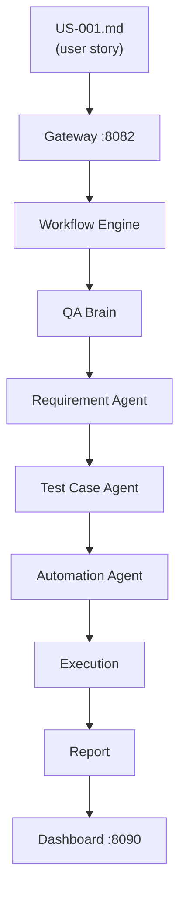

| Step | What happens, in one sentence |
|---|---|
| **US-001.md** | You hand the platform a plain-Markdown requirement via `requirementPath` — no framework, no scaffolding. |
| **Gateway** | The `POST /api/v1/workflows/start` request lands here, is validated, and starts a workflow run. |
| **Workflow Engine** | `AutonomousQAPipelineOrchestrator` instantiates the nine-step pipeline and begins driving it. |
| **QA Brain** | The brain decides the strategy, selects which agents to run, and holds the execution context for the run. |
| **Requirement Agent** | Reads and analyses the story into business rules, validation points, and test scope. |
| **Test Case Agent** | Turns that analysis into concrete test cases — steps, expected results, priority. |
| **Automation Agent** | Generates runnable Playwright automation scripts from the approved test cases. |
| **Execution** | `PlaywrightExecutionEngine` runs the scripts in a real browser, capturing screenshots, video, and logs. |
| **Report** | Results, artifacts, and any failure analysis are assembled into a report. |
| **Dashboard** | The run appears in the UI — live via SSE while it runs, then browsable as history with full artifact playback. |

**Try it yourself:** start the services ([§9.2](#92-run-the-backend-services)), then run `./trigger.ps1` ([§9.4](#94-trigger-an-autonomous-qa-run)) and watch it unfold at `http://localhost:3000/live`.

> This is the *conceptual* spine. The Requirement/Test Case/Automation agents map to `QAAnalystAgent`, `TestCaseGeneratorAgent`, and `ScriptGeneratorAgent` in code, and self-healing, bug analysis, reporting, and learning steps run around them — see the full nine-step pipeline in [§2.3](#23-the-autonomous-qa-pipeline).

---

## 2. System Architecture

### 2.1 Designed Layer Model

The foundation documents specify a six-layer architecture (`00_FOUNDATION_BLUEPRINT.md` §4):

| # | Layer | Responsibility |
|---|---|---|
| 1 | **User Interaction** | CLI, Web Dashboard, REST API, Claude Code Interface |
| 2 | **AI Orchestration** | QA Brain, Workflow Engine, Agent Manager, Prompt Engine |
| 3 | **AI Agent** | The specialist agents |
| 4 | **Knowledge Intelligence** | Knowledge Engine, Memory Engine, RAG Engine, Prompt Repository |
| 5 | **Execution** | Selenium, Playwright, REST Assured, Appium, Database Drivers |
| 6 | **Integration** | GitHub, Jira, Jenkins, MCP Servers, Cloud Services |

> ⚠️ **Known documentation inconsistency.** `02_ENTERPRISE_ARCHITECTURE.md` presents a **seven**-layer variant (Presentation, Intelligence, Orchestration, Agent, Automation, Integration, Data & Knowledge). Both documents are marked `Version: 1.0.0`, so neither supersedes the other. The six-layer model above is used throughout this document because it matches the Blueprint, which is the designated authoritative source.

### 2.2 Runtime Architecture (As Built)

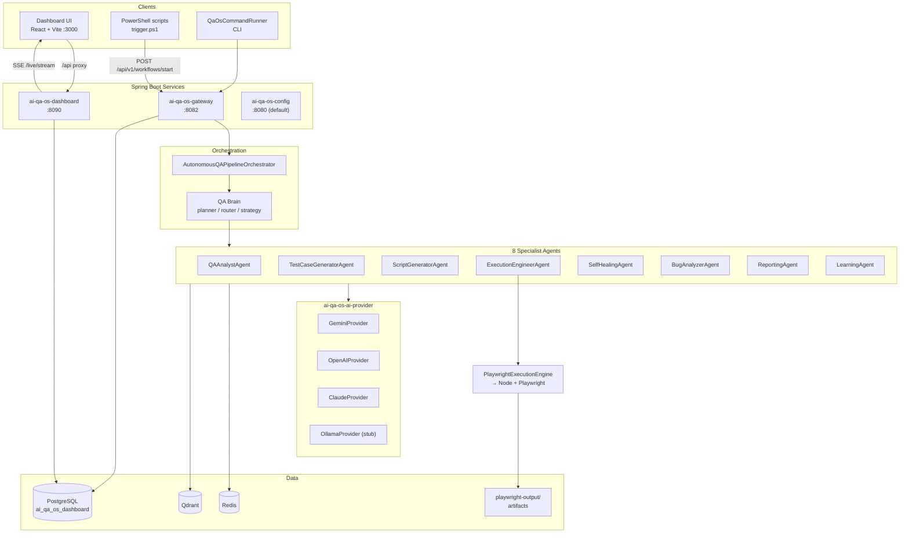

### 2.3 The Autonomous QA Pipeline

The heart of the platform is `AutonomousQAPipelineOrchestrator` in the `ai-qa-os-orchestration` module (note: its Java package is `com.aiqaos.workflow`, not `com.aiqaos.orchestration`). It chains nine steps:

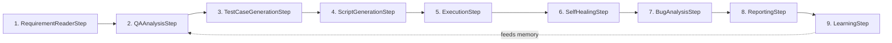

Each step delegates to its corresponding agent. The `LearningStep` closes the loop by writing outcomes back into the memory subsystem, so subsequent runs benefit from prior executions.

### 2.4 Designed Agent Ecosystem

The Blueprint defines nine canonical agents with explicit I/O contracts:

| Agent | Input | Output |
|---|---|---|
| Requirement Agent | User Story / Requirement Doc / Acceptance Criteria | Requirement Analysis, Business Rules, Validation Points, Test Scope |
| Scenario Agent | Requirement Analysis | Positive / Negative / Edge / Boundary cases |
| Test Case Agent | Test Scenarios | Test Case ID, Steps, Expected Result, Priority, Severity |
| Test Data Agent | Test Cases | Valid, Invalid, Boundary, Mock data |
| Automation Agent | Approved Test Cases | Framework structure, Page Objects, Test Scripts, Utilities |
| Execution Agent | Automation Scripts | Execution Status, Logs, Screenshots, Results |
| Failure Analysis Agent | Error Logs, Screenshots, Stack Trace | Root Cause, Failure Category, Recommended Fix |
| Bug Report Agent | Failure Analysis | Bug Summary, Steps, Expected, Actual, Evidence |
| Reporting Agent | Execution Data | HTML Report, PDF Report, Dashboard Data |

Governing rule: **"One Agent = One Responsibility."**

> **Implementation note.** The code implements **8** agents rather than the designed 9, and the names differ: `QAAnalystAgent`, `TestCaseGeneratorAgent`, `ScriptGeneratorAgent`, `ExecutionEngineerAgent`, `SelfHealingAgent`, `BugAnalyzerAgent`, `ReportingAgent`, `LearningAgent`. Notably, the implementation adds a `SelfHealingAgent` and a `LearningAgent` (design treats self-healing as deferred), and folds the Scenario/Test Data agents into other steps.

### 2.5 Architectural Communication Rules

These are hard constraints from `00_FOUNDATION_BLUEPRINT.md`:

| Rule | Constraint |
|---|---|
| **Rule 1** | Agents cannot directly communicate with other agents. Correct path is `Agent → Agent Manager → Agent`. |
| **Rule 2** | All AI decisions must pass through QA Brain. |
| **Rule 3** | All generated outputs must be validated before moving forward. |
| **Rule 4** | All execution data must be stored for future learning. |

Explicitly **disallowed** call paths: `Agent → QA Brain`, `Agent → Workflow Engine`, `Agent → Another Agent`.

### 2.6 AI Confidence Score Gate

Generated output is gated on a confidence score:

| Score | Action |
|---|---|
| 90–100% | Automatically proceed |
| 70–89% | Proceed with validation |
| Below 70% | Request human review |

---

### 2.7 End-to-End AI Workflow

This is the full conceptual journey a single requirement takes through the platform, from a Markdown user story to updated organisational knowledge. It is the designed flow; the implementation realises it through the nine pipeline steps in [§2.3](#23-the-autonomous-qa-pipeline).

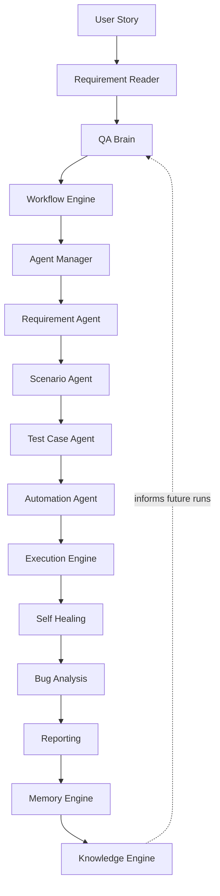

**How to read it.** The upper half (Requirement Reader → Agent Manager) is *decision and coordination* — the QA Brain decides what to do and the Workflow Engine and Agent Manager sequence it. The middle (Requirement Agent → Execution Engine) is *production* — each agent transforms the previous agent's output into the next artifact. The lower half (Self Healing → Knowledge Engine) is *learning* — outcomes are analysed, reported, and folded back into memory and knowledge so the next run starts smarter. The dashed edge is the feedback loop that makes the platform improve over time.

> The Scenario Agent and a standalone Automation Agent are part of the **design**; in code their responsibilities are currently folded into `QAAnalystAgent`, `TestCaseGeneratorAgent`, and `ScriptGeneratorAgent`. See [§2.4](#24-designed-agent-ecosystem) and [§15.2](#152-design-elements-not-yet-implemented).

---

### 2.8 Complete Request Lifecycle

The workflow above is the *conceptual* view. This is the *technical* view of what actually happens to a single request as it moves through the running services and subsystems.

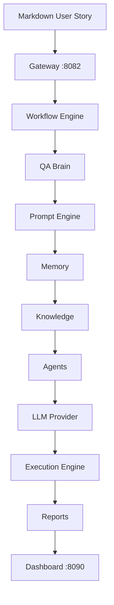

| Stage | What happens | Where in code |
|---|---|---|
| **Markdown User Story** | A requirement file is supplied via `requirementPath` | `resources/user-stories/**` |
| **Gateway** | Receives `POST /api/v1/workflows/start`, validates, dispatches | `GatewayApplication`, workflow controller |
| **Workflow Engine** | Instantiates the pipeline and drives step sequencing | `AutonomousQAPipelineOrchestrator`, `WorkflowStateMachine` |
| **QA Brain** | Decides strategy, selects agents, holds execution context | `ai-qa-os-brain` |
| **Prompt Engine** | Resolves the versioned template for the active step | `ai-qa-os-intelligence` |
| **Memory** | Retrieves relevant prior context | `ai-qa-os-memory` |
| **Knowledge** | Adds curated reference knowledge | knowledge/RAG retrieval |
| **Agents** | The active agent transforms input into the next artifact | `ai-qa-os-agents` |
| **LLM Provider** | The prompt is executed against the selected model | `ai-qa-os-ai-provider` |
| **Execution Engine** | Generated scripts run in a real browser | `PlaywrightExecutionEngine` |
| **Reports** | Results, artifacts, and analysis are assembled | `ai-qa-os-reporting` |
| **Dashboard** | The run becomes visible, live via SSE | `ai-qa-os-dashboard`, UI |

---

### 2.9 Agent Communication Rules

The platform enforces a strict mediation model. An agent never reaches sideways to another agent or upward to the brain — every interaction is routed through the Agent Manager, and every decision through the QA Brain. This is what keeps agents independent and replaceable.

**Allowed path:**

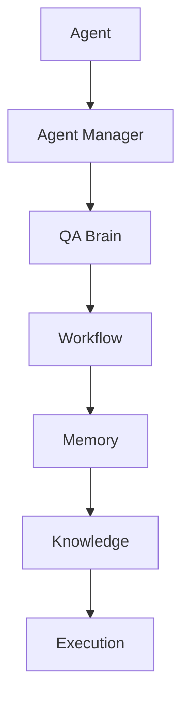

**Explicitly forbidden:**

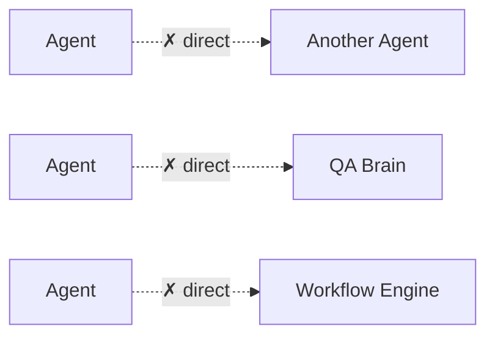

| Rule | Constraint |
|---|---|
| Rule 1 | Agents cannot talk to other agents directly — always `Agent → Agent Manager → Agent` |
| Rule 2 | All AI decisions must pass through QA Brain |
| Rule 3 | All generated outputs must be validated before moving forward |
| Rule 4 | All execution data must be stored for future learning |

**Not allowed:** `Agent → QA Brain`, `Agent → Workflow Engine`, `Agent → Another Agent`.

> **Implementation caveat.** These rules are the designed contract from `00_FOUNDATION_BLUEPRINT.md`. In the current code the Agent Manager mediator is **not yet structurally enforced** — the discipline is honoured by convention, not by a compiler-level boundary. See [§15.2](#152-design-elements-not-yet-implemented).

---

### 2.10 AI Decision Flow

The platform's defining strength is that decisions are *reasoned*, not hardcoded. Every significant agent action follows a retrieve-reason-act-learn loop rather than jumping straight to an LLM call.

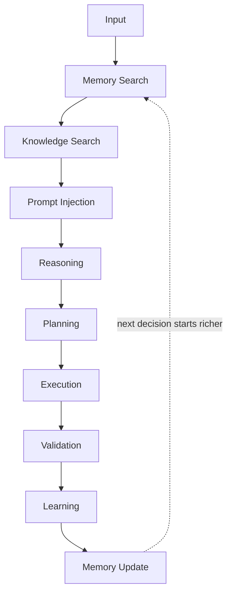

| Step | Purpose |
|---|---|
| **Memory Search** | Recall what happened in similar prior situations |
| **Knowledge Search** | Pull in curated domain and platform knowledge |
| **Prompt Injection** | Compose the retrieved context into the prompt template |
| **Reasoning** | The LLM analyses the situation (`ai-qa-os-learning` reasoning) |
| **Planning** | A concrete plan of action is produced |
| **Execution** | The plan runs |
| **Validation** | The output is checked against the confidence gate ([§2.6](#26-ai-confidence-score-gate)) |
| **Learning** | The outcome — success or failure — is analysed |
| **Memory Update** | The learning is persisted so the next decision starts richer |

The dashed edge is the compounding loop: because every decision writes back to memory, the quality of retrieval improves with each run.

---

### 2.11 Provider Selection Flow

Agents never bind to a specific model. They ask the provider layer for a completion, and the layer routes, falls back, and retries transparently.

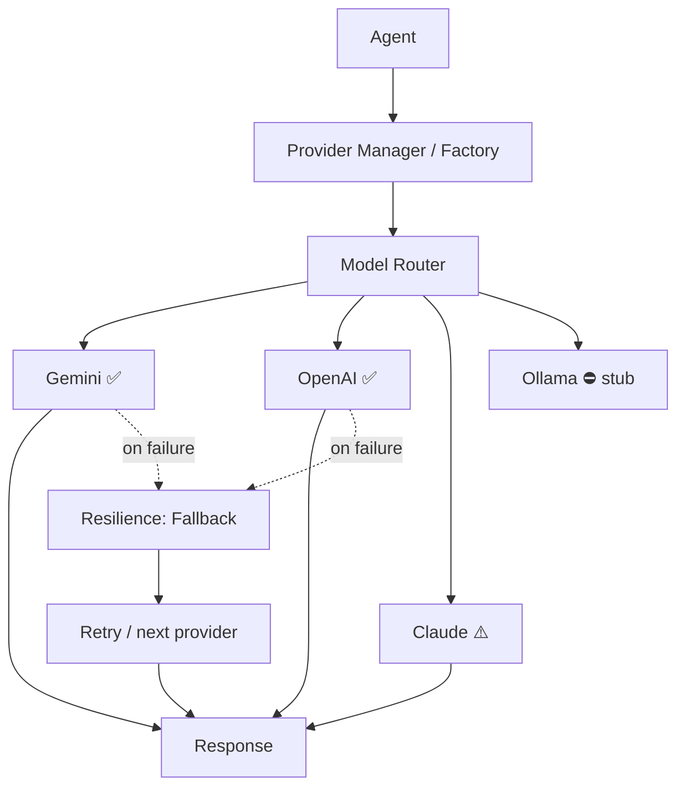

| Element | Reality today |
|---|---|
| Provider Manager / Router | `LLMProviderManager` + `ModelRouter` select the provider; default active provider is `openai` |
| **Gemini** | ✅ Implemented — `generativelanguage.googleapis.com`, `x-goog-api-key` |
| **OpenAI** | ✅ Implemented — `api.openai.com/v1/chat/completions` |
| **Claude** | ⚠️ Present but likely incomplete — no HTTP endpoint literal found (verify before use) |
| **Ollama** | ⛔ Explicit stub — throws `ProviderException("... not wired to a real API yet")` |
| Fallback / Retry | `LLMResilienceManager` handles fallback and retry; `ApiKeyPool` rotates keys with per-key cooldown |
| Cost accounting | `CostTracker` records `TokenUsage` for every response |

---

### 2.12 Memory Lifecycle

Memory is what lets the platform accumulate experience. Every execution feeds a tiered memory that is later retrieved and injected back into prompts.

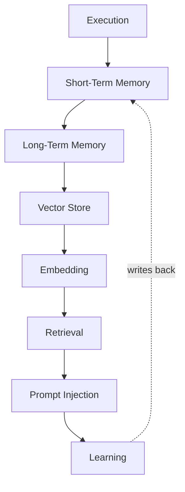

| Stage | Backing implementation |
|---|---|
| **Short-Term Memory** | `CaffeineMemoryStore` (fast, in-process) |
| **Long-Term Memory** | `RedisMemoryStore` / relational persistence |
| **Vector Store** | One of five clients: Qdrant, pgvector, Chroma, Milvus, in-memory |
| **Embedding** | `OPENAI_TEXT_EMBEDDING_3_LARGE` or `GEMINI_TEXT_EMBEDDING_004` |
| **Retrieval** | Chunking → ranking → retrieval pipeline in `ai-qa-os-memory` |
| **Prompt Injection** | Retrieved context is composed into the active prompt |
| **Learning** | `ai-qa-os-learning` distils outcomes back into memory |

---

### 2.13 Prompt Lifecycle

Prompts are versioned, templated assets — not string literals scattered through the code. Each agent resolves its prompt through the intelligence layer, hydrates it with live context, executes it, and validates the result.

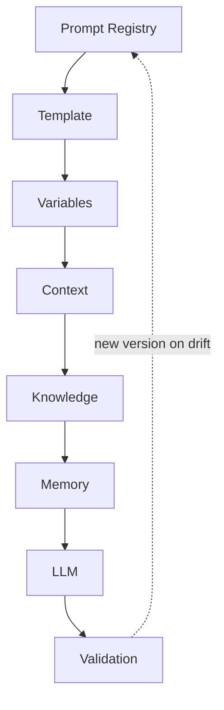

| Stage | Backing implementation |
|---|---|
| **Prompt Registry** | `PromptTemplateEntity` + `PromptVersionEntity` in `ai-qa-os-intelligence` |
| **Template** | The Markdown prompt files under `ai-qa-os-agents/src/main/resources/prompts/` |
| **Variables** | Step inputs bound into the template |
| **Context / Knowledge / Memory** | Retrieved and injected per [§2.10](#210-ai-decision-flow) and [§2.12](#212-memory-lifecycle) |
| **LLM** | Executed through the provider layer ([§2.11](#211-provider-selection-flow)) |
| **Validation** | `LLMResponseValidator`; each execution is recorded as a `PromptExecutionEntity` |

Prompt executions are versioned assets, so a change to a template produces a new version rather than silently mutating behaviour.

---

### 2.14 Module Dependency Graph

The modules form a directed dependency graph that all points inward toward `ai-qa-os-core` (the shared kernel). Entry-point applications sit at the top; foundational modules at the bottom depend on nothing but the kernel.

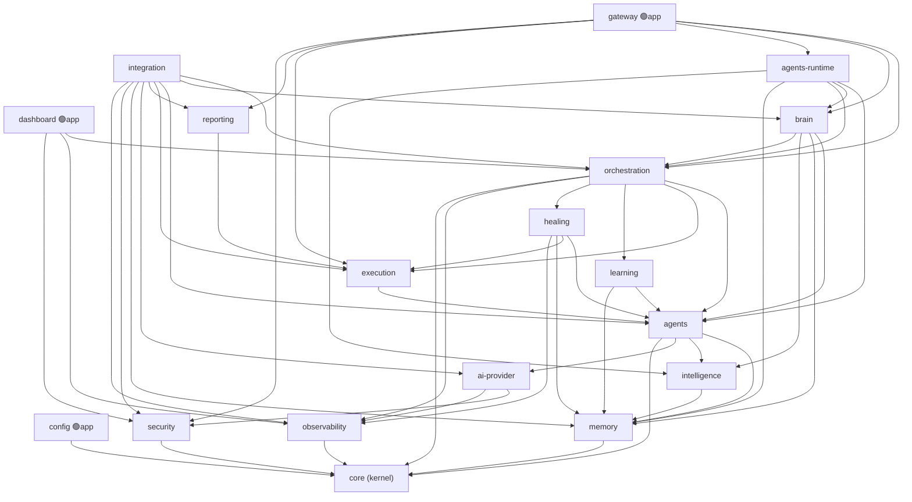

**Reading the graph:**

- **`core` is the root.** Every module depends on it and it depends on nothing. Changes to `core` ripple everywhere — treat it as a stable contract.
- **Entry points depend down, never up.** `gateway`, `dashboard`, and `config` are the only runnable apps; nothing depends on them.
- **`integration` is the widest consumer** — it wires together nearly every subsystem to reach external systems (GitHub, Jira, MCP, CI/CD).
- **`agents` sits at the centre of production** — it pulls in `memory`, `intelligence`, and `ai-provider`, and is in turn consumed by `orchestration`, `execution`, `healing`, `learning`, and `brain`.

**Direct dependencies per module** (beyond the implicit `core` + Lombok/SLF4J):

| Module | Depends on |
|---|---|
| `gateway` | core, security, brain, agents-runtime, orchestration, execution, reporting |
| `dashboard` | core, observability, orchestration, security |
| `config` | core |
| `integration` | core, security, observability, ai-provider, memory, brain, orchestration, agents-runtime, execution, reporting |
| `orchestration` | core, agents, execution, learning, healing, observability |
| `brain` | core, memory, intelligence, agents, orchestration |
| `agents-runtime` | core, memory, intelligence, agents, orchestration, brain |
| `agents` | core, memory, intelligence, ai-provider |
| `execution` | core, agents |
| `healing` | core, memory, agents, execution, observability |
| `learning` | core, memory, agents |
| `reporting` | core, execution |
| `intelligence` | core, memory |
| `memory` | core |
| `ai-provider` | core, security, observability |
| `security` | core |
| `observability` | core |
| `testdata` | *(none — stub)* |
| `data` | *(none — stub)* |

---

## 3. Repository Structure

The platform spans three sibling repositories under a single working directory:

```
D:\QA AI Automation\AI-QA-OS Architecture\
├── AI-QA-OS-Core\            # Java 21 / Spring Boot backend — 20 Maven modules
├── ai-qa-os-dashboard-ui\    # React 18 / TypeScript / Vite frontend
└── AI-QA-OS-Docs\            # Architecture blueprints + build log (docs only)
```

| Repository | Directory | Language | Role |
|---|---|---|---|
| **ai-qa-os-core** | `AI-QA-OS-Core` | Java 21 | The platform itself: agents, orchestration, execution, APIs |
| **ai-qa-os-dashboard** | `ai-qa-os-dashboard-ui` | TypeScript | Web console for observing runs, modules, test cases, artifacts |
| **ai-qa-os-docs** | `AI-QA-OS-Docs` | Markdown | Architecture blueprints, roadmap, documentation standard |

> ⚠️ **Naming caution.** `ai-qa-os-dashboard` is ambiguous — it names both the **React frontend repository** (`ai-qa-os-dashboard-ui` on disk) and a **Java Maven module inside the core repo** (`AI-QA-OS-Core/ai-qa-os-dashboard`, the backend that serves the frontend). Throughout this document, "dashboard UI" means the React app and "dashboard service" means the Java module on port 8090.

---

## 4. The Three Repositories

### 4.1 ai-qa-os-core

**Purpose.** The complete backend platform. A Maven multi-module aggregator (`com.aiqaos:ai-qa-os:1.0.0-SNAPSHOT`, packaging `pom`) whose modules are listed below; three of them are runnable Spring Boot applications.

**Module inventory.** *Maturity* reflects how much real logic each module carries today, from `Stub` (empty declarations) through `Skeletal` and `Moderate` to `Mature`.

| Module | Maturity | Purpose |
|---|---|---|
| `ai-qa-os-gateway` | **Runnable app (:8082)** | Public REST API, WebSocket, webhooks, CLI runner |
| `ai-qa-os-config` | **Runnable app (:8080)** | `@ConfigurationProperties` classes and system beans |
| `ai-qa-os-core` | Mature | Shared kernel: DTOs, entities, enums, events, contracts |
| `ai-qa-os-brain` | Skeletal | Planner, router, strategy, decision + reasoning traces |
| `ai-qa-os-orchestration` | **Densest module** | Pipeline orchestrator, nine steps, workflow DSL, state machine |
| `ai-qa-os-agents` | Mature | The agent implementations + their prompt templates |
| `ai-qa-os-intelligence` | Moderate | Prompt template/version/execution management |
| `ai-qa-os-memory` | Mature | Vector + cache memory, chunking, ranking, retrieval |
| `ai-qa-os-learning` | Moderate | Analyzer, decision, reflection, reasoning, planning |
| `ai-qa-os-execution` | Mature | Playwright engine, artifact manager, dispatcher, scheduler |
| `ai-qa-os-healing` | Moderate | Self-healing engine and strategies |
| `ai-qa-os-testdata` | **Stub** | Empty class declarations only |
| `ai-qa-os-reporting` | Skeletal | Report, artifact, trend, failure-analysis entities |
| `ai-qa-os-security` | Mature | JWT auth, RBAC, secret providers, rate limiting, OPA policy |
| `ai-qa-os-observability` | Mature | Metric/trace entities, alerts, diagnostics, OTel |
| `ai-qa-os-integration` | Moderate | GitHub, Jira, MCP, CI/CD connectors; cross-module facades |
| `ai-qa-os-data` | **Stub** | Empty declarations — no real implementation |
| `ai-qa-os-dashboard` | **Runnable app (:8090)** | Dashboard REST API, SSE stream, artifact serving |
| `ai-qa-os-agents-runtime` | Skeletal | Agent lifecycle, task, messaging entities |
| `ai-qa-os-ai-provider` | Mature | LLM provider abstraction, routing, cost tracking, key pooling |

**Key characteristics.**

- **Java package root:** `com.aiqaos`
- **Three runnable apps** — gateway (8082), dashboard (8090), config (8080 by default, no explicit port set)
- **A rich JPA entity model** spread across many modules, persisted to PostgreSQL
- **Flyway migrations** (`V1` … `V13`), stored once at `deployment/migration/db/migration/` and copied onto the classpath by explicit `<resources>` blocks in both the gateway and dashboard POMs
- **Bundled Node toolchain** — `ai-qa-os-execution/src/main/resources/scripts/` contains a full Playwright project (including a committed `node_modules/`), driven at runtime by `PlaywrightExecutionEngine` shelling out to PowerShell

### 4.2 ai-qa-os-dashboard (UI)

**Purpose.** A React single-page application that visualises platform activity: module and test-case catalogues, execution history and detail, live telemetry via Server-Sent Events, and Playwright artifacts (screenshots, video, logs).

**Key characteristics.**

- Vite 5 dev server on **port 3000**, proxying `/api` → `http://localhost:8090`
- A `src/` tree of pages, React contexts, custom hooks, and presentational components (see [§10.3](#103-ai-qa-os-dashboard-ui))
- State is managed by **React Context + `useEffect`**, not react-query (see caveat below)
- Dark/light theming through Tailwind CSS custom properties with `darkMode: 'class'`
- Graceful degradation: when the backend is unreachable, `ModuleContext` dynamically imports mock fixtures so the UI still renders

**Important caveats to be aware of before working in this repo:**

| Caveat | Detail |
|---|---|
| **react-query is dead code** | `QueryClientProvider` is mounted and `queryClient.ts` is configured, but `useQuery`/`useMutation` appear **zero** times in `src/`. It still gets its own `vendor-query` build chunk. |
| **No environment variables** | There are no `.env` files and zero uses of `import.meta.env`. The backend URL is hardcoded in `vite.config.ts`. A production build emits same-origin `/api` requests with no way to repoint it without editing source. |
| **Role is client-chosen** | `LoginPage` lets the user pick their role from a `<select>` and stores it in `localStorage`. The backend does not return or validate it, so `RoleGuard` is trivially bypassable. It is a UX affordance, not a security control. |
| **Two pages bypass the API client** | `ExecutionsPage` and `ExecutionDetailPage` use native `fetch()`, so they send no `Authorization` header and are not covered by the 401 interceptor. |
| **Most pages are mock-driven** | `DashboardPage` and `AnalyticsPage` are 100% hardcoded constants with no API calls. |
| **README is the stock template** | The repo README is the unmodified Vite + React + Oxlint scaffold. |
| **`strict` is off** | Neither `tsconfig.app.json` nor `tsconfig.node.json` enables `strict`; several files rely on `any`. |

**Pages that genuinely call the backend:** `LoginPage`, `ModulesPage` / `ModuleDetailPage` (via `ModuleContext`), `TestCaseDetailPage` (via `useArtifacts`), `ExecutionsPage` / `ExecutionDetailPage`, `LiveMonitoringPage` (SSE).

### 4.3 ai-qa-os-docs

**Purpose.** The architectural source of truth plus a build log. The repo separates the two concerns explicitly:

> `00-Foundation/` = the architecture (what AI-QA-OS is and how it's designed).
> `docs/` = the build log (how it's actually getting built, prompt by prompt, step by step).
> "Nothing in `00-Foundation/` is modified by work done here."

**`00-Foundation/`** — a set of substantive architecture documents:

| Document | Status |
|---|---|
| `00_FOUNDATION_BLUEPRINT.md` | Completed |
| `01_PROJECT_VISION.md` | Approved |
| `02_ENTERPRISE_ARCHITECTURE.md` | Header says In Progress, tail says 100% |
| `03_QA_BRAIN_ARCHITECTURE.md` | Same header/tail conflict |
| `04_MASTER_PROMPT_ENGINE.md` | Complete |
| `05_WORKFLOW_ENGINE.md` | Complete |
| `06_AGENT_MANAGER.md` | Complete |
| `07_AI_MEMORY_SYSTEM.md` | Complete |
| `08_KNOWLEDGE_ENGINE.md` | **Incomplete — Part 10 missing** |
| `09_AI_REASONING_ENGINE.md` | Complete |
| `10_AI_AGENT_ORCHESTRATION.md` | Complete |
| `11_AI_EXECUTION_ENGINE.md` | Complete |
| `12_AI_REPORTING_INTELLIGENCE_ENGINE.md` | Complete |
| `13_AI_TEST_DATA_INTELLIGENCE_ENGINE.md` | Complete |

**`docs/`** — an 18-folder scaffold. Only `workflow/` and `roadmap/` contain authored content; the other 16 folders hold placeholder READMEs that say some variant of "No files yet." `docs/implementation/Requirement-Management.md` is a **0-byte file** with a name that violates the repo's own numbering standard (should be `01-Requirement-Management.md`).

**Roadmap status: nothing is marked Done.** All 11 phases (0–10) and all 12 steps are `Not Started`. The root README confirms: `Status: Framework Established — Step content not yet authored`.

> ⚠️ **Roadmap inconsistencies.** The root README and `docs/phases/README.md` both claim "18 high-level build Phases (`Phase-01-Foundation.md` … `Phase-18-End-to-End-Integration.md`)", but the roadmap defines only phases 0–10 and explicitly defers 11–18. The two also disagree on file naming (`phases/00-Project-Initialization.md` vs `Phase-NN-Name.md`). Additionally, `01_PROJECT_VISION.md` contains a separate 10-phase *product* roadmap that uses different numbering — do not conflate it with the build phases.

---

## 5. Features

### 5.1 Implemented

**Autonomous QA pipeline**
- Nine-step orchestration from requirement Markdown to report
- Workflow DSL parser, workflow state machine, workflow graph
- Pause / resume / cancel control via REST
- LLM response validation (`LLMResponseValidator`)

**AI agents (8)**
- QA analysis, test case generation, script generation, execution engineering, self-healing, bug analysis, reporting, learning
- Each ships a versioned Markdown prompt template under `ai-qa-os-agents/src/main/resources/prompts/`

**Multi-provider LLM abstraction**
- `LLMProvider` / `StreamingLLMProvider` contracts with capability declarations
- Working Gemini and OpenAI providers over Spring `RestTemplate`
- `ModelRouter` for provider selection, `LLMResilienceManager` for retry/fallback
- `CostTracker` and `TokenUsage` accounting
- `ApiKeyPool` with rotation and per-key cooldown — for base name `GEMINI_API_KEY` it reads `GEMINI_API_KEYS` (comma-separated), `GEMINI_API_KEY`, and `GEMINI_API_KEY_2` … `_10`

**Browser execution**
- `PlaywrightExecutionEngine` drives a bundled Node/Playwright project via PowerShell
- Artifacts written to `playwright-output/exec-<id>/<browser>/{results.json, html-report/, test-results/}`
- Recorded execution runs accumulate on disk under `playwright-output/`
- `ArtifactManager` plus retry, dispatch, and scheduling subsystems

**Memory and retrieval**
- Caffeine (in-process) and Redis memory stores
- Five vector store clients: Qdrant, pgvector, Chroma, Milvus, in-memory
- Chunking, ranking, retrieval, and ingestion pipelines
- Embeddings via `OPENAI_TEXT_EMBEDDING_3_LARGE` or `GEMINI_TEXT_EMBEDDING_004`

**Security**
- JWT authentication (jjwt) with access + refresh tokens
- RBAC across 7 entities (user, role, permission, role-permission, API key, session, password history)
- Four secret providers: Local, Vault, AWS, Kubernetes
- Rate limiting via bucket4j; OPA policy engine; security audit logging
- MFA and account-lockout fields (migration `V8`)

**Observability**
- 10 telemetry entities including `AgentMetricEntity`, `AgentTraceEntity`, `LLMCostEntity`, `TraceEntity`, `AlertEntity`, `TimelineEventEntity`
- Micrometer → Prometheus, OpenTelemetry SDK
- Actuator exposing `health, info, prometheus, metrics`

**Dashboard**
- Module and test-case catalogue browsing with 8-field filtering
- Execution history with search, environment filter, and client-side JSON export
- Execution detail with five tabs (overview / timeline / traces / logs / raw)
- Test-case detail with screenshot, video, and log playback
- Live telemetry over SSE with exponential-backoff reconnect (2 s doubling, capped at 30 s)
- Light/dark theming

**Integrations**
- GitHub, Jira, MCP, and CI/CD connector packages
- Workflow plugins: `GithubPlugin`, `JiraPlugin`, `SlackPlugin`
- Webhook receiver at `POST /api/v1/webhooks/{source}`

### 5.2 Designed but Not Yet Built

- Test data generation — the broader engine (real **PII masking** exists via MOD-4/ADR-030; generation not built)
- Data-access abstraction (`ai-qa-os-data` is a stub)
- Scenario Agent and Test Data Agent as distinct agents
- Selenium, REST Assured, and Appium execution engines (only Playwright exists)
- Agent Manager as an enforced mediator — Rule 1 is not structurally enforced in code

> *Correction (2026-07-30):* **AI Confidence Score gating is now built** — `ConfidenceGate` (core) + `ConfidencePolicyManager` (brain), integrated into the orchestrator with pause-on-`HUMAN_REVIEW` (AI-1, ADR-010). Removed from this list.

---

## 6. Technology Stack

### 6.1 Backend

| Layer | Technology | Version |
|---|---|---|
| Language | Java | 21 |
| Framework | Spring Boot | 3.3.0 |
| Cloud | Spring Cloud BOM | 2023.0.2 |
| Build | Maven (multi-module) | — |
| Persistence | Spring Data JPA / Hibernate | via Boot |
| Database | PostgreSQL | 16 (Docker: `postgres:16-alpine`) |
| Migrations | Flyway | via Boot |
| Cache / memory | Redis, Caffeine | Redis 7-alpine |
| Vector store | Qdrant | v1.9.0 |
| Security | Spring Security, jjwt, bucket4j | — |
| Resilience | Resilience4j | — |
| Metrics | Micrometer + Prometheus, OpenTelemetry | OTel Collector 0.95.0 |
| API docs | springdoc-openapi | — |
| Boilerplate | Lombok | 1.18.34 |
| Logging | SLF4J | — |
| Test DB | H2 | — |

> ⚠️ **LangChain4j is declared but unused.** The parent POM imports `langchain4j-bom` 0.31.0, but there are **zero** `import dev.langchain4j` statements anywhere in the codebase. All LLM providers are hand-rolled over Spring `RestTemplate`. The BOM import is dead weight and can be removed.

### 6.2 Frontend

| Concern | Technology | Version |
|---|---|---|
| Framework | React | 18.3.1 |
| Language | TypeScript | ~5.2.2 |
| Build tool | Vite | 5.3.1 |
| Routing | react-router-dom | 6.23.1 |
| HTTP | axios | 1.7.2 |
| Charts | recharts | 2.12.7 |
| Icons | lucide-react | 0.395.0 |
| Styling | Tailwind CSS + PostCSS | 3.4.1 |
| Linting | **oxlint** (not ESLint) | 1.71.0 |
| Testing | Vitest + Testing Library + jsdom | 1.6.0 |
| Data fetching | @tanstack/react-query | 5.50.1 — *installed, unused* |

### 6.3 Automation and Infrastructure

| Concern | Technology |
|---|---|
| Browser automation | Playwright (TypeScript, bundled under `ai-qa-os-execution` resources) |
| Containers | Docker, Docker Compose |
| Orchestration | Kubernetes manifests + Helm chart |
| CI | GitHub Actions |
| Image scanning | Trivy (`aquasecurity/trivy-action`) |
| Scripting | PowerShell (Windows-first) |

### 6.4 LLM Providers

| Provider | Status | Endpoint / Model |
|---|---|---|
| **Google Gemini** | Implemented | `generativelanguage.googleapis.com/v1beta/models/%s:generateContent`, header `x-goog-api-key`; default `gemini-3.5-flash`, gateway overrides to `gemini-3.6-flash` |
| **OpenAI** | Implemented | `api.openai.com/v1/chat/completions`, default `gpt-4o-mini` |
| **Anthropic Claude** | Present, likely incomplete | `provider/provider/claude/` exists but contains no HTTP endpoint or model-id literal — *verify before relying on it* |
| **Ollama** | Explicit stub | Both methods throw `ProviderException("Ollama provider is not wired to a real API yet")` |

Default active provider is `openai` (`AiProviderProperties.activeProvider`).

---

## 7. Installation and Setup

### 7.1 Prerequisites

| Requirement | Version | Notes |
|---|---|---|
| JDK | 21 | Temurin recommended (matches CI) |
| Maven | 3.9+ | Or use the wrapper if present |
| Node.js | 18+ | For the dashboard UI and Playwright |
| PostgreSQL | 16 | Or run via Docker Compose |
| Redis | 7 | Optional — only if using `RedisMemoryStore` |
| Docker Desktop | latest | Optional but recommended for dependencies |
| PowerShell | 5.1+ | Required — the execution engine shells out to it |

> **Platform note.** The project is currently **Windows-first**. `PlaywrightExecutionEngine` invokes `run-playwright.ps1` through PowerShell, and the dashboard's default artifact directory is a hardcoded absolute Windows path. Running on Linux or macOS requires overriding `PLAYWRIGHT_ARTIFACTS_DIR` and adapting the runner invocation.

### 7.2 Clone the Repositories

```bash
# Create a workspace directory, then clone all three side by side
mkdir ai-qa-os && cd ai-qa-os

git clone <core-repo-url>       AI-QA-OS-Core
git clone <dashboard-repo-url>  ai-qa-os-dashboard-ui
git clone <docs-repo-url>       AI-QA-OS-Docs
```

The docs repo's known remote is `https://github.com/sankaliyamayur/AI-QA-OS_Architecture.git`.

### 7.3 Start Infrastructure Dependencies

The fastest path is the bundled Compose file, which brings up PostgreSQL, Redis, Qdrant, and an OpenTelemetry Collector:

```bash
cd AI-QA-OS-Core/deployment/docker
docker compose up -d postgres redis qdrant otel-collector
```

> ⚠️ **Database name mismatch.** Docker Compose creates database `ai_qa_os` with user `qaosuser`, but the application YAML expects database **`ai_qa_os_dashboard`** with user **`postgres`**. If you use Compose, you must either override `SPRING_DATASOURCE_*` on the apps or create the expected database. See [§8.3](#83-database-configuration).

To provision the expected database manually instead:

```sql
CREATE DATABASE ai_qa_os_dashboard;
-- default local credentials expected by application.yml: postgres / password
```

Flyway runs automatically on application start (`baseline-on-migrate: true`) and applies migrations `V1` through `V13`.

### 7.4 Build the Backend

```bash
cd AI-QA-OS-Core

# Full build, skipping tests for the first pass
mvn clean install -DskipTests

# Or compile only, matching what CI does today
mvn clean compile -B
```

Build a single module and its dependencies:

```bash
mvn clean install -pl ai-qa-os-dashboard -am -DskipTests
```

### 7.5 Install the Playwright Toolchain

The execution module ships a Node project with a committed `node_modules/`, so it may work out of the box. If browsers are missing:

```bash
cd AI-QA-OS-Core/ai-qa-os-execution/src/main/resources/scripts
npm install
npx playwright install
```

### 7.6 Set Up the Dashboard UI

```bash
cd ai-qa-os-dashboard-ui
npm install
```

No `.env` file is required — or supported. See [§8.4](#84-frontend-configuration).

---

## 8. Configuration

### 8.1 Configuration Sources

| Source | Location |
|---|---|
| Gateway config | `ai-qa-os-gateway/src/main/resources/application.yml` |
| Dashboard config | `ai-qa-os-dashboard/src/main/resources/application.yml` |
| Profile configs | `ai-qa-os-config/src/main/resources/application-{local,dev,test,stage,prod}.yml` |
| Typed properties | 11 `@ConfigurationProperties` classes in `ai-qa-os-config` |
| Frontend config | `vite.config.ts` (hardcoded — no env vars) |

### 8.2 Spring Profiles

| Profile | Database | Security | Notes |
|---|---|---|---|
| `local` | H2 in-memory `aiqaosdb`, `ddl-auto: create-drop` | `aiqaos.security.enabled: false` | Feature flags for MCP integration, AI brain, realtime logging |
| `test` | H2 `testdb` | Hardcoded JWT secret and 24 h refresh | Issuer `ai-qa-os-auth-service` |
| `dev` / `stage` | — | — | Present, minimal content |
| `prod` | `jdbc:postgresql://prod-db-host:5432/ai_qa_os_prod` | Enabled | **Password field is empty — must be injected** |

The default active profile in `ai-qa-os-config/application.yml` is `local`.

### 8.3 Database Configuration

Both the gateway and dashboard point at the **same** PostgreSQL database:

```yaml
spring:
  datasource:
    url: jdbc:postgresql://localhost:5432/ai_qa_os_dashboard?preferQueryMode=simple
    username: postgres
    password: password
    driver-class-name: org.postgresql.Driver
  jpa:
    hibernate:
      ddl-auto: validate          # schema is owned by Flyway, not Hibernate
    database-platform: org.hibernate.dialect.PostgreSQLDialect
    open-in-view: false
  flyway:
    enabled: true
    baseline-on-migrate: true
```

Override for any non-local environment:

```bash
export SPRING_DATASOURCE_URL="jdbc:postgresql://db-host:5432/ai_qa_os"
export SPRING_DATASOURCE_USERNAME="qaosuser"
export SPRING_DATASOURCE_PASSWORD="<DB_PASSWORD>"
```

> ⚠️ **Credentials are committed in plaintext.** `postgres/password` appears directly in both `application.yml` files, and the `test` profile carries a hardcoded JWT secret. These must be replaced with injected secrets before any shared or production deployment.

### 8.4 Frontend Configuration

There is **no environment-variable layer** in the dashboard UI. All backend routing is decided at build time in `vite.config.ts`:

```ts
export default defineConfig({
  plugins: [react()],
  server: {
    port: 3000,
    proxy: {
      '/api': {
        target: 'http://localhost:8090',
        changeOrigin: true,
        secure: false,
      },
    },
  },
  build: {
    rollupOptions: {
      output: {
        manualChunks: {
          'vendor-react': ['react', 'react-dom', 'react-router-dom'],
          'vendor-charts': ['recharts'],
          'vendor-query': ['@tanstack/react-query'],
        },
      },
    },
    chunkSizeWarningLimit: 600,
  },
})
```

The axios client uses a relative base URL:

```ts
// src/config/apiClient.ts
const apiClient = axios.create({
  baseURL: '/api',
  headers: { 'Content-Type': 'application/json' },
  timeout: 15000,
})
```

**Consequence:** a production build issues same-origin `/api/**` requests. Deploying the UI on a different host from the API requires either a reverse proxy fronting both, or a source change to introduce `VITE_API_BASE_URL`. Introducing that variable is a recommended early improvement.

### 8.5 AI Provider Configuration

```yaml
aiqaos:
  provider:
    gemini:
      model: gemini-3.6-flash
```

API keys resolve through `ApiKeyPool`, backed by `SecretManager`. For a base name such as `GEMINI_API_KEY`, the pool reads, in order:

| Variable | Meaning |
|---|---|
| `GEMINI_API_KEYS` | Comma-separated list, rotated with per-key cooldown |
| `GEMINI_API_KEY` | Single key |
| `GEMINI_API_KEY_2` … `GEMINI_API_KEY_10` | Additional numbered keys |

```bash
# Minimum viable AI configuration
export GEMINI_API_KEY="<GEMINI_API_KEY>"
export OPENAI_API_KEY="<OPENAI_API_KEY>"
```

Secret backends available: `LocalSecretProvider`, `VaultSecretProvider`, `AwsSecretProvider`, `K8sSecretProvider`.

### 8.6 Artifact and Execution Configuration

```yaml
aiqaos:
  artifacts:
    base-dir: ${PLAYWRIGHT_ARTIFACTS_DIR:D:/QA AI Automation/AI-QA-OS Architecture/AI-QA-OS-Core/playwright-output}
  playwright:
    runner-script: ${PLAYWRIGHT_RUNNER_SCRIPT:}
  dashboard:
    base-url: ${DASHBOARD_BASE_URL:http://localhost:8090}
```

`PLAYWRIGHT_ARTIFACTS_DIR` **must** be overridden on any machine that is not the original developer's — the default is an absolute Windows path.

### 8.7 Security Configuration

```yaml
security:
  jwt:
    secret: ${JWT_SECRET}
    expirationMs: 3600000           # 1 hour
    refreshExpirationMs: 604800000  # 7 days
    issuer: ai-qa-os
    allowedOrigins: <comma-separated origins>

aiqaos:
  security:
    database-enabled: true          # gates AuthenticationController
```

> ✅ **Security status (updated 2026-07-30) — authentication is now real and enforced.** The warning below described an earlier state that **SEC-1 and SEC-4 have since resolved**, and is retained only as historical context:
> - **SEC-1 (ADR):** the blanket `WebSecurityCustomizer.ignoring()` bypass was **removed**; the chain is now **deny-by-default**, gated by `aiqaos.security.enabled` (default **true**; set `false` only for open local dev). 401/403 JSON handlers + a config-driven bootstrap admin were added.
> - **SEC-4 (ADR-016):** a **strict, tunable CSP** (`aiqaos.security.csp`), `X-Frame-Options: DENY`, Referrer/Permissions policies and HSTS are applied by **both** the gateway and dashboard chains; the artifact surface serves HTML as an attachment with `default-src 'none'; sandbox`.
>
> *Historical (pre-SEC-1) description:* ~~`SecurityConfig` permits `/api/auth/**`, `/api/v1/**`, `/swagger-ui/**`, `/v3/api-docs/**`, `/actuator/**`, `/api/dashboard/**`, and `/api/artifacts/**`, also registered in a `WebSecurityCustomizer.ignoring()` block that bypassed the filter chain entirely — every endpoint reachable unauthenticated, CSP fully permissive, frame options disabled.~~ No longer accurate.

### 8.8 Configuration Reference

| Variable | Default | Purpose |
|---|---|---|
| `SPRING_DATASOURCE_URL` | `jdbc:postgresql://localhost:5432/ai_qa_os_dashboard` | Database JDBC URL |
| `SPRING_DATASOURCE_USERNAME` | `postgres` | Database user |
| `SPRING_DATASOURCE_PASSWORD` | `password` | Database password |
| `SPRING_DATA_REDIS_HOST` | `localhost` | Redis host |
| `SPRING_PROFILES_ACTIVE` | `local` | Active Spring profile |
| `GEMINI_API_KEY` / `GEMINI_API_KEYS` | — | Google Gemini credentials |
| `OPENAI_API_KEY` / `OPENAI_API_KEYS` | — | OpenAI credentials |
| `JWT_SECRET` | *(hardcoded in test profile)* | JWT signing secret |
| `PLAYWRIGHT_ARTIFACTS_DIR` | Absolute Windows path | Artifact output root |
| `PLAYWRIGHT_RUNNER_SCRIPT` | *(empty)* | Override runner script path |
| `DASHBOARD_BASE_URL` | `http://localhost:8090` | Base URL used in artifact links |

---

## 9. Running the Project

### 9.1 Startup Order

```
1. PostgreSQL (+ Redis, Qdrant if used)
2. ai-qa-os-dashboard   :8090   ← runs Flyway migrations
3. ai-qa-os-gateway     :8082
4. ai-qa-os-dashboard-ui :3000
```

Start the dashboard service first — both apps share a database and both have Flyway enabled, so letting one own migration startup avoids a race.

### 9.2 Run the Backend Services

```bash
cd AI-QA-OS-Core

# Dashboard service — port 8090
mvn spring-boot:run -pl ai-qa-os-dashboard

# Gateway service — port 8082 (separate terminal)
mvn spring-boot:run -pl ai-qa-os-gateway
```

Or run the packaged JARs:

```bash
java -jar ai-qa-os-dashboard/target/ai-qa-os-dashboard-1.0.0-SNAPSHOT.jar
java -jar ai-qa-os-gateway/target/ai-qa-os-gateway-1.0.0-SNAPSHOT.jar
```

Verify health:

```bash
curl http://localhost:8090/actuator/health
curl http://localhost:8082/actuator/health
```

### 9.3 Run the Dashboard UI

```bash
cd ai-qa-os-dashboard-ui
npm run dev          # → http://localhost:3000
```

Log in with `admin` / `admin` (the login page states these as the default credentials).

Other scripts:

```bash
npm run build        # tsc -b && vite build
npm run preview      # serve the production build locally
npm run lint         # oxlint
npm test             # vitest run
```

### 9.4 Trigger an Autonomous QA Run

This is the primary end-to-end entry point. `trigger.ps1` posts a workflow start request to the gateway:

```powershell
# AI-QA-OS-Core/trigger.ps1
Invoke-RestMethod -Uri "http://localhost:8082/api/v1/workflows/start" `
  -Method Post -ContentType "application/json" -Body (@{
    correlationId = "corr-us-003"
    userId        = "tester-1"
    workflowName  = "AUTONOMOUS_QA_PIPELINE"
    parameters    = @{
      requirementPath = "d:/.../resources/user-stories/Login/US-001.md"
    }
  } | ConvertTo-Json)
```

The equivalent with `curl`:

```bash
curl -X POST http://localhost:8082/api/v1/workflows/start \
  -H "Content-Type: application/json" \
  -d '{
        "correlationId": "corr-us-003",
        "userId": "tester-1",
        "workflowName": "AUTONOMOUS_QA_PIPELINE",
        "parameters": {
          "requirementPath": "resources/user-stories/Login/US-001.md"
        }
      }'
```

`request.json` at the core repo root holds the same payload with a UUID correlation ID.

> **Uncertainty.** The literal string `AUTONOMOUS_QA_PIPELINE` does not appear in any `.java` file — it exists only in `trigger.ps1` and `request.json`. The orchestrator class is `AutonomousQAPipelineOrchestrator`; the name-to-class mapping presumably happens in a workflow registry or definition loader, but this was not verified. If the trigger returns "unknown workflow", inspect the workflow registration path.

Then watch progress at `http://localhost:3000/live`, or poll:

```bash
curl http://localhost:8082/api/v1/workflows/{workflowId}
```

### 9.5 Verification Scripts

The core repo root holds several ad-hoc smoke-test scripts. Note that `.gitignore` excludes `test-*.ps1`, so some are local-only.

| Script | What it does |
|---|---|
| `trigger.ps1` | Kicks off the autonomous pipeline (primary entry point) |
| `verify-all.ps1` | Four checks: artifact JSON for `TC-AL-003`, screenshot fetch, video fetch, login token |
| `check-api.ps1` | Logs in, then fetches artifacts + history + a raw PNG with a `Bearer` header |
| `verify-artifacts.ps1` | Fetches artifact JSON, follows `screenshotUrl` and `videoUrl`, prints content types and sizes |
| `test-artifacts.ps1` | Three unauthenticated GETs including `/actuator/health` |
| `test-login.ps1` | Single login POST with `admin` / `admin` |

> ⚠️ `verify-all.ps1` prints `=== All tests PASSED ===` **unconditionally** at the end, regardless of whether the individual checks succeeded. Read the per-check output rather than trusting the summary line.

Also at the core root: `CheckDB.java` (plus its compiled `.class`), a throwaway plain-JDBC utility in the default package that dumps `execution_artifacts` and `test_cases`. It is not part of the Maven build.

---

## 10. Folder Structure

### 10.1 Workspace Root

```
AI-QA-OS Architecture/
├── AI-QA-OS-Core/
├── ai-qa-os-dashboard-ui/
├── AI-QA-OS-Docs/
└── AI-QA-OS-Documentation.md    ← this document
```

### 10.2 AI-QA-OS-Core

```
AI-QA-OS-Core/
├── pom.xml                          # aggregator: com.aiqaos:ai-qa-os:1.0.0-SNAPSHOT
├── .github/workflows/deploy.yml     # CI: build + Docker + Trivy scan
│
├── ai-qa-os-gateway/                # :8082 — public REST API, WebSocket, webhooks
│   └── src/main/java/com/aiqaos/gateway/
│       ├── GatewayApplication.java
│       ├── controller/              # 6 REST controllers
│       ├── service/                 # *GatewayService per domain
│       ├── websocket/               # ExecutionWebSocketHandler, WebSocketConfig
│       ├── webhook/  filter/  cli/  # QaOsCommandRunner
│
├── ai-qa-os-dashboard/              # :8090 — dashboard API, SSE, artifact serving
│   └── src/main/java/com/aiqaos/dashboard/
│       ├── DashboardApplication.java
│       └── controller/              # 10 controllers incl. ArtifactController
│
├── ai-qa-os-config/                 # @ConfigurationProperties + system beans
│   └── src/main/resources/
│       ├── application.yml
│       └── application-{local,dev,test,stage,prod}.yml
│
├── ai-qa-os-core/                   # shared kernel
│   └── src/main/java/com/aiqaos/core/
│       ├── constants/ context/ contract/ dto/ engine/ entity/
│       ├── enums/ event/ exception/ model/ provider/
│       └── repository/ requirement/ response/ util/
│
├── ai-qa-os-orchestration/          # package: com.aiqaos.workflow
│   └── src/main/java/com/aiqaos/workflow/
│       ├── AutonomousQAPipelineOrchestrator.java
│       ├── step/                    # the 9 pipeline steps
│       ├── WorkflowDslParser.java  WorkflowStateMachine.java  WorkflowGraph.java
│       ├── plugin/                  # GithubPlugin, JiraPlugin, SlackPlugin
│       └── validation/              # LLMResponseValidator
│
├── ai-qa-os-agents/
│   ├── src/main/java/com/aiqaos/agents/   # the 8 agent implementations
│   └── src/main/resources/prompts/        # 8 Markdown prompt templates
│
├── ai-qa-os-execution/
│   ├── src/main/java/com/aiqaos/execution/
│   │   ├── PlaywrightExecutionEngine.java  ArtifactManager.java
│   │   └── dispatcher/ retry/ scheduler/
│   └── src/main/resources/scripts/   # bundled Node + Playwright project
│       ├── package.json  playwright.config.ts  tsconfig.json
│       ├── run-playwright.ps1  tests/  node_modules/
│
├── ai-qa-os-memory/
│   └── src/main/java/com/aiqaos/memory/
│       ├── store/                   # CaffeineMemoryStore, RedisMemoryStore
│       ├── vector/                  # Qdrant, PgVector, Chroma, Milvus, InMemory
│       └── chunking/ ranking/ retrieval/ ingestion/
│
├── ai-qa-os-ai-provider/
│   └── src/main/java/com/aiqaos/provider/
│       ├── LLMProviderManager.java  ModelRouter.java  CostTracker.java
│       ├── ApiKeyPool.java  LLMResilienceManager.java
│       └── provider/{gemini,openai,claude,ollama}/
│
├── ai-qa-os-security/               # JWT, RBAC, secrets, rate limiting, OPA
├── ai-qa-os-observability/          # metrics, traces, alerts, diagnostics
├── ai-qa-os-intelligence/           # prompt template/version/execution management
├── ai-qa-os-brain/                  # planner, router, strategy, manager, learning
├── ai-qa-os-learning/               # analyzer, decision, reflection, reasoning
├── ai-qa-os-healing/                # engine, strategy, service, memory
├── ai-qa-os-integration/            # github, jira, mcp, cicd, facade, coordinator
├── ai-qa-os-agents-runtime/         # lifecycle, planner, task, communication
├── ai-qa-os-reporting/              # report, artifact, trend, failure entities
├── ai-qa-os-testdata/               # STUB
├── ai-qa-os-data/                   # STUB
│
├── deployment/
│   ├── docker/                      # 6 Dockerfiles + docker-compose.yml
│   ├── kubernetes/                  # namespace, configmap, secrets, ingress, services
│   ├── helm/ai-qa-os/               # Chart.yaml + values-{local,dev,qa,staging,prod}
│   ├── migration/db/migration/      # V1 … V13 Flyway SQL
│   └── docs/blue_green_strategy.md
│
├── resources/user-stories/          # input requirement Markdown (e.g. Login/US-001.md)
├── playwright-output/               # 22 exec-<id> run directories (gitignored)
├── CheckDB.java                     # throwaway JDBC debug utility
└── *.ps1                            # trigger / verify / check smoke-test scripts
```

### 10.3 ai-qa-os-dashboard-ui

```
ai-qa-os-dashboard-ui/
├── index.html                    # title is still the unbranded default
├── vite.config.ts                # :3000, proxy /api → :8090
├── tailwind.config.js            # darkMode: 'class', CSS-variable token theme
├── tsconfig.json                 # solution file → app + node configs
├── .oxlintrc.json
│
└── src/
    ├── main.tsx  App.tsx  index.css  App.css
    ├── assets/                   # hero.png, login_failed.png, svgs
    ├── components/
    │   ├── ErrorBoundary.tsx
    │   ├── cards/                # MetricCard, WidgetCard
    │   ├── charts/               # Area, Bar, Pie, StackedBar, ChartContainer
    │   ├── common/               # MetricBadge, Skeleton, StatusBadge
    │   ├── media/                # AttachmentViewer, ScreenshotViewer, VideoPlayer
    │   ├── modules/              # Card, Filters, Grid, Search, Statistics, Summary
    │   ├── testcases/            # BrowserBadge, ExecutionHistory, ExecutionLogs,
    │   │                         #   ExecutionMedia, ExecutionTimeline, FailureReason,
    │   │                         #   StatusBadge, TestCaseCard, TestCaseTable
    │   ├── timeline/             # TimelineViewer
    │   └── traces/               # AgentTraceViewer
    ├── config/                   # apiClient.ts, queryClient.ts
    ├── contexts/                 # AuthContext, ModuleContext, ThemeContext
    ├── hooks/                    # useArtifacts.ts, useSSE.ts
    ├── layouts/                  # DashboardLayout.tsx
    ├── mock/                     # executions, history, modules, screenshots,
    │                             #   testcases, videos
    ├── pages/                    # 13 pages (see §4.2)
    ├── routes/                   # AppRoutes, ProtectedRoute, RoleGuard
    ├── services/                 # artifactService.ts
    └── utils/                    # formatters.test.ts  ← test only; no formatters.ts
```

### 10.4 AI-QA-OS-Docs

```
AI-QA-OS-Docs/
├── README.md
├── AI-QA-OS-Documentation-Standard.md
│
├── 00-Foundation/                        # the architecture — substantive blueprints
│   ├── 00_FOUNDATION_BLUEPRINT.md
│   ├── 01_PROJECT_VISION.md
│   ├── 02_ENTERPRISE_ARCHITECTURE.md
│   ├── 03_QA_BRAIN_ARCHITECTURE.md
│   ├── 04_MASTER_PROMPT_ENGINE.md
│   ├── 05_WORKFLOW_ENGINE.md
│   ├── 06_AGENT_MANAGER.md
│   ├── 07_AI_MEMORY_SYSTEM.md
│   ├── 08_KNOWLEDGE_ENGINE.md            # incomplete — Part 10 missing
│   ├── 09_AI_REASONING_ENGINE.md
│   ├── 10_AI_AGENT_ORCHESTRATION.md
│   ├── 11_AI_EXECUTION_ENGINE.md
│   ├── 12_AI_REPORTING_INTELLIGENCE_ENGINE.md
│   ├── 13_AI_TEST_DATA_INTELLIGENCE_ENGINE.md
│   └── AI-QA-OS-Instruction.txt          # stale manifest — references files not present
│
└── docs/                                 # build log — scaffold only
    ├── workflow/          ← authored: AI-QA-OS, Agent, Execution, Learning workflows
    ├── roadmap/           ← authored: 00-Project-Roadmap, 01-Release-Plan,
    │                                  02-Future-Features, Version-History
    ├── templates/         ← 5 template stubs (by design)
    ├── implementation/    ← Requirement-Management.md is 0 bytes, misnamed
    └── architecture/ phases/ prompts/ verification/ api/ guides/
        user-stories/ knowledge/ examples/ integrations/ release-notes/
        changelog/ testing/ decisions/ assets/     ← README placeholders only
```

---

## 11. Development Workflow

### 11.1 Git Branch Strategy

From `01_PROJECT_VISION.md`:

| Branch | Purpose |
|---|---|
| `main` | Production-ready |
| `development` | Active development |
| `feature/<name>` | e.g. `feature/web-automation-agent` |
| `bugfix/<name>` | e.g. `bugfix/report-generation-error` |

### 11.2 Review Gates

Every change must pass four reviews:

1. **Code Review** — correctness and style
2. **Architecture Review** — conformance to layer and communication rules
3. **Security Review** — auth, secrets, input validation
4. **Quality Validation** — tests and coverage

### 11.3 AI Generation Rules

`00_FOUNDATION_BLUEPRINT.md` Part 6 defines 15 numbered rules under the guiding principle:

> **"Understand First, Design Second, Generate Third, Validate Always."**

Frequently referenced rules: Rule 5 Configuration Driven · Rule 6 Security First · Rule 9 Testing With Implementation · Rule 10 Interface First · Rule 13 Version Management (a `version.json` per component) · Rule 15 Human Approval Points.

### 11.4 The Documented Step Loop

The docs repo prescribes a per-step authoring loop:

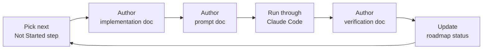

The same two-digit number is reused across parallel folders for one unit of work — Step 05 is `05-*.md` in `phases/`, `implementation/`, `prompts/`, and `verification/` alike.

### 11.5 Documentation Standard

`AI-QA-OS-Documentation-Standard.md` (v1.1.0) governs `docs/` only; `00-Foundation/` keeps its pre-existing `UPPER_SNAKE_CASE` naming.

| Area | Rule |
|---|---|
| **Naming** | `NN-Descriptive-Name.md`, always two digits, PascalCase-with-hyphens after the number |
| **Folder patterns** | `user-stories/`: `US-NNN-Name.md` · `decisions/`: `NNN-Title.md` · `release-notes/`: `vX.Y.Z.md` · `changelog/`: `Component-Name.md` |
| **Structure** | Single `# Title`, then `Version:` / `Document Type:` / `Document Status:`; `---` between sections; max three heading levels; end with a `Document Completion Status` section |
| **Diagrams** | Mermaid preferred. ASCII arrows only for two- or three-node inline flows; anything larger or branching gets a Mermaid block |
| **Code blocks** | Always language-tagged; never real credentials — use `<API_KEY>` or `${DB_PASSWORD}`; runnable over pseudocode |
| **Prompts** | Four-part structure: Context, Objective, Constraints, Expected Output |
| **Versioning** | `Version: X.Y.Z` on every doc — patch = typos, minor = added sections, major = structural rewrite |
| **Changelogs** | `## [Version] - YYYY-MM-DD` with `### Added` / `### Changed` / `### Fixed` |

### 11.6 Adding a New Agent

1. Create the implementation in `ai-qa-os-agents/src/main/java/com/aiqaos/agents/`
2. Add its prompt template to `ai-qa-os-agents/src/main/resources/prompts/`
3. Add a corresponding step class in `ai-qa-os-orchestration` under `com.aiqaos.workflow.step`
4. Register the step in `AutonomousQAPipelineOrchestrator`
5. Add a Flyway migration if the agent introduces persistent state
6. Write unit tests alongside the implementation (Rule 9)

### 11.7 Adding a New LLM Provider

1. Implement `LLMProvider` (and `StreamingLLMProvider` if streaming is supported) in `ai-qa-os-ai-provider`
2. Declare capabilities via `ProviderCapability`
3. Register the provider with `LLMProviderManager`
4. Wire key resolution through `ApiKeyPool` using your `<NAME>_API_KEY` base name
5. Add routing rules to `ModelRouter`
6. Ensure `TokenUsage` is populated so `CostTracker` stays accurate

### 11.8 Database Changes

Schema is owned by Flyway, not Hibernate (`ddl-auto: validate`).

1. Add `V{next}__description.sql` to `deployment/migration/db/migration/`
2. Update the corresponding JPA entity
3. Restart the dashboard service — migrations apply on startup
4. Verify with `CheckDB.java` or a `@DataJpaTest`

Never edit an applied migration; always add a new one.

---

## 12. API and Service Integration

### 12.1 Gateway API — port 8082

All paths are prefixed `/api/v1`.

| Method | Path | Purpose |
|---|---|---|
| `POST` | `/api/v1/workflows/start` | Start an autonomous QA pipeline run |
| `GET` | `/api/v1/workflows/{id}` | Workflow status |
| `POST` | `/api/v1/workflows/{id}/pause` | Pause a running workflow |
| `POST` | `/api/v1/workflows/{id}/resume` | Resume a paused workflow |
| `POST` | `/api/v1/workflows/{id}/cancel` | Cancel a workflow |
| `POST` | `/api/v1/agents/start` | Start an agent |
| `GET` | `/api/v1/agents/{id}` | Agent status |
| `POST` | `/api/v1/agents/{id}/stop` | Stop an agent |
| `POST` | `/api/v1/brain/request` | Submit a decision request to QA Brain |
| `GET` | `/api/v1/brain/decision/{id}` | Retrieve a decision |
| `POST` | `/api/v1/execution/run` | Trigger an execution |
| `GET` | `/api/v1/execution/{id}` | Execution status |
| `GET` | `/api/v1/execution/{id}/artifacts` | Execution artifacts |
| `POST` | `/api/v1/execution/{id}/cancel` | Cancel an execution |
| `POST` | `/api/v1/reports/generate` | Generate a report |
| `GET` | `/api/v1/reports/{id}` | Retrieve a report |
| `GET` | `/api/v1/reports/{id}/export` | Export a report |
| `POST` | `/api/v1/webhooks/{source}` | Inbound webhook receiver |

The gateway also exposes a WebSocket endpoint via `ExecutionWebSocketHandler` and `EventStreamController`. Errors are normalised by a `@RestControllerAdvice GlobalExceptionHandler`.

### 12.2 Dashboard API — port 8090

| Method | Path | Purpose |
|---|---|---|
| `GET` | `/api/dashboard/modules` | List modules |
| `GET` | `/api/dashboard/modules/{id}` | Module detail |
| `GET` | `/api/dashboard/testcases` | List test cases |
| `GET` | `/api/dashboard/testcases/{id}` | Test case detail |
| `GET` | `/api/dashboard/executions` | Paginated execution list (`?size=50`) |
| `GET` | `/api/dashboard/executions/{executionId}` | Execution detail |
| `GET` | `/api/dashboard/artifacts/{testCaseId}` | Latest artifacts for a test case |
| `GET` | `/api/dashboard/artifacts/{testCaseId}/history` | Artifact history |
| `GET` | `/api/artifacts/**` | Raw artifact file serving (PNG, WebM, logs) |
| `GET` | `/api/dashboard/agents/metrics` | Agent metrics |
| `GET` | `/api/dashboard/agents/traces` | Agent traces |
| `GET` | `/api/dashboard/agents/traces/{id}` | Single trace |
| `GET` | `/api/dashboard/bugs` | Bug list |
| `GET` | `/api/dashboard/bugs/breakdown` | Bug breakdown |
| `GET` | `/api/dashboard/healing` | Healing operations |
| `GET` | `/api/dashboard/healing/summary` | Healing summary |
| `GET` | `/api/dashboard/compare` | Execution comparison |
| `GET` | `/api/dashboard/live/stream` | **SSE** telemetry (`text/event-stream`) |

Execution list responses are paginated Spring `Page` objects (`data.content[]`) with fields: `executionId, gitBranch, gitCommit, startTime, endTime, durationMs, status, totalSteps, successSteps, environment, browser, llmModel, tokenUsage, executionCost`.

### 12.3 Authentication API

Provided by `ai-qa-os-security` and packaged into both apps. `AuthenticationController` is conditional on `aiqaos.security.database-enabled` (default true).

| Method | Path | Body | Response |
|---|---|---|---|
| `POST` | `/api/auth/login` | `{username, password}` | `TokenResponseDTO` with `accessToken`, `refreshToken` |
| `POST` | `/api/auth/logout` | — | — |
| `POST` | `/api/auth/refresh` | refresh token | New token pair |

Login also records `User-Agent` (truncated to 100 chars) and `X-Forwarded-For` (255 chars).

```bash
curl -X POST http://localhost:8090/api/auth/login \
  -H "Content-Type: application/json" \
  -d '{"username":"admin","password":"admin"}'
```

> **Frontend gap.** The UI never calls `/api/auth/refresh`. `apiClient.ts` carries the comment *"We will wire Token refresh call here during Auth Phase (22B.5)"*. On a 401 the interceptor clears `access_token` and hard-redirects to `/login` — but does **not** clear `user_info`, leaving a stale key behind.

### 12.4 API Documentation

Both services include springdoc-openapi:

| Resource | Gateway | Dashboard |
|---|---|---|
| Swagger UI | `http://localhost:8082/swagger-ui.html` | `http://localhost:8090/swagger-ui.html` |
| OpenAPI JSON | `http://localhost:8082/v3/api-docs` | `http://localhost:8090/v3/api-docs` |

### 12.5 Frontend → Backend Call Map

| Method | Endpoint | Caller |
|---|---|---|
| `POST` | `/api/auth/login` | `pages/LoginPage.tsx` |
| `GET` | `/api/dashboard/modules` | `contexts/ModuleContext.tsx` |
| `GET` | `/api/dashboard/testcases` | `contexts/ModuleContext.tsx` |
| `GET` | `/api/dashboard/artifacts/{testCaseId}` | `services/artifactService.ts` |
| `GET` | `/api/dashboard/artifacts/{testCaseId}/history` | `services/artifactService.ts` *(no caller found)* |
| `GET` | `/api/dashboard/executions?size=50` | `pages/ExecutionsPage.tsx` — native `fetch` |
| `GET` | `/api/dashboard/executions/{executionId}` | `pages/ExecutionDetailPage.tsx` — native `fetch` |
| `SSE` | `/api/dashboard/live/stream` | `pages/LiveMonitoringPage.tsx` via `useSSE` |

### 12.6 External Integrations

| Integration | Location | Status |
|---|---|---|
| **GitHub** | `ai-qa-os-integration/github/`, `GithubPlugin` | Present |
| **Jira** | `ai-qa-os-integration/jira/`, `JiraPlugin` | Present |
| **Slack** | `SlackPlugin` | Present |
| **MCP** | `ai-qa-os-integration/mcp/` | Present |
| **CI/CD** | `ai-qa-os-integration/cicd/` | Present |
| **OpenTelemetry** | Collector on `:4317` gRPC, `:4318` HTTP | Wired in Compose |
| **Prometheus** | `/actuator/prometheus` on both apps | Exposed |

---

## 13. Testing

### 13.1 Backend Test Suite

Test coverage is concentrated in a handful of modules. The most-tested are `ai-qa-os-orchestration` (the pipeline), `ai-qa-os-agents`, and `ai-qa-os-observability`; `dashboard`, `core`, `integration`, `learning`, `healing`, `execution`, and `security` each carry a smaller amount.

**No tests at all** exist in (as of the original snapshot): `gateway`, `config`, `brain`, `memory`, `reporting`, `intelligence`, `agents-runtime`, `ai-provider`, `data`, `testdata`.

> ⚠️ ~~The gateway and `ai-qa-os-ai-provider` have no tests — the highest-value gaps.~~ **Resolved (2026-07-30):** **MNT-3** brought both `gateway` (WorkflowController + GlobalExceptionHandler) and `ai-qa-os-ai-provider` (ModelRouter/LLMResilienceManager/ApiKeyPool/CostTracker, 21 tests) from 0 → green; `brain` also has tests (AI-1 `ConfidenceGate`, 4/4). The remaining thin/untested modules are `config`, `memory`, `reporting`, `intelligence`, `agents-runtime`, `data`, `testdata`.

**Frameworks.** JUnit 5 + AssertJ via `spring-boot-starter-test`. Note: **Mockito is avoided on JDK 25** (it fails to instrument) — tests use hand-stubs / JDK dynamic proxies instead. No Testcontainers.

**Slice annotations in use:** `@DataJpaTest` (the majority), plus some `@SpringBootTest` and `@WebMvcTest`. Test-only bootstrap classes exist for the slices that need them: `com.aiqaos.integration.TestApplication`, `com.aiqaos.observability.TestApplication`, `com.aiqaos.workflow.TestApplication`. H2 is the test database.

```bash
# Run all backend tests
mvn test

# Single module
mvn test -pl ai-qa-os-orchestration

# Single class
mvn test -pl ai-qa-os-agents -Dtest=QAAnalystAgentTest
```

### 13.2 Frontend Test Suite

**A single test file: `src/utils/formatters.test.ts`.**

Its tests exercise functions (`calculateRate`, `hasAdminAccess`) that are **defined inline inside the test file itself**. Neither imports any application code, and there is no `src/utils/formatters.ts`. Effective coverage of components, routes, hooks, and the API layer is **zero**.

`vite.config.ts` also has **no `test` block** — no jsdom environment, no `globals`, no setup file — despite `jsdom` and `@testing-library/react` being installed. `npm test` passes only because the single test file is pure Node logic. Any component test will fail until Vitest is configured:

```ts
// vite.config.ts — required before writing component tests
export default defineConfig({
  // ...
  test: {
    environment: 'jsdom',
    globals: true,
    setupFiles: './src/setupTests.ts',
  },
})
```

### 13.3 Playwright — the System Under Test

Playwright is **not a Java test dependency**; there is no `com.microsoft.playwright` on the classpath. It is an external Node toolchain bundled at `ai-qa-os-execution/src/main/resources/scripts/`, invoked at runtime by `PlaywrightExecutionEngine` shelling out to PowerShell.

Artifact layout:

```
playwright-output/
└── exec-<8-hex-id>/
    └── <browser>/
        ├── results.json
        ├── html-report/
        └── test-results/
            └── <test-name>-<browser>/
                ├── test-failed-1.png
                └── video.webm
```

These run directories accumulate over time. `ArtifactController` serves them under `aiqaos.artifacts.base-dir`. The directory is gitignored.

### 13.4 Recommended Test Priorities

1. Gateway controller tests — the public API has no coverage at all
2. `ai-qa-os-ai-provider` — provider selection, key rotation, cost calculation
3. Vitest configuration plus real component tests for the UI
4. Testcontainers for PostgreSQL, replacing H2 (Flyway migrations are Postgres-specific and H2 only approximates them under `MODE=PostgreSQL`)
5. An end-to-end pipeline test asserting the full nine-step flow

---

## 14. Deployment Process

### 14.1 CI Pipeline

`.github/workflows/deploy.yml` — "CI/CD Deployment Platform", triggered on push to `main`.

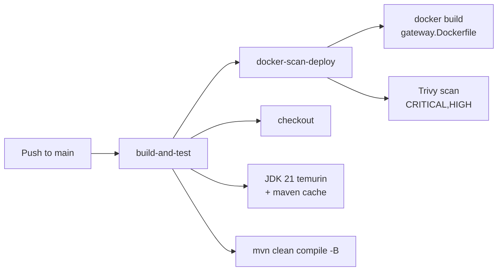

> ⚠️ **Two CI gaps worth fixing.**
> 1. The build job runs `mvn clean compile -B` — **compile only**. The `test` phase never runs, so all 48 tests are skipped in CI.
> 2. The job named `docker-scan-deploy` builds and scans an image but **never pushes it**. The tag `ghcr.io/company/ai-qa-os-gateway:latest` also uses a placeholder org (`company`).
>
> Trivy is configured with `exit-code: 1`, `ignore-unfixed: true`, severity `CRITICAL,HIGH` — so it will correctly fail the build on findings.

### 14.2 Docker Compose (Local / Development)

`deployment/docker/docker-compose.yml` provisions:

| Service | Image | Ports |
|---|---|---|
| postgres | `postgres:16-alpine` | 5432 — DB `ai_qa_os`, user `qaosuser` |
| redis | `redis:7-alpine` | 6379 |
| qdrant | `qdrant/qdrant:v1.9.0` | 6333 |
| otel-collector | `otel/opentelemetry-collector:0.95.0` | 4317 (gRPC), 4318 (HTTP) |
| gateway | built from `gateway.Dockerfile` | **8080:8080** |

```bash
cd AI-QA-OS-Core/deployment/docker
docker compose up -d
docker compose logs -f gateway
docker compose down
```

> ⚠️ **Two Compose mismatches.**
> 1. Compose publishes the gateway on **8080**, but `application.yml` sets `server.port: 8082`. Which wins depends on whether `gateway.Dockerfile` overrides the port — this was not verified. If the container is unreachable, this is the first thing to check.
> 2. Compose creates database `ai_qa_os` / user `qaosuser`, while the app YAML expects `ai_qa_os_dashboard` / `postgres`. The gateway service in Compose does inject `SPRING_DATASOURCE_*`, but running apps outside Compose against a Compose-provisioned database will fail.

Dockerfiles exist for: gateway, brain, agents-runtime, execution, observability, reporting.

### 14.3 Kubernetes

`deployment/kubernetes/`:

```
namespace.yaml  configmap.yaml  secrets.yaml  ingress.yaml  otel-collector.yaml
brain/{deployment,service}.yaml
gateway/{deployment,service}.yaml     # Service :80 → targetPort 8080, ClusterIP
runtime/{deployment,hpa}.yaml         # horizontal pod autoscaler
databases/{postgres,qdrant,redis}.yaml
```

```bash
kubectl apply -f deployment/kubernetes/namespace.yaml
kubectl apply -f deployment/kubernetes/configmap.yaml
kubectl apply -f deployment/kubernetes/secrets.yaml
kubectl apply -f deployment/kubernetes/databases/
kubectl apply -f deployment/kubernetes/gateway/
kubectl apply -f deployment/kubernetes/brain/
kubectl apply -f deployment/kubernetes/runtime/
kubectl apply -f deployment/kubernetes/ingress.yaml
```

### 14.4 Helm

`deployment/helm/ai-qa-os/` with per-environment values files for `local`, `dev`, `qa`, `staging`, and `prod`.

Base resource allocation:

| Component | Replicas | CPU limit | Memory limit |
|---|---|---|---|
| gateway | 2 | 1 | 1 Gi |
| brain | 2 | 2 | 2 Gi |
| agentRuntime | 3 | 2 | 4 Gi |

```bash
helm install ai-qa-os deployment/helm/ai-qa-os \
  -f deployment/helm/ai-qa-os/values-staging.yaml \
  --namespace ai-qa-os --create-namespace

helm upgrade ai-qa-os deployment/helm/ai-qa-os \
  -f deployment/helm/ai-qa-os/values-prod.yaml \
  --namespace ai-qa-os
```

### 14.5 Blue-Green Strategy

A blue-green deployment strategy is documented at `deployment/docs/blue_green_strategy.md`.

### 14.6 Database Migrations in Deployment

Flyway runs on application startup with `baseline-on-migrate: true`. Migrations live once at `deployment/migration/db/migration/` and are copied to the classpath by `<resources>` blocks in the gateway and dashboard POMs.

| Migration | Purpose |
|---|---|
| `V1__initial` | Base schema |
| `V2__security` | Auth and RBAC tables |
| `V3__observability` | Metrics and traces |
| `V4__phase22_dashboard_observability` | Dashboard telemetry |
| `V5__dashboard_entity_schema_gap` | Schema reconciliation |
| `V6__fix_lob_column_types` | LOB column fixes |
| `V7__fix_apikey_permissions_table_name` | Table rename |
| `V8__security_users_mfa_lockout_fields` | MFA + lockout |
| `V9__gateway_entity_schema_gap` | Gateway entity reconciliation |
| `V10__add_test_case_artifacts_columns` | Artifact columns |
| `V11__widen_user_session_browser` | Column widening |
| `V12__add_modules_and_test_cases` | Module + test case tables |
| `V13__add_test_case_steps` | Test case steps |

Because both apps share one database and both have Flyway enabled, start **one** service first and let it complete migration before starting the second.

### 14.7 Frontend Deployment

```bash
cd ai-qa-os-dashboard-ui
npm run build        # → dist/
```

The build emits a static bundle that requests same-origin `/api/**`. Deploy it behind a reverse proxy that also fronts the dashboard service on 8090:

```nginx
server {
    listen 80;

    location / {
        root /var/www/ai-qa-os-dashboard;
        try_files $uri $uri/ /index.html;
    }

    location /api/ {
        proxy_pass http://dashboard-service:8090;
        proxy_set_header Host $host;
        proxy_http_version 1.1;

        # required for the SSE live stream
        proxy_set_header Connection '';
        proxy_buffering off;
        proxy_read_timeout 3600s;
    }
}
```

The `proxy_buffering off` directive is essential — without it, `/api/dashboard/live/stream` will appear to hang.

### 14.8 Pre-Deployment Checklist

- [x] Replace all hardcoded credentials (`postgres/password`, the `test`-profile JWT secret) — **done (SEC-2):** creds/JWT resolved via `SecretManager`/`${ENV}`, fail-fast when enforced
- [x] Tighten `SecurityConfig` — remove the blanket `WebSecurityCustomizer.ignoring()` and narrow the permit-all list — **done (SEC-1):** deny-by-default chain gated by `aiqaos.security.enabled`
- [x] Set a real Content Security Policy (the current one is fully permissive) — **done (SEC-4, ADR-016):** strict tunable CSP via `aiqaos.security.csp` on both chains
- [ ] Set `PLAYWRIGHT_ARTIFACTS_DIR` — the default is an absolute Windows path
- [ ] Reconcile the Compose database name and port with the application YAML
- [ ] Add `mvn test` to the CI build job
- [ ] Add an image push step, and replace the `ghcr.io/company/` placeholder org
- [ ] Inject `JWT_SECRET` and the prod datasource password from a secret store
- [ ] Confirm one and only one service owns Flyway migration at startup
- [ ] Introduce `VITE_API_BASE_URL` if the UI and API will be on different origins

---

## 15. Gap Analysis: Design vs Implementation

This section exists because the design documents and the codebase are at meaningfully different maturity levels, and conflating them would be misleading.

### 15.1 Roadmap vs Reality

The docs repo roadmap marks **all 11 phases and all 12 steps as `Not Started`**, and the root README says `Status: Framework Established — Step content not yet authored`. Yet the core repo contains a substantial body of working Java, three runnable services, and recorded Playwright executions.

**The roadmap has not been maintained alongside the implementation.** Treat `00-Foundation/` as the authoritative *design*, the codebase as the authoritative *state*, and `docs/` as a scaffold that was never filled in. Bringing the roadmap up to date is the single highest-value documentation task outstanding.

### 15.2 Design Elements Not Yet Implemented

| Design element | Status in code |
|---|---|
| Scenario Agent, Test Data Agent | Not present as distinct agents |
| Test Data Intelligence Engine | Partial: real **PII masking** added (**MOD-4**, ADR-030 — classification-driven, pluggable, format-preserving); the broader generation engine is not built |
| Data layer abstraction | `ai-qa-os-data` is a stub — empty declarations only |
| Agent Manager as enforced mediator | Rule 1 (`Agent → Agent Manager → Agent`) is not structurally enforced |
| AI Confidence Score gating | ~~No implementation found~~ **Implemented** (AI-1, ADR-010): `ConfidenceGate` (core) + `ConfidencePolicyManager` (brain), orchestrator pauses on `HUMAN_REVIEW` |
| Selenium / REST Assured / Appium | Only Playwright exists |
| Knowledge Engine | `08_KNOWLEDGE_ENGINE.md` itself is incomplete (Part 10 missing) |
| 16-folder repository blueprint | The actual repo uses a flat Maven module layout instead |

### 15.3 Implementation Beyond the Design

| Implemented | Design status |
|---|---|
| `SelfHealingAgent` + `ai-qa-os-healing` module | Design defers self-healing to future features |
| `LearningAgent` + `ai-qa-os-learning` module | Design describes learning as a knowledge-update step, not an agent |
| Five vector store clients | Design mentions a RAG Engine generically |
| Four secret providers (Local, Vault, AWS, K8s) | Not specified at this granularity |
| Full Helm + Kubernetes deployment | Beyond documented scope |

### 15.4 Known Documentation Inconsistencies

| # | Inconsistency | Detail |
|---|---|---|
| 1 | **6-layer vs 7-layer** | Blueprint and Vision say 6; `02_ENTERPRISE_ARCHITECTURE.md` says 7. Both are `Version: 1.0.0` |
| 2 | **18 phases vs 11** | READMEs claim 18; roadmap defines 0–10 and defers 11–18 |
| 3 | **Phase file naming** | `phases/00-Project-Initialization.md` vs `Phase-NN-Name.md` |
| 4 | **Java package root** | `com.aiqaos` (Enterprise Architecture, and what the code uses) vs `com.qanexus.platform` (Vision example) |
| 5 | **Header vs footer status** | Docs `02` and `03` say `In Progress` at the top, `Completion: 100%` at the bottom |
| 6 | **Stale instruction manifest** | `AI-QA-OS-Instruction.txt` references seven files that do not exist in the repo |
| 7 | **Empty misnamed file** | `docs/implementation/Requirement-Management.md` is 0 bytes and violates the numbering standard |
| 8 | ~~**Orchestration package name**~~ ✅ Resolved | **MNT-6** (ADR-019) renamed the package `com.aiqaos.workflow` → `com.aiqaos.orchestration` |

### 15.5 Technical Debt Register

> **Refresh (2026-07-30):** many items below have since been **resolved** — struck through with the resolving item/ADR. See the [Implementation Tracker](./AI-QA-OS-Implementation-Tracker.md) for authoritative status.

| Priority | Item | Location |
|---|---|---|
| ✅ Resolved | ~~Authentication bypassed for all endpoints~~ → real deny-by-default chain (**SEC-1**), gated by `aiqaos.security.enabled` | `SecurityConfig` |
| ✅ Resolved | ~~Plaintext credentials committed~~ → env/secret-store injection, no committed secrets (**SEC-2**) | `application*.yml` |
| ✅ Resolved | ~~CI never runs tests~~ → CI runs `compile`→`verify` on PRs (**MNT-1**) | `.github/workflows` |
| ✅ Resolved | ~~Gateway and AI provider have zero test coverage~~ → both 0→green, 21 tests (**MNT-3**) | — |
| 🟠 Medium | Frontend role is client-chosen and unvalidated | `LoginPage.tsx`, `RoleGuard.tsx` |
| 🟠 Medium | Two UI pages bypass the auth-injecting API client | `ExecutionsPage`, `ExecutionDetailPage` |
| 🟠 Medium | No frontend environment variables | `vite.config.ts`, `apiClient.ts` |
| 🟠 Medium | Hardcoded absolute Windows artifact path | Dashboard `application.yml` |
| 🟠 Medium | Token refresh never implemented (frontend) | `apiClient.ts` |
| ✅ Resolved | ~~Compose DB name and port disagree with app config~~ → reconciled to `ai_qa_os_dashboard` (**Phase 1 / ADR-053**) | `docker-compose.yml` |
| ✅ Resolved | ~~LangChain4j BOM imported but unused~~ → removed (**MNT-4**) | Root `pom.xml` |
| ✅ Resolved | ~~react-query mounted but unused~~ → removed (**MNT-4**) | `App.tsx`, `vite.config.ts` |
| 🟡 Low | `verify-all.ps1` always prints PASSED | `verify-all.ps1` |
| 🟡 Low | `committed node_modules/` in execution resources | `ai-qa-os-execution` |
| 🟡 Low | `tsconfig` `strict` disabled | `tsconfig.app.json` |
| ✅ Resolved | ~~Dead UI code: `ErrorPage.tsx`, `fetchArtifactHistory`~~ → removed (**MNT-4**) | — |
| 🟡 Low | UI README is the stock Vite template | `ai-qa-os-dashboard-ui/README.md` |

---

## 16. Future Enhancements

### 16.1 Deferred Agents

From `docs/roadmap/02-Future-Features.md`:

- Security Testing Agent
- Performance Testing Agent
- Accessibility Testing Agent
- AI Visual Testing Agent
- Compliance Testing Agent
- Self-Healing Agent beyond baseline retry — *note: partially implemented ahead of schedule*

### 16.2 Deferred Platform Components

AI Marketplace · AI Plugin Store · Enterprise Dashboard · Analytics Engine · Cost Optimization Engine · AI Governance Engine · Compliance Engine · Cloud Orchestrator · Multi-Tenant Manager · Autonomous Learning Engine

### 16.3 Deferred Integrations

Slack MCP · Email MCP · Cloud MCP · Security Scanner MCP · Performance Testing MCP · Monitoring MCP

### 16.4 Long-Term Product Roadmap

From `01_PROJECT_VISION.md` — note this is a *product* roadmap with its own numbering, distinct from the build phases:

| Phase | Capability |
|---|---|
| 1 | Enterprise AI QA Platform Foundation |
| 2 | Autonomous Test Design |
| 3 | AI-Based Automation Generation |
| 4 | Self-Healing Execution |
| 5 | AI Failure Analysis |
| 6 | Autonomous Bug Management |
| 7 | Continuous Learning Platform |
| 8 | Enterprise AI Marketplace |
| 9 | AI Plugin Ecosystem |
| 10 | Fully Autonomous Quality Engineering Platform |

### 16.5 Future Technology Support

Marked "(Future)" throughout the Vision document: Desktop applications, Cypress, Playwright Mobile, WinAppDriver, Go / Rust / PHP, WebSocket testing, Cassandra / DynamoDB, Brave / Opera browsers, open-source LLMs.

### 16.6 Recommended Near-Term Priorities

Based on the gap analysis, these deliver the most value soonest:

1. **Fix the security configuration** — remove the blanket ignore list; this blocks any non-local deployment
2. **Add `mvn test` to CI** — 48 tests exist and none of them gate anything today
3. **Update the roadmap** to reflect what is actually built
4. **Introduce `VITE_API_BASE_URL`** so the UI can be deployed independently of the API
5. **Wire the remaining UI pages** to real endpoints — `DashboardPage` and `AnalyticsPage` are fully mocked
6. **Either adopt or remove react-query** — it currently costs a build chunk and delivers nothing
7. **Implement `ai-qa-os-testdata`** — it is the largest hole in the designed pipeline
8. **Remove the LangChain4j BOM** or actually adopt it

### 16.7 Feature Promotion Process

> "When a deferred feature is scheduled, move it into `00-Project-Roadmap.md` as a new Phase/Step row and remove it from this list."
> — `docs/roadmap/02-Future-Features.md`

---

## 17. Contributing Guidelines

There is no `CONTRIBUTING.md` in any of the three repositories. The guidance below consolidates the rules that are documented across `01_PROJECT_VISION.md`, `AI-QA-OS-Documentation-Standard.md`, and the roadmap.

### 17.1 Before You Start

1. Read `00-Foundation/00_FOUNDATION_BLUEPRINT.md` — the authoritative architecture
2. Read `AI-QA-OS-Documentation-Standard.md` if your change touches `docs/`
3. Check `docs/roadmap/00-Project-Roadmap.md` for the intended sequence
4. Confirm your change respects the [communication rules](#25-architectural-communication-rules)

### 17.2 Branching

```bash
git checkout development
git pull origin development
git checkout -b feature/your-feature-name
```

Use `feature/<name>` for new capability and `bugfix/<name>` for defects. Target `development`; `main` is production-ready only.

### 17.3 Code Standards

| Area | Standard |
|---|---|
| Java package root | `com.aiqaos` |
| Java version | 21 — virtual threads are available and `VirtualThreadConfig` exists |
| Boilerplate | Lombok is available and used |
| Logging | SLF4J; never `System.out` |
| Configuration | Never hardcode business rules (Core Principle: Configuration Driven) |
| Secrets | Never commit real credentials; use `<API_KEY>` / `${DB_PASSWORD}` placeholders |
| Interfaces | Interface First (AI Generation Rule 10) |
| Tests | Testing With Implementation (Rule 9) — ship tests with the code |
| Schema | Flyway only; never change `ddl-auto` from `validate` |

Frontend:

| Area | Standard |
|---|---|
| Linting | `npm run lint` (oxlint) must pass |
| Imports | Relative paths — there are no path aliases configured |
| Styling | Tailwind tokens (`p-lg`, `gap-md`), not numeric scale classes |
| Theming | Both light and dark must work — `darkMode: 'class'` |
| API calls | Use `apiClient`, not raw `fetch`, so auth and 401 handling apply |

### 17.4 Commit Messages

The docs repo history follows a conventional-commit style:

```
docs: establish documentation structure, project roadmaps, architecture guides
feat(agents): add accessibility testing agent
fix(gateway): correct workflow cancellation status code
```

### 17.5 Review Gates

Every pull request must pass all four:

1. **Code Review** — correctness, readability, standards conformance
2. **Architecture Review** — layer boundaries and communication rules respected
3. **Security Review** — auth, secrets, input validation, dependency risk
4. **Quality Validation** — tests present and passing

### 17.6 Documentation Contributions

Follow `AI-QA-OS-Documentation-Standard.md`:

- File naming: `NN-Descriptive-Name.md`, always two digits
- The same number is reused across parallel folders for one unit of work
- Single `# Title`, then `Version:` / `Document Type:` / `Document Status:`
- `---` between major sections; maximum three heading levels
- Mermaid for anything with more than three nodes or any branching
- Language-tagged code blocks, never real credentials
- End with a `Document Completion Status` section
- Bump `Version: X.Y.Z` — patch for typos, minor for added sections, major for restructure

Note the standard governs `docs/` only. `00-Foundation/` keeps its `UPPER_SNAKE_CASE` naming.

### 17.7 Pull Request Checklist

- [ ] Branch targets `development`
- [ ] Tests added alongside implementation
- [ ] `mvn test` passes locally
- [ ] `npm run lint` and `npm test` pass for UI changes
- [ ] Flyway migration added if the schema changed (never edit an applied migration)
- [ ] No hardcoded credentials, paths, or URLs
- [ ] Documentation updated, including the roadmap if a step was completed
- [ ] Communication rules respected — no direct agent-to-agent calls

---

## 18. License

**No license is currently defined for this project.**

None of the three repositories contains a `LICENSE` file, a license header, or any copyright notice. This was verified by search across all three trees.

**What this means legally:** in the absence of an explicit license, the work is under exclusive copyright by default. No one has permission to use, copy, modify, or distribute it, regardless of whether the source is visible.

**Recommended action.** Add a `LICENSE` file to each repository before any external distribution or contribution. Common choices:

| License | Fit |
|---|---|
| **Apache 2.0** | Recommended for enterprise platforms — permissive with an explicit patent grant |
| **MIT** | Simplest permissive option |
| **Proprietary** | If this remains internal — add an explicit "All Rights Reserved" notice so the restriction is stated rather than merely implied |

Also worth adding once a license is chosen:

- A `NOTICE` file if using Apache 2.0
- A third-party dependency attribution report (`mvn license:aggregate-add-third-party`)
- `SECURITY.md` describing vulnerability disclosure

---

## Appendix A: Quick Reference

### Ports

| Service | Port |
|---|---|
| Dashboard UI (Vite dev) | 3000 |
| Gateway | 8082 |
| Dashboard service | 8090 |
| Config service | 8080 (default, not explicitly set) |
| Gateway in Docker Compose | 8080 ⚠️ conflicts with app config |
| PostgreSQL | 5432 |
| Redis | 6379 |
| Qdrant | 6333 |
| OTel Collector | 4317 (gRPC) / 4318 (HTTP) |

### Common Commands

```bash
# Backend
mvn clean install -DskipTests                    # full build
mvn spring-boot:run -pl ai-qa-os-dashboard       # dashboard service :8090
mvn spring-boot:run -pl ai-qa-os-gateway         # gateway :8082
mvn test                                         # all tests
mvn test -pl ai-qa-os-orchestration              # one module

# Frontend
npm run dev                                      # :3000
npm run build                                    # tsc -b && vite build
npm run lint                                     # oxlint
npm test                                         # vitest run

# Infrastructure
docker compose up -d                             # from deployment/docker
kubectl apply -f deployment/kubernetes/
helm install ai-qa-os deployment/helm/ai-qa-os -f .../values-prod.yaml

# Pipeline
./trigger.ps1                                    # start an autonomous QA run
./verify-all.ps1                                 # smoke-test artifacts
```

### Key Files

| Purpose | Path |
|---|---|
| Root build | `AI-QA-OS-Core/pom.xml` |
| Pipeline orchestrator | `ai-qa-os-orchestration/.../workflow/AutonomousQAPipelineOrchestrator.java` |
| Playwright engine | `ai-qa-os-execution/.../PlaywrightExecutionEngine.java` |
| Security config | `ai-qa-os-security/.../SecurityConfig.java` |
| Gateway config | `ai-qa-os-gateway/src/main/resources/application.yml` |
| Dashboard config | `ai-qa-os-dashboard/src/main/resources/application.yml` |
| Migrations | `deployment/migration/db/migration/V*.sql` |
| Agent prompts | `ai-qa-os-agents/src/main/resources/prompts/*.md` |
| UI routes | `ai-qa-os-dashboard-ui/src/routes/AppRoutes.tsx` |
| UI API client | `ai-qa-os-dashboard-ui/src/config/apiClient.ts` |
| Architecture source of truth | `AI-QA-OS-Docs/00-Foundation/00_FOUNDATION_BLUEPRINT.md` |

---

## Appendix B: Verification Notes

The following claims in this document were **not** fully verified and should be confirmed before being relied upon:

1. **`ClaudeProvider` completeness** — the class exists under `provider/provider/claude/` but contains no HTTP endpoint or model-id literal. It was not read end to end.
2. **Dockerised gateway port** — Compose maps 8080 while `application.yml` sets 8082. `gateway.Dockerfile` was not inspected to determine which wins.
3. **`AUTONOMOUS_QA_PIPELINE` resolution** — the literal appears only in `trigger.ps1` and `request.json`, never in Java source. The registry or loader that maps it to `AutonomousQAPipelineOrchestrator` was not located.
4. **Foundation docs `02`–`13`** — only headings and targeted excerpts were read. Detailed claims about QA Brain internals, memory tiers, reasoning strategies, execution concurrency, reporting analytics, and test-data masking should be checked against those files directly.
5. **UI component internals** — presentational components under `components/` were confirmed by search to contain no API calls or env usage, but their props and rendering were not individually reviewed.
6. **Repository dates** — the docs carry future-dated stamps (`Last Updated: July 2026`, changelog entries `2026-07-14`). These are internally consistent but worth confirming with the project owner.

---

## Document Completion Status

**Status:** Completed
**Version:** 1.2.0
**Covers:** `AI-QA-OS-Core`, `ai-qa-os-dashboard-ui`, `AI-QA-OS-Docs`
**Method:** Direct inspection of all three working trees on 2026-07-22
**Change log:**
- v1.2.0 — added onboarding sections: a guided reading path ([§1.6](#16-if-youre-new-to-ai-qa-os)) and a one-page "How a User Story Becomes a Test Report" walkthrough ([§1.7](#17-how-a-user-story-becomes-a-test-report)).
- v1.1.0 — added the internal workflow and architecture flow diagrams ([§2.7–§2.14](#27-end-to-end-ai-workflow)); removed volatile volume statistics (file/line counts, sizes, run counts) in favour of qualitative descriptions.
**Known limitations:** See [Appendix B](#appendix-b-verification-notes)
