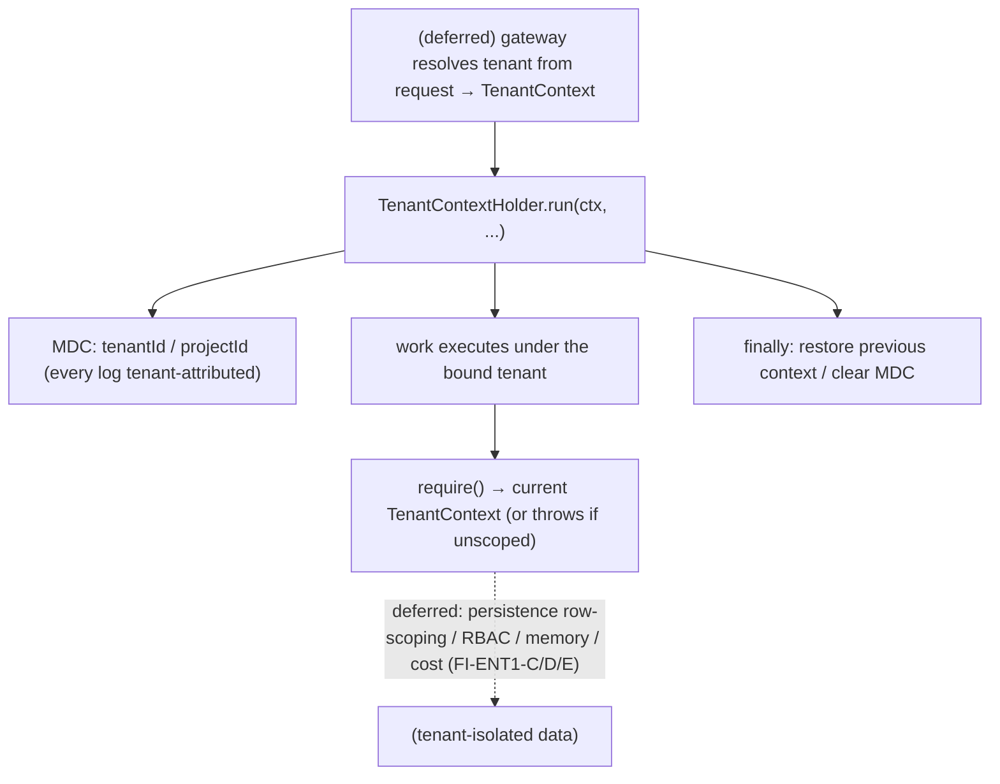

# ENT-1 — Technical Design: Multi-Tenancy / Project Isolation (Foundation)

**Version:** 1.0.0
**Document Type:** Implementation Technical Design
**Document Status:** Foundation Implemented — 2026-07-29 (§0.4 = A; ENT-1 remains In Progress; see [Implementation Outcome](#implementation-outcome))
**Last Updated:** 2026-07-29
**Roadmap item:** [`ENT-1`](./AI-QA-OS-Improvement-Roadmap.md#ent-1--multi-tenancy--project-isolation) (v2.2.0, frozen) — 🟠 P1 · Effort XL · Owner Platform / Enterprise · Phase 3 · v2.0
**Modules:** `ai-qa-os-core` (tenant-context contract). Also satisfies the `core`-contract portion of [MOD-1](./AI-QA-OS-Improvement-Roadmap.md#mod-1--ai-qa-os-tenant-project--tenant-context).
**Depends on:** MOD-1 (the `ai-qa-os-tenant` module — its *contract half* is delivered here; the module itself is deferred).

> **Scope discipline.** ENT-1 is **Effort XL** — it threads a tenant boundary through persistence, security, memory, cost, and execution. The roadmap is explicit: *"Best done early conceptually (as a context contract in `core`) even if enforcement lands incrementally."* This design delivers exactly that **foundation** — an immutable tenant context, a propagation holder (thread-local + MDC), and a `Tenanted` marker — **fully validatable**. All enforcement (the new module, row-level persistence tenancy, tenant-scoped RBAC/memory/cost, the gateway filter) is deferred and lands incrementally (§0.3). **ENT-1 stays `In Progress`** after this slice — the foundation, not the whole item.

---

## 0. Roadmap Verification, What Exists, and Scope

### 0.1 What ENT-1 requires

> Realise "Build Once, Use Everywhere" by threading a tenant/project boundary through persistence, security, memory, cost, and execution. Today both apps share one database with **no tenant boundary**. **Where:** a new `ai-qa-os-tenant` module (MOD-1) providing a tenant/project context propagated on every request from the gateway, enforced at persistence (row-level or schema-per-tenant), security (tenant-scoped RBAC), memory (tenant-scoped retrieval), and the artifact store. **Impact:** the largest structural change — *best done early as a context contract in `core`, even if enforcement lands incrementally.*

### 0.2 Verified current state

| Fact | Detail |
|---|---|
| No tenant identity | `core.context` has `WorkflowContext`/`AgentContext` — **no tenant/project field anywhere**; nothing isolates one project's data. |
| Propagation pattern exists | `CorrelationIdFilter` (gateway) sets `MDC` on each request and clears it in a `finally` — the model to mirror for tenant propagation. |
| No `ai-qa-os-tenant` module | MOD-1's module doesn't exist; its note says the **context contract should live in `core`**. |

### 0.3 Environment reality — foundation now, enforcement incrementally

- **Buildable + validatable now:** the **tenant-context contract** — an immutable `TenantContext`, a `TenantContextHolder` (thread-local + MDC propagation with scoped set/restore/clear), and a `Tenanted` marker for tenant-owned data. Pure in-process logic, unit-testable.
- **Deferred (the XL enforcement, incremental):** the new `ai-qa-os-tenant` module (MOD-1); a **gateway filter** resolving the tenant per request; **row-level persistence tenancy** (a `tenant_id` column + a Hibernate filter / query scoping — needs a DB); **tenant-scoped RBAC** (`security`), **tenant-scoped memory retrieval** (`memory`), **tenant cost isolation** (`ai-provider`), and artifact-store scoping. Each is a cross-module + DB change with a large blast radius — landed incrementally, not in one step.

### 0.4 / Decision for approval — scope of this first increment

| Option | Approach | Trade-off |
|---|---|---|
| **A — `core` tenant-context contract + propagation now; enforcement deferred (recommended)** | Deliver `TenantContext` + `TenantContextHolder` (thread-local + MDC + scoped execution) + `Tenanted` in `core`. Everything else (module, persistence, security, memory, cost, gateway) lands incrementally. ENT-1 → `In Progress`. | Exactly the roadmap's advice; the foundation every other module can reference without a cycle; fully validatable; zero blast radius. Doesn't isolate data yet. |
| **B — Build the `ai-qa-os-tenant` module + persistence enforcement now** | New module + `tenant_id` on entities + row-level query scoping + gateway filter, in one pass. | Matches the end-state, but is XL, **needs a database** (unvalidatable here), and touches persistence/security/memory at once — exactly the high-risk retrofit the roadmap says to avoid doing all at once. |

**Recommend A** — the roadmap explicitly prescribes doing the context contract in `core` early and letting enforcement land incrementally. Deliver the foundation now (validatable, no blast radius); each enforcement layer is its own follow-up (FI-ENT1-A…E).

> ✅ **Decision (confirmed 2026-07-29): Option A — `core` tenant-context contract (`TenantContext` + `TenantContextHolder` + `Tenanted`) with thread-local + MDC propagation; all enforcement deferred (FI-ENT1-A…E). ENT-1 → In Progress.** Recorded as ADR-041 (number verified at implement).

---

## 1. Technical Design (Option A)

### 1.1 Tenant-context contract (`ai-qa-os-core`, package `…tenant`)
- **`TenantContext`** — immutable `tenantId` + `projectId`; `of(tenantId, projectId)`; a `system()` singleton for platform-internal (non-tenant) operations; equals/hashCode.
- **`Tenanted`** — `String getTenantId()`: the marker a tenant-owned entity/record implements (the persistence dimension contract; enforcement deferred).
- **`TenantContextHolder`** — a `ThreadLocal<TenantContext>` current-tenant holder mirroring `CorrelationIdFilter`'s MDC discipline:
  - `set(ctx)` / `clear()` — also push/remove `tenantId` + `projectId` in `MDC` (so every log line is tenant-attributed);
  - `current()` → `Optional<TenantContext>`; `require()` → throws `TenantContextException` when absent (for code that must be tenant-scoped);
  - `run(ctx, Runnable)` / `call(ctx, Supplier<T>)` — scoped execution that **restores the previous** context afterwards (supports nesting) and clears cleanly.

### 1.2 What ENT-1 defers (incremental enforcement)
The `ai-qa-os-tenant` module (MOD-1 — FI-ENT1-A) · a gateway tenant-resolution filter (FI-ENT1-B) · row-level persistence tenancy — `tenant_id` + query scoping, needs a DB (FI-ENT1-C) · tenant-scoped RBAC in `security` (FI-ENT1-D) · tenant-scoped memory retrieval + cost isolation + artifact scoping (FI-ENT1-E).

---

## 2. Folder Structure

```
ai-qa-os-core/.../tenant/
    TenantContext.java          [N] immutable tenantId + projectId (+ system())
    Tenanted.java               [N] marker for tenant-owned data (getTenantId)
    TenantContextHolder.java    [N] thread-local + MDC + scoped run/call
    TenantContextException.java [N] thrown by require() when no context is bound
+ unit tests: holder (set/get/clear, current/require, scoped restore + nesting, MDC attribution).
```

---

## 3. Required Classes (key)

| Class | Type | Responsibility |
|---|---|---|
| `TenantContext` | New | Immutable tenant/project identity |
| `Tenanted` | New | Contract for tenant-owned data |
| `TenantContextHolder` | New | Propagation (thread-local + MDC) + scoped execution |
| `TenantContextException` | New | Missing-context signal |

---

## 4. Database Changes

**None in this increment.** Row-level `tenant_id` tenancy is deferred (FI-ENT1-C) — it needs a DB and a migration across tenant-owned tables, landed incrementally.

---

## 5. API Changes

**None.** The gateway tenant-resolution filter is deferred (FI-ENT1-B).

---

## 6. Sequence Diagram



---

## 7. Step-by-Step Implementation Plan

1. **Contract** — `TenantContext` (+ `system()`), `Tenanted`, `TenantContextException`.
2. **Holder** — `TenantContextHolder` (thread-local + MDC set/clear; `current`/`require`; `run`/`call` scoped restore).
3. **Tests** — set/get/clear, `current()` empty when unbound, `require()` throws/returns, scoped `run` restores previous (nested), MDC carries `tenantId` during scope + is cleared after. No Mockito.
4. **Build & validate** — `mvn -pl ai-qa-os-core -am test` (targeted); holder green; no existing core test disturbed.
5. **Sync docs** — tracker `ENT-1` → **In Progress** (foundation) + note MOD-1's core contract delivered; **ADR-041** (tenant-context contract in `core` + thread-local/MDC propagation; enforcement incremental). Verify ADR number at implement.

**Definition of Done (this increment):** a `TenantContext` can be bound to the current thread and propagated (with MDC attribution and safe scoped restore), and tenant-owned data has a `Tenanted` contract — deterministic and unit-proven. **Deferred (ENT-1 remains In Progress):** the tenant module, gateway filter, and all persistence/security/memory/cost enforcement.

---

## Implementation Outcome

Foundation implemented 2026-07-29 (§0.4 = A — `core` tenant-context contract). Recorded as **ADR-041**. **ENT-1 remains In Progress** (foundation only; enforcement deferred).

**Files (all new, `ai-qa-os-core/.../tenant/`):**
- `TenantContext` — immutable `tenantId`/`projectId`, `of`/`ofTenant`/`system()`, `isSystem()`, equals/hashCode.
- `Tenanted` — `getTenantId()` marker for tenant-owned data (persistence dimension).
- `TenantContextHolder` — `ThreadLocal` binding + MDC (`tenantId`/`projectId`) attribution; `current()`/`require()`; scoped `run`/`call` restoring the previous context (nesting-safe), clearing in `finally` — mirrors `CorrelationIdFilter`.
- `TenantContextException` — thrown by `require()` when unscoped.

**Validation (Maven):** `TenantContextHolderTest` **8/8** (bind/clear, `current` empty when unbound, `require` throws/returns, MDC push/remove, scoped `run` clears-after, nested `run` restores outer, `call` returns under context, `system()` marker). Ran with a constrained heap (`-DargLine=-Xmx320m`) due to machine memory pressure.

**⚠️ Validation caveat (environmental):** the core `ArchitectureRulesTest` (ArchUnit) crashed **non-deterministically** in its importer `setUp` (`importPackages`) with a `StackOverflowError`, following a hard JVM `OutOfMemory` this session (and pre-existing `hs_err_pid` logs). This is the memory-degraded machine's ArchUnit importer (Guava + `sun.misc.Unsafe` + ASM), **not a dependency violation** — the crash is in setUp *before any rule runs*, the failure varies across runs, ArchitectureRulesTest passed 4/4 in earlier `-am` runs this session, and the `core.tenant` classes depend only on `java.*` + slf4j (architecturally pure by inspection). **Action:** re-run the ArchUnit gate on a machine with memory headroom.

**Honest scope note:** the **tenant-context contract + propagation are unit-proven**; **no data is isolated yet** — the module (MOD-1), gateway filter, row-level persistence tenancy, and tenant-scoped RBAC/memory/cost/artifact enforcement are all deferred (FI-ENT1-A…E). ENT-1 stays **In Progress**.

---

## Appendix — Future Ideas (Outside Current Roadmap)

- **FI-ENT1-A** — The `ai-qa-os-tenant` module (MOD-1): tenant registry, resolution, lifecycle.
- **FI-ENT1-B** — Gateway tenant-resolution filter (mirror `CorrelationIdFilter`) binding the context per request.
- **FI-ENT1-C** — Row-level persistence tenancy (`tenant_id` + Hibernate filter / query scoping) — needs a DB.
- **FI-ENT1-D** — Tenant-scoped RBAC in `security`.
- **FI-ENT1-E** — Tenant-scoped memory retrieval + cost isolation + artifact-store scoping.

---

## Compliance Checklist

| Rule | Status |
|---|---|
| Roadmap not modified | ✅ ENT-1 metadata untouched |
| Follows roadmap's own guidance | ✅ "context contract in `core` early; enforcement incremental" |
| Dependency reality | ✅ contract in `core` (no cycle); enforcement modules deferred |
| Honest status | ✅ ENT-1 → **In Progress** (foundation only), not Completed |
| Non-breaking | ✅ additive; no schema/API; nothing else changed |
| ADR discipline | ✅ ADR-041 to be recorded (number verified at implement) |

---

## Document Completion Status

**Status:** Foundation Implemented — 2026-07-29 (§0.4 = A). ENT-1 remains In Progress. See [Implementation Outcome](#implementation-outcome). ADR-041.
**Version:** 1.0.0
**Implements:** `ENT-1` (roadmap v2.2.0, frozen) — the `core` tenant-context foundation; enforcement deferred. ENT-1 stays In Progress.
**Next step:** On approval + option choice, execute [§7](#7-step-by-step-implementation-plan) from Step 1. No code until approved.
