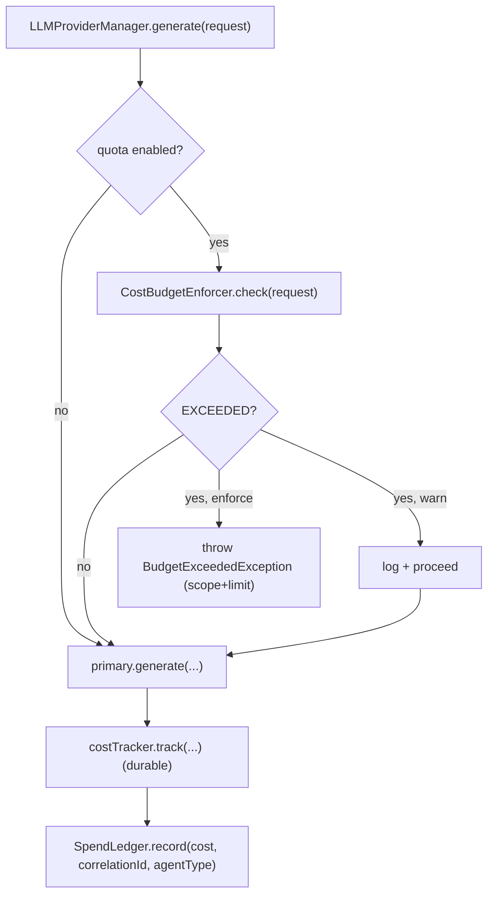

# ENT-3 — Technical Design: LLM Cost Governance & Quotas

**Version:** 1.0.0
**Document Type:** Implementation Technical Design
**Document Status:** Implemented — 2026-07-28 (soft cap; see [Implementation Outcome](#implementation-outcome))
**Last Updated:** 2026-07-28
**Roadmap item:** [`ENT-3`](./AI-QA-OS-Improvement-Roadmap.md#ent-3--llm-cost-governance-and-quotas) (v2.2.0, frozen) — 🟠 P1 · Effort M · Owner Platform / AI-Brain · Phase 3 · v2.0
**Module:** `ai-qa-os-ai-provider` (the LLM choke point) · surfaced later on the dashboard cost views.
**Depends on:** ENT-1 (tenancy — for the *per-tenant* dimension, Planned) · AI-6 (per-workflow budgeting).

> **Scope discipline.** ENT-3 turns cost *observability* into cost *control*: enforce budgets at the one point every LLM call passes through (`LLMProviderManager.generate`). Scope this slice to **global / per-workflow / per-agent** quotas — the tenancy-independent ones; **per-tenant** quotas layer on once ENT-1 exists.

---

## 0. Roadmap Verification, the Choke Point, and Placement

### 0.1 What ENT-3 requires

> `CostTracker` records spend but nothing *enforces* a limit... uncapped LLM spend is an unacceptable financial risk. **Where:** budget/quota enforcement, per-tenant once ENT-1 exists, surfaced on the dashboard cost views. Ties AI-6 + ENT-1 together.

### 0.2 Verified facts

| Fact | Detail |
|---|---|
| Single choke point | Every LLM call goes through `LLMProviderManager.generate(LLMRequest)`, which already calls `costTracker.track(request, response, provider)` **after** the call. Enforcement = a **pre-flight check** before it. |
| Request carries the scope keys | `LLMRequest` exposes `getCorrelationId()` (the workflow), `getAgentType()`, `getPurpose()` — enough to key global / per-workflow / per-agent budgets without tenancy. |
| Cost is known only *after* the call | Tokens aren't known until the response, so a precise pre-call cost is not available (drives §0.4). |
| Prior art | `AgentExecutionBudget` (agents-runtime, execution-step budgeting) and `RateLimiter` (security, request-rate). ENT-3 is the complementary **$-cost** budget — different axis, same "enforce" spirit. |

### 0.3 Placement — `ai-provider`, not `brain` (dependency direction)

The roadmap says "enforcement in `ai-qa-os-brain`," but **`brain` depends on `ai-provider`**, not the reverse — so a brain-resident enforcer consulted by `LLMProviderManager` would invert the dependency. Enforcement therefore lives in **`ai-provider`** beside `CostTracker` and the manager (the natural choke point). The brain/dashboard *surface* the limits (deferred). *(Same reasoning as ADR-010's ConfidenceGate, mirrored.)*

### 0.4 / Decision for approval — the enforcement model (cost is only known post-call)

| Option | Approach | Trade-off |
|---|---|---|
| **A — Soft cap (recommended)** | Before a call, if the scope's **already-accumulated** spend ≥ its limit, block (or warn); otherwise allow, then record the actual cost after. | No fragile pre-call estimation; spend is **bounded** (a scope may overshoot by ≤ one in-flight call before it's cut off). Standard, robust. |
| **B — Hard cap via estimation** | Estimate this call's cost from prompt length + `maxTokens` and block if it *would* exceed. | Never overshoots, but the estimate is approximate (real tokens differ) and adds a token-costing model to maintain. |

**Recommend A** — a soft cap bounds spend reliably without guessing token counts; the ≤1-call overshoot is negligible against the risk it prevents (uncapped runaway). Enforcement is **opt-in** (`aiqaos.cost.quota.enabled=false` default) with an `enforce`/`warn` mode, so it's non-breaking.

> ✅ **Decision (confirmed 2026-07-28): Option A — soft cap** (pre-flight block when the scope's accumulated spend has hit its limit; opt-in; enforce/warn). Recorded as ADR-025 (number verified at implement).

---

## 1. Technical Design (Option A)

### 1.1 Budget policy (config)
- **`CostBudgetProperties`** (`@ConfigurationProperties("aiqaos.cost.quota")`) — `enabled` (false default), `mode` (`enforce`/`warn`), and optional limits in USD: `global-daily`, `per-workflow`, `per-agent`. An unset limit = unlimited for that scope.

### 1.2 Spend accumulation
- **`SpendLedger`** — thread-safe in-memory accumulator: `record(cost, correlationId, agentType)` and `spend(scope, key)`; a **daily** rollover for the global counter. The durable record stays in `LLMCostEntity` (CostTracker); the ledger is the fast enforcement view. *(Seeding the ledger from `LLMCostRepository` on startup for cross-restart accuracy is FI-ENT3-A.)*

### 1.3 Enforcement
- **`CostBudgetEnforcer`** — `check(LLMRequest)` → `BudgetVerdict` (ALLOW / EXCEEDED + which scope/limit). Compares `SpendLedger` spend against `CostBudgetProperties` for global, workflow (`correlationId`), and agent (`agentType`).
- **`BudgetExceededException`** (extends `ProviderException`) — thrown on an enforced breach.
- **Wire into `LLMProviderManager.generate`** (optional bean via `ObjectProvider`, non-breaking): *pre-flight* `check`; on EXCEEDED → `enforce` throws, `warn` logs; after the existing `costTracker.track(...)`, also `ledger.record(...)`.

### 1.4 What ENT-3 defers
Per-**tenant** quotas (ENT-1) · dashboard cost-limit widgets (dashboard/PE-3) · durable cross-restart ledger seeding (FI-ENT3-A) · hard-cap estimation (FI-ENT3-B) · budget alerts/notifications (ENT-2).

---

## 2. Folder Structure

```
ai-qa-os-ai-provider/.../cost/  CostBudgetProperties.java     [N] config
                                SpendLedger.java              [N] in-memory accumulator (daily rollover)
                                CostBudgetEnforcer.java       [N] check(request) → verdict
                                BudgetExceededException.java  [N]
ai-qa-os-ai-provider/.../manager/LLMProviderManager.java     [M] pre-flight check + ledger.record (ObjectProvider, opt-in)
+ unit tests: SpendLedger accumulation/rollover, CostBudgetEnforcer verdicts (global/workflow/agent, enforce vs warn).
```

---

## 3. Required Classes (key)

| Class | Type | Responsibility |
|---|---|---|
| `CostBudgetProperties` | New | Config: enabled/mode + global/workflow/agent limits |
| `SpendLedger` | New | Thread-safe spend accumulation (+ daily rollover) |
| `CostBudgetEnforcer` | New | Pre-flight verdict vs the budgets |
| `BudgetExceededException` | New | Enforced-breach signal |
| `LLMProviderManager` | Modified | Pre-flight check + record after track (opt-in) |

---

## 4. Database Changes

**None.** Durable spend already lives in `LLMCostEntity` (CostTracker). ENT-3 reads/derives; it adds no schema. (A durable budget table, if ever needed for cross-restart caps, is FI-ENT3-A.)

---

## 5. API Changes

**None to contracts.** An enforced breach surfaces as a `BudgetExceededException` (mapped like other provider errors). No new endpoints (the dashboard surface is deferred).

---

## 6. Sequence Diagram



---

## 7. Step-by-Step Implementation Plan

1. **Config** — `CostBudgetProperties` (`aiqaos.cost.quota.*`, disabled default).
2. **Ledger** — `SpendLedger` (accumulate per global/workflow/agent; daily rollover; thread-safe).
3. **Enforcer** — `CostBudgetEnforcer.check` + `BudgetVerdict`; `BudgetExceededException`.
4. **Wire** — `LLMProviderManager`: `ObjectProvider<CostBudgetEnforcer>` pre-flight check + `ledger.record` after track (opt-in, non-breaking).
5. **Tests** — ledger accumulation + rollover; enforcer verdicts across scopes; enforce-throws vs warn-logs; disabled = no-op. No Mockito (hand stubs).
6. **Build & validate** — `mvn clean test`; all 22 modules green; provider tests + existing `CostTrackerTest`/`LLMResilienceManagerTest` unaffected (enforcement off by default).
7. **Sync docs** — tracker `ENT-3`; **ADR-025** (cost enforcement at the provider choke point; soft-cap; ai-provider placement). Verify the next ADR number at implement.

**Definition of Done:** with quotas enabled, an LLM call is blocked (or warned) once its global/workflow/agent scope has hit the configured USD limit; spend accumulates in a thread-safe ledger alongside the durable `LLMCostEntity` record; default-off keeps everything non-breaking; logic unit-proven. **Deferred:** per-tenant quotas (ENT-1), dashboard surface, cross-restart durable caps.

---

## Implementation Outcome

Implemented 2026-07-28 (§0.4 = A, soft cap). Recorded as **ADR-025**. **Fully validated here** — no infra caveat.

**Files (all in `ai-qa-os-ai-provider`):**
- **cost/** — `CostBudgetProperties` (`@ConfigurationProperties("aiqaos.cost.quota")`, off by default), `SpendLedger` (in-memory per workflow/agent/global + daily rollover via an injectable clock), `CostBudgetEnforcer` (`check(request)` → `BudgetVerdict`), `BudgetVerdict`; `exception/BudgetExceededException` (extends `ProviderException`).
- **cost/CostTracker** [M] — records the actual cost into `SpendLedger` after persisting (optional field; null in direct-construction tests).
- **manager/LLMProviderManager** [M] — optional field-injected `CostBudgetEnforcer`; pre-flight `check` before the real provider call (cache/simulator hits never reach it); `enforce` throws `BudgetExceededException`, `warn` logs.

**Placement note:** enforcement lives in **ai-provider, not brain** as the roadmap said — brain depends on ai-provider, so a brain-side enforcer would invert the dependency. Documented in ADR-025 (same reasoning as ConfidenceGate/ADR-010).

**Validation (Maven; env JDK 26):** `mvn -pl ai-qa-os-ai-provider -am test` → **BUILD SUCCESS, 28 tests** — `CostBudgetEnforcerTest` (4: disabled-allows, per-workflow/global/agent blocks, warn mode), `SpendLedgerTest` (2: accumulation + daily rollover), and existing `CostTrackerTest` (3, unchanged — non-breaking). Full reactor `mvn clean test` run to confirm downstream (enforcer/ledger are now `@Component`s in the full context; disabled by default = no-op).

**Honest scope note:** the in-memory ledger is **per-instance and resets on restart** (daily/global caps aren't cross-restart yet — FI-ENT3-A); the soft cap can overshoot by ≤1 in-flight call; **per-tenant** quotas await ENT-1; the dashboard cost-limit surface is deferred. The core "cap runaway spend per workflow/agent/day" enforcement is done and unit-proven.

---

## Appendix — Future Ideas (Outside Current Roadmap)

- **FI-ENT3-A** — Seed/persist the ledger from `LLMCostRepository` so daily/global caps survive restarts and span instances.
- **FI-ENT3-B** — Optional hard-cap pre-call estimation for zero-overshoot budgets.
- **FI-ENT3-C** — Budget-threshold alerts (80 %/100 %) via ENT-2 notifications + the cost dashboard.

---

## Compliance Checklist

| Rule | Status |
|---|---|
| Roadmap not modified | ✅ ENT-3 metadata untouched |
| Dependency reality | ✅ tenancy-independent scopes now; per-tenant deferred to ENT-1 |
| Dependency direction | ✅ enforcement in `ai-provider` (brain→provider, not reverse); documented deviation from "brain" |
| Non-breaking | ✅ quotas disabled by default; optional bean; no schema/API change |
| Builds on prior art | ✅ complements `AgentExecutionBudget`/`RateLimiter`; reuses `CostTracker`/`LLMCostEntity` |
| ADR discipline | ✅ ADR-025 to be recorded (number verified at implement) |

---

## Document Completion Status

**Status:** Implemented — 2026-07-28 (§0.4 = A, soft cap). See [Implementation Outcome](#implementation-outcome).
**Version:** 1.0.0
**Implements:** `ENT-3` (roadmap v2.2.0, frozen) — global/workflow/agent LLM cost quotas at the provider boundary; per-tenant deferred to ENT-1.
