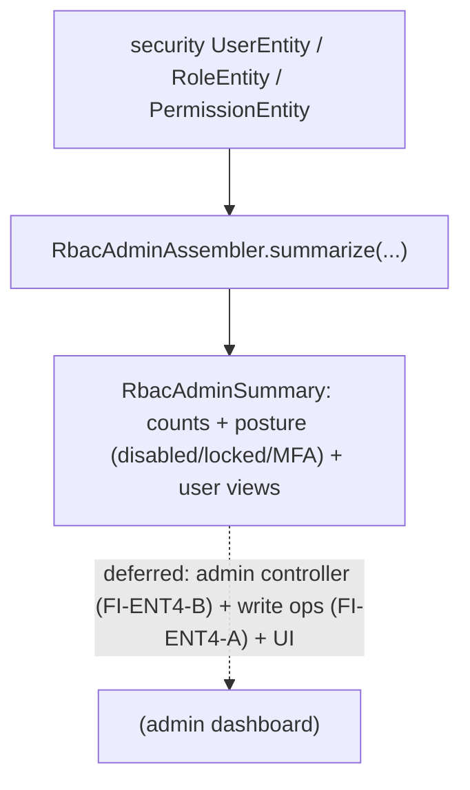

# ENT-4 — Technical Design: Admin & User-Management Surface (Read-Model Increment)

**Version:** 1.0.0
**Document Type:** Implementation Technical Design
**Document Status:** Read-model implemented — 2026-07-29 (§0.4 = A; ENT-4 remains In Progress; see [Implementation Outcome](#implementation-outcome))
**Last Updated:** 2026-07-29
**Roadmap item:** [`ENT-4`](./AI-QA-OS-Improvement-Roadmap.md#ent-4--admin--user-management-surface) (v2.2.0, frozen) — 🟡 P2 · Effort M · Owner Dashboard + Security · Phase 3 · v2.0
**Modules:** `ai-qa-os-dashboard` (RBAC admin read-model over `ai-qa-os-security` entities).
**Depends on:** the existing `ai-qa-os-security` RBAC entities (users/roles/permissions — ✅).

> **Scope discipline.** ENT-4 activates the already-modelled RBAC data (users, roles, permissions, sessions) that today has no admin surface. This increment delivers the **admin read-model** — a pure assembler over the security entities producing a user/role/permission overview + security-posture counts — **fully validatable** (the dashboard already depends on `security`). The admin **UI** and **write operations** (create user, assign role) are deferred (§0.3), so **ENT-4 lands `In Progress`**.

---

## 0. Roadmap Verification & Scope

### 0.1 What ENT-4 requires
> RBAC entities exist (users, roles, permissions, API keys, sessions) but there is **no admin UI or API** to manage them — today it would be raw SQL. **Where:** admin endpoints on `dashboard`/`gateway` over the existing `security` entities + a real settings/admin view. **Impact:** activates already-modelled RBAC data; no new persistence — exposes what exists.

### 0.2 Verified state & placement
- `ai-qa-os-security` has `UserEntity` (username/email/enabled/mfaEnabled/accountLocked/tenantId/…), `RoleEntity` (roleName), `PermissionEntity`, `UserSessionEntity` + repositories. No admin surface.
- The **dashboard module depends on `security`** (unlike the learning/eval dashboards) — so the admin read-model can live in `dashboard` and read the entities directly.

### 0.3 Environment reality
- **Validatable now:** a pure `RbacAdminAssembler` over the security entities → an `RbacAdminSummary` (user/role/permission counts, security posture — disabled/locked/MFA — and per-user `AdminUserView`s). Pure logic.
- **Deferred:** the admin **UI** (frontend); **write operations** (create/disable user, assign role — mutating RBAC needs validation + authz care — FI-ENT4-A); a controller/endpoint (FI-ENT4-B); user↔role mapping (no direct join accessor on `UserEntity` — FI-ENT4-C).

### 0.4 / Decision for approval — scope

| Option | Approach | Trade-off |
|---|---|---|
| **A — RBAC admin read-model now; write ops + UI deferred (recommended)** | `RbacAdminSummary` + `AdminUserView` + pure `RbacAdminAssembler(users, roles, permissions)`. Write endpoints + UI deferred. ENT-4 → `In Progress`. | Surfaces the RBAC state (the "no visibility" pain) safely and validatably; zero blast radius. No mutation or UI yet. |
| **B — Also build write endpoints (create user / assign role) now** | Mutating admin endpoints + a controller. | The highest-risk part (modifying auth data) with no UI to drive it and limited validation here — better done deliberately with the UI. |

**Recommend A** — surface the RBAC state now (read-only, safe, validatable); the mutating admin operations belong with the UI and careful authz (FI-ENT4-A).

> ✅ **Decision (confirmed 2026-07-29): Option A — `RbacAdminSummary` + `AdminUserView` + pure `RbacAdminAssembler` over the security entities in `ai-qa-os-dashboard`; write ops + UI + endpoint deferred (FI-ENT4-A/B). ENT-4 → In Progress.** Recorded as ADR-052 (number verified at implement).

---

## 1. Technical Design (Option A)

`ai-qa-os-dashboard`:
- **`AdminUserView`** (dto) — `username`, `email`, `enabled`, `mfaEnabled`, `accountLocked`.
- **`RbacAdminSummary`** (dto) — `userCount`, `disabledUserCount`, `lockedUserCount`, `mfaEnabledCount`, `roleCount`, `permissionCount`, `users` (List of views), `roleNames`.
- **`RbacAdminAssembler`** (`@Component`, pure) — `summarize(List<UserEntity>, List<RoleEntity>, List<PermissionEntity>)`: map users → views, count the security-posture fields, list role names.

**Defers:** admin UI · write operations (FI-ENT4-A) · controller/endpoint (FI-ENT4-B) · user↔role mapping (FI-ENT4-C).

---

## 2. Folder Structure
```
ai-qa-os-dashboard/.../dto/
    AdminUserView.java     [N]  RbacAdminSummary.java [N]
ai-qa-os-dashboard/.../service/
    RbacAdminAssembler.java [N] @Component: summarize(users, roles, permissions)
+ unit tests: assembler (counts, security-posture tallies, user views, empty).
```

---

## 3–5. Classes / DB / API
Key classes above. **DB:** none (reads existing RBAC tables). **API:** none (admin endpoints deferred — FI-ENT4-B).

---

## 6. Sequence


---

## 7. Plan
1. **DTOs** — `AdminUserView`, `RbacAdminSummary`.
2. **Assembler** — `RbacAdminAssembler.summarize(users, roles, permissions)` (map + count posture).
3. **Tests** — counts (users/roles/permissions); posture tallies (disabled/locked/MFA); user views mapped; empty→zeroed. No Mockito (hand-built entities).
4. **Build & validate** — targeted `mvn -pl ai-qa-os-dashboard -am test -Dtest=… -Djacoco.skip=true -DargLine="-Xss40m"`; green; existing dashboard tests unaffected.
5. **Sync docs** — tracker `ENT-4` → **In Progress** (read-model; UI + write ops deferred); **ADR-052** (RBAC admin read-model over the security entities). Verify number at implement.

**DoD (this increment):** the RBAC state (users + roles + permissions + security posture) composes into an admin summary — unit-proven. **Deferred:** admin UI, write operations, endpoint, user↔role mapping. ENT-4 stays In Progress.

---

## Implementation Outcome

Read-model implemented 2026-07-29 (§0.4 = A — RBAC admin read-model). Recorded as **ADR-052**. **ENT-4 remains In Progress** (UI + write ops deferred).

**Files (`ai-qa-os-dashboard`):**
- `dto/AdminUserView` (username/email/enabled/mfaEnabled/accountLocked — secret-free), `dto/RbacAdminSummary` (counts + posture tallies + users + roleNames), `service/RbacAdminAssembler` (`@Component`, pure `summarize(users, roles, permissions)`).

**Validation (Maven):** `mvn -pl ai-qa-os-dashboard -am test` → **BUILD SUCCESS**; `RbacAdminAssemblerTest` **3/3** (counts + disabled/locked/MFA posture, user-view mapping without secrets, empty/null→zeroed). The dashboard `@SpringBootTest` context (`ComparisonControllerTest`) + HEAL-3's assembler green — additive `@Component`, no wiring impact. Ran with `-Djacoco.skip=true -DargLine="-Xss40m"`.

**Honest scope note:** the **RBAC read-model is unit-proven** (secret-free, no new persistence — activates existing entities). **Deferred:** the admin **UI** (frontend); **write operations** (create/disable user, assign role) with authz (FI-ENT4-A); the controller/endpoint (FI-ENT4-B); user↔role mapping (FI-ENT4-C). ENT-4 stays In Progress.

---

## Appendix — Future Ideas
- **FI-ENT4-A** — Write operations (create/disable user, assign/revoke role) with authz + validation.
- **FI-ENT4-B** — Admin controller/endpoint + the settings/admin UI (persisting what `/settings` today drops).
- **FI-ENT4-C** — User↔role mapping in the views (needs the join accessor).

---

## Compliance Checklist
| Rule | Status |
|---|---|
| Roadmap not modified | ✅ ENT-4 metadata untouched |
| Activates existing RBAC (no new persistence) | ✅ reads `security` entities |
| Dependency reality | ✅ read-model in `dashboard` (already depends on `security`) |
| Honest status | ✅ ENT-4 → In Progress (read-only; UI + writes deferred) |
| Non-breaking | ✅ additive; security untouched |
| Spring-wiring sanity | ✅ no-arg `@Component` assembler (per 2026-07-29 lesson) |
| ADR discipline | ✅ ADR-052 to be recorded (number verified at implement) |

---

## Document Completion Status
**Status:** Read-model implemented — 2026-07-29 (§0.4 = A). ENT-4 remains In Progress. See [Implementation Outcome](#implementation-outcome). ADR-052.
**Implements:** `ENT-4` (roadmap v2.2.0, frozen) — the RBAC admin read-model; UI + write ops deferred.
**Next step:** On approval + option choice, execute [§7](#7-step-by-step-implementation-plan) from Step 1.
