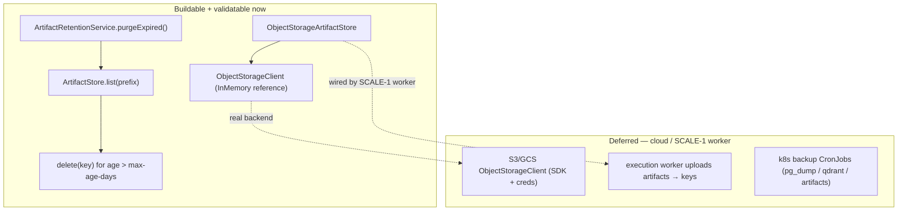

# ENT-5 — Technical Design: Backup, Disaster Recovery & Data Lifecycle

**Version:** 1.0.0
**Document Type:** Implementation Technical Design
**Document Status:** Seam implemented — 2026-07-23 (real cloud/CronJobs deferred; see [Implementation Outcome](#implementation-outcome))
**Last Updated:** 2026-07-23
**Roadmap item:** [`ENT-5`](./AI-QA-OS-Improvement-Roadmap.md#ent-5--backup-disaster-recovery-and-data-lifecycle) (v2.2.0, frozen) — ⚪ P3 · Effort M · Owner Infrastructure · Phase 2 · v1.5
**Status change:** **`Deferred` → un-deferred at user request (2026-07-23)** to unblock [SCALE-1](./AI-QA-OS-SCALE-1-Technical-Design.md).
**Modules:** `ai-qa-os-execution` (object-storage artifact store + retention) · `deployment/` (backup CronJobs).

> **Scope discipline.** ENT-5 has three concerns: **object storage for artifacts** (the SCALE-1 unblocker), **artifact retention/lifecycle**, and **backup/DR** for Postgres + the vector store. This design separates what is **code and validatable here** (the object-storage `ArtifactStore` impl behind an in-memory-testable client seam + retention) from what is **deployment-only / needs cloud** (real S3/GCS credentials, backup CronJobs).

---

## 0. Roadmap Verification, the SCALE-1 Link, and the Reality Check

### 0.1 What ENT-5 requires

> PostgreSQL, the vector store, and the growing `playwright-output/` artifact tree have no backup, retention, or DR strategy; artifacts accumulate unbounded on local disk. **Where:** `deployment/` (backup CronJobs, **object storage for artifacts** instead of local disk), artifact **retention policy** in `ai-qa-os-execution`. **Moving artifacts to object storage (S3/GCS) unblocks horizontal execution scaling ([SCALE-1](#scale-1)).**

### 0.2 What SCALE-1 already provides (ENT-5 fills its seam)

SCALE-1 delivered the **`ArtifactStore`** seam (`store`/`resolve`/`exists`) + `LocalArtifactStore`, explicitly so ENT-5 could supply an object-storage impl. ENT-5 is the intended seam-fill. To also do retention, `ArtifactStore` gains **`list(prefix)`** and **`delete(key)`**.

### 0.3 / Environment Reality (same wall as SCALE-1's distributed tier)

| Concern | Buildable & validatable here? |
|---|---|
| **Object-storage `ArtifactStore`** | **Logic: yes** — behind an injectable `ObjectStorageClient` seam with an **in-memory** reference, the store/resolve/list/delete/key-mapping is fully unit-testable. **Against real S3/GCS: no** — needs the cloud SDK + credentials + a bucket (unavailable). |
| **Retention/lifecycle** | **Yes** — age-based deletion over `ArtifactStore.list`/`delete`, unit-testable against `LocalArtifactStore`. |
| **Backup/DR CronJobs** (pg_dump, vector snapshot, artifact sync) | **No** — pure Kubernetes YAML; authorable and structurally checkable, but not runnable without a cluster. |

**Honest chain-of-deferral:** even a validated in-memory object-storage impl does **not** move production artifacts to the cloud by itself — that needs the **real S3/GCS adapter (credentials)** *and* the execution worker wired to **upload** artifacts (part of SCALE-1's containerised-worker rewrite). So SCALE-1's single-host ceiling is **not** removed by this ENT-5 slice; but the object-storage `ArtifactStore` will **exist and be unit-proven** — the concrete code-level unblock.

### 0.4 / Decision for approval — how to deliver the object-storage store

| Option | Approach | Trade-off |
|---|---|---|
| **A — Client-seam + in-memory-validatable impl (recommended)** | `ObjectStorageClient` seam (put/get/exists/list/delete) + `InMemoryObjectStorageClient` (reference) + `ObjectStorageArtifactStore implements ArtifactStore` fully unit-tested against the in-memory client. The **real S3/GCS adapter** is a thin deferred binding (SDK + creds). | Delivers a **validatable** object-storage impl (the code-level SCALE-1 unblock) with **no un-testable code and no SDK bloat now**; the cloud adapter drops in later. Consistent with the platform's seam pattern (ConfidenceGate, Guardrail, ExecutionJobQueue). |
| **B — Full S3-SDK impl now** | Add the AWS SDK and implement `ObjectStorageArtifactStore` directly against S3. | Closer to "done", but **cannot be validated** here (no bucket/creds), adds a heavy dependency, and unit tests would mock the SDK anyway. |

**Recommend A** — it gives a real, tested object-storage `ArtifactStore` that SCALE-1 can wire, while keeping the un-validatable cloud specifics (SDK/creds) as a thin deferred adapter. Retention = **age-based** (delete artifacts older than a configurable window), **opt-in** (disabled by default — never deletes without being switched on). Backup CronJobs are authored as `deployment/` YAML (structural only).

> ✅ **Decision (confirmed 2026-07-23): Option A — client-seam + in-memory-validatable `ObjectStorageArtifactStore`; real S3/GCS adapter deferred.** Retention age-based + opt-in. Recorded as ADR-018.

---

## 1. Technical Design (Option A)

### 1.1 Extend the artifact seam (`execution`)
- **`ArtifactStore`** gains `List<String> list(String prefix)` and `void delete(String key)`. `LocalArtifactStore` implements both (filesystem walk under the base dir; delete with the same traversal guard).

### 1.2 Object-storage artifact store (`execution`)
- **`ObjectStorageClient`** — seam: `put(key, bytes)`, `get(key)`, `exists(key)`, `list(prefix)`, `delete(key)`.
- **`InMemoryObjectStorageClient`** — a `ConcurrentHashMap`-backed reference (test + local reference).
- **`ObjectStorageArtifactStore implements ArtifactStore`** — maps `ArtifactStore` calls onto an `ObjectStorageClient` (prefixing keys with a configurable bucket path). Fully unit-testable against the in-memory client.
- Bean selection via `aiqaos.artifacts.store` (`local` default → `LocalArtifactStore`; `object` → `ObjectStorageArtifactStore`), so exactly one `ArtifactStore` is active.
- **Deferred:** `S3ObjectStorageClient` (AWS SDK) / `GcsObjectStorageClient` — thin adapters, credentials-gated, not built here.

### 1.3 Retention / lifecycle (`execution`)
- **`ArtifactRetentionService`** — deletes artifacts older than `aiqaos.artifacts.retention.max-age-days` via `ArtifactStore.list` + `delete`; **opt-in** (`aiqaos.artifacts.retention.enabled=false` default). Exposed as an on-demand method (`purgeExpired()` returning a count) and optionally driven by `@Scheduled` when enabled. Age is derived from a key/timestamp convention (documented) so it works over both stores.

### 1.4 Backup / DR (`deployment/`)
- **`deployment/kubernetes/backup/`** CronJob manifests: `postgres-backup` (pg_dump → object storage), `qdrant-backup` (vector snapshot), `artifacts-backup` (sync/retain). Structural YAML mirroring the existing `databases/*.yaml`; not runnable here.

### 1.5 What ENT-5 defers
Real S3/GCS adapter (SDK + creds) · wiring the **execution worker to upload** artifacts to the store (SCALE-1 worker rewrite) · running the backup CronJobs (needs a cluster).

---

## 2. Folder Structure

```
ai-qa-os-execution/.../artifact/  ArtifactStore.java                 [M] + list/delete
                                  LocalArtifactStore.java            [M] implement list/delete
                                  ObjectStorageClient.java           [N] seam
                                  InMemoryObjectStorageClient.java   [N] reference
                                  ObjectStorageArtifactStore.java    [N] ArtifactStore over a client
ai-qa-os-execution/.../lifecycle/ ArtifactRetentionService.java      [N] age-based, opt-in
deployment/kubernetes/backup/     postgres-backup.yaml · qdrant-backup.yaml · artifacts-backup.yaml  [N] structural
+ unit tests: ObjectStorageArtifactStore (in-memory client), ArtifactRetentionService, LocalArtifactStore list/delete.

Deferred: S3ObjectStorageClient / GcsObjectStorageClient (SDK + creds); execution-worker upload wiring.
```

---

## 3. Required Classes (key)

| Class | Type | Responsibility |
|---|---|---|
| `ArtifactStore` (+`list`/`delete`) | Modified | Seam now supports enumeration + deletion |
| `ObjectStorageClient` / `InMemoryObjectStorageClient` | New | Cloud-storage seam + in-memory reference |
| `ObjectStorageArtifactStore` | New | `ArtifactStore` backed by an `ObjectStorageClient` (SCALE-1 unblock) |
| `ArtifactRetentionService` | New | Age-based, opt-in artifact purge |
| backup CronJob manifests | New | pg_dump / vector snapshot / artifact backup (deployment) |

---

## 4. Database Changes

**None.** Retention operates on the artifact store, not the DB. (Postgres backup is an ops CronJob, not a schema change.)

---

## 5. API Changes

**None.** Internal capability + deployment manifests. (Retention is a service method / scheduled task, not an endpoint.)

---

## 6. Sequence Diagram



---

## 7. Step-by-Step Implementation Plan

1. **Extend `ArtifactStore`** with `list`/`delete`; implement in `LocalArtifactStore` (traversal-guarded).
2. **Object storage** — `ObjectStorageClient` + `InMemoryObjectStorageClient` + `ObjectStorageArtifactStore`; bean selection via `aiqaos.artifacts.store`.
3. **Retention** — `ArtifactRetentionService` (opt-in, age-based, on-demand `purgeExpired()`).
4. **Backup manifests** — `deployment/kubernetes/backup/*.yaml` (structural).
5. **Tests** — `ObjectStorageArtifactStore` against the in-memory client (store/resolve/list/delete/key-mapping); `ArtifactRetentionService` (old purged, fresh kept, disabled = no-op); `LocalArtifactStore` list/delete. Hand-written stubs, no Mockito.
6. **Build & validate** — reactor build + execution tests; confirm SCALE-1's existing `LocalArtifactStore`/queue tests still pass. Report honestly what is unvalidatable (real S3/GCS, CronJobs).
7. **Sync docs** — tracker `ENT-5` status; **ADR-018** (artifact object-storage via a client seam + opt-in retention; backup as ops CronJobs); note the SCALE-1 unblock is code-level (real cloud + worker-upload still deferred).

**Definition of Done (this slice):** a unit-proven `ObjectStorageArtifactStore` exists behind the `ArtifactStore` seam (SCALE-1 can wire it); artifacts can be enumerated and age-purged (opt-in); backup CronJob manifests are authored. **Not done:** real S3/GCS binding (creds), execution-worker upload, running backups — all deferred/ops.

---

## Implementation Outcome

Seam implemented 2026-07-23 (§0.4 = A). Recorded as **ADR-018** (Accepted — Partial). ENT-5 **In Progress** (un-deferred at user request); real cloud binding + running backups deferred.

**Files (execution + deployment):**
- **artifact/** — `ArtifactStore` [M] +`list`/`delete`/`lastModified`; `LocalArtifactStore` [M] implements them (+ store-selection condition); `ObjectStorageClient` [N] seam; `InMemoryObjectStorageClient` [N] reference (`@ConditionalOnMissingBean` so a real client overrides it); `ObjectStorageArtifactStore` [N] — object-storage `ArtifactStore`, prefix-namespaced, key-guarded.
- **lifecycle/** — `ArtifactRetentionService` [N] — age-based `purgeExpired()`, opt-in (`aiqaos.artifacts.retention.enabled=false` default).
- **deployment/kubernetes/backup/** — `postgres-backup.yaml`, `qdrant-backup.yaml`, `artifacts-backup.yaml` [N] — CronJob templates.
- **tests** — `ObjectStorageArtifactStoreTest` (4, in-memory client), `ArtifactRetentionServiceTest` (2), `LocalArtifactStoreTest` (+list/delete) — **10/10** in execution.

**Config:** `aiqaos.artifacts.store` (`local` default / `object`), `aiqaos.artifacts.object.prefix`, `aiqaos.artifacts.retention.{enabled,max-age-days,prefix}`. Defaults keep the current behaviour (local store, retention off) — non-breaking.

**Validation (Maven):** full reactor **`mvn test` → BUILD SUCCESS, all 22 modules**; execution tests green; apps boot with the conditional store beans + retention service. Hand-written stubs, no Mockito.

**Honest scope note:** delivers a **unit-proven object-storage `ArtifactStore`** (SCALE-1 can wire it) + opt-in retention + backup templates. It does **not** move production artifacts to the cloud — that needs the **real S3/GCS adapter (credentials)** and the **execution worker wired to upload** (SCALE-1's worker rewrite), plus a cluster to run the CronJobs. So **SCALE-1's single-host ceiling is still not removed**; this is the object-storage capability, unit-proven, not a running cloud pipeline. The two remaining real steps (S3 adapter + worker-upload) both need infra/creds this environment lacks.

---

## Appendix — Future Ideas (Outside Current Roadmap)

- **FI-ENT5-A** — Count/size-based retention (keep last N runs / cap total size) in addition to age-based.
- **FI-ENT5-B** — Restore tooling + a periodic DR drill to prove the backups are recoverable, not just produced.
- **FI-ENT5-C** — Lifecycle rules pushed to the bucket itself (S3 lifecycle / object TTL) instead of an app-driven purge.

---

## Compliance Checklist

| Rule | Status |
|---|---|
| Roadmap not modified | ✅ ENT-5 metadata unchanged (status un-defer is the explicit user request) |
| No new modules | ✅ `execution` + `deployment/` |
| Dependency direction | ✅ object-storage impl in `execution` behind the SCALE-1 `ArtifactStore` seam; no reversed deps |
| Non-breaking | ✅ `local` store + retention-off remain the defaults |
| Honesty (ADR-009) | ✅ real-cloud + CronJobs + worker-upload flagged un-validatable/deferred |
| ADR discipline | ✅ ADR-018 to be recorded |

---

## Document Completion Status

**Status:** Seam implemented — 2026-07-23 (§0.4 = A). ENT-5 **In Progress**; real cloud binding + CronJobs deferred. See [Implementation Outcome](#implementation-outcome).
**Version:** 1.0.0
**Implements:** `ENT-5` (roadmap v2.2.0, frozen) — object-storage `ArtifactStore` + retention + backup manifests; real cloud binding deferred.
