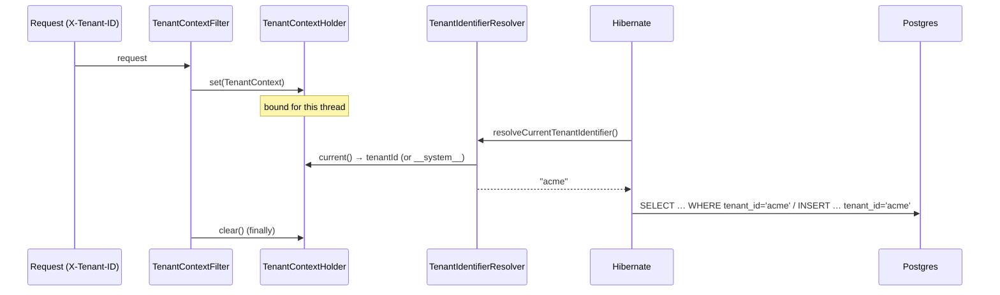

# FI-ENT1-C — Technical Design: Row-Level Persistence Tenancy (first enforcement slice)

**Parent item:** ENT-1 (Multi-tenancy / project isolation) — **stays `In Progress`** after this slice.
**Follow-up ID:** FI-ENT1-C (row-level persistence tenancy). Builds on the ENT-1 foundation (ADR-041), MOD-1 tenant module (ADR-042), and the gateway filter (ADR-043).
**Status:** Draft — awaiting decision + go-ahead (no code until approved).
**Date:** 2026-07-30 · **Unblocked by:** Phase 1 infrastructure (ADR-053 — real Postgres to validate isolation).

> **Scope discipline.** ENT-1 is Effort XL and threads a tenant boundary through persistence, security, memory, cost, and execution. This slice delivers **only the persistence dimension**, and only for a **representative pilot aggregate** — enough to establish a *secure-by-default* mechanism end-to-end, not to retrofit all 50 entities at once. Tenant-scoped RBAC (FI-ENT1-D) and memory/cost/artifact scoping (FI-ENT1-E) remain deferred.

---

## 0. Grounding — current state, scope, decision

### 0.1 What exists (verified 2026-07-30)
- **Foundation (ADR-041):** `core.tenant.TenantContext` (immutable **String** `tenantId`/`projectId`; `SYSTEM_TENANT = "__system__"`; `system()`), `Tenanted` marker (`String getTenantId()`), `TenantContextHolder` (ThreadLocal + MDC; `current()`/`require()`/scoped `run`/`call`).
- **Request binding (ADR-043):** gateway `TenantContextFilter` (`@Order(2)`, after `CorrelationIdFilter`) reads `X-Tenant-ID`, resolves via MOD-1 `TenantResolver`, binds through the holder with a `finally`-clear.
- **Persistence today:** 50 `@Entity` classes, **one shared Postgres schema, no tenant boundary**. Gateway is the sole Flyway owner (ADR-024); highest migration **V16**; `ddl-auto: validate`.
- **Runtime:** Spring Boot 3.3.0 → **Hibernate 6.5**, which supports **native discriminator multi-tenancy** (`@TenantId` + `CurrentTenantIdentifierResolver`).
- **Type note:** `UserEntity` already carries a **`UUID tenant_id`** (a separate RBAC-era choice). This slice uses a **String** `tenant_id` matching the `core` contract; reconciling `UserEntity` is **FI-ENT1-D** (RBAC tenancy), out of scope here.

### 0.2 What FI-ENT1-C must achieve
Persisted tenant-owned rows are **written with, and read back filtered by, the current tenant** — automatically, so that a developer *cannot forget* to scope a query and leak cross-tenant data. Unbound / platform work (`SYSTEM_TENANT`) continues to see pre-tenancy ("legacy") data with no regression.

### 0.3 Pilot aggregate (this slice) vs. deferred
**In this slice — the core test-management + execution aggregate** (the primary "Build Once, Use Everywhere" user data the dashboard surfaces):

| Module | Entities | Table(s) |
|---|---|---|
| `core` | `ModuleEntity`, `TestCaseEntity` | modules, test_cases |
| `execution` | `ExecutionEntity`, `ExecutionStepEntity`, `ExecutionArtifactEntity` | executions, execution_steps, execution_artifacts |
| `orchestration` | `WorkflowExecutionEntity`, `HumanReviewEntity` | workflow_executions, human_reviews |

**Deferred to later FI-ENT1-C slices** (same mechanism, more tables): reporting (`ReportEntity`/`FailureAnalysisEntity`/…), intelligence (`PromptExecutionEntity`/…), brain (`DecisionEntity`/…), eval (`EvaluationResultEntity`), agents runtime.
**System-scoped — never tenant-owned:** observability metrics/traces, security RBAC (`RoleEntity`/`PermissionEntity` are global; `UserEntity` tenancy is FI-ENT1-D), audit tables (cross-tenant admin views).

### 0.4 / Decision for approval — enforcement mechanism (the ADR decision)

| Option | Mechanism | Trade-off |
|---|---|---|
| **A — Hibernate native `@TenantId` discriminator (recommended)** | `@TenantId String tenantId` on each pilot entity + a `CurrentTenantIdentifierResolver<String>` bridging `TenantContextHolder`. Hibernate auto-adds `WHERE tenant_id = ?` to every SELECT and auto-populates `tenant_id` on INSERT. | **Secure-by-default** — isolation is enforced by the ORM, not by remembering to add a clause; least code; shared schema, one column per table. Ties tenancy to Hibernate (acceptable — the whole persistence layer is JPA/Hibernate). |
| **B — `@FilterDef`/`@Filter`** | A session filter enabled per request from the tenant context. | Must be **explicitly enabled** each session and **does not auto-set `tenant_id` on insert** — two ways to silently leak/mis-write. More moving parts. |
| **C — Manual repository query scoping** | Every repository method takes `tenantId` and adds it to the query. | Largest surface, highest leak risk (one forgotten method = cross-tenant read), invasive to ~7 repositories now and every future one. |

**Recommendation: A.** Native discriminator tenancy is the modern Hibernate-6 approach and is *secure-by-default* — the property that matters most for a data-isolation boundary. B and C both make leaks a matter of developer memory.

> ✅ **Decision (confirmed 2026-07-30): Option A** — Hibernate native `@TenantId` discriminator + `CurrentTenantIdentifierResolver` over `TenantContextHolder`, secure-by-default. To be recorded as **ADR-054** (number verified at implement).

---

## 1. Technical Design (Option A)

### 1.1 The tenant-identifier resolver (`ai-qa-os-core` or a persistence config module)
A single Spring bean bridges the request-bound context to Hibernate:
```
CurrentTenantIdentifierResolver<String> {
  resolveCurrentTenantIdentifier() =
      TenantContextHolder.current().map(TenantContext::getTenantId).orElse(SYSTEM_TENANT);
  validateExistingCurrentSessions() = true;   // re-validate on session reuse
}
```
Registered so Hibernate picks it up (a `HibernatePropertiesCustomizer` setting `hibernate.tenant_identifier_resolver`, or the bean auto-detected by Spring Boot's Hibernate integration). **No tenant bound ⇒ `SYSTEM_TENANT`** — platform/background work and pre-tenancy rows stay visible; a bound request is isolated.

### 1.2 Entity changes (pilot)
Each pilot entity:
- implements **`Tenanted`** (declares it is tenant-owned), and
- gains a discriminator field:
```
@TenantId
@Column(name = "tenant_id", nullable = false, updatable = false)
private String tenantId;      // set by Hibernate from the resolver on persist
```
`@TenantId` makes the column **read-only after insert** and **auto-filtered on read** — application code never sets or queries it.

### 1.3 Behaviour
- **Write:** `INSERT … (tenant_id) VALUES ('<current>')` — value from the resolver, not the caller.
- **Read:** Hibernate appends `WHERE tenant_id = '<current>'` to entity queries (find/JPQL/criteria) automatically.
- **System context:** resolver returns `__system__` → sees `__system__`-owned rows (incl. backfilled legacy).
- **Native SQL** bypasses the discriminator (Hibernate can't rewrite it) — flagged as a rule (§7 checklist): tenant-owned native queries must scope `tenant_id` by hand. The pilot uses no native SQL for these tables.

---

## 2. Folder / module changes
- `core` (or a small `…persistence`/`config` home): `TenantIdentifierResolver` (the `CurrentTenantIdentifierResolver`) + a `HibernatePropertiesCustomizer` wiring it. Placing it where the datasource is configured avoids a `core`→Hibernate coupling if undesirable — decided at implement based on where `JpaConfig` lives (dashboard has one; gateway configures the primary datasource).
- Pilot entities in `core` / `execution` / `orchestration`: add `implements Tenanted` + the `@TenantId` field/getter.
- `deployment/migration/db/migration/V17__tenant_id_pilot.sql` (gateway-owned, ADR-024).

## 3. Required classes (key)
| Class | Module | Role |
|---|---|---|
| `TenantIdentifierResolver` | core/config | `CurrentTenantIdentifierResolver<String>` over `TenantContextHolder`; `SYSTEM_TENANT` fallback |
| `TenantHibernateCustomizer` | (same) | `HibernatePropertiesCustomizer` registering the resolver |
| (edits) 7 pilot entities | core/execution/orchestration | `implements Tenanted` + `@TenantId tenant_id` |

## 4. Database changes — `V17__tenant_id_pilot.sql`
For each of the 7 pilot tables:
```
ALTER TABLE <t> ADD COLUMN tenant_id VARCHAR(64) NOT NULL DEFAULT '__system__';
CREATE INDEX ix_<t>_tenant ON <t> (tenant_id);
```
- `NOT NULL DEFAULT '__system__'` **backfills existing ("legacy") rows to the system tenant**, so current no-`X-Tenant-ID` flows keep working (no regression); new tenant-bound writes get the real tenant.
- Index on `tenant_id` supports the auto-appended `WHERE`.
- `ddl-auto: validate` stays green because the columns now exist to match the entities.
- Exact table names verified against the entities' `@Table`/`@Column` at implement.

## 5. API changes
**None.** Tenancy is already carried on the request by the gateway filter (`X-Tenant-ID`, ADR-043); this slice makes persistence honour it. No new endpoints.

## 6. Sequence


## 7. Implementation plan — small, verifiable tasks
1. **Resolver + customizer** — `TenantIdentifierResolver` + `HibernatePropertiesCustomizer`; **unit test** (bound ctx → id; unbound → `__system__`). *Validatable here.*
2. **Entities** — add `Tenanted` + `@TenantId` to the 7 pilot entities; confirm getters. *Compiles here.*
3. **Migration** — author `V17`; verify table/column names against the entities. *SQL authored here; applied by user.*
4. **Reactor green** — `mvn clean test -Djacoco.skip=true -DargLine="-Xss40m"` stays green (no wiring/ArchUnit regressions). *Validatable here.*
5. **Isolation E2E (user-run, needs DB):** boot gateway on `compose`; V17 migrates; with two tenants (`X-Tenant-ID: acme` vs `beta`) create + list a module/test-case — each sees only its own; no header ⇒ sees legacy/system rows.
6. **Docs** — tracker ENT-1 note (FI-ENT1-C pilot done, still In Progress); **ADR-054**; this doc's Implementation Outcome.

**Definition of Done (this slice):** the pilot aggregate is row-level tenant-isolated by a secure-by-default mechanism; resolver unit-proven; reactor green; migration authored. **ENT-1 stays In Progress** — remaining pilot-extension tables, FI-ENT1-D (RBAC), FI-ENT1-E (memory/cost/artifact) deferred.

**Honest validation boundary:** the *mechanism* (resolver logic, entity mapping, migration SQL, reactor green) is provable in this sandbox; **true cross-tenant isolation is user-run** — it needs a real Postgres with two tenants' data (unblocked by Phase 1 / ADR-053).

---

## Implementation Outcome

**Implemented 2026-07-30 (Option A — Hibernate `@TenantId` discriminator). Recorded as ADR-054. ENT-1 remains In Progress.**

**Delivered:**
- `core.tenant.TenantIdentifierResolver` — `CurrentTenantIdentifierResolver<String>` over `TenantContextHolder`; unbound ⇒ `SYSTEM_TENANT`. Deliberately not a Spring bean.
- `core.tenant.TenantHibernateCustomizer` — `HibernatePropertiesCustomizer` (`@Component`) registering the resolver with Hibernate (`AvailableSettings.MULTI_TENANT_IDENTIFIER_RESOLVER`).
- 7 pilot entities `implements Tenanted` + `@TenantId @Column(name="tenant_id", length=64, nullable=false, updatable=false)`: `ModuleEntity`, `TestCaseEntity`, `ExecutionEntity`, `ExecutionStepEntity`, `ExecutionArtifactEntity`, `WorkflowExecutionEntity`, `HumanReviewEntity`.
- `V17__tenant_id_pilot.sql` (gateway-owned) — `tenant_id VARCHAR(64) NOT NULL DEFAULT '__system__'` + index on all 7 tables, backfilling legacy rows to the system tenant.

**Verified here:** `TenantIdentifierResolverTest` **5/5**; the `@DataJpaTest` `WorkflowExecutionRepositoryTest` round-trips with the tenant stamped (fixed via `@Import(TenantHibernateCustomizer.class)` — slice tests don't scan `@Component`s); dashboard/integration `@SpringBootTest`s (H2 `create-drop` generates `tenant_id`) boot the tenancy config; **full reactor `mvn clean test` BUILD SUCCESS, all 22 modules, 0 failures** (9:28 min). ArchUnit green (no `@Autowired` field injection; core depends on nothing higher).

**Deviations from design:** none material. The resolver/customizer live in `core.tenant` (core already has `spring-boot-starter-data-jpa`, so Hibernate + `HibernatePropertiesCustomizer` are on-classpath — no new coupling). Added the one `@Import` to the pre-existing `@DataJpaTest`.

**Honest boundary:** the mechanism is proven; **true cross-tenant isolation (tenant A cannot see tenant B) is user-run** — it needs real Postgres with two tenants' data (§7 step 5). Native SQL on these tables must scope `tenant_id` by hand.

**Deferred (ENT-1 stays In Progress):** extend `@TenantId` to the remaining tenant-owned tables (reporting/intelligence/brain/eval/agents); FI-ENT1-D (tenant-scoped RBAC — reconcile `UserEntity`'s UUID); FI-ENT1-E (tenant-scoped memory/cost/artifact).
