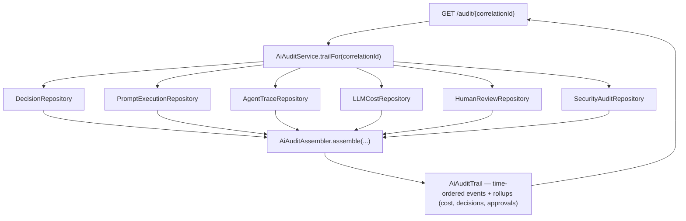

# GOV-1 — Technical Design: AI Audit Trail

**Version:** 1.0.0
**Document Type:** Implementation Technical Design
**Document Status:** Implemented — 2026-07-28 (4-facet aggregation; see [Implementation Outcome](#implementation-outcome))
**Last Updated:** 2026-07-28
**Roadmap item:** [`GOV-1`](./AI-QA-OS-Improvement-Roadmap.md#gov-1--ai-audit-trail) (v2.2.0, frozen) — 🟠 P1 · Effort M · Owner Security / Governance · Phase 3 · v2.0
**Modules:** spans `brain` · `intelligence` · `ai-provider`/`observability` · `orchestration` · `security`; unified read in an app module.
**Depends on:** MNT-6 (`correlationId` everywhere — the join key) · AI-2 (approvals).

> **Scope discipline.** GOV-1 **unifies existing immutable per-domain records** into one queryable, time-ordered AI audit trail keyed by `correlationId` — it does **not** re-capture data. "A complete record of every AI decision, prompt, model call, cost, and approval" already exists across five tables; GOV-1 assembles them into one view.

---

## 0. Roadmap Verification, the Sources, and the Join Key

### 0.1 What GOV-1 requires

> A complete, immutable record of every AI decision, prompt, model call, cost, and approval. `SecurityAuditLogger` exists for security events, but there is no audit of *AI actions*. **Where:** an audit capability spanning `security` (infra), `intelligence` (`PromptExecutionEntity`), `ai-provider` (model + cost), and the AI-2 approval workflow. **Elevates existing per-domain logging into a unified, queryable audit trail.**

### 0.2 The facets already exist — GOV-1 maps them

| Audit facet | Existing immutable source | Module |
|---|---|---|
| AI **decision** / confidence verdict | `DecisionEntity` (+ `DecisionRepository`) | brain |
| **Prompt** execution (template/version/output) | `PromptExecutionEntity` | intelligence |
| **Model call** (prompt→response trace) | `AgentTraceEntity` | observability/ai-provider |
| **Cost** (tokens, $) | `LLMCostEntity` | observability/ai-provider |
| **Approval** (human review decision) | `HumanReviewEntity` | orchestration |
| **Security** event | `SecurityAuditEntity` (`SecurityAuditLogger`) | security |

All carry a `correlationId` (MNT-6) — the **join key** that ties one workflow run's AI actions together.

### 0.3 / Decision for approval — unify by aggregation, or by a new central log?

| Option | Approach | Trade-off |
|---|---|---|
| **A — Aggregation view over existing records (recommended)** | An `AiAuditService.trailFor(correlationId)` reads the six sources by `correlationId`, maps each to a common `AiAuditEvent`, and returns one time-ordered trail. No new writes, no new schema. | Matches the roadmap ("elevate existing"); zero data duplication; the per-domain rows stay the immutable source of truth; lower risk. Assembles across repos at read time. |
| **B — New central append-only audit log** | A new `ai_audit_events` table + an `AiAuditLogger` that every domain also writes to on each AI action. | One physical immutable log — but **duplicates** data already captured, and requires wiring writes into brain/intelligence/ai-provider/orchestration/security (touch everything, double-write risk). |

**Recommend A** — the data is already immutably persisted per domain; GOV-1's value is the *unified queryable view*, which aggregation delivers without duplicating storage or threading writes through five modules. (A durable materialised audit table, if ever needed for retention/perf, is FI-GOV1-A — and would be *derived* from A, not a parallel write path.)

> ✅ **Decision (confirmed 2026-07-28): Option A — aggregation view over the existing per-domain records** (no new schema/writes; `correlationId` join key). Materialised table deferred to FI-GOV1-A. Recorded as ADR-026 (number verified at implement).

### 0.4 Placement (verified at implement)

The unified read needs all six repositories, so `AiAuditService` lands in the app module that already depends on them all — the **gateway** (public API, depends on brain/orchestration/execution/…) or **dashboard** (surfaces audit views). The **`AiAuditAssembler`** (pure mapping/merge) is dependency-light and fully unit-testable regardless. Exact host confirmed against the dependency graph at implement.

---

## 1. Technical Design (Option A)

### 1.1 Unified model
- **`AiAuditEvent`** — `correlationId`, `timestamp`, `facet` (`DECISION`/`PROMPT`/`MODEL_CALL`/`COST`/`APPROVAL`/`SECURITY`), `actor` (agent/user/system), `summary`, `details` (map). A common shape over the six sources.
- **`AiAuditTrail`** — the ordered `List<AiAuditEvent>` for a `correlationId` + rollups (total cost, decision count, approvals).

### 1.2 Assembler (pure, validatable)
- **`AiAuditAssembler`** — `assemble(correlationId, DecisionEntity[], PromptExecutionEntity[], AgentTraceEntity[], LLMCostEntity[], HumanReviewEntity[], SecurityAuditEntity[])` → `AiAuditTrail`: map each source row → `AiAuditEvent`, sort by timestamp, compute rollups. No repository/Spring coupling → unit-tested with hand-built rows.

### 1.3 Service (wires the repos)
- **`AiAuditService.trailFor(correlationId)`** — queries each repository by `correlationId` (adding a `findByCorrelationId`/equivalent finder where missing), hands the rows to the assembler, returns the `AiAuditTrail`. Read-only.
- Endpoint (thin, in the hosting app): `GET /api/…/audit/{correlationId}` → the trail (auth-gated per SEC-1). *(Dashboard visualisation is a later surface — PE-3/GOV dashboards.)*

### 1.4 What GOV-1 defers
Materialised/retained audit table (FI-GOV1-A) · a governance dashboard UI · signing/tamper-evidence of the trail (FI-GOV1-B) · policy checks over the trail (GOV-3).

---

## 2. Folder Structure

```
<host app or a governance package>/audit/
    AiAuditEvent.java            [N] unified event
    AiAuditTrail.java            [N] ordered events + rollups
    AiAuditAssembler.java        [N] pure: sources → trail
    AiAuditService.java          [N] repo fan-in by correlationId → assembler
    AiAuditController.java       [N] GET /audit/{correlationId} (auth-gated)
+ repository finders: findByCorrelationId where a source lacks one (additive query methods).
+ unit tests: AiAuditAssembler (merge/order/rollups across all facets).
```

---

## 3. Required Classes (key)

| Class | Type | Responsibility |
|---|---|---|
| `AiAuditEvent` / `AiAuditTrail` | New | Unified event + ordered trail + rollups |
| `AiAuditAssembler` | New | Pure map/merge of the six sources → trail |
| `AiAuditService` | New | Fan-in the repos by `correlationId`, assemble |
| `AiAuditController` | New | `GET /audit/{correlationId}` (auth-gated) |
| repo `findByCorrelationId` | Added where missing | Additive query methods |

---

## 4. Database Changes

**None (Option A).** GOV-1 reads existing tables; it may add **query methods** (`findByCorrelationId`) but no schema. (A derived materialised table is the deferred FI-GOV1-A.)

---

## 5. API Changes

**One additive, read-only endpoint** — `GET /audit/{correlationId}` returning the assembled trail (authenticated). No changes to existing contracts.

---

## 6. Sequence Diagram



---

## 7. Step-by-Step Implementation Plan

1. **Verify host** — confirm which app module depends on all six source repos (gateway/dashboard); place `AiAuditService`/controller there.
2. **Model** — `AiAuditEvent`, `AiAuditTrail`.
3. **Assembler** — `AiAuditAssembler` (map each source → event, sort, roll up). Pure.
4. **Finders** — add `findByCorrelationId` (or equivalent) to the source repositories that lack it (additive).
5. **Service + endpoint** — `AiAuditService.trailFor` + `AiAuditController` (`GET /audit/{correlationId}`, auth-gated).
6. **Tests** — `AiAuditAssembler` with hand-built rows across all six facets: correct ordering, facet mapping, rollups (total cost, decision/approval counts). No Mockito.
7. **Build & validate** — `mvn clean test`; all modules green; assembler unit-proven. Live cross-module query needs a populated DB (noted).
8. **Sync docs** — tracker `GOV-1`; **ADR-026** (unified AI audit trail by aggregation over per-domain immutable records; correlationId as the join key). Verify ADR number at implement.

**Definition of Done:** a `correlationId` yields one time-ordered trail of every AI decision, prompt, model call, cost, and approval for that run, assembled from the existing immutable sources; the assembler is unit-proven; a read-only auth-gated endpoint exposes it. **Deferred:** materialised/retained table, governance UI, tamper-evidence.

---

## Implementation Outcome

Implemented 2026-07-28 (§0.3 = A aggregation). Recorded as **ADR-026**.

**Scope correction (found during implementation):** §0.2's assumption that "all sources carry `correlationId`" is **false**. Actual keys: `AgentTraceEntity` → `correlationId`; `LLMCostEntity` → `requestId`(=correlationId); `HumanReviewEntity`/`SecurityAuditEntity` → `workflowId`; **`DecisionEntity` has no run key**; `PromptExecutionEntity` → `traceId`. So the unified trail covers the **four run-keyed facets** (approvals, model calls, cost, security); decisions + prompt executions are **deferred** (they can't be joined until they carry a run key — FI-GOV1-D). You approved the 4-facet, no-schema path.

**Files (all in `ai-qa-os-gateway` — the only app depending on all four sources):**
- **audit/** — `AiAuditEvent` (facet/timestamp/actor/summary/cost/details), `AiAuditTrail` (ordered events + rollups), `AiAuditAssembler` (**pure** time-order + rollups), `AiAuditService` (fan-in the four repos by their keys → assemble), `AiAuditController` (`GET /api/v1/audit/{workflowId}?correlationId=`, auth-gated).
- **repos** — `HumanReviewRepository.findByWorkflowId(UUID)` [M] + `SecurityAuditRepository.findByWorkflowId(String)` [M] (additive; note the workflowId type differs — UUID vs String).
- **test** — `AiAuditAssemblerTest` (2): time ordering across facets + cost/facet-count rollups; empty trail well-formed.

**Validation (Maven):** `mvn -pl ai-qa-os-gateway -am test` → **BUILD SUCCESS**; `AiAuditAssemblerTest` **2/2**. Full reactor `mvn clean test` run to confirm the integration context wires `AiAuditService` (four repos + assembler).

**Honest scope note:** the **assembler is fully unit-proven**; the `AiAuditService` cross-repo query is wired + compiles but its live result needs a **populated DB** (no DB here). The caller supplies both `workflowId` + `correlationId` (no bridge table queried). Two of the six facets await a run-key schema change (FI-GOV1-D); a materialised/retained table and tamper-evidence remain FI-GOV1-A/B.

---

## Appendix — Future Ideas (Outside Current Roadmap)

- **FI-GOV1-A** — A derived, retained `ai_audit_events` materialisation (for retention windows + fast history) built *from* the aggregation, not a parallel write path.
- **FI-GOV1-B** — Tamper-evidence (hash-chain / signing) over the assembled trail for compliance-grade immutability.
- **FI-GOV1-C** — Trail-scoped policy checks (feeds GOV-3 Responsible-AI rules).
- **FI-GOV1-D** — Give `DecisionEntity` and `PromptExecutionEntity` a run key (`correlationId`/`workflowId`) so the AI **decision** and **prompt** facets join the trail (the two facets deferred at implementation).

---

## Compliance Checklist

| Rule | Status |
|---|---|
| Roadmap not modified | ✅ GOV-1 metadata untouched |
| No new modules | ✅ new classes in existing modules; no schema |
| Reuses existing records | ✅ aggregation over Decision/Prompt/Trace/Cost/Review/Security |
| Dependency direction | ✅ read-only fan-in from the app module that already depends on the sources |
| Non-breaking | ✅ additive endpoint + query methods only |
| ADR discipline | ✅ ADR-026 to be recorded (number verified at implement) |

---

## Document Completion Status

**Status:** Implemented — 2026-07-28 (§0.3 = A aggregation; 4 run-keyed facets, decisions/prompts deferred to FI-GOV1-D). See [Implementation Outcome](#implementation-outcome).
**Version:** 1.0.0
**Implements:** `GOV-1` (roadmap v2.2.0, frozen) — unified AI audit trail by aggregation over the run-keyed sources.
