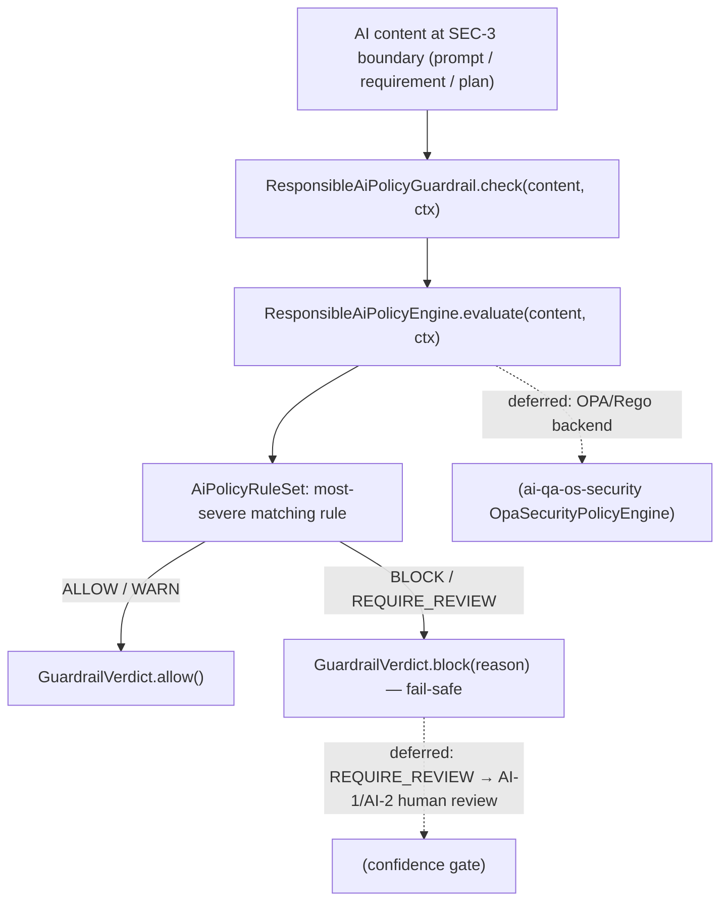

# GOV-3 — Technical Design: Policy Engine & Responsible-AI Rules

**Version:** 1.0.0
**Document Type:** Implementation Technical Design
**Document Status:** Implemented — 2026-07-28 (§0.4 = A guardrail-boundary/OPA-deferred; see [Implementation Outcome](#implementation-outcome))
**Last Updated:** 2026-07-28
**Roadmap item:** [`GOV-3`](./AI-QA-OS-Improvement-Roadmap.md#gov-3--policy-engine--responsible-ai-rules) (v2.2.0, frozen) — 🟡 P2 · Effort M · Owner Security / AI-Brain · Phase 3 · v2.0
**Modules:** `ai-qa-os-intelligence` (Responsible-AI guardrail at the SEC-3 boundary) · (`ai-qa-os-security` OPA engine — see §0.4).
**Depends on:** AI-1 (`ConfidenceGate` boundary) · SEC-3 (`Guardrail` boundary — the enforcement spine GOV-3 reuses).

> **Scope discipline.** GOV-3 makes autonomy **bounded**: policy-as-code that governs *AI behaviour* — "never generate scripts that hit production URLs", "block prompts containing PII", "require human review for destructive actions". The rule engine + its enforcement as a `Guardrail` are **fully buildable/validatable**; a live OPA/Rego backend and the confidence-gate escalation wiring are deferred (see §0.3, §0.4).

---

## 0. Roadmap Verification, What Exists, and the Cross-Module Reality

### 0.1 What GOV-3 requires

> The platform ships an OPA-based `OpaSecurityPolicyEngine`, but it does not govern **AI behaviour**. Add Responsible-AI rules (production-URL block, PII block, human-approval-for-destructive) evaluated at the **confidence-gate (AI-1)** and **guardrail (SEC-3)** boundaries. **Where:** extend the OPA policy engine in `ai-qa-os-security`. **Impact:** repurpose an existing policy engine as the Responsible-AI enforcement point — policy-as-code over autonomous decisions.

### 0.2 Verified current state

| Fact | Detail |
|---|---|
| A policy engine exists | `ai-qa-os-security`: `SecurityPolicyEngine` (contract, `evaluate(SecurityContext, PolicyRequest)`), `DefaultPolicyEngine`, `EnterprisePolicyEngine`, `OpaSecurityPolicyEngine`. Governs **security actions**, not AI behaviour. |
| The AI boundaries are `core` contracts | `Guardrail` (SEC-3; applied in `intelligence` input, `orchestration` output, `execution` script-surface) and `ConfidenceGate` (AI-1; impl in `brain`). SEC-3 already runs guardrails at the AI boundary via `PromptSecurityGuard`/`LLMResponseValidator`/`ExecutionValidator`. |
| **Cross-module wall** | `ai-qa-os-security` depends on **`core` only**; `intelligence`/`brain`/`orchestration` do **not** depend on `security`. So the AI boundary **cannot call** the security OPA engine, and security **cannot call** the boundary. Same shape as GOV-1 and the ConfidenceGate/Guardrail promotion (ADR-010/015). |

### 0.3 Environment reality

- **Buildable + validatable now:** the Responsible-AI **rule engine** (declarative rules → `PolicyDecision`) and its enforcement as a **`Guardrail`** at the SEC-3 boundary — pure, config-driven, deterministic, unit-testable.
- **Deferred:** a live **OPA/Rego** backend (needs a running OPA server — unvalidatable here); the confidence-gate **escalation** path (a `REQUIRE_REVIEW` policy outcome driving AI-1/AI-2 human review rather than a fail-safe block); applying the policy to `execution`'s generated-script surface and `orchestration`'s output boundary (thin adapters, adjacent).

### 0.4 / Decision for approval — where the Responsible-AI enforcement lives

The roadmap says "extend the OPA engine in `ai-qa-os-security`", but §0.2's wall means the AI boundary can't reach it. Two honest ways to resolve it:

| Option | Approach | Trade-off |
|---|---|---|
| **A — Responsible-AI policy as a config-driven `Guardrail` at the SEC-3 boundary (recommended)** | A deterministic `ResponsibleAiPolicyEngine` (declarative `AiPolicyRule`s → `PolicyDecision`) in `intelligence`, surfaced as a `core`-`Guardrail` (`ResponsibleAiPolicyGuardrail`) that plugs into the spine SEC-3 already built. Hard rules **BLOCK** (fail-safe). The `security` OPA engine becomes a **deferred pluggable backend**; confidence-gate escalation is deferred (FI-GOV3-A/B). | Reuses the guardrail spine, respects dependency direction, **fully validatable now**. Doesn't run live OPA/Rego yet; "require human review" is enforced as a conservative block, not (yet) a routed review. |
| **B — Extend `OpaSecurityPolicyEngine` in `security` with AI-action Rego + boundary depends on `security`** | Add AI-action rules to the OPA engine and make `intelligence`/`orchestration` depend on `ai-qa-os-security` to call it. | Literal to the roadmap wording, but **adds cross-module dependencies** (inverting the current graph) and needs a **running OPA server** — unvalidatable in this environment; larger, riskier. |

**Recommend A** — enforce Responsible-AI rules at the boundary where the AI content actually flows (SEC-3's `Guardrail`), with a deterministic reference engine that is provable now. Because the policy decision is genuinely needed by **two** sides that don't share a module (the guardrail boundary and, later, the security OPA backend + the confidence gate), a small policy seam is justified — the ConfidenceGate/Guardrail lesson (ADR-010/015) — and OPA slots in behind it later without reworking the boundary.

> ✅ **Decision (confirmed 2026-07-28): Option A — Responsible-AI policy as a config-driven `core`-`Guardrail` at the SEC-3 boundary; OPA/Rego as a deferred pluggable backend (FI-GOV3-A); `REQUIRE_REVIEW`→human-review deferred (FI-GOV3-B).** Recorded as ADR-029 (number verified at implement).

---

## 1. Technical Design (Option A)

### 1.1 Policy model (`intelligence`, package `…governance.policy`)
- **`PolicyDecision`** — `effect` (`ALLOW` / `WARN` / `BLOCK` / `REQUIRE_REVIEW`), matched `ruleId`, `reason`. Factory helpers; `ALLOW` is the default when no rule matches.
- **`AiPolicyRule`** — a declarative rule: `id`, `description`, a compiled `Pattern` (or keyword set), the `effect` to apply on match, and the `GuardrailContext.Phase`(s) / action-kinds it applies to. Pure `matches(content, context)`.
- **`ResponsibleAiPolicyEngine`** (seam) — `PolicyDecision evaluate(String content, GuardrailContext context)`. The reference impl **`RuleBasedResponsibleAiPolicyEngine`** walks an ordered `AiPolicyRuleSet` and returns the **most severe** matching effect. Config-bound rules (`aiqaos.governance.policy.*`): production-URL block, PII block, destructive-action escalate — all overridable/extendable via properties, none hard-coded to a customer.

### 1.2 Enforcement at the SEC-3 boundary
- **`ResponsibleAiPolicyGuardrail`** (`@Component implements core `Guardrail`) — delegates to `ResponsibleAiPolicyEngine.evaluate(...)` and maps the decision to a `GuardrailVerdict`: `ALLOW`/`WARN` → `allow()`; `BLOCK` **and** `REQUIRE_REVIEW` → `block(reason)` (**fail-safe** — a review-required action is never silently allowed). Plugs into the exact spine SEC-3 built (discovered as a `Guardrail` bean alongside `PromptInjectionGuardrail`); gated by `aiqaos.governance.policy.enabled` (default on) + `mode` (`enforce`/`warn`), mirroring SEC-3.

### 1.3 Config-driven rule set (defaults, all overridable)
| Rule id | Match | Effect |
|---|---|---|
| `no-production-urls` | URLs on a configured production-host list (default: none — opt-in via `aiqaos.governance.policy.production-hosts`) | `BLOCK` |
| `no-pii-in-prompts` | PII patterns (emails, card/SSN-shaped numbers) in INPUT content | `BLOCK` |
| `destructive-requires-review` | destructive-action keywords (`drop table`, `delete from`, `rm -rf`, `truncate`, …) | `REQUIRE_REVIEW` → fail-safe block |

### 1.4 What GOV-3 defers
Live **OPA/Rego** backend behind the engine seam (needs an OPA server — FI-GOV3-A) · routing `REQUIRE_REVIEW` into the AI-1/AI-2 **human-review** path instead of a fail-safe block (FI-GOV3-B) · applying the policy at `execution`'s generated-script surface and `orchestration`'s output boundary (thin `Guardrail` adapters — FI-GOV3-C) · policy-gating GOV-4 version **promotion** (FI-GOV3-D) · auditing each policy decision into the GOV-1 trail.

---

## 2. Folder Structure

```
ai-qa-os-intelligence/.../governance/policy/
    PolicyDecision.java                     [N] effect (ALLOW/WARN/BLOCK/REQUIRE_REVIEW) + ruleId + reason
    AiPolicyRule.java                       [N] declarative rule: pattern + effect + phase
    AiPolicyRuleSet.java                    [N] ordered rules; most-severe-match
    ResponsibleAiPolicyEngine.java          [N] seam: evaluate(content, context) → PolicyDecision
    RuleBasedResponsibleAiPolicyEngine.java [N] reference impl over the rule set (config-driven)
    ResponsibleAiPolicyProperties.java      [N] aiqaos.governance.policy.* (enabled/mode/hosts/rules)
    ResponsibleAiPolicyGuardrail.java       [N] core-Guardrail adapter (fail-safe block)
+ unit tests: engine (each rule; most-severe; no-match=ALLOW) + guardrail mapping (BLOCK/REQUIRE_REVIEW→block).
```

---

## 3. Required Classes (key)

| Class | Type | Responsibility |
|---|---|---|
| `PolicyDecision` / `AiPolicyRule` / `AiPolicyRuleSet` | New | Declarative Responsible-AI policy model |
| `ResponsibleAiPolicyEngine` / `RuleBasedResponsibleAiPolicyEngine` | New | Evaluation seam + config-driven reference impl |
| `ResponsibleAiPolicyGuardrail` | New | Enforce at the SEC-3 `Guardrail` boundary (fail-safe) |
| `ResponsibleAiPolicyProperties` | New | `aiqaos.governance.policy.*` binding |

---

## 4. Database Changes

**None.** Rules are config (`aiqaos.governance.policy.*`), evaluation is stateless. (Persisting policy decisions into the GOV-1 audit trail is a deferred follow-up.)

---

## 5. API Changes

**None.** Enforcement is in-band at the guardrail boundary. (A read/write policy-management endpoint can arrive with the GOV-2 compliance surface.)

---

## 6. Sequence Diagram



---

## 7. Step-by-Step Implementation Plan

1. **Policy model** — `PolicyDecision`, `AiPolicyRule`, `AiPolicyRuleSet` (most-severe match).
2. **Engine** — `ResponsibleAiPolicyEngine` seam + `RuleBasedResponsibleAiPolicyEngine` + `ResponsibleAiPolicyProperties` (default rules: production-URL, PII, destructive; all config-overridable).
3. **Enforcement** — `ResponsibleAiPolicyGuardrail` (core-`Guardrail`; `BLOCK`/`REQUIRE_REVIEW`→`block`, fail-safe; `enabled`/`mode` gate) alongside the SEC-3 guards.
4. **Tests** — engine: each default rule fires; most-severe wins; clean content = `ALLOW`; disabled = `ALLOW`. Guardrail: `BLOCK` and `REQUIRE_REVIEW` → not-allowed; `WARN`/`ALLOW` → allowed. No Mockito.
5. **Build & validate** — `mvn -pl ai-qa-os-intelligence -am test` (targeted — additive module); guards green; SEC-3 guards unaffected. Report that live OPA + gate escalation are deferred.
6. **Sync docs** — tracker `GOV-3`; **ADR-029** (Responsible-AI policy as a config-driven guardrail at the SEC-3 boundary; OPA as deferred backend). Verify ADR number at implement.

**Definition of Done:** Responsible-AI rules (production-URL, PII, destructive) evaluate AI content at the SEC-3 guardrail boundary and fail-safe **block** violations, config-driven and unit-proven. **Deferred:** live OPA/Rego backend, `REQUIRE_REVIEW`→human-review routing, execution/output-boundary application, GOV-4 promotion gating, audit integration.

---

## Implementation Outcome

Implemented 2026-07-28 (§0.4 = A — Responsible-AI policy as a config-driven `core`-`Guardrail` at the SEC-3 boundary; OPA deferred). Recorded as **ADR-029**.

**Files (all new, `ai-qa-os-intelligence/.../governance/policy/`):**
- **`PolicyEffect`** — `ALLOW`<`WARN`<`REQUIRE_REVIEW`<`BLOCK`, severity-ordered for most-severe-match.
- **`PolicyDecision`** — effect + ruleId + reason; `allow()` default; `isPermitted()`.
- **`AiPolicyRule`** — declarative rule (compiled `Pattern` + effect + optional phase; `null` pattern = inert); **`AiPolicyRuleSet`** — most-severe matching rule wins.
- **`ResponsibleAiPolicyEngine`** (seam) + **`RuleBasedResponsibleAiPolicyEngine`** — builds the rule set from properties: `no-production-urls` (inert until hosts configured), `no-pii-in-prompts` (email/SSN/card), `destructive-requires-review` (drop/delete/truncate/rm -rf), plus operator `blockPatterns`.
- **`ResponsibleAiPolicyProperties`** — `aiqaos.governance.policy.*` (enabled/mode/productionHosts/blockPii/reviewDestructive/blockPatterns); enabled + `enforce` by default (mirrors SEC-3).
- **`ResponsibleAiPolicyGuardrail`** — `core`-`Guardrail`; `ALLOW`/`WARN`→allow, `BLOCK`/`REQUIRE_REVIEW`→**fail-safe** block; `warn` mode logs+allows; `enabled=false` allows all.

**Non-breaking check:** SEC-3's `PromptSecurityGuard` injects the **specific** `PromptInjectionGuardrail` type (not `List<Guardrail>`), and no intelligence test loads a Spring context — so the new `Guardrail` bean joins the boundary without altering any existing guard.

**Validation (Maven):** `mvn -pl ai-qa-os-intelligence -am test` → **BUILD SUCCESS**; `RuleBasedResponsibleAiPolicyEngineTest` **8/8** (clean=ALLOW, PII email/SSN→BLOCK, destructive→REQUIRE_REVIEW, most-severe PII-over-destructive, production-host inert-then-block, disable-PII, custom pattern) + `ResponsibleAiPolicyGuardrailTest` **5/5** (clean, BLOCK, REQUIRE_REVIEW fail-safe, disabled, warn-mode). Ran with `-Djacoco.skip=true` (JaCoCo 0.8.12 can't instrument Java 25 bytecode — toolchain limit, not code).

**Honest scope note:** the **rule engine + guardrail enforcement are fully unit-proven**. **Deferred:** live OPA/Rego backend (FI-GOV3-A); routing `REQUIRE_REVIEW` into AI-1/AI-2 human review instead of a fail-safe block (FI-GOV3-B); applying the policy at `execution`'s script surface + `orchestration` output (FI-GOV3-C); GOV-4 promotion gating + GOV-1 audit of decisions (FI-GOV3-D).

---

## Appendix — Future Ideas (Outside Current Roadmap)

- **FI-GOV3-A** — Live OPA/Rego backend implementing `ResponsibleAiPolicyEngine` (the roadmap's OPA extension, behind the seam).
- **FI-GOV3-B** — Route `REQUIRE_REVIEW` into the AI-1/AI-2 human-review path (escalate, not just block).
- **FI-GOV3-C** — Apply the policy at `execution`'s generated-script surface and `orchestration`'s output boundary.
- **FI-GOV3-D** — Policy-gate GOV-4 version promotion; audit each policy decision into the GOV-1 trail.

---

## Compliance Checklist

| Rule | Status |
|---|---|
| Roadmap not modified | ✅ GOV-3 metadata untouched |
| Builds on existing boundaries | ✅ reuses SEC-3 `Guardrail` spine + AI-1 gate concept |
| Dependency reality | ✅ enforcement in `intelligence` (core-`Guardrail`); security OPA as deferred backend (no dep inversion forced) |
| Non-breaking | ✅ additive `@Component`; gated by `aiqaos.governance.policy.enabled`; no schema/API change |
| Honesty (ADR-009) | ✅ live OPA + gate escalation flagged deferred |
| ADR discipline | ✅ ADR-029 to be recorded (number verified at implement) |

---

## Document Completion Status

**Status:** Implemented — 2026-07-28 (§0.4 = A). See [Implementation Outcome](#implementation-outcome). ADR-029.
**Version:** 1.0.0
**Implements:** `GOV-3` (roadmap v2.2.0, frozen) — Responsible-AI rules at the guardrail boundary; live OPA deferred.
**Next step:** On approval + option choice, execute [§7](#7-step-by-step-implementation-plan) from Step 1. No code until approved.
