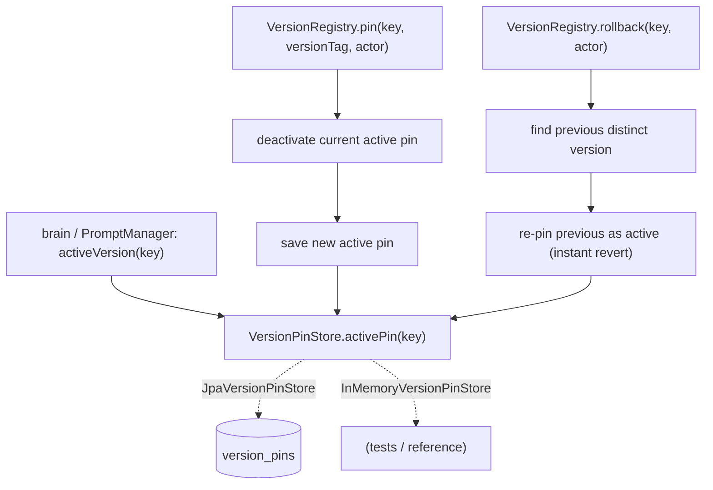

# GOV-4 — Technical Design: Model & Prompt Version Registry with Rollback

**Version:** 1.0.0
**Document Type:** Implementation Technical Design
**Document Status:** Implemented — 2026-07-28 (§0.4 = A prompt-now/generic; see [Implementation Outcome](#implementation-outcome))
**Last Updated:** 2026-07-28
**Roadmap item:** [`GOV-4`](./AI-QA-OS-Improvement-Roadmap.md#gov-4--model--prompt-version-registry-with-rollback) (v2.2.0, frozen) — 🟡 P2 · Effort M · Owner Governance / AI · Phase 3 · v2.0
**Modules:** `ai-qa-os-intelligence` (prompt versions) · (`ai-qa-os-ai-provider` model versions — see §0.4).
**Depends on:** GOV-1 (version-usage in the audit trail); consumed by brain at selection time.

> **Scope discipline.** GOV-4 turns version *history* into version *control*: **pin** an approved version and **roll back** instantly. The pin/rollback/history **logic is fully buildable/validatable** (behind a store seam); the durable table survives restart (governance requirement) but its live DB behaviour needs a running Postgres.

---

## 0. Roadmap Verification, What Exists, and the Cross-Module Reality

### 0.1 What GOV-4 requires

> Promote model/prompt version history into a first-class registry that supports **pinning** approved versions and **rolling back** instantly. Prompt versions exist (`PromptVersionEntity`) but there is no controlled promotion/rollback path, and model versions are not registered as governed objects at all. **Where:** a registry spanning `intelligence` (prompt) + `ai-provider` (model); consumed by `brain` at selection time.

### 0.2 Verified current state

| Fact | Detail |
|---|---|
| Prompt versions exist | `PromptVersionEntity` (templateId, versionTag, content, author) + `PromptVersionManager.getActiveVersion(templateName)` — but "active" has no *governed* pin/rollback controls. |
| Model versions ungoverned | No `ModelVersionEntity` — a "model version" (e.g. `openai/gpt-4o-2024-05`) is just a string in requests today. |
| Cross-module | Prompt versioning is in `intelligence`; model selection is in `ai-provider`, which does **not** depend on `intelligence` — so one registry can't serve both without a shared placement (same shape as GOV-1). |

### 0.3 Durability is intrinsic (not a fork)

A governance rollback must survive restarts and be the authority on "what runs" — so pins are **durable** (`version_pins` table). To keep the pin/rollback/history *logic* fully unit-testable without a DB, it sits behind a **`VersionPinStore` seam** (in-memory reference for tests, JPA impl for production) — the same pattern as ENT-5's `ObjectStorageClient`.

### 0.4 / Decision for approval — govern prompt versions now, or prompt + model?

| Option | Approach | Trade-off |
|---|---|---|
| **A — Prompt-version registry now; generic for model later (recommended)** | A `VersionRegistry` in `intelligence` keyed by a generic `registryKey` + `kind` (`PROMPT`/`MODEL`), grounded on the existing `PromptVersionEntity`. Model-version governance (defining a `ModelVersion` + a cross-module placement) is deferred to FI-GOV4-A. | Grounded, self-contained, fully validatable; the registry is already generic so model versions plug in later — no rework. Doesn't govern model versions yet. |
| **B — Prompt + model together now** | Also define model-version objects and place the registry where both `intelligence` and `ai-provider` can reach it (a `core` contract + impl). | Complete per the roadmap wording, but invents model-version governance from scratch and adds the GOV-1-style cross-module placement problem in one step — larger, riskier. |

**Recommend A** — the registry is built **generic** (`registryKey`/`kind`), so it already *models* both; grounding it on the existing prompt versions delivers real pin/rollback control now, and model-version governance drops in behind the same registry once a `ModelVersion` and a shared placement are defined (FI-GOV4-A). This is the ConfidenceGate lesson: don't force a cross-module contract before the second consumer is real.

> ✅ **Decision (confirmed 2026-07-28): Option A — prompt-version registry now, generic (`registryKey`/`kind`) for model versions later.** Durable via a store seam. Model-version governance deferred to FI-GOV4-A. Recorded as ADR-028 (number verified at implement).

---

## 1. Technical Design (Option A)

### 1.1 Registry model + store seam
- **`VersionPin`** — `registryKey` (e.g. `prompt:greeting`), `kind` (`PROMPT`/`MODEL`), `versionTag`, `actor`, `pinnedAt`, `active`.
- **`VersionPinStore`** (seam) — `save(pin)`, `activePin(registryKey)`, `history(registryKey)`. **`InMemoryVersionPinStore`** (reference/test) + **`JpaVersionPinStore`** (durable, over `VersionPinEntity`/repository).

### 1.2 Registry logic (`intelligence`)
- **`VersionRegistry`** (`@Service`, over `VersionPinStore`):
  - `pin(registryKey, kind, versionTag, actor)` — deactivate the current active pin, insert a new active one (a governed promotion).
  - `rollback(registryKey, actor)` — re-pin the **immediately-previous** distinct version as active (the "instant revert to last-known-good"). No-op with a reason if there's no prior version.
  - `activeVersion(registryKey)` — the current pinned `versionTag` (the authority on what runs).
  - `history(registryKey)` — the pin timeline (who pinned/rolled back what, when).

### 1.3 Durable persistence
- **`VersionPinEntity`** (extends BaseEntity) + **`VersionPinRepository`** (`findFirstByRegistryKeyAndActiveTrue…`, `findByRegistryKeyOrderByPinnedAtDesc`) + migration **`V…__version_pins.sql`**. Behind `JpaVersionPinStore`.

### 1.4 What GOV-4 defers
Model-version governance (a `ModelVersion` object + `core`/shared placement so `ai-provider` participates — FI-GOV4-A) · wiring `PromptManager`/`brain` selection to consult the pinned version (FI-GOV4-B) · policy-gated promotion (GOV-3) · the compliance dashboard surface (GOV-2).

---

## 2. Folder Structure

```
ai-qa-os-intelligence/.../version/
    VersionPin.java              [N] pin model (key/kind/versionTag/actor/pinnedAt/active)
    VersionPinStore.java         [N] seam: save / activePin / history
    InMemoryVersionPinStore.java [N] reference + test store
    JpaVersionPinStore.java      [N] durable store over the entity/repo
    VersionRegistry.java         [N] pin / rollback / activeVersion / history
    VersionPinEntity.java        [N] durable pin (extends BaseEntity)
    VersionPinRepository.java    [N] finders
deployment/migration/db/migration/V…__version_pins.sql   [N]
+ unit tests: VersionRegistry over the in-memory store (pin, rollback, active, history).
```

---

## 3. Required Classes (key)

| Class | Type | Responsibility |
|---|---|---|
| `VersionPin` / `VersionPinStore` | New | Pin model + store seam |
| `InMemoryVersionPinStore` / `JpaVersionPinStore` | New | Test reference + durable impl |
| `VersionRegistry` | New | pin / rollback / activeVersion / history |
| `VersionPinEntity` / `VersionPinRepository` | New | Durable pins + finders |

---

## 4. Database Changes

**One migration** — `V…__version_pins.sql` (`version_pins`: registry_key, kind, version_tag, actor, active, pinned_at + BaseEntity audit columns; index on registry_key). `ddl-auto: validate` unchanged.

---

## 5. API Changes

**None required for the core** (registry is a service). A governance endpoint (`POST /pin`, `POST /rollback`, `GET /versions/{key}`) can be added with the GOV-2 compliance surface.

---

## 6. Sequence Diagram



---

## 7. Step-by-Step Implementation Plan

1. **Model + seam** — `VersionPin`, `VersionPinStore`, `InMemoryVersionPinStore`.
2. **Registry** — `VersionRegistry` (pin/rollback/activeVersion/history) over the seam.
3. **Durable** — `VersionPinEntity` + `VersionPinRepository` + `JpaVersionPinStore`; `V…__version_pins.sql`.
4. **Tests** — `VersionRegistry` over the in-memory store: pin deactivates prior + sets active; rollback reverts to the previous distinct version; no-prior rollback is a safe no-op; history ordering. No Mockito.
5. **Build & validate** — `mvn -pl ai-qa-os-intelligence -am test` (targeted — additive module); registry logic green. Report that live durable pins need a Postgres.
6. **Sync docs** — tracker `GOV-4`; **ADR-028** (durable version registry with pin/rollback behind a store seam; generic for prompt now, model later). Verify ADR number at implement.

**Definition of Done:** an approved version can be **pinned** and **instantly rolled back** to the previous one, with a durable history, via a generic registry grounded on prompt versions; the logic is unit-proven against the in-memory store. **Deferred:** model-version governance, brain/PromptManager wiring, policy-gated promotion, dashboard.

---

## Implementation Outcome

Implemented 2026-07-28 (§0.4 = A — prompt-version registry now, generic for model later). Recorded as **ADR-028**.

**Files (all new, `ai-qa-os-intelligence/.../version/`):**
- **`VersionKind`** — `PROMPT`/`MODEL` (the registry is generic over kind).
- **`VersionPin`** — immutable pin value object (registryKey/kind/versionTag/actor/pinnedAt/active) + `deactivated()`.
- **`VersionPinStore`** (seam) — `save` / `activePin` / `history`; documents the single-active-per-key invariant.
- **`InMemoryVersionPinStore`** — default store (`aiqaos.version-registry.store=memory`, matchIfMissing); insertion-order timeline → deterministic; the unit-test reference.
- **`JpaVersionPinStore`** — durable store (`…store=jpa`), `@Transactional`, maps `VersionPin`↔`VersionPinEntity`.
- **`VersionRegistry`** (`@Service`) — `pin` (idempotent promote, deactivates prior), `rollback` (re-pin previous *distinct* version as a fresh audited pin; empty/one-version → safe no-op), `activeVersion`, `history`. Injectable clock seam.
- **`VersionPinEntity`** (extends `BaseEntity`) + **`VersionPinRepository`** (active-pin / active-list / newest-first history finders) + **`deployment/migration/db/migration/V16__version_pins.sql`** (`active_pin` distinct from BaseEntity `active`; indexes on `registry_key` and `(registry_key, active_pin)`).

**Validation (Maven):** `mvn -pl ai-qa-os-intelligence -am test` → **BUILD SUCCESS**; `VersionRegistryTest` **7/7** (pin→active, new pin deactivates prior + single-active, idempotent re-pin, rollback→previous distinct, no-prior rollback = safe no-op, history newest-first per key, generic-over-kind model-version pin/rollback). Ran with `-Djacoco.skip=true`: JaCoCo 0.8.12 (DX-8) can't instrument Java 25 bytecode (class major version 69) — a toolchain limitation, **not** a code issue; the compile + tests are unaffected.

**Honest scope note:** the **pin/rollback/history logic is fully unit-proven** against the in-memory store. **Deferred:** the durable `JpaVersionPinStore`'s live behaviour needs a running **Postgres** (unvalidated here, like every DB item); model-version governance + cross-module placement (FI-GOV4-A); brain/`PromptManager` wiring so the registry is authoritative at runtime (FI-GOV4-B); policy-gated promotion (GOV-3) + auditing pins into the GOV-1 trail (FI-GOV4-C); the dashboard surface (GOV-2).

---

## Appendix — Future Ideas (Outside Current Roadmap)

- **FI-GOV4-A** — Model-version governance: a `ModelVersion` object + a shared (`core`) placement so `ai-provider` pins/rolls-back model versions through the same registry.
- **FI-GOV4-B** — Wire `PromptManager`/`brain` selection to resolve the **pinned** version from the registry (make the registry authoritative at runtime).
- **FI-GOV4-C** — Policy-gated promotion (GOV-3) + audit each pin/rollback into the GOV-1 trail.

---

## Compliance Checklist

| Rule | Status |
|---|---|
| Roadmap not modified | ✅ GOV-4 metadata untouched |
| Builds on existing versions | ✅ grounded on `PromptVersionEntity`; generic for model later |
| Dependency reality | ✅ registry in `intelligence`; model-version cross-module placement deferred (not forced) |
| Durability | ✅ durable `version_pins` behind a testable store seam |
| Non-breaking | ✅ additive; no change to existing selection until FI-GOV4-B wires it |
| ADR discipline | ✅ ADR-028 to be recorded (number verified at implement) |

---

## Document Completion Status

**Status:** Implemented — 2026-07-28 (§0.4 = A). See [Implementation Outcome](#implementation-outcome). ADR-028.
**Version:** 1.0.0
**Implements:** `GOV-4` (roadmap v2.2.0, frozen) — durable pin/rollback registry, prompt versions now; model versions deferred.
**Next step:** On approval + option choice, execute [§7](#7-step-by-step-implementation-plan) from Step 1. No code until approved.
