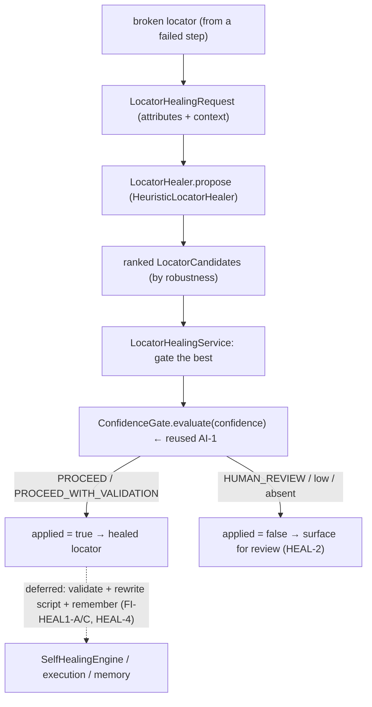

# HEAL-1 — Technical Design: Autonomous Locator-Healing Loop

**Version:** 1.0.0
**Document Type:** Implementation Technical Design
**Document Status:** Implemented — 2026-07-28 (§0.4 = A heuristic + confidence gate; see [Implementation Outcome](#implementation-outcome))
**Last Updated:** 2026-07-28
**Roadmap item:** [`HEAL-1`](./AI-QA-OS-Improvement-Roadmap.md#heal-1--autonomous-locator-healing-loop) (v2.2.0, frozen) — 🟠 P1 · Effort L · Owner Healing + AI/Brain · Phase 4 · v2.1
**Modules:** `ai-qa-os-healing` (locator reasoning + governance).
**Depends on:** AI-1 (`ConfidenceGate` — ✅, reused for governance) · LRN-1 (durable improvement — ✅).

> **Scope discipline.** HEAL-1 supplies the loop's missing brain: given a broken locator, **find a better one**, score its robustness, and **confidence-gate** whether it may be auto-applied. The engine already does loop-protection, retry (via `ExecutionEngine`), and memory. This design adds the **locator-candidate generation + confidence-gated selection** — deterministic and fully validatable. LLM-based locator reasoning, live validation/retry against a real browser, script rewrite, and engine wiring are deferred (§0.3).

---

## 0. Roadmap Verification, What Exists, and Scope

### 0.1 What HEAL-1 requires

> Close the loop from a **failed locator** to a validated, permanently-updated script and a memory that prevents recurrence: Detect Failure → **AI Analysis → Find Better Locator** → Validate → Retry → Update Script → Update Memory → Future Auto Recovery. **Where:** `ai-qa-os-healing` (engine/strategy), using `ai-provider` for locator reasoning, `execution` for validate/retry, `memory` for persistence, governed by the confidence gate (AI-1).

### 0.2 Verified current state — the loop's mechanics exist; its *brain* doesn't

| Loop stage | Status in code |
|---|---|
| Loop protection + retry + metrics | ✅ `SelfHealingEngineImpl.heal(...)` — MAX 3 attempts, retry via `ExecutionEngineFactory`, `RecoveryHistoryStore` (memory), `HealingMetricEntity`. |
| Strategy resolution | ✅ `RecoveryStrategyResolver` maps `LOCATOR_UPDATE → "LocatorRecoveryStrategy"` — but only a **name string**. |
| **AI Analysis → Find Better Locator** | ❌ **missing** — nothing generates/scores an alternative locator. The `LocatorRecoveryStrategy` name has no implementation. |
| Governance | AI-1 `ConfidenceGate` is a **core** contract — reusable. |

### 0.3 Environment reality

- **Buildable + validatable now:** locator **candidate generation** (from element attributes / a broken locator) + **robustness scoring** + **confidence-gated selection** (reusing AI-1's gate) — pure, deterministic, unit-testable.
- **Deferred:** LLM-based locator reasoning (needs `ai-provider` — a module `ai-qa-os-healing` does **not** depend on — + a live LLM); **live validation/retry** against a real browser (no browser here — this is already the engine's `ExecutionEngine` step); **rewriting the actual script** with the healed locator; **wiring** the healer into `SelfHealingEngineImpl` (needs a failure→broken-locator extraction step that doesn't exist yet); healed-locator **memory** across runs (HEAL-4).

### 0.4 / Decision for approval — how the better locator is found

| Option | Approach | Trade-off |
|---|---|---|
| **A — Deterministic heuristic locator healer + confidence-gated selection (recommended)** | A `LocatorHealer` seam + `HeuristicLocatorHealer` that generates candidates from element attributes / the broken locator (stable-strategy preference: `data-testid` → `id` → `name` → `role`/`text` → `css` → `xpath`) with a robustness **confidence** per candidate; `LocatorHealingService` ranks them and **confidence-gates** the best via AI-1's `ConfidenceGate`. LLM reasoning is a deferred seam impl. | Deterministic, unit-provable, respects dependency direction (no `ai-provider` edge), reuses AI-1. Doesn't do LLM reasoning or live validation yet. |
| **B — LLM-based locator reasoning now** | Add an `ai-qa-os-ai-provider` dependency to `healing` and call the LLM to propose locators. | Truer to "AI finds a better locator", but adds a **module edge** (`healing → ai-provider`), needs a **live LLM**, is non-deterministic and **unvalidatable here**. |

**Recommend A** — deterministic heuristics are how real self-healing frameworks (Healenium, relative locators) primarily work; they prove the loop's reasoning + governance now, and the `LocatorHealer` seam lets an LLM healer drop in later (FI-HEAL1-B) with no change to the governance or the engine.

> ✅ **Decision (confirmed 2026-07-28): Option A — deterministic `HeuristicLocatorHealer` behind a `LocatorHealer` seam + confidence-gated selection (reusing AI-1); LLM healer + engine wiring + live validation deferred (FI-HEAL1-A/B/C).** Recorded as ADR-033 (number verified at implement).

> **Governance nuance (made, not a fork):** a healed locator is **auto-applied only if it clears the confidence gate**; `HUMAN_REVIEW`/unreported/low-confidence → surfaced for approval (HEAL-2), never silently applied — the same monotonic-safety stance as LRN-4.

---

## 1. Technical Design (Option A)

### 1.1 Locator model (`ai-qa-os-healing`, package `…locator`)
- **`LocatorStrategy`** — `TEST_ID`, `ID`, `NAME`, `ROLE`, `TEXT`, `CSS`, `XPATH` (ordered most→least robust).
- **`LocatorCandidate`** — `value`, `strategy`, `confidence` (robustness), `rationale`.
- **`LocatorHealingRequest`** — `brokenLocator`, `brokenStrategy` (nullable), `elementDescription`, `attributes` (name→value), `correlationId`.
- **`LocatorHealingOutcome`** — ranked `candidates`, `chosen` (nullable), `applied` (boolean), `confidenceVerdict`, `reason`.

### 1.2 Locator healer (the missing brain)
- **`LocatorHealer`** (seam) — `List<LocatorCandidate> propose(LocatorHealingRequest)`.
- **`HeuristicLocatorHealer`** (`@Component`) — deterministic: for each stable attribute present, emit a candidate with a strategy-based robustness confidence (`data-testid` 0.95 · `id` 0.90 · `name` 0.85 · `role` 0.80 · `text` 0.70 · `css` 0.55 · relaxed `xpath` 0.35); parse the broken locator to offer a relaxed fallback. Sorted best-first.

### 1.3 Confidence-gated selection
- **`LocatorHealingService`** (`@Component`) — `heal(request)`: propose → rank → **gate the best candidate** via AI-1 `ConfidenceGate` (injected `ObjectProvider<ConfidenceGate>`; when absent, a local `aiqaos.healing.locator.min-confidence` threshold, default 0.70). `PROCEED`/`PROCEED_WITH_VALIDATION` → `applied=true`; else `applied=false` (surface for review). Returns `LocatorHealingOutcome`.

### 1.4 What HEAL-1 defers
LLM-based `LocatorHealer` (needs `ai-provider` — FI-HEAL1-B) · wiring `LocatorHealingService` into `SelfHealingEngineImpl`'s `LOCATOR_UPDATE` path incl. failure→broken-locator extraction (FI-HEAL1-A) · **live** validation/retry of the healed locator + **rewriting the script** (needs a browser — FI-HEAL1-C) · cross-run healed-locator memory / pre-emptive hardening (HEAL-4) · approval workflow for un-gated heals (HEAL-2).

---

## 2. Folder Structure

```
ai-qa-os-healing/.../locator/
    LocatorStrategy.java         [N] TEST_ID/ID/NAME/ROLE/TEXT/CSS/XPATH
    LocatorCandidate.java        [N] value + strategy + confidence + rationale
    LocatorHealingRequest.java   [N] brokenLocator + attributes + context
    LocatorHealingOutcome.java   [N] ranked candidates + chosen + applied + verdict
    LocatorHealer.java           [N] seam: propose(request) → candidates
    HeuristicLocatorHealer.java  [N] deterministic candidate generation + scoring
    LocatorHealingService.java   [N] rank + confidence-gate (reuses AI-1) → outcome
    LocatorHealingProperties.java [N] aiqaos.healing.locator.* (min-confidence)
+ unit tests: HeuristicLocatorHealer (attribute→strategy, ordering, sparse) + LocatorHealingService (gated apply/reject, gate-absent fallback). No Mockito.
```

---

## 3. Required Classes (key)

| Class | Type | Responsibility |
|---|---|---|
| `LocatorStrategy` / `LocatorCandidate` / `LocatorHealingRequest` / `LocatorHealingOutcome` | New | Locator-healing model |
| `LocatorHealer` / `HeuristicLocatorHealer` | New | Seam + deterministic "find a better locator" |
| `LocatorHealingService` | New | Rank + confidence-gate (reuses AI-1) |
| `LocatorHealingProperties` | New | `aiqaos.healing.locator.*` |

---

## 4. Database Changes

**None.** Locator healing is stateless reasoning; attempt history already persists via `RecoveryHistoryStore` (memory). Cross-run healed-locator memory is HEAL-4.

---

## 5. API Changes

**None.** Internal healing capability; no new public endpoint. (Healing analytics already exist via the dashboard's `HealingAnalyticsController`.)

---

## 6. Sequence Diagram



---

## 7. Step-by-Step Implementation Plan

1. **Model** — `LocatorStrategy`, `LocatorCandidate`, `LocatorHealingRequest`, `LocatorHealingOutcome`.
2. **Healer** — `LocatorHealer` seam + `HeuristicLocatorHealer` (attribute→candidate + robustness confidence + relaxed fallback).
3. **Governance** — `LocatorHealingProperties` + `LocatorHealingService` (rank + AI-1 `ConfidenceGate` via `ObjectProvider`, local-threshold fallback).
4. **Tests** — healer (each stable attribute → expected strategy/confidence, best-first ordering, sparse/broken-only input), service (high-confidence→applied, low→review, `HUMAN_REVIEW`→review, gate-absent→threshold fallback). No Mockito.
5. **Build & validate** — `mvn -pl ai-qa-os-healing -am test` (targeted); new tests green; existing `SelfHealingEngineTest`/`RecoveryStrategyResolverTest` unaffected (additive — engine untouched).
6. **Sync docs** — tracker `HEAL-1`; **ADR-033** (deterministic heuristic locator healer + confidence-gated auto-apply; LLM/validation/wiring deferred). Verify ADR number at implement.

**Definition of Done:** given a broken locator + element attributes, the healer proposes ranked, robustness-scored alternative locators, and the service auto-applies the best only when it clears the confidence gate (else surfaces it for review) — deterministic and unit-proven. **Deferred:** LLM reasoning, engine wiring + failure→locator extraction, live validation/script rewrite, cross-run memory.

---

## Implementation Outcome

Implemented 2026-07-28 (§0.4 = A — deterministic heuristic healer + confidence-gated selection). Recorded as **ADR-033**.

**Files (all new, `ai-qa-os-healing/.../locator/`):**
- `LocatorStrategy` (TEST_ID 0.95 → ID 0.90 → NAME 0.85 → ROLE 0.80 → TEXT 0.70 → CSS 0.55 → XPATH 0.35), `LocatorCandidate`, `LocatorHealingRequest` (broken locator + attributes + context), `LocatorHealingOutcome` (ranked candidates + chosen + applied + verdict).
- `LocatorHealer` (seam) + `HeuristicLocatorHealer` — attribute→candidate generation, most-robust-first, de-duplicated; relaxed-xpath fallback (positional indexes stripped) from the broken locator.
- `LocatorHealingProperties` (`aiqaos.healing.locator.min-confidence` 0.70) + `LocatorHealingService` — ranks + confidence-gates the best via the reused AI-1 `ConfidenceGate` (`@Autowired(required=false)`; local-threshold fallback when absent); `PROCEED`/`PROCEED_WITH_VALIDATION` → applied, else surfaced for review.

**Additive & dependency-safe:** stayed within `ai-qa-os-healing` (+ `core` for `ConfidenceGate`) — **no `ai-provider` edge**; the engine is untouched.

**Validation (Maven):** `mvn -pl ai-qa-os-healing -am test` → **BUILD SUCCESS**; **11 new tests** — `HeuristicLocatorHealerTest` 6 (prefers test-id, id fallback, robustness ordering, css-from-class, sparse→relaxed-xpath, nothing→empty) + `LocatorHealingServiceTest` 5 (gate-proceed→apply, gate-review→not-apply-but-surfaced, gate-absent threshold apply/reject, no-candidate). Existing `SelfHealingEngineTest` (2) + `RecoveryStrategyResolverTest` (2) unaffected. Ran with `-Djacoco.skip=true` (JaCoCo 0.8.12 vs Java 25 bytecode — toolchain, not code).

**Honest scope note:** the **locator-reasoning + confidence governance are fully unit-proven**. **Deferred:** LLM healer behind the seam (FI-HEAL1-B); wiring into `SelfHealingEngineImpl` incl. failure→broken-locator extraction (FI-HEAL1-A); live validation/retry + script rewrite (needs a browser — FI-HEAL1-C); cross-run healed-locator memory (HEAL-4); approval workflow for un-gated heals (HEAL-2).

---

## Appendix — Future Ideas (Outside Current Roadmap)

- **FI-HEAL1-A** — Wire `LocatorHealingService` into `SelfHealingEngineImpl`'s `LOCATOR_UPDATE` path, incl. extracting the broken locator from the failure.
- **FI-HEAL1-B** — An LLM-backed `LocatorHealer` behind the seam (needs `ai-provider`), for cases heuristics can't resolve.
- **FI-HEAL1-C** — Live validation/retry of the healed locator and rewriting the persisted script.

---

## Compliance Checklist

| Rule | Status |
|---|---|
| Roadmap not modified | ✅ HEAL-1 metadata untouched |
| Builds on existing healing assets | ✅ complements the real engine/strategy/history; fills the locator-reasoning gap |
| Dependency reality | ✅ stays within `healing` (+ `core` for `ConfidenceGate`); no `ai-provider` edge forced |
| Reuses AI-1 governance | ✅ confidence-gates the healed locator |
| Non-breaking | ✅ additive; engine untouched; no schema/API |
| Safety | ✅ auto-apply only when the gate clears; else surfaced for review |
| ADR discipline | ✅ ADR-033 to be recorded (number verified at implement) |

---

## Document Completion Status

**Status:** Implemented — 2026-07-28 (§0.4 = A). See [Implementation Outcome](#implementation-outcome). ADR-033.
**Version:** 1.0.0
**Implements:** `HEAL-1` (roadmap v2.2.0, frozen) — locator-candidate generation + confidence-gated selection; LLM/validation/wiring deferred.
**Next step:** On approval + option choice, execute [§7](#7-step-by-step-implementation-plan) from Step 1. No code until approved.
