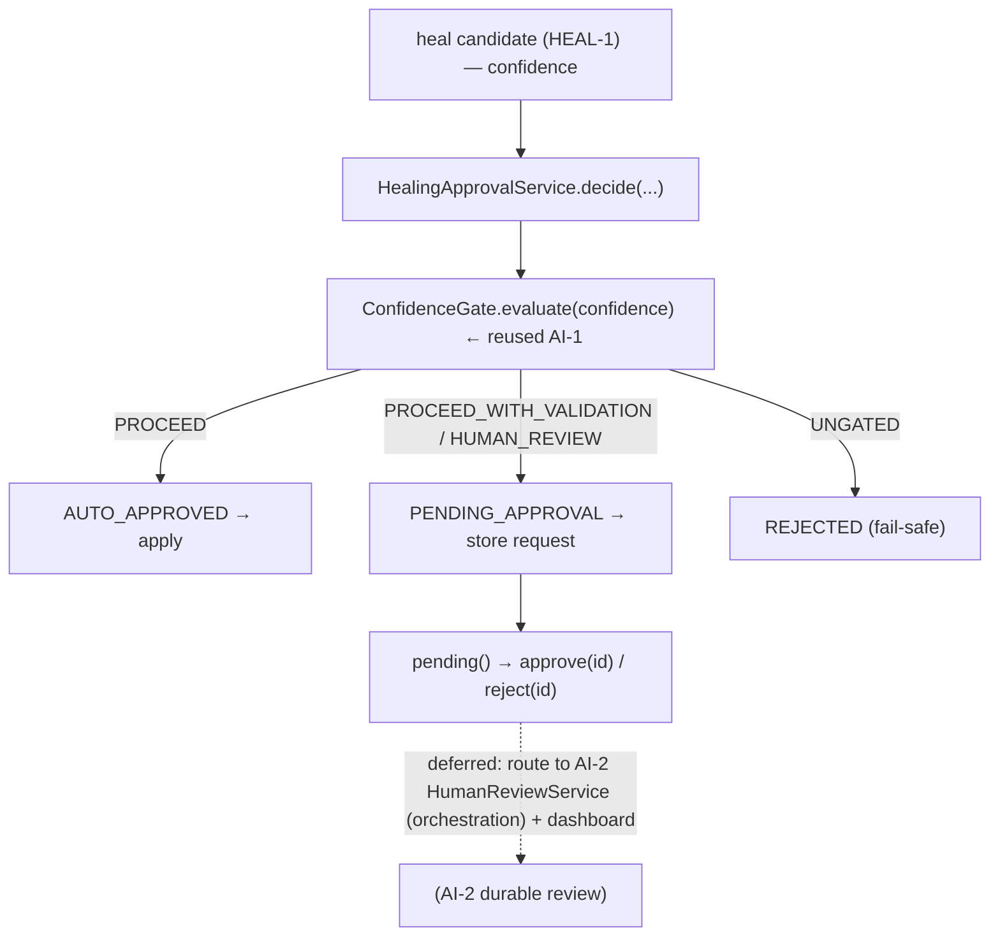

# HEAL-2 — Technical Design: Healing Confidence & Approval Workflow

**Version:** 1.0.0
**Document Type:** Implementation Technical Design
**Document Status:** Implemented — 2026-07-28 (§0.4 = A strict tier; see [Implementation Outcome](#implementation-outcome))
**Last Updated:** 2026-07-28
**Roadmap item:** [`HEAL-2`](./AI-QA-OS-Improvement-Roadmap.md#heal-2--healing-confidence--approval-workflow) (v2.2.0, frozen) — 🟠 P1 · Effort M · Owner Healing + AI/Brain · Phase 4 · v2.1
**Modules:** `ai-qa-os-healing` (confidence tiering + approval lifecycle).
**Depends on:** AI-1 (`ConfidenceGate` — ✅, reused) · AI-2 (human-review workflow — ✅, reused as the deferred sink) · HEAL-1 (produces the heals being gated — ✅).

> **Scope discipline.** Auto-editing a test script is the platform's highest-risk autonomous action. HEAL-2 adds a **healing-confidence tier** and an **approval workflow**: high-confidence heals auto-apply, everything else needs **human approval** before it touches a script — preventing the platform from silently "healing" a test into meaninglessness. The tiering + approval **lifecycle is fully validatable**; routing pending heals into AI-2's durable review store (`orchestration`) is deferred (§0.3).

---

## 0. Roadmap Verification, What Exists, and the Cross-Module Reality

### 0.1 What HEAL-2 requires

> A **healing confidence** score plus an **approval workflow** for low-confidence heals prevents silently "fixing" a test into meaninglessness (e.g. healing onto the wrong element and masking a real bug). **Where:** confidence scoring in `ai-qa-os-healing` reusing the AI-1 gate; approval reusing the AI-2 workflow. **Impact:** applies the trust-and-approval machinery to the highest-risk autonomous action — composition of existing gates, not new machinery.

### 0.2 Verified current state

| Fact | Detail |
|---|---|
| Confidence gate (AI-1) | `ConfidenceGate` in **`core`** — already reused by HEAL-1's `LocatorHealingService` (binary apply / surface-for-review). |
| Heal producer (HEAL-1) | `LocatorHealingOutcome` carries a chosen candidate + confidence — the input to gate. |
| Human review (AI-2) | `HumanReviewService` / `PausedWorkflowRegistry` / `HumanReviewEntity` — in **`ai-qa-os-orchestration`**. |
| **Cross-module wall** | `ai-qa-os-healing` depends on `core`/`memory`/`agents`/`execution`/`observability` — **not `orchestration`.** So healing can reuse AI-1's `core` gate but **cannot** directly call AI-2's review service. |

### 0.3 Environment reality

- **Buildable + validatable now:** the **confidence tier** (auto-approve / pending-approval / reject) reusing AI-1's gate, and the **approval lifecycle** (submit → pending → approve/reject) over a store seam. Pure/deterministic, unit-testable.
- **Deferred:** routing a pending heal into **AI-2's** durable `HumanReviewService`/`PausedWorkflowRegistry` (`orchestration`, cross-module) and the dashboard surface — wiring, not logic.

### 0.4 / Decision for approval — the auto-apply strictness for script edits

| Option | Approach | Trade-off |
|---|---|---|
| **A — Strict tier: only full `PROCEED` auto-applies; everything else needs approval (recommended)** | `HealingApprovalService` maps the reused AI-1 verdict: `PROCEED` → **AUTO_APPROVED**; `PROCEED_WITH_VALIDATION` / `HUMAN_REVIEW` → **PENDING_APPROVAL**; `UNGATED` (unreported) → **REJECTED**. Pending heals enter an approval lifecycle over a `HealingApprovalStore` seam (in-memory reference); real AI-2 routing deferred. | Safest for the highest-risk action — a script is auto-edited only on unambiguous confidence; anything softer waits for a human. Validatable. Stricter than the generic pipeline gate (deliberately). |
| **B — Lenient tier: `PROCEED_WITH_VALIDATION` also auto-applies** | Auto-apply on both proceed verdicts; only `HUMAN_REVIEW` needs approval. | Fewer approvals, but auto-edits scripts on medium confidence — exactly the "silently heal onto the wrong element" risk the roadmap warns about. |

**Recommend A** — for auto-editing scripts, treat "proceed *with validation*" as "a human must validate", not "apply anyway". Only unambiguous `PROCEED` auto-applies; `UNGATED` fails safe to REJECTED (same stance as LRN-4). The approval lifecycle is proven now; AI-2's durable store is wired later (FI-HEAL2-A).

> ✅ **Decision (confirmed 2026-07-28): Option A — strict tier (only full `PROCEED` auto-applies; `PROCEED_WITH_VALIDATION`/`HUMAN_REVIEW` → pending approval; `UNGATED` → rejected); in-memory approval lifecycle, AI-2 durable routing deferred (FI-HEAL2-A).** Recorded as ADR-035 (number verified at implement).

---

## 1. Technical Design (Option A)

### 1.1 Approval model (`ai-qa-os-healing`, package `…approval`)
- **`HealingApprovalStatus`** — `AUTO_APPROVED`, `PENDING_APPROVAL`, `APPROVED`, `REJECTED`.
- **`HealingApprovalRequest`** — `healingId`, `summary` (what would change, e.g. locator strategy+value), `confidence`, `status`, `correlationId`, `sequence`.
- **`HealingApprovalDecision`** — `status`, `reason`, the underlying `ConfidenceVerdict`.

### 1.2 Tiering + lifecycle
- **`HealingApprovalService`** (`@Service`) — `decide(healingId, summary, confidence, correlationId)`: gate `confidence` via the reused AI-1 `ConfidenceGate` (optional; local thresholds when absent) → map to a tier (§0.4-A). On `PENDING_APPROVAL`, record a `HealingApprovalRequest` in the store. Lifecycle: `pending()`, `approve(healingId)`, `reject(healingId)` transition a pending request to `APPROVED`/`REJECTED`.
- **`HealingApprovalStore`** (seam) + **`InMemoryHealingApprovalStore`** — persist/resolve requests; the AI-2-backed store is the deferred impl (FI-HEAL2-A).
- **`HealingApprovalProperties`** — `aiqaos.healing.approval.*` (gate-absent local `auto-approve` 0.90 / `review-floor` 0.50 thresholds).

### 1.3 What HEAL-2 defers
Routing pending heals into AI-2's durable `HumanReviewService`/`PausedWorkflowRegistry` (`orchestration`, cross-module — FI-HEAL2-A) · the dashboard approval surface (FI-HEAL2-B) · applying an approved heal back to the script (HEAL-1's FI-HEAL1-C) · notifying a reviewer (ENT-2).

---

## 2. Folder Structure

```
ai-qa-os-healing/.../approval/
    HealingApprovalStatus.java   [N] AUTO_APPROVED / PENDING_APPROVAL / APPROVED / REJECTED
    HealingApprovalRequest.java  [N] healingId + summary + confidence + status
    HealingApprovalDecision.java [N] status + reason + confidenceVerdict
    HealingApprovalStore.java    [N] seam: save / pending / resolve
    InMemoryHealingApprovalStore.java [N] reference store
    HealingApprovalProperties.java    [N] aiqaos.healing.approval.* (local thresholds)
    HealingApprovalService.java  [N] tier (reuse AI-1) + lifecycle (submit/approve/reject)
+ unit tests: service (auto/pending/reject tiers via gate, gate-absent thresholds, approve/reject lifecycle).
```

---

## 3. Required Classes (key)

| Class | Type | Responsibility |
|---|---|---|
| `HealingApprovalStatus` / `HealingApprovalRequest` / `HealingApprovalDecision` | New | Approval model |
| `HealingApprovalStore` / `InMemoryHealingApprovalStore` | New | Seam + reference store |
| `HealingApprovalService` | New | Tier (reuse AI-1) + approve/reject lifecycle |
| `HealingApprovalProperties` | New | `aiqaos.healing.approval.*` |

---

## 4. Database Changes

**None.** The reference store is in-memory; the durable AI-2-backed store is deferred (FI-HEAL2-A) and would reuse the existing `human_reviews` schema.

---

## 5. API Changes

**None** in `healing`. (Approve/reject endpoints ride AI-2's existing review REST / the dashboard — FI-HEAL2-B.)

---

## 6. Sequence Diagram



---

## 7. Step-by-Step Implementation Plan

1. **Model** — `HealingApprovalStatus`, `HealingApprovalRequest`, `HealingApprovalDecision`.
2. **Store** — `HealingApprovalStore` seam + `InMemoryHealingApprovalStore`.
3. **Service** — `HealingApprovalProperties` + `HealingApprovalService` (tier via reused AI-1 gate; submit/approve/reject lifecycle).
4. **Tests** — tiers (`PROCEED`→auto, `PROCEED_WITH_VALIDATION`/`HUMAN_REVIEW`→pending, `UNGATED`→reject), gate-absent local thresholds, approve/reject transitions + `pending()` view. No Mockito.
5. **Build & validate** — `mvn -pl ai-qa-os-healing -am test` (targeted); new tests green; HEAL-1 + existing healing tests unaffected.
6. **Sync docs** — tracker `HEAL-2`; **ADR-035** (strict confidence tier for script-editing heals + in-module approval lifecycle; AI-2 durable routing deferred). Verify ADR number at implement.

**Definition of Done:** a heal is auto-applied only on unambiguous confidence; softer/unreported confidence enters an approval workflow (pending → human approve/reject) — deterministic and unit-proven. **Deferred:** AI-2 durable-store routing, dashboard surface, apply-approved-heal, notifications.

---

## Implementation Outcome

Implemented 2026-07-28 (§0.4 = A — strict confidence tier + in-module approval lifecycle). Recorded as **ADR-035**.

**Files (all new, `ai-qa-os-healing/.../approval/`):**
- `HealingApprovalStatus` (AUTO_APPROVED/PENDING_APPROVAL/APPROVED/REJECTED), `HealingApprovalRequest` (healingId + summary + confidence + mutable status), `HealingApprovalDecision` (status + reason + confidenceVerdict).
- `HealingApprovalStore` (seam) + `InMemoryHealingApprovalStore` (`@ConditionalOnMissingBean` reference), `HealingApprovalProperties` (`aiqaos.healing.approval.auto-approve` 0.90 / `review-floor` 0.50).
- `HealingApprovalService` — strict tier via reused AI-1 `ConfidenceGate` (optional; local thresholds when absent): `PROCEED`→AUTO_APPROVED, `PROCEED_WITH_VALIDATION`/`HUMAN_REVIEW`→PENDING_APPROVAL, `UNGATED`→REJECTED; lifecycle `decide`/`pending`/`approve`/`reject`.

**Dependency-safe:** stayed within `ai-qa-os-healing` (+ `core` gate) — **no `orchestration` edge**; AI-2's durable store is a deferred seam impl.

**Validation (Maven):** `mvn -pl ai-qa-os-healing -am test` → **BUILD SUCCESS**; `HealingApprovalServiceTest` **8/8** (full-PROCEED→auto, PROCEED_WITH_VALIDATION/HUMAN_REVIEW→pending, UNGATED→reject, gate-absent thresholds, approve/reject lifecycle + pending view, non-pending cannot be approved). HEAL-1 (11) + existing healing tests unaffected. Ran with `-Djacoco.skip=true` (Java 25 toolchain).

**Honest scope note:** the **confidence tier + approval lifecycle are fully unit-proven**. **Deferred:** routing pending heals into AI-2's durable `HumanReviewService`/`PausedWorkflowRegistry` (FI-HEAL2-A); the dashboard approval surface (FI-HEAL2-B); applying an approved heal to the script (HEAL-1's FI-HEAL1-C); reviewer notification (ENT-2).

---

## Appendix — Future Ideas (Outside Current Roadmap)

- **FI-HEAL2-A** — Back `HealingApprovalStore` with AI-2's `HumanReviewService`/`PausedWorkflowRegistry` (durable), via a seam so `healing` needn't depend on `orchestration`.
- **FI-HEAL2-B** — Dashboard approval surface for pending heals (reuse the AI-2 review UI).

---

## Compliance Checklist

| Rule | Status |
|---|---|
| Roadmap not modified | ✅ HEAL-2 metadata untouched |
| Composition of existing gates | ✅ reuses AI-1 `ConfidenceGate`; AI-2 workflow as deferred sink |
| Dependency reality | ✅ stays in `healing` (+ `core` gate); no `orchestration` edge forced |
| Non-breaking | ✅ additive; no schema/API |
| Safety | ✅ script auto-edit only on unambiguous confidence; unreported → reject |
| ADR discipline | ✅ ADR-035 to be recorded (number verified at implement) |

---

## Document Completion Status

**Status:** Implemented — 2026-07-28 (§0.4 = A). See [Implementation Outcome](#implementation-outcome). ADR-035.
**Version:** 1.0.0
**Implements:** `HEAL-2` (roadmap v2.2.0, frozen) — healing confidence tier + approval lifecycle; AI-2 durable routing deferred.
**Next step:** On approval + option choice, execute [§7](#7-step-by-step-implementation-plan) from Step 1. No code until approved.
