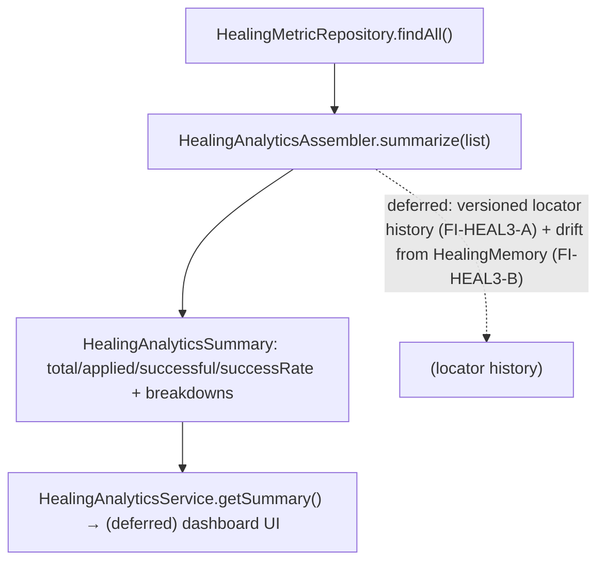

# HEAL-3 — Technical Design: Healing Dashboard, Analytics & Locator History (Read-Model Increment)

**Version:** 1.0.0
**Document Type:** Implementation Technical Design
**Document Status:** Read-model implemented — 2026-07-29 (§0.4 = A; HEAL-3 remains In Progress; see [Implementation Outcome](#implementation-outcome))
**Last Updated:** 2026-07-29
**Roadmap item:** [`HEAL-3`](./AI-QA-OS-Improvement-Roadmap.md#heal-3--healing-dashboard-analytics--locator-version-history) (v2.2.0, frozen) — 🟡 P2 · Effort M · Owner Dashboard + Healing · Phase 4 · v2.2
**Modules:** `ai-qa-os-dashboard` (healing analytics read-model over `observability`).
**Depends on:** OBS-3 (dashboards suite); reuses `HealingMetricEntity`/`HealingMetricRepository` + HEAL-1/2/4.

> **Scope discipline.** HEAL-3 makes autonomous editing **trustworthy** — a healing dashboard (what healed, confidence, auto/approved), analytics (success rate, most-drifting locators), and locator version history. This increment delivers the **backend analytics read-model** — a pure assembler over healing metrics producing a summary — **fully validatable**. The **dashboard UI** (frontend) and a **versioned locator store** are the deferred parts, so **HEAL-3 lands as `In Progress`** (§0.3).

---

## 0. Roadmap Verification & Scope

### 0.1 What HEAL-3 requires
> A Healing Dashboard (what was healed, confidence, approved/auto), Healing Analytics (heal success rate, most-drifting locators), and Locator Version History. **Where:** dashboard views (part of OBS-3) over healing records + a versioned locator store; the dashboard already has healing endpoints to build on.

### 0.2 Verified state
- `HealingMetricEntity` (observability) records each heal (failureCategory, actionType, healingStrategy, retryCount, healingApplied, retrySuccessful, recoveryStatus, improvementScore, …); `HealingMetricRepository` queries it.
- `HealingAnalyticsService` (dashboard) is thin — `getByExecutionId` + `getActionTypeBreakdown` only. **No success-rate / summary read-model.**
- HEAL-4's `HealingMemory` tracks reuse/fragility (per-locator); no cross-locator "version history" store exists.

### 0.3 Environment reality
- **Validatable now:** a **pure analytics assembler** — `summarize(List<HealingMetricEntity>) → HealingAnalyticsSummary` (totals, applied, successful, **success rate**, avg improvement, action-type/recovery-status/failure-category breakdowns) — plus a `getSummary()` on `HealingAnalyticsService`. Pure aggregation, unit-testable.
- **Deferred:** the **dashboard UI** (frontend, not verifiable here); a **versioned locator store** for locator version history (needs a new persisted store — FI-HEAL3-A); wiring "most-drifting locators" from HEAL-4's `HealingMemory` (key-value, not list-queryable — FI-HEAL3-B).

### 0.4 / Decision for approval — scope of this increment

| Option | Approach | Trade-off |
|---|---|---|
| **A — Backend analytics read-model now; UI + locator history deferred (recommended)** | Pure `HealingAnalyticsAssembler` → `HealingAnalyticsSummary`, exposed via `HealingAnalyticsService.getSummary()`. UI + versioned locator store deferred. HEAL-3 → `In Progress`. | The trustworthy-analytics substance, fully validatable, zero blast radius. Doesn't render a UI or store locator versions yet. |
| **B — Also build the versioned locator store + history now** | A persisted per-locator version store + history queries. | Needs a DB + a new store, largely unvalidatable here; the analytics read-model is the higher-value, provable part first. |

**Recommend A** — deliver the analytics read-model (the audit substance) now; the UI is frontend and the versioned locator store is a persistence concern (FI-HEAL3-A). HEAL-3 stays `In Progress`.

> ✅ **Decision (confirmed 2026-07-29): Option A — healing analytics read-model (pure `HealingAnalyticsAssembler` → `HealingAnalyticsSummary`, exposed via `getSummary()`); UI + versioned locator store deferred (FI-HEAL3-A/C). HEAL-3 → In Progress.** Recorded as ADR-047 (number verified at implement).

---

## 1. Technical Design (Option A)

`ai-qa-os-dashboard`:
- **`HealingAnalyticsSummary`** (dto) — `total`, `appliedCount`, `successfulCount`, `successRate` (successful/total), `avgImprovementScore`, `actionTypeBreakdown`, `recoveryStatusBreakdown`, `failureCategoryBreakdown` (all `Map<String,Long>`/counts).
- **`HealingAnalyticsAssembler`** — pure `summarize(List<HealingMetricEntity>)`; empty list → zeroed summary.
- **`HealingAnalyticsService`** — add `getSummary()` = `assembler.summarize(repo.findAll())` (existing methods + constructor untouched; additive method only).

**Defers:** dashboard UI (frontend) · versioned locator store + history (FI-HEAL3-A) · most-drifting-locators from `HealingMemory` (FI-HEAL3-B).

---

## 2. Folder Structure
```
ai-qa-os-dashboard/.../dto/
    HealingAnalyticsSummary.java   [N] totals + successRate + breakdowns
ai-qa-os-dashboard/.../service/
    HealingAnalyticsAssembler.java [N] pure summarize(List<HealingMetricEntity>)
    HealingAnalyticsService.java   [E] + getSummary()
+ unit tests: HealingAnalyticsAssembler (success rate, breakdowns, avg score, empty).
```

---

## 3–5. Classes / DB / API
Key classes above. **DB:** none (reads existing `healing_metrics`). **API:** a `/healing/summary` endpoint can expose `getSummary()` (controller wiring is a thin follow-up; the read-model is the deliverable).

---

## 6. Sequence


---

## 7. Plan
1. **DTO** — `HealingAnalyticsSummary`.
2. **Assembler** — `HealingAnalyticsAssembler.summarize` (pure aggregation).
3. **Service** — add `HealingAnalyticsService.getSummary()` (additive; constructor untouched).
4. **Tests** — assembler: success rate, applied/successful counts, action-type/recovery-status/failure-category breakdowns, avg improvement, empty→zeroed. No Mockito (hand-built entity lists).
5. **Build & validate** — targeted `mvn -pl ai-qa-os-dashboard -am test -Dtest=… -Djacoco.skip=true -DargLine="-Xss40m"`; green; existing dashboard tests unaffected.
6. **Sync docs** — tracker `HEAL-3` → **In Progress** (read-model landed; UI + locator history deferred); **ADR-047** (healing analytics read-model via a pure assembler). Verify number at implement.

**DoD (this increment):** healing metrics aggregate into a summary — success rate + action/status/category breakdowns + avg improvement — unit-proven. **Deferred:** dashboard UI, versioned locator history, drift-from-memory. HEAL-3 stays In Progress.

---

## Implementation Outcome

Read-model implemented 2026-07-29 (§0.4 = A — backend analytics). Recorded as **ADR-047**. **HEAL-3 remains In Progress** (UI + locator history deferred).

**Files (`ai-qa-os-dashboard`; [N]=new, [E]=edit):**
- `dto/HealingAnalyticsSummary` [N] (total/applied/successful + successRate + avgImprovementScore + action-type/recovery-status/failure-category breakdowns; `empty()`), `service/HealingAnalyticsAssembler` [N] (pure `summarize(List<HealingMetricEntity>)`), `service/HealingAnalyticsService` [E] (+`getSummary()`, assembler injected — constructor now 2-arg, single constructor).

**Validation (Maven):** `mvn -pl ai-qa-os-dashboard -am test` → **BUILD SUCCESS**; `HealingAnalyticsAssemblerTest` **4/4** (headline counts + success rate 0.5, breakdowns, empty→zeroed, null→UNKNOWN bucket). The dashboard's `@SpringBootTest`/`@WebMvcTest` controller tests all passed — the constructor change wired cleanly. Ran with `-Djacoco.skip=true -DargLine="-Xss40m"`.

**Honest scope note:** the **analytics aggregation read-model is unit-proven**. **Deferred:** the dashboard **UI** (frontend, not verifiable in this environment); a **versioned locator store** for locator version history (FI-HEAL3-A, needs DB); "most-drifting locators" from HEAL-4's `HealingMemory` (FI-HEAL3-B); the `/healing/summary` controller endpoint (FI-HEAL3-C). HEAL-3 stays In Progress.

---

## Appendix — Future Ideas
- **FI-HEAL3-A** — A versioned locator store + history queries (the locator version-history view).
- **FI-HEAL3-B** — "Most-drifting locators" sourced from HEAL-4's `HealingMemory` (needs a list-queryable index of fragile records).
- **FI-HEAL3-C** — The dashboard UI + `/healing/summary` controller wiring.

---

## Compliance Checklist
| Rule | Status |
|---|---|
| Roadmap not modified | ✅ HEAL-3 metadata untouched |
| Reuses existing healing metrics | ✅ over `HealingMetricEntity`/repo; no new store |
| Honest status | ✅ HEAL-3 → In Progress (read-model; UI deferred) |
| Non-breaking | ✅ additive DTO + assembler + one service method |
| Spring-wiring sanity | ✅ constructor untouched; pure assembler (per 2026-07-29 lesson) |
| ADR discipline | ✅ ADR-047 to be recorded (number verified at implement) |

---

## Document Completion Status
**Status:** Read-model implemented — 2026-07-29 (§0.4 = A). HEAL-3 remains In Progress. See [Implementation Outcome](#implementation-outcome). ADR-047.
**Implements:** `HEAL-3` (roadmap v2.2.0, frozen) — the analytics read-model; UI + locator history deferred.
**Next step:** On approval + option choice, execute [§7](#7-step-by-step-implementation-plan) from Step 1.
