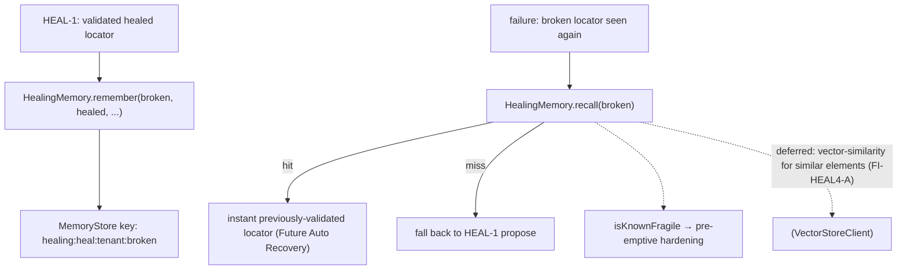

# HEAL-4 — Technical Design: AI Healing Memory

**Version:** 1.0.0
**Document Type:** Implementation Technical Design
**Document Status:** Implemented — 2026-07-29 (§0.4 = A key-value, tenant-scoped; see [Implementation Outcome](#implementation-outcome))
**Last Updated:** 2026-07-29
**Roadmap item:** [`HEAL-4`](./AI-QA-OS-Improvement-Roadmap.md#heal-4--ai-healing-memory) (v2.2.0, frozen) — 🟠 P1 · Effort M · Owner Healing + Memory · Phase 4 · v2.1
**Modules:** `ai-qa-os-healing` (healing-specific retrieval over `memory`).
**Depends on:** HEAL-1 (locator heals — ✅) · ENT-1 (tenant-scoping — foundation ✅) · reuses `memory`.

> **Scope discipline.** HEAL-4 elevates healing from per-run reaction to **cross-run learning** — a queryable memory of validated healed locators so a recurring drift is recovered *before* it fails again (the loop's "Future Auto Recovery"). It **reuses the `memory` infrastructure** (no new module) and is **tenant-scoped** via ENT-1's `TenantContext` so one project's heals never leak into another's. The remember/recall/fragility logic is **fully validatable**; vector-similarity retrieval of *similar* elements is deferred (§0.3).

---

## 0. Roadmap Verification & Scope

### 0.1 What HEAL-4 requires
> A dedicated, queryable memory of every healing decision and locator alternative, so the platform recovers from drift *before* a known-fragile locator fails again — even inside a different test — and can pre-emptively harden fragile locators. Reuses `memory`; tenant-scoped once ENT-1 lands; feeds `SelfHealingStep` + HEAL-3.

### 0.2 Verified state
- `RecoveryHistoryStore` (healing) stores `RecoveryAttempt`s **by executionId** (per-run) over the `memory` `MemoryStore` — not cross-run, not keyed by element.
- HEAL-1's `LocatorHealer` proposes locators per failure but nothing **remembers** a validated heal for next time.
- ENT-1's `TenantContext`/`TenantContextHolder` (core) landed — tenant-scoping is available now.

### 0.3 Environment reality
- **Validatable now:** a `HealingMemory` over `MemoryStore` — `remember` a validated heal keyed by (tenant, broken locator), `recall` it on recurrence, track reuse + flag **fragile** locators (drifted more than once). Tenant-scoped via `TenantContextHolder`.
- **Deferred:** **vector-similarity** retrieval (match a *similar* element/context via `VectorStoreClient`, not just an exact broken-locator key) — the richer "even in a different test" case (FI-HEAL4-A); wiring recall-before-propose into the heal flow (FI-HEAL4-B); the HEAL-3 locator-history surface.

### 0.4 / Decision for approval — retrieval model

| Option | Approach | Trade-off |
|---|---|---|
| **A — Key-value healing memory (exact broken-locator key), tenant-scoped (recommended)** | `HealingMemory` over `MemoryStore` keyed by `(tenantId, brokenLocator)`; `remember`/`recall`, reuse-count, fragile-flag. Tenant-scoped via ENT-1. | Reuses `memory`, no new infra, fully validatable; delivers instant recall + fragility hardening for recurring drift. Exact-key match only — doesn't fuzzy-match *similar* elements yet. |
| **B — Vector-indexed similarity retrieval now** | Index locator alternatives by element/context embedding via `VectorStoreClient`; recall by similarity. | Handles the "similar element in a different test" case, but couples to the vector store (real Qdrant needs infra) and is heavier; the roadmap frames it as the enrichment on top. |

**Recommend A** — deliver the queryable, tenant-scoped healing memory over the existing `MemoryStore` now (makes "Future Auto Recovery" real for recurring drift); vector-similarity is the enrichment (FI-HEAL4-A) once the in-memory/real vector tier is exercised.

> ✅ **Decision (confirmed 2026-07-29): Option A — key-value `HealingMemory` over `MemoryStore`, tenant-scoped via ENT-1's `TenantContextHolder`; reuse-count + fragile flagging; vector-similarity deferred (FI-HEAL4-A).** Recorded as ADR-046 (number verified at implement).

---

## 1. Technical Design (Option A)

`ai-qa-os-healing`, package `com.aiqaos.healing.memory`:
- **`HealedLocatorRecord`** — `brokenLocator`, `healedLocator`, `strategy`, `confidence`, `reuseCount`, `fragile`, `tenantId` (Serializable — stored in `MemoryStore`).
- **`HealingMemory`** (`@Component`, over `MemoryStore`):
  - `remember(brokenLocator, healedLocator, strategy, confidence)` — store/refresh the validated heal under the tenant-scoped key; if this broken locator was healed before, increment `reuseCount` and mark it **fragile** (it has drifted again).
  - `recall(brokenLocator)` → `Optional<HealedLocatorRecord>` — the previously-validated heal for this element (tenant-scoped).
  - `isKnownFragile(brokenLocator)` — true if it has drifted before (pre-emptive hardening signal).
  - **Tenant-scoped keys** — `healing:heal:<tenantId>:<brokenLocator>`, `tenantId` from `TenantContextHolder.current()` (system tenant when unbound) — one tenant's heals never recall under another.

**Defers:** vector-similarity retrieval (FI-HEAL4-A) · recall-before-propose wiring into the heal flow (FI-HEAL4-B) · HEAL-3 surface.

---

## 2. Folder Structure
```
ai-qa-os-healing/.../memory/
    HealedLocatorRecord.java  [N] broken→healed + reuseCount + fragile + tenantId
    HealingMemory.java        [N] @Component over MemoryStore: remember/recall/isKnownFragile (tenant-scoped)
+ unit tests: HealingMemory (remember→recall, unknown→empty, re-heal→fragile+reuse, tenant isolation).
```

---

## 3–5. Classes / DB / API
Key classes above. **DB:** none directly (rides `MemoryStore`; durable backing is the memory module's concern). **API:** none (feeds `SelfHealingStep`/HEAL-3 later).

---

## 6. Sequence


---

## 7. Plan
1. **Record** — `HealedLocatorRecord`.
2. **Memory** — `HealingMemory` over `MemoryStore` (remember/recall/isKnownFragile; tenant-scoped keys via `TenantContextHolder`).
3. **Tests** — remember→recall; unknown→empty; re-heal same locator → `reuseCount`↑ + fragile; tenant isolation (heal under tenant A not recalled under B). Map-backed `MemoryStore` double; no Mockito.
4. **Build & validate** — targeted `mvn -pl ai-qa-os-healing -am test -Dtest=… -Djacoco.skip=true -DargLine="-Xss40m"`; green; existing healing tests unaffected.
5. **Sync docs** — tracker `HEAL-4` → Completed; **ADR-046** (tenant-scoped key-value healing memory over `MemoryStore`; vector-similarity deferred). Verify number at implement.

**DoD:** a validated heal is remembered cross-run and recalled instantly on recurrence (tenant-scoped), with repeat drift flagging a locator fragile — unit-proven. **Deferred:** vector-similarity retrieval, recall-before-propose wiring, HEAL-3 surface.

---

## Implementation Outcome

Implemented 2026-07-29 (§0.4 = A — key-value, tenant-scoped healing memory). Recorded as **ADR-046**. **HEAL-4 Completed.**

**Files (all new, `ai-qa-os-healing/.../memory/`):**
- `HealedLocatorRecord` (Serializable: broken→healed + strategy + confidence + reuseCount + fragile + tenantId + timestamp), `HealingMemory` (`@Component` over `MemoryStore`): `remember`/`recall`/`isKnownFragile`; tenant-scoped keys `healing:heal:<tenantId>:<broken>` via ENT-1's `TenantContextHolder` (system tenant when unbound); repeat drift → `reuseCount`↑ + `fragile`. 90-day TTL.

**Validation (Maven):** `mvn -pl ai-qa-os-healing -am test` → **BUILD SUCCESS**; `HealingMemoryTest` **5/5** (remember→recall, unknown→empty, first-heal-not-fragile, re-drift→fragile+reuse, **tenant isolation** via `TenantContextHolder.run`). Existing healing tests (approval 8, coordinator 3, engine 2) green. Ran with `-Djacoco.skip=true -DargLine="-Xss40m"`. Single-constructor `@Component` — no wiring traps.

**Honest scope note:** the **remember/recall/fragility + tenant-scoping are unit-proven**. **Deferred:** vector-similarity retrieval of *similar* elements across different tests (FI-HEAL4-A); wiring recall-before-propose into `LocatorHealCoordinator`/`SelfHealingStep` (FI-HEAL4-B); the HEAL-3 locator-history surface.

---

## Appendix — Future Ideas
- **FI-HEAL4-A** — Vector-similarity retrieval (embed element/context; recall a *similar* element's validated locator across different tests) via `VectorStoreClient`.
- **FI-HEAL4-B** — Wire recall-before-propose into `LocatorHealCoordinator`/`SelfHealingStep` (memory first, healer on miss, remember on validated heal).

---

## Compliance Checklist
| Rule | Status |
|---|---|
| Roadmap not modified | ✅ HEAL-4 metadata untouched |
| Reuses `memory` (no new module) | ✅ over `MemoryStore`; healing already depends on memory |
| Tenant-scoped (ENT-1) | ✅ keys scoped via `TenantContextHolder` |
| Dependency reality | ✅ within `healing` (+ core/memory); no new dep |
| Non-breaking | ✅ additive; existing healing untouched |
| Spring-wiring sanity | ✅ single-constructor `@Component` (per 2026-07-29 lesson) |
| ADR discipline | ✅ ADR-046 to be recorded (number verified at implement) |

---

## Document Completion Status
**Status:** Implemented — 2026-07-29 (§0.4 = A). HEAL-4 Completed. See [Implementation Outcome](#implementation-outcome). ADR-046.
**Implements:** `HEAL-4` (roadmap v2.2.0, frozen) — tenant-scoped healing memory; vector-similarity deferred.
**Next step:** On approval + option choice, execute [§7](#7-step-by-step-implementation-plan) from Step 1.
