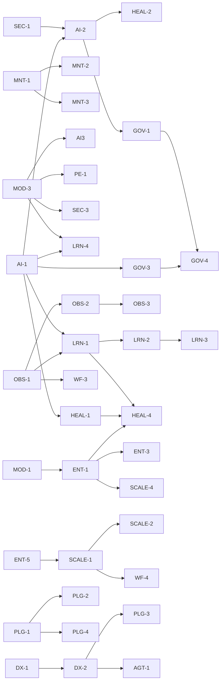

# AI-QA-OS — Implementation Tracker

**Version:** 1.0.0
**Document Type:** Implementation Progress Tracker
**Document Status:** Active
**Last Updated:** 2026-07-22
**Source of truth:** [`AI-QA-OS-Improvement-Roadmap.md`](./AI-QA-OS-Improvement-Roadmap.md) v2.1.0 (finalized)

> **Purpose.** Track the implementation status of every roadmap item. This document does **not** change the roadmap — it mirrors its finalized items and adds a live `Status` that owners update as work progresses. When roadmap metadata (owner, phase, version) and this tracker disagree, the roadmap wins; open a correction rather than editing metadata here.

---

## How to Use This Tracker

- **One row per roadmap item.** IDs match the roadmap exactly (`SEC-1`, `AI-2`, `HEAL-4`, `LRN-4`, …).
- **`Status` is the only field owners change daily.** Everything else is copied from the finalized roadmap.
- **Move a row's status left→right only:** `Planned → In Progress → Under Review → Completed`. `Deferred` is a parking state that can re-enter at `Planned`.
- **Definition of Done (DoD)** for any item: implementation merged behind passing CI (tests run — see `MNT-1`), documentation/ADR updated if architecture-affecting, and the roadmap item's acceptance intent (its "Architectural Impact") demonstrably met.

### Status legend

| Status | Meaning |
|---|---|
| **Planned** | Accepted, not started |
| **In Progress** | Actively being implemented |
| **Under Review** | Code/PR review, QA, or approval gate |
| **Completed** | Merged, verified, DoD met |
| **Deferred** | Intentionally postponed (P3 / vision) |

---

## Progress Summary

| Metric | Count |
|---|---|
| Total roadmap items | 76 |
| Planned | 45 |
| In Progress | 2 |
| Under Review | 0 |
| Completed | 19 |
| Deferred | 9 |
| Incremental (rolling) | 1 (`AGT-1`) |

**By phase:** Phase 0 → 9 · Phase 1 → 11 · Phase 2 → 12 · Phase 2 (DX) → 5 · Phase 3 → 11 · Phase 4 → 24 · Vision → 4
**By priority:** 🔴 P0 → 3 · 🟠 P1 → 26 · 🟡 P2 → 32 · ⚪ P3 → 15

> **Current focus:** Phase 0 (`SEC-1`, `SEC-2`, `SEC-5`, `MNT-1`, `MNT-2`, `ORG-1`) — no other work should start until these are `Completed` (per roadmap §22 and `.claude/PROJECT_CONTEXT.md` rule 7).

---

## Category A — Security

| ID | Title | Status | Owner | Priority | Phase | Target Version | Module | Dependencies | Notes |
|----|-------|--------|-------|----------|-------|----------------|--------|--------------|-------|
| SEC-1 | Restore real authentication & authorization | Completed | Security | 🔴 P0 | Phase 0 | v1.3 | ai-qa-os-security | — | Implemented 2026-07-22: removed `ignoring()` bypass, deny-by-default chain gated by `aiqaos.security.enabled`, 401/403 JSON handlers, config-driven bootstrap admin. Security tests 4/4 + dashboard ctx green. Authz scoped to "authenticated" (no user→role model). Live E2E vs Postgres pending environment |
| SEC-2 | Externalize all secrets | Completed | Security | 🔴 P0 | Phase 0 | v1.3 | ai-qa-os-security / config | — | Implemented 2026-07-22: removed hardcoded JWT fallback (resolve via `SecretManager`, fail-fast when enforced / ephemeral otherwise), externalized DB creds + JWT secret to `${ENV}` in all app/config profiles, test-only keys labeled, `.env.example` + k8s secret updated. Security 7/7 + dashboard ctx green. Helm absent (skipped). Live E2E vs env-injected secrets pending environment |
| SEC-3 | Prompt-injection & output-grounding defence | Completed | Security + AI/Brain | 🟠 P1 | Phase 1 | v1.4 | intelligence / orchestration / execution | MOD-3 | Implemented 2026-07-23 (Option A — Guardrail promoted eval→core): `PromptInjectionGuardrail` (intelligence, detect+delimit; `PromptSecurityGuard` delegates), `ActionAllowlistGuardrail` (orchestration output-grounding, into `LLMResponseValidator`), `ScriptSurfaceGuardrail` (execution deny-list, into `ExecutionValidator`). Config `aiqaos.security.guardrails.enabled/mode` (enforce default), null-safe injection. Full reactor BUILD SUCCESS (22 modules); LLMResponseValidator 15/15 + integration E2E unaffected; new guard tests green. ADR-015. Deterministic — no live-LLM caveat |
| SEC-4 | CSP & transport hardening | Completed | Security | 🟠 P1 | Phase 1 | v1.4 | security / dashboard | — | Implemented 2026-07-23 (§0.3a strict/tunable CSP, §0.3b HTML-attachment): shared `SecurityHeaders` (strict CSP via `aiqaos.security.csp`, X-Frame DENY, Referrer/Permissions policies, HSTS) applied by BOTH chains — incl. dashboard `@Order(1)` (artifact surface, previously header-less). `ArtifactController` real-path/symlink check + nosniff + `default-src 'none';sandbox` + HTML served as attachment. Full reactor BUILD SUCCESS (22 modules); SecurityHeadersTest 2/2 + SEC-1 auth 9 intact. ADR-016. Swagger live-render tunable via property (CORS wildcard → FI-SEC4-A) |
| SEC-5 | Supply-chain & dependency scanning in CI | Completed | Security / DevOps | 🟠 P1 | Phase 0 | v1.3 | CI (.github) | ORG-1 | Implemented 2026-07-22 (Option A visibility-first): Dependabot (both repos), Trivy-fs dep scan report-only+SARIF, UI `npm audit` report-only, gitleaks secret scan blocking w/ allowlist. Vendored node_modules skipped pending ORG-1. YAML+allowlist validated; scanner Actions run only on CI |
| SEC-6 | Signed artifacts & mTLS between services | Deferred | Infrastructure | ⚪ P3 | Phase 3 | v2.0 | deployment / execution | ENT-1 | Regulated-deployment posture |

## Category B — Maintainability & Engineering Hygiene

| ID | Title | Status | Owner | Priority | Phase | Target Version | Module | Dependencies | Notes |
|----|-------|--------|-------|----------|-------|----------------|--------|--------------|-------|
| MNT-1 | Run the test suite in CI | Completed | Platform Engineering | 🔴 P0 | Phase 0 | v1.3 | CI (.github) | — | Implemented 2026-07-22: Core CI `compile`→`verify` (+PR trigger); new UI `ci.yml` (npm ci/lint/test); 8 pre-existing failures quarantined via `@Disabled` (Option A) tracked FI-MNT1-A/B/C. Full reactor `mvn test` green with 8 skipped; UI lint+test green |
| MNT-2 | Fix the CI deploy stage | Completed | Platform Engineering | 🟠 P1 | Phase 0 | v1.3 | CI (.github) | MNT-1 | Implemented 2026-07-22: `packages: write`, parameterised image ref (`vars.IMAGE_REGISTRY` → `ghcr.io/<owner>`), `:latest`+`:sha` tags, GHCR login + gated push (clean scan + main-only). `company/` placeholder gone. YAML validated; Actions run not executable here |
| MNT-3 | Close the two highest-value test gaps | Completed | Gateway + AI-Provider teams | 🟠 P1 | Phase 1 | v1.4 | gateway / ai-provider | MNT-1 | Implemented 2026-07-23: both zero-test modules 0→green (21 tests). ai-provider: ModelRouter/LLMResilienceManager/ApiKeyPool/CostTracker (hand-stubs + JDK dynamic-proxy repos, no Mockito). gateway: WorkflowController + GlobalExceptionHandler. **Deviation:** `@WebMvcTest` (approved §0.4-A) slice would not load here (GatewaySecurityFilter needs AuthenticationManager; @MockBean=Mockito broken on JDK25) → fell back to §0.4-B plain unit tests. Found latent bug FI-MNT3-C (Gemini models priced as "mini"). BUILD SUCCESS 21/0/0; no production code changed |
| MNT-4 | Remove dead code & unused dependencies | Completed | Platform Engineering | 🟡 P2 | Continuous | v1.3 | root pom / dashboard-ui | PERF-3 | Implemented 2026-07-22: removed LangChain4j BOM+prop, CheckDB.java/.class, ErrorPage.tsx, fetchArtifactHistory, and react-query fully (Option A — dep/provider/config/chunk). Backend compiles; UI build+lint+test green; 0 react-query refs |
| MNT-5 | Establish ADRs & keep roadmap honest | Completed | Architecture | 🟡 P2 | Continuous | v1.3 | AI-QA-OS-Docs | — | Implemented 2026-07-22 (Option A): `docs/decisions/README.md` → ADR index (pointer to canonical log); `00-Project-Roadmap.md` → Status Reconciliation banner (stale table, honest pointers); added ADR-009 (decision/roadmap-honesty discipline). Frozen improvement roadmap untouched |
| MNT-6 | Consistent package naming & correlated logging | Completed | Platform Engineering + Observability | 🟡 P2 | Continuous | v1.5 | orchestration / observability | OBS-1 | Implemented 2026-07-23 (Option A both): renamed `com.aiqaos.workflow`→`com.aiqaos.orchestration` (84 orch files + 9 dashboard/gateway importers, scripted move+replace); MDC correlationId at pipeline run (`AutonomousQAPipelineOrchestrator`, covers in-JVM agents/execution) — gateway `CorrelationIdFilter` already did per-request; `%X{correlationId}` added to gateway+dashboard log pattern. Full `mvn clean test` BUILD SUCCESS 22 modules + integration E2E green (needed `clean` — stale `com/aiqaos/workflow/*.class` first caused a bean conflict). ADR-019. **Unblocks OBS-1** |

## Category C — Missing AI Capabilities

| ID | Title | Status | Owner | Priority | Phase | Target Version | Module | Dependencies | Notes |
|----|-------|--------|-------|----------|-------|----------------|--------|--------------|-------|
| AI-1 | Implement the AI Confidence Score gate | Completed | AI/Brain | 🟠 P1 | Phase 1 | v1.4 | ai-qa-os-brain | — | Implemented 2026-07-22: `ConfidenceGate` contract (core) + `ConfidencePolicyManager` impl (brain, config thresholds, persists DecisionEntity) + orchestrator integration (ObjectProvider, pause on HUMAN_REVIEW) + 8 steps surface confidence; 0.0=UNGATED safeguard. ADR-010. Brain test 4/4, orchestration no regression, apps compile. **Unblocks AI-2** |
| AI-2 | Human-in-the-loop approval workflow | Completed | AI/Brain + Orchestration | 🟠 P1 | Phase 1 | v1.4 | orchestration / gateway / dashboard | AI-1 | Implemented 2026-07-22 (F1 in-memory, F2 dashboard-proxy): PausedWorkflowRegistry + HumanReviewEntity + orchestrator resume/reject; gateway approve/reject/reviews REST; dashboard ReviewController (read+proxy); UI Human Review page; V14 migration. ADR-011. Orchestration 35/0-fail, gateway+dashboard compile, UI build+test green. Live loop needs multi-service env |
| AI-3 | Prompt evaluation & regression harness | Completed | AI / Eval | 🟠 P1 | Phase 1 | v1.4 | ai-qa-os-eval / intelligence | MOD-3 | Implemented 2026-07-22 (Option A committed-baseline): `PromptRegressionHarness` (load golden → `PromptRunner` → MOD-3 `PromptEvaluationService` → compare vs baseline, tolerance 0.05 → `RegressionReport`) + `ClasspathGoldenDatasetProvider`, `LlmPromptRunner` (LLM + optional `PromptEngine` render via ObjectProvider), `FileBaselineStore` (`golden/<suite>.baseline.json`) + sample suite/baseline. Eval tests 21/21, reactor green. ADR-013. Engine only — **CI merge-gate + Prompt Score is PE-1** |
| AI-4 | Semantic / prompt cache | Planned | AI-Provider | 🟡 P2 | Phase 4 | v2.1 | ai-provider / memory | MNT-3, PERF-2 | Cache-aside at provider boundary |
| AI-5 | Complete/remove Claude; wire local model | Deferred | AI-Provider | ⚪ P3 | Phase 4 | v2.1 | ai-qa-os-ai-provider | — | Ollama unlocks air-gapped deploys |
| AI-6 | Context-window & cost budgeting per workflow | Deferred | AI/Brain | ⚪ P3 | Phase 4 | v2.1 | brain / memory | ENT-3 | Cost tracking → cost governance |

## Category D — Missing Enterprise Features

| ID | Title | Status | Owner | Priority | Phase | Target Version | Module | Dependencies | Notes |
|----|-------|--------|-------|----------|-------|----------------|--------|--------------|-------|
| ENT-1 | Multi-tenancy / project isolation | Planned | Platform / Enterprise | 🟠 P1 | Phase 3 | v2.0 | ai-qa-os-tenant (new) | MOD-1 | Largest structural change; do context contract early |
| ENT-2 | Centralised notifications | Planned | Integration | 🟡 P2 | Phase 4 | v2.1 | ai-qa-os-notification (new) | MOD-2, AI-2 | Reaches human for approvals |
| ENT-3 | LLM cost governance & quotas | Planned | Platform / AI-Brain | 🟠 P1 | Phase 3 | v2.0 | brain / dashboard | ENT-1, AI-6 | Enforce, not just track |
| ENT-4 | Admin & user-management surface | Planned | Dashboard + Security | 🟡 P2 | Phase 3 | v2.0 | dashboard / security | — | Activates existing RBAC entities |
| ENT-5 | Backup, DR & data lifecycle | In Progress | Infrastructure | ⚪ P3 | Phase 2 | v1.5 | deployment / execution | SCALE-1 | **Un-deferred at user request 2026-07-23; seam done (§0.4-A):** `ArtifactStore` +list/delete/lastModified; `ObjectStorageClient`+`InMemoryObjectStorageClient`+`ObjectStorageArtifactStore` (object-storage `ArtifactStore`, unit-proven — the code-level SCALE-1 unblock); `ArtifactRetentionService` (age-based, opt-in); backup CronJob templates in `deployment/kubernetes/backup/`. Reactor BUILD SUCCESS 22 modules, execution tests 10/10. ADR-018. **Deferred:** real S3/GCS adapter (creds), execution-worker upload, running CronJobs — so SCALE-1 ceiling still not removed |

## Category E — Missing Workflows

| ID | Title | Status | Owner | Priority | Phase | Target Version | Module | Dependencies | Notes |
|----|-------|--------|-------|----------|-------|----------------|--------|--------------|-------|
| WF-1 | Distinct scenario & test-data workflows | Planned | Orchestration | 🟠 P1 | Phase 4 | v2.1 | orchestration / testdata | MOD-4 | Fills designed pipeline steps |
| WF-2 | CI-triggered & scheduled runs | Planned | Integration + Orchestration | 🟠 P1 | Phase 4 | v2.1 | integration / orchestration | — | Webhook → workflow loop |
| WF-3 | Test impact analysis, flaky detection, re-run-failed | Planned | Learning | 🟡 P2 | Phase 4 | v2.2 | learning / observability | OBS-1 | Uses stored execution history |
| WF-4 | Sharded / parallel cross-browser execution | Planned | Execution | 🟡 P2 | Phase 2 | v1.5 | ai-qa-os-execution | SCALE-1 | Playwright native sharding |

## Category F — Missing / Incomplete Modules

| ID | Title | Status | Owner | Priority | Phase | Target Version | Module | Dependencies | Notes |
|----|-------|--------|-------|----------|-------|----------------|--------|--------------|-------|
| MOD-1 | `ai-qa-os-tenant` (project / tenant context) | Planned | Platform / Enterprise | 🟠 P1 | Phase 3 | v2.0 | ai-qa-os-tenant (new) | — | Context contract lives in `core` |
| MOD-2 | `ai-qa-os-notification` (outbound comms) | Planned | Integration | 🟡 P2 | Phase 4 | v2.1 | ai-qa-os-notification (new) | — | `SlackPlugin` becomes an adapter |
| MOD-3 | `ai-qa-os-eval` (evaluation & guardrails) | Completed | AI / Eval | 🟠 P1 | Phase 1 | v1.4 | ai-qa-os-eval (new) | — | Implemented 2026-07-22 (Option A working-anchor): new module (21st, deps core/intelligence/memory/ai-provider) with `Evaluator`/`Guardrail`/`GoldenDatasetProvider`/`RetrievalQualityMetric` contracts, reference evaluators (exact-match, contains, json-validity, llm-judge via injectable seam), `NonEmptyOutputGuardrail`, in-memory dataset provider, `PromptEvaluationService` (ObjectProvider persistence) + `EvaluationResultEntity`/`V15`. Eval tests 16/16, reactor green. ADR-012. **Unblocks AI-3, PE-1, SEC-3** |
| MOD-4 | Make `ai-qa-os-testdata` real | Planned | Test Data / AI | 🟠 P1 | Phase 4 | v2.1 | ai-qa-os-testdata | — | Fill existing stub; PII masking |
| MOD-5 | Make `ai-qa-os-data` real, or fold in | Deferred | Platform Engineering | 🟡 P2 | Continuous | v1.5 | ai-qa-os-data | — | Decision: implement vs remove |

## Category G — Folder Structure & Code Organisation

| ID | Title | Status | Owner | Priority | Phase | Target Version | Module | Dependencies | Notes |
|----|-------|--------|-------|----------|-------|----------------|--------|--------------|-------|
| ORG-1 | Remove committed `node_modules/` from execution | Completed | Execution / DevOps | 🟠 P1 | Phase 0 | v1.3 | execution | SEC-5 | Implemented 2026-07-22 (Option A runtime bootstrap): deleted 43MB/434-file node_modules, gitignored, JAR resource-exclude (JAR now 60K, 0 node_modules entries), `run-playwright.ps1` npm ci bootstrap (ASCII-fixed for PS5.1 encoding), SEC-5 skip-dirs dropped. Build+JAR+YAML+ps1 validated; Playwright run not executable here |
| ORG-2 | Consolidate Flyway migrations | Planned | Platform Engineering | 🟡 P2 | Continuous | v1.5 | gateway / dashboard / deployment | SCALE-4 | Single migration owner |
| ORG-3 | Frontend path aliases & folder separation | Planned | Frontend | 🟡 P2 | Continuous | v1.4 | dashboard-ui | — | `@/` aliases; isolate `mock/` |
| ORG-4 | Move root scripts & remove stray artifacts | Completed | Platform Engineering | 🟡 P2 | Continuous | v1.3 | core repo root | — | Implemented 2026-07-22: moved 6 `*.ps1` + `request.json` → `scripts/` (+ README), deleted `build-output.log`, added `*.class` to `.gitignore`. Root now only pom/.gitignore/.env.example; `mvn validate` OK |

## Category H — Scalability

| ID | Title | Status | Owner | Priority | Phase | Target Version | Module | Dependencies | Notes |
|----|-------|--------|-------|----------|-------|----------------|--------|--------------|-------|
| SCALE-1 | Decouple execution into a queue-fed worker pool | In Progress | Infrastructure / Execution | 🟠 P1 | Phase 2 | v1.5 | execution / infra | ENT-5 | **Seam done 2026-07-23 (§0.3a-A, Redis-target §0.3b):** `ExecutionJobQueue`/`ExecutionJob`/`ExecutionJobResult` + `InProcessExecutionJobQueue` (opt-in worker pool, `aiqaos.execution.queue.enabled`) + `ArtifactStore`/`LocalArtifactStore` (in `execution`, not `core` — `ExecutionConfiguration` lives there); `ExecutionStep` submit-and-await via ObjectProvider, in-process fallback default (non-breaking). Reactor BUILD SUCCESS 22 modules, integration E2E green, queue/artifact tests 6/6. ADR-017. **Blocked for completion:** distributed tier (Redis Streams binding + containerised Playwright workers + object storage) needs infra + **ENT-5 (Deferred)** — single-host ceiling NOT yet removed |
| SCALE-2 | Introduce an event bus for coordination | Planned | Infrastructure / Core | 🟠 P1 | Phase 2 | v1.5 | core (events) / infra | SCALE-1 | Event contracts in `core` |
| SCALE-3 | Standardise on one vector store | Planned | Memory | 🟡 P2 | Continuous | v1.5 | ai-qa-os-memory | — | Keep Qdrant + in-memory |
| SCALE-4 | Separate the two apps' database concerns | Planned | Platform Engineering | 🟡 P2 | Phase 3 | v2.0 | gateway / dashboard | ORG-2, ENT-1 | Schema-per-service |

## Category I — Performance

| ID | Title | Status | Owner | Priority | Phase | Target Version | Module | Dependencies | Notes |
|----|-------|--------|-------|----------|-------|----------------|--------|--------------|-------|
| PERF-1 | Exploit virtual threads & async pipeline steps | Planned | Platform Engineering | 🟡 P2 | Continuous | v1.5 | orchestration / ai-provider | — | Uses existing `VirtualThreadConfig` |
| PERF-2 | Batch embeddings & reuse semantic cache | Planned | Memory / AI-Provider | 🟡 P2 | Continuous | v1.5 | memory / ai-provider | AI-4 | Retrieval hot-path cost cut |
| PERF-3 | Adopt a data-fetching cache on the frontend | Planned | Frontend | 🟡 P2 | Continuous | v1.4 | dashboard-ui | MNT-4 | react-query removed by MNT-4 (2026-07-22) → adopt from scratch or use another cache; route the 2 raw-fetch pages through apiClient |

## Category J — Developer Experience (DX)

| ID | Title | Status | Owner | Priority | Phase | Target Version | Module | Dependencies | Notes |
|----|-------|--------|-------|----------|-------|----------------|--------|--------------|-------|
| DX-1 | AI-QA-OS CLI | Planned | Developer Experience | 🟡 P2 | Phase 2 | v1.6 | gateway (cli) / tooling | — | Elevate `QaOsCommandRunner`; replaces `*.ps1` |
| DX-2 | Scaffolding generators | Planned | Developer Experience | 🟡 P2 | Phase 2 | v1.6 | tooling / templates | DX-1 | project/module/agent/workflow/prompt |
| DX-3 | Development sandbox & local AI simulator | Planned | Developer Experience | 🟡 P2 | Phase 2 | v1.6 | config / ai-provider | — | Simulator = an `LLMProvider`; hot reload |
| DX-4 | Live agent debugger & prompt playground | Planned | Developer Experience + AI | 🟡 P2 | Phase 3 | v2.0 | dashboard / intelligence / eval | MOD-3 | Surfaces reasoning traces |
| DX-5 | Plugin SDK | Deferred | Developer Experience | ⚪ P3 | Phase 4 | v2.2 | SDK / integration | PLG-1 | Developer half of Category M |
| DX-6 | Workspace & architecture validators | Planned | Developer Experience + Architecture | 🟡 P2 | Phase 2 | v1.6 | tooling / CI | DX-1 | ArchUnit-style dependency/layer checks |
| DX-7 | Developer Documentation Generator | Planned | Developer Experience + Architecture | 🟡 P2 | Phase 2 | v1.6 | tooling / docs | DX-1, DX-2 | Docs as a build output from code/OpenAPI/prompts |
| DX-8 | Code Quality Automation | Planned | Platform Engineering + Developer Experience | 🟡 P2 | Phase 1 | v1.4 | CI / tooling | MNT-1, DX-6 | Formatting, static analysis, coverage gates, hooks |

## Category K — Observability & Monitoring

| ID | Title | Status | Owner | Priority | Phase | Target Version | Module | Dependencies | Notes |
|----|-------|--------|-------|----------|-------|----------------|--------|--------------|-------|
| OBS-1 | End-to-end distributed tracing | Completed | Observability | 🟠 P1 | Phase 2 | v1.5 | ai-qa-os-observability | MNT-6 | **Completed 2026-07-23 — boundary wiring added:** gateway `TracingFilter` (inbound W3C extract, `@Order(0)`) + dashboard `ReviewController` outbound inject (trace context → gateway), gateway given an explicit observability dep. Tracing tests 4/4 (span+correlationId, propagator round-trip, filter continues/no-op) + integration E2E green, `mvn clean test` 22 modules. Remaining is **operational only**: set `aiqaos.otel.exporter=otlp` + endpoint against the deployed collector and eyeball one live cross-JVM trace — no code left. Earlier same-day: **instrumentation (§0.4-A no-op/opt-in):** `TelemetryConfig` gains `Resource(service.name)` + config-gated OTLP BatchSpanProcessor (`aiqaos.otel.exporter=otlp`); `CorrelationTraceBridge.bindTraceId()` → traceId in MDC; orchestrator emits a `workflow.run` span + `workflow.step.*` child spans (field-injected optional beans, non-breaking); `%X{traceId}` added to gateway+dashboard log pattern. Full `mvn clean test` BUILD SUCCESS 22 modules; tracing tests 2/2 (InMemorySpanExporter + propagator round-trip) + integration E2E green. ADR-020. **Deferred:** live OTLP export to the collector + cross-JVM boundary filter/inject wiring (needs collector + both apps) |
| OBS-2 | Metrics, alerting & Grafana stack | Planned | Observability / Infrastructure | 🟠 P1 | Phase 2 | v1.5 | deployment / observability | OBS-1 | Prometheus + Grafana + Alertmanager |
| OBS-3 | Operational dashboards suite | Planned | Observability + Dashboard | 🟡 P2 | Phase 3 | v2.0 | observability / dashboard | OBS-1, OBS-2 | 9 dashboards over existing entities |

## Category L — AI Learning & Continuous Improvement

| ID | Title | Status | Owner | Priority | Phase | Target Version | Module | Dependencies | Notes |
|----|-------|--------|-------|----------|-------|----------------|--------|--------------|-------|
| LRN-1 | Close the continuous-learning loop | Planned | Learning + AI/Brain | 🟠 P1 | Phase 4 | v2.2 | learning / brain | OBS-1, AI-1 | Exec history → improvements → memory |
| LRN-2 | Learning metrics | Planned | Learning + Observability | 🟡 P2 | Phase 4 | v2.2 | learning / observability | LRN-1 | Learning Score, Success Rate, Confidence History |
| LRN-3 | Learning dashboard | Planned | Dashboard | 🟡 P2 | Phase 4 | v2.2 | dashboard | LRN-2, OBS-3 | Makes improvement visible |
| LRN-4 | Learning governance & safe-adoption gate | Planned | Learning + AI/Brain | 🟠 P1 | Phase 4 | v2.2 | brain / eval | MOD-3, AI-1, LRN-1 | Makes learning monotonic |

## Category M — Plugin Ecosystem

| ID | Title | Status | Owner | Priority | Phase | Target Version | Module | Dependencies | Notes |
|----|-------|--------|-------|----------|-------|----------------|--------|--------------|-------|
| PLG-1 | Plugin architecture, lifecycle & registration | Planned | Integration / Platform | 🟠 P1 | Phase 4 | v2.1 | ai-qa-os-integration | — | Existing plugins become first citizens |
| PLG-2 | Integration plugins (ALM/CI/chat) | Planned | Integration | 🟡 P2 | Phase 4 | v2.1 | ai-qa-os-integration | PLG-1 | GitLab, Azure DevOps, Jenkins, Teams |
| PLG-3 | Extension SDKs (agent/exec/reporter/browser) | Planned | Platform / DX | 🟡 P2 | Phase 4 | v2.2 | SDK (agents/execution/reporting) | DX-2 | Unlocks API/mobile/perf engines |
| PLG-4 | Marketplace architecture | Deferred | Platform / Enterprise | ⚪ P3 | Vision | v3.0 | marketplace (new service) | PLG-1, ENT-1 | Post-2.x strategic play |

## Category N — AI Governance & Compliance

| ID | Title | Status | Owner | Priority | Phase | Target Version | Module | Dependencies | Notes |
|----|-------|--------|-------|----------|-------|----------------|--------|--------------|-------|
| GOV-1 | AI audit trail | Planned | Security / Governance | 🟠 P1 | Phase 3 | v2.0 | security / intelligence / ai-provider | AI-2 | Unified prompt/model/cost/approval audit |
| GOV-2 | Compliance frameworks & dashboard | Deferred | Governance / Enterprise | ⚪ P3 | Phase 3+ | v2.x | docs / dashboard | GOV-1, MOD-4 | GDPR / SOC 2 / ISO 27001 |
| GOV-3 | Policy engine & Responsible AI rules | Planned | Security / AI-Brain | 🟡 P2 | Phase 3 | v2.0 | security (OPA) | AI-1, SEC-3 | Repurpose `OpaSecurityPolicyEngine` |
| GOV-4 | Model & prompt version registry with rollback | Planned | Governance / AI | 🟡 P2 | Phase 3 | v2.0 | intelligence / ai-provider | GOV-1, GOV-3 | Version history → version control |

## Category O — Self-Healing & Autonomous QA

| ID | Title | Status | Owner | Priority | Phase | Target Version | Module | Dependencies | Notes |
|----|-------|--------|-------|----------|-------|----------------|--------|--------------|-------|
| HEAL-1 | Autonomous locator-healing loop | Planned | Healing + AI/Brain | 🟠 P1 | Phase 4 | v2.1 | healing / orchestration | AI-1, LRN-1 | Detect→reason→validate→retry→update |
| HEAL-2 | Healing confidence & approval workflow | Planned | Healing + AI/Brain | 🟠 P1 | Phase 4 | v2.1 | ai-qa-os-healing | AI-1, AI-2 | Guards auto-edit of scripts |
| HEAL-3 | Healing dashboard, analytics & locator history | Planned | Dashboard + Healing | 🟡 P2 | Phase 4 | v2.2 | dashboard / healing | OBS-3 | Existing `/api/dashboard/healing` |
| HEAL-4 | AI Healing Memory | Planned | Healing + Memory | 🟠 P1 | Phase 4 | v2.1 | healing / memory | HEAL-1, ENT-1 | Cross-run auto-recovery |

## Category P — AI Brain Evolution

| ID | Title | Status | Owner | Priority | Phase | Target Version | Module | Dependencies | Notes |
|----|-------|--------|-------|----------|-------|----------------|--------|--------------|-------|
| BRAIN-1 | Staged QA Brain evolution | Deferred | AI/Brain (Architecture) | ⚪ P3 | Vision (2027→2030) | v2.x→v3.x | ai-qa-os-brain | AI-1, LRN-1, ENT-3, GOV-* | Six stages → Autonomous Brain |

## Category Q — Prompt Engineering Evolution

| ID | Title | Status | Owner | Priority | Phase | Target Version | Module | Dependencies | Notes |
|----|-------|--------|-------|----------|-------|----------------|--------|--------------|-------|
| PE-1 | Prompt evaluation, scoring & benchmarking | Completed | AI / Eval | 🟠 P1 | Phase 1 | v1.4 | eval / intelligence | MOD-3 | Implemented 2026-07-23 (Option A integrity+machinery): `PromptScore` + `BenchmarkVerdict` + `PromptBenchmarkService` (benchmark/checkRegression over AI-3 harness) + `EvalHarnessConfig` (harness beans). Two-tier CI gate — always-on `PromptRegressionGateTest` (baseline integrity + machinery, in `mvn verify`) + key-gated `PromptBenchmarkLiveTest` (`@EnabledIfEnvironmentVariable`, skips w/o key) wired into `deploy.yml`. No new DB (reuses `eval_results`). Eval tests 24 run/0 fail/1 live-skipped, BUILD SUCCESS. ADR-014. Live path needs provider-keyed env (unvalidated here). **CI-gates prompt quality** |
| PE-2 | Prompt experimentation (A/B & leaderboard) | Planned | AI / Eval | 🟡 P2 | Phase 4 | v2.1 | intelligence / ai-provider / eval | PE-1 | Evidence-based prompt wins |
| PE-3 | Prompt quality dashboard | Planned | Dashboard + AI | 🟡 P2 | Phase 4 | v2.1 | dashboard | PE-1, OBS-3 | Complements DX-4 playground |

## Category R — Agent Ecosystem

| ID | Title | Status | Owner | Priority | Phase | Target Version | Module | Dependencies | Notes |
|----|-------|--------|-------|----------|-------|----------------|--------|--------------|-------|
| AGT-1 | Agent roadmap & roster | Planned (incremental) | AI / Agents | ⚪ P3 | Phase 4 → Vision | v2.1 → v3.x | ai-qa-os-agents | DX-2, PLG-3 | API/mobile/perf/security/a11y/visual/db agents |
| AGT-2 | Agent collaboration, lifecycle & marketplace | Deferred | AI / Agents + Platform | ⚪ P3 | Vision | v3.0 | agents-runtime | PLG-4 | Multi-agent org under mediator rules |

---

## Cross-Item Dependency Order (start-before)

A quick reference of what must land first. Nothing downstream should begin before its listed predecessor is at least `Under Review`.

---

## Document Completion Status

**Status:** Active — updated per stand-up
**Version:** 1.0.0
**Update cadence:** `Status` column updated at each daily stand-up; other columns changed only if the roadmap is formally re-versioned
**Related documents:** [`AI-QA-OS-Improvement-Roadmap.md`](./AI-QA-OS-Improvement-Roadmap.md) (source of truth) · [`AI-QA-OS-Release-Plan.md`](./AI-QA-OS-Release-Plan.md) · [`AI-QA-OS-Architecture-Decisions.md`](./AI-QA-OS-Architecture-Decisions.md)
