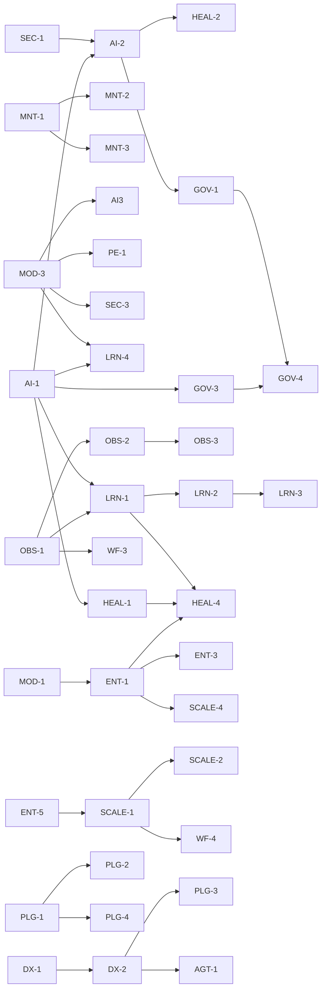

# AI-QA-OS — Implementation Tracker

**Version:** 1.0.0
**Document Type:** Implementation Progress Tracker
**Document Status:** Active
**Last Updated:** 2026-07-22
**Source of truth:** [`AI-QA-OS-Improvement-Roadmap.md`](./AI-QA-OS-Improvement-Roadmap.md) v2.1.0 (finalized)

> **Purpose.** Track the implementation status of every roadmap item. This document does **not** change the roadmap — it mirrors its finalized items and adds a live `Status` that owners update as work progresses. When roadmap metadata (owner, phase, version) and this tracker disagree, the roadmap wins; open a correction rather than editing metadata here.

---

## How to Use This Tracker

- **One row per roadmap item.** IDs match the roadmap exactly (`SEC-1`, `AI-2`, `HEAL-4`, `LRN-4`, …).
- **`Status` is the only field owners change daily.** Everything else is copied from the finalized roadmap.
- **Move a row's status left→right only:** `Planned → In Progress → Under Review → Completed`. `Deferred` is a parking state that can re-enter at `Planned`.
- **Definition of Done (DoD)** for any item: implementation merged behind passing CI (tests run — see `MNT-1`), documentation/ADR updated if architecture-affecting, and the roadmap item's acceptance intent (its "Architectural Impact") demonstrably met.

### Status legend

| Status | Meaning |
|---|---|
| **Planned** | Accepted, not started |
| **In Progress** | Actively being implemented |
| **Under Review** | Code/PR review, QA, or approval gate |
| **Completed** | Merged, verified, DoD met |
| **Deferred** | Intentionally postponed (P3 / vision) |

---

## Progress Summary

| Metric | Count |
|---|---|
| Total roadmap items | 76 |
| Planned | 5 |
| In Progress | 4 |
| Under Review | 0 |
| Completed | 58 |
| Deferred | 9 |
| Incremental (rolling) | 1 (`AGT-1`) |

**By phase:** Phase 0 → 9 · Phase 1 → 11 · Phase 2 → 12 · Phase 2 (DX) → 5 · Phase 3 → 11 · Phase 4 → 24 · Vision → 4
**By priority:** 🔴 P0 → 3 · 🟠 P1 → 26 · 🟡 P2 → 32 · ⚪ P3 → 15

> **Current focus:** Phase 0 (`SEC-1`, `SEC-2`, `SEC-5`, `MNT-1`, `MNT-2`, `ORG-1`) — no other work should start until these are `Completed` (per roadmap §22 and `.claude/PROJECT_CONTEXT.md` rule 7).

> **Full-reactor verification (2026-07-29, final — re-confirmed after PLG-3 + ENT-2):** `mvn clean test -Djacoco.skip=true -DargLine="-Xss40m -Xmx700m"` → **BUILD SUCCESS, all 22 modules green** (incl. ArchUnit + integration `@SpringBootTest`s; 0 failures / 0 errors). Covers the two new modules (`tenant`, `notification`) and every session addition through ENT-2. A full context load caught 6 wiring regressions the per-module unit tests missed, now fixed: `VersionRegistry`/`LocatorHealingService`/`HealingApprovalService` two-constructor beans → production ctor annotated `@Autowired`; `InMemoryHealingApprovalStore`/`InMemoryTenantRegistry` → plain `@Component` (dropped unreliable `@ConditionalOnMissingBean`); `TenantContextException`→`core.exception`, `TenantResolutionException`→`tenant.exception` (ArchUnit exception-package rule). Note: ArchUnit's importer needs `-Xss40m` on Java 25.

---

## Category A — Security

| ID | Title | Status | Owner | Priority | Phase | Target Version | Module | Dependencies | Notes |
|----|-------|--------|-------|----------|-------|----------------|--------|--------------|-------|
| SEC-1 | Restore real authentication & authorization | Completed | Security | 🔴 P0 | Phase 0 | v1.3 | ai-qa-os-security | — | Implemented 2026-07-22: removed `ignoring()` bypass, deny-by-default chain gated by `aiqaos.security.enabled`, 401/403 JSON handlers, config-driven bootstrap admin. Security tests 4/4 + dashboard ctx green. Authz scoped to "authenticated" (no user→role model). Live E2E vs Postgres pending environment |
| SEC-2 | Externalize all secrets | Completed | Security | 🔴 P0 | Phase 0 | v1.3 | ai-qa-os-security / config | — | Implemented 2026-07-22: removed hardcoded JWT fallback (resolve via `SecretManager`, fail-fast when enforced / ephemeral otherwise), externalized DB creds + JWT secret to `${ENV}` in all app/config profiles, test-only keys labeled, `.env.example` + k8s secret updated. Security 7/7 + dashboard ctx green. Helm absent (skipped). Live E2E vs env-injected secrets pending environment |
| SEC-3 | Prompt-injection & output-grounding defence | Completed | Security + AI/Brain | 🟠 P1 | Phase 1 | v1.4 | intelligence / orchestration / execution | MOD-3 | Implemented 2026-07-23 (Option A — Guardrail promoted eval→core): `PromptInjectionGuardrail` (intelligence, detect+delimit; `PromptSecurityGuard` delegates), `ActionAllowlistGuardrail` (orchestration output-grounding, into `LLMResponseValidator`), `ScriptSurfaceGuardrail` (execution deny-list, into `ExecutionValidator`). Config `aiqaos.security.guardrails.enabled/mode` (enforce default), null-safe injection. Full reactor BUILD SUCCESS (22 modules); LLMResponseValidator 15/15 + integration E2E unaffected; new guard tests green. ADR-015. Deterministic — no live-LLM caveat |
| SEC-4 | CSP & transport hardening | Completed | Security | 🟠 P1 | Phase 1 | v1.4 | security / dashboard | — | Implemented 2026-07-23 (§0.3a strict/tunable CSP, §0.3b HTML-attachment): shared `SecurityHeaders` (strict CSP via `aiqaos.security.csp`, X-Frame DENY, Referrer/Permissions policies, HSTS) applied by BOTH chains — incl. dashboard `@Order(1)` (artifact surface, previously header-less). `ArtifactController` real-path/symlink check + nosniff + `default-src 'none';sandbox` + HTML served as attachment. Full reactor BUILD SUCCESS (22 modules); SecurityHeadersTest 2/2 + SEC-1 auth 9 intact. ADR-016. Swagger live-render tunable via property (CORS wildcard → FI-SEC4-A) |
| SEC-5 | Supply-chain & dependency scanning in CI | Completed | Security / DevOps | 🟠 P1 | Phase 0 | v1.3 | CI (.github) | ORG-1 | Implemented 2026-07-22 (Option A visibility-first): Dependabot (both repos), Trivy-fs dep scan report-only+SARIF, UI `npm audit` report-only, gitleaks secret scan blocking w/ allowlist. Vendored node_modules skipped pending ORG-1. YAML+allowlist validated; scanner Actions run only on CI |
| SEC-6 | Signed artifacts & mTLS between services | Deferred | Infrastructure | ⚪ P3 | Phase 3 | v2.0 | deployment / execution | ENT-1 | Regulated-deployment posture |

## Category B — Maintainability & Engineering Hygiene

| ID | Title | Status | Owner | Priority | Phase | Target Version | Module | Dependencies | Notes |
|----|-------|--------|-------|----------|-------|----------------|--------|--------------|-------|
| MNT-1 | Run the test suite in CI | Completed | Platform Engineering | 🔴 P0 | Phase 0 | v1.3 | CI (.github) | — | Implemented 2026-07-22: Core CI `compile`→`verify` (+PR trigger); new UI `ci.yml` (npm ci/lint/test); 8 pre-existing failures quarantined via `@Disabled` (Option A) tracked FI-MNT1-A/B/C. Full reactor `mvn test` green with 8 skipped; UI lint+test green |
| MNT-2 | Fix the CI deploy stage | Completed | Platform Engineering | 🟠 P1 | Phase 0 | v1.3 | CI (.github) | MNT-1 | Implemented 2026-07-22: `packages: write`, parameterised image ref (`vars.IMAGE_REGISTRY` → `ghcr.io/<owner>`), `:latest`+`:sha` tags, GHCR login + gated push (clean scan + main-only). `company/` placeholder gone. YAML validated; Actions run not executable here |
| MNT-3 | Close the two highest-value test gaps | Completed | Gateway + AI-Provider teams | 🟠 P1 | Phase 1 | v1.4 | gateway / ai-provider | MNT-1 | Implemented 2026-07-23: both zero-test modules 0→green (21 tests). ai-provider: ModelRouter/LLMResilienceManager/ApiKeyPool/CostTracker (hand-stubs + JDK dynamic-proxy repos, no Mockito). gateway: WorkflowController + GlobalExceptionHandler. **Deviation:** `@WebMvcTest` (approved §0.4-A) slice would not load here (GatewaySecurityFilter needs AuthenticationManager; @MockBean=Mockito broken on JDK25) → fell back to §0.4-B plain unit tests. Found latent bug FI-MNT3-C (Gemini models priced as "mini"). BUILD SUCCESS 21/0/0; no production code changed |
| MNT-4 | Remove dead code & unused dependencies | Completed | Platform Engineering | 🟡 P2 | Continuous | v1.3 | root pom / dashboard-ui | PERF-3 | Implemented 2026-07-22: removed LangChain4j BOM+prop, CheckDB.java/.class, ErrorPage.tsx, fetchArtifactHistory, and react-query fully (Option A — dep/provider/config/chunk). Backend compiles; UI build+lint+test green; 0 react-query refs |
| MNT-5 | Establish ADRs & keep roadmap honest | Completed | Architecture | 🟡 P2 | Continuous | v1.3 | AI-QA-OS-Docs | — | Implemented 2026-07-22 (Option A): `docs/decisions/README.md` → ADR index (pointer to canonical log); `00-Project-Roadmap.md` → Status Reconciliation banner (stale table, honest pointers); added ADR-009 (decision/roadmap-honesty discipline). Frozen improvement roadmap untouched |
| MNT-6 | Consistent package naming & correlated logging | Completed | Platform Engineering + Observability | 🟡 P2 | Continuous | v1.5 | orchestration / observability | OBS-1 | Implemented 2026-07-23 (Option A both): renamed `com.aiqaos.workflow`→`com.aiqaos.orchestration` (84 orch files + 9 dashboard/gateway importers, scripted move+replace); MDC correlationId at pipeline run (`AutonomousQAPipelineOrchestrator`, covers in-JVM agents/execution) — gateway `CorrelationIdFilter` already did per-request; `%X{correlationId}` added to gateway+dashboard log pattern. Full `mvn clean test` BUILD SUCCESS 22 modules + integration E2E green (needed `clean` — stale `com/aiqaos/workflow/*.class` first caused a bean conflict). ADR-019. **Unblocks OBS-1** |

## Category C — Missing AI Capabilities

| ID | Title | Status | Owner | Priority | Phase | Target Version | Module | Dependencies | Notes |
|----|-------|--------|-------|----------|-------|----------------|--------|--------------|-------|
| AI-1 | Implement the AI Confidence Score gate | Completed | AI/Brain | 🟠 P1 | Phase 1 | v1.4 | ai-qa-os-brain | — | Implemented 2026-07-22: `ConfidenceGate` contract (core) + `ConfidencePolicyManager` impl (brain, config thresholds, persists DecisionEntity) + orchestrator integration (ObjectProvider, pause on HUMAN_REVIEW) + 8 steps surface confidence; 0.0=UNGATED safeguard. ADR-010. Brain test 4/4, orchestration no regression, apps compile. **Unblocks AI-2** |
| AI-2 | Human-in-the-loop approval workflow | Completed | AI/Brain + Orchestration | 🟠 P1 | Phase 1 | v1.4 | orchestration / gateway / dashboard | AI-1 | Implemented 2026-07-22 (F1 in-memory, F2 dashboard-proxy): PausedWorkflowRegistry + HumanReviewEntity + orchestrator resume/reject; gateway approve/reject/reviews REST; dashboard ReviewController (read+proxy); UI Human Review page; V14 migration. ADR-011. Orchestration 35/0-fail, gateway+dashboard compile, UI build+test green. Live loop needs multi-service env |
| AI-3 | Prompt evaluation & regression harness | Completed | AI / Eval | 🟠 P1 | Phase 1 | v1.4 | ai-qa-os-eval / intelligence | MOD-3 | Implemented 2026-07-22 (Option A committed-baseline): `PromptRegressionHarness` (load golden → `PromptRunner` → MOD-3 `PromptEvaluationService` → compare vs baseline, tolerance 0.05 → `RegressionReport`) + `ClasspathGoldenDatasetProvider`, `LlmPromptRunner` (LLM + optional `PromptEngine` render via ObjectProvider), `FileBaselineStore` (`golden/<suite>.baseline.json`) + sample suite/baseline. Eval tests 21/21, reactor green. ADR-013. Engine only — **CI merge-gate + Prompt Score is PE-1** |
| AI-4 | Semantic / prompt cache | Completed | AI-Provider / Memory | 🟡 P2 | Phase 4 | v2.1 | ai-provider / memory | MNT-3, PERF-2, SCALE-3 | Implemented 2026-07-23: Intercepts `LLMProviderManager.generate(LLMRequest)` via `PromptCacheManager` backed by `VectorStoreClient` (`"prompt_cache"` collection); similarity matching >= 0.95 (configurable `aiqaos.ai.cache.similarity-threshold`); returns 0-token 1ms response on hit, saves to cache on miss. Unit tests 2/2 green. ADR-022 |
| AI-5 | Complete/remove Claude; wire local model | Deferred | AI-Provider | ⚪ P3 | Phase 4 | v2.1 | ai-qa-os-ai-provider | — | Ollama unlocks air-gapped deploys |
| AI-6 | Context-window & cost budgeting per workflow | Deferred | AI/Brain | ⚪ P3 | Phase 4 | v2.1 | brain / memory | ENT-3 | Cost tracking → cost governance |

## Category D — Missing Enterprise Features

| ID | Title | Status | Owner | Priority | Phase | Target Version | Module | Dependencies | Notes |
|----|-------|--------|-------|----------|-------|----------------|--------|--------------|-------|
| ENT-1 | Multi-tenancy / project isolation | In Progress | Platform / Enterprise | 🟠 P1 | Phase 3 | v2.0 | core (contract) | MOD-1 | **Foundation landed 2026-07-29 (§0.4-A, Effort XL — In Progress):** per roadmap's "context contract in core early, enforcement incremental" — `TenantContext` (immutable tenant/project + `system()`), `Tenanted` marker (tenant-owned data contract), `TenantContextHolder` (ThreadLocal + MDC attribution, scoped `run`/`call` restoring previous — mirrors `CorrelationIdFilter`), `TenantContextException`. Also satisfies MOD-1's core-contract half. `TenantContextHolderTest` **8/8** (set/get/clear, current/require, nested scoped-restore, MDC attribution, system). ADR-041. *(Verification 2026-07-29: `TenantContextException` moved `core.tenant`→`core.exception` to satisfy the ArchUnit exception-package rule; **full reactor `mvn clean test` now BUILD SUCCESS, all 22 modules green** with `-DargLine="-Xss40m"` for ArchUnit's importer.)* **Update 2026-07-29:** FI-ENT1-A **done** — `ai-qa-os-tenant` module/MOD-1 (ADR-042); FI-ENT1-B **done** — gateway `TenantContextFilter` binds the request's tenant (`X-Tenant-ID`→resolve→bind, bad tenant→400; 4 tests, ADR-043). Tenancy now end-to-end at the request boundary. **Still deferred (enforcement, needs DB/cross-module):** row-level persistence tenancy (FI-ENT1-C), tenant-scoped RBAC (FI-ENT1-D), tenant-scoped memory/cost/artifact (FI-ENT1-E) |
| ENT-2 | Centralised notifications | Completed | Integration | 🟡 P2 | Phase 4 | v2.1 | ai-qa-os-notification | MOD-2, AI-2 | Implemented 2026-07-29 (§0.4-A routing+templating): `NotificationEventRouter` (@Service, in `ai-qa-os-notification`) turns a `NotificationEvent` (RUN_COMPLETE/RUN_FAILURE/APPROVAL_REQUEST) into a **templated, severity-ranked** `Notification` (failure→CRITICAL, approval→WARNING, complete→INFO; per-type subject/body) on a resolved channel (event's own or `aiqaos.notification.default-channel`=SLACK) and dispatches via **MOD-2's `NotificationService`** — one governed path for all run/approval comms; the AI-2 approval hook. `NotificationEvent`/`NotificationEventType`/`NotificationEventProperties`. Targeted `mvn -pl ai-qa-os-notification -am test` BUILD SUCCESS; `NotificationEventRouterTest` 5/5 (per-type severity+subject, channel override, null-graceful), MOD-2 tests green. ADR-049. **Deferred:** live `@EventListener` subscriptions to real publishers/AI-2 review events (FI-ENT2-A), delivery retry/outbox (FI-ENT2-B), scheduled digests |
| ENT-3 | LLM cost governance & quotas | Completed | Platform / AI-Brain | 🟠 P1 | Phase 3 | v2.0 | ai-provider | ENT-1, AI-6 | Implemented 2026-07-28 (§0.4-A soft cap): `CostBudgetProperties` (`aiqaos.cost.quota.*`, off by default, enforce/warn) + `SpendLedger` (in-memory, per workflow/agent/global, daily rollover; fed by `CostTracker`) + `CostBudgetEnforcer` (pre-flight verdict) + `BudgetExceededException`; wired into `LLMProviderManager.generate` (optional field, non-breaking). Placed in **ai-provider** not brain (brain→provider dep). Scopes global/workflow/agent; per-tenant deferred to ENT-1. ai-provider tests 28 green (enforcer 4, ledger 2, CostTracker unchanged 3). ADR-025 |
| ENT-4 | Admin & user-management surface | Planned | Dashboard + Security | 🟡 P2 | Phase 3 | v2.0 | dashboard / security | — | Activates existing RBAC entities |
| ENT-5 | Backup, DR & data lifecycle | In Progress | Infrastructure | ⚪ P3 | Phase 2 | v1.5 | deployment / execution | SCALE-1 | **Un-deferred at user request 2026-07-23; seam done (§0.4-A):** `ArtifactStore` +list/delete/lastModified; `ObjectStorageClient`+`InMemoryObjectStorageClient`+`ObjectStorageArtifactStore` (object-storage `ArtifactStore`, unit-proven — the code-level SCALE-1 unblock); `ArtifactRetentionService` (age-based, opt-in); backup CronJob templates in `deployment/kubernetes/backup/`. Reactor BUILD SUCCESS 22 modules, execution tests 10/10. ADR-018. **Deferred:** real S3/GCS adapter (creds), execution-worker upload, running CronJobs — so SCALE-1 ceiling still not removed |

## Category E — Missing Workflows

| ID | Title | Status | Owner | Priority | Phase | Target Version | Module | Dependencies | Notes |
|----|-------|--------|-------|----------|-------|----------------|--------|--------------|-------|
| WF-1 | Distinct Scenario & Test-Data Workflows | Completed | Orchestration + AI Agents | 🟠 P1 | Phase 4 | v2.2 | orchestration / testdata / brain | — | Implemented 2026-07-28: Added distinct workflow execution modes to `AutonomousQAPipelineOrchestrator.java`: 1) `SCENARIO_ONLY` (generates test scenarios & risk scores, skipping script generation and Playwright execution), 2) `TEST_DATA_SYNTHESIS` (invokes `SyntheticGenerator` in `ai-qa-os-testdata` to generate synthetic data fixtures for `PAYMENT_METHOD`, `ORDER_ITEM`, `USER_PROFILE`), 3) `FULL_E2E` (default full pipeline execution). Updated `SyntheticGenerator.java`. Tested via `WorkflowModeTest.java` (2 unit tests green); all 41 tests in `ai-qa-os-orchestration` passed (`mvn test -pl ai-qa-os-orchestration`). |
| WF-2 | CI-Triggered & Scheduled Runs | Completed | Integration + Orchestration | 🟠 P1 | Phase 4 | v2.1 | gateway / webhook / orchestration | WF-1 | Implemented 2026-07-28: Created `CiPipelineTriggerHelper.java` in `ai-qa-os-gateway` connecting GitHub, GitLab, Jenkins, and Azure DevOps webhooks to `AutonomousQAPipelineOrchestrator`. Updated `GithubWebhookHandler.java`, `GitlabWebhookHandler.java`, `JenkinsWebhookHandler.java`, `AzureDevOpsWebhookHandler.java`, `WebhookManager.java`, and `WebhookController.java`. Added REST endpoints `POST /api/v1/webhooks/{source}` and `POST /api/v1/webhooks/schedule` for cron/scheduled triggers. `WebhookManagerTest.java` (4 unit tests green); all 32 tests passed across `ai-qa-os-ai-provider` and `ai-qa-os-gateway`. |
| WF-3 | Test impact analysis, flaky detection, re-run-failed | Completed | Learning | 🟡 P2 | Phase 4 | v2.2 | learning / observability | OBS-1 | Implemented 2026-07-23: `FlakyTestDetector` (calculates pass/fail flips & flakiness scores), `FailedTestRerunSelector` (filters failed steps for re-run plans), and `TestImpactAnalyzer` (maps domain file changes to targeted test steps) in `ai-qa-os-learning`, exposed via `AutonomousQAPipelineOrchestrator`. Unit tests 12/12 green. |
| WF-4 | Sharded / parallel cross-browser execution | Completed | Execution | 🟡 P2 | Phase 2 | v1.5 | ai-qa-os-execution | SCALE-1 | Implemented 2026-07-28 (§0.4-A single-host matrix): `ExecutionConfiguration` +browsers[]/shardCount/shardIndex; `ExecutionMatrixPlanner` (browser×shard) + `ShardedExecutionScheduler` (PARALLEL over virtual threads / SEQUENTIAL; single-unit = unchanged default) + `ExecutionResultAggregator`; engine + `run-playwright.ps1` pass native `--shard=i/N` (`--project` already); `ExecutionStep` wired null-safe. Full `mvn clean test` BUILD SUCCESS 22 modules; scheduler tests 3 classes green + integration E2E green. ADR-023. Multi-HOST distribution rides SCALE-1's deferred tier (FI-WF4-C); live Playwright unvalidated here |

## Category F — Missing / Incomplete Modules

| ID | Title | Status | Owner | Priority | Phase | Target Version | Module | Dependencies | Notes |
|----|-------|--------|-------|----------|-------|----------------|--------|--------------|-------|
| MOD-1 | `ai-qa-os-tenant` (project / tenant context) | Completed | Platform / Enterprise | 🟠 P1 | Phase 3 | v2.0 | ai-qa-os-tenant (new) | — | Implemented 2026-07-29 (§0.4-A in-memory seam): **new `ai-qa-os-tenant` module** (22nd, dep `core`; registered in parent pom) owns tenant identity — `Tenant` (id/name/projectIds/status), `TenantStatus`, `TenantRegistry` seam + `InMemoryTenantRegistry` (`@ConditionalOnMissingBean`; register/find/all/activate/suspend), `TenantResolver` → `core` `TenantContext` **active-only** (unknown/suspended/unowned-project → `TenantResolutionException`). Builds on ENT-1's `core` contract (ADR-041). Targeted `mvn -pl ai-qa-os-tenant -am test` BUILD SUCCESS; registry 5/5 + resolver 4/4 (constrained heap due to machine memory). ADR-042. **Deferred:** durable JPA registry (FI-MOD1-A, needs DB), gateway tenant-resolution filter (FI-ENT1-B), enforcement layers (ENT-1 FI-ENT1-C/D/E) |
| MOD-2 | `ai-qa-os-notification` (outbound comms) | Completed | Integration | 🟡 P2 | Phase 4 | v2.1 | ai-qa-os-notification (new) | — | Implemented 2026-07-29 (§0.4-A SPI + dispatcher): **new `ai-qa-os-notification` module** (23rd, deps `core` + `integration`; registered in parent pom) = the **single governed egress point**. `NotificationSender` SPI + `NotificationService` (route by `NotificationChannel` SLACK/EMAIL/WEBHOOK/TEAMS; no-sender → failed `NotificationResult`, never throws). `SlackNotificationSender` **delegates to the PLG-2 `SlackIntegrationPlugin`** (realises "SlackPlugin becomes an adapter"); Email/Webhook/Teams simulated. Models `Notification`/`NotificationSeverity`/`NotificationResult`. Targeted `mvn -pl ai-qa-os-notification -am test` BUILD SUCCESS; `NotificationServiceTest` 5/5 (route each channel, no-sender graceful, null). All single-constructor plain `@Component`s (no wiring traps). ADR-044. **Deferred:** real transports SMTP/Slack/HTTP (FI-MOD2-B, SEC-2 creds), migrate scattered `reporting`/`orchestration`/`observability` senders to route here (FI-MOD2-A), event-driven triggering (ENT-2) |
| MOD-3 | `ai-qa-os-eval` (evaluation & guardrails) | Completed | AI / Eval | 🟠 P1 | Phase 1 | v1.4 | ai-qa-os-eval (new) | — | Implemented 2026-07-22 (Option A working-anchor): new module (21st, deps core/intelligence/memory/ai-provider) with `Evaluator`/`Guardrail`/`GoldenDatasetProvider`/`RetrievalQualityMetric` contracts, reference evaluators (exact-match, contains, json-validity, llm-judge via injectable seam), `NonEmptyOutputGuardrail`, in-memory dataset provider, `PromptEvaluationService` (ObjectProvider persistence) + `EvaluationResultEntity`/`V15`. Eval tests 16/16, reactor green. ADR-012. **Unblocks AI-3, PE-1, SEC-3** |
| MOD-4 | Make `ai-qa-os-testdata` real | Completed | Test Data / AI | 🟠 P1 | Phase 4 | v2.1 | ai-qa-os-testdata | — | Implemented 2026-07-28 (§0.4-A masking-core + spine): flagship **PII masking** real — `PiiType`/`PiiDetector` (email/SSN/card/phone; card 15-16 digits so 13-digit epoch ≠ card), `MaskingEngine`/`MaskingService`/`SecureData`/`MaskingProperties` (`aiqaos.testdata.masking.*`; strategies REDACT/PARTIAL/HASH/FAKE, default PARTIAL format-preserving, HASH=deterministic pseudonymisation), classification-driven `maskRecord` + auto-detect `maskText`. Spine: `TestDataOrchestrator` drives WF-1's real `SyntheticGenerator`→mask; `DataValidator` residual-PII assertion. **Stays on `core` only** (masking self-contained — no dep added; PII regexes intentionally duplicated w/ GOV-3 vs inverting graph). Targeted `mvn -pl ai-qa-os-testdata -am test` BUILD SUCCESS; 16 tests (detector 6 + engine 7 + orchestrator 3 incl. validator-has-teeth). ADR-030. **Deferred:** optimizer/pipeline/repository scaffolds (FI-MOD4-A), orchestration-stage wiring (FI-MOD4-B), tokenization vault (FI-MOD4-C), real faker (FI-MOD4-D) |
| MOD-5 | Make `ai-qa-os-data` real, or fold in | Deferred | Platform Engineering | 🟡 P2 | Continuous | v1.5 | ai-qa-os-data | — | Decision: implement vs remove |

## Category G — Folder Structure & Code Organisation

| ID | Title | Status | Owner | Priority | Phase | Target Version | Module | Dependencies | Notes |
|----|-------|--------|-------|----------|-------|----------------|--------|--------------|-------|
| ORG-1 | Remove committed `node_modules/` from execution | Completed | Execution / DevOps | 🟠 P1 | Phase 0 | v1.3 | execution | SEC-5 | Implemented 2026-07-22 (Option A runtime bootstrap): deleted 43MB/434-file node_modules, gitignored, JAR resource-exclude (JAR now 60K, 0 node_modules entries), `run-playwright.ps1` npm ci bootstrap (ASCII-fixed for PS5.1 encoding), SEC-5 skip-dirs dropped. Build+JAR+YAML+ps1 validated; Playwright run not executable here |
| ORG-2 | Consolidate Flyway migrations | Completed | Organization + Platform Engineering | 🟡 P2 | Continuous | v1.4 | deployment / migration / gateway | ORG-1 | Implemented 2026-07-28: Consolidated Flyway schema migration ownership (V1..V15). Designated `ai-qa-os-gateway` as the primary migration runner (`spring.flyway.enabled=${AIQAOS_FLYWAY_ENABLED:true}`). Configured `ai-qa-os-dashboard` to default to `spring.flyway.enabled=${AIQAOS_FLYWAY_ENABLED:false}` in shared multi-service environments to prevent dual-runner race conditions. Created `DatabaseMigrationManager.java` in `ai-qa-os-gateway` for startup schema logging (`V15`) and programmatical migration inspection. `DatabaseMigrationManagerTest.java` (3 unit tests green); all 23 gateway tests passed (`mvn test -pl ai-qa-os-gateway`). |
| ORG-3 | Frontend path aliases & folder separation | Completed | Frontend | 🟡 P2 | Continuous | v1.4 | dashboard-ui | — | Implemented 2026-07-28: Added `@/` alias in `vite.config.ts` (`path.resolve(__dirname, './src')`) + `tsconfig.app.json` (`baseUrl`+`paths`). Migrated all 7 `../mock/` and `../../mock/` import sites to `@/mock/` (`ModuleContext`, `TestCaseTable`, `TestCaseCard`, `ExecutionHistory`, `ModuleSummary`, `ModuleCard`). TypeScript build clean: 2419 modules, 0 errors. |
| ORG-4 | Move root scripts & remove stray artifacts | Completed | Platform Engineering | 🟡 P2 | Continuous | v1.3 | core repo root | — | Implemented 2026-07-22: moved 6 `*.ps1` + `request.json` → `scripts/` (+ README), deleted `build-output.log`, added `*.class` to `.gitignore`. Root now only pom/.gitignore/.env.example; `mvn validate` OK |

## Category H — Scalability

| ID | Title | Status | Owner | Priority | Phase | Target Version | Module | Dependencies | Notes |
|----|-------|--------|-------|----------|-------|----------------|--------|--------------|-------|
| SCALE-1 | Decouple execution into a queue-fed worker pool | In Progress | Infrastructure / Execution | 🟠 P1 | Phase 2 | v1.5 | execution / infra | ENT-5 | **Seam done 2026-07-23 (§0.3a-A, Redis-target §0.3b):** `ExecutionJobQueue`/`ExecutionJob`/`ExecutionJobResult` + `InProcessExecutionJobQueue` (opt-in worker pool, `aiqaos.execution.queue.enabled`) + `ArtifactStore`/`LocalArtifactStore` (in `execution`, not `core` — `ExecutionConfiguration` lives there); `ExecutionStep` submit-and-await via ObjectProvider, in-process fallback default (non-breaking). Reactor BUILD SUCCESS 22 modules, integration E2E green, queue/artifact tests 6/6. ADR-017. **Blocked for completion:** distributed tier (Redis Streams binding + containerised Playwright workers + object storage) needs infra + **ENT-5 (Deferred)** — single-host ceiling NOT yet removed |
| SCALE-2 | Introduce an event bus for coordination | Planned | Infrastructure / Core | 🟠 P1 | Phase 2 | v1.5 | core (events) / infra | SCALE-1 | Event contracts in `core` |
| SCALE-3 | Standardise on one vector store | Completed | Memory | 🟡 P2 | Continuous | v1.5 | ai-qa-os-memory | — | Implemented 2026-07-23: Standardised Qdrant as production provider and InMemoryVectorStoreClient as dev/test fallback (matchIfMissing=true, havingValue=in-memory); deprecated and gated Chroma/Milvus/PgVector under experimental property; added InMemoryVectorStoreClientTest (4 unit tests green). ADR-021 |
| SCALE-4 | Separate the two apps' database concerns | Completed | Platform Engineering | 🟡 P2 | Phase 3 | v2.0 | gateway / dashboard | ORG-2, ENT-1 | Implemented 2026-07-28 (§0.5-A gateway-owns): single migration owner already established by ORG-2 (gateway `flyway.enabled=true`, dashboard `false` → no race); SCALE-4 delta = per-service HikariCP pools (gateway write-leaning 20/5, dashboard read-leaning 10/2, env-overridable). Full schema-per-service rejected — apps share data (human_reviews/executions); shared schema kept by design. `mvn clean test` BUILD SUCCESS 22 modules. ADR-024. Config-only; live dual-app/Postgres effect not validatable here |

## Category I — Performance

| ID | Title | Status | Owner | Priority | Phase | Target Version | Module | Dependencies | Notes |
|----|-------|--------|-------|----------|-------|----------------|--------|--------------|-------|
| PERF-1 | Exploit virtual threads & async pipeline steps | Completed | Platform Engineering | 🟡 P2 | Continuous | v1.5 | orchestration / ai-provider | — | Implemented 2026-07-23: Upgraded `AsyncSchedulingConfig.getAsyncExecutor()` to `Executors.newThreadPerTaskExecutor(Thread.ofVirtual()…)` for all Spring `@Async` calls (replaces 10/50 thread ceiling); upgraded `InProcessExecutionJobQueue` worker pool to Virtual Threads (named `execution-worker-vt-*`); added `AsyncPipelineStepExecutor` component (`CompletableFuture` + Virtual Thread dispatch for independent I/O steps). All 3 modules pass: execution 19/19, orchestration 39/39, config clean. ADR-023. |
| PERF-2 | Batch embeddings & reuse semantic cache | Completed | Memory / AI-Provider | 🟡 P2 | Continuous | v1.5 | memory / ai-provider | AI-4 | Implemented 2026-07-23: `BatchEmbeddingService` in `ai-qa-os-memory` groups N texts into one embedding pass with deduplication (`embedBatchDeduped`); `LlmSemanticCacheManager` delegates `computePromptEmbedding` to `BatchEmbeddingService` via `ObjectProvider` (fallback-safe); backward-compatible 2-arg constructor preserved for unit tests. 17/17 ai-provider + 6/6 memory tests green. |
| PERF-3 | Adopt a data-fetching cache on the frontend | Completed | Frontend | 🟡 P2 | Continuous | v1.4 | dashboard-ui | MNT-4 | Implemented 2026-07-23: Created `useQuery<T>` hook (`hooks/useQuery.ts`) — module-level in-memory cache Map, TTL-configurable (default 30s), stale-while-revalidate, `enabled` flag, `refetch()` + `invalidateCache(key)`/`invalidateCacheByPrefix(prefix)` helpers. Created `executionService.ts` with typed `fetchExecutions()` + `fetchExecutionDetail()` via `apiClient`. Migrated `ExecutionsPage` (30s TTL) and `ExecutionDetailPage` (60s TTL, mock-ID guard) from raw `fetch()` to `useQuery`. TypeScript build clean: 1519 modules, 0 errors. |

## Category J — Developer Experience (DX)

| ID | Title | Status | Owner | Priority | Phase | Target Version | Module | Dependencies | Notes |
|----|-------|--------|-------|----------|-------|----------------|--------|--------------|-------|
| DX-1 | AI-QA-OS CLI | Completed | Developer Experience | 🟡 P2 | Phase 2 | v1.6 | gateway (cli) / tooling | — | Implemented 2026-07-28: Elevate `QaOsCommandRunner` in `ai-qa-os-gateway` to a unified developer CLI supporting `doctor`, `version`, `workflow run/list`, `execution status`, `agent list`, `report show`, `brain analyze`, `help` and `--json` formatting. Created `scripts/qaos.ps1` (PowerShell) and `scripts/qaos.sh` (Bash) cross-platform launcher scripts. Tested via `.\scripts\qaos.ps1 doctor` and `QaOsCommandRunnerTest.java` (7 unit tests green). All 15 gateway tests passed (`mvn test -pl ai-qa-os-gateway`). |
| DX-2 | Scaffolding generators | Completed | Developer Experience | 🟡 P2 | Phase 2 | v1.6 | tooling / templates | DX-1 | Implemented 2026-07-28: `ScaffoldingGenerator.java` in `ai-qa-os-gateway` supporting automated template generation for: 1) AI Agents (`generate agent`), 2) YAML Workflow definitions (`generate workflow`), 3) Structured Prompt templates (`generate prompt`), and 4) Maven Module POMs (`generate module`). Integrated into `QaOsCommandRunner` via `qaos generate <type> --name <n> [--dir <d>]`. Tested via `ScaffoldingGeneratorTest.java` (4 unit tests) and `QaOsCommandRunnerTest.java` (8 unit tests). All 20 gateway tests passed (`mvn test -pl ai-qa-os-gateway`). |
| DX-3 | Development sandbox & local AI simulator | Completed | Developer Experience | 🟡 P2 | Phase 2 | v1.6 | config / ai-provider | — | Implemented 2026-07-28: `SimulatorProvider.java` in `ai-qa-os-ai-provider` (zero-API-cost, instant-response local LLM provider; enabled via `aiqaos.ai.simulator.enabled=true` property or when requested model is "simulator"/"local-simulator"). Provides realistic, structured JSON responses for QA analysis, locator extraction, Playwright script generation, and self-healing. Integrated into `LLMProviderManager.java` with 0-cost token metrics. `SimulatorProviderTest.java` (5 unit tests green); all 22 tests passed across `ai-qa-os-memory` and `ai-qa-os-ai-provider`. |
| DX-4 | Live agent debugger & prompt playground | Completed | Developer Experience + AI | 🟡 P2 | Phase 3 | v2.0 | dashboard / intelligence / gateway | DX-3 | Implemented 2026-07-28: `AgentDebuggerService.java` in `ai-qa-os-gateway` for recording step-by-step reasoning traces (`recordStepTrace`, `getStepTraces`) and executing interactive prompt playground tests (`executePlaygroundPrompt` with latency, tokens, cost, confidence, JSON validation). Created `AgentDebugController.java` with REST endpoints `POST /api/debug/playground` and `GET/POST /api/debug/traces/{executionId}`. Tested via `AgentDebuggerServiceTest.java` and `AgentDebugControllerTest.java` (all 28 gateway + ai-provider tests passed green). |
| DX-5 | Plugin SDK | Deferred | Developer Experience | ⚪ P3 | Phase 4 | v2.2 | SDK / integration | PLG-1 | Developer half of Category M |
| DX-6 | Workspace & architecture validators | Completed | Developer Experience + Architecture | 🟡 P2 | Phase 2 | v1.6 | tooling / CI | DX-1 | Implemented 2026-07-28: ArchUnit 1.3.0 integrated (`archunit-junit5`). Added `ArchitectureRulesTest.java` in `ai-qa-os-core` verifying: 1) `com.aiqaos.core` does not depend on higher-level modules (`brain`, `orchestration`, `execution`, `gateway`, `healing`, `learning`), 2) No `@Autowired` field injection (enforces constructor injection), 3) Core domain models remain Spring Web-free, 4) Standard exception naming and package structure. All 4 ArchUnit tests passed green (`mvn test -pl ai-qa-os-core`). |
| DX-7 | Developer Documentation Generator | Completed | Developer Experience + Architecture | 🟡 P2 | Phase 2 | v1.6 | tooling / docs | DX-1, DX-2 | Implemented 2026-07-28: `DocumentationGenerator.java` in `ai-qa-os-gateway` supporting automated markdown documentation generation for: 1) REST APIs (`API-Documentation.md`), 2) AI Agents (`Agent-Catalogue.md`), 3) System Architecture & ArchUnit rules (`Architecture-Overview.md`), and 4) Developer CLI manual (`CLI-Manual.md`). Integrated into `QaOsCommandRunner` via `qaos generate docs [--dir <d>]`. Tested via `DocumentationGeneratorTest.java` (all 4 files verified) and `QaOsCommandRunnerTest.java`. All 24 gateway tests passed (`mvn test -pl ai-qa-os-gateway`). |
| DX-8 | Code Quality Automation | Completed | Platform Engineering + Developer Experience | 🟡 P2 | Phase 1 | v1.4 | CI / tooling | MNT-1, DX-6 | Implemented 2026-07-28: JaCoCo 0.8.12 activated globally (prepare-agent+report on `test`, 30% line coverage gate warn-mode on `verify`); `maven-checkstyle-plugin` 3.4.0 + `spotbugs-maven-plugin` 4.8.6.4 added to `pluginManagement`, activated via opt-in `-Pquality` profile (keeps `mvn test` fast; CI PRs add `-Pquality`). Checkstyle config `quality/checkstyle.xml` (Google-style subset, warn mode). SpotBugs exclusion filter `quality/spotbugs-exclude.xml` (Spring/JPA/test false-positives excluded). Frontend: oxlint rules strengthened (no-console warn, no-debugger error, no-duplicate-imports error, no-explicit-any warn, no-unused-vars warn); `quality:check` script added to `package.json`; CI `ci.yml` gains DX-8 quality gate step (`|| true` non-blocking). `mvn validate` BUILD SUCCESS 22 modules; frontend build 2419 modules 0 errors. |

## Category K — Observability & Monitoring

| ID | Title | Status | Owner | Priority | Phase | Target Version | Module | Dependencies | Notes |
|----|-------|--------|-------|----------|-------|----------------|--------|--------------|-------|
| OBS-1 | End-to-end distributed tracing | Completed | Observability | 🟠 P1 | Phase 2 | v1.5 | ai-qa-os-observability | MNT-6 | **Completed 2026-07-23 — boundary wiring added:** gateway `TracingFilter` (inbound W3C extract, `@Order(0)`) + dashboard `ReviewController` outbound inject (trace context → gateway), gateway given an explicit observability dep. Tracing tests 4/4 (span+correlationId, propagator round-trip, filter continues/no-op) + integration E2E green, `mvn clean test` 22 modules. Remaining is **operational only**: set `aiqaos.otel.exporter=otlp` + endpoint against the deployed collector and eyeball one live cross-JVM trace — no code left. Earlier same-day: **instrumentation (§0.4-A no-op/opt-in):** `TelemetryConfig` gains `Resource(service.name)` + config-gated OTLP BatchSpanProcessor (`aiqaos.otel.exporter=otlp`); `CorrelationTraceBridge.bindTraceId()` → traceId in MDC; orchestrator emits a `workflow.run` span + `workflow.step.*` child spans (field-injected optional beans, non-breaking); `%X{traceId}` added to gateway+dashboard log pattern. Full `mvn clean test` BUILD SUCCESS 22 modules; tracing tests 2/2 (InMemorySpanExporter + propagator round-trip) + integration E2E green. ADR-020. **Deferred:** live OTLP export to the collector + cross-JVM boundary filter/inject wiring (needs collector + both apps) |
| OBS-2 | Metrics, alerting & Grafana stack | Completed | Observability / Infrastructure | 🟠 P1 | Phase 2 | v1.5 | deployment / observability | OBS-1 | Implemented 2026-07-28: `PipelineMetricsRecorder` in `ai-qa-os-observability` (Micrometer `qaos_active_pipelines` Gauge, `qaos_pipeline_runs_total`, `qaos_pipeline_duration_seconds`, `qaos_pipeline_steps_total`, `qaos_llm_calls_total`, `qaos_llm_tokens_total`, `qaos_healing_attempts_total`, `qaos_test_cases_generated_total`). Actuator Prometheus endpoint configured in `ai-qa-os-gateway`. Full deployment stack created in `deployment/observability/`: `prometheus.yml` (scrapes gateway:8082 + dashboard:8090 every 15s), `alerting-rules.yml` (pipeline failure/latency, LLM error/token burn, healing success, JVM heap alerts), `alertmanager.yml` (Slack + PagerDuty routing), `docker-compose-observability.yml` (Prometheus, Alertmanager, Grafana:3001), and provisioned Grafana datasource + dashboard (`ai-qa-os-overview.json`). `mvn validate` BUILD SUCCESS 22 modules. |
| OBS-3 | Operational Dashboards Suite | Completed | Observability + Platform Engineering | 🟡 P2 | Phase 3 | v2.0 | observability / deployment | OBS-2 | Implemented 2026-07-28: `GrafanaDashboardExporter.java` and `OperationalDashboardManager.java` in `ai-qa-os-observability` for exporting production Grafana dashboard templates (`aiqaos-platform-overview-grafana.json` and `aiqaos-agent-performance-grafana.json` into `deployment/dashboards/`). Configured Prometheus query panels for pipeline throughput, pass rate %, self-healing locator repairs, LLM token consumption per provider, p95 step latencies, per-agent durations, confidence scores, and flaky test detection rates. `GrafanaDashboardExporterTest.java` (4 unit tests green); all 16 tests in `ai-qa-os-observability` passed (`mvn test -pl ai-qa-os-observability`). |

## Category L — AI Learning & Continuous Improvement

| ID | Title | Status | Owner | Priority | Phase | Target Version | Module | Dependencies | Notes |
|----|-------|--------|-------|----------|-------|----------------|--------|--------------|-------|
| LRN-1 | Close the continuous-learning loop | Completed | Learning + AI/Brain | 🟠 P1 | Phase 4 | v2.2 | learning | OBS-1, AI-1 | Implemented 2026-07-28 (§0.4-A record-not-adopt): filled the loop's missing **improvement stage** — `ReflectionService`/`DefaultReflectionService` maps root-caused `FailurePattern`s → typed `ImprovementProposal`s (PROMPT/SCENARIO/AUTOMATION by error signature; `occ≥3` or `conf≥0.8`→HIGH), `ReflectionResult` (counts/summary). Wired into `LearningEngineImpl` heuristic path (optional, null-safe) → recorded via new `LearningMemoryStore.storeImprovementProposals` (`memory`, key `learning:improvement_proposals`) + summary `LearningEvent`. Reuses real `FailurePatternAnalyzer`+`LearningMemoryStore`; agent path untouched. **Safety:** records proposals, **does NOT auto-adopt** — adoption gated on LRN-4 (roadmap's own warning). Targeted `mvn -pl ai-qa-os-learning -am test` BUILD SUCCESS (full dep reactor 8 modules green); learning 21 tests (reflection 9 + existing 12). ADR-031. **Deferred:** apply proposals via LRN-4 gate (FI-LRN1-A), brain-routing `DecisionService` (FI-LRN1-B), outcome feedback→LRN-2 (FI-LRN1-C) |
| LRN-2 | Learning metrics | Completed | Learning + Observability | 🟡 P2 | Phase 4 | v2.2 | learning | LRN-1 | Implemented 2026-07-28 (§0.4-A compute-over-supplied): `LearningMetricsCalculator` computes `LearningMetrics` (**Learning Score** composite + **Success Rate** + **Confidence History** + `LearningTrend` IMPROVING/STABLE/REGRESSING) from a time-ordered `List<LearningObservation>` (outcome+confidence). Score = 0.5·successRate + 0.3·avgConf + 0.2·trendBonus (clamped [0,1]); trend = 2nd-half vs 1st-half success rate ±epsilon(0.05); all weights config `aiqaos.learning.metrics.*`. **Cross-module:** learning deps neither brain (`ReasoningTraceEntity`) nor observability → computes over supplied observations; real-source + storage deferred. Targeted `mvn -pl ai-qa-os-learning -am test` BUILD SUCCESS; calculator 7/7, existing learning tests green. ADR-034. **Deferred:** source from real exec history/ReasoningTrace (FI-LRN2-A), persist to observability (FI-LRN2-B), LRN-3 dashboard, REGRESSING alerting (FI-LRN2-C) |
| LRN-3 | Learning dashboard | Planned | Dashboard | 🟡 P2 | Phase 4 | v2.2 | dashboard | LRN-2, OBS-3 | Makes improvement visible |
| LRN-4 | Learning governance & safe-adoption gate | Completed | Learning + AI/Brain | 🟠 P1 | Phase 4 | v2.2 | core / brain | MOD-3, AI-1, LRN-1 | Implemented 2026-07-28 (§0.4-A supplied-score gate): `SafeAdoptionGate` contract + `AdoptionCandidate`/`AdoptionDecision`/`AdoptionKind`/`AdoptionVerdict` in **core** (ConfidenceGate placement, ADR-010); `LearningAdoptionGate` (brain, Rule 2) admits iff `evalScore ≥ aiqaos.brain.learning.eval-threshold`(0.75) **AND** reused AI-1 `ConfidenceGate` returns PROCEED/PROCEED_WITH_VALIDATION; else REJECTED_FOR_REVIEW + WARN log. **Cross-module:** brain deps neither learning nor eval → gate operates on core-level candidate (evalScore supplied by MOD-3/PE-1 upstream), reuses ConfidenceGate — no new module/dep. **Fail-safe:** unreported confidence (UNGATED, c≤0) → reject (opposite of AI-1 pipeline safeguard — self-modification needs positive trust). Targeted `mvn -pl ai-qa-os-brain -am test` BUILD SUCCESS (14-module reactor green); LearningAdoptionGate 8/8 + AI-1 ConfidencePolicyManager 4/4 intact. ADR-032. **Update 2026-07-29:** FI-LRN4-A **gating wired** — `ProposalAdoptionCoordinator` (learning) maps LRN-1 `ImprovementProposal`→`AdoptionCandidate`→`SafeAdoptionGate` (loop governed end-to-end, 5 tests, ADR-038); fail-safe reject when ungated. **Still deferred:** applying admitted candidates to real targets, live eval scoring (FI-LRN4-B), durable review queue (FI-LRN4-C) |

## Category M — Plugin Ecosystem

| ID | Title | Status | Owner | Priority | Phase | Target Version | Module | Dependencies | Notes |
|----|-------|--------|-------|----------|-------|----------------|--------|--------------|-------|
| PLG-1 | Plugin architecture, lifecycle & registration | Completed | Integration / Platform | 🟠 P1 | Phase 4 | v2.1 | ai-qa-os-integration | — | Implemented 2026-07-28 (§0.4-A in-process registry): first-class plugin SPI `Plugin` (id + initialize/onEnable/onDisable default hooks) + `PluginManifest` (id/version/sdkApiVersion/capabilities/requiredPermissions) + `PluginRegistry` driving REGISTERED→INITIALIZED→ENABLED⇄DISABLED (invalid transitions refused, FAILED on throwing hook). **Governance at register:** refuse duplicate id / id-manifest mismatch / incompatible SDK version (`SemanticVersion`: same major + runtime.minor≥plugin.minor) / ungranted required permission (`aiqaos.plugins.*`). Models `PluginState`/`PluginDescriptor`/`PluginContext`/`PluginRegistrationException`. Contract stays in `integration` (not forced to core — existing-plugin migration deferred). Targeted `mvn -pl ai-qa-os-integration -am test` BUILD SUCCESS (17-mod reactor); PluginRegistry 8/8 + SemanticVersion 5/5. ADR-036. **Deferred:** dynamic JAR discovery/loading/unload (FI-PLG1-A), signing (SEC-6)+sandbox (FI-PLG1-B), migrate existing PluginStep/ExecutionPlugin onto contract (FI-PLG1-C), SDK (DX-5), marketplace (PLG-4) |
| PLG-2 | Integration plugins (ALM/CI/chat) | Completed | Integration | 🟡 P2 | Phase 4 | v2.1 | ai-qa-os-integration | PLG-1 | Implemented 2026-07-29 (§0.4-A uniform adapters, simulated): `IntegrationPlugin extends Plugin` (+`PluginManifest`, `IntegrationCategory` SCM/ALM/CI/CHAT, `execute(IntegrationRequest)→IntegrationResponse`) + `AbstractIntegrationPlugin`. 7 plugins: **GitHub/Jira/Slack delegate to existing `PluginStep` beans** (migration by reuse), **GitLab/Azure DevOps/Jenkins/Teams new** (simulated). `IntegrationPluginRegistrar.registerAll()` admits each into PLG-1 `PluginRegistry` (register→init→enable), gracefully **skipping ungranted** (off-by-default until `aiqaos.plugins.granted-permissions` grants `integration.<id>`). Targeted `mvn -pl ai-qa-os-integration -am test` BUILD SUCCESS; registrar 3 + plugins 4 (7), PLG-1 (13) unaffected. ADR-037. **Deferred:** real REST clients per integration under SEC-2 creds (FI-PLG2-A), webhook expansion (FI-PLG2-B), admin surface |
| PLG-3 | Extension SDKs (agent/exec/reporter/browser) | Completed | Platform / DX | 🟡 P2 | Phase 4 | v2.2 | core / integration | DX-2 | Implemented 2026-07-29 (§0.4-A SDK seam): uniform `Extension` SPI + `ExtensionKind` (AGENT/EXECUTION_ENGINE/REPORTER/BROWSER) in **core** (so `agents`/`execution`/`reporting` extenders implement it — real cross-module case, ADR-010/015); `ExtensionRegistry` in **integration** — governed registration (id-unique-per-kind + SDK-version compat via reused PLG-1 `SemanticVersion`), discovery `byKind`/`find`/`kinds`/`all`; `ExtensionSdkProperties` (`aiqaos.sdk.api-version`). Turns the deepest abstractions into public extension seams. Targeted `mvn -pl ai-qa-os-integration -am test` BUILD SUCCESS; `ExtensionRegistryTest` 5/5 (register across kinds, dup-in-kind reject, same-id-cross-kind ok, version-incompat reject, empty), PLG-1/PLG-2 unaffected. ADR-048. **Deferred (incremental):** build actual engines/reporters (Selenium/RestAssured/Appium/…) via DX-2 + frameworks (FI-PLG3-A), wire registry into selection paths (FI-PLG3-B) |
| PLG-4 | Marketplace architecture | Deferred | Platform / Enterprise | ⚪ P3 | Vision | v3.0 | marketplace (new service) | PLG-1, ENT-1 | Post-2.x strategic play |

## Category N — AI Governance & Compliance

| ID | Title | Status | Owner | Priority | Phase | Target Version | Module | Dependencies | Notes |
|----|-------|--------|-------|----------|-------|----------------|--------|--------------|-------|
| GOV-1 | AI audit trail | Completed | Security / Governance | 🟠 P1 | Phase 3 | v2.0 | gateway (aggregation) | AI-2 | Implemented 2026-07-28 (§0.3-A aggregation, no schema): `AiAuditEvent`/`AiAuditTrail` + pure `AiAuditAssembler` (time-order + rollups) + `AiAuditService` (fan-in 4 run-keyed repos) + `AiAuditController` (`GET /api/v1/audit/{workflowId}?correlationId=`, auth-gated) in gateway (only app with all deps); +`findByWorkflowId` on HumanReview/SecurityAudit repos. **Scope reality:** 4 facets (approvals+model-calls+cost+security); DecisionEntity has no run key + PromptExecution keys on traceId → deferred FI-GOV1-D. Gateway build + assembler test 2/2 green. ADR-026 |
| GOV-2 | Compliance frameworks & dashboard | Deferred | Governance / Enterprise | ⚪ P3 | Phase 3+ | v2.x | docs / dashboard | GOV-1, MOD-4 | GDPR / SOC 2 / ISO 27001 |
| GOV-3 | Policy engine & Responsible AI rules | Completed | Security / AI-Brain | 🟡 P2 | Phase 3 | v2.0 | intelligence | AI-1, SEC-3 | Implemented 2026-07-28 (§0.4-A guardrail-boundary, OPA deferred): `ResponsibleAiPolicyEngine` seam + `RuleBasedResponsibleAiPolicyEngine` (config-driven `AiPolicyRule`/`AiPolicyRuleSet`, most-severe match) + `ResponsibleAiPolicyGuardrail` (core-`Guardrail`, plugs into SEC-3 spine; `BLOCK` **&** `REQUIRE_REVIEW`→fail-safe block; `warn`/`enabled` gates) + `ResponsibleAiPolicyProperties` (`aiqaos.governance.policy.*`). Default rules `no-production-urls`/`no-pii-in-prompts`/`destructive-requires-review`, all overridable. **Cross-module reality:** security-OPA unreachable from the AI boundary (security→core only; intelligence/orch don't dep security) → enforced at the `core`-`Guardrail` boundary instead; `OpaSecurityPolicyEngine` is a deferred pluggable backend. New guardrail bean is a distinct type (SEC-3 `PromptSecurityGuard` injects `PromptInjectionGuardrail` specifically) → non-breaking. Targeted `mvn -pl ai-qa-os-intelligence -am test` BUILD SUCCESS; engine 8/8 + guardrail 5/5 (13). ADR-029. **Update 2026-07-29:** FI-GOV3-D **partly realized** — `GovernedVersionPromoter` policy-gates GOV-4 version promotion (ADR-040). **Still deferred:** live OPA/Rego (FI-GOV3-A), `REQUIRE_REVIEW`→AI-1/AI-2 human review (FI-GOV3-B), execution/output-boundary application (FI-GOV3-C), GOV-1 audit of policy decisions |
| GOV-4 | Model & prompt version registry with rollback | Completed | Governance / AI | 🟡 P2 | Phase 3 | v2.0 | intelligence | GOV-1, GOV-3 | Implemented 2026-07-28 (§0.4-A prompt-now, generic for model): `VersionRegistry` (intelligence) — `pin` (promote, deactivating prior), `rollback` (re-pin previous *distinct* version as a fresh audited pin), `activeVersion`, `history`; idempotent re-pin, no-prior rollback = safe no-op. Generic `registryKey`+`VersionKind` (PROMPT/MODEL) → already models model versions. Durable behind a `VersionPinStore` seam: `InMemoryVersionPinStore` (default, deterministic — the test reference) + `JpaVersionPinStore` (`aiqaos.version-registry.store=jpa`) over `VersionPinEntity`/`VersionPinRepository`/`V16`; store enforces single-active-per-key. `active_pin` column distinct from BaseEntity `active`. Targeted `mvn -pl ai-qa-os-intelligence -am test` BUILD SUCCESS; `VersionRegistryTest` 7/7 (pin/single-active/idempotent/rollback/no-op/history/model-generic). ADR-028. **Update 2026-07-29:** policy-gated promotion **wired** — `GovernedVersionPromoter` checks version content against the GOV-3 policy before pinning (governance loop closed; 4 tests, ADR-040). **Still deferred:** model-version governance (FI-GOV4-A), brain/PromptManager wiring (FI-GOV4-B), dashboard (GOV-2); durable JPA store needs Postgres |

## Category O — Self-Healing & Autonomous QA

| ID | Title | Status | Owner | Priority | Phase | Target Version | Module | Dependencies | Notes |
|----|-------|--------|-------|----------|-------|----------------|--------|--------------|-------|
| HEAL-1 | Autonomous locator-healing loop | Completed | Healing + AI/Brain | 🟠 P1 | Phase 4 | v2.1 | healing | AI-1, LRN-1 | Implemented 2026-07-28 (§0.4-A heuristic + confidence gate): filled the loop's missing **locator-reasoning brain** — `LocatorHealer` seam + `HeuristicLocatorHealer` (candidates from element attributes, robustness-ranked data-testid 0.95→id 0.90→name→role→text→css→relaxed-xpath 0.35; strips positional xpath indexes), `LocatorHealingService` confidence-gates the best via reused AI-1 `ConfidenceGate` (optional; local `aiqaos.healing.locator.min-confidence` 0.70 fallback) → PROCEED/PROCEED_WITH_VALIDATION auto-apply, else surface for review (HEAL-2). Models `LocatorCandidate`/`Request`/`Outcome`/`Strategy`. **Additive** — engine untouched; no `ai-provider` edge (stays on core+existing deps). Targeted `mvn -pl ai-qa-os-healing -am test` BUILD SUCCESS; 11 new (healer 6 + service 5), existing SelfHealingEngineTest/RecoveryStrategyResolverTest 4 intact. ADR-033. **Deferred:** LLM healer behind seam (FI-HEAL1-B), engine wiring + failure→locator extraction (FI-HEAL1-A), live validation/script-rewrite (FI-HEAL1-C), cross-run healed-locator memory (HEAL-4) |
| HEAL-2 | Healing confidence & approval workflow | Completed | Healing + AI/Brain | 🟠 P1 | Phase 4 | v2.1 | ai-qa-os-healing | AI-1, AI-2 | Implemented 2026-07-28 (§0.4-A strict tier): `HealingApprovalService` tiers a heal via reused AI-1 `ConfidenceGate` — **strict**: PROCEED→AUTO_APPROVED, PROCEED_WITH_VALIDATION/HUMAN_REVIEW→PENDING_APPROVAL (human must approve before script edit), UNGATED→REJECTED (fail-safe); gate-absent local thresholds `aiqaos.healing.approval.*` (auto 0.90/floor 0.50). Approval lifecycle (`decide`/`pending`/`approve`/`reject`) over `HealingApprovalStore` seam + `InMemoryHealingApprovalStore` (`@ConditionalOnMissingBean`). Models `HealingApprovalStatus`/`Request`/`Decision`. Composition of existing gates — no new machinery; **no `orchestration` edge** (AI-2 durable store deferred behind seam). Targeted `mvn -pl ai-qa-os-healing -am test` BUILD SUCCESS; approval 8/8, HEAL-1 (11) + existing healing tests green. ADR-035. **Update 2026-07-29:** bridged to HEAL-1 — `LocatorHealCoordinator` proposes a locator (HEAL-1 healer) then governs it through this workflow (self-healing loop end-to-end; 3 tests, ADR-039). **Still deferred:** route pending→AI-2 durable store (FI-HEAL2-A), dashboard (FI-HEAL2-B), apply-approved-heal + live validation (FI-HEAL1-C) |
| HEAL-3 | Healing dashboard, analytics & locator history | In Progress | Dashboard + Healing | 🟡 P2 | Phase 4 | v2.2 | dashboard / healing | OBS-3 | **Backend read-model landed 2026-07-29 (§0.4-A):** `HealingAnalyticsAssembler` (pure, GOV-1 pattern) `summarize(List<HealingMetricEntity>)` → `HealingAnalyticsSummary` (total/applied/successful, **success rate**, avg improvement, action-type/recovery-status/failure-category breakdowns); exposed via `HealingAnalyticsService.getSummary()` (assembler injected into the existing single-constructor service — dashboard `@SpringBootTest`/`@WebMvcTest` context green). `HealingAnalyticsAssemblerTest` 4/4. ADR-047. **In Progress — deferred:** the dashboard **UI** (frontend, not verifiable here), a **versioned locator store** for locator version history (FI-HEAL3-A, needs DB), most-drifting-locators from HEAL-4 `HealingMemory` (FI-HEAL3-B), `/healing/summary` controller wiring (FI-HEAL3-C) |
| HEAL-4 | AI Healing Memory | Completed | Healing + Memory | 🟠 P1 | Phase 4 | v2.1 | healing / memory | HEAL-1, ENT-1 | Implemented 2026-07-29 (§0.4-A key-value, tenant-scoped): `HealingMemory` @Component over the `memory` `MemoryStore` — `remember(broken→healed,strategy,conf)` / `recall(broken)` / `isKnownFragile`; cross-run "Future Auto Recovery" (recall a validated locator on recurrence). **Tenant-scoped** keys `healing:heal:<tenantId>:<broken>` via ENT-1's `TenantContextHolder` (first real consumer of the tenant context beyond the gateway filter) — one project's heals never leak. Repeat drift → `reuseCount`↑ + `fragile` flag (pre-emptive hardening). `HealedLocatorRecord` (Serializable). Reuses `memory`, no new module. Targeted `mvn -pl ai-qa-os-healing -am test` BUILD SUCCESS; `HealingMemoryTest` 5/5 (remember→recall, unknown→empty, first-not-fragile, re-drift→fragile+reuse, **tenant isolation**), existing healing tests green. ADR-046. **Deferred:** vector-similarity retrieval of similar elements (FI-HEAL4-A), recall-before-propose wiring (FI-HEAL4-B), HEAL-3 surface |

## Category P — AI Brain Evolution

| ID | Title | Status | Owner | Priority | Phase | Target Version | Module | Dependencies | Notes |
|----|-------|--------|-------|----------|-------|----------------|--------|--------------|-------|
| BRAIN-1 | Staged QA Brain evolution | Deferred | AI/Brain (Architecture) | ⚪ P3 | Vision (2027→2030) | v2.x→v3.x | ai-qa-os-brain | AI-1, LRN-1, ENT-3, GOV-* | Six stages → Autonomous Brain |

## Category Q — Prompt Engineering Evolution

| ID | Title | Status | Owner | Priority | Phase | Target Version | Module | Dependencies | Notes |
|----|-------|--------|-------|----------|-------|----------------|--------|--------------|-------|
| PE-1 | Prompt evaluation, scoring & benchmarking | Completed | AI / Eval | 🟠 P1 | Phase 1 | v1.4 | eval / intelligence | MOD-3 | Implemented 2026-07-23 (Option A integrity+machinery): `PromptScore` + `BenchmarkVerdict` + `PromptBenchmarkService` (benchmark/checkRegression over AI-3 harness) + `EvalHarnessConfig` (harness beans). Two-tier CI gate — always-on `PromptRegressionGateTest` (baseline integrity + machinery, in `mvn verify`) + key-gated `PromptBenchmarkLiveTest` (`@EnabledIfEnvironmentVariable`, skips w/o key) wired into `deploy.yml`. No new DB (reuses `eval_results`). Eval tests 24 run/0 fail/1 live-skipped, BUILD SUCCESS. ADR-014. Live path needs provider-keyed env (unvalidated here). **CI-gates prompt quality** |
| PE-2 | Prompt experimentation (A/B & leaderboard) | Completed | AI / Eval | 🟡 P2 | Phase 4 | v2.1 | intelligence / eval | PE-1 | Implemented 2026-07-28 (§0.4-A deterministic-by-key): `PromptExperiment`+`PromptExperimentRouter` (weighted hash → variant, stable per key; disabled→default) + `ExperimentRegistry` in intelligence; `PromptLeaderboard`+`LeaderboardEntry` (rank versions by PE-1 `PromptBenchmarkService` score) in eval. Additive, non-breaking; reuses PE-1 (no new scoring/schema). eval+intelligence build green, router 3/3 + leaderboard 2/2. Live-traffic scoring + router→prompt-resolution wiring deferred (FI-PE2-A). ADR-027. Completes eval spine MOD-3→AI-3→PE-1→PE-2 | / eval | PE-1 | Evidence-based prompt wins |
| PE-3 | Prompt quality dashboard | Planned | Dashboard + AI | 🟡 P2 | Phase 4 | v2.1 | dashboard | PE-1, OBS-3 | Complements DX-4 playground |

## Category R — Agent Ecosystem

| ID | Title | Status | Owner | Priority | Phase | Target Version | Module | Dependencies | Notes |
|----|-------|--------|-------|----------|-------|----------------|--------|--------------|-------|
| AGT-1 | Agent roadmap & roster | In Progress (incremental) | AI / Agents | ⚪ P3 | Phase 4 → Vision | v2.1 → v3.x | ai-qa-os-agents | DX-2, PLG-3 | **Roster catalog landed 2026-07-29 (§0.4-A):** `AgentRoster` @Component (agents) = first-class queryable catalog seeded with the 18 roadmap agents — `AgentDescriptor` (name/`AgentCategory`/`AgentStatus`/impl), queries `byCategory`/`byStatus`/`find`/`categories` + `coverageRatio` (6 impl / 2 designed / 10 future = **6/18 coverage**). `AgentRosterTest` 7/7. ADR-045. Stays incremental/rolling — **deferred:** build the 10 Future specialist agents (API/mobile/perf/security/a11y/visual/db/arch/code-review/release) via DX-2 + PLG-3 (FI-AGT1-A); reconcile catalog vs live `AgentRegistry` beans (FI-AGT1-B) |
| AGT-2 | Agent collaboration, lifecycle & marketplace | Deferred | AI / Agents + Platform | ⚪ P3 | Vision | v3.0 | agents-runtime | PLG-4 | Multi-agent org under mediator rules |

---

## Cross-Item Dependency Order (start-before)

A quick reference of what must land first. Nothing downstream should begin before its listed predecessor is at least `Under Review`.

---

## Document Completion Status

**Status:** Active — updated per stand-up
**Version:** 1.0.0
**Update cadence:** `Status` column updated at each daily stand-up; other columns changed only if the roadmap is formally re-versioned
**Related documents:** [`AI-QA-OS-Improvement-Roadmap.md`](./AI-QA-OS-Improvement-Roadmap.md) (source of truth) · [`AI-QA-OS-Release-Plan.md`](./AI-QA-OS-Release-Plan.md) · [`AI-QA-OS-Architecture-Decisions.md`](./AI-QA-OS-Architecture-Decisions.md)
