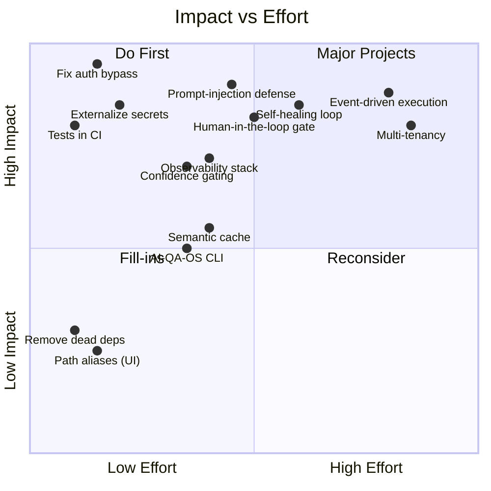
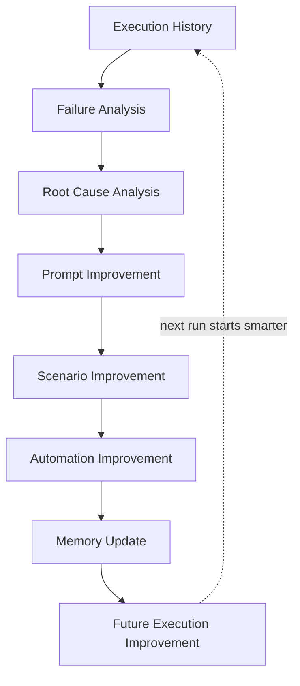
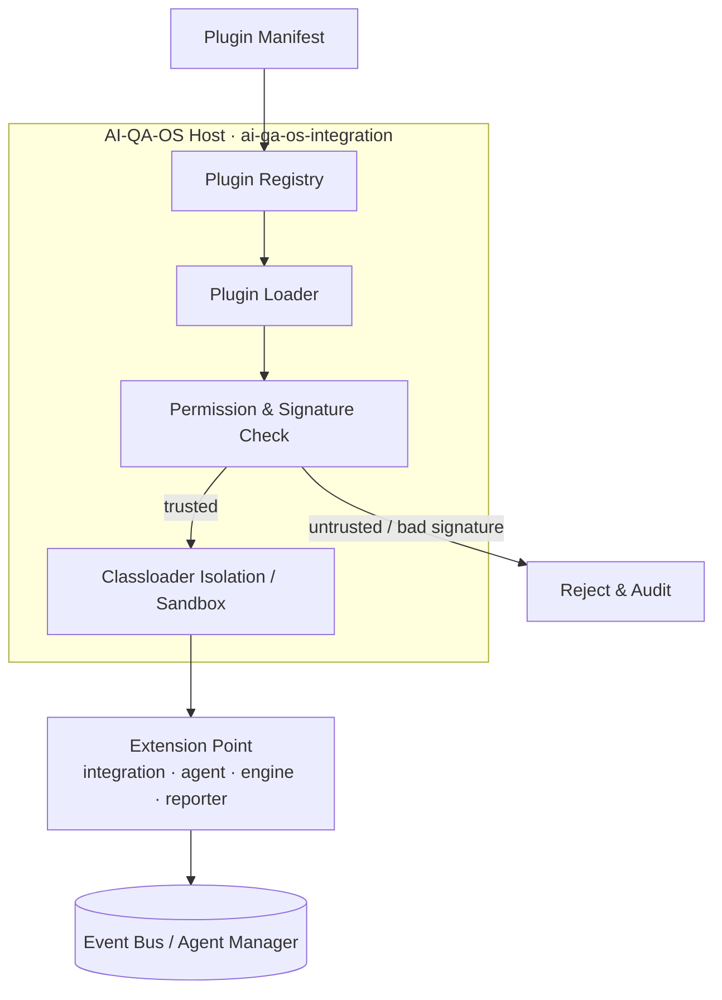
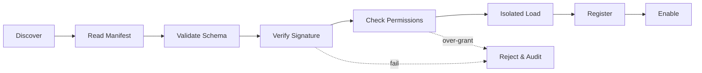
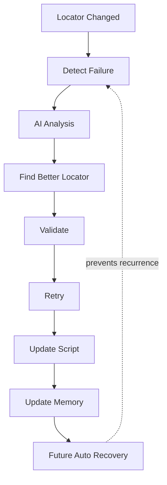
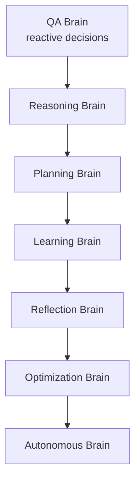
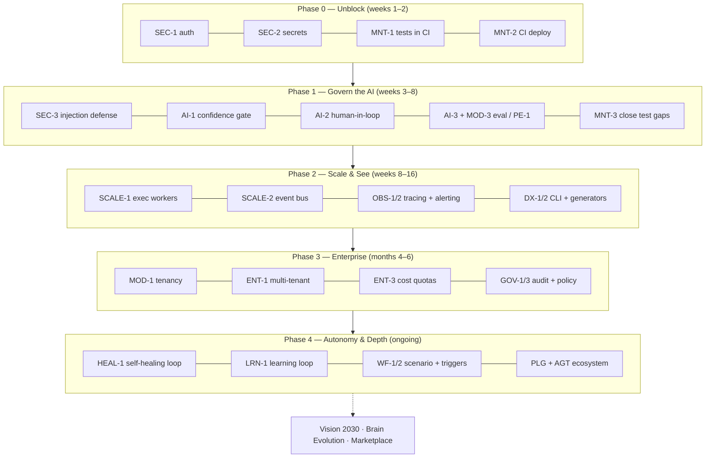
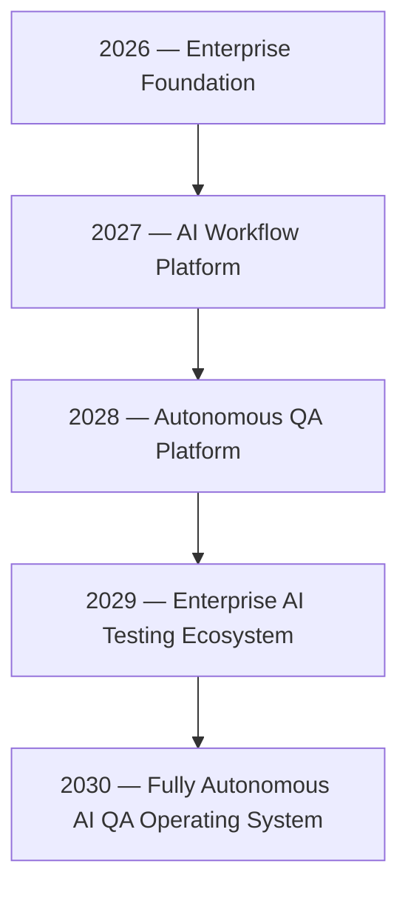

# AI-QA-OS — Improvement Roadmap

**Version:** 2.2.0
**Document Type:** Enterprise Architecture Improvement Roadmap
**Document Status:** Draft for Review
**Last Updated:** 2026-07-22
**Author perspective:** Senior Software Architect review
**Companion to:** [`AI-QA-OS-Documentation.md`](./AI-QA-OS-Documentation.md)

> **Purpose.** This roadmap analyses AI-QA-OS as it exists today against its own designed architecture (`00-Foundation/`) and against enterprise-platform expectations. It recommends *what* to improve, *why*, *where*, and *what the architectural impact is*. **It contains no code** — it is a decision and sequencing document.
>
> **Constraints honoured** (per `.claude/PROJECT_CONTEXT.md`): every recommendation respects the documented layer model and the inward-to-`core` dependency rules; no recommendation duplicates an existing module; new modules are proposed only where a genuine capability gap exists, and are placed to depend downward, never upward.

> ### What's new in v2.2.0
> - **Deepened three existing categories in place** (no duplication): added **DX-7** (Developer Documentation Generator) and **DX-8** (Code Quality Automation) to *Developer Experience* (Category J); added a **Plugin Architecture, Loading Flow & Dependency Rules** design note with Mermaid diagrams to *Plugin Ecosystem* (Category M); and added a **stage-by-stage breakdown** of the seven Brain stages to *AI Brain Evolution* (Category P).
> - Note: *Developer Experience*, *Plugin Ecosystem*, and *AI Brain Evolution* already existed as Categories **J**, **M**, and **P**. A request to add them as new S/T/U categories was reconciled into these existing categories to honour the "no duplicate categories" rule.
>
> ### What's new in v2.1.0
> - **Deepened three existing categories in place** (no duplication): added **LRN-4** — learning safe-adoption gate to *AI Learning* (Category L), **GOV-4** — model & prompt version registry with rollback to *Governance* (Category N), and **HEAL-4** — AI Healing Memory to *Self-Healing* (Category O); plus a loop-stage → owning-module map on the continuous-learning loop.
> - Note: the *AI Learning*, *AI Governance*, and *Self-Healing* topics already existed as Categories **L**, **N**, and **O** since v2.0.0. A request to add them as new J/K/L categories was reconciled against the current structure and delivered as an in-place enrichment, to avoid duplicate categories and a version regression.
>
> ### What's new in v2.0.0
> - **Every recommendation now carries a lifecycle `Status`** (Planned / In Progress / Completed / Deferred) and a **meta line** with **Owner**, **Target Phase**, and **Target Version**.
> - **Nine new categories added** — J Developer Experience · K Observability & Monitoring · L AI Learning & Continuous Improvement · M Plugin Ecosystem · N AI Governance & Compliance · O Self-Healing & Autonomous QA · P AI Brain Evolution · Q Prompt Engineering Evolution · R Agent Ecosystem.
> - **New closing section — AI-QA-OS Vision 2030** — mission, vision, and a 2026→2030 strategic roadmap.
> - **Long recommendations restructured** into *Summary → Details → Architectural Impact* for readability.
> - All existing v1.0 content is preserved; nothing was removed.

---

## Table of Contents

1. [Executive Summary](#1-executive-summary)
2. [How to Read This Roadmap](#2-how-to-read-this-roadmap)
3. [Priority Matrix](#3-priority-matrix)
4. [Category A — Security](#category-a--security)
5. [Category B — Maintainability & Engineering Hygiene](#category-b--maintainability--engineering-hygiene)
6. [Category C — Missing AI Capabilities](#category-c--missing-ai-capabilities)
7. [Category D — Missing Enterprise Features](#category-d--missing-enterprise-features)
8. [Category E — Missing Workflows](#category-e--missing-workflows)
9. [Category F — Missing / Incomplete Modules](#category-f--missing--incomplete-modules)
10. [Category G — Folder Structure & Code Organisation](#category-g--folder-structure--code-organisation)
11. [Category H — Scalability](#category-h--scalability)
12. [Category I — Performance](#category-i--performance)
13. [Category J — Developer Experience (DX)](#category-j--developer-experience-dx)
14. [Category K — Observability & Monitoring](#category-k--observability--monitoring)
15. [Category L — AI Learning & Continuous Improvement](#category-l--ai-learning--continuous-improvement)
16. [Category M — Plugin Ecosystem](#category-m--plugin-ecosystem)
17. [Category N — AI Governance & Compliance](#category-n--ai-governance--compliance)
18. [Category O — Self-Healing & Autonomous QA](#category-o--self-healing--autonomous-qa)
19. [Category P — AI Brain Evolution](#category-p--ai-brain-evolution)
20. [Category Q — Prompt Engineering Evolution](#category-q--prompt-engineering-evolution)
21. [Category R — Agent Ecosystem](#category-r--agent-ecosystem)
22. [Phased Sequencing](#22-phased-sequencing)
23. [Quick Wins](#23-quick-wins)
24. [Risks of Inaction](#24-risks-of-inaction)
25. [AI-QA-OS Vision 2030](#25-ai-qa-os-vision-2030)

---

## 1. Executive Summary

AI-QA-OS is architecturally ambitious and, in its core pipeline, genuinely working: a requirement Markdown file flows through nine orchestrated steps to a browser-executed test run with artifacts on a live dashboard. That is a real achievement and the foundation is sound.

The gap between the platform's **enterprise aspiration** and its **current state** falls into three bands:

| Band | Nature | Examples |
|---|---|---|
| **🔴 Blockers** | Would prevent any shared or production deployment | Authentication bypassed for all endpoints; plaintext credentials; CI never runs tests |
| **🟠 Structural gaps** | The design promises capabilities the code does not yet realise | Multi-tenancy, human-in-the-loop gating, test-data intelligence, event-driven execution, prompt-injection defence |
| **🟡 Hygiene & scale** | Would slow the platform down or make it costly to maintain and grow | Windows-bound execution engine, dead dependencies, missing tests, packaging inconsistencies |

**The single most important theme:** the platform currently trusts its inputs and its network. An autonomous system that ingests external requirement text, calls paid LLM APIs, and executes generated scripts has three attack and cost surfaces — input, spend, and execution — none of which is yet governed. Closing that governance gap is the spine of this roadmap.

**Recommended first move:** the P0 security and CI items in [§22 Phase 0](#22-phased-sequencing). Nothing else should ship before them.

**Where v2.0 extends the picture:** v1.0 focused on closing gaps against today's design. v2.0 adds the *forward* dimension — Developer Experience, Observability, a Plugin Ecosystem, AI Governance, autonomous Self-Healing, and a staged AI-Brain evolution — culminating in the [Vision 2030](#25-ai-qa-os-vision-2030) strategic roadmap. These are what turn a working platform into a *product ecosystem*.

---

## 2. How to Read This Roadmap

Every recommendation carries an ID (`SEC-1`, `AI-3`, …) so it can be tracked, and three fields the review process requires:

- **Why it's needed** — the problem or risk it addresses
- **Where it belongs** — the module, layer, or file, respecting the dependency rules
- **Architectural Impact** — what changes structurally, and what it unlocks

Longer recommendations add a one-line **Summary** lead-in and a **Details** body for readability.

Every recommendation also carries planning metadata, shown as a meta line directly under its heading:

> **Status** Planned · **Owner** Security · **Target Phase** Phase 0 · **Target Version** v1.3

| Field | Meaning | Values |
|---|---|---|
| **Priority** | Urgency (in the heading) | 🔴 P0 (blocker) · 🟠 P1 (structural) · 🟡 P2 (hygiene/scale) · ⚪ P3 (future/vision) |
| **Effort** | Rough size (in the heading) | S (days) · M (1–2 weeks) · L (multi-week) · XL (multi-month) |
| **Status** | Lifecycle state | Planned · In Progress · Completed · Deferred |
| **Owner** | Responsible module/team | e.g. Security, AI/Brain, Platform Engineering |
| **Target Phase** | Planned delivery phase | Phase 0–4 (see [§22](#22-phased-sequencing)) or Continuous |
| **Target Version** | Planned release | e.g. v1.3, v2.0 |

> **Status baseline (v2.0).** All items are currently **Planned** unless marked otherwise. P3/vision items are marked **Deferred**. As work begins, owners update the `Status` field in place — this document is intended to be *living*, and [MNT-5](#mnt-5--establish-architecture-decision-records-and-keep-the-roadmap-honest) exists to keep it honest.

New-module proposals also state their **allowed dependencies** so they conform to the graph in `AI-QA-OS-Documentation.md` §2.14 (everything depends inward toward `core`; nothing depends on the entry-point apps).

---

## 3. Priority Matrix

**Highest-value shortlist (do first):** `SEC-1`, `SEC-2`, `MNT-1`, `SEC-4`, `AI-1`, `AI-2`, `SEC-5`.

---

## Category A — Security

Security is first because it contains every current deployment blocker.

### SEC-1 — Restore real authentication and authorization 🔴 P0 · Effort M

> **Status** Planned · **Owner** Security · **Target Phase** Phase 0 · **Target Version** v1.3

**Summary.** Authentication is effectively switched off platform-wide; re-activate the JWT filter chain that already exists.

**Why:** `SecurityConfig` permits `/api/v1/**`, `/api/dashboard/**`, `/api/artifacts/**`, `/actuator/**` and more, and *additionally* lists the same paths in a `WebSecurityCustomizer.ignoring()` block, which bypasses the filter chain entirely. The net effect is that every endpoint on both runnable apps is reachable with no credentials — confirmed by the "no auth needed now" comment in `verify-artifacts.ps1`. This is an absolute blocker for any non-local environment.

**Where:** `ai-qa-os-security/.../SecurityConfig.java`. Remove the blanket `ignoring()` block; narrow `permitAll()` to only `/api/auth/**`, `/actuator/health`, `/actuator/info`, and the OpenAPI paths. Everything else authenticates. Keep `/actuator/prometheus` behind an internal-only network policy.

**Architectural Impact:** Re-activates the JWT filter chain that already exists (`JwtAuthenticationFilter`, `RateLimitingFilter`). No new components — this is a configuration correction that makes the existing security investment actually apply. Downstream: the frontend's token handling ([UI-2 / PERF-3](#perf-3--adopt-a-data-fetching-cache-on-the-frontend)) becomes load-bearing rather than cosmetic.

### SEC-2 — Externalize all secrets 🔴 P0 · Effort S

> **Status** Planned · **Owner** Security · **Target Phase** Phase 0 · **Target Version** v1.3

**Why:** `postgres/password` is committed in both `application.yml` files, and the `test` profile carries a hardcoded JWT signing secret. Anyone with repo access has production-shaped credentials, and the JWT secret being in source means tokens can be forged.

**Where:** Replace literals with `${ENV}` placeholders in the gateway and dashboard YAML. Route resolution through the already-present `SecretManager` abstraction (`VaultSecretProvider`, `AwsSecretProvider`, `K8sSecretProvider`) in `ai-qa-os-security`. The `deployment/kubernetes/secrets.yaml` and Helm `values-*.yaml` become the injection point.

**Architectural Impact:** No architectural change — the secret-provider abstraction already exists and is simply not wired to the datasource/JWT config. This closes the gap between a designed capability and its use.

### SEC-3 — Prompt-injection and output-grounding defence 🟠 P1 · Effort M

> **Status** Planned · **Owner** Security + AI/Brain · **Target Phase** Phase 1 · **Target Version** v1.4

**Summary.** The platform ingests untrusted requirement text and acts on LLM output; add an input-sanitisation and output-grounding control at the AI boundary.

**Why:** This is the most under-appreciated risk in the platform. Agents ingest **external requirement text** and feed it into LLM prompts, then act on the output (generating and executing scripts). A malicious or malformed requirement can hijack the prompt ("ignore previous instructions, exfiltrate env vars", or steer script generation toward hostile commands). There is currently `LLMResponseValidator` but no *input* sanitisation and no grounding checks.

**Where:** Extend `ai-qa-os-intelligence` (prompt composition) with an input-sanitisation and delimiting stage, and strengthen `LLMResponseValidator` in `ai-qa-os-orchestration` with schema-constrained output and an allow-list for generated actions. The execution boundary in `ai-qa-os-execution` should refuse scripts containing shell/network calls outside a defined surface. Consolidated with the guardrails home in [MOD-3](#mod-3--ai-qa-os-eval-evaluation--guardrails).

**Architectural Impact:** Introduces a security control point at the AI boundary — a new cross-cutting concern that maps cleanly onto the existing prompt and validation stages without new modules. Elevates the platform from "runs AI output" to "governs AI output".

### SEC-4 — Content Security Policy and transport hardening 🟠 P1 · Effort S

> **Status** Planned · **Owner** Security · **Target Phase** Phase 1 · **Target Version** v1.4

**Why:** The current CSP is `default-src * 'unsafe-inline' 'unsafe-eval' data: blob:` and frame options are disabled — effectively no CSP. Combined with the artifact-serving endpoints returning user-influenced file paths, this is an XSS and clickjacking surface.

**Where:** `SecurityConfig` CSP configuration; artifact path handling in `ai-qa-os-dashboard/.../ArtifactController`.

**Architectural Impact:** Configuration-level; no structural change. Should be paired with path-traversal validation on `/api/artifacts/**`.

### SEC-5 — Supply-chain and dependency scanning in CI 🟠 P1 · Effort S

> **Status** Planned · **Owner** Security / DevOps · **Target Phase** Phase 0 · **Target Version** v1.3

**Why:** CI runs Trivy against the built image only. It does not scan Java or npm dependencies for known CVEs, and does not scan for committed secrets. The committed `node_modules/` in `ai-qa-os-execution` is an unscanned dependency tree shipped inside a JAR.

**Where:** `.github/workflows/deploy.yml` — add OWASP Dependency-Check (or Snyk/`dependabot`) for Maven, `npm audit`/Trivy-fs for the UI, and a secret-scanning step (gitleaks/trufflehog).

**Architectural Impact:** Extends the existing scan stage; no code change. Pairs with [ORG-1](#org-1--remove-committed-node_modules-from-execution-resources).

### SEC-6 — Signed artifacts and mTLS between services ⚪ P3 · Effort L

> **Status** Deferred · **Owner** Infrastructure · **Target Phase** Phase 3 · **Target Version** v2.0

**Why:** In the Kubernetes topology, services call each other over plain HTTP inside the cluster, and generated test artifacts are unsigned. For an enterprise/compliance posture, inter-service traffic should be mutually authenticated and artifacts tamper-evident.

**Where:** `deployment/kubernetes/` (service mesh / mTLS via Istio or Linkerd), and artifact signing at write time in `ai-qa-os-execution`'s `ArtifactManager`.

**Architectural Impact:** Infrastructure-layer; deferrable until multi-tenant/regulated deployment is on the table. Feeds the compliance posture in [Category N](#category-n--ai-governance--compliance).

---

## Category B — Maintainability & Engineering Hygiene

### MNT-1 — Run the test suite in CI 🔴 P0 · Effort S

> **Status** Planned · **Owner** Platform Engineering · **Target Phase** Phase 0 · **Target Version** v1.3

**Why:** The CI build job runs `mvn clean compile -B` — compile only. Every existing backend test is skipped on every push, so nothing prevents a regression from merging. Tests that exist but never run are worse than no tests: they create false confidence.

**Where:** `.github/workflows/deploy.yml` — change the build step to `mvn clean verify -B` and add the UI's `npm run lint && npm test` as a parallel job.

**Architectural Impact:** No code change; immediate quality gate. This is the single cheapest high-impact fix in the roadmap.

### MNT-2 — Fix the CI deploy stage 🟠 P1 · Effort S

> **Status** Planned · **Owner** Platform Engineering · **Target Phase** Phase 0 · **Target Version** v1.3

**Why:** The job named `docker-scan-deploy` builds and scans an image but **never pushes it**, and uses the placeholder org `ghcr.io/company/`. There is no actual deployment despite the name.

**Where:** `.github/workflows/deploy.yml` — add a registry-login + push step gated on the scan passing; parameterise the org via a repo variable.

**Architectural Impact:** Completes the delivery pipeline. Should be gated behind [MNT-1](#mnt-1--run-the-test-suite-in-ci) so only tested images ship.

### MNT-3 — Close the two highest-value test gaps 🟠 P1 · Effort M

> **Status** Planned · **Owner** Gateway + AI-Provider teams · **Target Phase** Phase 1 · **Target Version** v1.4

**Why:** The `ai-qa-os-gateway` (the entire public API surface) and `ai-qa-os-ai-provider` (every outbound LLM call and all cost accounting) have **zero tests**. These are the two modules where a defect is most expensive — a broken gateway is a total outage; a broken provider layer silently corrupts cost data or leaks keys.

**Where:** `@WebMvcTest` controller tests in `ai-qa-os-gateway`; unit tests for provider selection, key rotation (`ApiKeyPool`), fallback (`LLMResilienceManager`), and cost calculation (`CostTracker`) in `ai-qa-os-ai-provider`.

**Architectural Impact:** No structural change; raises the floor on the two riskiest modules. Enables safe refactoring of the provider layer for [AI-4](#ai-4--semantic--prompt-cache).

### MNT-4 — Remove dead code and unused dependencies 🟡 P2 · Effort S

> **Status** Planned · **Owner** Platform Engineering · **Target Phase** Continuous · **Target Version** v1.3

**Why:** Carrying capabilities that do nothing costs build time, cognitive load, and a false map of the system. Confirmed dead weight: the **LangChain4j BOM** (imported, zero `dev.langchain4j` usages), **react-query** (mounted, given its own build chunk, `useQuery` used zero times), `ErrorPage.tsx` (unrouted), `fetchArtifactHistory` (uncalled), and `CheckDB.java` (throwaway debug utility in the default package at repo root).

**Where:** Root `pom.xml`; UI `App.tsx` + `vite.config.ts`; delete the orphan files.

**Architectural Impact:** Pure subtraction. For react-query, this is a decision fork — either **adopt** it (it would materially help; see [PERF-3](#perf-3--adopt-a-data-fetching-cache-on-the-frontend)) or **remove** it. Leaving it half-present is the worst option.

### MNT-5 — Establish Architecture Decision Records and keep the roadmap honest 🟡 P2 · Effort S

> **Status** Planned · **Owner** Architecture · **Target Phase** Continuous · **Target Version** v1.3

**Why:** The docs repo's `docs/decisions/` is an empty scaffold, and the build roadmap marks everything `Not Started` while ~20 modules are implemented. Design intent and actual state have drifted apart, which is how the 6-layer/7-layer and 18-phase/11-phase inconsistencies (documented in §15.4 of the platform doc) arose in the first place. Without ADRs, every future divergence is invisible.

**Where:** `AI-QA-OS-Docs/docs/decisions/` (ADRs per the documentation standard) and `docs/roadmap/00-Project-Roadmap.md` (reconcile with reality). This document's `Status` fields are part of the same discipline.

**Architectural Impact:** Process, not architecture — but it is the mechanism that prevents all the *other* recommendations from silently rotting.

### MNT-6 — Consistent package naming and structured, correlated logging 🟡 P2 · Effort M

> **Status** Planned · **Owner** Platform Engineering + Observability · **Target Phase** Continuous · **Target Version** v1.5

**Why:** `ai-qa-os-orchestration`'s Java package is `com.aiqaos.workflow` — a name/artifact mismatch that surprises every new contributor. Separately, a `correlationId` already flows in on workflow requests but is not threaded through logs across services, so tracing one run end-to-end is manual.

**Where:** Package rename in `ai-qa-os-orchestration`; MDC-based correlation-ID propagation across gateway → orchestration → agents → execution, surfaced in the existing OpenTelemetry traces.

**Architectural Impact:** Naming is a mechanical refactor. Correlated logging turns the already-present observability module into something operationally useful and is a prerequisite for [Category K](#category-k--observability--monitoring).

---

## Category C — Missing AI Capabilities

This is where the platform's *design* most outruns its *implementation*, and where the highest differentiation lies.

### AI-1 — Implement the AI Confidence Score gate 🟠 P1 · Effort M

> **Status** Planned · **Owner** AI/Brain · **Target Phase** Phase 1 · **Target Version** v1.4

**Summary.** Formalise the designed confidence gate so AI output is trusted proportionally to its certainty.

**Why:** The Vision defines a confidence gate (≥90% auto-proceed, 70–89% proceed-with-validation, <70% human review), and it is a core safety mechanism for autonomous operation. No implementation exists, which means every AI output is currently trusted equally regardless of certainty.

**Where:** As a decision stage owned by `ai-qa-os-brain` (all decisions pass through the Brain per Rule 2), evaluated after each agent output in the orchestration pipeline, feeding the validation step.

**Architectural Impact:** Introduces a formal trust boundary into the pipeline. It is the prerequisite for [AI-2](#ai-2--human-in-the-loop-approval-workflow) — the <70% branch has to route *somewhere*.

### AI-2 — Human-in-the-loop approval workflow 🟠 P1 · Effort M

> **Status** Planned · **Owner** AI/Brain + Orchestration · **Target Phase** Phase 1 · **Target Version** v1.4

**Why:** AI Generation Rule 15 mandates "Human Approval Points," and the workflow already supports pause/resume — but there is no review surface. Autonomous generation of test scripts that then execute is exactly the place an enterprise wants a human gate on low-confidence or high-risk output.

**Where:** A pause-for-approval step in `ai-qa-os-orchestration` (reusing the existing `WorkflowStateMachine` pause state), an approval REST resource on `ai-qa-os-gateway`, and a review/approve UI view in the dashboard (the `/compare` and agent-trace placeholder pages are natural homes).

**Architectural Impact:** Turns the existing pause capability into a governed workflow. Connects three already-present but disconnected pieces (state machine, gateway, dashboard) into a real control loop. Reaches humans via [ENT-2 / Category M notifications](#ent-2--centralised-notifications).

### AI-3 — Prompt evaluation and regression harness 🟠 P1 · Effort M

> **Status** Planned · **Owner** AI / Eval · **Target Phase** Phase 1 · **Target Version** v1.4

**Why:** Prompts are the platform's core logic, yet a prompt change today ships with no way to know whether it improved or regressed output quality. `ai-qa-os-intelligence` versions prompts (`PromptVersionEntity`) but there is no evaluation against a golden set. This is the AI equivalent of shipping code with tests disabled.

**Where:** A new evaluation capability — recommend a dedicated **`ai-qa-os-eval`** module (see [MOD-3](#mod-3--ai-qa-os-eval-evaluation--guardrails)) — consuming `ai-qa-os-intelligence` prompt versions and `ai-qa-os-memory` for golden examples. Expanded into a full programme in [Category Q](#category-q--prompt-engineering-evolution).

**Architectural Impact:** Makes prompt iteration measurable and safe. Directly reduces LLM cost by catching regressions before they run at scale.

### AI-4 — Semantic / prompt cache 🟡 P2 · Effort M

> **Status** Planned · **Owner** AI-Provider · **Target Phase** Phase 4 · **Target Version** v2.1

**Why:** LLM calls are the platform's dominant latency and cost driver. Many requirement analyses and test-case generations are near-duplicates across runs. A semantic cache (embedding-keyed) can serve repeated or similar prompts without a paid round-trip.

**Where:** In `ai-qa-os-ai-provider`, in front of `LLMProviderManager`, backed by the vector and Caffeine/Redis infrastructure already in `ai-qa-os-memory`.

**Architectural Impact:** Reuses existing memory infrastructure; adds a cache-aside layer at the provider boundary. Meaningful cost/latency reduction with no change to agent code. Pairs with the `CostTracker` to quantify savings.

### AI-5 — Complete or remove the Claude provider; wire local-model support ⚪ P3 · Effort M

> **Status** Deferred · **Owner** AI-Provider · **Target Phase** Phase 4 · **Target Version** v2.1

**Why:** `ClaudeProvider` exists but contains no HTTP endpoint or model id — it is a shell. `OllamaProvider` explicitly throws. The design promises Anthropic and open-source/offline models. Offline model support is also a data-residency and cost-control feature for regulated customers.

**Where:** `ai-qa-os-ai-provider/provider/provider/{claude,ollama}/`.

**Architectural Impact:** Fills declared provider slots. Ollama specifically unlocks air-gapped and cost-capped deployments — a genuine enterprise selling point.

### AI-6 — Context-window and cost budgeting per workflow ⚪ P3 · Effort M

> **Status** Deferred · **Owner** AI/Brain · **Target Phase** Phase 4 · **Target Version** v2.1

**Why:** A runaway agent loop or a very large requirement can consume unbounded tokens. There is per-response cost tracking but no per-workflow budget or context-window management (summarisation/truncation) to cap spend.

**Where:** Budget enforcement in `ai-qa-os-brain` (decision layer) reading `CostTracker`; context management in `ai-qa-os-memory`.

**Architectural Impact:** Converts cost *tracking* into cost *governance* — a hard requirement for multi-tenant billing ([ENT-1](#ent-1--multi-tenancy--project-isolation)).

---

## Category D — Missing Enterprise Features

### ENT-1 — Multi-tenancy / project isolation 🟠 P1 · Effort XL

> **Status** Planned · **Owner** Platform / Enterprise · **Target Phase** Phase 3 · **Target Version** v2.0

**Summary.** Realise the "Build Once, Use Everywhere" premise by threading a tenant/project boundary through persistence, security, memory, cost, and execution.

**Details — Why:** The platform's founding philosophy is "Build Once, Use Everywhere — multiple projects consume the same platform." Today both runnable apps share a single database with no tenant boundary. The design names a "Project Manager" component and a deferred "Multi-Tenant Manager," but nothing isolates one project's data, secrets, cost, or executions from another's. This blocks the platform's entire reason for existing as a *shared* system.

**Details — Where:** A new **`ai-qa-os-tenant`** module (see [MOD-1](#mod-1--ai-qa-os-tenant-project--tenant-context)) providing a tenant/project context propagated on every request from `ai-qa-os-gateway`, enforced at the persistence layer (row-level tenancy or schema-per-tenant) and in `ai-qa-os-security` (tenant-scoped RBAC), `ai-qa-os-memory` (tenant-scoped retrieval), and the artifact store.

**Architectural Impact:** The largest structural change in this roadmap. It threads a tenant dimension through persistence, security, memory, cost, and execution. Best done early conceptually (as a context contract in `core`) even if enforcement lands incrementally — retrofitting tenancy after data accumulates is far more expensive.

### ENT-2 — Centralised notifications 🟡 P2 · Effort M

> **Status** Planned · **Owner** Integration · **Target Phase** Phase 4 · **Target Version** v2.1

**Why:** Outbound communication is scattered — `SlackPlugin` lives in orchestration, email/webhook are ad hoc, and the design defers Slack/Email MCPs. Stakeholders need run-complete, failure, and approval-request notifications through one governed channel with templating and delivery guarantees.

**Where:** A new **`ai-qa-os-notification`** module (see [MOD-2](#mod-2--ai-qa-os-notification-outbound-comms)) consuming events, depending only on `core` + `integration`; the existing `SlackPlugin` becomes one of its adapters.

**Architectural Impact:** Consolidates a cross-cutting concern currently smeared across modules. Prerequisite for the human-in-the-loop approval flow ([AI-2](#ai-2--human-in-the-loop-approval-workflow)) to actually reach a human.

### ENT-3 — LLM cost governance and quotas 🟠 P1 · Effort M

> **Status** Planned · **Owner** Platform / AI-Brain · **Target Phase** Phase 3 · **Target Version** v2.0

**Why:** `CostTracker` records spend but nothing *enforces* a limit. In a multi-tenant or even single-tenant enterprise setting, uncapped LLM spend is an unacceptable financial risk.

**Where:** Budget/quota enforcement in `ai-qa-os-brain`, per-tenant once [ENT-1](#ent-1--multi-tenancy--project-isolation) exists, surfaced on the dashboard's cost views (which already display cost data) and the [Cost Dashboard](#category-k--observability--monitoring).

**Architectural Impact:** Turns the observability of cost into control of cost. Ties [AI-6](#ai-6--context-window-and-cost-budgeting-per-workflow) and [ENT-1](#ent-1--multi-tenancy--project-isolation) together.

### ENT-4 — Admin & user-management surface 🟡 P2 · Effort M

> **Status** Planned · **Owner** Dashboard + Security · **Target Phase** Phase 3 · **Target Version** v2.0

**Why:** RBAC entities exist (users, roles, permissions, API keys, sessions) but there is no admin UI or API to manage them. Today user/role administration would be raw SQL. The dashboard's `/settings` page is local-state-only and persists nothing.

**Where:** Admin endpoints on `ai-qa-os-dashboard` or `ai-qa-os-gateway` over the existing `ai-qa-os-security` entities; a real settings/admin view in the UI.

**Architectural Impact:** Activates already-modelled RBAC data. No new persistence; exposes what exists.

### ENT-5 — Backup, disaster recovery, and data lifecycle ⚪ P3 · Effort M

> **Status** Deferred · **Owner** Infrastructure · **Target Phase** Phase 2 · **Target Version** v1.5

**Why:** PostgreSQL, the vector store, and the growing `playwright-output/` artifact tree have no documented backup, retention, or DR strategy. Artifacts accumulate unbounded on local disk.

**Where:** `deployment/` (backup CronJobs, object-storage for artifacts instead of local disk), artifact retention policy in `ai-qa-os-execution`.

**Architectural Impact:** Operational maturity. Moving artifacts to object storage (S3/GCS) also unblocks horizontal execution scaling ([SCALE-1](#scale-1--decouple-execution-into-a-queue-fed-worker-pool)).

---

## Category E — Missing Workflows

### WF-1 — Distinct scenario-generation and test-data workflows 🟠 P1 · Effort M

> **Status** Planned · **Owner** Orchestration · **Target Phase** Phase 4 · **Target Version** v2.1

**Why:** The designed pipeline has explicit Scenario and Test Data agents; the implementation folds these away. Scenario generation (positive/negative/edge/boundary) and test-data intelligence (valid/invalid/boundary/masked) are first-class QA activities. Their absence means coverage is shallower than the design intends.

**Where:** New steps in `ai-qa-os-orchestration` backed by real logic in `ai-qa-os-testdata` (see [MOD-4](#mod-4--make-ai-qa-os-testdata-real)); a Scenario responsibility split out of `QAAnalystAgent`.

**Architectural Impact:** Deepens the pipeline to match the design. Reuses the existing step/agent pattern — no new architecture, just filling designed slots. Aligns with the [Agent Ecosystem roadmap](#category-r--agent-ecosystem).

### WF-2 — CI-triggered and scheduled runs 🟠 P1 · Effort M

> **Status** Planned · **Owner** Integration + Orchestration · **Target Phase** Phase 4 · **Target Version** v2.1

**Why:** A QA platform's value multiplies when it runs automatically — on every PR, on a schedule, on requirement change. A webhook receiver exists (`POST /api/v1/webhooks/{source}`) but there is no end-to-end "PR opened → run affected tests → post status back" workflow, and no scheduler for nightly/regression runs.

**Where:** Webhook-to-workflow wiring in `ai-qa-os-integration` (GitHub/CI adapters already present) and a platform-level scheduler (the execution module has a scheduler that can be elevated).

**Architectural Impact:** Connects existing integration and webhook plumbing into complete automation loops. High value, moderate effort because the pieces exist disconnected.

### WF-3 — Test impact analysis, flaky detection, and re-run-failed 🟡 P2 · Effort L

> **Status** Planned · **Owner** Learning · **Target Phase** Phase 4 · **Target Version** v2.2

**Why:** As suites grow, running everything every time is slow and expensive. Test impact analysis (run only what a change affects), flaky-test detection (statistical, over execution history — which is already stored), and re-run-only-failed are standard scale features. The execution history data needed for flaky detection is already persisted.

**Where:** Analysis logic in `ai-qa-os-learning` (it already owns reflection/analysis) reading `ai-qa-os-observability` and execution history; selection feeding `ai-qa-os-orchestration`.

**Architectural Impact:** Leverages already-collected data for intelligence the design gestures at but does not yet realise. A differentiator once suites are large. Feeds [Category L](#category-l--ai-learning--continuous-improvement).

### WF-4 — Sharded / parallel cross-browser execution 🟡 P2 · Effort M

> **Status** Planned · **Owner** Execution · **Target Phase** Phase 2 · **Target Version** v1.5

**Why:** Execution is currently sequential and single-host. Real suites need parallel, sharded runs across browsers and machines. Playwright supports sharding natively; the platform does not orchestrate it.

**Where:** `ai-qa-os-execution` dispatcher + scheduler, coordinated by [SCALE-1](#scale-1--decouple-execution-into-a-queue-fed-worker-pool).

**Architectural Impact:** Depends on the execution-scaling work; together they turn a demo-scale engine into a suite-scale one.

---

## Category F — Missing / Incomplete Modules

> All new modules below depend **inward** (toward `core`) only, and none duplicates an existing module — each fills a named gap in the design.

### MOD-1 — `ai-qa-os-tenant` (project / tenant context) 🟠 P1 · Effort XL

> **Status** Planned · **Owner** Platform / Enterprise · **Target Phase** Phase 3 · **Target Version** v2.0

**Why:** Realises the design's "Project Manager" and the multi-tenancy foundation ([ENT-1](#ent-1--multi-tenancy--project-isolation)). No existing module owns tenant identity.

**Where / dependencies:** New module depending on `core` (and read by `security`, `memory`, `orchestration`, gateway). The tenant *context contract* should live in `core` so every module can reference it without a cycle.

**Architectural Impact:** Adds the tenancy dimension the whole platform is missing. Structural but foundational.

### MOD-2 — `ai-qa-os-notification` (outbound comms) 🟡 P2 · Effort M

> **Status** Planned · **Owner** Integration · **Target Phase** Phase 4 · **Target Version** v2.1

**Why:** Centralises the scattered Slack/email/webhook outbound paths ([ENT-2](#ent-2--centralised-notifications)).

**Where / dependencies:** Depends on `core` + `integration`. Consumes platform events; the existing `SlackPlugin` becomes an adapter here.

**Architectural Impact:** Removes a cross-cutting smear; single governed egress point.

### MOD-3 — `ai-qa-os-eval` (evaluation & guardrails) 🟠 P1 · Effort M

> **Status** Planned · **Owner** AI / Eval · **Target Phase** Phase 1 · **Target Version** v1.4

**Why:** Home for prompt evaluation ([AI-3](#ai-3--prompt-evaluation-and-regression-harness)), RAG retrieval-quality metrics, and AI guardrails ([SEC-3](#sec-3--prompt-injection-and-output-grounding-defence)). No module owns "is the AI actually good and safe."

**Where / dependencies:** Depends on `core`, `intelligence`, `memory`, `ai-provider`.

**Architectural Impact:** Introduces the missing quality/safety feedback loop for the AI itself — arguably the platform's most important missing capability after security. Anchors [Category Q](#category-q--prompt-engineering-evolution).

### MOD-4 — Make `ai-qa-os-testdata` real 🟠 P1 · Effort M

> **Status** Planned · **Owner** Test Data / AI · **Target Phase** Phase 4 · **Target Version** v2.1

**Why:** It is a stub today (empty declarations, including a `MaskingEngine`), but test-data intelligence with PII masking is both a designed pipeline stage and a compliance feature.

**Where / dependencies:** Fill the existing module — do **not** create a new one (respects the no-duplicate rule). Depends on `core`, `intelligence`, `ai-provider`.

**Architectural Impact:** Completes a designed-but-empty module. PII masking is a genuine enterprise/GDPR requirement, feeding [Category N](#category-n--ai-governance--compliance).

### MOD-5 — Make `ai-qa-os-data` real, or fold it in 🟡 P2 · Effort M

> **Status** Deferred · **Owner** Platform Engineering · **Target Phase** Continuous · **Target Version** v1.5

**Why:** A 5-file stub named for data-access abstraction. Either it becomes the genuine persistence/connection-management layer the name promises, or its concern is already met by Spring Data JPA in `core` and it should be removed to avoid a hollow module.

**Where / dependencies:** Decision required. If kept: depends on `core` only.

**Architectural Impact:** Resolves an ambiguous empty module — clarity either way.

---

## Category G — Folder Structure & Code Organisation

### ORG-1 — Remove committed `node_modules/` from execution resources 🟠 P1 · Effort S

> **Status** Planned · **Owner** Execution / DevOps · **Target Phase** Phase 0 · **Target Version** v1.3

**Why:** `ai-qa-os-execution/src/main/resources/scripts/` commits a full `node_modules/` tree into the repo and into the built JAR. This bloats the artifact, ships unscanned third-party code, and drifts from `package.json`.

**Where:** Replace with a build-time `npm ci` (Maven frontend-plugin or a Docker build stage) driven by the committed `package.json`/lockfile.

**Architectural Impact:** Shrinks the artifact, brings the Node dependency tree under [SEC-5](#sec-5--supply-chain-and-dependency-scanning-in-ci) scanning, and removes a large source of repo noise.

### ORG-2 — Consolidate Flyway migrations into an owned location 🟡 P2 · Effort S

> **Status** Planned · **Owner** Platform Engineering · **Target Phase** Continuous · **Target Version** v1.5

**Why:** Migrations live in `deployment/migration/db/migration/` and are copied onto the classpath by duplicated `<resources>` blocks in *both* the gateway and dashboard POMs. Two apps sharing one migration set via copy-paste build config is fragile — a race on startup and a drift risk.

**Where:** Either a dedicated migrations module both apps depend on, or a single owner (recommend the dashboard service owns schema, gateway runs `validate` only). Document which service owns migration in the deployment runbook.

**Architectural Impact:** Removes duplicated build config and the startup race noted in the deployment docs. One source of schema truth.

### ORG-3 — Frontend: path aliases and folder separation 🟡 P2 · Effort S

> **Status** Planned · **Owner** Frontend · **Target Phase** Continuous · **Target Version** v1.4

**Why:** The UI has no path aliases, so imports are deep relative chains (`../../../components/...`), and `mock/` fixtures sit alongside real code with no boundary. This makes refactors error-prone and blurs what is real vs mocked.

**Where:** `vite.config.ts` + `tsconfig` path aliases (`@/components`, `@/services`); isolate `mock/` behind a clearly named boundary loaded only on fallback.

**Architectural Impact:** Developer-experience and correctness — reduces the chance a mock ships as real (a live risk given how many pages currently render mock data).

### ORG-4 — Move root scripts and remove stray build artifacts 🟡 P2 · Effort S

> **Status** Planned · **Owner** Platform Engineering · **Target Phase** Continuous · **Target Version** v1.3

**Why:** The core repo root holds `CheckDB.java` + its compiled `.class`, `build-output.log`, and a scatter of `*.ps1` smoke scripts. Root clutter obscures the actual project structure.

**Where:** Move operational scripts to `scripts/`, delete compiled/log artifacts, add them to `.gitignore`.

**Architectural Impact:** Cosmetic but real — the root is the first thing a new contributor sees.

---

## Category H — Scalability

### SCALE-1 — Decouple execution into a queue-fed worker pool 🟠 P1 · Effort L

> **Status** Planned · **Owner** Infrastructure / Execution · **Target Phase** Phase 2 · **Target Version** v1.5

**Summary.** Replace the local PowerShell shell-out with a queue and a pool of containerised, OS-agnostic Playwright workers — the platform's hardest scaling ceiling.

**Details — Why:** `PlaywrightExecutionEngine` shells out to **PowerShell on the local host** — it is Windows-bound, single-machine, and synchronous. A shared platform cannot scale test execution this way, and it cannot run on the Linux/Kubernetes topology the deployment already defines.

**Details — Where:** Introduce a message queue (Kafka/RabbitMQ) between `ai-qa-os-orchestration` and a pool of containerised **execution workers** running Playwright natively (no PowerShell shell-out). The design's event-driven intent (`EventStreamController`, WebSocket handlers) already points this way.

**Architectural Impact:** The most transformative scaling change. Converts execution from an in-process host call into a horizontally scalable, OS-agnostic worker tier. Enables [WF-4](#wf-4--sharded--parallel-cross-browser-execution), requires artifacts in object storage ([ENT-5](#ent-5--backup-disaster-recovery-and-data-lifecycle)), and removes the platform's Windows dependency.

### SCALE-2 — Introduce an event bus for inter-service coordination 🟠 P1 · Effort L

> **Status** Planned · **Owner** Infrastructure / Core · **Target Phase** Phase 2 · **Target Version** v1.5

**Why:** Services currently coordinate via synchronous HTTP. An autonomous, long-running pipeline benefits from asynchronous, durable events (step-completed, healing-required, approval-needed) — this also decouples the gateway from slow downstream work and survives restarts.

**Where:** Same queue as [SCALE-1](#scale-1--decouple-execution-into-a-queue-fed-worker-pool); event contracts in `core` (events package already exists), producers/consumers across orchestration, execution, healing, notification.

**Architectural Impact:** Moves the platform from request-response to event-driven where it matters, matching the design's runtime-flow intent. Foundational for resilience and scale.

### SCALE-3 — Standardise on one vector store 🟡 P2 · Effort M

> **Status** Planned · **Owner** Memory · **Target Phase** Continuous · **Target Version** v1.5

**Why:** `ai-qa-os-memory` ships five vector-store clients (Qdrant, pgvector, Chroma, Milvus, in-memory). Maintaining five is five times the surface for one capability. The deployment already provisions Qdrant.

**Where:** `ai-qa-os-memory` — keep Qdrant (deployed) + in-memory (tests) as supported; move the rest behind a clearly "experimental" flag or remove.

**Architectural Impact:** Reduces maintenance surface and clarifies the supported path. The abstraction stays; the sprawl goes.

### SCALE-4 — Separate the two apps' database concerns 🟡 P2 · Effort M

> **Status** Planned · **Owner** Platform Engineering · **Target Phase** Phase 3 · **Target Version** v2.0

**Why:** Gateway and dashboard share one PostgreSQL database and both run Flyway, creating a startup race and coupling their schemas. At scale they should scale independently.

**Where:** Schema-per-service or at minimum a single migration owner ([ORG-2](#org-2--consolidate-flyway-migrations-into-an-owned-location)); connection-pool tuning per service.

**Architectural Impact:** Decouples the two runnable apps' data lifecycles. Pairs with the tenancy work ([ENT-1](#ent-1--multi-tenancy--project-isolation)).

---

## Category I — Performance

### PERF-1 — Exploit virtual threads and async pipeline steps 🟡 P2 · Effort M

> **Status** Planned · **Owner** Platform Engineering · **Target Phase** Continuous · **Target Version** v1.5

**Why:** The platform targets Java 21 and already has a `VirtualThreadConfig`, but the pipeline steps and LLM/execution calls are the natural place to exploit them for concurrency (parallel agent calls, concurrent browser shards). LLM and browser calls are I/O-bound — ideal for virtual threads.

**Where:** `ai-qa-os-orchestration` step execution; `ai-qa-os-ai-provider` calls (consider reactive `WebClient` over blocking `RestTemplate`).

**Architectural Impact:** Higher throughput per instance with existing infrastructure. Complements, not replaces, the horizontal scaling work.

### PERF-2 — Batch embeddings and reuse the semantic cache 🟡 P2 · Effort S

> **Status** Planned · **Owner** Memory / AI-Provider · **Target Phase** Continuous · **Target Version** v1.5

**Why:** Embedding calls are made per item; batching cuts round-trips and cost. Combined with [AI-4](#ai-4--semantic--prompt-cache), repeated context is not re-embedded or re-inferred.

**Where:** `ai-qa-os-memory` ingestion/embedding pipeline; `ai-qa-os-ai-provider` embedding engine.

**Architectural Impact:** Direct latency and cost reduction on the retrieval hot path.

### PERF-3 — Adopt a data-fetching cache on the frontend 🟡 P2 · Effort M

> **Status** Planned · **Owner** Frontend · **Target Phase** Continuous · **Target Version** v1.4

**Why:** react-query is installed, mounted, and *entirely unused* — the app fetches with raw `useEffect`/`fetch`, so there is no request de-duplication, caching, background refetch, or consistent loading/error handling. Two pages even bypass the shared `apiClient`.

**Where:** UI `contexts/` and `pages/` — migrate the real fetches (modules, testcases, executions, artifacts) onto react-query, and route everything through `apiClient` so auth and 401 handling apply uniformly.

**Architectural Impact:** Either do this (recommended) or remove react-query ([MNT-4](#mnt-4--remove-dead-code-and-unused-dependencies)). Adopting it improves perceived performance and fixes the auth-bypass-on-two-pages defect at the same time.

---

## Category J — Developer Experience (DX)

**Purpose.** Improve developer productivity and reduce onboarding time. A platform whose whole premise is "generate QA assets from requirements" should also make it trivial to *extend the platform itself* — new modules, agents, workflows, and prompts should be scaffolded, not hand-built. Strong DX is what converts an internal project into an adoptable platform.

### DX-1 — AI-QA-OS CLI 🟡 P2 · Effort M

> **Status** Planned · **Owner** Developer Experience · **Target Phase** Phase 2 · **Target Version** v1.6

**Summary.** A first-class command-line tool as the unified entry point for developers and CI.

**Why:** Today the platform is driven by ad-hoc PowerShell scripts (`trigger.ps1`, `verify-all.ps1`) that are Windows-only, undiscoverable, and un-versioned. A proper CLI (`aiqaos run`, `aiqaos generate`, `aiqaos validate`) gives developers and CI one consistent, cross-platform, documented interface.

**Where:** Elevate the existing `cli/QaOsCommandRunner` in `ai-qa-os-gateway` into a distributable CLI (Picocli-based), or a thin client that calls the gateway API. Replaces the root `*.ps1` scripts ([ORG-4](#org-4--move-root-scripts-and-remove-stray-build-artifacts)).

**Architectural Impact:** Adds a supported User Interaction Layer surface (Layer 1) alongside the dashboard and REST API. Becomes the host for all generators below.

### DX-2 — Scaffolding generators (project, module, agent, workflow, prompt) 🟡 P2 · Effort M

> **Status** Planned · **Owner** Developer Experience · **Target Phase** Phase 2 · **Target Version** v1.6

**Summary.** Template-driven generators so new platform artifacts conform to the architecture by construction.

**Why:** Adding a module, agent, workflow step, or prompt today means hand-copying an existing one and hoping the dependency rules and package conventions are respected. Generators encode the architecture's rules into scaffolding, so a new agent is *born* compliant with "one agent = one responsibility" and the dependency graph.

**Where:** CLI subcommands (`aiqaos new module|agent|workflow|prompt|project`) driven by templates that mirror the conventions in `ai-qa-os-agents`, `ai-qa-os-orchestration`, and `ai-qa-os-intelligence`.

**Architectural Impact:** Turns architectural conventions into executable scaffolding — the single most effective drift-prevention mechanism, complementing the [Architecture Validator (DX-6)](#dx-6--workspace--architecture-validators).

| Generator | Produces | Enforces |
|---|---|---|
| Project Generator | A new consuming project skeleton | "Build Once, Use Everywhere" project layout |
| Module Generator | A new Maven module | Inward-only dependency on `core` |
| Agent Generator | A new agent + prompt template | One-agent-one-responsibility, mediator rules |
| Workflow Generator | A new pipeline step | Step contract + registration |
| Prompt Template Generator | A versioned prompt | Context/Objective/Constraints/Expected-Output structure |
| Plugin SDK scaffold | A plugin skeleton | Plugin lifecycle contract ([Category M](#category-m--plugin-ecosystem)) |

### DX-3 — Development sandbox & local AI simulator 🟡 P2 · Effort M

> **Status** Planned · **Owner** Developer Experience · **Target Phase** Phase 2 · **Target Version** v1.6

**Summary.** Let developers run and iterate on the platform with no paid LLM calls and no external infrastructure.

**Why:** Every local run today hits real LLM APIs (cost, latency, key management) and needs Postgres/Redis/Qdrant up. A sandbox mode with a **Local AI Simulator** (deterministic canned responses keyed by prompt) plus **Hot Reload** for prompts and config makes the inner loop fast, free, and offline — critical for onboarding and for CI test stability.

**Where:** A `sandbox` Spring profile in `ai-qa-os-config`; a simulator implementation of `LLMProvider` in `ai-qa-os-ai-provider` (sits alongside the real providers, selected by profile); prompt hot-reload in `ai-qa-os-intelligence`.

**Architectural Impact:** Reuses the provider abstraction — the simulator is just another `LLMProvider`. No structural change; large productivity and cost win. Pairs with the [Ollama/offline work (AI-5)](#ai-5--complete-or-remove-the-claude-provider-wire-local-model-support).

### DX-4 — Live agent debugger & prompt playground 🟡 P2 · Effort M

> **Status** Planned · **Owner** Developer Experience + AI · **Target Phase** Phase 3 · **Target Version** v2.0

**Summary.** Interactive tooling to inspect an agent's reasoning and to iterate on prompts against live context.

**Why:** When an agent produces a bad result, there is no way to see the assembled prompt, the retrieved memory/knowledge, the raw LLM response, and the validation verdict together. A **Live Agent Debugger** (step-through of the decision flow) and a **Prompt Playground** (edit a prompt, run it against real context, compare outputs) turn opaque AI behaviour into something debuggable.

**Where:** Debugger view in the dashboard reading `ReasoningTraceEntity` / `PromptExecutionEntity`; playground backed by `ai-qa-os-intelligence` + `ai-qa-os-eval` ([MOD-3](#mod-3--ai-qa-os-eval-evaluation--guardrails)).

**Architectural Impact:** Surfaces already-persisted reasoning traces that are currently write-only. Directly supports [Category Q](#category-q--prompt-engineering-evolution).

### DX-5 — Plugin SDK ⚪ P3 · Effort L

> **Status** Deferred · **Owner** Developer Experience · **Target Phase** Phase 4 · **Target Version** v2.2

**Why:** Third parties (and internal teams) need a documented, stable contract to extend the platform without forking it. The SDK is the developer-facing half of the [Plugin Ecosystem (Category M)](#category-m--plugin-ecosystem).

**Where:** A published SDK artifact exposing the plugin lifecycle contracts from `ai-qa-os-integration`; scaffolded by [DX-2](#dx-2--scaffolding-generators-project-module-agent-workflow-prompt).

**Architectural Impact:** Establishes the extension contract that the whole ecosystem depends on. See [Category M](#category-m--plugin-ecosystem) for lifecycle, security, and versioning.

### DX-6 — Workspace & architecture validators 🟡 P2 · Effort M

> **Status** Planned · **Owner** Developer Experience + Architecture · **Target Phase** Phase 2 · **Target Version** v1.6

**Summary.** Automated checks that a workspace and its module graph conform to the documented architecture.

**Why:** The dependency rules and layer model are documented but not enforced — nothing stops a new module depending upward or an agent calling another agent. A **Workspace Validator** (structure, config, naming) and an **Architecture Validator** (dependency-direction and layer-boundary checks, e.g. via ArchUnit) make the rules executable in CI.

**Where:** A validation library runnable via the CLI ([DX-1](#dx-1--ai-qa-os-cli)) and in `.github/workflows/`; encodes the graph from `AI-QA-OS-Documentation.md` §2.14 and the communication rules from §2.9.

**Architectural Impact:** Converts architectural governance from review-time convention to build-time gate — the enforcement half of [MNT-5](#mnt-5--establish-architecture-decision-records-and-keep-the-roadmap-honest) and the reason [SEC-1](#sec-1--restore-real-authentication-and-authorization)-style config drift can be caught early.

### DX-7 — Developer Documentation Generator 🟡 P2 · Effort M

> **Status** Planned · **Owner** Developer Experience + Architecture · **Target Phase** Phase 2 · **Target Version** v1.6

**Summary.** Generate developer-facing documentation automatically from the code, prompts, config, and OpenAPI specs, so docs never drift from reality.

**Why:** Documentation drift is already a known problem (the docs roadmap reads "Not Started" while ~20 modules exist). Hand-maintained module READMEs, API references, and prompt catalogs rot the moment code changes. Generating them from the source of truth keeps them accurate for free and cuts onboarding time.

**Where:** A CLI subcommand (`aiqaos docs`) via [DX-1](#dx-1--ai-qa-os-cli) that renders module dependency docs from the Maven graph, REST references from the springdoc OpenAPI output, and prompt catalogs from `ai-qa-os-intelligence` (`PromptTemplateEntity` / `PromptVersionEntity`). Output lands in `AI-QA-OS-Docs/` following the documentation standard.

**Architectural Impact:** Turns documentation from a manual artifact into a build output, complementing the ADR discipline ([MNT-5](#mnt-5--establish-architecture-decision-records-and-keep-the-roadmap-honest)). No runtime change; a tooling-layer addition on the generator framework ([DX-2](#dx-2--scaffolding-generators-project-module-agent-workflow-prompt)).

### DX-8 — Code Quality Automation 🟡 P2 · Effort M

> **Status** Planned · **Owner** Platform Engineering + Developer Experience · **Target Phase** Phase 1 · **Target Version** v1.4

**Summary.** Automate formatting, static analysis, coverage thresholds, and pre-commit hooks across the Java backend and TypeScript frontend, so quality is enforced rather than requested.

**Why:** Quality is currently uneven — `strict` is off in the UI `tsconfig`, `any` is common, oxlint is configured but not gated, and the backend has no formatter or static-analysis gate. Automating these removes whole classes of review friction and defects before they reach a human.

**Where:** CI (`.github/workflows`) and pre-commit hooks: Spotless/Checkstyle + SpotBugs for Java, oxlint + `tsc` strict for the UI, and coverage thresholds wired into the [test job (MNT-1)](#mnt-1--run-the-test-suite-in-ci). Runnable locally via the CLI ([DX-1](#dx-1--ai-qa-os-cli)).

**Architectural Impact:** A build-time quality gate; no runtime change. Pairs with the architecture validator ([DX-6](#dx-6--workspace--architecture-validators)) so both *structure* and *style* are enforced automatically.

**Coverage of requested DX items:**

| Requested item | Addressed by |
|---|---|
| AI-QA-OS CLI | DX-1 |
| Project / Module / Agent / Workflow / Prompt Template Generator | DX-2 |
| Plugin SDK | DX-5 |
| Development Sandbox / Local AI Simulator / Hot Reload | DX-3 |
| Live Agent Debugger / Prompt Playground | DX-4 |
| Workspace Validator / Architecture Validator | DX-6 |
| Developer Documentation Generator | DX-7 |
| Code Quality Automation | DX-8 |

---

## Category K — Observability & Monitoring

**Purpose.** Provide enterprise-grade monitoring. The platform already emits Micrometer/Prometheus metrics and has OpenTelemetry on the classpath plus a rich set of observability entities — but there is no assembled monitoring stack, no dashboards, and no alerting. This category turns latent telemetry into an operator-facing capability. It is a **prerequisite for the scaling phase** — you cannot safely run a distributed worker pool ([SCALE-1](#scale-1--decouple-execution-into-a-queue-fed-worker-pool)) you cannot observe.

### OBS-1 — End-to-end distributed tracing 🟠 P1 · Effort M

> **Status** Planned · **Owner** Observability · **Target Phase** Phase 2 · **Target Version** v1.5

**Why:** A single workflow spans gateway → orchestration → agents → provider → execution. Without trace context propagated across those hops, diagnosing a slow or failed run means manual log-grepping. OTel is present but not wired end-to-end.

**Where:** Propagate OTel context (and the existing `correlationId`, [MNT-6](#mnt-6--consistent-package-naming-and-structured-correlated-logging)) across all service boundaries; export to the already-deployed OTel Collector.

**Architectural Impact:** Makes the existing OTel investment operationally real. Foundational for every dashboard below.

### OBS-2 — Metrics, alerting & Grafana stack 🟠 P1 · Effort M

> **Status** Planned · **Owner** Observability / Infrastructure · **Target Phase** Phase 2 · **Target Version** v1.5

**Why:** `/actuator/prometheus` exists but nothing scrapes it, visualises it, or alerts on it. Enterprise operation needs Prometheus scraping, Grafana dashboards, and an Alert Manager for SLO breaches (error rate, LLM cost spikes, queue depth, healing failures).

**Where:** `deployment/` (Prometheus + Grafana + Alertmanager manifests/Helm); dashboards provisioned as code; alert rules over existing metrics and the `AlertEntity` model in `ai-qa-os-observability`.

**Architectural Impact:** Assembles a standard observability stack around existing exporters. No app change beyond metric enrichment.

### OBS-3 — Operational dashboards suite 🟡 P2 · Effort L

> **Status** Planned · **Owner** Observability + Dashboard · **Target Phase** Phase 3 · **Target Version** v2.0

**Summary.** A coherent set of purpose-built dashboards over the telemetry the platform already collects.

**Why:** Operators, QA leads, and finance each need a different view. The observability module already models the underlying entities (`AgentMetricEntity`, `AgentTraceEntity`, `LLMCostEntity`, `TraceEntity`, `TimelineEventEntity`); what's missing is the presentation.

**Where:** Grafana (infra/system dashboards) plus in-app dashboard views in `ai-qa-os-dashboard` for the QA-facing ones; both read the observability entities and metrics.

**Architectural Impact:** Turns write-only telemetry into decision-support surfaces. Enables cost governance ([ENT-3](#ent-3--llm-cost-governance-and-quotas)) and learning ([Category L](#category-l--ai-learning--continuous-improvement)).

**Requested dashboards mapped:**

| Dashboard | Data source (existing) | Primary audience |
|---|---|---|
| Workflow Timeline | `TimelineEventEntity`, workflow state | QA lead |
| Agent Timeline | `AgentTraceEntity` | AI engineer |
| Memory Dashboard | `ai-qa-os-memory` metrics | AI engineer |
| Queue Dashboard | queue metrics ([SCALE-1/2](#scale-1--decouple-execution-into-a-queue-fed-worker-pool)) | Operator |
| Provider Dashboard | provider metrics, `LLMProviderManager` | AI engineer |
| Cost Dashboard | `LLMCostEntity`, `CostTracker` | Finance / Platform owner |
| Token Dashboard | `TokenUsage` | AI engineer / Finance |
| Prompt Dashboard | `PromptExecutionEntity` | Prompt engineer |
| Health Dashboard | Actuator health, `AlertEntity` | Operator |

---

## Category L — AI Learning & Continuous Improvement

**Purpose.** Allow AI-QA-OS to improve *automatically*. The platform already has a `LearningStep`, a `learning` module, and stores every execution — but the loop that turns yesterday's failures into tomorrow's better prompts and scenarios is not closed. This is the capability that makes the platform compound in value over time rather than plateau.

### LRN-1 — Close the continuous-learning loop 🟠 P1 · Effort L

> **Status** Planned · **Owner** Learning + AI/Brain · **Target Phase** Phase 4 · **Target Version** v2.2

**Summary.** Wire execution outcomes through analysis into concrete prompt, scenario, and automation improvements, then back into memory.

**Why:** Execution history is stored but not systematically mined. Without the closed loop, the platform repeats the same mistakes; with it, each run measurably improves the next — the core promise of an "AI QA Operating System."

**Where:** `ai-qa-os-learning` (analysis/reflection) reading execution history and `ai-qa-os-observability`, feeding `ai-qa-os-intelligence` (prompt improvement), scenario logic ([WF-1](#wf-1--distinct-scenario-generation-and-test-data-workflows)), and `ai-qa-os-memory` (updates). All improvement decisions route through `ai-qa-os-brain` per Rule 2.

**Architectural Impact:** Activates the design's learning layer as a real feedback controller. Depends on [OBS-1](#obs-1--end-to-end-distributed-tracing) for the data and the [confidence gate (AI-1)](#ai-1--implement-the-ai-confidence-score-gate) for trust scoring.

**Loop stages mapped to owning modules** (each stage already has a home; LRN-1 is the *wiring* between them, respecting the dependency graph — every write funnels back through `memory` and every decision through `brain`):

| Stage | Owning module | Existing asset |
|---|---|---|
| Execution History | `ai-qa-os-execution` + `observability` | Execution entities, artifacts, traces |
| Failure Analysis | `ai-qa-os-agents` | `BugAnalyzerAgent` / `BugAnalysisStep` |
| Root Cause Analysis | `ai-qa-os-learning` | analyzer / reflection |
| Prompt Improvement | `ai-qa-os-intelligence` | `PromptVersionEntity` |
| Scenario Improvement | `ai-qa-os-orchestration` | scenario step ([WF-1](#wf-1--distinct-scenario-generation-and-test-data-workflows)) |
| Automation Improvement | `ai-qa-os-agents` | `ScriptGeneratorAgent` |
| Memory Update | `ai-qa-os-memory` | stores + vector index |
| Future Execution Improvement | `ai-qa-os-brain` | decision routing (Rule 2) |

### LRN-2 — Learning metrics 🟡 P2 · Effort M

> **Status** Planned · **Owner** Learning + Observability · **Target Phase** Phase 4 · **Target Version** v2.2

**Why:** "Is the platform actually getting better?" must be measurable, not asserted. Metrics — **Learning Score**, **Success Rate**, **Confidence History** — quantify improvement over time and expose regressions in the AI's own performance.

**Where:** Computed in `ai-qa-os-learning` from execution history + `ReasoningTraceEntity`/confidence scores; stored as observability metrics.

**Architectural Impact:** Gives the learning loop a feedback signal and a stopping/alerting criterion. Feeds the Learning Dashboard.

### LRN-3 — Learning dashboard 🟡 P2 · Effort S

> **Status** Planned · **Owner** Dashboard · **Target Phase** Phase 4 · **Target Version** v2.2

**Why:** Stakeholders need to *see* the improvement trend to trust autonomous operation.

**Where:** A dashboard view over the [LRN-2](#lrn-2--learning-metrics) metrics, part of the [dashboards suite (OBS-3)](#obs-3--operational-dashboards-suite).

**Architectural Impact:** Presentation only; makes learning visible and therefore governable.

### LRN-4 — Learning governance & safe-adoption gate 🟠 P1 · Effort M

> **Status** Planned · **Owner** Learning + AI/Brain · **Target Phase** Phase 4 · **Target Version** v2.2

**Summary.** Ensure the learning loop can only *improve* the platform — every proposed prompt, scenario, or automation change must clear evaluation and confidence thresholds before it is adopted.

**Why:** An autonomous learning loop that adopts changes unconditionally can degrade itself: a bad "improvement" learned from a noisy or one-off failure can lower quality across every future run. Without a safe-adoption gate, the compounding loop risks compounding *mistakes* — the single greatest danger of autonomous self-improvement.

**Where:** A gate in `ai-qa-os-brain` (all decisions pass through the Brain, Rule 2) that admits a learned improvement only if it passes `ai-qa-os-eval` ([MOD-3](#mod-3--ai-qa-os-eval-evaluation--guardrails)) and clears the [confidence gate (AI-1)](#ai-1--implement-the-ai-confidence-score-gate). Rejected improvements are logged for human review rather than silently dropped.

**Architectural Impact:** Makes continuous learning *monotonic* — quality can rise but not silently fall. Reuses the eval and confidence machinery with no new module, and directly de-risks [LRN-1](#lrn-1--close-the-continuous-learning-loop). It is the learning-loop equivalent of the human-in-the-loop gate that protects generation.

---

## Category M — Plugin Ecosystem

**Purpose.** Allow third-party (and internal) extensions without forking the core. The platform already has plugin-shaped pieces (`GithubPlugin`, `JiraPlugin`, `SlackPlugin`) but no formal plugin *contract*, lifecycle, security model, or marketplace. A real ecosystem is how the platform scales beyond what one team can build.

### PLG-1 — Plugin architecture, lifecycle & registration 🟠 P1 · Effort L

> **Status** Planned · **Owner** Integration / Platform · **Target Phase** Phase 4 · **Target Version** v2.1

**Summary.** Define a first-class plugin contract with a managed lifecycle, so extensions load, register, and run under governance.

**Why:** The existing plugins are hard-wired into orchestration. Without a formal contract, every extension is a core change. A defined lifecycle and registration mechanism let plugins be added, enabled, disabled, and versioned independently.

**Where:** A plugin runtime in `ai-qa-os-integration` (already the cross-system module), exposing SPI contracts consumed by orchestration and the [Plugin SDK (DX-5)](#dx-5--plugin-sdk).

**Architectural Impact:** Introduces a controlled extension seam. The existing plugins become the first citizens of the new contract rather than special cases.

- **Plugin Registration** — plugins declare a manifest (id, version, capabilities, required permissions); registered into a plugin registry at startup or dynamically.
- **Plugin Security** — plugins run under a permission model (which integrations/data they may touch), signed and verified before load ([SEC-6](#sec-6--signed-artifacts-and-mtls-between-services)); untrusted plugins are sandboxed.
- **Plugin Versioning** — semantic-versioned against a declared SDK/API version; the runtime refuses incompatible plugins and supports side-by-side versions.

### PLG-2 — Integration plugins (ALM/CI/chat) 🟡 P2 · Effort M

> **Status** Planned · **Owner** Integration · **Target Phase** Phase 4 · **Target Version** v2.1

**Why:** Enterprises live in Jira, Azure DevOps, GitHub, GitLab, Jenkins, Slack, and Teams. The platform ships some and defers others; all should become uniform plugins on the PLG-1 contract.

**Where:** Adapters in `ai-qa-os-integration` implementing the plugin contract; the existing `GithubPlugin`/`JiraPlugin`/`SlackPlugin` migrate onto it.

**Architectural Impact:** Normalises integrations behind one contract; new ones (Teams, Azure DevOps, GitLab, Jenkins) are additive, not core changes.

| Plugin | Status today | Type |
|---|---|---|
| GitHub | Exists (`GithubPlugin`) | SCM |
| Jira | Exists (`JiraPlugin`) | ALM |
| Slack | Exists (`SlackPlugin`) | Chat |
| GitLab, Azure DevOps, Jenkins | New | SCM/CI |
| Teams | New | Chat |

### PLG-3 — Extension SDKs (agent, execution engine, reporter, browser) 🟡 P2 · Effort L

> **Status** Planned · **Owner** Platform / Developer Experience · **Target Phase** Phase 4 · **Target Version** v2.2

**Why:** The deepest extension points are custom **AI agents**, custom **execution engines** (Selenium, REST Assured, Appium — all designed, only Playwright built), custom **reporters**, and **browser plugins**. Exposing these as SDK contracts lets teams add capability without touching core.

**Where:** SDK contracts derived from `ai-qa-os-agents`, `ai-qa-os-execution`, and `ai-qa-os-reporting`; scaffolded by [DX-2](#dx-2--scaffolding-generators-project-module-agent-workflow-prompt).

**Architectural Impact:** Turns the agent/execution/reporting abstractions into public extension seams — this is how the platform gains API/mobile/performance testing without core rewrites (see [Category R](#category-r--agent-ecosystem)).

### PLG-4 — Marketplace architecture ⚪ P3 · Effort XL

> **Status** Deferred · **Owner** Platform / Enterprise · **Target Phase** Beyond v2.x (Vision) · **Target Version** v3.0

**Why:** The Vision explicitly names an "AI Marketplace" and "Plugin Store." A marketplace (discover, install, rate, monetise plugins and agents) is the long-term platform play.

**Where:** A new marketplace service (out-of-core), backed by the plugin registry, signing, and versioning from PLG-1; multi-tenant-aware ([ENT-1](#ent-1--multi-tenancy--project-isolation)).

**Architectural Impact:** A strategic, post-2.x initiative. Depends on every other item in this category plus tenancy and governance.

### Plugin Architecture, Loading Flow & Dependency Rules

> Design note for [Category M](#category-m--plugin-ecosystem) — how PLG-1…PLG-4 fit together structurally. It adds **no new architecture**; it defines how extensions attach to the existing one, under the same mediator and dependency rules as core modules.

**Plugin Architecture.** Plugins attach to the platform only through `ai-qa-os-integration` (the designated cross-system module) — never to `core` or the entry-point apps directly. Each plugin is an isolated unit that declares a manifest (id, version, capabilities, required permissions) and implements exactly one typed extension point (integration adapter, custom agent, custom execution engine, or custom reporter). The host owns the runtime; the plugin owns only its behaviour.

**Plugin Loading Flow.** Discovery → manifest validation → signature & permission check → classloader-isolated load → registration → enable. A plugin that fails signature verification or requests permissions beyond its grant is rejected and audited, never partially loaded.

**Plugin Dependency Rules.** Plugins obey the same inward-only rule as modules — but more strictly:

| Rule | Constraint |
|---|---|
| Attach point | A plugin depends only on the published **Plugin SDK** ([DX-5](#dx-5--plugin-sdk) / [PLG-3](#plg-3--extension-sdks-agent-execution-engine-reporter-browser)) and `core` contracts — never on another module's internals. |
| No peer coupling | A plugin cannot depend on another plugin directly; cross-plugin interaction goes through the host event bus / Agent Manager (Mediator Rule 1). |
| No upward reach | A plugin cannot call the entry-point apps (gateway/dashboard) or the QA Brain directly (Mediator Rule 2). |
| Capability-scoped | A plugin may touch only the integrations/data its granted permissions allow — enforced by [PLG-1](#plg-1--plugin-architecture-lifecycle--registration) at load and by the policy engine ([GOV-3](#gov-3--policy-engine--responsible-ai-rules)) at runtime. |
| Version-pinned | A plugin declares the SDK/API version it targets; the host refuses incompatible versions and supports side-by-side versions ([PLG-1](#plg-1--plugin-architecture-lifecycle--registration)). |
| Tenant-scoped | In multi-tenant deployments, a plugin's data and actions are confined to the tenant that installed it ([ENT-1](#ent-1--multi-tenancy--project-isolation)). |

These rules keep the ecosystem extensible without letting third-party code erode the dependency graph or the mediator model.

---

## Category N — AI Governance & Compliance

**Purpose.** Enterprise AI governance. An autonomous system that makes decisions, spends money, and touches potentially sensitive test data must be auditable, policy-governed, and compliance-ready. This category is what makes AI-QA-OS sellable into regulated enterprises.

### GOV-1 — AI audit trail 🟠 P1 · Effort M

> **Status** Planned · **Owner** Security / Governance · **Target Phase** Phase 3 · **Target Version** v2.0

**Summary.** A complete, immutable record of every AI decision, prompt, model call, cost, and approval.

**Why:** `SecurityAuditLogger` exists for security events, but there is no audit of *AI actions* — which prompt/model produced which output, what it cost, who approved it. For enterprise trust and incident forensics, every autonomous action must be reconstructable.

**Where:** An audit-trail capability spanning `ai-qa-os-security` (audit infra), `ai-qa-os-intelligence` (`PromptExecutionEntity` already records executions), `ai-qa-os-ai-provider` (model + cost), and the [approval workflow (AI-2)](#ai-2--human-in-the-loop-approval-workflow).

**Architectural Impact:** Elevates existing per-domain logging into a unified, queryable audit trail. Prerequisite for every compliance framework below.

**Requested audit facets mapped:**

| Facet | Source |
|---|---|
| Prompt Audit | `PromptExecutionEntity`, `PromptVersionEntity` |
| Model Audit / Model Version History | `ai-qa-os-ai-provider` |
| Cost Audit | `LLMCostEntity`, `CostTracker` |
| Approval Audit | [AI-2 approval workflow](#ai-2--human-in-the-loop-approval-workflow) |
| AI Usage History | Aggregate of the above |
| Prompt Version History | `ai-qa-os-intelligence` |

### GOV-2 — Compliance frameworks & dashboard ⚪ P3 · Effort L

> **Status** Deferred · **Owner** Governance / Enterprise · **Target Phase** Phase 3+ · **Target Version** v2.x

**Why:** Enterprise procurement requires demonstrable **GDPR** (PII handling/masking, right-to-erasure), **SOC 2** (access control, audit, change management), and **ISO 27001** (ISMS) posture. Much of the substrate exists (RBAC, audit, masking) but is not mapped to controls or reportable.

**Where:** A compliance-reporting view (Compliance Dashboard) over the audit trail + RBAC + [PII masking (MOD-4)](#mod-4--make-ai-qa-os-testdata-real); control mappings documented in `AI-QA-OS-Docs`.

**Architectural Impact:** Mostly assembly and reporting over existing controls, plus data-lifecycle features (erasure, retention). No core redesign.

### GOV-3 — Policy engine & Responsible AI rules 🟡 P2 · Effort M

> **Status** Planned · **Owner** Security / AI-Brain · **Target Phase** Phase 3 · **Target Version** v2.0

**Why:** The platform already ships an OPA-based `OpaSecurityPolicyEngine`, but it is not used to govern *AI behaviour* — e.g. "never generate scripts that hit production URLs", "require human approval for destructive actions", "block prompts containing PII". Responsible-AI rules make autonomy safe and bounded.

**Where:** Extend the OPA policy engine in `ai-qa-os-security` to evaluate AI actions at the [confidence gate (AI-1)](#ai-1--implement-the-ai-confidence-score-gate) and [guardrail (SEC-3)](#sec-3--prompt-injection-and-output-grounding-defence) boundaries.

**Architectural Impact:** Repurposes an existing policy engine as the enforcement point for Responsible AI — policy-as-code governing autonomous decisions.

### GOV-4 — Model & prompt version registry with rollback 🟡 P2 · Effort M

> **Status** Planned · **Owner** Governance / AI · **Target Phase** Phase 3 · **Target Version** v2.0

**Summary.** Promote model and prompt version history from an audit *facet* into a first-class registry that supports pinning approved versions and rolling back instantly.

**Why:** [GOV-1](#gov-1--ai-audit-trail) records *that* a prompt or model version was used; enterprise governance also requires the ability to **pin** an approved version and **roll back** the moment a new version misbehaves in production. Today prompt versions exist (`PromptVersionEntity`) but there is no controlled promotion/rollback path, and model versions are not registered as governed objects at all. Knowing what ran is not the same as being able to change what runs, safely and immediately.

**Where:** A registry spanning `ai-qa-os-intelligence` (prompt versions) and `ai-qa-os-ai-provider` (model versions), governed by the [policy engine (GOV-3)](#gov-3--policy-engine--responsible-ai-rules) and surfaced on the [Compliance Dashboard (GOV-2)](#gov-2--compliance-frameworks--dashboard). Selection and rollback are consumed by `ai-qa-os-brain` at model/prompt selection time.

**Architectural Impact:** Turns version *history* into version *control* — the difference between an audit record and an operational safety valve. Underpins safe self-improvement ([LRN-4](#lrn-4--learning-governance--safe-adoption-gate)) and incident response, and closes the loop between the audit trail and the policy engine.

---

## Category O — Self-Healing & Autonomous QA

**Purpose.** This should become one of the biggest selling points of AI-QA-OS. The platform already has a `SelfHealingAgent`, a `healing` module, and a `SelfHealingStep` — but true autonomous recovery (detect a broken locator, reason a better one, validate, retry, and *permanently* update the script and memory) is the differentiator that separates AI-QA-OS from every static automation framework.

### HEAL-1 — Autonomous locator-healing loop 🟠 P1 · Effort L

> **Status** Planned · **Owner** Healing + AI/Brain · **Target Phase** Phase 4 · **Target Version** v2.1

**Summary.** Close the loop from a failed locator to a validated, permanently-updated script and a memory that prevents recurrence.

**Why:** UI locator drift is the number-one cause of flaky, high-maintenance automation. A loop that detects the failure, has the AI find a better locator, validates it, retries, and then updates both the script and memory converts maintenance from a human cost into an autonomous capability — and future runs auto-recover before they even fail.

**Where:** `ai-qa-os-healing` (engine/strategy) coordinated by `ai-qa-os-orchestration`'s `SelfHealingStep`, using `ai-qa-os-ai-provider` for locator reasoning, `ai-qa-os-execution` for validation/retry, and `ai-qa-os-memory` for persistence. Governed by the [confidence gate (AI-1)](#ai-1--implement-the-ai-confidence-score-gate).

**Architectural Impact:** Activates the healing module as a real autonomous controller rather than a retry wrapper. Depends on the learning loop ([LRN-1](#lrn-1--close-the-continuous-learning-loop)) for durable improvement.

### HEAL-2 — Healing confidence & approval workflow 🟠 P1 · Effort M

> **Status** Planned · **Owner** Healing + AI/Brain · **Target Phase** Phase 4 · **Target Version** v2.1

**Why:** Auto-editing test scripts is powerful and dangerous. A **healing confidence** score plus an **approval workflow** for low-confidence heals prevents the platform from silently "fixing" a test into meaninglessness (e.g. healing onto the wrong element and masking a real bug).

**Where:** Confidence scoring in `ai-qa-os-healing` reusing the [AI-1 gate](#ai-1--implement-the-ai-confidence-score-gate); approval reusing the [AI-2 workflow](#ai-2--human-in-the-loop-approval-workflow).

**Architectural Impact:** Applies the platform's trust-and-approval machinery to the highest-risk autonomous action. Composition of existing gates, not new machinery.

### HEAL-3 — Healing dashboard, analytics & locator version history 🟡 P2 · Effort M

> **Status** Planned · **Owner** Dashboard + Healing · **Target Phase** Phase 4 · **Target Version** v2.2

**Why:** Teams need to trust and audit what healed — a **Healing Dashboard** (what was healed, confidence, approved/auto), **Healing Analytics** (heal success rate, most-drifting locators), and **Locator Version History** (the evolution of each locator over time) make autonomous editing transparent.

**Where:** Dashboard views (part of [OBS-3](#obs-3--operational-dashboards-suite)) over healing records and a versioned locator store in `ai-qa-os-healing`/`ai-qa-os-memory`. The dashboard already has healing endpoints (`/api/dashboard/healing`, `/healing/summary`) to build on.

**Architectural Impact:** Presentation and history over the healing loop; makes a scary capability trustworthy.

### HEAL-4 — AI Healing Memory 🟠 P1 · Effort M

> **Status** Planned · **Owner** Healing + Memory · **Target Phase** Phase 4 · **Target Version** v2.1

**Summary.** A dedicated, queryable memory of every healing decision and locator alternative, so the platform recovers from drift *before* a known-fragile locator fails again.

**Why:** [HEAL-1](#heal-1--autonomous-locator-healing-loop) updates memory as the last step of a heal, but that knowledge only pays off if it is captured as first-class, retrievable healing experience. An **AI Healing Memory** turns one-off heals into durable institutional knowledge: when the same element drifts again — even inside a *different* test — the platform proposes the previously-validated locator immediately, and can pre-emptively harden locators it knows to be fragile. This is precisely what makes the loop's final "Future Auto Recovery" stage real rather than aspirational.

**Where:** A healing-scoped store spanning `ai-qa-os-healing` (healing records, strategies, outcomes) and `ai-qa-os-memory` (vector-indexed locator alternatives keyed by element/context). It feeds `SelfHealingStep` in `ai-qa-os-orchestration` and backs the [Locator Version History (HEAL-3)](#heal-3--healing-dashboard-analytics--locator-version-history). Retrieval is tenant-scoped once [ENT-1](#ent-1--multi-tenancy--project-isolation) lands, so one project's heals never leak into another's.

**Architectural Impact:** Elevates healing from per-run reaction to cross-run learning — the healing analogue of the platform's general memory loop ([LRN-1](#lrn-1--close-the-continuous-learning-loop)). It reuses the existing memory infrastructure and adds a healing-specific retrieval concern rather than a new module, keeping the dependency graph intact (`healing` already depends on `memory`).

---

## Category P — AI Brain Evolution

**Purpose.** Define the long-term architecture of the QA Brain. Today the brain is a thin planner/router/strategy skeleton. The design intends a central intelligence; this category lays out a *staged evolution* from a reactive decision-maker to a fully autonomous quality intelligence. This is a **vision roadmap**, not a near-term backlog.

### BRAIN-1 — Staged QA Brain evolution ⚪ P3 · Effort XL

> **Status** Deferred · **Owner** AI/Brain (Architecture) · **Target Phase** Vision (2027→2030) · **Target Version** v2.x → v3.x

**Summary.** Evolve `ai-qa-os-brain` through six capability stages, each a superset of the last, all obeying the "all decisions pass through QA Brain" rule.

**Why:** The brain is the platform's centre of gravity, but it is currently skeletal. A staged evolution gives a coherent multi-year target and ensures each increment is independently valuable rather than a big-bang rewrite.

**Where:** Incremental capability growth within `ai-qa-os-brain`, drawing on `learning`, `memory`, `intelligence`, and `observability`. No change to the mediator rules — the brain gets smarter, not less governed.

**Architectural Impact:** Each stage adds a decision capability without violating the communication rules. The brain remains the single decision authority; what changes is the sophistication of its reasoning.

| Stage | Responsibility | New capability | Depends on |
|---|---|---|---|
| **QA Brain** (today) | Route requests, select agents, hold context | Baseline decisioning | core |
| **Reasoning Brain** | Multi-step reasoning over retrieved context | Chain-of-thought, confidence scoring | [AI-1](#ai-1--implement-the-ai-confidence-score-gate), memory |
| **Planning Brain** | Decompose goals into adaptive plans | Dynamic workflow planning | orchestration |
| **Learning Brain** | Improve from every execution | Closed learning loop | [LRN-1](#lrn-1--close-the-continuous-learning-loop) |
| **Reflection Brain** | Critique its own decisions | Self-assessment, error attribution | learning, eval |
| **Optimization Brain** | Optimise cost, coverage, speed | Cost/coverage trade-off decisions | [ENT-3](#ent-3--llm-cost-governance-and-quotas), observability |
| **Autonomous Brain** | Operate end-to-end unattended within policy | Full autonomy under governance | [Category N](#category-n--ai-governance--compliance) |

#### Stage-by-stage detail

Each stage is a strict superset of the previous one and never violates the mediator rules — the Brain grows more capable, not less governed. All memory access is through `ai-qa-os-memory`, all agent interaction through the Agent Manager, and all knowledge through the knowledge/RAG retrieval layer.

**1. QA Brain — reactive decisioning (today)**
- *Responsibilities:* route requests, select agents, hold per-run execution context.
- *Capabilities:* baseline rule-and-prompt decisioning.
- *Decision Logic:* single-shot prompt + simple routing.
- *Memory:* reads recent run context only.
- *Agents:* selects and dispatches via the Agent Manager.
- *Knowledge Engine:* minimal — occasional retrieval.
- *Future Enterprise Value:* a working autonomous pipeline.

**2. Reasoning Brain** — depends on [AI-1](#ai-1--implement-the-ai-confidence-score-gate), memory
- *Responsibilities:* reason over retrieved context before deciding.
- *Capabilities:* chain-of-thought, confidence scoring.
- *Decision Logic:* retrieve → reason → score → gate (≥90 auto / 70–89 validate / <70 human).
- *Memory:* semantic retrieval of similar prior situations.
- *Agents:* chooses agents on reasoned confidence, not fixed rules.
- *Knowledge Engine:* pulls curated knowledge into the reasoning step.
- *Future Enterprise Value:* trustworthy, explainable decisions.

**3. Planning Brain** — depends on orchestration
- *Responsibilities:* decompose goals into adaptive, multi-step plans.
- *Capabilities:* dynamic workflow planning and replanning on failure.
- *Decision Logic:* goal → plan graph → adapt as steps complete.
- *Memory:* recalls successful plans for similar goals.
- *Agents:* sequences agents dynamically (still via manager/engine).
- *Knowledge Engine:* uses domain knowledge to shape plans.
- *Future Enterprise Value:* handles novel requirements without hardcoded flows.

**4. Learning Brain** — depends on [LRN-1](#lrn-1--close-the-continuous-learning-loop)
- *Responsibilities:* improve from every execution outcome.
- *Capabilities:* closed learning loop with safe-adoption gating ([LRN-4](#lrn-4--learning-governance--safe-adoption-gate)).
- *Decision Logic:* outcome → analysis → improvement proposal → eval/confidence gate → adopt or reject.
- *Memory:* writes distilled learnings back; retrieval quality rises over time.
- *Agents:* feeds improved prompts and scenarios to agents.
- *Knowledge Engine:* updates knowledge with validated learnings.
- *Future Enterprise Value:* compounding quality — the platform improves unattended.

**5. Reflection Brain** — depends on learning, eval
- *Responsibilities:* critique its own decisions and attribute errors.
- *Capabilities:* self-assessment and root-cause attribution of its *own* mistakes.
- *Decision Logic:* compare predicted vs actual outcome → attribute cause → adjust strategy.
- *Memory:* stores decision post-mortems for future reference.
- *Agents:* recalibrates trust in specific agents/prompts.
- *Knowledge Engine:* flags knowledge gaps that caused errors.
- *Future Enterprise Value:* guards against silent degradation — meta-quality.

**6. Optimization Brain** — depends on [ENT-3](#ent-3--llm-cost-governance-and-quotas), observability
- *Responsibilities:* optimise cost, coverage, and speed jointly.
- *Capabilities:* multi-objective trade-off decisions, budget-aware routing.
- *Decision Logic:* optimise under budget/quota constraints (cheapest model/agent meeting the confidence bar).
- *Memory:* uses historical cost/outcome data.
- *Agents:* routes to the most cost-effective agent meeting confidence.
- *Knowledge Engine:* informs coverage priorities.
- *Future Enterprise Value:* predictable spend and maximal coverage per dollar.

**7. Autonomous Brain** — depends on [Category N](#category-n--ai-governance--compliance)
- *Responsibilities:* operate end-to-end unattended within policy.
- *Capabilities:* full autonomy under governance; human oversight only at approval points.
- *Decision Logic:* a bounded plan → execute → heal → learn → optimise loop, constrained by Responsible-AI policy.
- *Memory:* full lifecycle read/write across the memory tiers.
- *Agents:* orchestrates the whole agent organisation via the Agent Manager.
- *Knowledge Engine:* continuously curates and consumes knowledge.
- *Future Enterprise Value:* the north star — a self-running QA organisation.

**Future Vision.** The Autonomous Brain is the platform's north star — a governed intelligence that plans, executes, heals, learns, and optimises quality engineering with human oversight only at policy-defined approval points. Every earlier category is a stepping stone toward it.

---

## Category Q — Prompt Engineering Evolution

**Purpose.** Treat prompts as versioned, measured, continuously-improved assets — the platform's true source code. This category operationalises [AI-3](#ai-3--prompt-evaluation-and-regression-harness) and [MOD-3](#mod-3--ai-qa-os-eval-evaluation--guardrails) into a full prompt-engineering discipline.

### PE-1 — Prompt evaluation, scoring & benchmarking 🟠 P1 · Effort M

> **Status** Planned · **Owner** AI / Eval · **Target Phase** Phase 1 · **Target Version** v1.4

**Why:** Prompt quality is currently unmeasured. A **Prompt Score** and **Prompt Benchmark** (against a **Golden Dataset**) give every prompt version an objective quality signal, and **Prompt Regression Testing** blocks a change that lowers it.

**Where:** `ai-qa-os-eval` ([MOD-3](#mod-3--ai-qa-os-eval-evaluation--guardrails)) consuming `PromptVersionEntity` and golden examples from `ai-qa-os-memory`; wired into CI ([MNT-1](#mnt-1--run-the-test-suite-in-ci)).

**Architectural Impact:** Makes prompt changes as safe as code changes. The foundation for everything else in this category.

### PE-2 — Prompt experimentation (A/B testing & leaderboard) 🟡 P2 · Effort M

> **Status** Planned · **Owner** AI / Eval · **Target Phase** Phase 4 · **Target Version** v2.1

**Why:** Improving prompts requires comparing variants on real traffic. **Prompt A/B Testing** and a **Prompt Leaderboard** rank versions by measured outcome, so the best prompt wins on evidence, not opinion.

**Where:** Experiment routing in `ai-qa-os-intelligence`/`ai-qa-os-ai-provider`; results scored by `ai-qa-os-eval`; ranked via the Golden Dataset.

**Architectural Impact:** Adds an experimentation layer at the prompt boundary; reuses the provider and eval infrastructure.

### PE-3 — Prompt quality dashboard 🟡 P2 · Effort S

> **Status** Planned · **Owner** Dashboard + AI · **Target Phase** Phase 4 · **Target Version** v2.1

**Why:** Prompt engineers need to see scores, regressions, and leaderboard standings at a glance.

**Where:** A dashboard view (part of [OBS-3](#obs-3--operational-dashboards-suite)) over eval results and `PromptExecutionEntity`; complements the [Prompt Playground (DX-4)](#dx-4--live-agent-debugger--prompt-playground).

**Architectural Impact:** Presentation over eval data; closes the prompt-engineering feedback loop for humans.

---

## Category R — Agent Ecosystem

**Purpose.** Define the future agent roadmap. The platform ships eight agents; the design and the market imply many more (API, mobile, performance, security, accessibility, visual, database, and platform-engineering agents). This category lays out the full roster, how agents collaborate, and how the ecosystem grows via a marketplace — all under the existing "one agent = one responsibility" and mediator rules.

### AGT-1 — Agent roadmap & roster ⚪ P3 · Effort XL (incremental)

> **Status** Planned (incremental) · **Owner** AI/Agents · **Target Phase** Phase 4 → Vision · **Target Version** v2.1 → v3.x

**Summary.** Grow the agent roster incrementally, each new agent scaffolded by [DX-2](#dx-2--scaffolding-generators-project-module-agent-workflow-prompt) and conforming to the mediator rules.

**Why:** Test types beyond web UI (API, mobile, performance, security, accessibility, visual, database) each need a specialist agent. The design already anticipates several; building them as uniform agents multiplies platform coverage without architectural change.

**Where:** New agents in `ai-qa-os-agents` with prompt templates; new execution engines via the [Execution Engine SDK (PLG-3)](#plg-3--extension-sdks-agent-execution-engine-reporter-browser); orchestrated as pipeline steps.

**Architectural Impact:** Additive by design — the agent/step/prompt pattern scales horizontally. Each agent depends inward on `memory`/`intelligence`/`ai-provider` exactly as the existing eight do.

| Agent | Status today | Category |
|---|---|---|
| Requirement Agent | Implemented (as `QAAnalystAgent`) | Requirement Intelligence |
| Scenario Agent | Designed ([WF-1](#wf-1--distinct-scenario-generation-and-test-data-workflows)) | Test Design |
| Test Data Agent | Designed ([MOD-4](#mod-4--make-ai-qa-os-testdata-real)) | Test Design |
| Test Case Agent | Implemented (`TestCaseGeneratorAgent`) | Test Design |
| Automation Agent | Implemented (`ScriptGeneratorAgent`) | Automation |
| Execution Agent | Implemented (`ExecutionEngineerAgent`) | Execution |
| Self Healing Agent | Implemented (`SelfHealingAgent`) | Execution Intelligence |
| Reporting Agent | Implemented (`ReportingAgent`) | Reporting |
| API Agent | Future | Automation |
| Mobile Agent | Future | Automation |
| Performance Agent | Future | Non-functional |
| Security Agent | Future | Non-functional |
| Accessibility Agent | Future | Non-functional |
| Visual Testing Agent | Future | Non-functional |
| Database Agent | Future | Automation |
| Architecture Agent | Future | Platform Engineering |
| Code Review Agent | Future | Platform Engineering |
| Release Agent | Future | Platform Engineering |

### AGT-2 — Agent collaboration, lifecycle & marketplace ⚪ P3 · Effort L

> **Status** Deferred · **Owner** AI/Agents + Platform · **Target Phase** Vision · **Target Version** v3.0

**Why:** As the roster grows, the platform needs richer **agent collaboration** (multiple agents contributing to one goal), well-defined **communication** (always via Agent Manager, never peer-to-peer), a managed **lifecycle** (`agents-runtime` already models this), and an **agent marketplace** so third parties can publish specialist agents.

**Where:** `ai-qa-os-agents-runtime` (lifecycle, task, messaging entities already exist) for collaboration/lifecycle; the [marketplace (PLG-4)](#plg-4--marketplace-architecture) for distribution; communication strictly through the Agent Manager per the mediator rules.

**Architectural Impact:** Matures the runtime from single-agent execution to a governed multi-agent organisation — the "enterprise QA organization" the Vision describes — without ever relaxing the no-peer-to-peer rule.

- **Agent Collaboration** — multiple agents coordinated by the brain toward a shared goal, results merged through the Agent Manager.
- **Agent Communication** — mediated only; `Agent → Agent Manager → Agent`, never direct (enforced by the [Architecture Validator, DX-6](#dx-6--workspace--architecture-validators)).
- **Agent Lifecycle** — created → registered → initialised → ready → executing → validated → completed → learning-update (already modelled in `agents-runtime`).
- **Agent Marketplace** — discover, install, and version specialist agents, on the plugin registry and signing infrastructure.

---

## 22. Phased Sequencing

Sequencing is dependency-driven, not just priority-ordered. Phase 0 gates everything.

| Phase | Theme | Exit criterion | Primary categories |
|---|---|---|---|
| **0** | Unblock | No unauthenticated endpoints; no secrets in source; CI runs and gates on tests | A, B |
| **1** | Govern the AI | Every AI output passes injection defence + confidence gating; low-confidence output routes to a human; prompts are evaluated before shipping | A, C, F, Q |
| **2** | Scale & See | Execution runs as OS-agnostic containerised workers off a queue, observable end-to-end; developers have a CLI + generators | H, K, J |
| **3** | Enterprise | Two tenants run isolated projects with separate data, cost, quotas; AI actions are audited and policy-governed | D, F, N |
| **4** | Autonomy & Depth | Self-healing and the learning loop are closed; full designed pipeline; plugin + agent ecosystem live | E, L, O, M, R |
| **Vision** | 2030 | Staged Brain evolution and marketplace | P, and [§25](#25-ai-qa-os-vision-2030) |

Hygiene items (Category G, MNT-4/5/6, SCALE-3, PERF-*) are **continuous** — fold them into whichever phase touches the same code.

---

## 23. Quick Wins

Highest value-to-effort, shippable in days, mostly configuration:

| ID | Win | Effort |
|---|---|---|
| MNT-1 | Turn on tests in CI (`compile` → `verify`) | S |
| SEC-2 | Externalise the committed credentials and JWT secret | S |
| SEC-1 | Remove the blanket `WebSecurityCustomizer.ignoring()` block | M |
| MNT-4 | Delete LangChain4j BOM, `CheckDB.java`, orphan UI files | S |
| SEC-5 | Add dependency + secret scanning to CI | S |
| ORG-4 | Clear repo-root clutter into `scripts/` | S |
| SEC-4 | Set a real Content Security Policy | S |
| MNT-2 | Make CI actually push the scanned image | S |

Clearing these in the first sprint removes every deployment blocker and most of the "how did this get committed" surprises.

---

## 24. Risks of Inaction

| If left unaddressed | Consequence |
|---|---|
| Auth bypass (SEC-1) | Any exposure of the API = full unauthenticated access to trigger runs, read artifacts, and enumerate data. **Cannot deploy.** |
| Secrets in source (SEC-2) | Credential and token-forgery compromise the moment the repo is shared. |
| No prompt-injection defence (SEC-3) | A crafted requirement file can steer generation/execution — an autonomous RCE-shaped risk unique to AI platforms. |
| Tests never run (MNT-1) | Regressions merge freely; the existing tests are theatre. |
| Windows-bound execution (SCALE-1) | The platform cannot run on its own Kubernetes topology and cannot scale past one machine. |
| No observability stack (Category K) | A distributed worker pool cannot be operated safely — failures become invisible. |
| No tenancy (ENT-1) | The "Build Once, Use Everywhere" premise is unrealised; retrofitting after data accumulates is far costlier. |
| No cost governance (ENT-3) | Unbounded, unattributable LLM spend. |
| No AI governance (Category N) | Un-auditable autonomous decisions block enterprise/regulated adoption entirely. |
| Self-healing left as retry-wrapper (Category O) | The platform's biggest differentiator stays undelivered; automation maintenance stays a human cost. |
| Roadmap/reality drift (MNT-5) | Every new inconsistency compounds; the documentation stops being trustworthy. |

---

## 25. AI-QA-OS Vision 2030

**Mission.** Enable organisations to convert software requirements into production-ready quality solutions using autonomous AI agents — eliminating repetitive QA work while raising quality.

**Vision.** To become the universal AI-powered Quality Engineering Operating System: a single, governed, self-improving platform that any project consumes to automate the complete software testing lifecycle, with humans in a supervisory rather than executory role.

### Strategic roadmap

| Year | Milestone | What it means | Anchored by |
|---|---|---|---|
| **2026** | **Enterprise Foundation** | Secure, tested, observable, deployable core; the pipeline works end-to-end under governance | Phases 0–2 |
| **2027** | **AI Workflow Platform** | Multi-tenant, cost-governed, audited; CLI + generators; CI-triggered workflows; prompt engineering as a discipline | Phase 3, Categories J/Q/N |
| **2028** | **Autonomous QA Platform** | Closed self-healing and learning loops; confidence-gated autonomy with human approval points; full agent roster begins | Phase 4, Categories O/L, Reasoning→Learning Brain |
| **2029** | **Enterprise AI Testing Ecosystem** | Plugin marketplace, third-party agents and engines, non-functional testing agents (API/mobile/perf/security/accessibility/visual) | Categories M/R, Optimization Brain |
| **2030** | **Fully Autonomous AI QA Operating System** | The platform plans, executes, heals, learns, and optimises quality end-to-end within policy; humans supervise, not operate | Autonomous Brain (Category P) |

### Strategic goals

1. **Trustworthy autonomy** — every autonomous action is confidence-scored, policy-governed, audited, and reversible.
2. **Compounding intelligence** — each run measurably improves the next via the learning loop; quality of retrieval and prompts rises over time.
3. **Universal coverage** — web, API, mobile, performance, security, accessibility, visual, and data testing under one platform.
4. **Ecosystem leverage** — the platform grows through plugins and third-party agents, not core rewrites.
5. **Enterprise-ready** — multi-tenant, cost-governed, compliant (GDPR/SOC 2/ISO 27001), and operable at scale.

### Expected enterprise capabilities by 2030

| Capability | Delivered by |
|---|---|
| Requirement → production-ready tests, unattended | Autonomous Brain + full agent roster |
| Self-healing automation with audit trail | Category O + Category N |
| Per-tenant cost governance and quotas | ENT-1 + ENT-3 |
| Continuous, measurable AI improvement | Category L + Category Q |
| Extensible via marketplace | Category M + Category R |
| Full observability and compliance reporting | Category K + Category N |
| Any-provider, any-model, on-prem or cloud | AI-5 + provider abstraction |

---

## Appendix — Future Ideas (Outside Current Roadmap)

Ideas discovered **while implementing** frozen roadmap items. Per the freeze discipline these are **not** roadmap items, categories, or commitments — they are parked here (not implemented) so the roadmap body stays stable. Each item's own Technical Design doc also carries its `FI-<ID>` list; this appendix collects the ones with concrete, actionable findings.

| ID | Found during | Idea |
|---|---|---|
| FI-MNT3-C | MNT-3 (2026-07-23) | **Cost mispricing:** `CostTracker.calculateCost` matches `"mini"` as a substring before checking `"flash"`, and `"geMINI"` contains `"mini"` — so every Gemini model (including `gemini-*-flash`) is billed at mini rates. Surfaced by `CostTrackerTest`. Fix is a provider-team change (guard the match, e.g. token-aware or provider-scoped rate lookup); out of MNT-3's test-only scope. |

> Other parked ideas (e.g. FI-AI1-A, FI-AI2-A..D, FI-MOD3-A/B, FI-AI3-A/B, FI-PE1-A/B, FI-SEC3-A..C, FI-SEC4-A..C, FI-MNT3-A/B) live in their respective `AI-QA-OS-<ID>-Technical-Design.md` documents.

---

## Document Completion Status

**Status:** Draft for Review
**Version:** 2.2.0
**Scope:** All three repositories (`AI-QA-OS-Core`, `ai-qa-os-dashboard-ui`, `AI-QA-OS-Docs`)
**Method:** Architectural analysis against the platform's own `00-Foundation/` design and the verified implementation state in `AI-QA-OS-Documentation.md`
**Constraint compliance:** No code generated; documented architecture and dependency rules respected; no duplicate modules proposed; all v1.0 content preserved
**Change log:**
- **v2.2.0** — Deepened Categories J (Developer Experience), M (Plugin Ecosystem), and P (AI Brain Evolution) *in place* rather than adding duplicate categories: added **DX-7** (Developer Documentation Generator) and **DX-8** (Code Quality Automation); a **Plugin Architecture / Loading Flow / Dependency Rules** design note with Mermaid diagrams; and a **stage-by-stage breakdown** of all seven Brain stages. An incoming request to add these three topics as new S/T/U categories was reconciled against the existing structure to honour the "no duplicate categories" rule.
- **v2.1.0** — Deepened Categories L (AI Learning), N (Governance), and O (Self-Healing) *in place* rather than adding duplicate categories: added **LRN-4** (learning safe-adoption gate), **GOV-4** (model & prompt version registry with rollback), **HEAL-4** (AI Healing Memory), and a loop-stage→module map on the continuous-learning loop. An incoming request to add these three topics as new J/K/L categories was reconciled against the existing v2.0.0 structure to avoid duplicate categories and a version regression.
- **v2.0.0** — Added lifecycle `Status` + Owner/Target-Phase/Target-Version metadata to every recommendation; added nine categories (J Developer Experience, K Observability, L AI Learning, M Plugin Ecosystem, N Governance & Compliance, O Self-Healing, P Brain Evolution, Q Prompt Engineering, R Agent Ecosystem); added the AI-QA-OS Vision 2030 section; restructured long recommendations into Summary/Details/Architectural Impact; extended phased sequencing to map new categories to phases.
- **v1.0.0** — Initial roadmap: Categories A–I, phased sequencing, quick wins, risks of inaction.
**Next step:** Owner to accept/defer/reject each item, set its `Status`, and confirm its Target Phase/Version. No implementation should begin before Phase 0 is approved (per `.claude/PROJECT_CONTEXT.md` rule 7 — wait for user approval before generating code).
