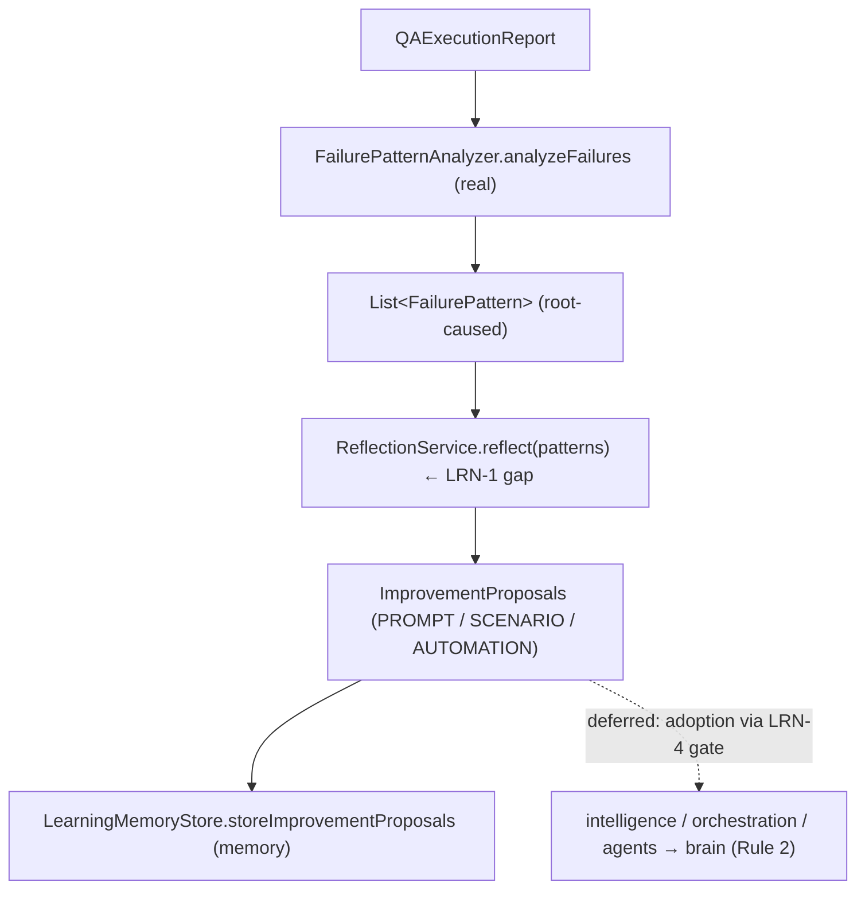

# LRN-1 — Technical Design: Close the Continuous-Learning Loop

**Version:** 1.0.0
**Document Type:** Implementation Technical Design
**Document Status:** Implemented — 2026-07-28 (§0.4 = A record-not-adopt; see [Implementation Outcome](#implementation-outcome))
**Last Updated:** 2026-07-28
**Roadmap item:** [`LRN-1`](./AI-QA-OS-Improvement-Roadmap.md#lrn-1--close-the-continuous-learning-loop) (v2.2.0, frozen) — 🟠 P1 · Effort L · Owner Learning + AI/Brain · Phase 4 · v2.2
**Modules:** `ai-qa-os-learning` (reflection → improvement proposals; recorded via `memory`).
**Depends on:** OBS-1 (execution data — ✅) · AI-1 (`ConfidenceGate` trust scoring — ✅). De-risked by LRN-4 (safe-adoption gate — **not yet built**, see §0.3).

> **Scope discipline.** LRN-1 closes the loop **Failure Analysis → Root Cause → Improvement → Memory**. The real spine already exists (`LearningEngineImpl` → `FailurePatternAnalyzer` → `LearningMemoryStore`); the **missing middle** is turning root-caused failure patterns into concrete, typed **improvement proposals**. This design fills that gap deterministically and **records** proposals — it does **not auto-adopt** them (adoption is gated on LRN-4, §0.3). The reflection logic is fully buildable/validatable.

---

## 0. Roadmap Verification, What Exists, and the Safety Boundary

### 0.1 What LRN-1 requires

> Wire execution outcomes through analysis into concrete **prompt / scenario / automation improvements**, then back into **memory**. Execution history is stored but not systematically mined. Loop: Execution History → Failure Analysis → Root Cause → Prompt Improvement → Scenario Improvement → Automation Improvement → Memory Update → Future Execution Improvement. Improvement decisions route through `brain` (Rule 2).

### 0.2 Verified current state — the loop is half-built

| Loop stage | Status in code |
|---|---|
| Execution History | ✅ execution entities / artifacts / traces (OBS-1) |
| Failure Analysis → Root Cause | ✅ **real** — `FailurePatternAnalyzer.analyzeFailures(report, history)` produces `FailurePattern`s (errorType, rootCause, impactedComponent, occurrenceCount, confidence); driven by `LearningEngineImpl`. |
| **Prompt / Scenario / Automation Improvement** | ❌ **missing** — `ReflectionService`/`ReflectionResult` are empty stubs. No step turns patterns into concrete improvement proposals. |
| Memory Update | ✅ **real** — `LearningMemoryStore` writes patterns/recommendations via `memory` `MemoryStore` (30-day TTL). |
| Future Execution / decision routing | `brain` (Rule 2) — adoption stage. |

**LRN-1's true gap = the improvement stage** (RCA → typed proposals) + recording it. The rest of the loop already runs.

### 0.3 The safety boundary — record, don't adopt (LRN-4 not built)

The roadmap is explicit: *"An autonomous learning loop that adopts changes unconditionally can degrade itself… without a safe-adoption gate, the compounding loop risks compounding mistakes."* That gate is **LRN-4**, which is **not yet implemented**. Therefore LRN-1 **produces and records improvement proposals but does not apply them** — auto-adoption without LRN-4 would create exactly the self-degradation risk the roadmap warns against. Applying proposals (writing new prompt versions, changing scenario/automation, routing through `brain`) is deferred behind LRN-4 (FI-LRN1-A).

### 0.4 / Decision for approval — how much of the loop to close now

| Option | Approach | Trade-off |
|---|---|---|
| **A — Reflection → typed improvement-proposal engine, recorded (not adopted) (recommended)** | Fill the gap: a deterministic `ReflectionService` mapping `FailurePattern`s → `ImprovementProposal`s (`PROMPT`/`SCENARIO`/`AUTOMATION`), wired into `LearningEngineImpl`'s deterministic path and **recorded** via `LearningMemoryStore`. Cross-module **adoption** deferred behind LRN-4. | Closes the analysis→improvement→memory arc, fully validatable, and **safe** (no unconditional self-modification). Doesn't change prompts/scenarios/scripts yet. |
| **B — Full cross-module adoption now** | Also write proposals back into `intelligence` (new prompt versions), `orchestration` (scenario), `agents` (automation), routed through `brain`. | "Complete" loop, but needs live modules + the **missing LRN-4 gate**, is largely unvalidatable here, and is **unsafe** — unconditional adoption is the exact danger LRN-4 exists to prevent. |

**Recommend A** — close the loop through *recorded proposals* now, and gate *adoption* on LRN-4. This delivers the real missing stage, is deterministic and testable, and respects the roadmap's own safety argument (LRN-1 is explicitly "de-risked by LRN-4").

> ✅ **Decision (confirmed 2026-07-28): Option A — reflection → typed improvement proposals, recorded (not adopted); cross-module adoption gated on LRN-4 (FI-LRN1-A).** Recorded as ADR-031 (number verified at implement).

---

## 1. Technical Design (Option A)

### 1.1 Improvement-proposal model (`ai-qa-os-learning`, package `…reflection`)
- **`ProposalType`** — `PROMPT`, `SCENARIO`, `AUTOMATION` (the three improvement stages).
- **`ImprovementProposal`** — `proposalId`, `type`, `targetComponent` (from the pattern's impacted component), `rationale`, `sourcePatternId`, `confidence`, `recurring`, `priority` (`HIGH`/`NORMAL`).
- **`ReflectionResult`** (fill stub) — the `List<ImprovementProposal>` + counts by type + a short summary.

### 1.2 Reflection engine
- **`ReflectionService`** (fill stub interface) — `ReflectionResult reflect(List<FailurePattern> patterns)`.
- **`DefaultReflectionService`** (`@Component`) — deterministic mapping by `errorType` / impacted component:
  - locator/selector/element/stale → **AUTOMATION** (script/locator fix);
  - prompt/hallucination/generation/LLM → **PROMPT** improvement;
  - coverage/scenario/missing/assertion → **SCENARIO** improvement;
  - otherwise → a low-priority **AUTOMATION** stabilisation proposal.
  - `occurrenceCount ≥ recurringThreshold` (default 3) → `recurring=true`, `priority=HIGH`; confidence carried from the pattern.

### 1.3 Recording (close the arc)
- **`LearningMemoryStore.storeImprovementProposals(...)`** (new, mirrors `storeFailurePatterns`) — persists proposals via `memory` `MemoryStore` under `learning:improvement_proposals` (30-day TTL).
- **`LearningEngineImpl`** (real) — in the deterministic heuristic path, after pattern analysis: call the (optional, null-safe field-injected) `ReflectionService`, **record** the proposals, and emit a summary `LearningEvent`. Additive; the agent path and existing behaviour are untouched.

### 1.4 What LRN-1 defers
Applying proposals — writing new `PromptVersionEntity` (intelligence), scenario changes (orchestration/WF-1), automation changes (agents/`ScriptGeneratorAgent`), all routed through `brain` (Rule 2) — **gated on LRN-4** (FI-LRN1-A) · learning metrics/score (LRN-2) · dashboard (LRN-3) · `DecisionService` brain-routing stub (FI-LRN1-B).

---

## 2. Folder Structure

```
ai-qa-os-learning/.../reflection/
    ProposalType.java          [N] PROMPT / SCENARIO / AUTOMATION
    ImprovementProposal.java   [N] typed proposal (target, rationale, confidence, priority)
    ReflectionResult.java      [F] proposals + counts + summary
    ReflectionService.java     [F] interface: reflect(patterns) → result
    DefaultReflectionService.java [N] deterministic pattern → proposal mapping
ai-qa-os-learning/.../memory/
    LearningMemoryStore.java   [E] + storeImprovementProposals / getImprovementProposals
ai-qa-os-learning/.../engine/
    LearningEngineImpl.java    [E] wire reflection into the heuristic path (null-safe) + record
+ unit tests: DefaultReflectionService (each mapping, recurring→HIGH, confidence carried, empty).
    ([N]=new, [F]=fill stub, [E]=edit existing)
```

---

## 3. Required Classes (key)

| Class | Type | Responsibility |
|---|---|---|
| `ProposalType` / `ImprovementProposal` | New | Typed improvement-proposal model |
| `ReflectionResult` / `ReflectionService` | Fill | Result + reflection contract |
| `DefaultReflectionService` | New | `FailurePattern` → `ImprovementProposal` (deterministic) |
| `LearningMemoryStore` | Edit | + record/read improvement proposals |
| `LearningEngineImpl` | Edit | Wire reflection into the loop + record (null-safe) |

---

## 4. Database Changes

**None.** Proposals are recorded via the existing `memory` `MemoryStore` (key/TTL), exactly like failure patterns. No new schema.

---

## 5. API Changes

**None.** LRN-1 is internal loop wiring; no new public endpoint. (Surfacing proposals/metrics is LRN-2/LRN-3.)

---

## 6. Sequence Diagram



---

## 7. Step-by-Step Implementation Plan

1. **Model** — `ProposalType`, `ImprovementProposal`; fill `ReflectionResult`.
2. **Engine** — fill `ReflectionService`; add `DefaultReflectionService` (deterministic mapping; recurring→HIGH).
3. **Record** — `LearningMemoryStore.storeImprovementProposals` / `getImprovementProposals` (mirror existing).
4. **Wire** — `LearningEngineImpl` heuristic path: optional `ReflectionService` → reflect → record → summary `LearningEvent` (null-safe, additive).
5. **Tests** — `DefaultReflectionService`: each mapping (locator→AUTOMATION, prompt→PROMPT, coverage→SCENARIO, generic→AUTOMATION), recurring→HIGH + flag, confidence/target carried, empty→empty. No Mockito.
6. **Build & validate** — `mvn -pl ai-qa-os-learning -am test` (targeted); reflection green; existing learning tests unaffected.
7. **Sync docs** — tracker `LRN-1`; **ADR-031** (close the loop via recorded improvement proposals; adoption gated on LRN-4). Verify ADR number at implement.

**Definition of Done:** root-caused failure patterns are turned into typed, prioritised improvement proposals and recorded back into memory — closing the analysis→improvement→memory arc deterministically and safely (no auto-adoption). **Deferred:** applying proposals (gated on LRN-4), metrics (LRN-2), dashboard (LRN-3), brain-routing.

---

## Implementation Outcome

Implemented 2026-07-28 (§0.4 = A — reflection → recorded improvement proposals; adoption gated on LRN-4). Recorded as **ADR-031**.

**Files (`ai-qa-os-learning`; [N]=new, [F]=fill stub, [E]=edit existing):**
- **reflection/** — `ProposalType` [N] (PROMPT/SCENARIO/AUTOMATION), `ImprovementProposal` [N] (type/target/rationale/sourcePatternId/confidence/recurring/priority), `ReflectionResult` [F] (proposals + `countsByType` + `summary`), `ReflectionService` [F], `DefaultReflectionService` [N] (deterministic `FailurePattern`→proposal by error signature; `occ≥3` or `conf≥0.8`→HIGH).
- **memory/** — `LearningMemoryStore` [E] + `storeImprovementProposals`/`getImprovementProposals` (key `learning:improvement_proposals`, mirrors existing store; added to `clear()`).
- **engine/** — `LearningEngineImpl` [E] — heuristic path now reflects patterns → records proposals → emits an `IMPROVEMENT_PROPOSAL` `LearningEvent`; reflector is `@Autowired(required=false)` (null-safe), agent path untouched.

**Validation (Maven):** `mvn -pl ai-qa-os-learning -am test` → **BUILD SUCCESS** (full dependency reactor, 8 modules green); learning **21 tests** — `DefaultReflectionServiceTest` **9** (each mapping, recurring→HIGH, high-confidence→HIGH, carried fields, empty/null, counts-by-type) + **12** existing learning tests unaffected (incl. `LearningMemoryStoreTest`). Ran with `-Djacoco.skip=true` (JaCoCo 0.8.12 vs Java 25 bytecode — toolchain, not code). *Note: one run showed a transient `StackOverflowError` in an upstream module's JUnit run that did not reproduce on re-run; `ai-qa-os-agents` in isolation and the full reactor both pass.*

**Honest scope note:** the **reflection engine + recording are fully unit-proven**. **Deferred (by design + safety):** applying proposals — the loop **records but does not adopt** — pending LRN-4's safe-adoption gate (FI-LRN1-A); brain-routing `DecisionService` (FI-LRN1-B); outcome feedback (FI-LRN1-C, ties to LRN-2).

---

## Appendix — Future Ideas (Outside Current Roadmap)

- **FI-LRN1-A** — ✅ **Gating realized (2026-07-29, ADR-038):** `ProposalAdoptionCoordinator` now routes proposals through the LRN-4 `SafeAdoptionGate` (admit/reject). *Remaining:* applying admitted proposals — write prompt versions (intelligence), scenario/automation changes (orchestration/agents), routed through `brain`.
- **FI-LRN1-B** — Fill `DecisionService` as the brain-routing decision stage for proposals.
- **FI-LRN1-C** — Feed proposal outcomes back as a learning signal (did an adopted proposal improve the next run?) — ties to LRN-2.

---

## Compliance Checklist

| Rule | Status |
|---|---|
| Roadmap not modified | ✅ LRN-1 metadata untouched |
| Builds on existing loop assets | ✅ reuses `FailurePatternAnalyzer` + `LearningMemoryStore`; fills the reflection gap |
| Dependency reality | ✅ stays within `learning` (+ `core`/`memory`); no new module/dep |
| Safety (roadmap's own argument) | ✅ records proposals, does **not** auto-adopt (adoption gated on LRN-4) |
| Non-breaking | ✅ additive; agent path + existing tests untouched; no schema/API |
| ADR discipline | ✅ ADR-031 to be recorded (number verified at implement) |

---

## Document Completion Status

**Status:** Implemented — 2026-07-28 (§0.4 = A). See [Implementation Outcome](#implementation-outcome). ADR-031.
**Version:** 1.0.0
**Implements:** `LRN-1` (roadmap v2.2.0, frozen) — closes the loop via recorded improvement proposals; adoption deferred to LRN-4.
**Next step:** On approval + option choice, execute [§7](#7-step-by-step-implementation-plan) from Step 1. No code until approved.
