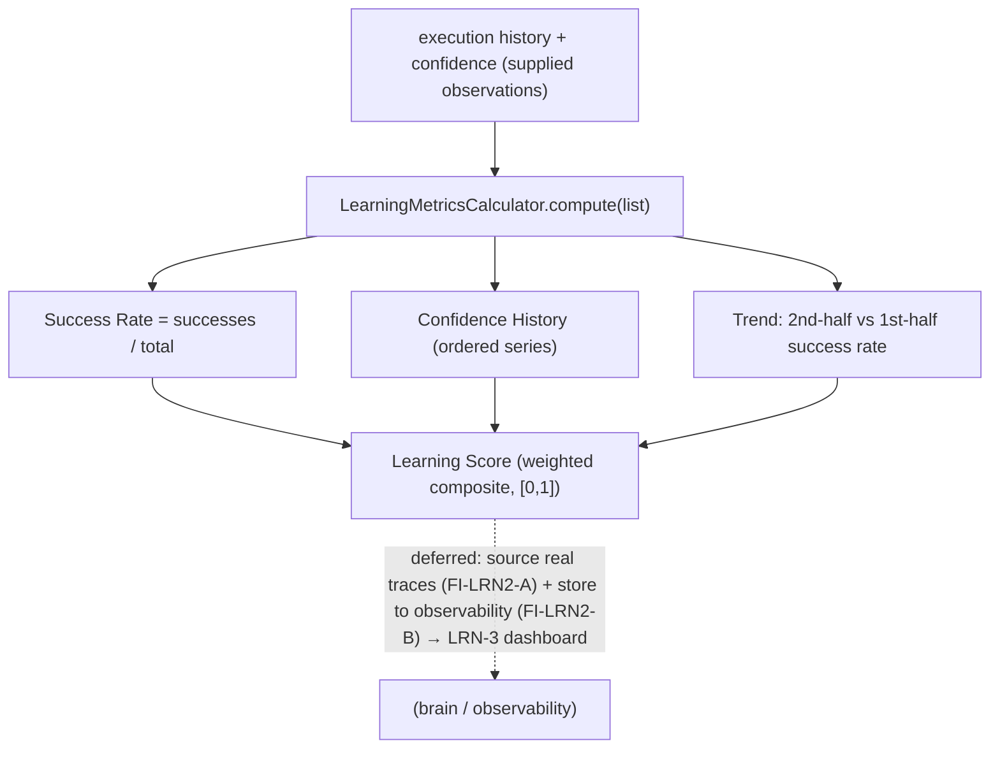

# LRN-2 — Technical Design: Learning Metrics

**Version:** 1.0.0
**Document Type:** Implementation Technical Design
**Document Status:** Implemented — 2026-07-28 (§0.4 = A compute-over-supplied; see [Implementation Outcome](#implementation-outcome))
**Last Updated:** 2026-07-28
**Roadmap item:** [`LRN-2`](./AI-QA-OS-Improvement-Roadmap.md#lrn-2--learning-metrics) (v2.2.0, frozen) — 🟡 P2 · Effort M · Owner Learning + Observability · Phase 4 · v2.2
**Modules:** `ai-qa-os-learning` (metrics computation).
**Depends on:** LRN-1 (the loop these metrics measure — ✅).

> **Scope discipline.** LRN-2 answers "is the platform actually getting better?" with three measured metrics — **Learning Score**, **Success Rate**, **Confidence History** — plus a trend (improving / stable / regressing). The **computation is pure and fully validatable**. Reading real `ReasoningTraceEntity`/execution history and storing the result as observability metrics are cross-module wiring, deferred (§0.3).

---

## 0. Roadmap Verification, What Exists, and the Cross-Module Reality

### 0.1 What LRN-2 requires

> "Is the platform getting better?" must be measurable. **Learning Score**, **Success Rate**, **Confidence History** quantify improvement over time and expose regressions. **Where:** computed in `ai-qa-os-learning` from execution history + `ReasoningTraceEntity`/confidence scores; stored as observability metrics. Feeds the Learning Dashboard (LRN-3).

### 0.2 Verified current state

| Fact | Detail |
|---|---|
| The loop to measure exists | LRN-1: `FailurePattern`s (carry confidence), `ImprovementProposal`s (carry confidence), `LearningMemoryStore`; execution outcomes. |
| Confidence source | `ReasoningTraceEntity` is in **`ai-qa-os-brain`**; confidence also rides `FailurePattern`/proposals/decisions. |
| **Cross-module wall** | `ai-qa-os-learning` depends on `core`/`memory`/`agents` — **not `brain`, not `observability`.** So learning can't read `ReasoningTraceEntity` directly nor push to observability metric repositories. |

### 0.3 Environment reality

- **Buildable + validatable now:** the metric **computation** — Success Rate, Confidence History, a composite Learning Score, and a trend — over a supplied series of learning observations (outcome + confidence over time). Pure arithmetic, unit-testable.
- **Deferred:** sourcing observations from **real** execution history + `ReasoningTraceEntity` (needs a `brain`/history read — cross-module) and **storing** the metrics into `observability` (needs an `observability` edge + DB). Both are wiring, not logic.

### 0.4 / Decision for approval — scope

| Option | Approach | Trade-off |
|---|---|---|
| **A — Metrics calculator over a supplied observation series (recommended)** | A `LearningMetricsCalculator` in `learning` computing `LearningMetrics` (Learning Score, Success Rate, Confidence History, trend) from a `List<LearningObservation>`; weights/epsilon config-driven. Sourcing real history + observability storage deferred. | Pure, deterministic, fully validatable; respects dependency direction (no `brain`/`observability` edge). Doesn't read real traces or persist yet. |
| **B — Also wire real sources + observability storage now** | Add `brain`/`observability` dependencies to `learning`, read `ReasoningTraceEntity` + execution history, and persist to observability metric repos. | "Complete", but inverts/expands the module graph, needs a DB, and is largely unvalidatable here — wiring risk with no logic gain. |

**Recommend A** — the metric *definitions* are the substance and are provable now; sourcing and storage are wiring that belongs with the LRN-3 dashboard and a history-read seam. Compute over supplied observations, defer the plumbing (FI-LRN2-A/B).

> ✅ **Decision (confirmed 2026-07-28): Option A — metrics calculator over a supplied observation series; real-source wiring + observability storage deferred (FI-LRN2-A/B).** Recorded as ADR-034 (number verified at implement).

> **Composite Learning Score (made, not a fork):** `score = successWeight·successRate + confidenceWeight·avgConfidence + trendWeight·trendBonus`, clamped to [0,1] (defaults 0.5 / 0.3 / 0.2; trendBonus improving 1.0 / stable 0.5 / regressing 0.0). All weights + the trend epsilon are config-overridable (`aiqaos.learning.metrics.*`).

---

## 1. Technical Design (Option A)

### 1.1 Model (`ai-qa-os-learning`, package `…metrics`)
- **`LearningObservation`** — one datapoint in time order: `sequence` (or timestamp), `success` (boolean outcome), `confidence` (0..1), `label`.
- **`LearningTrend`** — `IMPROVING` / `STABLE` / `REGRESSING`.
- **`LearningMetrics`** — `learningScore`, `successRate`, `avgConfidence`, `confidenceHistory` (ordered), `sampleCount`, `trend`.

### 1.2 Calculator
- **`LearningMetricsCalculator`** (`@Component`) — `compute(List<LearningObservation>)`:
  - **Success Rate** = successes / total.
  - **Confidence History** = the confidences in order (the series LRN-3 plots).
  - **Trend** = compare the second half's success rate to the first half's; `> +epsilon` → IMPROVING, `< −epsilon` → REGRESSING, else STABLE (epsilon default 0.05).
  - **Learning Score** = the weighted composite (§0.4), clamped [0,1].
  - Empty input → zeroed metrics, `STABLE`.
- **`LearningMetricsProperties`** — `aiqaos.learning.metrics.*` (weights, trend epsilon).

### 1.3 What LRN-2 defers
Sourcing observations from real execution history + `ReasoningTraceEntity` (a history-read seam, cross-module — FI-LRN2-A) · storing the computed metrics into `observability` (FI-LRN2-B) · the dashboard view (LRN-3) · alerting on `REGRESSING` (FI-LRN2-C).

---

## 2. Folder Structure

```
ai-qa-os-learning/.../metrics/
    LearningObservation.java     [N] one time-ordered datapoint (success + confidence)
    LearningTrend.java           [N] IMPROVING / STABLE / REGRESSING
    LearningMetrics.java         [N] score + successRate + confidenceHistory + trend
    LearningMetricsProperties.java [N] aiqaos.learning.metrics.* (weights, epsilon)
    LearningMetricsCalculator.java [N] compute(observations) → LearningMetrics
+ unit tests: calculator (successRate, trend improving/stable/regressing, score range, empty, history order).
```

---

## 3. Required Classes (key)

| Class | Type | Responsibility |
|---|---|---|
| `LearningObservation` / `LearningMetrics` / `LearningTrend` | New | The metrics model |
| `LearningMetricsCalculator` | New | Compute the three metrics + trend |
| `LearningMetricsProperties` | New | `aiqaos.learning.metrics.*` |

---

## 4. Database Changes

**None.** Computation is stateless; persisting metrics into observability is deferred (FI-LRN2-B).

---

## 5. API Changes

**None.** (A metrics endpoint arrives with the LRN-3 dashboard.)

---

## 6. Sequence Diagram



---

## 7. Step-by-Step Implementation Plan

1. **Model** — `LearningObservation`, `LearningTrend`, `LearningMetrics`.
2. **Calculator** — `LearningMetricsProperties` + `LearningMetricsCalculator` (successRate, confidence history, trend, weighted score).
3. **Tests** — successRate arithmetic, trend improving/stable/regressing, score in [0,1], confidence-history ordering, empty input. No Mockito.
4. **Build & validate** — `mvn -pl ai-qa-os-learning -am test` (targeted); calculator green; existing learning tests unaffected.
5. **Sync docs** — tracker `LRN-2`; **ADR-034** (learning metrics computed in-module over supplied observations; sourcing + observability storage deferred). Verify ADR number at implement.

**Definition of Done:** given a time-ordered series of learning observations, the calculator reports Success Rate, Confidence History, a composite Learning Score, and an improving/stable/regressing trend — deterministic and unit-proven. **Deferred:** real-source wiring, observability storage, dashboard, regression alerting.

---

## Implementation Outcome

Implemented 2026-07-28 (§0.4 = A — metrics computed over a supplied observation series). Recorded as **ADR-034**.

**Files (all new, `ai-qa-os-learning/.../metrics/`):**
- `LearningTrend` (IMPROVING/STABLE/REGRESSING), `LearningObservation` (sequence + success + confidence), `LearningMetrics` (learningScore + successRate + avgConfidence + confidenceHistory + sampleCount + trend), `LearningMetricsProperties` (`aiqaos.learning.metrics.*` weights + epsilon).
- `LearningMetricsCalculator` — Success Rate = successes/n; Confidence History = ordered series; Trend = 2nd-half vs 1st-half success rate ±epsilon; Learning Score = weighted composite clamped [0,1]; empty input → `LearningMetrics.empty()`.

**Dependency-safe:** stayed within `ai-qa-os-learning` — **no `brain`/`observability` edge** (computes over supplied observations).

**Validation (Maven):** `mvn -pl ai-qa-os-learning -am test` → **BUILD SUCCESS**; `LearningMetricsCalculatorTest` **7/7** (successRate arithmetic, improving/stable/regressing trend, confidence-history order + avg, composite score = 0.75 exact within [0,1], empty→stable). Existing learning tests (reflection 9, memory 2) unaffected. Ran with `-Djacoco.skip=true` (JaCoCo 0.8.12 vs Java 25 — toolchain).

**Honest scope note:** the **metric computation is fully unit-proven**. **Deferred:** sourcing observations from real execution history/`ReasoningTraceEntity` (FI-LRN2-A); persisting to `observability` (FI-LRN2-B); the LRN-3 dashboard; alerting on `REGRESSING` (FI-LRN2-C).

---

## Appendix — Future Ideas (Outside Current Roadmap)

- **FI-LRN2-A** — A history-read seam sourcing observations from real execution history + `ReasoningTraceEntity` (cross-module).
- **FI-LRN2-B** — Persist computed metrics into `observability` for the dashboard.
- **FI-LRN2-C** — Alert / stop-loss when the trend is `REGRESSING` (ties to LRN-4's monotonic guarantee).

---

## Compliance Checklist

| Rule | Status |
|---|---|
| Roadmap not modified | ✅ LRN-2 metadata untouched |
| Computed in `ai-qa-os-learning` | ✅ calculator in-module |
| Dependency reality | ✅ no `brain`/`observability` edge; computes over supplied observations |
| Non-breaking | ✅ additive; no schema/API |
| Honesty (ADR-009) | ✅ sourcing + storage flagged deferred |
| ADR discipline | ✅ ADR-034 to be recorded (number verified at implement) |

---

## Document Completion Status

**Status:** Implemented — 2026-07-28 (§0.4 = A). See [Implementation Outcome](#implementation-outcome). ADR-034.
**Version:** 1.0.0
**Implements:** `LRN-2` (roadmap v2.2.0, frozen) — learning-metrics computation; sourcing + storage deferred.
**Next step:** On approval + option choice, execute [§7](#7-step-by-step-implementation-plan) from Step 1. No code until approved.
