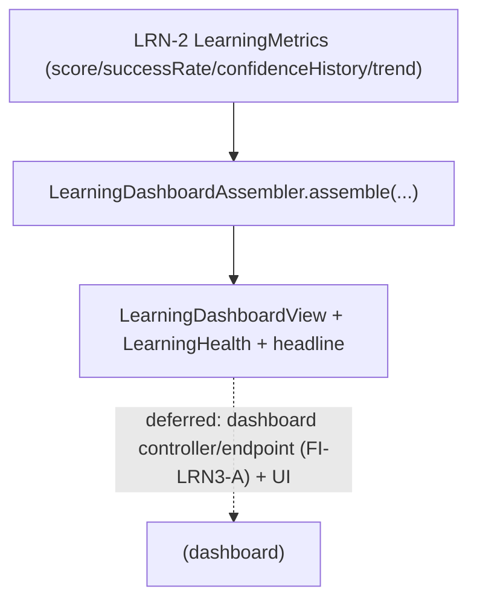

# LRN-3 — Technical Design: Learning Dashboard (Read-Model Increment)

**Version:** 1.0.0
**Document Type:** Implementation Technical Design
**Document Status:** Read-model implemented — 2026-07-29 (§0.4 = A; LRN-3 remains In Progress; see [Implementation Outcome](#implementation-outcome))
**Last Updated:** 2026-07-29
**Roadmap item:** [`LRN-3`](./AI-QA-OS-Improvement-Roadmap.md#lrn-3--learning-dashboard) (v2.2.0, frozen) — 🟡 P2 · Effort S · Owner Dashboard · Phase 4 · v2.2
**Modules:** `ai-qa-os-learning` (dashboard read-model over LRN-2 metrics).
**Depends on:** LRN-2 (`LearningMetrics` — ✅) · OBS-3 (dashboards suite).

> **Scope discipline.** LRN-3 makes the improvement trend **visible and governable**. This increment delivers the **dashboard read-model** — composing LRN-2's `LearningMetrics` into a presentation-ready view plus a **health signal** (healthy / at-risk) — **fully validatable**. The dashboard **UI** (frontend) and the dashboard-module controller wiring are deferred (§0.3), so **LRN-3 lands `In Progress`**.

---

## 0. Roadmap Verification & Scope

### 0.1 What LRN-3 requires
> Stakeholders need to *see* the improvement trend to trust autonomous operation. **A dashboard view over the LRN-2 metrics**, part of the dashboards suite (OBS-3). Presentation only; makes learning visible and governable.

### 0.2 Verified state & placement
- LRN-2's `LearningMetrics` (Learning Score / Success Rate / Confidence History / trend) lives in **`ai-qa-os-learning`**.
- The **dashboard module does not depend on `learning`** — so the read-model that composes `LearningMetrics` belongs in `ai-qa-os-learning`; the dashboard controller/UI is deferred cross-module wiring.

### 0.3 Environment reality
- **Validatable now:** a `LearningDashboardView` + a pure `LearningDashboardAssembler` that turns `LearningMetrics` into a presentation view and derives a **`LearningHealth`** signal (`AT_RISK` when regressing or the score is low; else `HEALTHY`) + a headline. Pure logic.
- **Deferred:** the dashboard **UI** (frontend, not verifiable here); the dashboard-module controller/endpoint (needs a `dashboard → learning` dependency — FI-LRN3-A); a persisted time-series of metric snapshots (FI-LRN3-B).

### 0.4 / Decision for approval — scope

| Option | Approach | Trade-off |
|---|---|---|
| **A — Dashboard read-model in `learning` now; UI + controller deferred (recommended)** | `LearningDashboardView` + pure `LearningDashboardAssembler(LearningMetrics)` + `LearningHealth`. UI + dashboard-module controller deferred. LRN-3 → `In Progress`. | The presentation substance + a governance-useful health signal, fully validatable, zero blast radius. No UI/endpoint yet. |
| **B — Also add a `dashboard → learning` dependency + a controller now** | Wire an endpoint in the dashboard module. | The endpoint is thin plumbing and the UI is still frontend; adds a cross-module edge for little validatable gain. |

**Recommend A** — deliver the read-model + health signal (the substance) now; the endpoint + UI are presentation wiring (FI-LRN3-A).

> ✅ **Decision (confirmed 2026-07-29): Option A — `LearningDashboardView` + pure `LearningDashboardAssembler` + `LearningHealth` in `ai-qa-os-learning`; UI + dashboard-module controller deferred (FI-LRN3-A). LRN-3 → In Progress.** Recorded as ADR-050 (number verified at implement).

---

## 1. Technical Design (Option A)

`ai-qa-os-learning`, package `com.aiqaos.learning.dashboard`:
- **`LearningHealth`** — `HEALTHY`, `AT_RISK`.
- **`LearningDashboardView`** — `learningScore`, `successRate`, `avgConfidence`, `confidenceHistory` (the trend series to plot), `trend`, `sampleCount`, `health`, `headline`.
- **`LearningDashboardAssembler`** (`@Component`, pure) — `assemble(LearningMetrics)`: copy the metrics into the view; derive `health` (`AT_RISK` if `trend == REGRESSING` **or** `learningScore < 0.5`, else `HEALTHY`) and a `headline` (e.g. `"Learning improving — score 0.75"`).

**Defers:** dashboard UI · dashboard-module controller/endpoint (FI-LRN3-A) · persisted metric time-series (FI-LRN3-B).

---

## 2. Folder Structure
```
ai-qa-os-learning/.../dashboard/
    LearningHealth.java            [N] HEALTHY / AT_RISK
    LearningDashboardView.java     [N] score/successRate/confidenceHistory/trend/health/headline
    LearningDashboardAssembler.java [N] @Component: assemble(LearningMetrics) → view
+ unit tests: assembler (improving→HEALTHY, regressing→AT_RISK, low-score→AT_RISK, headline, series carried).
```

---

## 3–5. Classes / DB / API
Key classes above. **DB:** none. **API:** none (endpoint is deferred UI wiring).

---

## 6. Sequence


---

## 7. Plan
1. **Model** — `LearningHealth`, `LearningDashboardView`.
2. **Assembler** — `LearningDashboardAssembler.assemble(LearningMetrics)` (view + health + headline).
3. **Tests** — improving→HEALTHY; regressing→AT_RISK; low-score(<0.5)→AT_RISK; headline text; confidence-history carried through. No Mockito.
4. **Build & validate** — targeted `mvn -pl ai-qa-os-learning -am test -Dtest=… -Djacoco.skip=true -DargLine="-Xss40m"`; green; LRN-1/2/4 tests unaffected.
5. **Sync docs** — tracker `LRN-3` → **In Progress** (read-model; UI deferred); **ADR-050** (learning-dashboard read-model + health signal in `learning`). Verify number at implement.

**DoD (this increment):** LRN-2 metrics compose into a presentation view with a healthy/at-risk signal + headline — unit-proven. **Deferred:** dashboard UI, controller/endpoint, metric time-series. LRN-3 stays In Progress.

---

## Implementation Outcome

Read-model implemented 2026-07-29 (§0.4 = A — dashboard read-model + health signal). Recorded as **ADR-050**. **LRN-3 remains In Progress** (UI + controller deferred).

**Files (all new, `ai-qa-os-learning/.../dashboard/`):**
- `LearningHealth` (HEALTHY/AT_RISK), `LearningDashboardView` (score/successRate/avgConfidence/confidenceHistory/trend/sampleCount/health/headline), `LearningDashboardAssembler` (`@Component`, pure `assemble(LearningMetrics)` — health = AT_RISK if trend REGRESSING or score < 0.5; headline).

**Validation (Maven):** `mvn -pl ai-qa-os-learning -am test` → **BUILD SUCCESS**; `LearningDashboardAssemblerTest` **6/6** (improving+good→HEALTHY, regressing→AT_RISK even with good score, low-score→AT_RISK, stable+good→HEALTHY, confidence-history carried, null→AT_RISK placeholder). LRN-1/2/4 tests green. Ran with `-Djacoco.skip=true -DargLine="-Xss40m"`. No-arg `@Component` — no wiring traps.

**Honest scope note:** the **read-model + health signal are unit-proven**. **Deferred:** the dashboard **UI** (frontend, not verifiable here); the dashboard-module controller/endpoint (needs a `dashboard → learning` dependency — FI-LRN3-A); a persisted metric time-series for a historical chart (FI-LRN3-B). LRN-3 stays In Progress.

---

## Appendix — Future Ideas
- **FI-LRN3-A** — Dashboard-module controller/endpoint (add `dashboard → learning`) + the UI view.
- **FI-LRN3-B** — Persist a time-series of metric snapshots for a real historical trend chart.

---

## Compliance Checklist
| Rule | Status |
|---|---|
| Roadmap not modified | ✅ LRN-3 metadata untouched |
| Over LRN-2 metrics | ✅ composes `LearningMetrics` |
| Dependency reality | ✅ read-model in `learning` (dashboard doesn't depend on learning) |
| Honest status | ✅ LRN-3 → In Progress (read-model; UI deferred) |
| Non-breaking | ✅ additive; LRN-2 untouched |
| Spring-wiring sanity | ✅ no-arg `@Component` assembler (per 2026-07-29 lesson) |
| ADR discipline | ✅ ADR-050 to be recorded (number verified at implement) |

---

## Document Completion Status
**Status:** Read-model implemented — 2026-07-29 (§0.4 = A). LRN-3 remains In Progress. See [Implementation Outcome](#implementation-outcome). ADR-050.
**Implements:** `LRN-3` (roadmap v2.2.0, frozen) — the dashboard read-model + health signal; UI deferred.
**Next step:** On approval + option choice, execute [§7](#7-step-by-step-implementation-plan) from Step 1.
