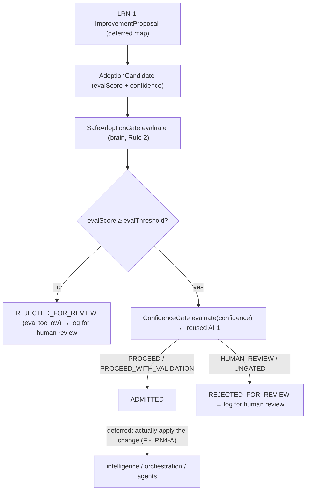

# LRN-4 — Technical Design: Learning Governance & Safe-Adoption Gate

**Version:** 1.0.0
**Document Type:** Implementation Technical Design
**Document Status:** Implemented — 2026-07-28 (§0.4 = A supplied-score gate; see [Implementation Outcome](#implementation-outcome))
**Last Updated:** 2026-07-28
**Roadmap item:** [`LRN-4`](./AI-QA-OS-Improvement-Roadmap.md#lrn-4--learning-governance--safe-adoption-gate) (v2.2.0, frozen) — 🟠 P1 · Effort M · Owner Learning + AI/Brain · Phase 4 · v2.2
**Modules:** `ai-qa-os-core` (gate contract + candidate/decision) · `ai-qa-os-brain` (impl, Rule 2).
**Depends on:** MOD-3 (eval — ✅) · AI-1 (`ConfidenceGate` — ✅, reused) · LRN-1 (produces the proposals this gates — ✅).

> **Scope discipline.** LRN-4 makes learning **monotonic**: a learned improvement is adopted only if it **passes eval** *and* **clears the confidence gate**; otherwise it is **rejected and logged for human review**, never silently dropped. The gate decision logic is fully buildable/validatable. Running real eval to score a candidate, and wiring the gate into an actual adoption path, are deferred (they need the eval/LLM environment and LRN-1→adoption wiring, §0.3).

---

## 0. Roadmap Verification, What Exists, and the Cross-Module Reality

### 0.1 What LRN-4 requires

> Every proposed prompt/scenario/automation change must clear **evaluation** and **confidence** thresholds before adoption. **Where:** a gate in `ai-qa-os-brain` (Rule 2 — all decisions through the Brain) that admits a learned improvement only if it passes `ai-qa-os-eval` (MOD-3) **and** clears the confidence gate (AI-1). Rejected improvements are **logged for human review**, not silently dropped. **Impact:** makes continuous learning monotonic; reuses eval + confidence machinery, no new module; de-risks LRN-1.

### 0.2 Verified current state

| Fact | Detail |
|---|---|
| Confidence gate exists (AI-1) | `ConfidenceGate` **contract in `core`**; `ConfidencePolicyManager` (brain) implements it — `evaluate(ConfidenceDecisionContext) → ConfidenceVerdict` (`PROCEED` / `PROCEED_WITH_VALIDATION` / `HUMAN_REVIEW` / `UNGATED`), config thresholds `high 0.90` / `medium 0.70`. |
| LRN-1 produces the input | `ImprovementProposal` (`ai-qa-os-learning`) — the learned changes to gate. |
| Eval exists (MOD-3/PE-1) | `PromptEvaluationService`/`PromptScore` — a measured quality score. |
| **Cross-module wall** | `brain` depends on `core`/`memory`/`intelligence`/`agents`/`orchestration` — **not `learning`, not `eval`.** So the brain gate can neither import LRN-1's `ImprovementProposal` nor call eval's `Evaluator` directly. Same shape as GOV-1/GOV-3/GOV-4. |

### 0.3 The resolution — a core gate abstraction (the ConfidenceGate pattern), and how eval is satisfied

The gate lives in `brain` (Rule 2) but must be fed by `learning`. Neither sees the other, so — exactly as AI-1 did — the **contract goes in `core`** (`SafeAdoptionGate` + `AdoptionCandidate` + `AdoptionDecision`), and the gate operates on the **core-level candidate**, not learning's concrete type. LRN-1's proposals map to candidates when the adoption path is wired (deferred). This is justified now because there is a real second consumer (LRN-1 + the brain gate) — the ADR-010/015 rule.

The candidate **carries** its `evalScore` and `confidence`; the gate **enforces thresholds** over them (just as `ConfidenceGate` enforces a threshold over a *supplied* confidence rather than computing it). Actually **running** eval to produce the score is upstream/deferred (needs the eval module + live LLM for prompt eval).

### 0.4 / Decision for approval — how the gate satisfies the "passes eval" half

| Option | Approach | Trade-off |
|---|---|---|
| **A — Gate enforces thresholds over a supplied `evalScore` + confidence (recommended)** | The `AdoptionCandidate` carries `evalScore` (from MOD-3/PE-1, computed upstream) and `confidence`. `LearningAdoptionGate` (brain) admits iff `evalScore ≥ evalThreshold` **and** the reused `ConfidenceGate` returns a proceed verdict; else `REJECTED_FOR_REVIEW`. Mirrors how AI-1's gate consumes a supplied confidence. | Respects Rule 2 + dependency direction, reuses `ConfidenceGate`, fully validatable now. Running real eval + mapping LRN-1 proposals→candidates deferred. |
| **B — Gate runs eval live inside brain** | Add an `ai-qa-os-eval` dependency to `brain` and invoke `PromptEvaluationService` in the gate. | Truer to "runs eval", but adds a **new module edge** (`brain → eval`) and needs a **live LLM** — larger, unvalidatable here, and couples the Brain to eval internals. |

**Recommend A** — the gate's job is the *decision* (thresholds over eval + confidence), exactly like AI-1 decides over a supplied confidence. Keep eval *execution* upstream/deferred; the gate stays a pure, reusable Brain policy over a `core` contract.

> ✅ **Decision (confirmed 2026-07-28): Option A — gate enforces thresholds over a supplied `evalScore` + confidence, reusing `ConfidenceGate`; live eval execution + LRN-1→candidate mapping deferred (FI-LRN4-A/B).** Recorded as ADR-032 (number verified at implement).

> **Fail-safe nuance (made, not a fork):** for adoption, **unreported confidence (`UNGATED`, `c ≤ 0`) is REJECTED**, not admitted — the opposite of AI-1's *pipeline* safeguard (which treats unreported as `UNGATED` to avoid halting a run). Gating a self-modification must be positively trusted; absence of a confidence signal must not admit a change.

---

## 1. Technical Design (Option A)

### 1.1 Gate contract + types (`ai-qa-os-core`, package `…contract`)
- **`AdoptionKind`** — `PROMPT` / `SCENARIO` / `AUTOMATION` (the core-level vocabulary LRN-1's `ProposalType` maps to).
- **`AdoptionCandidate`** — `candidateId`, `kind`, `evalScore`, `confidence`, `description`, `correlationId`.
- **`AdoptionVerdict`** — `ADMITTED` / `REJECTED_FOR_REVIEW`.
- **`AdoptionDecision`** — `verdict`, `reason`, the underlying `ConfidenceVerdict`, echoed `candidateId`.
- **`SafeAdoptionGate`** — `AdoptionDecision evaluate(AdoptionCandidate candidate)`.

### 1.2 Gate impl (`ai-qa-os-brain`, Rule 2)
- **`LearningAdoptionGate`** (`@Component implements SafeAdoptionGate`) — reuses the injected `ConfidenceGate` (`ConfidencePolicyManager`) for the confidence half and enforces `aiqaos.brain.learning.eval-threshold` (default `0.75`) for the eval half. **Admit iff** `evalScore ≥ evalThreshold` **and** `ConfidenceVerdict ∈ {PROCEED, PROCEED_WITH_VALIDATION}`. Else `REJECTED_FOR_REVIEW` with a reason naming the failed dimension(s); `UNGATED`/`HUMAN_REVIEW` → reject. Rejections are **logged for human review** (WARN) — not dropped.

### 1.3 What LRN-4 defers
Mapping LRN-1 `ImprovementProposal` → `AdoptionCandidate` and wiring the gate into an actual adoption path (writing prompt versions / scenario / automation) — the LRN-1 adoption arc (FI-LRN4-A) · **running** eval (MOD-3/PE-1) to produce the `evalScore` live (FI-LRN4-B) · a durable rejected-adoption log surface for human review (FI-LRN4-C, ties to AI-2).

---

## 2. Folder Structure

```
ai-qa-os-core/.../contract/
    AdoptionKind.java        [N] PROMPT / SCENARIO / AUTOMATION
    AdoptionCandidate.java   [N] evalScore + confidence + kind + ids
    AdoptionVerdict.java     [N] ADMITTED / REJECTED_FOR_REVIEW
    AdoptionDecision.java    [N] verdict + reason + confidenceVerdict
    SafeAdoptionGate.java    [N] evaluate(candidate) → decision
ai-qa-os-brain/.../component/
    LearningAdoptionGate.java [N] @Component: eval-threshold + reused ConfidenceGate
+ unit tests: LearningAdoptionGate (admit, eval-fail, low-confidence, unreported→reject, boundary).
```

---

## 3. Required Classes (key)

| Class | Module | Responsibility |
|---|---|---|
| `AdoptionCandidate` / `AdoptionDecision` / `AdoptionVerdict` / `AdoptionKind` | core | The shared gate vocabulary |
| `SafeAdoptionGate` | core | The gate contract (Rule 2, like `ConfidenceGate`) |
| `LearningAdoptionGate` | brain | eval-threshold + reused `ConfidenceGate` → admit/reject |

---

## 4. Database Changes

**None.** The gate is a stateless decision; rejections are logged. (A durable rejected-adoption review queue is FI-LRN4-C.)

---

## 5. API Changes

**None.** Internal gate; no public endpoint. (Surfacing rejected adoptions for human review rides AI-2/LRN-3.)

---

## 6. Sequence Diagram



---

## 7. Step-by-Step Implementation Plan

1. **Core contract** — `AdoptionKind`, `AdoptionCandidate`, `AdoptionVerdict`, `AdoptionDecision`, `SafeAdoptionGate`.
2. **Brain impl** — `LearningAdoptionGate` (inject `ConfidenceGate` + `@Value eval-threshold`; admit iff eval passes AND confidence proceeds; unreported/low → reject + WARN log).
3. **Tests** — admit (high eval + high/medium-confidence), reject on eval-fail, reject on `HUMAN_REVIEW`, reject on unreported (`UNGATED`) confidence, eval boundary (`==` admits), reason names the failed dimension. Use a `ConfidenceGate` stub (no Mockito).
4. **Build & validate** — `mvn -pl ai-qa-os-brain -am test` (targeted); gate green; AI-1 tests unaffected.
5. **Sync docs** — tracker `LRN-4`; **ADR-032** (safe-adoption gate: core contract + brain impl reusing ConfidenceGate + eval threshold; unreported-confidence fail-safe). Verify ADR number at implement.

**Definition of Done:** a learned-improvement candidate is admitted only when it passes the eval threshold and clears the confidence gate; all other outcomes are rejected and logged for human review — unit-proven. **Deferred:** LRN-1→candidate mapping + real adoption (FI-LRN4-A), live eval scoring (FI-LRN4-B), durable review queue (FI-LRN4-C).

---

## Implementation Outcome

Implemented 2026-07-28 (§0.4 = A — gate enforces thresholds over a supplied evalScore, reusing `ConfidenceGate`). Recorded as **ADR-032**.

**Files (all new; [N]=new):**
- **`ai-qa-os-core`/contract/** — `AdoptionKind` [N] (PROMPT/SCENARIO/AUTOMATION), `AdoptionCandidate` [N] (evalScore + confidence + kind + ids), `AdoptionVerdict` [N] (ADMITTED/REJECTED_FOR_REVIEW), `AdoptionDecision` [N] (verdict + reason + confidenceVerdict; `admitted`/`rejected` factories), `SafeAdoptionGate` [N] (contract, alongside `ConfidenceGate`).
- **`ai-qa-os-brain`/component/** — `LearningAdoptionGate` [N] (`@Component implements SafeAdoptionGate`): injects the AI-1 `ConfidenceGate` + `@Value aiqaos.brain.learning.eval-threshold`(0.75). Admit iff `evalScore ≥ threshold` AND confidence verdict ∈ {PROCEED, PROCEED_WITH_VALIDATION}; else `REJECTED_FOR_REVIEW` with a reason naming the failed dimension(s), logged WARN. `UNGATED`/`HUMAN_REVIEW` → reject.

**Cross-module resolution:** brain depends on neither `learning` nor `eval`, so the contract lives in `core` and the gate operates on the core-level `AdoptionCandidate` (evalScore supplied upstream). Reuses AI-1's `ConfidenceGate` — no new module or dependency edge.

**Validation (Maven):** `mvn -pl ai-qa-os-brain -am test` → **BUILD SUCCESS** (14-module dependency reactor green); `LearningAdoptionGateTest` **8/8** (admit on PROCEED + PROCEED_WITH_VALIDATION, reject on eval-fail / HUMAN_REVIEW / unreported-UNGATED, inclusive eval boundary, both-dimensions reason, null candidate) + AI-1 `ConfidencePolicyManagerTest` **4/4** unaffected. Ran with `-Djacoco.skip=true` (JaCoCo 0.8.12 vs Java 25 bytecode — toolchain, not code).

**Honest scope note:** the **gate decision logic is fully unit-proven**. **Deferred:** mapping LRN-1 `ImprovementProposal` → `AdoptionCandidate` + wiring admitted candidates into a real adoption path (FI-LRN4-A) — this closes LRN-1's deferred arc; running MOD-3/PE-1 eval to produce the `evalScore` live (FI-LRN4-B); a durable rejected-adoption review queue (FI-LRN4-C).

---

## Appendix — Future Ideas (Outside Current Roadmap)

- **FI-LRN4-A** — ✅ **Partly realized (2026-07-29, ADR-038):** `ProposalAdoptionCoordinator` (in `learning`) now maps LRN-1 `ImprovementProposal` → `AdoptionCandidate` and gates it through `SafeAdoptionGate` — the loop is governed end-to-end. *Remaining:* applying an admitted candidate to the real target (prompt versions / scenario / automation).
- **FI-LRN4-B** — Run MOD-3/PE-1 eval to produce the candidate's `evalScore` live (needs the LLM-keyed environment).
- **FI-LRN4-C** — Durable rejected-adoption queue surfaced for human review (reuse AI-2's review surface).

---

## Compliance Checklist

| Rule | Status |
|---|---|
| Roadmap not modified | ✅ LRN-4 metadata untouched |
| Reuses eval + confidence machinery (no new module) | ✅ reuses `ConfidenceGate`; eval score supplied; contract in `core` |
| Rule 2 (decisions through Brain) | ✅ gate impl in `brain` |
| Dependency reality | ✅ contract in `core`; brain needs neither `learning` nor `eval` |
| Non-breaking | ✅ additive; new contract + bean; no schema/API |
| Safety | ✅ monotonic — unreported confidence fails safe; rejections logged, not dropped |
| ADR discipline | ✅ ADR-032 to be recorded (number verified at implement) |

---

## Document Completion Status

**Status:** Implemented — 2026-07-28 (§0.4 = A). See [Implementation Outcome](#implementation-outcome). ADR-032.
**Version:** 1.0.0
**Implements:** `LRN-4` (roadmap v2.2.0, frozen) — safe-adoption gate decision; live eval + real adoption deferred.
**Next step:** On approval + option choice, execute [§7](#7-step-by-step-implementation-plan) from Step 1. No code until approved.
