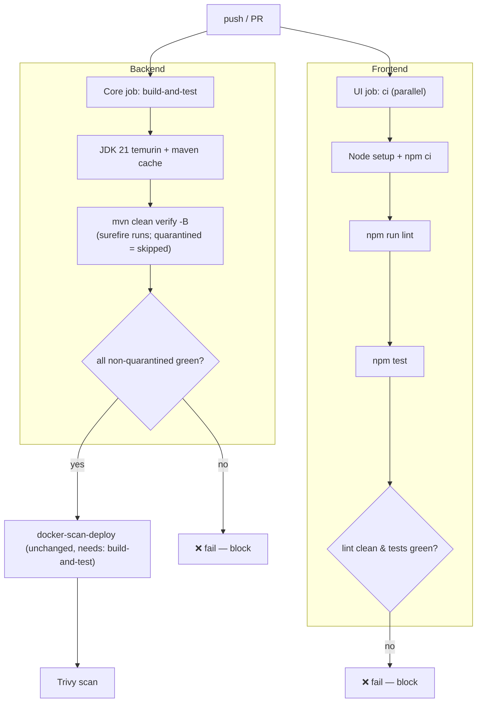

# MNT-1 — Technical Design: Run the Test Suite in CI

**Version:** 1.0.0
**Document Type:** Implementation Technical Design
**Document Status:** Implemented — 2026-07-22 (Option A — Quarantine; see [Implementation Outcome](#implementation-outcome))
**Last Updated:** 2026-07-22
**Roadmap item:** [`MNT-1`](./AI-QA-OS-Improvement-Roadmap.md) (v2.2.0, frozen) — 🔴 P0 · Effort S · Owner Platform Engineering · Phase 0 · v1.3
**Module:** CI (`.github`) — Core repo + UI repo
**Governing ADRs:** none directly (process/CI change). **Blocks:** MNT-2 (push scanned image).

> **Scope discipline.** Implements **only** MNT-1: make CI actually run and **gate on** the test suite. It does **not** fix product code, and does **not** expand into other roadmap items. The one unavoidable coupling — pre-existing failing tests — is handled by **transparent quarantine**, not by silently ignoring failures and not by fixing product logic (which is out of scope and would touch frozen modules).

---

## 0. Roadmap Verification & Current State

### 0.1 What MNT-1 requires (from the finalized roadmap)

> The CI build job runs `mvn clean compile -B` — compile only. Every existing backend test is skipped on every push… Change the build step to `mvn clean verify -B` and add the UI's `npm run lint && npm test` as a parallel job.

### 0.2 Verified current state (read during design)

- **Core CI** — `AI-QA-OS-Core/.github/workflows/deploy.yml`: `build-and-test` runs **`mvn clean compile -B`** (no tests). `docker-scan-deploy` needs it.
- **UI CI** — `ai-qa-os-dashboard-ui` has **no `.github/workflows`** at all.
- **UI baseline (verified):** `npm run lint` (oxlint) exits 0 (warnings only, no errors); `npm test` (vitest) passes 2/2. **The UI side is already green.**
- **Backend baseline (verified via full `mvn test -Dmaven.test.failure.ignore=true`):** **8 tests fail across 3 modules.** Everything else passes. Tests use H2 (no Testcontainers), so CI needs no external services.

### 0.3 The blocker: 8 pre-existing failing tests

| # | Module | Test (method) | Assertion | Likely cause |
|---|---|---|---|---|
| 1 | core | `RequirementParserTest.testParseUS001Success` | `expected <Admin Login> but was <User Story: Admin Login>` | **Logic** (Markdown parse) |
| 2 | core | `RequirementReaderTest.testReadRequirementSuccess` | `expected <true> but was <false>` | **Logic** |
| 3 | execution | `ExecutionEngineTest.testPlaywrightExecutionEngineSuccess` | `expected <true> but was <false>` | **Env** (invokes Playwright/PowerShell) |
| 4 | execution | `ExecutionEngineTest.testPlaywrightExecutionEngineFailFastOnUnsupportedOperationException` | `expected <FAILED> but was <ERROR>` | **Env / logic** |
| 5 | orchestration | `AutonomousQAPipelineTest.testSuccessfulPipelineExecution` | `expected <2> but was <4>` | **Env** (pipeline runs execution) |
| 6 | orchestration | `AutonomousQAPipelineTest.testFailedExecutionWithBugAnalysisBranching` | `expected <true> but was <false>` | **Env / logic** |
| 7 | orchestration | `ExecutionStepIntegrationTest.testExecutionStepIntegration` | `expected <SUCCESS> but was <FAILED>` | **Env** (execution step) |
| 8 | orchestration | `ScriptGeneratorAgentIntegrationTest.testScriptGenerationStepIntegration` | `expected <suite-789> but was <tc-suite-123>` | **Logic** |

**Note (SEC-2 / SEC-1 context):** these are unrelated to the security work; they pre-date it. The `expected/was` messages show real mismatches. The execution/pipeline ones shell out to a Playwright+PowerShell runtime that a CI Ubuntu runner does not have, so they cannot pass on CI regardless of code.

### 0.4 The decision this design turns on

Flipping CI to `verify` with these 8 red would make **every** push red — useless as a gate. Three ways to resolve, **user's call** (see closing question):

| Option | What | Effort | Scope fit |
|---|---|---|---|
| **A — Quarantine (recommended)** | `@Disabled` the 8 failing **methods** with tracked reasons; gate on the ~40 green tests | S | ✅ stays within MNT-1; touches only test annotations, no product logic |
| **B — Fix all 8** | Repair core parser, execution engine, pipeline logic (+ provision Playwright in CI for the env ones) | L–XL | ❌ expands into 3 frozen modules + CI infra; far beyond Effort S |
| **C — Hybrid** | Tag env-dependent tests `requires-playwright` (excluded on CI, still run locally); quarantine/fix the pure-logic ones | M | ➖ more precise, more work |

This design is written for **Option A** (recommended) and notes where B/C diverge. The 8 fixes are captured as tracked follow-ups in [Future Ideas](#appendix--future-ideas-outside-current-roadmap) (the roadmap is frozen, so they are not new roadmap items — the user schedules them).

> ✅ **Decision (confirmed 2026-07-22): Option A — Quarantine.** The 8 failing methods are `@Disabled` with tracked reasons; CI gates the passing suite. No product logic changed under MNT-1.

---

## 1. Technical Design

### 1.1 Design decision

Two CI changes plus a transparent quarantine:

1. **Core repo** — change `build-and-test` from `mvn clean compile -B` to **`mvn clean verify -B`**. Tests now run and **block** the pipeline (and therefore `docker-scan-deploy`). No Testcontainers needed — H2 covers the tests.
2. **UI repo** — add `.github/workflows/ci.yml` running **`npm ci && npm run lint && npm test`** on push/PR. Already green today, so it gates immediately.
3. **Quarantine (Option A)** — annotate the 8 failing **methods** with `@Disabled("MNT-1 quarantine: pre-existing failure; re-enable when fixed — see FI-MNT1-*")`. Method-level (not class-level) so the passing tests in the same classes keep running. This is **transparent** (loud reason strings + a tracked list), never a silent skip.

### 1.2 Why quarantine rather than `continue-on-error` or `-DskipTests` tricks

- `continue-on-error`/`--fail-never` would make the job green while tests fail — a fake gate (worse than today).
- `@Disabled` with a reason is visible in every test report (`skipped` count + reason), greppable, and reversible per-test. It makes the gate **real for everything not quarantined** while making the debt explicit.

### 1.3 Gate semantics after MNT-1

| Event | Result |
|---|---|
| A push breaks any **non-quarantined** test | ❌ CI red — merge/deploy blocked |
| UI lint error or test failure | ❌ CI red |
| A quarantined test is fixed and re-enabled | ✅ counts toward the gate thereafter |
| All green | ✅ proceeds to `docker-scan-deploy` |

---

## 2. Folder Structure

`[M]` modified, `[N]` new. No production source changes; test files change **annotations only**.

```
AI-QA-OS-Core/
├── .github/workflows/
│   └── deploy.yml                                             [M] mvn clean compile -B → mvn clean verify -B
├── ai-qa-os-core/src/test/java/com/aiqaos/core/requirement/
│   ├── RequirementParserTest.java                             [M] @Disabled on testParseUS001Success
│   └── RequirementReaderTest.java                             [M] @Disabled on testReadRequirementSuccess
├── ai-qa-os-execution/src/test/java/com/aiqaos/execution/engine/
│   └── ExecutionEngineTest.java                               [M] @Disabled on 2 methods
└── ai-qa-os-orchestration/src/test/java/com/aiqaos/workflow/pipeline/
    ├── AutonomousQAPipelineTest.java                          [M] @Disabled on 2 methods
    ├── ExecutionStepIntegrationTest.java                      [M] @Disabled on 1 method
    └── ScriptGeneratorAgentIntegrationTest.java               [M] @Disabled on 1 method

ai-qa-os-dashboard-ui/
└── .github/workflows/
    └── ci.yml                                                 [N] npm ci && npm run lint && npm test
```

> Under **Option C**, add `@Tag("requires-playwright")` to the env-dependent tests and a surefire `<excludedGroups>` in the affected POMs instead of `@Disabled`. Not used in Option A.

---

## 3. Required Classes

**No production classes.** MNT-1 is CI + test annotations only.

| Artifact | Type | Change |
|---|---|---|
| `deploy.yml` (Core) | **Modified** | `compile` → `verify`; optional explicit "Run tests" step name |
| `ci.yml` (UI) | **New** | Node setup + `npm ci` + `npm run lint` + `npm test`, on push & PR |
| 6 test files (8 methods) | **Modified** | Add `@Disabled(reason)` — **no test logic altered, nothing deleted** |

---

## 4. Database Changes

**None.** Tests run against H2 (already configured in the relevant modules' test profiles). No schema, no migration, no external DB in CI.

---

## 5. API Changes

**None.** No runtime behaviour changes. MNT-1 affects only the build pipeline.

---

## 6. Sequence Diagram



---

## 7. Step-by-Step Implementation Plan

1. **Verify (read-only).** Read each of the 8 failing tests to confirm method-level quarantine points and the passing siblings to preserve. Confirm the env-vs-logic split (informs the follow-up tickets, and Option C if chosen).
2. **Quarantine (Option A).** Add `@Disabled("MNT-1 quarantine: pre-existing failure prior to CI gate; tracked FI-MNT1-*; re-enable when fixed")` to the 8 methods. Import `org.junit.jupiter.api.Disabled`. No logic touched.
3. **Core CI.** In `deploy.yml`, change the build step to `mvn clean verify -B` (optionally rename to "Build & Test"). Keep JDK 21 + maven cache.
4. **UI CI.** Add `ai-qa-os-dashboard-ui/.github/workflows/ci.yml`: trigger on push + PR; `actions/setup-node` (Node 20) with npm cache; `npm ci`; `npm run lint`; `npm test`.
5. **Local validation.** Run `mvn test -Dmaven.test.failure.ignore=false` (or plain `mvn test`) from the reactor and confirm **BUILD SUCCESS** with the 8 quarantined (skipped) and all others green. Run UI `npm run lint && npm test` (already green). Report actual counts.
6. **Track the debt.** Record the 8 quarantined tests as follow-ups in [Future Ideas](#appendix--future-ideas-outside-current-roadmap) so the fixes are scheduled deliberately (roadmap frozen).
7. **Sync governance docs.** Set `MNT-1` status in `AI-QA-OS-Implementation-Tracker.md`; release mapping unchanged (v1.3). MNT-2 (push image) can then be picked up on a real gate.

**Definition of Done:** CI runs `mvn verify` (backend) and `npm lint + test` (UI) and **blocks on failure**; the reactor build is green with exactly the 8 tests quarantined (visible as skipped with reasons); no product logic changed; quarantined tests tracked; tracker updated.

---

## Implementation Outcome

Implemented 2026-07-22 (Option A — Quarantine). No product logic changed; test files changed by annotation only; CI config across both repos.

**Files changed:**
- `AI-QA-OS-Core/.github/workflows/deploy.yml` [M] — `mvn clean compile -B` → `mvn clean verify -B`; added `pull_request` trigger.
- `ai-qa-os-dashboard-ui/.github/workflows/ci.yml` [N] — Node 20, `npm ci` → `npm run lint` → `npm test`, on push + PR.
- 6 test files [M] — `@Disabled` on the 8 failing methods only (imports added); passing siblings untouched:
  - core: `RequirementParserTest.testParseUS001Success`, `RequirementReaderTest.testReadRequirementSuccess`
  - execution: `ExecutionEngineTest` ×2 (Playwright methods)
  - orchestration: `AutonomousQAPipelineTest` ×2, `ExecutionStepIntegrationTest` ×1, `ScriptGeneratorAgentIntegrationTest` ×1

**Verification note discovered during Step 1:** the two "core parser" failures are also **environment-dependent** — both tests read a **hardcoded Windows absolute path** (`D:\QA AI Automation\...\US-001.md`), so they cannot pass on a CI Ubuntu runner regardless of parser logic. Captured in FI-MNT1-A.

**Test results (JDK 25 / Maven 3.9.16):**
- Full reactor `mvn test -B`: **BUILD SUCCESS** — all tests green with exactly **8 skipped** (execution 2, orchestration 4, core 2). Confirmed per-module skip counts.
- UI `npm run lint` + `npm test`: green (verified during design).
- **Not executed here:** the GitHub Actions runs themselves (workflow YAML validated by inspection) and `mvn verify` packaging in this final step (packaging was exercised by the earlier `install` runs in SEC-1/SEC-2). CI uses `verify`; the test-gate behaviour is validated by the reactor `mvn test` above.

**Gate is now real:** any new non-quarantined test failure, or any UI lint/test failure, turns CI red and blocks `docker-scan-deploy`.

---

## Appendix — Future Ideas (Outside Current Roadmap)

The 8 quarantined tests need real fixes — tracked here, **not** implemented under MNT-1 (roadmap frozen; these are bugs for the user to schedule):

- **FI-MNT1-A — Core requirement parser.** `RequirementParserTest`, `RequirementReaderTest` — the parser returns `"User Story: Admin Login"` where `"Admin Login"` is expected, and read returns false. Pure logic; small fix likely in `ai-qa-os-core` requirement parsing.
- **FI-MNT1-B — Execution engine env dependency.** `ExecutionEngineTest` (×2) requires a Playwright + PowerShell runtime CI lacks. Fix options: tag `requires-playwright` and provision the runtime in a dedicated CI stage, or refactor to mock the process boundary. (Relates to SCALE-1's containerised execution.)
- **FI-MNT1-C — Orchestration pipeline integration.** `AutonomousQAPipelineTest` (×2), `ExecutionStepIntegrationTest`, `ScriptGeneratorAgentIntegrationTest` — pipeline expectations diverge (step counts, suite ids, execution status), partly from the same execution-runtime gap.

---

## Compliance Checklist

| Rule | Status |
|---|---|
| Roadmap not modified | ✅ MNT-1 metadata untouched |
| No new roadmap items/categories/modules | ✅ CI + test annotations only |
| No product/architecture change | ✅ zero production-code edits; test logic unchanged |
| Module boundaries | ✅ nothing moved |
| Failures surfaced, not hidden | ✅ `@Disabled` with reasons + tracked follow-ups (no `continue-on-error`) |
| Out-of-scope items untouched | ✅ MNT-2/SEC-5 not implemented |

---

## Document Completion Status

**Status:** Draft — Awaiting Implementation Approval (§0.4 decision resolved: **Option A — Quarantine**)
**Version:** 1.0.0
**Implements:** `MNT-1` (roadmap v2.2.0, frozen)
**Next step:** On approval + option choice, execute [§7](#7-step-by-step-implementation-plan) Step 1 (read-only verification) before any code. No code until approved.
