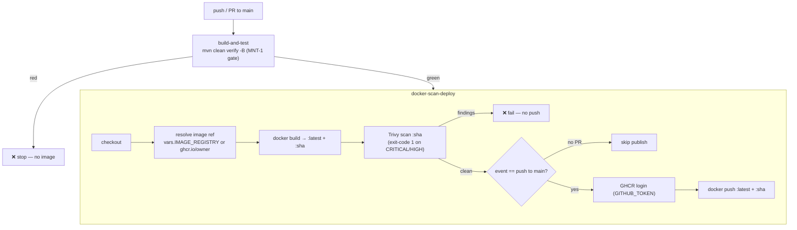

# MNT-2 — Technical Design: Fix the CI Deploy Stage

**Version:** 1.0.0
**Document Type:** Implementation Technical Design
**Document Status:** Implemented — 2026-07-22 (see [Implementation Outcome](#implementation-outcome))
**Last Updated:** 2026-07-22
**Roadmap item:** [`MNT-2`](./AI-QA-OS-Improvement-Roadmap.md) (v2.2.0, frozen) — 🟠 P1 · Effort S · Owner Platform Engineering · Phase 0 · v1.3
**Module:** CI (`.github`)
**Depends on:** [MNT-1](./AI-QA-OS-MNT-1-Technical-Design.md) (Completed) — the image job already `needs: build-and-test`, so only tested code reaches it.

> **Scope discipline.** Implements **only** MNT-2: make the CI image job actually **publish** the scanned image, and drop the `company/` placeholder org. It does **not** add real cluster deployment (no Phase-0 roadmap item for CD), does **not** build the other service images, and changes no product code or Dockerfile.

---

## 0. Roadmap Verification & Current State

### 0.1 What MNT-2 requires (from the finalized roadmap)

> The job named `docker-scan-deploy` builds and scans an image but **never pushes it**, and uses the placeholder org `ghcr.io/company/`… Add a registry-login + push step gated on the scan passing; parameterise the org via a repo variable. Should be gated behind MNT-1 so only tested images ship.

### 0.2 Verified current state (`.github/workflows/deploy.yml`, post-MNT-1)

- `docker-scan-deploy` `needs: build-and-test` (✅ MNT-1 gate already in place).
- Steps: checkout → `docker build -t ghcr.io/company/ai-qa-os-gateway:latest …` → Trivy scan (`exit-code: 1`, severity `CRITICAL,HIGH`).
- **Missing:** registry login, `packages: write` permission, and a **push** step. The org is the placeholder **`company/`**.
- **`gateway.Dockerfile`:** multi-stage; `mvn clean package -pl ai-qa-os-gateway -am -DskipTests -B`; runtime `eclipse-temurin:21-jre-alpine`, non-root user, `EXPOSE 8080`. **Unchanged by MNT-2.**

### 0.3 The four fixes

| # | Problem | Fix |
|---|---|---|
| 1 | Image never pushed | Add a `docker push` step **after** the scan |
| 2 | Placeholder org `ghcr.io/company/` | Parameterise via repo variable `vars.IMAGE_REGISTRY`, defaulting to `ghcr.io/<repo-owner>` |
| 3 | No registry auth | Add `docker/login-action` to GHCR using `GITHUB_TOKEN` + `packages: write` permission |
| 4 | Publishing not gated | Push runs **only** after a passing Trivy scan **and** only on `main` pushes (not PRs) |

---

## 1. Technical Design

### 1.1 Design decision

Extend the existing `docker-scan-deploy` job (do **not** rename it — the name may be a required status check) so it: resolves a real image ref, builds it (tagged with both `latest` and the commit SHA), scans it, and — only when the scan passes **and** the event is a push to `main` — logs in to GHCR and pushes. PR builds still build + scan the image (fast feedback + security gate) but **do not publish**.

### 1.2 Registry & auth

- **Registry: GHCR** (`ghcr.io`), matching the existing config. Auth uses the built-in `GITHUB_TOKEN` (no secrets to manage) with job permission `packages: write`.
- **Image ref (parameterised):** `${{ vars.IMAGE_REGISTRY || 'ghcr.io/<owner>' }}/ai-qa-os-gateway`, owner lower-cased (GHCR requires lowercase paths). Setting the repo/org **variable** `IMAGE_REGISTRY` (e.g. `ghcr.io/my-org` or a different registry) overrides the default without editing the workflow — satisfying "parameterise via a repo variable."
- **Alternative registries** (Docker Hub / ECR / GAR): swap the `login-action` credentials and set `IMAGE_REGISTRY`. Out of scope to wire here; GHCR is the current target.

### 1.3 Tagging

Two tags per build: `:latest` (moving) and `:${{ github.sha }}` (immutable, traceable). Trivy scans the SHA tag; both are pushed on `main`.

### 1.4 Gating (two conditions)

1. **Tested code only:** `needs: build-and-test` (MNT-1) — unchanged.
2. **Clean scan + main only:** the push step runs after Trivy (which fails the job on `CRITICAL,HIGH`, so a failed scan stops the job before push) and carries `if: github.event_name == 'push' && github.ref == 'refs/heads/main'`.

| Event | Build image | Trivy scan | Push |
|---|---|---|---|
| PR → main | ✅ | ✅ (gate) | ❌ (no publish) |
| Push → main | ✅ | ✅ (gate) | ✅ (if scan clean) |

### 1.5 What MNT-2 is **not**

- **Not real CD.** The job "deploy" name is retained, but MNT-2 only **publishes the image**. Deploying to Kubernetes/Helm is a separate concern with no Phase-0 roadmap item.
- **Not multi-service.** Only the gateway image is built/pushed (as today). Brain/agents-runtime/execution/observability/reporting Dockerfiles exist but are not wired — noted under Future Ideas.

---

## 2. Folder Structure

`[M]` modified. Single file; no product code, no Dockerfile change.

```
AI-QA-OS-Core/
└── .github/workflows/
    └── deploy.yml        [M] add permissions, image-ref resolve, SHA+latest tags, GHCR login, gated push
```

---

## 3. Required Classes

**None.** MNT-2 is a CI workflow change only.

| Artifact | Type | Change |
|---|---|---|
| `deploy.yml` — `docker-scan-deploy` job | **Modified** | `permissions: packages: write`; resolve image ref (repo-variable + lowercased owner fallback); build `:latest` + `:<sha>`; Trivy scans `:<sha>`; `docker/login-action` (GHCR); gated `docker push` of both tags |

**New GitHub inputs used:** `secrets.GITHUB_TOKEN` (built-in), optional repo variable `vars.IMAGE_REGISTRY`. No new repo **secret** required for GHCR.

---

## 4. Database Changes

**None.**

---

## 5. API Changes

**None.** No runtime/service behaviour changes. MNT-2 affects only the delivery pipeline. (Operational note: a published image is produced on every `main` push once the scan passes.)

---

## 6. Sequence Diagram



---

## 7. Step-by-Step Implementation Plan

1. **Verify (read-only).** Confirm the current `docker-scan-deploy` step names/anchors (done — §0.2) and that `gateway.Dockerfile` builds with `-DskipTests` (done).
2. **Add job permissions.** `permissions: { contents: read, packages: write }` on `docker-scan-deploy`.
3. **Resolve image ref.** Add a step computing `image` output: `${{ vars.IMAGE_REGISTRY }}` or `ghcr.io/<owner-lowercased>`, suffix `/ai-qa-os-gateway`.
4. **Build with two tags.** `docker build -t $IMAGE:latest -t $IMAGE:${{ github.sha }} -f deployment/docker/gateway.Dockerfile .`.
5. **Point Trivy at `$IMAGE:${{ github.sha }}`** (keep `exit-code: 1`, `severity: CRITICAL,HIGH`, `ignore-unfixed: true`).
6. **Add GHCR login** (`docker/login-action@v3`, registry `ghcr.io`, user `${{ github.actor }}`, password `${{ secrets.GITHUB_TOKEN }}`), guarded `if: github.event_name == 'push' && github.ref == 'refs/heads/main'`.
7. **Add gated push** of both tags with the same `if:`.
8. **Validate.** YAML lint by inspection; confirm expression/`if` syntax; optionally run `docker build` locally (Docker permitting) to confirm the image still builds — no push attempted locally. Report honestly (GitHub Actions runs themselves cannot be executed here).
9. **Sync governance docs.** Set `MNT-2` status in `AI-QA-OS-Implementation-Tracker.md`; release mapping unchanged (v1.3).

**Definition of Done:** on a clean `main` push, CI builds → scans → **pushes** `ghcr.io/<owner>/ai-qa-os-gateway:{latest,<sha>}`; PRs build+scan but never publish; a `CRITICAL/HIGH` finding blocks the push; the `company/` placeholder is gone; tracker updated. No product/Dockerfile change.

---

## Implementation Outcome

Implemented 2026-07-22. Single-file CI change (`AI-QA-OS-Core/.github/workflows/deploy.yml`); no product code, no Dockerfile change.

**Changes to `docker-scan-deploy`:**
- `permissions: { contents: read, packages: write }` (GHCR push via `GITHUB_TOKEN`).
- "Resolve image reference" step → `image` = `${{ vars.IMAGE_REGISTRY }}` or `ghcr.io/<owner-lowercased>` + `/ai-qa-os-gateway`; `registry` = derived host (for login).
- Build tags both `:latest` and `:${{ github.sha }}`; the `company/` placeholder is gone.
- Trivy now scans `:${{ github.sha }}` (same `exit-code: 1`, `CRITICAL,HIGH`, `ignore-unfixed`).
- `docker/login-action@v3` + `docker push` (both tags), each guarded `if: github.event_name == 'push' && github.ref == 'refs/heads/main'`.

**Validation (JDK/Docker not the point here — this is CI YAML):**
- Workflow YAML **parses clean** (Node `yaml`): jobs `build-and-test`, `docker-scan-deploy`; permissions `{contents: read, packages: write}`; step order verified — checkout → resolve → build → Trivy → **login [if]** → **push [if]**.
- **Not executable here:** the GitHub Actions run itself, the GHCR login/push, and the `docker build` (Dockerfile unchanged from MNT-1 baseline, so image-build behaviour is identical). End-to-end publish can only be confirmed on the real runner.

**Operational notes for first real run:**
- Optionally set repo/org variable `IMAGE_REGISTRY` to override the default `ghcr.io/<owner>`.
- The gateway image is published to GHCR under the repo owner on a clean `main` push; make the package visibility/permissions match org policy on first publish.

---

## Appendix — Future Ideas (Outside Current Roadmap)

Not implemented; do not action without approval.

- **FI-MNT2-A — Publish all service images.** Brain, agents-runtime, execution, observability, reporting have Dockerfiles but no CI build/push. A matrix build would publish the full set.
- **FI-MNT2-B — Real continuous deployment.** Roll the pushed image out to Kubernetes/Helm (the `deployment/kubernetes` manifests) — true CD, distinct from publishing.
- **FI-MNT2-C — Image signing / provenance** (cosign, SLSA attestations) — aligns with SEC-6 (signed artifacts).
- **FI-MNT2-D — Pin `trivy-action` to a release tag** (currently `@master`) for reproducible scans.

---

## Compliance Checklist

| Rule | Status |
|---|---|
| Roadmap not modified | ✅ MNT-2 metadata untouched |
| No new roadmap items/categories/modules | ✅ single-file CI change |
| No product/architecture change | ✅ no code/Dockerfile edits |
| Gated behind MNT-1 | ✅ `needs: build-and-test` retained |
| Publishing gated on clean scan | ✅ push after Trivy; main-only |
| Out-of-scope items untouched | ✅ CD-to-cluster, multi-image, signing deferred |

---

## Document Completion Status

**Status:** Draft — Awaiting Approval
**Version:** 1.0.0
**Implements:** `MNT-2` (roadmap v2.2.0, frozen)
**Next step:** On approval, execute [§7](#7-step-by-step-implementation-plan) from Step 2. No code until approved.
