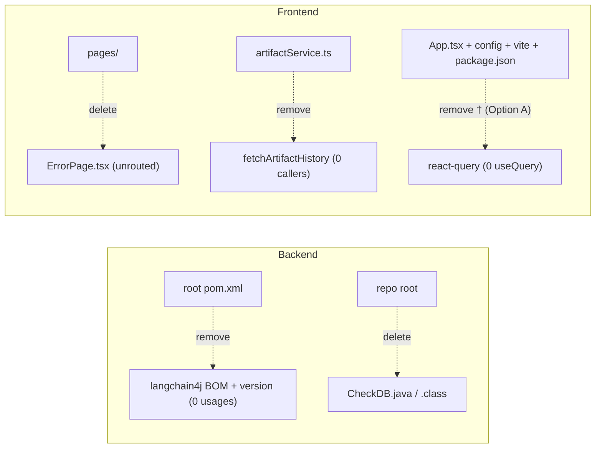

# MNT-4 — Technical Design: Remove Dead Code & Unused Dependencies

**Version:** 1.0.0
**Document Type:** Implementation Technical Design
**Document Status:** Draft — Awaiting Approval (no code until approved)
**Last Updated:** 2026-07-22
**Roadmap item:** [`MNT-4`](./AI-QA-OS-Improvement-Roadmap.md) (v2.2.0, frozen) — 🟡 P2 · Effort S · Owner Platform Engineering · Continuous · v1.3
**Modules:** root `pom.xml`, `ai-qa-os-dashboard-ui`, `ai-qa-os-core` (repo root)
**Coupled with:** [PERF-3](./AI-QA-OS-Improvement-Roadmap.md) — the react-query direction (see [§0.4](#04-the-react-query-fork-perf-3-coupling)).

> **Scope discipline.** Implements **only** MNT-4: delete confirmed-dead code and unused dependencies. **Pure subtraction** — no behaviour change, no refactor, no new capability. Anything ambiguous is left alone.

---

## 0. Roadmap Verification & Current State

### 0.1 What MNT-4 requires (from the finalized roadmap)

> Confirmed dead weight: the LangChain4j BOM (imported, zero `dev.langchain4j` usages), react-query (mounted, given its own build chunk, `useQuery` used zero times), `ErrorPage.tsx` (unrouted), `fetchArtifactHistory` (uncalled), and `CheckDB.java`… For react-query, this is a decision fork — either adopt it (PERF-3) or remove it. Leaving it half-present is the worst option.

### 0.2 Verified dead items (measured during design)

| # | Item | Evidence | Action |
|---|---|---|---|
| 1 | **LangChain4j BOM** | Only in root `pom.xml` (`langchain4j.version` prop + `langchain4j-bom` import); **0** `dev.langchain4j` imports in any `.java` | Remove property + BOM import |
| 2 | **`CheckDB.java` + `CheckDB.class`** | Repo root, default package, not in any Maven module | Delete both |
| 3 | **`ErrorPage.tsx`** | Defined in `pages/ErrorPage.tsx`; **not imported/routed** anywhere (only self-references) | Delete file |
| 4 | **`fetchArtifactHistory`** | Exported at `artifactService.ts:101`; **no callers** | Delete function |
| 5 | **react-query** | `QueryClientProvider` in `App.tsx` + `config/queryClient.ts` + `vendor-query` chunk; **0** `useQuery`/`useMutation`/`useQueryClient` | **Decision — see §0.4** |

### 0.3 Definite removals (items 1–4)

Unambiguously dead, zero behavioural impact (nothing calls or renders them). These are removed regardless of the react-query decision.

### 0.4 The react-query fork (PERF-3 coupling)

react-query is **mounted but unused** — the roadmap says this is the worst state and must resolve one way. The two directions are two different roadmap items:

| Option | What | Effect on PERF-3 |
|---|---|---|
| **A — Remove now (recommended for a cleanup task)** | Delete the dep, `QueryClientProvider` (App.tsx), `config/queryClient.ts`, and the `vendor-query` chunk | PERF-3's "adopt react-query" path is dropped; if PERF-3 is later prioritised, re-adding is a one-line install + re-wire, or PERF-3 uses another cache |
| **B — Keep, defer to PERF-3** | MNT-4 removes only items 1–4; react-query stays pending PERF-3's adopt decision | PERF-3 later adopts react-query (uses the already-mounted provider) |

react-query does **nothing** today, so removing it is clean subtraction consistent with MNT-4's purpose; keeping it only makes sense if PERF-3 adoption is imminent. This design covers both; §2/§7 mark the react-query-specific steps as conditional.

> ✅ **Decision (confirmed 2026-07-22): Option A — Remove now.** react-query is fully removed under MNT-4. Consequence: when **PERF-3** is later implemented, it starts from scratch (adopt react-query fresh or use another caching approach) — the roadmap item itself is unchanged (frozen); this is a note for its future design.

---

## 1. Technical Design

Delete confirmed-dead code and config. No logic changes, no signatures altered on anything that is actually used.

**Backend / repo root:**
- Remove the `langchain4j.version` property and the `langchain4j-bom` `<dependency>` import from root `pom.xml`.
- Delete `CheckDB.java` and `CheckDB.class` from the Core repo root.

**Frontend:**
- Delete `src/pages/ErrorPage.tsx` (unrouted).
- Delete the `fetchArtifactHistory` function from `src/services/artifactService.ts` (uncalled); leave the rest of the file intact.
- **[If Option A]** Remove react-query: the `@tanstack/react-query` dependency (`package.json`), the `QueryClientProvider` wrapper + imports (`App.tsx`), `src/config/queryClient.ts`, and the `vendor-query` entry in `vite.config.ts` `manualChunks`.

**Not touched:** anything referenced anywhere; `NotFoundPage` (routed for `*`); the `artifactService` functions that are called; all other deps.

---

## 2. Folder Structure

`[M]` modified, `[D]` deleted. `†` = conditional on react-query Option A.

```
AI-QA-OS-Core/
├── pom.xml                                   [M] remove langchain4j.version + langchain4j-bom import
├── CheckDB.java                              [D]
└── CheckDB.class                             [D]

ai-qa-os-dashboard-ui/
└── src/
    ├── pages/ErrorPage.tsx                   [D] unrouted
    ├── services/artifactService.ts           [M] remove fetchArtifactHistory
    ├── App.tsx                                [M]† remove QueryClientProvider wrapper + imports
    ├── config/queryClient.ts                  [D]† react-query config
    └── (vite.config.ts)                       [M]† remove 'vendor-query' manualChunks entry
    └── (package.json)                         [M]† remove @tanstack/react-query dependency
```

---

## 3. Required Classes

**None created.** Deletions/edits only.

| Artifact | Type | Change |
|---|---|---|
| root `pom.xml` | Modified | drop langchain4j property + BOM import |
| `CheckDB.java`, `CheckDB.class` | Deleted | throwaway debug utility |
| `pages/ErrorPage.tsx` | Deleted | unrouted component |
| `services/artifactService.ts` | Modified | remove `fetchArtifactHistory` (+ now-unused types if any) |
| `App.tsx`, `config/queryClient.ts`, `vite.config.ts`, `package.json` | Modified/Deleted † | react-query removal (Option A only) |

---

## 4. Database Changes

**None.**

---

## 5. API Changes

**None.** `fetchArtifactHistory` and `ErrorPage` were never wired to anything; removing them changes no runtime behaviour. `CheckDB` was never part of the build.

---

## 6. Removal Map



---

## 7. Step-by-Step Implementation Plan

1. **Verify (read-only).** Re-confirm zero references (done — §0.2): `dev.langchain4j` usages, `useQuery`/`useMutation`, `fetchArtifactHistory` callers, `ErrorPage` imports. Check `artifactService.ts` for any type (e.g. `ArtifactRunEntry`) used *only* by `fetchArtifactHistory` so its removal doesn't orphan an import elsewhere.
2. **Root `pom.xml`.** Remove `<langchain4j.version>` and the `langchain4j-bom` dependency-management import.
3. **Delete** `CheckDB.java` + `CheckDB.class`.
4. **Delete** `src/pages/ErrorPage.tsx`.
5. **Edit** `src/services/artifactService.ts` — remove `fetchArtifactHistory` (and any now-unused local type), keep everything else.
6. **[Option A only]** Remove react-query: `App.tsx` (unwrap `QueryClientProvider`, drop imports), delete `config/queryClient.ts`, remove `vendor-query` from `vite.config.ts`, remove `@tanstack/react-query` from `package.json` (+ `npm install` to update the lockfile).
7. **Validate.**
   - Backend: `mvn -q -pl ai-qa-os-gateway,ai-qa-os-dashboard -am -DskipTests test-compile` still builds (langchain4j was unused).
   - Frontend: `npm run build` (`tsc -b && vite build`), `npm run lint`, `npm test` all green — proves nothing referenced the removed items.
8. **Sync governance docs.** Set `MNT-4` status in the tracker; note the react-query decision taken; release mapping unchanged (v1.3). If Option A, note PERF-3 is now "adopt-from-scratch or re-scope."

**Definition of Done:** items 1–4 removed; react-query resolved per the chosen option; backend compiles; UI builds + lints + tests green; no behaviour change; tracker updated.

---

## Implementation Outcome

Implemented 2026-07-22 (Option A — react-query removed). Pure subtraction; no behaviour change.

**Removed:**
- Root `pom.xml` — `langchain4j.version` property + `langchain4j-bom` import.
- `AI-QA-OS-Core/CheckDB.java` + `CheckDB.class` (deleted).
- `ai-qa-os-dashboard-ui/src/pages/ErrorPage.tsx` (deleted).
- `fetchArtifactHistory` from `artifactService.ts` — `ArtifactRunEntry` **kept** (still used by `ArtifactDTO.history`, so no orphaned import).
- react-query: `@tanstack/react-query` (package.json + lockfile), `QueryClientProvider` wrapper + imports (App.tsx, re-indented), `config/queryClient.ts` (deleted), `vendor-query` chunk (vite.config.ts).

**Validation (JDK 25 / Maven / Node):**
- Backend: `mvn -pl ai-qa-os-core -am test-compile` — parent pom valid, **compiles** (exit 0).
- UI: `npm run build` (tsc + vite) **green** — no `vendor-query` chunk; strict `tsc` confirms nothing referenced the removed items. `npm run lint` — only the 4 pre-existing warnings (no new ones). `npm test` — **2/2**. Lockfile: **0** react-query refs.

**Consequence noted:** **PERF-3** loses its "adopt react-query" starting point — its tracker note is updated to "adopt from scratch / another cache." The roadmap item itself is unchanged (frozen).

---

## Appendix — Future Ideas (Outside Current Roadmap)

- **FI-MNT4-A — Automated dead-code detection** in CI (e.g. `knip`/`ts-prune` for the UI, `mvn dependency:analyze` for Maven) so dead weight is caught continuously rather than by audit.
- **FI-MNT4-B — Remove the compiled `.class`/log artifacts at the root** more broadly (overlaps ORG-4).

---

## Compliance Checklist

| Rule | Status |
|---|---|
| Roadmap not modified | ✅ MNT-4 metadata untouched |
| No new roadmap items/categories/modules | ✅ deletions only |
| No behaviour/architecture change | ✅ only never-referenced code removed |
| Module boundaries | ✅ each edit stays in its module |
| PERF-3 coupling handled | ✅ react-query resolved explicitly, not left half-present |
| Out-of-scope items untouched | ✅ no refactors, no dep upgrades |

---

## Document Completion Status

**Status:** Implemented — 2026-07-22 (Option A — Remove react-query; see [Implementation Outcome](#implementation-outcome))
**Version:** 1.0.0
**Implements:** `MNT-4` (roadmap v2.2.0, frozen)
**Next step:** On approval + react-query choice, execute [§7](#7-step-by-step-implementation-plan) from Step 1. No code until approved.
