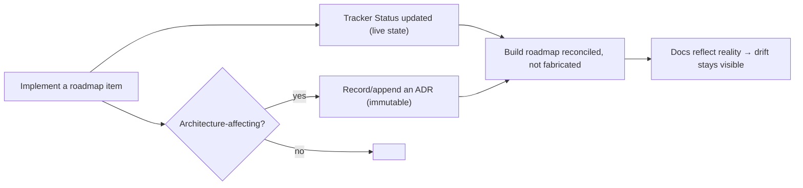

# MNT-5 — Technical Design: Establish ADRs & Keep the Roadmap Honest

**Version:** 1.0.0
**Document Type:** Implementation Technical Design
**Document Status:** Draft — Awaiting Approval (no code until approved)
**Last Updated:** 2026-07-22
**Roadmap item:** [`MNT-5`](./AI-QA-OS-Improvement-Roadmap.md) (v2.2.0, frozen) — 🟡 P2 · Effort S · Owner Architecture · Continuous · v1.3
**Module:** `AI-QA-OS-Docs`

> **Scope discipline.** Implements **only** MNT-5: establish the ADR practice in the docs repo and reconcile the build roadmap with reality. **Documentation/process only** — no code, no architecture change. It does not modify the frozen `AI-QA-OS-Improvement-Roadmap.md`.

---

## 0. Roadmap Verification & Current State

### 0.1 What MNT-5 requires (from the finalized roadmap)

> The docs repo's `docs/decisions/` is an empty scaffold, and the build roadmap marks everything `Not Started` while ~20 modules are implemented. Design intent and actual state have drifted apart… Without ADRs, every future divergence is invisible… Reconcile `docs/roadmap/00-Project-Roadmap.md` with reality. This document's Status fields are part of the same discipline.

### 0.2 Verified current state

- **ADRs already exist, consolidated:** `AI-QA-OS-Architecture-Decisions.md` (workspace root) holds **8 ADRs** (ADR-001…008) in the exact `Status / Context / Decision / Consequences` shape the docs standard requires. It is cross-referenced by every implementation design doc and by the tracker/release plan.
- **`docs/decisions/README.md`** is an empty scaffold: defines the ADR convention (`NNN-Descriptive-Title.md`, Status/Context/Decision/Consequences) and says *"No files yet."*
- **`docs/roadmap/00-Project-Roadmap.md`** lists **Phases 0–10 and Steps 01–12 all `Not Started`**, `Document Status: In Progress` — while the platform has ~20 modules, 3 runnable apps, a working pipeline, and 8 completed improvement items. **This is the honesty gap.**
- **Two roadmaps exist and must not be conflated:** the *frozen* `AI-QA-OS-Improvement-Roadmap.md` (forward plan, untouched by MNT-5) vs. this docs-repo *build* roadmap (`00-Project-Roadmap.md`, the drifted artifact MNT-5 reconciles).

### 0.3 The ADR-location decision (user's call — see closing question)

The 8 ADRs exist consolidated; the docs standard wants per-file `NNN-Title.md` in `docs/decisions/`. Two ways to make `docs/decisions/` honest without creating a second copy that will drift (the very rot MNT-5 fights):

| Option | Canonical ADR home | `docs/decisions/` | Trade-off |
|---|---|---|---|
| **A — Consolidated canonical + pointer (recommended)** | `AI-QA-OS-Architecture-Decisions.md` (single source) | README lists the 8 ADRs and points to the canonical log; new ADRs appended there | Least duplication, no broken cross-refs; deviates from strict per-file naming |
| **B — Per-file in docs repo (standard-strict)** | `docs/decisions/001-…008-*.md` | 8 per-file ADRs; root file becomes an index | Standard-compliant; but splits the source, must re-point every design-doc cross-ref, higher drift surface |

Option A keeps **one source of truth** — the anti-drift goal MNT-5 serves — while making the folder honest. This design is written for A; §7 notes B's extra steps.

> ✅ **Decision (confirmed 2026-07-22): Option A — Consolidated + pointer.** `AI-QA-OS-Architecture-Decisions.md` stays the single canonical ADR log; `docs/decisions/README.md` becomes an index pointing to it. No per-file split; no cross-reference churn.

---

## 1. Technical Design

Three moves, all documentation:

1. **Make `docs/decisions/` honest.** Rewrite `docs/decisions/README.md` from "No files yet" into an ADR **index**: list the 8 ADRs (id, title, status) with a pointer to the canonical `AI-QA-OS-Architecture-Decisions.md`, and state the going-forward convention (new ADRs appended to the canonical log; format per the standard). *(Option B instead: split into `001…008-*.md` here and make the root file an index.)*

2. **Reconcile `00-Project-Roadmap.md` with reality.** Add a prominent **Status Reconciliation** banner at the top stating the build roadmap's per-phase/step "Not Started" markers were never maintained and are inaccurate; the platform is substantially implemented (point to `AI-QA-OS-Documentation.md` for actual state, `AI-QA-OS-Improvement-Roadmap.md` + `AI-QA-OS-Implementation-Tracker.md` for the forward plan/status). Update `Document Status` accordingly. **Do not fabricate per-row Done/Not-Started** — the docs-repo process derived status from authored step docs that were never written; the honest move is to mark the whole table stale and point to the authoritative source, not invent statuses.

3. **Formalise the decision discipline (meta-ADR).** Append **ADR-009 — "Decision & roadmap-honesty discipline"** to the canonical ADR log: ADRs are immutable-append, the improvement roadmap's `Status` fields (via the tracker) are the live state, and the build roadmap is reconciled not fabricated. This makes MNT-5's own process a recorded decision — closing the loop the roadmap describes ("this document's Status fields are part of the same discipline").

**Not touched:** the frozen improvement roadmap; the 8 existing ADRs' content; `00-Foundation/`; any code.

---

## 2. Folder Structure

`[M]` modified, `[N]` new. `†` = Option B only.

```
AI-QA-OS Architecture/
├── AI-QA-OS-Architecture-Decisions.md          [M] append ADR-009 (decision discipline)
└── AI-QA-OS-Docs/
    └── docs/
        ├── decisions/
        │   ├── README.md                        [M] "No files yet" → ADR index + pointer + convention
        │   └── 001-…008-*.md                     [N]† per-file ADRs (Option B only)
        └── roadmap/
            └── 00-Project-Roadmap.md             [M] Status Reconciliation banner + Document Status
```

---

## 3. Required Classes

**None.** Documentation only.

| Artifact | Type | Change |
|---|---|---|
| `docs/decisions/README.md` | Modified | Empty scaffold → ADR index + canonical pointer + convention |
| `docs/roadmap/00-Project-Roadmap.md` | Modified | Reconciliation banner; honest `Document Status` |
| `AI-QA-OS-Architecture-Decisions.md` | Modified | Append ADR-009 (decision discipline) |
| `docs/decisions/001…008-*.md` | New † | Per-file ADRs (Option B only) |

---

## 4. Database Changes

**None.**

---

## 5. API Changes

**None.** Documentation/process only; no runtime impact.

---

## 6. Decision-Honesty Loop



---

## 7. Step-by-Step Implementation Plan

1. **Verify (read-only).** Confirm the 8 ADRs + format (done — §0.2), the docs standard's ADR convention (`NNN-Title.md`, Status/Context/Decision/Consequences — confirmed in the folder README), and the current roadmap statuses (done).
2. **`docs/decisions/README.md`** → ADR index: table of ADR-001…008 (id, title, status) linking to `AI-QA-OS-Architecture-Decisions.md`, plus the going-forward convention. *(Option B: also create `001…008-*.md` and make the root file the index.)*
3. **`00-Project-Roadmap.md`** → add the Status Reconciliation banner (top) + set `Document Status` to reflect it; leave the historical table intact beneath the banner (labelled stale).
4. **`AI-QA-OS-Architecture-Decisions.md`** → append **ADR-009** (decision & roadmap-honesty discipline) and add it to the index.
5. **Validate.** Markdown renders; internal links resolve (ADR index → canonical log; roadmap banner → platform doc + improvement roadmap + tracker). No build needed.
6. **Sync governance docs.** Set `MNT-5` status in the tracker; release mapping unchanged (v1.3). This closes the last continuous v1.3 hygiene item.

**Definition of Done:** `docs/decisions/` is no longer an empty scaffold (honest ADR index in place); `00-Project-Roadmap.md` no longer claims everything is unbuilt (reconciliation banner + honest status); the decision discipline is itself recorded (ADR-009); the frozen improvement roadmap is untouched; tracker updated.

---

## Appendix — Future Ideas (Outside Current Roadmap)

- **FI-MNT5-A — Backfill the two "first ADRs"** the folder README suggests (the Documentation Standard itself; the numbered-docs convention).
- **FI-MNT5-B — Per-step reconciliation** of `00-Project-Roadmap.md` (map each build phase/step to the actual modules and mark true status) — larger, subjective; deferred beyond the banner.
- **FI-MNT5-C — A lightweight ADR template** in `docs/templates/` so new ADRs are one copy-paste away.

---

## Compliance Checklist

| Rule | Status |
|---|---|
| Roadmap not modified | ✅ frozen `AI-QA-OS-Improvement-Roadmap.md` untouched; only the docs-repo *build* roadmap reconciled (MNT-5's explicit ask) |
| No new roadmap items/categories/modules | ✅ docs only |
| No behaviour/architecture change | ✅ process/documentation |
| Anti-drift honoured | ✅ single ADR source; roadmap reconciled not fabricated |
| Out-of-scope items untouched | ✅ per-step reconciliation / template deferred |

---

## Document Completion Status

**Status:** Implemented — 2026-07-22 (Option A — Consolidated + pointer)
**Version:** 1.0.0
**Implements:** `MNT-5` (roadmap v2.2.0, frozen)

### Implementation Outcome

Implemented 2026-07-22. Documentation/process only; frozen improvement roadmap untouched.

- **`AI-QA-OS-Docs/docs/decisions/README.md`** [M] — empty scaffold → ADR **index**: table of ADR-001…009 (id/title/status) + pointer to the canonical `AI-QA-OS-Architecture-Decisions.md` + the going-forward convention.
- **`AI-QA-OS-Docs/docs/roadmap/00-Project-Roadmap.md`** [M] — added a **Status Reconciliation** banner (the "Not Started" table is historical/stale; platform is substantially built; pointers to `AI-QA-OS-Documentation.md`, the frozen improvement roadmap, the tracker, and the ADR log); `Document Status` (header + footer) updated to "Stale build-log — reconciled"; the historical table retained unchanged beneath the banner (no fabricated per-row statuses, per ADR-009).
- **`AI-QA-OS-Architecture-Decisions.md`** [M] — appended **ADR-009 — Decision & roadmap-honesty discipline** and added it to the index.

**Validation:** ADR-009 index link resolves to its heading (anchor matches); the reconciliation banner is present; the decisions README is no longer an empty scaffold. Markdown-only — no build. The consolidated-log cross-references from the design docs still resolve (Option A left the file in place).

**Note (cross-repo links):** the banner/README point to workspace-root docs (`AI-QA-OS-Documentation.md`, etc.) that live adjacent to — not inside — the `AI-QA-OS-Docs` repo; links resolve in the workspace layout but not in a standalone `AI-QA-OS-Docs` clone. Files are named explicitly so the reference is clear regardless.
