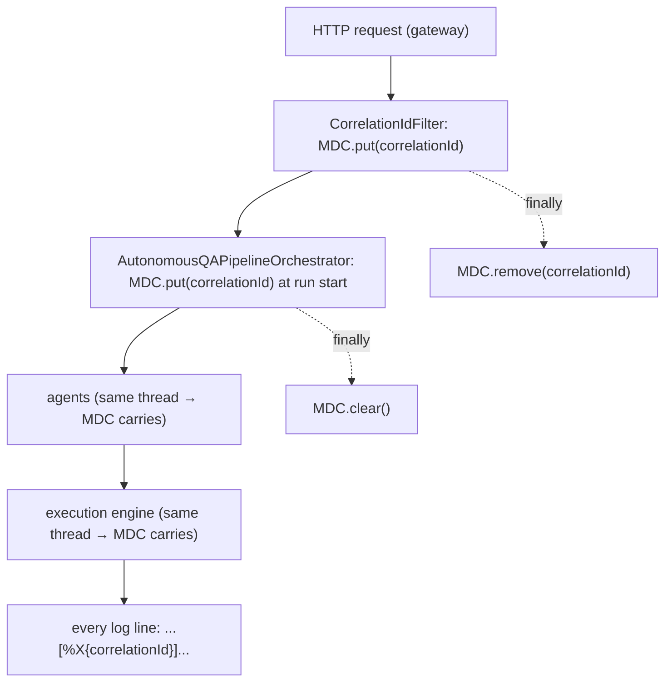

# MNT-6 — Technical Design: Consistent Package Naming & Correlated Logging

**Version:** 1.0.0
**Document Type:** Implementation Technical Design
**Document Status:** Implemented — 2026-07-23 (see [Implementation Outcome](#implementation-outcome))
**Last Updated:** 2026-07-23
**Roadmap item:** [`MNT-6`](./AI-QA-OS-Improvement-Roadmap.md#mnt-6--consistent-package-naming-and-structured-correlated-logging) (v2.2.0, frozen) — 🟡 P2 · Effort M · Owner Platform Engineering + Observability · Continuous · v1.5
**Modules:** `ai-qa-os-orchestration` (rename) · gateway/orchestration/observability (MDC). **Unblocks OBS-1** (distributed tracing).

> **Scope discipline.** Two mechanical, fully-validatable changes: (1) rename `ai-qa-os-orchestration`'s package `com.aiqaos.workflow` → `com.aiqaos.orchestration`; (2) thread `correlationId` through **MDC** so one run is traceable across logs. No behaviour/API change; no new modules.

---

## 0. Roadmap Verification & Findings

### 0.1 What MNT-6 requires

> `ai-qa-os-orchestration`'s package is `com.aiqaos.workflow` — a name/artifact mismatch that surprises every contributor. Separately, a `correlationId` flows in on requests but is not threaded through logs, so tracing a run end-to-end is manual. **Where:** package rename in orchestration; **MDC**-based correlation-ID propagation across gateway → orchestration → agents → execution.

### 0.2 Verified facts (the rename is low-risk)

| Fact | Detail |
|---|---|
| Blast radius | **84** `.java` files in orchestration under `com.aiqaos.workflow`; **9** importing files in `ai-qa-os-dashboard` + `ai-qa-os-gateway`. Bounded. |
| No config/scan coupling | **No** `com.aiqaos.workflow` string in any `yml`/`xml`/`properties` (only regenerated `target/surefire-reports`). All scans are broad — `@SpringBootApplication(scanBasePackages="com.aiqaos")`, `@EntityScan("com.aiqaos")`, `@EnableJpaRepositories("com.aiqaos")` — so renaming *within* `com.aiqaos` breaks **no** scanning, entity, or repository wiring. |
| Pure mechanical | The only occurrences are `package`/`import`/fully-qualified refs → a global `com.aiqaos.workflow` → `com.aiqaos.orchestration` replace + directory move. DB tables, Flyway, and JSON are unaffected (table/field names aren't package-derived). |
| MDC infra partly exists | `gateway/CorrelationIdFilter`, `config/LoggingConfig`, `observability/LogContextManager` + `CorrelationTraceBridge` already use `org.slf4j.MDC`; `AutonomousQAPipelineOrchestrator` already carries `correlationId`. MNT-6 makes propagation consistent, not new. |

### 0.3 / Decision for approval — the package rename

The rename is a **large but low-risk cosmetic diff (~93 files)**; the MDC logging is the operability value. Both are fully validatable here.

| Option | Approach | Trade-off |
|---|---|---|
| **A — Do both (recommended)** | Perform the full `com.aiqaos.workflow` → `com.aiqaos.orchestration` rename **and** the MDC logging; validate with the full reactor build + test suite. | Roadmap-complete; the rename is mechanical and the test suite (incl. the pipeline integration test) proves it; fixes the "surprises every contributor" issue. Large diff. |
| **B — MDC logging only; defer the rename** | Ship the correlated logging now; leave the 93-file rename for a dedicated pass. | Small, reviewable change; but leaves the P2 naming inconsistency and MNT-6 partially done. |

**Recommend A** — the rename has no config/scan coupling (§0.2), so it is a safe global replace + directory move that the reactor + tests validate end-to-end. There is little reason to defer a validatable mechanical fix that every new contributor trips over.

> ✅ **Decision (confirmed 2026-07-23): Option A — do both** (full `com.aiqaos.workflow` → `com.aiqaos.orchestration` rename + MDC correlated logging). Recorded as ADR-019.

---

## 1. Technical Design

### 1.1 Package rename (Option A)
- Move `ai-qa-os-orchestration/src/{main,test}/java/com/aiqaos/workflow/` → `.../com/aiqaos/orchestration/`.
- Global replace `com.aiqaos.workflow` → `com.aiqaos.orchestration` across all `.java` (package declarations, imports, fully-qualified refs) in **orchestration**, and the imports in **dashboard** + **gateway** (the 9 importers).
- No config, scan, entity, Flyway, or JSON changes required (§0.2).

### 1.2 Correlated logging (MDC)
- **Gateway boundary** — `CorrelationIdFilter` puts `correlationId` into MDC at request start and clears it in a `finally` (ensuring every gateway log line for a request carries it). Reuse/confirm the existing filter.
- **Pipeline boundary** — `AutonomousQAPipelineOrchestrator` sets `MDC.put("correlationId", …)` at the start of a run and clears it in `finally`. Because agents and the execution engine run **in-process on the same thread**, MDC (thread-local) automatically carries the id through orchestration → agents → execution — so one `put` covers the in-JVM chain. (The opt-in SCALE-1 worker pool runs on other threads; propagating MDC across that boundary is noted as FI-MNT6-A.)
- **Log pattern** — add `%X{correlationId}` to the console/log encoder pattern (in the logging config the platform already ships) so the id is surfaced on every line. Reuse `observability/LogContextManager` where it already centralises MDC keys.

### 1.3 What MNT-6 does not change
No new endpoints, DTOs, DB, or behaviour. OTel span propagation (beyond surfacing correlationId) is **OBS-1**; MNT-6 is its prerequisite.

---

## 2. Folder Structure

```
ai-qa-os-orchestration/src/{main,test}/java/com/aiqaos/
    workflow/  ->  orchestration/           [MOVED] 84 files; package + imports rewritten
ai-qa-os-dashboard, ai-qa-os-gateway         [M] 9 files: imports com.aiqaos.workflow -> com.aiqaos.orchestration
ai-qa-os-gateway/.../filter/CorrelationIdFilter.java          [M?] MDC put/clear per request (confirm)
ai-qa-os-orchestration/.../pipeline/AutonomousQAPipelineOrchestrator.java  [M] MDC put/clear per run
+ logging config: log pattern gains %X{correlationId}
```

---

## 3. Required Changes (key)

| Change | Type | Responsibility |
|---|---|---|
| `com.aiqaos.workflow` → `com.aiqaos.orchestration` | Rename | Package/module-name consistency (93 files) |
| `CorrelationIdFilter` | Confirm/Modify | MDC `correlationId` per gateway request |
| `AutonomousQAPipelineOrchestrator` | Modify | MDC `correlationId` per run (covers in-JVM chain) |
| Log pattern | Modify | Surface `%X{correlationId}` on every line |

---

## 4. Database Changes

**None.** Table/column names are not package-derived; the rename does not touch the schema.

---

## 5. API Changes

**None.** Internal package names + log formatting only. HTTP contracts, DTO field names, and JSON are unchanged.

---

## 6. Sequence Diagram



---

## 7. Step-by-Step Implementation Plan

1. **Rename** — move the orchestration `workflow/` package dirs to `orchestration/`; global replace `com.aiqaos.workflow` → `com.aiqaos.orchestration` across orchestration + the 9 dashboard/gateway importers.
2. **Compile checkpoint** — reactor compile to catch any missed import immediately.
3. **MDC** — confirm/adjust `CorrelationIdFilter` (put/clear per request); add MDC put/clear in `AutonomousQAPipelineOrchestrator` (per run, `finally`); add `%X{correlationId}` to the log pattern via the existing logging config / `LogContextManager`.
4. **Build & validate** — full reactor `mvn test`; the pipeline integration test + all 22 modules must stay green (this is what proves the rename is safe). Spot-check a log line carries the id.
5. **Sync docs** — tracker `MNT-6` → Completed; note it **unblocks OBS-1**; **ADR-019** (module↔package naming convention + MDC correlation-id propagation as the tracing foundation).

**Definition of Done:** orchestration's package is `com.aiqaos.orchestration`; `correlationId` is in MDC across the gateway request and the in-JVM pipeline chain and appears in the log pattern; full reactor green; OBS-1 unblocked.

---

## Implementation Outcome

Implemented 2026-07-23 (Option A — both). Recorded as **ADR-019**. **Fully validated here** (no deferred infra). **Unblocks OBS-1.**

**Changes:**
- **Rename** — `ai-qa-os-orchestration/src/{main,test}/java/com/aiqaos/workflow` → `.../orchestration`; global `com.aiqaos.workflow` → `com.aiqaos.orchestration` across 84 orchestration files + 9 dashboard/gateway importers (scripted move + `sed`). No config/scan changes (all scans use broad `com.aiqaos`).
- **MDC** — `AutonomousQAPipelineOrchestrator.runPipeline` sets `MDC.put("correlationId", …)` at run start, cleared in `finally` (thread-locally covers the in-JVM orchestration → agents → execution chain); gateway `CorrelationIdFilter` already did per-request. Log pattern `logging.pattern.level: "%5p [%X{correlationId:-}]"` added to gateway + dashboard `application.yml`.

**Validation (Maven; env JDK 26):**
- `test-compile` across the reactor after the rename → **exit 0** (rename compiles).
- **First `mvn test` FAILED** — `ConflictingBeanDefinitionException` on `humanReviewService`: stale `com/aiqaos/workflow/*.class` from before the move coexisted with the new `com/aiqaos/orchestration/*.class` in `target/`, so component scan found two beans. (Only surfaces at runtime context-load, not at compile — which is why `test-compile` passed.)
- **`mvn clean test` → BUILD SUCCESS, all 22 modules**; `AutonomousWorkflowIntegrationTest` (55s) green — proving the rename + MDC are safe end-to-end.

**Lesson (in ADR-019):** a package rename requires a **clean** build; incremental `target/` retains orphaned `.class` files that duplicate beans. No honesty caveats otherwise — this item is fully done and validated (unlike the infra-gated SCALE-1/ENT-5).

---

## Appendix — Future Ideas (Outside Current Roadmap)

- **FI-MNT6-A** — Propagate MDC across the SCALE-1 worker-pool thread boundary (a task decorator that copies the MDC context) once the async queue is enabled.
- **FI-MNT6-B** — A structured (JSON) log encoder for machine-parseable, correlation-keyed logs feeding OBS-1/Category K.

---

## Compliance Checklist

| Rule | Status |
|---|---|
| Roadmap not modified | ✅ MNT-6 metadata untouched |
| No new modules | ✅ orchestration rename + gateway/observability MDC |
| Dependency direction | ✅ rename stays within `com.aiqaos`; no scan/entity/repo coupling |
| Non-breaking | ✅ no API/DB/behaviour change; log format only |
| Fully validatable here | ✅ reactor build + tests prove the rename (no deferred infra) |
| ADR discipline | ✅ ADR-019 to be recorded |

---

## Document Completion Status

**Status:** Implemented — 2026-07-23 (Option A — both; fully validated). See [Implementation Outcome](#implementation-outcome).
**Version:** 1.0.0
**Implements:** `MNT-6` (roadmap v2.2.0, frozen)
