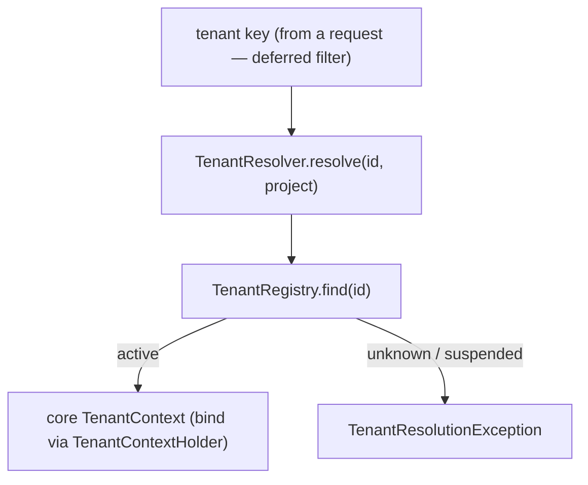

# MOD-1 — Technical Design: `ai-qa-os-tenant` (Project / Tenant Context Module)

**Version:** 1.0.0
**Document Type:** Implementation Technical Design
**Document Status:** Implemented — 2026-07-29 (§0.4 = A in-memory seam; see [Implementation Outcome](#implementation-outcome))
**Last Updated:** 2026-07-29
**Roadmap item:** [`MOD-1`](./AI-QA-OS-Improvement-Roadmap.md#mod-1--ai-qa-os-tenant-project--tenant-context) (v2.2.0, frozen) — 🟠 P1 · Effort XL · Owner Platform / Enterprise · Phase 3 · v2.0
**Modules:** **`ai-qa-os-tenant`** (new, 22nd module) depending on `core`.
**Depends on:** ENT-1 foundation (the `core` `TenantContext`/`Tenanted` contract — ✅ delivered, ADR-041).

> **Scope discipline.** MOD-1's **core-contract half is already delivered** (ENT-1/ADR-041). This design creates the **module itself** — a tenant **registry** and a **resolver** that turns a tenant key into a `core` `TenantContext`, so the platform finally has an owner for tenant identity. The registry logic + resolution are **fully validatable** behind a store seam; a durable backend + the gateway filter are deferred (§0.3).

---

## 0. Roadmap Verification & Scope

### 0.1 What MOD-1 requires
> Realise the "Project Manager" and the multi-tenancy foundation. **No existing module owns tenant identity.** New module depending on `core` (read by security/memory/orchestration/gateway); the tenant *context contract* lives in `core`. Structural but foundational.

### 0.2 Verified state
- ENT-1/ADR-041 delivered the `core` contract: `TenantContext`, `Tenanted`, `TenantContextHolder`. ✅
- No `ai-qa-os-tenant` module exists yet; nothing registers or resolves tenants.

### 0.3 Environment reality
- **Validatable now:** a `Tenant` model, a `TenantRegistry` (register / lookup / lifecycle) behind a seam, and a `TenantResolver` that produces a `core` `TenantContext` from a tenant key (validating existence + active status). Pure logic.
- **Deferred:** a durable (JPA) registry — needs a DB; the gateway tenant-resolution filter (FI-ENT1-B); the enforcement layers (ENT-1's FI-ENT1-C/D/E).

### 0.4 / Decision for approval — the registry backend

| Option | Approach | Trade-off |
|---|---|---|
| **A — In-memory registry seam now; durable deferred (recommended)** | `TenantRegistry` interface + `InMemoryTenantRegistry` reference; `TenantResolver` over it. A JPA-backed registry is a drop-in seam impl later. | Consistent with every other seam this session (ArtifactStore/SpendLedger/VersionPinStore); fully validatable; no DB. |
| **B — Durable JPA registry now** | `TenantEntity` + repository + migration. | Needs a DB (unvalidatable here) and a migration; premature before the enforcement layers consume it. |

**Recommend A** — deliver the module + registry logic behind a seam now; the durable backend lands with the persistence-tenancy increment (FI-ENT1-C) that actually needs it.

> ✅ **Decision (confirmed 2026-07-29): Option A — in-memory `TenantRegistry` seam + active-only `TenantResolver`; durable JPA backend deferred (FI-MOD1-A).** Recorded as ADR-042 (number verified at implement).

---

## 1. Technical Design (Option A)

`ai-qa-os-tenant`, package `com.aiqaos.tenant`:
- **`TenantStatus`** — `ACTIVE` / `SUSPENDED`.
- **`Tenant`** — `tenantId`, `name`, `projectIds` (Set), `status`; `isActive()`.
- **`TenantRegistry`** (seam) — `register(Tenant)`, `find(tenantId)`, `all()`, `activate(id)` / `suspend(id)`.
- **`InMemoryTenantRegistry`** (`@Component`, `@ConditionalOnMissingBean`) — reference store.
- **`TenantResolver`** (`@Service`) — `resolve(tenantId, projectId)` → a `core` `TenantContext`, **only if** the tenant exists and is `ACTIVE` (else `TenantResolutionException`); the bridge a gateway filter will call per request.

**Defers:** durable JPA registry (FI-MOD1-A) · gateway filter (FI-ENT1-B) · enforcement (ENT-1 FI-ENT1-C/D/E).

---

## 2. Folder Structure
```
ai-qa-os-tenant/                         [N] new module (pom → parent, dep core)
  .../tenant/
    TenantStatus.java        [N]
    Tenant.java              [N] id + name + projectIds + status
    TenantRegistry.java      [N] seam: register/find/all/activate/suspend
    InMemoryTenantRegistry.java [N] reference store
    TenantResolver.java      [N] tenant key → core TenantContext (active-only)
    TenantResolutionException.java [N]
+ unit tests: registry (register/find/lifecycle/duplicate) + resolver (active→context, unknown/suspended→throw).
```

---

## 3–5. Classes / DB / API
Key classes above. **DB:** none (durable registry deferred). **API:** none (gateway filter deferred).

---

## 6. Sequence


---

## 7. Plan
1. **Module** — create `ai-qa-os-tenant` (pom → parent, dep `core`); register in parent `<modules>`.
2. **Model + registry** — `TenantStatus`, `Tenant`, `TenantRegistry`, `InMemoryTenantRegistry`.
3. **Resolver** — `TenantResolver` (+ `TenantResolutionException`) → `core` `TenantContext`, active-only.
4. **Tests** — registry (register/find/all/activate/suspend/duplicate) + resolver (active→context, unknown→throw, suspended→throw). No Mockito.
5. **Build & validate** — targeted `mvn -pl ai-qa-os-tenant -am test -Dtest=…` (constrained heap; skips the memory-heavy core ArchUnit under the current machine pressure).
6. **Sync docs** — tracker `MOD-1` → Completed (module lands); advance ENT-1 note; **ADR-042** (tenant module: registry seam + active-only resolver over the `core` context). Verify number at implement.

**DoD:** the platform has a module that owns tenant identity — tenants can be registered, looked up, and lifecycle-managed, and a tenant key resolves to a `core` `TenantContext` only when active — unit-proven. **Deferred:** durable registry, gateway filter, enforcement.

---

## Implementation Outcome

Implemented 2026-07-29 (§0.4 = A — in-memory registry seam). Recorded as **ADR-042**. **MOD-1 Completed.**

**Files (new module `ai-qa-os-tenant`, 22nd; pom → parent, dep `core`; registered in parent `<modules>`):**
- `com.aiqaos.tenant` — `TenantStatus` (ACTIVE/SUSPENDED), `Tenant` (id/name/projectIds/status + `active(...)`), `TenantRegistry` (seam), `InMemoryTenantRegistry` (`@ConditionalOnMissingBean` reference), `TenantResolutionException`, `TenantResolver` (→ `core` `TenantContext`, active-only, project-ownership-checked).

**Validation (Maven):** `mvn -pl ai-qa-os-tenant -am test -Dtest="TenantRegistryTest,TenantResolverTest"` → **BUILD SUCCESS**; registry **5/5** (register/find/all, duplicate reject, suspend/activate, unknown-lifecycle, find-unknown) + resolver **4/4** (active→context, unknown→throw, suspended→throw, unowned-project→throw). Ran with a constrained heap (`-Xmx384m`) and skipped the memory-heavy core ArchUnit under the current machine memory pressure (the ADR-041 ArchUnit caveat still applies to the full core gate).

**Honest scope note:** the **module + registry + resolver are unit-proven**; **no data is isolated yet** — the durable JPA registry (FI-MOD1-A), the gateway tenant-resolution filter (FI-ENT1-B), and all enforcement (ENT-1 FI-ENT1-C/D/E) are deferred. This lands FI-ENT1-A and advances ENT-1 (still In Progress).

---

## Appendix — Future Ideas
- **FI-MOD1-A** — Durable (JPA) `TenantRegistry` + migration (lands with persistence tenancy, ENT-1 FI-ENT1-C).
- **FI-MOD1-B** — Gateway tenant-resolution filter binding the resolved context per request (= ENT-1 FI-ENT1-B).

---

## Compliance Checklist
| Rule | Status |
|---|---|
| Roadmap not modified | ✅ MOD-1 metadata untouched |
| New module (no duplicate) | ✅ `ai-qa-os-tenant` is genuinely new; owns tenant identity |
| Builds on ENT-1 `core` contract | ✅ resolver produces `core` `TenantContext` |
| Dependency reality | ✅ module depends on `core` only |
| Non-breaking | ✅ additive new module |
| ADR discipline | ✅ ADR-042 to be recorded (number verified at implement) |

---

## Document Completion Status
**Status:** Implemented — 2026-07-29 (§0.4 = A). MOD-1 Completed. See [Implementation Outcome](#implementation-outcome). ADR-042.
**Implements:** `MOD-1` (roadmap v2.2.0, frozen) — the `ai-qa-os-tenant` module; durable backend + enforcement deferred.
**Next step:** On approval + option choice, execute [§7](#7-step-by-step-implementation-plan) from Step 1.
