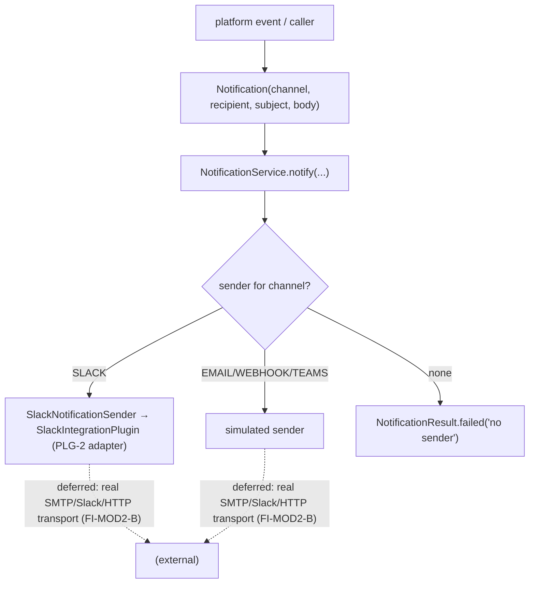

# MOD-2 — Technical Design: `ai-qa-os-notification` (Outbound Comms Module)

**Version:** 1.0.0
**Document Type:** Implementation Technical Design
**Document Status:** Implemented — 2026-07-29 (§0.4 = A SPI + dispatcher; see [Implementation Outcome](#implementation-outcome))
**Last Updated:** 2026-07-29
**Roadmap item:** [`MOD-2`](./AI-QA-OS-Improvement-Roadmap.md#mod-2--ai-qa-os-notification-outbound-comms) (v2.2.0, frozen) — 🟡 P2 · Effort M · Owner Integration · Phase 4 · v2.1
**Modules:** **`ai-qa-os-notification`** (new, 23rd) depending on `core` + `integration`.
**Depends on:** PLG-2 (integration chat plugins — reused as the Slack adapter — ✅).

> **Scope discipline.** MOD-2 creates the **single governed egress point** for outbound comms — a `NotificationSender` SPI + a `NotificationService` dispatcher that routes a notification to the right channel. The dispatch + senders are **fully validatable**; the Slack channel **delegates to the existing PLG-2 `SlackIntegrationPlugin`** (realising "SlackPlugin becomes an adapter"), the rest are simulated. Real transports (SMTP/live Slack/HTTP) and migrating the scattered `reporting`/`orchestration` senders are deferred (§0.3).

---

## 0. Roadmap Verification & Scope

### 0.1 What MOD-2 requires
> Centralise the scattered Slack/email/webhook outbound paths (ENT-2). Depends on `core` + `integration`; consumes platform events; the existing `SlackPlugin` becomes an adapter here. **Impact:** removes a cross-cutting smear; a single governed egress point.

### 0.2 Verified state — the smear is real
- Scattered senders today: `reporting`'s `NotificationFramework`/`SlackNotificationSender`/`TeamsNotificationSender`, `orchestration`'s `SlackPlugin`, `observability`'s `NotificationAdapter`, and PLG-2's `SlackIntegrationPlugin`/`TeamsIntegrationPlugin` (integration). No single egress point.
- No `ai-qa-os-notification` module exists.

### 0.3 Environment reality
- **Validatable now:** a `Notification` model, a `NotificationSender` SPI, per-channel senders, and a `NotificationService` dispatcher (route-by-channel, graceful no-sender handling). The Slack sender **delegates to PLG-2's `SlackIntegrationPlugin`**.
- **Deferred:** real transports (SMTP, live Slack webhook, HTTP POST) — need creds/network (SEC-2), unvalidatable here; migrating `reporting`'s `NotificationFramework` + `orchestration`'s `SlackPlugin` to route through this egress point (FI-MOD2-A); event-driven triggering (ENT-2).

### 0.4 / Decision for approval — transport realism

| Option | Approach | Trade-off |
|---|---|---|
| **A — SPI + dispatcher + simulated/adapter senders (recommended)** | `NotificationSender` SPI + `NotificationService` (route by channel). Slack **delegates to `SlackIntegrationPlugin`** (PLG-2 adapter); Email/Webhook/Teams simulated. | Establishes the single governed egress point, fully validatable; real transports + sender migration deferred. Consistent with PLG-2's simulated-adapter stance. |
| **B — Real transports now** | Implement SMTP/Slack-webhook/HTTP clients. | Needs creds/network for every channel, unvalidatable here — beyond "centralise behind one egress point". |

**Recommend A** — the value is the *single governed egress point*, provable now; real transports ride each channel's follow-up (FI-MOD2-B) under SEC-2 credentials.

> ✅ **Decision (confirmed 2026-07-29): Option A — `NotificationSender` SPI + `NotificationService` dispatcher; Slack delegates to PLG-2 `SlackIntegrationPlugin`, others simulated; real transports + sender migration deferred (FI-MOD2-A/B).** Recorded as ADR-044 (number verified at implement).

---

## 1. Technical Design (Option A)

`ai-qa-os-notification`, package `com.aiqaos.notification`:
- **`NotificationChannel`** — `SLACK` / `EMAIL` / `WEBHOOK` / `TEAMS`.
- **`NotificationSeverity`** — `INFO` / `WARNING` / `CRITICAL`.
- **`Notification`** — `channel`, `recipient`, `subject`, `body`, `severity`.
- **`NotificationResult`** — `delivered`, `message`.
- **`NotificationSender`** (SPI) — `NotificationChannel channel()`, `NotificationResult send(Notification)`.
- **Senders** — `SlackNotificationSender` (**delegates to PLG-2 `SlackIntegrationPlugin`**), `EmailNotificationSender`, `WebhookNotificationSender`, `TeamsNotificationSender` (simulated).
- **`NotificationService`** (`@Service`) — the single egress point: collects `List<NotificationSender>`, routes `notify(Notification)` to the sender whose `channel()` matches; **no sender for a channel → a failed `NotificationResult`** (never throws).

**Defers:** real transports (FI-MOD2-B) · migrate `reporting`/`orchestration` senders to route here (FI-MOD2-A) · event-driven triggering (ENT-2).

---

## 2. Folder Structure
```
ai-qa-os-notification/                    [N] new module (pom → parent; deps core + integration)
  .../notification/
    NotificationChannel.java   [N]  NotificationSeverity.java [N]
    Notification.java          [N]  NotificationResult.java   [N]
    NotificationSender.java    [N] SPI: channel() + send()
    SlackNotificationSender.java   [N] delegates to SlackIntegrationPlugin (PLG-2)
    EmailNotificationSender.java   [N]  WebhookNotificationSender.java [N]  TeamsNotificationSender.java [N]
    NotificationService.java   [N] route-by-channel egress point
+ unit tests: NotificationService (routes to each channel; unknown channel → failed) + a sender (delegation/simulation).
```

---

## 3–5. Classes / DB / API
Key classes above. **DB:** none. **API:** none (event-driven triggering is ENT-2).

---

## 6. Sequence


---

## 7. Plan
1. **Module** — create `ai-qa-os-notification` (pom → parent; deps `core` + `integration`); register in parent `<modules>`.
2. **Model + SPI** — `NotificationChannel`, `NotificationSeverity`, `Notification`, `NotificationResult`, `NotificationSender`.
3. **Senders** — `SlackNotificationSender` (delegates to `SlackIntegrationPlugin`) + `Email`/`Webhook`/`Teams` (simulated).
4. **Dispatcher** — `NotificationService` (route by channel; no-sender → failed).
5. **Tests** — service routes to each channel + unknown-channel→failed; Slack sender delegates. No Mockito.
6. **Build & validate** — targeted `mvn -pl ai-qa-os-notification -am test -Dtest=… -Djacoco.skip=true -DargLine="-Xss40m"`; green. **Then load-check** — confirm no Spring-wiring regressions (per the 2026-07-29 lesson) via the integration `@SpringBootTest`s in the full run.
7. **Sync docs** — tracker `MOD-2` → Completed; **ADR-044** (notification module: single egress point + channel-sender SPI, Slack via PLG-2 adapter). Verify number at implement.

**DoD:** a single `NotificationService` routes a notification to the correct channel sender (Slack via the PLG-2 adapter; others simulated), gracefully handling an unconfigured channel — unit-proven. **Deferred:** real transports, sender migration, event triggering.

---

## Implementation Outcome

Implemented 2026-07-29 (§0.4 = A — SPI + dispatcher, simulated/adapter senders). Recorded as **ADR-044**. **MOD-2 Completed.**

**Files (new module `ai-qa-os-notification`, 23rd; deps `core` + `integration`; registered in parent `<modules>`):**
- `com.aiqaos.notification` — `NotificationChannel` (SLACK/EMAIL/WEBHOOK/TEAMS), `NotificationSeverity`, `Notification`, `NotificationResult`, `NotificationSender` (SPI), `SlackNotificationSender` (**delegates to PLG-2 `SlackIntegrationPlugin`**), `EmailNotificationSender`/`WebhookNotificationSender`/`TeamsNotificationSender` (simulated), `NotificationService` (route-by-channel egress point; no-sender → failed, never throws).

**Validation (Maven):** `mvn -pl ai-qa-os-notification -am test -Dtest=NotificationServiceTest` → **BUILD SUCCESS** (18-project reactor compiled); `NotificationServiceTest` **5/5** (route email/slack-via-adapter/webhook/teams, unconfigured-channel graceful failure + `supportedChannels`, null notification). Ran with `-Djacoco.skip=true -DargLine="-Xss40m"`. All beans are single-constructor plain `@Component`s — no repeat of the earlier Spring-wiring pitfalls.

**Honest scope note:** the **egress point + channel routing + Slack adapter delegation are unit-proven**. **Deferred:** real transports per channel (FI-MOD2-B, SEC-2 creds); migrating the scattered `reporting`/`orchestration`/`observability` senders to route through `NotificationService` (FI-MOD2-A); event-driven triggering (ENT-2).

---

## Appendix — Future Ideas
- **FI-MOD2-A** — Migrate `reporting`'s `NotificationFramework` + `orchestration`'s `SlackPlugin` + `observability`'s `NotificationAdapter` to route through `NotificationService` (finish removing the smear).
- **FI-MOD2-B** — Real transports per channel (SMTP / Slack webhook / HTTP) under SEC-2 credentials.

---

## Compliance Checklist
| Rule | Status |
|---|---|
| Roadmap not modified | ✅ MOD-2 metadata untouched |
| New module, deps core + integration | ✅ as specified |
| SlackPlugin becomes an adapter | ✅ Slack sender delegates to PLG-2 `SlackIntegrationPlugin` |
| Non-breaking | ✅ additive new module; existing senders untouched (migration deferred) |
| Spring-wiring sanity | ✅ single constructors / plain `@Component`s (per 2026-07-29 lesson); load-checked in full run |
| ADR discipline | ✅ ADR-044 to be recorded (number verified at implement) |

---

## Document Completion Status
**Status:** Implemented — 2026-07-29 (§0.4 = A). MOD-2 Completed. See [Implementation Outcome](#implementation-outcome). ADR-044.
**Implements:** `MOD-2` (roadmap v2.2.0, frozen) — the notification egress module; real transports + migration deferred.
**Next step:** On approval + option choice, execute [§7](#7-step-by-step-implementation-plan) from Step 1.
