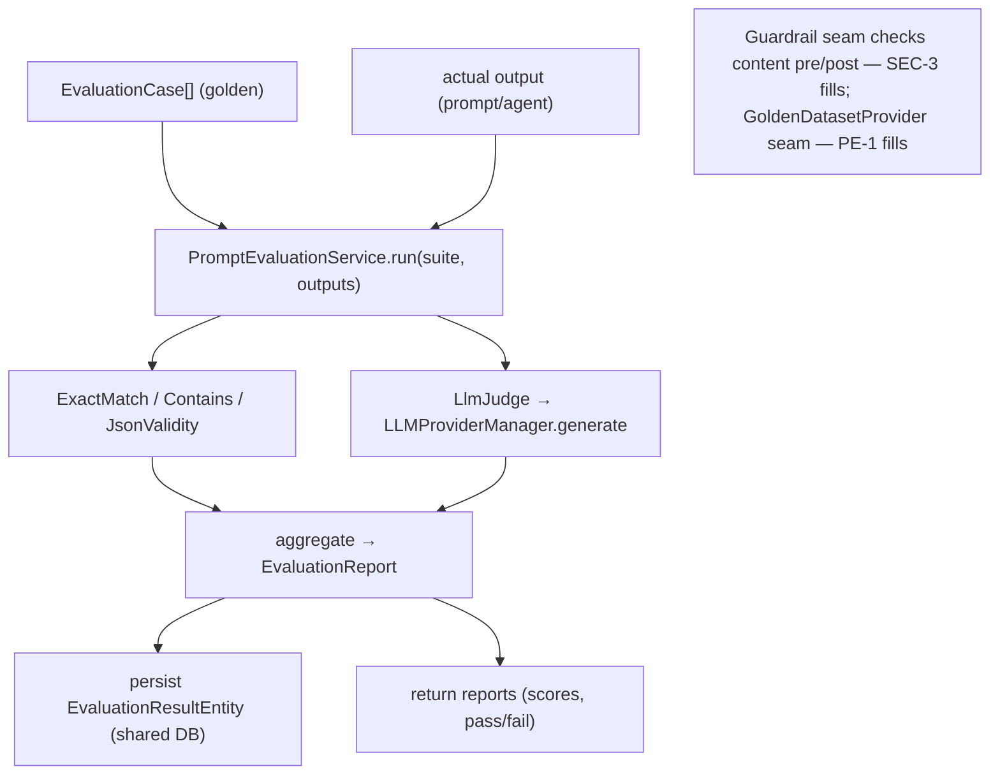

# MOD-3 — Technical Design: `ai-qa-os-eval` (Evaluation & Guardrails)

**Version:** 1.0.0
**Document Type:** Implementation Technical Design
**Document Status:** Implemented — 2026-07-22 (Option A working-anchor; see [Implementation Outcome](#implementation-outcome))
**Last Updated:** 2026-07-22
**Roadmap item:** [`MOD-3`](./AI-QA-OS-Improvement-Roadmap.md) (v2.2.0, frozen) — 🟠 P1 · Effort M · Owner AI/Eval · Phase 1 · v1.4
**Module:** **`ai-qa-os-eval` (new)** — depends on `core`, `intelligence`, `memory`, `ai-provider`.
**Anchors:** AI-3, PE-1/PE-2/PE-3 (Category Q), SEC-3 (guardrails) all build on this module.

> **Scope discipline.** MOD-3 creates the **module and its foundational abstractions** plus **working reference implementations** — the home where "is the AI good and safe?" lives. It does **not** build the full prompt regression harness (AI-3), golden-dataset management / scoring / benchmarking / A-B / leaderboard (PE-1/PE-2), the quality dashboard (PE-3), or prompt-injection guardrails (SEC-3). It provides the *seams* those fill.

---

## 0. Roadmap Verification & Grounded Findings

### 0.1 What MOD-3 requires (from the finalized roadmap)

> Home for prompt evaluation (AI-3), RAG retrieval-quality metrics, and AI guardrails (SEC-3). No module owns "is the AI actually good and safe." Depends on `core`, `intelligence`, `memory`, `ai-provider`. Anchors Category Q.

### 0.2 Verified facts (read during design)

| Fact | Detail |
|---|---|
| New module | Parent `pom.xml` lists 20 modules; MOD-3 adds `ai-qa-os-eval` (21st). This is a **roadmap-defined new module**, not a duplicate (respects `PROJECT_CONTEXT.md`). |
| Mirror pattern | Module poms inherit the parent; e.g. `ai-qa-os-intelligence` depends on `core` + `memory`. MOD-3 adds `intelligence` + `ai-provider`. |
| LLM entry point | `LLMProviderManager.generate(LLMRequest) → LLMResponse` (for an LLM-judge). `LLMRequest` supports `prompt`, `systemPrompt`, `temperature`, `maxTokens`, `agentType`, `purpose`. |
| What is evaluated | `ai-qa-os-intelligence` owns prompts (`PromptVersionEntity`, `PromptExecutionEntity`); MOD-3 evaluates prompt/agent **outputs** against golden cases. Deep prompt-version wiring is AI-3/PE-1's job. |
| The stub problem | The codebase already has empty modules (`testdata`, `data`). MOD-3 should ship as a **working anchor**, not another shell — see [§0.4](#04--decision-for-approval). |

### 0.3 The abstractions MOD-3 introduces

A small, stable contract set in `com.aiqaos.eval.contract` that AI-3/PE-1/SEC-3 extend:

- **`Evaluator`** — `EvaluationResult evaluate(EvaluationCase testCase, String actualOutput)`.
- **`EvaluationResult`** — `evaluatorName`, `score` (0..1), `passed`, `reason`.
- **`EvaluationCase`** — a golden case: `id`, `input`, `expectedOutput`, `criteria`, `tags`.
- **`EvaluationReport`** — per-case aggregate of `EvaluationResult`s (overall score/passed).
- **`Guardrail`** — `GuardrailVerdict check(String content, GuardrailContext ctx)` (the SEC-3 seam).
- **`GoldenDatasetProvider`** — `List<EvaluationCase> load(String suite)` (the PE-1 seam).

### 0.4 / Decision for approval

MOD-3 is a **new anchor module**. The one real choice is **how thick to ship it now**:

| Option | What ships | Trade-off |
|---|---|---|
| **A — Working anchor (recommended)** | The module + contracts + **working reference evaluators** (exact-match, contains, JSON-validity) + a minimal **LLM-judge** + a reference **guardrail** + an in-memory **golden-dataset provider** + a `PromptEvaluationService` + **eval-result persistence** (entity + `V15` migration) + tests | Real, testable capability from day one; AI-3/PE-1/SEC-3 extend the seams. Slightly more surface now. |
| **B — Contracts-only scaffold** | Just the module + the interfaces, no working impls/persistence | Minimal now, but ships **another empty module** (the `testdata`/`data` anti-pattern) — AI-3 then does everything |

**Recommend A** — the platform already has two stub modules; a "quality & safety" anchor that can't run anything undercuts its own purpose. This design is written for A; §7 notes B's reductions.

> ✅ **Decision (confirmed 2026-07-22): Option A — Working anchor.** The module ships with contracts + working reference evaluators + a minimal LLM-judge + a reference guardrail + an in-memory golden-dataset provider + `PromptEvaluationService` + eval-result persistence (`V15`) + unit tests.

---

## 1. Technical Design

### 1.1 The module

`ai-qa-os-eval` (packaging `jar`), registered in the parent `<modules>`, depending on `core`, `intelligence`, `memory`, `ai-provider` (+ test). Package root `com.aiqaos.eval`.

### 1.2 Reference evaluators (all implement `Evaluator`)

- **`ExactMatchEvaluator`** — `score = expected.equals(actual) ? 1 : 0`.
- **`ContainsEvaluator`** — score by fraction of `criteria` substrings present in the output.
- **`JsonValidityEvaluator`** — parses the output as JSON (Jackson) and checks required fields from `criteria`; `passed` when structurally valid. (Directly useful — the pipeline's agents emit JSON that `LLMResponseValidator` already normalizes.)
- **`LlmJudgeEvaluator`** — builds a judge `LLMRequest` (system prompt = "score this output against the criteria 0–1"), calls `LLMProviderManager.generate`, parses the numeric score. The provider call goes through an injected seam so the **parsing** is unit-tested without a live LLM. *(Minimal — AI-3/PE-1 enrich rubric/consistency.)*

### 1.3 Guardrail seam (SEC-3 fills it)

- **`Guardrail`** + **`GuardrailVerdict`** (`allowed`, `action` ALLOW/BLOCK/SANITIZE, `reason`) + a trivial reference **`NonEmptyOutputGuardrail`**. SEC-3 adds input-sanitisation / prompt-injection / output-allow-list guardrails on this contract.

### 1.4 Golden dataset seam (PE-1 fills it)

- **`GoldenDatasetProvider`** + a reference **`InMemoryGoldenDatasetProvider`** (and optionally classpath JSON). PE-1 adds durable / vector-backed datasets (via `memory`).

### 1.5 Orchestration + persistence

- **`PromptEvaluationService`** — given a suite (`List<EvaluationCase>`) and the actual outputs (or a supplier), runs the registered evaluators, aggregates into `EvaluationReport`s, and persists each result. This is the entry point AI-3's harness and PE-1's benchmarking call.
- **`EvaluationResultEntity`** + **`EvaluationResultRepository`** (shared DB) — durable eval results (suite, case id, evaluator, score, passed, promptVersion, timestamp), feeding PE-3's dashboard and GOV-1's audit. **`V15__eval_results.sql`**.

### 1.6 What MOD-3 defers (the seams)

Full regression harness + CI gate (AI-3) · golden-dataset management, scoring, benchmarking, A-B, leaderboard (PE-1/PE-2) · quality dashboard + endpoints (PE-3) · prompt-injection / input-sanitisation guardrails (SEC-3) · full RAG retrieval-quality metrics (a `RetrievalQualityMetric` seam is provided; the impl is future).

---

## 2. Folder Structure

```
AI-QA-OS-Core/
├── pom.xml                                          [M] add <module>ai-qa-os-eval</module>
├── ai-qa-os-eval/                                   [N] new module
│   ├── pom.xml                                      [N] deps: core, intelligence, memory, ai-provider, test
│   └── src/
│       ├── main/java/com/aiqaos/eval/
│       │   ├── contract/  Evaluator · EvaluationResult · EvaluationCase · EvaluationReport
│       │   │              · Guardrail · GuardrailVerdict · GuardrailContext
│       │   │              · GoldenDatasetProvider · RetrievalQualityMetric
│       │   ├── evaluator/ ExactMatchEvaluator · ContainsEvaluator · JsonValidityEvaluator · LlmJudgeEvaluator
│       │   ├── guardrail/ NonEmptyOutputGuardrail
│       │   ├── dataset/   InMemoryGoldenDatasetProvider
│       │   ├── entity/    EvaluationResultEntity
│       │   ├── repository/EvaluationResultRepository
│       │   └── service/   PromptEvaluationService
│       └── test/java/com/aiqaos/eval/    evaluator + service unit tests
└── deployment/migration/db/migration/
    └── V15__eval_results.sql                        [N]
```

---

## 3. Required Classes (key)

| Class | Type | Responsibility |
|---|---|---|
| `Evaluator` / `EvaluationResult` / `EvaluationCase` / `EvaluationReport` | New | Core evaluation contracts |
| `Guardrail` / `GuardrailVerdict` | New | Safety seam (SEC-3 fills) |
| `GoldenDatasetProvider` / `RetrievalQualityMetric` | New | Dataset + RAG-metric seams (PE-1 / future) |
| `ExactMatch` / `Contains` / `JsonValidity` / `LlmJudge` Evaluator | New | Working reference evaluators |
| `NonEmptyOutputGuardrail`, `InMemoryGoldenDatasetProvider` | New | Reference impls |
| `PromptEvaluationService` | New | Run evaluators over a suite, aggregate, persist |
| `EvaluationResultEntity` / `EvaluationResultRepository` | New | Durable eval results (shared DB) |

---

## 4. Database Changes

**One migration (Option A):** `V15__eval_results.sql` — `eval_results` (id, suite, case_id, evaluator, score, passed, prompt_version, agent_type, reason, created_time, + BaseEntity audit columns). `ddl-auto: validate` unchanged. *(Option B: no migration.)*

---

## 5. API Changes

**None.** `ai-qa-os-eval` is a library module — no REST surface. Evaluation endpoints/dashboard are PE-3; the pipeline/CI integration is AI-3. MOD-3 is consumed programmatically.

---

## 6. Sequence Diagram



---

## 7. Step-by-Step Implementation Plan

1. **Module + parent registration.** Create `ai-qa-os-eval/pom.xml` (deps per §1.1); add `<module>` to the parent (place after `ai-qa-os-ai-provider`, honouring dependency order).
2. **Contracts.** `Evaluator`, `EvaluationResult`, `EvaluationCase`, `EvaluationReport`, `Guardrail`/`GuardrailVerdict`/`GuardrailContext`, `GoldenDatasetProvider`, `RetrievalQualityMetric`.
3. **Reference evaluators** — exact-match, contains, JSON-validity (deterministic); `LlmJudgeEvaluator` with an injectable LLM seam.
4. **Reference guardrail + dataset provider** — `NonEmptyOutputGuardrail`, `InMemoryGoldenDatasetProvider`.
5. **Persistence** — `EvaluationResultEntity` + repository; `V15` migration.
6. **`PromptEvaluationService`** — run evaluators over a suite, aggregate, persist (repo optional via `ObjectProvider`, like AI-1/AI-2, so unit tests run without JPA).
7. **Tests** — deterministic evaluator matrices; `LlmJudge` parsing (stub LLM); `PromptEvaluationService` aggregation. No Mockito (JDK-25 constraint) — hand-written stubs.
8. **Build & validate.** `mvn -pl ai-qa-os-eval -am test`; confirm the reactor still builds with the new module. Report honestly.
9. **Sync docs.** Tracker `MOD-3` status; note AI-3/PE-1/SEC-3 unblocked; add **ADR-012** (a new "quality & safety" module + evaluation contract seam is a real architectural decision).

**Definition of Done:** `ai-qa-os-eval` exists in the reactor and builds; the evaluation + guardrail + dataset contracts are defined; working reference evaluators + persistence + service are in place and unit-tested; AI-3/PE-1/SEC-3 have concrete seams to extend; tracker updated.

---

## Implementation Outcome

Implemented 2026-07-22 as **Option A — Working anchor**. Recorded as **ADR-012**.

> **Update (2026-07-23, SEC-3 / ADR-015):** the `Guardrail`/`GuardrailVerdict`/`GuardrailContext` contract was subsequently **promoted from `eval` to `com.aiqaos.core.guardrail`** so `intelligence`/`orchestration`/`execution` could implement it without a dependency cycle. MOD-3's `NonEmptyOutputGuardrail` now imports the contract from `core`; everything else below is unchanged.

**Files (all new unless noted):**
- **module** — `ai-qa-os-eval/pom.xml` (deps core, intelligence, memory, ai-provider, test); parent `pom.xml` [M] +`<module>ai-qa-os-eval</module>` (21st).
- **contract/** — `Evaluator`, `EvaluationResult`, `EvaluationCase`, `EvaluationReport`, `Guardrail`, `GuardrailVerdict`, `GuardrailContext`, `GoldenDatasetProvider`, `RetrievalQualityMetric`.
- **evaluator/** — `ExactMatchEvaluator`, `ContainsEvaluator`, `JsonValidityEvaluator` (deterministic), `LlmJudgeEvaluator` (behind a `JudgeLlm` seam), `LlmProviderJudge` (prod seam → `LLMProviderManager.generate(...).getText()`, temp 0).
- **guardrail/** — `NonEmptyOutputGuardrail`. **dataset/** — `InMemoryGoldenDatasetProvider`.
- **entity/repository/** — `EvaluationResultEntity` (extends `BaseEntity`) + `EvaluationResultRepository`. **service/** — `PromptEvaluationService` (runs all evaluators, aggregates, best-effort persist via `ObjectProvider`).
- **DB** — `deployment/migration/db/migration/V15__eval_results.sql`.
- **tests** — `ReferenceEvaluatorsTest` (7), `LlmJudgeEvaluatorTest` (6), `PromptEvaluationServiceTest` (3).

**Validation (JDK 25 / Maven):**
- `mvn -pl ai-qa-os-eval -am test` → upstream modules build; **eval tests 16/16, BUILD SUCCESS**.
- The new module resolves in the reactor (parent registration correct).
- No Mockito (JDK-25 constraint) — the LLM-judge seam and a no-op `ObjectProvider` cover the mock-shaped needs with hand-written stubs (consistent with AI-1/AI-2).

**Honest scope note:** `ai-qa-os-eval` is a **leaf** — nothing depends on it yet — so its `@Component`s and `EvaluationResultEntity` are **dormant at runtime** and the `V15` table is unused until AI-3/PE-1 wire eval into an app. The LLM-judge is deliberately minimal (single score, no consistency/self-agreement). These are by design: MOD-3 delivers the *anchor + seams*, and AI-3 (harness), PE-1/2/3 (scoring/benchmarking/dashboard), and SEC-3 (real guardrails) fill them.

---

## Appendix — Future Ideas (Outside Current Roadmap)

- **FI-MOD3-A — RAG retrieval-quality metrics impl** (precision@k / recall over `memory` retrieval) on the `RetrievalQualityMetric` seam.
- **FI-MOD3-B — Consistency / self-agreement judging** (multi-sample LLM-judge) beyond a single score.

---

## Compliance Checklist

| Rule | Status |
|---|---|
| Roadmap not modified | ✅ MOD-3 metadata untouched |
| New module is roadmap-defined, not a duplicate | ✅ `ai-qa-os-eval` per the roadmap |
| Dependency rule | ✅ deps inward: core/intelligence/memory/ai-provider; nothing depends on eval yet |
| No behaviour change to existing modules | ✅ additive module only |
| Out-of-scope items untouched | ✅ AI-3 harness / PE-1..3 / SEC-3 guardrails deferred to their seams |

---

## Document Completion Status

**Status:** Draft — Awaiting Implementation Approval (§0.4 resolved: **Option A — Working anchor**)
**Version:** 1.0.0
**Implements:** `MOD-3` (roadmap v2.2.0, frozen)
**Next step:** On approval + option choice, execute [§7](#7-step-by-step-implementation-plan) from Step 1. No code until approved.
