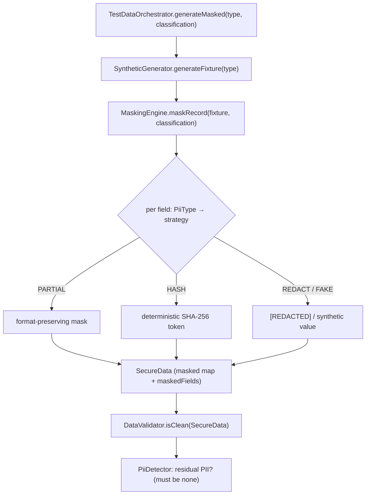

# MOD-4 — Technical Design: Make `ai-qa-os-testdata` Real (PII Masking)

**Version:** 1.0.0
**Document Type:** Implementation Technical Design
**Document Status:** Implemented — 2026-07-28 (§0.4 = A masking-core + spine; see [Implementation Outcome](#implementation-outcome))
**Last Updated:** 2026-07-28
**Roadmap item:** [`MOD-4`](./AI-QA-OS-Improvement-Roadmap.md#mod-4--make-ai-qa-os-testdata-real) (v2.2.0, frozen) — 🟠 P1 · Effort M · Owner Test Data / AI · Phase 4 · v2.1
**Modules:** `ai-qa-os-testdata` (fill the existing module — no new module).
**Depends on:** none blocking (`core` only). Feeds Category N compliance (GOV-2) and complements GOV-3's PII policy.

> **Scope discipline.** MOD-4 turns the stubbed `ai-qa-os-testdata` into a real module, led by its flagship: **PII masking** (`MaskingEngine`) — a genuine GDPR/enterprise feature and a designed pipeline stage. The masking engine + a minimal generate→mask→validate spine are **fully buildable/validatable** (pure logic). The speculative optimizer/pipeline/repository scaffolds are deferred (§0.4).

---

## 0. Roadmap Verification, What Exists, and Scope

### 0.1 What MOD-4 requires

> `ai-qa-os-testdata` is a stub today (empty declarations, including a `MaskingEngine`), but test-data intelligence with **PII masking** is both a designed pipeline stage and a compliance feature. **Fill the existing module — do not create a new one.** PII masking is a genuine GDPR requirement feeding Category N (AI Governance & Compliance).

### 0.2 Verified current state

| Fact | Detail |
|---|---|
| `SyntheticGenerator` is **real** | WF-1 filled it — `generateFixture(datasetType)` produces `PAYMENT_METHOD` / `ORDER_ITEM` / `USER_PROFILE` fixtures (incl. card numbers, emails). Consumed by `AutonomousQAPipelineOrchestrator`. |
| Everything else is an **empty stub** | `MaskingEngine`, `MaskingService`, `SecureData`, `DataValidator`, `TestDataOrchestrator`, `DataGenerator`, `TestData`, `SyntheticData`, `DataOptimizer`/`OptimizedDataset`, `DataPipeline`/`PipelineManager`/`PipelineService`, `DataRepository`/`Dataset`, `Validator`/`ValidationResult` — all `{}`. |
| Module deps | `ai-qa-os-testdata` depends on **`core` only** (not `intelligence`/`ai-provider` as the roadmap anticipated). |

### 0.3 Dependency reality

The masking feature is **self-contained regex + strategy logic** — it needs nothing from `intelligence`/`ai-provider`. So MOD-4 **adds no module dependency** (keeps testdata on `core`), avoiding a graph change for a feature that doesn't need it. (GOV-3's PII patterns live in `intelligence` and aren't reused across the module boundary; the small duplication of PII regexes is the right trade vs. inverting the graph — the ConfidenceGate lesson.)

### 0.4 / Decision for approval — how much of the module to fill

| Option | Approach | Trade-off |
|---|---|---|
| **A — PII-masking core + a thin generate→mask→validate spine (recommended)** | Make the flagship real: `PiiDetector`, `MaskingEngine`/`MaskingService`/`SecureData`/`MaskingProperties` (strategies REDACT / PARTIAL / HASH / FAKE), wire `TestDataOrchestrator` (SyntheticGenerator → mask classified fields) and `DataValidator` (residual-PII check). Defer the optimizer/pipeline/repository scaffolds. | Delivers the compliance feature the roadmap names, fully validatable, minimal surface. Leaves speculative scaffolds empty (no consumer yet). |
| **B — Fill the entire module** | Also make `DataOptimizer`, `DataPipeline`/`PipelineManager`/`PipelineService`, `DataRepository`/`Dataset`, `Validator`/`ValidationResult` real. | "Complete", but most of it is scaffolding with no consumer — speculative code that dilutes the compliance focus and adds untested surface. |

**Recommend A** — fill what has a real purpose and a testable contract now (masking + the spine that exercises it), and defer the scaffolds until a consumer exists (FI-MOD4-A). Ships the GDPR feature that feeds GOV-2, without speculative bulk.

> ✅ **Decision (confirmed 2026-07-28): Option A — PII-masking core + a thin generate→mask→validate spine; optimizer/pipeline/repository scaffolds deferred (FI-MOD4-A).** Default strategy PARTIAL. Recorded as ADR-030 (number verified at implement).

> **Default within A (made, not a fork):** the default masking strategy is **PARTIAL** (format-preserving — `j***@e***.com`, `**** **** **** 4444`), with **HASH** (deterministic pseudonymization, preserves referential integrity), **REDACT**, and **FAKE** selectable per PII type via config.

---

## 1. Technical Design (Option A)

### 1.1 PII model + detection
- **`PiiType`** — `EMAIL`, `CREDIT_CARD`, `SSN`, `PHONE`, `NAME`, `GENERIC`.
- **`PiiDetector`** — regex detection over free text: `Set<PiiType> typesIn(String)`, `boolean containsPii(String)`, `String maskDetected(String, MaskingEngine)`. One shared detector used by both the engine (auto-detect path) and the validator (residual-PII check) — no duplicated patterns.

### 1.2 Masking engine (the flagship)
- **`MaskingStrategy`** — `REDACT` (→ `[REDACTED]`), `PARTIAL` (format-preserving partial mask), `HASH` (deterministic `SHA-256` short token — same input→same token, so keys/joins survive), `FAKE` (synthetic realistic replacement).
- **`MaskingService`** (fill the interface) — `String mask(String value, PiiType type)`; `String maskText(String freeText)` (auto-detect + mask); `SecureData maskRecord(Map<String,Object> record, Map<String,PiiType> classification)`.
- **`MaskingEngine`** (`@Component implements MaskingService`) — applies the configured strategy per `PiiType` (default PARTIAL); classification-driven for structured records, detector-driven for free text. Pure, deterministic (HASH salted from config).
- **`SecureData`** (fill) — the masking result: the masked `Map<String,Object>` + the `Set<String>` of fields masked + count.
- **`MaskingProperties`** — `aiqaos.testdata.masking.*`: `defaultStrategy`, per-type `strategies`, `hashSalt`, `maskChar`.

### 1.3 The generate→mask→validate spine
- **`TestDataOrchestrator`** (`@Component`) — injects the real `SyntheticGenerator` + `MaskingEngine`: `SecureData generateMasked(String datasetType, Map<String,PiiType> classification)` — generate a fixture, then mask its classified fields. Proves the module works end-to-end.
- **`DataValidator`** (`@Component`) — injects `PiiDetector`: `boolean isClean(SecureData)` / `Set<PiiType> residualPii(...)` — verifies masking left **no raw PII** (the compliance assertion).

### 1.4 What MOD-4 defers
`DataOptimizer`/`OptimizedDataset`, `DataPipeline`/`PipelineManager`/`PipelineService`, `DataRepository`/`Dataset` durable store, `DataGenerator`/`TestData`/`SyntheticData`/`Validator`/`ValidationResult` scaffolds (FI-MOD4-A) · wiring masking into the orchestration pipeline as a real stage (FI-MOD4-B) · a reversible tokenization vault (FI-MOD4-C) · a real faker library for `FAKE` (FI-MOD4-D).

---

## 2. Folder Structure

```
ai-qa-os-testdata/.../security/
    PiiType.java             [N] EMAIL/CREDIT_CARD/SSN/PHONE/NAME/GENERIC
    PiiDetector.java         [N] regex detection (shared by engine + validator)
    MaskingStrategy.java     [N] REDACT/PARTIAL/HASH/FAKE
    MaskingProperties.java   [N] aiqaos.testdata.masking.*
    MaskingService.java      [F] interface: mask / maskText / maskRecord
    MaskingEngine.java       [F] @Component impl (strategy per type)
    SecureData.java          [F] masked data + maskedFields
ai-qa-os-testdata/.../orchestrator/
    TestDataOrchestrator.java [F] @Component: SyntheticGenerator → mask
ai-qa-os-testdata/.../validation/
    DataValidator.java        [F] @Component: residual-PII check
+ unit tests: PiiDetector, MaskingEngine (each strategy + record), orchestrator (generate→mask), validator (residual PII).
    ([N]=new, [F]=fill existing stub)
```

---

## 3. Required Classes (key)

| Class | Type | Responsibility |
|---|---|---|
| `PiiType` / `PiiDetector` | New | PII taxonomy + shared regex detection |
| `MaskingStrategy` / `MaskingProperties` | New | Strategy enum + `aiqaos.testdata.masking.*` |
| `MaskingService` / `MaskingEngine` / `SecureData` | Fill | The masking engine (flagship) + result |
| `TestDataOrchestrator` | Fill | generate (SyntheticGenerator) → mask |
| `DataValidator` | Fill | residual-PII compliance assertion |

---

## 4. Database Changes

**None.** Masking is stateless pure logic; generated fixtures are in-memory. (A durable dataset store — `DataRepository`/`Dataset` — is deferred, FI-MOD4-A.)

---

## 5. API Changes

**None.** MOD-4 fills a service module; there is no new public endpoint. (Masking is invoked by the orchestration pipeline / other modules programmatically.)

---

## 6. Sequence Diagram



---

## 7. Step-by-Step Implementation Plan

1. **PII model + detection** — `PiiType`, `PiiDetector` (email/card/SSN/phone regexes).
2. **Masking** — `MaskingStrategy`, `MaskingProperties`, fill `MaskingService`/`MaskingEngine`/`SecureData` (strategy per type; default PARTIAL; deterministic HASH).
3. **Spine** — fill `TestDataOrchestrator` (SyntheticGenerator → mask) + `DataValidator` (residual-PII check).
4. **Tests** — detector (each type), engine (each strategy, record masking, HASH determinism, PARTIAL format-preservation), orchestrator (generate→mask leaves no raw PII), validator (flags residual). No Mockito.
5. **Build & validate** — `mvn -pl ai-qa-os-testdata -am test` (targeted — additive module, `core` only); green. Note the deferred scaffolds.
6. **Sync docs** — tracker `MOD-4`; **ADR-030** (real PII-masking engine — classification-driven, pluggable strategies, format-preserving default). Verify ADR number at implement.

**Definition of Done:** `ai-qa-os-testdata` masks PII (classification-driven + auto-detect) with pluggable strategies, generates-then-masks synthetic fixtures end-to-end, and asserts no raw PII survives — all unit-proven. **Deferred:** optimizer/pipeline/repository scaffolds, orchestration-stage wiring, tokenization vault, real faker.

---

## Implementation Outcome

Implemented 2026-07-28 (§0.4 = A — PII-masking core + generate→mask→validate spine). Recorded as **ADR-030**.

**Files (`ai-qa-os-testdata`; [N]=new, [F]=filled stub):**
- **security/** — `PiiType` [N], `PiiDetector` [N] (email/SSN/card/phone; card requires 15–16 digits so 13-digit epoch timestamps aren't misread), `MaskingStrategy` [N] (REDACT/PARTIAL/HASH/FAKE), `MaskingProperties` [N] (`aiqaos.testdata.masking.*`, per-`PiiType` override), `MaskingService` [F], `MaskingEngine` [F] (default PARTIAL format-preserving; HASH = deterministic SHA-256 token → referential integrity; classification-driven `maskRecord` + auto-detect `maskText`), `SecureData` [F] (masked map + masked fields).
- **orchestrator/** — `TestDataOrchestrator` [F] (drives WF-1's real `SyntheticGenerator` → mask; per-dataset default classification).
- **validation/** — `DataValidator` [F] (residual-PII re-scan; `isClean`/`residualPii`).

**Stayed on `core` only** — no module dependency added (masking is self-contained). PII regexes are deliberately duplicated with GOV-3's (in `intelligence`) rather than inverting the module graph.

**Validation (Maven):** `mvn -pl ai-qa-os-testdata -am test` → **BUILD SUCCESS**; **16 tests** — `PiiDetectorTest` 6 (each type; clean text; 13-digit timestamp ≠ card), `MaskingEngineTest` 7 (PARTIAL email/card, REDACT, HASH determinism, FAKE, maskText scrub, maskRecord classified-only), `TestDataOrchestratorTest` 3 (PAYMENT_METHOD + USER_PROFILE masked & clean; unmasked record fails validation — the validator has teeth). Ran with `-Djacoco.skip=true` (JaCoCo 0.8.12 can't instrument Java 25 bytecode — toolchain limit, not code).

**Honest scope note:** the **masking engine + detection + spine are fully unit-proven**. **Deferred:** optimizer/pipeline/repository scaffolds (FI-MOD4-A); masking as a first-class orchestration-pipeline stage (FI-MOD4-B); reversible tokenization vault (FI-MOD4-C); a real faker library for `FAKE` (FI-MOD4-D).

---

## Appendix — Future Ideas (Outside Current Roadmap)

- **FI-MOD4-A** — Fill the remaining scaffolds (`DataOptimizer`, `DataPipeline`, `DataRepository`/`Dataset` durable store) when a real consumer exists.
- **FI-MOD4-B** — Wire masking into the orchestration pipeline as a first-class stage (mask synthesized data before it reaches execution).
- **FI-MOD4-C** — Reversible tokenization vault (pseudonymize with controlled re-identification for authorized flows).
- **FI-MOD4-D** — Real faker library for the `FAKE` strategy (locale-aware realistic values).

---

## Compliance Checklist

| Rule | Status |
|---|---|
| Roadmap not modified | ✅ MOD-4 metadata untouched |
| Fill existing module (no new) | ✅ fills `ai-qa-os-testdata` stubs; no new module |
| Dependency reality | ✅ stays on `core` only (masking is self-contained); no graph change |
| Reuses WF-1's `SyntheticGenerator` | ✅ orchestrator drives the existing real generator |
| Non-breaking | ✅ additive; empty stubs filled; no schema/API change |
| Honesty (ADR-009) | ✅ scaffolds + orchestration wiring flagged deferred |
| ADR discipline | ✅ ADR-030 to be recorded (number verified at implement) |

---

## Document Completion Status

**Status:** Implemented — 2026-07-28 (§0.4 = A). See [Implementation Outcome](#implementation-outcome). ADR-030.
**Version:** 1.0.0
**Implements:** `MOD-4` (roadmap v2.2.0, frozen) — real PII-masking engine + generate→mask→validate spine; scaffolds deferred.
**Next step:** On approval + option choice, execute [§7](#7-step-by-step-implementation-plan) from Step 1. No code until approved.
