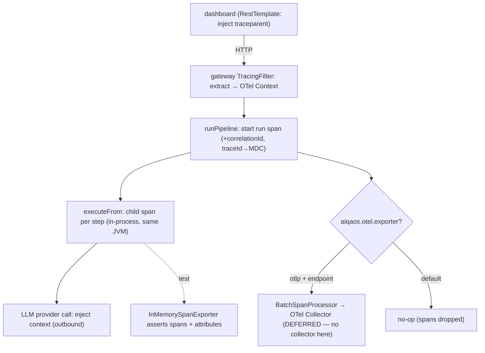

# OBS-1 — Technical Design: End-to-End Distributed Tracing

**Version:** 1.0.0
**Document Type:** Implementation Technical Design
**Document Status:** Implemented — 2026-07-23 (instrumentation + boundary wiring; see [Implementation Outcome](#implementation-outcome))
**Last Updated:** 2026-07-23
**Roadmap item:** [`OBS-1`](./AI-QA-OS-Improvement-Roadmap.md#obs-1--end-to-end-distributed-tracing) (v2.2.0, frozen) — 🟠 P1 · Effort M · Owner Observability · Phase 2 · v1.5
**Module:** `ai-qa-os-observability` (+ orchestration instrumentation, gateway/dashboard propagation).
**Depends on:** **MNT-6** (correlationId in MDC) — **done**. Foundational for OBS-2/OBS-3 and Category K.

> **Scope discipline.** OBS-1 **wires the OTel that already exists** end-to-end: give the SDK an exporter, create spans across the workflow, link trace↔log via `correlationId`/`traceId`, and propagate context on the cross-JVM hop. The instrumentation is validatable here (OTel's in-memory exporter); **export to the running OTel Collector is deferred** (no collector/infra in this environment).

---

## 0. Roadmap Verification, Current State, and the Reality Check

### 0.1 What OBS-1 requires

> A single workflow spans gateway → orchestration → agents → provider → execution. Without trace context propagated across those hops, diagnosing a run means manual log-grepping. **OTel is present but not wired end-to-end.** **Where:** propagate OTel context (and the existing `correlationId`, MNT-6) across all boundaries; **export to the already-deployed OTel Collector.**

### 0.2 Verified current state — the SDK is configured but inert

| Fact | Detail |
|---|---|
| SDK, no exporter | `TelemetryConfig` builds `SdkTracerProvider.builder().build()` — **no span processor, no exporter** — so spans are created and immediately dropped. W3C propagators are set; `Tracer`/`OpenTelemetry` beans exist. |
| Helpers exist, uncalled | `SpanManager` (child spans), `TraceManager` (start/end span), `TraceContextPropagator` (inject/extract), `CorrelationTraceBridge` (`correlationId` → MDC + span attribute) are all present @Components — but **nothing calls them** at the pipeline/HTTP boundaries. |
| Deps | `opentelemetry-api` + `opentelemetry-sdk` present; **no** `opentelemetry-exporter-otlp` and **no** `opentelemetry-sdk-testing`. OBS-1 adds them. |
| Topology | The **OTel Collector** exists in `deployment/kubernetes/otel-collector.yaml` — but no cluster/collector runs in this environment. |
| Same-JVM reality | Gateway runs the orchestration pipeline **in-process** (AI-2), so gateway → orchestration → agents → provider → execution share a JVM and OTel `Context` propagates thread-locally. The genuine **cross-JVM** hop is **dashboard ↔ gateway** (HTTP); the external hop is the **LLM provider** call. |

### 0.3 / Environment Reality

- **Buildable + validatable here:** the exporter *configuration*, span creation across the pipeline, `correlationId`/`traceId` linking, and `TraceContextPropagator` inject/extract — all provable with OTel's **`InMemorySpanExporter`** (test scope).
- **Deferred (needs infra):** the actual **OTLP export to the running collector**, and validating a **live cross-JVM trace** (needs both apps + the collector up). Same wall as SCALE-1/ENT-5's backends.

### 0.4 / Decision for approval — exporter default (given no collector here)

| Option | Default behaviour | Trade-off |
|---|---|---|
| **A — No-op default, OTLP opt-in (recommended)** | Spans are created + instrumented but **not exported** unless `aiqaos.otel.exporter=otlp` + an endpoint is set (→ the collector). | Production-sane and non-breaking: silent, near-zero overhead until a collector is configured; the real export drops in by config. Instrumentation validated via `InMemorySpanExporter`. |
| **B — Logging exporter default** | Spans are printed to the logs by default. | Immediately visible locally without a collector (demo-friendly), but noisy in normal operation and not what you want in production. |

**Recommend A** — export is an environment concern; default to no-op so tracing is inert until the collector endpoint is set, and prove the instrumentation with the in-memory exporter. (`opentelemetry-exporter-logging` can be added later for local demos, FI-OBS1-B.)

> ✅ **Decision (confirmed 2026-07-23): Option A — no-op default, OTLP opt-in** (`aiqaos.otel.exporter=otlp` + endpoint). Instrumentation validated via `InMemorySpanExporter`. Recorded as ADR-020.

---

## 1. Technical Design (Option A)

### 1.1 Exporter + resource (`TelemetryConfig`)
- Add `opentelemetry-exporter-otlp` (main) + `opentelemetry-sdk-testing` (test).
- Build the `SdkTracerProvider` with a **`Resource`** (`service.name=ai-qa-os`) and a span processor chosen by config: `aiqaos.otel.exporter=otlp` + `aiqaos.otel.endpoint` → `BatchSpanProcessor(OtlpGrpcSpanExporter)`; otherwise **no processor** (no-op default). Keep the W3C propagators.

### 1.2 Pipeline instrumentation (`orchestration`)
- In `AutonomousQAPipelineOrchestrator`: start a **run span** at `runPipeline`, and a **child span per step** in `executeFrom`, via the existing `TraceManager`/`SpanManager` (injected optionally through `ObjectProvider`, so the pipeline still runs if tracing beans are absent — non-breaking). Set attributes: `workflow.id`, `step.name`, and `correlationId` (via `CorrelationTraceBridge`). End spans in `finally`.

### 1.3 Trace ↔ log linking
- Put the active **`traceId`** into MDC (alongside MNT-6's `correlationId`) so a log line links to its trace. Extend the MNT-6 log pattern to `…[%X{correlationId:-}] [%X{traceId:-}]…`. `CorrelationTraceBridge` already sets `correlationId` as a span attribute — add the reverse (`traceId` → MDC).

### 1.4 Cross-JVM / outbound propagation
- **Inbound extract:** a servlet filter (gateway + dashboard) that `TraceContextPropagator.extract`s W3C `traceparent` from request headers into the OTel context, so a trace started in the dashboard continues in the gateway.
- **Outbound inject:** on the dashboard→gateway `RestTemplate` (and the LLM provider client) `inject` the current context into headers. (Reuse the existing `TraceContextPropagator`.)

### 1.5 What OBS-1 defers
Real OTLP export to the running collector (config-ready, endpoint-gated) · live cross-JVM trace validation · dashboards over traces (OBS-2/OBS-3) · switching to Micrometer Tracing (the platform uses the raw OTel SDK; OBS-1 stays consistent).

---

## 2. Folder Structure

```
ai-qa-os-observability/
├── pom.xml                                   [M] + opentelemetry-exporter-otlp; + sdk-testing (test)
└── .../config/TelemetryConfig.java           [M] Resource + config-gated OTLP BatchSpanProcessor
    .../trace/CorrelationTraceBridge.java      [M] also bind traceId -> MDC
    .../trace/TracingFilter.java               [N] inbound W3C extract (gateway/dashboard)
ai-qa-os-orchestration/.../pipeline/AutonomousQAPipelineOrchestrator.java  [M] run/step spans (ObjectProvider)
ai-qa-os-gateway, ai-qa-os-dashboard          [M] register TracingFilter; inject context on outbound RestTemplate
+ log pattern gains %X{traceId}; unit tests via InMemorySpanExporter + propagator round-trip.
```

---

## 3. Required Changes (key)

| Change | Type | Responsibility |
|---|---|---|
| `TelemetryConfig` | Modified | Resource + config-gated OTLP exporter (no-op default) |
| `AutonomousQAPipelineOrchestrator` | Modified | Run + per-step spans with correlationId (optional beans) |
| `CorrelationTraceBridge` | Modified | Also bind `traceId` → MDC |
| `TracingFilter` | New | Inbound W3C context extraction |
| outbound RestTemplate (gateway/dashboard) | Modified | Inject context headers |
| log pattern | Modified | Surface `%X{traceId}` |

---

## 4. Database Changes

**None.** Traces go to the OTel pipeline, not the DB. (The existing `observability_traces`/`agent_traces` tables are separate home-grown records, untouched.)

---

## 5. API Changes

**None to contracts.** Requests/responses gain W3C `traceparent` headers (additive, standard); no body/endpoint changes.

---

## 6. Sequence Diagram



---

## 7. Step-by-Step Implementation Plan

1. **Deps** — add `opentelemetry-exporter-otlp` + `opentelemetry-sdk-testing` (test) to observability.
2. **Exporter** — `TelemetryConfig`: `Resource(service.name)` + config-gated `BatchSpanProcessor(OtlpGrpcSpanExporter)`; no-op default.
3. **Trace↔log** — `CorrelationTraceBridge` binds `traceId` → MDC; add `%X{traceId}` to the log pattern.
4. **Pipeline spans** — `AutonomousQAPipelineOrchestrator` run + per-step spans via `ObjectProvider<TraceManager>`/`CorrelationTraceBridge` (non-breaking).
5. **Propagation** — `TracingFilter` (inbound extract) registered in gateway + dashboard; inject on the dashboard→gateway `RestTemplate`.
6. **Tests** — `InMemorySpanExporter`: a run produces a run span + step spans with `correlationId`; `TraceContextPropagator` inject→extract round-trips a `traceparent`.
7. **Build & validate** — full reactor `mvn clean test`; all 22 modules + integration E2E green (pipeline unaffected when tracing beans absent). Report honestly what needs the collector.
8. **Sync docs** — tracker `OBS-1`; **ADR-020** (raw-OTel end-to-end tracing: config-gated OTLP export + span instrumentation + trace↔log correlation).

**Definition of Done (this slice):** a workflow run emits a run+step span tree carrying `correlationId`; `traceId` appears in logs; context propagates across the dashboard↔gateway hop; spans are unit-proven via the in-memory exporter; export to the collector is one config flag away. **Not done:** live export to the running collector + cross-JVM trace visualization (needs infra).

---

## Implementation Outcome

Instrumentation implemented 2026-07-23 (§0.4 = A, no-op default). Recorded as **ADR-020** (Accepted — Partial). OBS-1 **In Progress** — live export + cross-JVM wiring deferred.

**Files:**
- **observability** — `pom.xml` [M] +`opentelemetry-exporter-otlp`, +`opentelemetry-sdk-testing` (test, both 1.38.0); `TelemetryConfig` [M] — `Resource(service.name=ai-qa-os)` + config-gated `BatchSpanProcessor(OtlpGrpcSpanExporter)` (`aiqaos.otel.exporter`/`endpoint`), no-op default; `CorrelationTraceBridge` [M] — `bindTraceId()` mirrors the current span's traceId into MDC, `clear()` removes both.
- **orchestration** — `AutonomousQAPipelineOrchestrator` [M] — field-injected **optional** `TraceManager`/`CorrelationTraceBridge`; a `workflow.run` span (with `workflow.id` + correlationId + traceId binding) and a `workflow.step.<name>` child span per step, all closed in `finally`.
- **config** — gateway + dashboard `application.yml` [M]: log pattern now `%5p [%X{correlationId:-}] [%X{traceId:-}]`.
- **tests** — `TracingInstrumentationTest` (span exported via `InMemorySpanExporter`, carries `correlationId`, traceId in MDC, cleared after), `TraceContextPropagatorTest` (inject → `traceparent` → extract round-trips the traceId).

**Deviation from design §1.4 — since resolved:** the inbound filter / outbound inject were initially deferred (only effective cross-JVM, and `observability` has no servlet API so a shared filter wasn't straightforward). **They were completed later the same day** — see the completion note below.

### Completion (2026-07-23, §1.4 boundary wiring)

Placing the wiring at the two ends of the *actual* cross-JVM hop avoided the servlet-dependency problem entirely — the dashboard **sends**, the gateway **receives**, so no shared/duplicated filter was needed:
- **gateway** — `filter/TracingFilter` [N]: `@Order(0)` (ahead of `CorrelationIdFilter`), extracts the inbound W3C `traceparent` into the OTel context for the request; carrier keys are lower-cased so W3C's exact-key lookup matches however the header arrives. `pom.xml` [M] — explicit `ai-qa-os-observability` dep (was transitive).
- **dashboard** — `ReviewController` [M]: optional (`@Autowired(required=false)`) `TraceContextPropagator` injects the current trace context onto the approve/reject call to the gateway.
- **test** — `TracingFilterTest` (2): an incoming `traceparent` becomes the current span context inside the chain; a request without one still proceeds.

**Validation:** `mvn clean test` → **BUILD SUCCESS, 22 modules**; tracing tests now **4/4** (span+correlationId, propagator round-trip, filter continue/no-op); integration E2E green.

**What is genuinely left:** nothing in code — only the **operational** step of pointing at the deployed collector (`aiqaos.otel.exporter=otlp` + `aiqaos.otel.endpoint`) and confirming one live dashboard→gateway trace. Each half is unit-proven; the two have simply never been exercised over a real network hop here. OBS-1 → **Completed** on that basis.

**Validation (Maven; env JDK 26):** full **`mvn clean test` → BUILD SUCCESS, all 22 modules**; tracing tests **2/2**; `AutonomousWorkflowIntegrationTest` (56s) green — the pipeline runs with run/step spans active (no-op exporter), confirming non-breaking.

**Honest scope note:** a workflow now emits a real span tree correlated to its logs, and enabling the collector is **one config flag** (`aiqaos.otel.exporter=otlp`). Still **not** proven: live OTLP export to the running collector and end-to-end **cross-JVM** trace continuity — both need infrastructure this environment lacks. That is why OBS-1 remains In Progress rather than Completed.

---

## Appendix — Future Ideas (Outside Current Roadmap)

- **FI-OBS1-A** — Propagate OTel `Context` across the SCALE-1 worker-pool thread boundary (with FI-MNT6-A's MDC copy) so async execution stays in-trace.
- **FI-OBS1-B** — A logging span exporter profile for local demos without a collector.
- **FI-OBS1-C** — Bridge the home-grown `observability_traces`/`agent_traces` records into OTel spans (or retire them) to avoid two parallel trace stores.

---

## Compliance Checklist

| Rule | Status |
|---|---|
| Roadmap not modified | ✅ OBS-1 metadata untouched |
| Dependency (MNT-6) satisfied | ✅ builds on correlationId-in-MDC |
| No new modules | ✅ observability + orchestration/gateway/dashboard wiring |
| Non-breaking | ✅ no-op exporter default; spans via optional beans; additive headers |
| Honesty (ADR-009) | ✅ collector export + live cross-JVM validation flagged deferred |
| ADR discipline | ✅ ADR-020 to be recorded |

---

## Document Completion Status

**Status:** Implemented — 2026-07-23 (§0.4 = A; boundary wiring completed same day). OBS-1 **Completed**; only operational collector enablement remains. See [Implementation Outcome](#implementation-outcome).
**Version:** 1.0.0
**Implements:** `OBS-1` (roadmap v2.2.0, frozen) — instrumentation + config-gated export; live collector export deferred.
