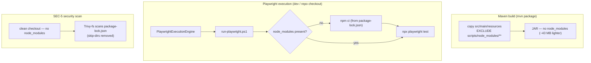

# ORG-1 — Technical Design: Remove Committed `node_modules/` from Execution Resources

**Version:** 1.0.0
**Document Type:** Implementation Technical Design
**Document Status:** Draft — Awaiting Approval (no code until approved)
**Last Updated:** 2026-07-22
**Roadmap item:** [`ORG-1`](./AI-QA-OS-Improvement-Roadmap.md) (v2.2.0, frozen) — 🟠 P1 · Effort S · Owner Execution / DevOps · Phase 0 · v1.3
**Module:** `ai-qa-os-execution` (+ `.gitignore`, CI)
**Pairs with:** [SEC-5](./AI-QA-OS-SEC-5-Technical-Design.md) (Completed) — this lets us drop SEC-5's `skip-dirs`.

> **Scope discipline.** Implements **only** ORG-1: stop committing/bundling the vendored `node_modules/`, and restore it reproducibly from `package-lock.json`. It does **not** upgrade Playwright, change the engine's Java logic, fix the quarantined execution tests (FI-MNT1-B), or add containerised Playwright provisioning.

---

## 0. Roadmap Verification & Current State

### 0.1 What ORG-1 requires (from the finalized roadmap)

> `ai-qa-os-execution/src/main/resources/scripts/` commits a full `node_modules/` tree into the repo and into the built JAR. This bloats the artifact, ships unscanned third-party code, and drifts from `package.json`… Replace with a build-time `npm ci` (Maven frontend-plugin or a Docker build stage) driven by the committed `package.json`/lockfile.

### 0.2 Verified current state

- **Vendored tree:** `ai-qa-os-execution/src/main/resources/scripts/node_modules/` — **43 MB, 434 files** (Playwright, typescript, @types/node).
- **`package.json` + `package-lock.json`** are committed alongside it → `npm ci` is reproducible. `devDependencies`: `@playwright/test ^1.45.0`, `@types/node ^20`, `typescript ^5.4`.
- **`execution/pom.xml`** has **no `<build><resources>`** → default resource copy bundles `scripts/node_modules/` into `target/classes` → into the JAR (and the gateway fat-JAR/image). **This is the artifact bloat.**
- **`run-playwright.ps1`** validates Node is on PATH, then runs `npx playwright test`. It **assumes `node_modules` already exists** — it never installs deps.
- **`.gitignore`** ignores `target/`, `playwright-output/`, … but **not** `node_modules/` (so the tree was committed normally).
- **Engine runtime path:** `PlaywrightExecutionEngine` runs the `.ps1` from its **on-disk directory** (`pb.directory(scriptDir)`), resolving `node_modules` relative to that cwd. In practice this is the **dev / repo-checkout** scenario (`src/main/resources/scripts`); a pure fat-JAR container cannot locate the scripts by the engine's path fallbacks — so containerised Playwright is a *pre-existing* gap, not ORG-1's concern.

### 0.3 Mechanism decision (roadmap suggests build-time; this design recommends runtime bootstrap)

The roadmap suggests "Maven frontend-plugin or a Docker build stage." Given how the engine actually runs (the `.ps1` executes from the scripts dir on disk), the cleanest fit is a **runtime `npm ci` bootstrap**:

| Option | How | Shrinks JAR? | Build cost | Fit |
|---|---|---|---|---|
| **A — Runtime bootstrap (recommended)** | `.ps1` runs `npm ci` if `node_modules` is missing | ✅ (with JAR exclude) | none | ✅ matches where the engine runs; no node at Maven build |
| **B — frontend-maven-plugin (roadmap-literal)** | `npm ci` during every `mvn` build | ✅ (with JAR exclude) | +node download + `npm ci` on **every** build incl. CI | ➖ heavier; still needs the JAR exclude |
| **C — Docker build stage** | `npm ci` in the image | only for containers | — | ❌ engine can't run Playwright from the fat-JAR container today |

Both A and B require the **JAR resource-exclude** (below) to actually shrink the artifact. A adds no build weight and keeps the dev engine working on first run. **This design is written for Option A**; §7 notes where B diverges.

> ✅ **Decision (confirmed 2026-07-22): Option A — Runtime bootstrap.** `run-playwright.ps1` runs `npm ci` on first run only; plus JAR resource-exclude + gitignore. No Node/npm added to Maven or CI builds.

---

## 1. Technical Design

Four coordinated changes:

1. **Stop committing it** — delete `scripts/node_modules/` from the working tree and add `node_modules/` to `.gitignore` (repo-wide). `package.json` + `package-lock.json` stay committed.
2. **Stop bundling it** — add a `<build><resources>` block to `execution/pom.xml` that copies `src/main/resources` but **excludes `scripts/node_modules/**`**. This removes ~43 MB from the execution JAR and the gateway image, and is what makes SEC-5 scan the *manifest* (`package-lock.json`) instead of a vendored tree.
3. **Restore it reproducibly** — `run-playwright.ps1` runs `npm ci` (from `package-lock.json`) **only if `node_modules` is absent**, before invoking Playwright. First run installs; subsequent runs skip.
4. **Complete the SEC-5 pairing** — drop the now-unnecessary `skip-dirs: …/node_modules` from `security.yml` (the tree no longer exists in a clean checkout).

**Unchanged / out of scope:** Playwright **browser** binaries (`npx playwright install`) were never in `node_modules` — that machine/CI prerequisite is unchanged. No Java engine change. No dependency version change.

---

## 2. Folder Structure

`[D]` deleted, `[M]` modified.

```
AI-QA-OS-Core/
├── .gitignore                                                     [M] add node_modules/
├── ai-qa-os-execution/
│   ├── pom.xml                                                    [M] <resources> exclude scripts/node_modules/**
│   └── src/main/resources/scripts/
│       ├── node_modules/                                          [D] 43 MB / 434 files — removed
│       ├── package.json            package-lock.json              [-] kept (reproducible install)
│       ├── run-playwright.ps1                                     [M] npm ci bootstrap if node_modules missing
│       ├── playwright.config.ts    tsconfig.json    tests/        [-] kept
└── .github/workflows/security.yml                                 [M] drop skip-dirs (SEC-5 pairing)
```

---

## 3. Required Classes

**None** (no Java change).

| Artifact | Type | Change |
|---|---|---|
| `.gitignore` | Modified | ignore `node_modules/` repo-wide |
| `ai-qa-os-execution/pom.xml` | Modified | `<build><resources>` excluding `scripts/node_modules/**` from the JAR |
| `scripts/run-playwright.ps1` | Modified | `npm ci` bootstrap when `node_modules` absent (after the Node check, before Playwright run) |
| `scripts/node_modules/` | Deleted | removed from working tree + git |
| `.github/workflows/security.yml` | Modified | remove the `skip-dirs` line |

---

## 4. Database Changes

**None.**

---

## 5. API Changes

**None.** No runtime/service behaviour change. Operational notes:
- **First Playwright run** on a fresh checkout triggers a one-time `npm ci` (added latency; needs network once). Cached thereafter.
- Node ≥ 18 is required at execution time — **already** a prerequisite (the `.ps1` validates it).
- Playwright **browsers** still require `npx playwright install` on the host (unchanged).

---

## 6. Sequence Diagram



---

## 7. Step-by-Step Implementation Plan

1. **Verify (read-only).** Confirm `package-lock.json` present (done), the exact node_modules path (done), and that nothing else in `scripts/` should be removed (done — only `node_modules/`).
2. **`.gitignore`.** Add `node_modules/`.
3. **`pom.xml`.** Add `<build><resources>` to `ai-qa-os-execution` copying `src/main/resources` with `<exclude>scripts/node_modules/**</exclude>`.
4. **`run-playwright.ps1`.** After the Node check, add: if `node_modules` is missing, `Push-Location $ScriptRoot; npm ci; Pop-Location` (fail with exit 2 on non-zero). *(Option B instead: add frontend-maven-plugin to the pom bound to `generate-resources`; do not modify the `.ps1`.)*
5. **`security.yml`.** Remove the `skip-dirs: ai-qa-os-execution/.../node_modules` line.
6. **Delete** `scripts/node_modules/` from the working tree (`rm -rf`; on commit this stages the git removal — no commit performed here).
7. **Validate.** `mvn -q -pl ai-qa-os-execution -am clean package -DskipTests` builds; inspect the produced JAR to confirm **no `scripts/node_modules/` entries**. Re-parse `security.yml`. Confirm `run-playwright.ps1` still parses (PowerShell syntax). Playwright execution itself is **not runnable here** (needs browsers; the two engine tests are quarantined — FI-MNT1-B) — report honestly.
8. **Sync governance docs.** Set `ORG-1` status in the tracker; note SEC-5's `skip-dirs` removed; release mapping unchanged (v1.3).

**Definition of Done:** `scripts/node_modules/` is removed from git and `.gitignore`d; the execution JAR no longer contains it (verified); `run-playwright.ps1` restores deps via `npm ci` on first run; SEC-5's `skip-dirs` is gone; `mvn package` succeeds; no Java/dependency-version change; tracker updated.

---

## Implementation Outcome

Implemented 2026-07-22 (Option A — Runtime bootstrap). No Java change, no dependency upgrade.

**Files changed:**
- `.gitignore` [M] — added `node_modules/`.
- `ai-qa-os-execution/pom.xml` [M] — `<build><resources>` excluding `scripts/node_modules/**` from the JAR.
- `scripts/run-playwright.ps1` [M] — `npm ci` bootstrap when `node_modules` is absent (after the Node check).
- `scripts/node_modules/` [D] — deleted (43 MB / 434 files) from the working tree; `package.json` + `package-lock.json` retained.
- `.github/workflows/security.yml` [M] — removed the SEC-5 `skip-dirs` (manifest now scanned directly).

**Encoding fix (real catch during validation):** the runner's inserted comment/string initially used a box-drawing dash and an em-dash. Windows PowerShell 5.1 reads BOM-less scripts as ANSI, and the em-dash **inside a string** made `[Parser]::ParseFile` report a spurious "missing closing '}'". Since the engine invokes `powershell.exe -File`, that could have failed the script at **runtime**. Fixed by making the added lines ASCII-only (pre-existing multibyte chars live only in comments, which are harmless). `ParseFile` is clean after the fix.

**Validation (JDK 25 / Maven 3.9.16 / Node / PowerShell 5.1):**
- `mvn -pl ai-qa-os-execution -am clean package -DskipTests`: **BUILD OK**. Produced JAR **60 KB** (was ~43 MB with the tree) with **0 `scripts/node_modules/` entries**; `run-playwright.ps1`, `package(-lock).json`, `playwright.config.ts`, `tsconfig.json`, `tests/` all retained.
- `security.yml` re-parses; `skip-dirs` gone.
- `run-playwright.ps1`: `ParseFile` reports no syntax errors (encoding-safe).
- **Not executable here:** an actual Playwright run (needs browsers; the two engine tests are quarantined — FI-MNT1-B). The `npm ci` bootstrap is validated by syntax + inspection, not execution — recommend a first real run on a fresh checkout to confirm the on-demand install path.

---

## Appendix — Future Ideas (Outside Current Roadmap)

- **FI-ORG1-A — Containerised Playwright provisioning.** A Docker build stage (`npm ci` + `npx playwright install --with-deps`) + engine path resolution so Playwright can run from a container image, not only a repo checkout. (Relates to SCALE-1's containerised execution workers.)
- **FI-ORG1-B — Pre-seed browsers in CI** (`microsoft/playwright-github-action` or cache) so the quarantined engine tests (FI-MNT1-B) can be un-quarantined and run in CI.
- **FI-ORG1-C — Pin the Playwright toolchain** via Dependabot (now that `package-lock.json` is the source of truth and is scanned by SEC-5).

---

## Compliance Checklist

| Rule | Status |
|---|---|
| Roadmap not modified | ✅ ORG-1 metadata untouched |
| No new roadmap items/categories/modules | ✅ config/resource + one runner script |
| No product/architecture change | ✅ no Java engine change; no dep upgrade |
| Dependency rule / module boundaries | ✅ change confined to `ai-qa-os-execution` (+ shared `.gitignore`/CI) |
| Pairs with SEC-5 | ✅ `skip-dirs` removed; manifest now scanned |
| Out-of-scope items untouched | ✅ container provisioning / browser install / test fixes deferred |

---

## Document Completion Status

**Status:** Implemented — 2026-07-22 (Option A — Runtime bootstrap; see [Implementation Outcome](#implementation-outcome))
**Version:** 1.0.0
**Implements:** `ORG-1` (roadmap v2.2.0, frozen)
**Next step:** On approval + mechanism choice, execute [§7](#7-step-by-step-implementation-plan) from Step 2. No code until approved.
