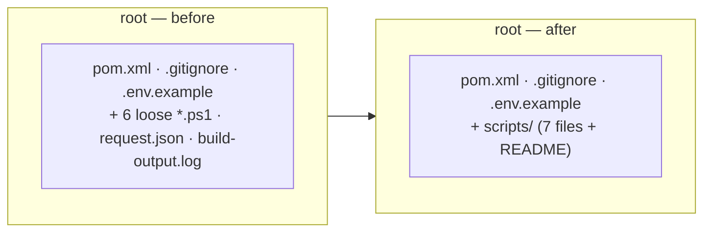

# ORG-4 — Technical Design: Move Root Scripts & Remove Stray Build Artifacts

**Version:** 1.0.0
**Document Type:** Implementation Technical Design
**Document Status:** Draft — Awaiting Approval (no code until approved)
**Last Updated:** 2026-07-22
**Roadmap item:** [`ORG-4`](./AI-QA-OS-Improvement-Roadmap.md) (v2.2.0, frozen) — 🟡 P2 · Effort S · Owner Platform Engineering · Continuous · v1.3
**Module:** `AI-QA-OS-Core` repo root

> **Scope discipline.** Implements **only** ORG-4: declutter the Core repo root by moving the operational `*.ps1` scripts into `scripts/`, deleting stray build/log artifacts, and extending `.gitignore`. **No script logic changes, no product code.** Cosmetic but real — the root is the first thing a new contributor sees.

---

## 0. Roadmap Verification & Current State

### 0.1 What ORG-4 requires (from the finalized roadmap)

> The core repo root holds `CheckDB.java` + its compiled `.class`, `build-output.log`, and a scatter of `*.ps1` smoke scripts. Root clutter obscures the actual project structure… Move operational scripts to `scripts/`, delete compiled/log artifacts, add them to `.gitignore`.

### 0.2 Verified current root (measured during design)

`CheckDB.java`/`.class` are **already removed** (MNT-4). Remaining root files:

| File | Tracked? | ORG-4 action |
|---|---|---|
| `pom.xml`, `.gitignore`, `.env.example` | tracked | **keep** (belong at root) |
| `trigger.ps1` | tracked (committed) | move → `scripts/` |
| `verify-all.ps1` | tracked | move → `scripts/` |
| `verify-artifacts.ps1` | tracked | move → `scripts/` |
| `check-api.ps1` | tracked | move → `scripts/` |
| `request.json` | tracked | move → `scripts/` (companion payload) |
| `test-artifacts.ps1` | **gitignored** (`test-*.ps1`) | move → `scripts/` (local declutter) |
| `test-login.ps1` | **gitignored** | move → `scripts/` (local declutter) |
| `build-output.log` | **gitignored** (`*.log`) | **delete** (stray artifact) |

**Verified safe to move:** the scripts have **no relative cross-references** — no `.ps1` calls another, none reads `request.json`, none uses `$PSScriptRoot`/`Join-Path`. They contain only inline hardcoded URLs/payloads, so relocating them breaks nothing.

**Accuracy note:** a *fresh clone* already omits `build-output.log` and `test-*.ps1` (both gitignored). So the committed clutter a new contributor actually sees is the 4 tracked `.ps1` + `request.json` — those are the meaningful part of this move.

### 0.3 Current `.gitignore`

`target/`, `.idea/`, `*.iml`, `playwright-output/`, `*.log`, `scratch/`, `test-*.ps1`, `node_modules/` (ORG-1). Adding `*.class` closes the gap that let `CheckDB.class` sit at the root.

---

## 1. Technical Design

Three moves, no logic changes:

1. **Create `AI-QA-OS-Core/scripts/`** and move the seven operational files into it: `trigger.ps1`, `verify-all.ps1`, `verify-artifacts.ps1`, `check-api.ps1`, `test-artifacts.ps1`, `test-login.ps1`, `request.json`. (`test-*.ps1` remain gitignored — the `test-*.ps1` pattern matches at any depth, so `scripts/test-*.ps1` stays ignored.)
2. **Delete** `build-output.log`.
3. **Extend `.gitignore`** with `*.class` (prevents future stray compiled classes at the root).
4. **Add `scripts/README.md`** — a one-line description of each smoke-test script, so the moved files are self-documenting.

**Unchanged:** every script's contents; `run-playwright.ps1` (lives under execution resources, not the root — untouched); `pom.xml`; `.env.example`.

---

## 2. Folder Structure

`[N]` new, `[M]` modified, `[→]` moved, `[D]` deleted.

```
AI-QA-OS-Core/
├── .gitignore                    [M] add *.class
├── .env.example                  [-] keep
├── pom.xml                       [-] keep
├── build-output.log             [D] stray log artifact
├── trigger.ps1            ─┐
├── verify-all.ps1         │
├── verify-artifacts.ps1   │
├── check-api.ps1          ├─[→] moved into scripts/
├── request.json          │
├── test-artifacts.ps1    │      (stays gitignored)
├── test-login.ps1        ─┘      (stays gitignored)
└── scripts/                      [N]
    ├── README.md                 [N] describes each smoke-test script
    ├── trigger.ps1               [→]
    ├── verify-all.ps1            [→]
    ├── verify-artifacts.ps1      [→]
    ├── check-api.ps1             [→]
    ├── request.json             [→]
    ├── test-artifacts.ps1       [→]
    └── test-login.ps1           [→]
```

> Not to be confused with `ai-qa-os-execution/src/main/resources/scripts/` (the Playwright runner) — this is a **new top-level `scripts/`** for repo-operational smoke tests.

---

## 3. Required Classes

**None.** File moves/deletes + `.gitignore` + a README.

| Artifact | Type | Change |
|---|---|---|
| `scripts/` | New dir | holds the operational scripts |
| 7 root files | Moved | `*.ps1` + `request.json` → `scripts/` |
| `build-output.log` | Deleted | stray artifact |
| `.gitignore` | Modified | add `*.class` |
| `scripts/README.md` | New | documents each script |

---

## 4. Database Changes

**None.**

---

## 5. API Changes

**None.** No product/runtime change.

**Operational note:** the manual smoke scripts now run from `scripts/` — e.g. `./scripts/trigger.ps1` instead of `./trigger.ps1`. These are developer convenience scripts (not part of any build or product path). Doc references to the old root location (e.g. `AI-QA-OS-Documentation.md` §9.5) become slightly stale; the new `scripts/README.md` is the canonical description. (Updating the platform doc's prose is out of ORG-4's scope; noted for awareness.)

---

## 6. Before / After (root)



---

## 7. Step-by-Step Implementation Plan

1. **Verify (read-only).** Re-confirm no relative cross-references among the scripts (done — §0.2) and that no build/config references a root script path (`run-playwright.ps1` is the only script referenced by code and it lives elsewhere).
2. **Create** `AI-QA-OS-Core/scripts/`.
3. **Move** `trigger.ps1`, `verify-all.ps1`, `verify-artifacts.ps1`, `check-api.ps1`, `request.json`, `test-artifacts.ps1`, `test-login.ps1` into `scripts/` (working-tree move; on commit this is a git rename for the tracked ones).
4. **Delete** `build-output.log`.
5. **`.gitignore`** — add `*.class`.
6. **Add** `scripts/README.md` — one line per script (what it does, which port/endpoint it hits).
7. **Validate.** `ls` the root shows only `pom.xml`, `.gitignore`, `.env.example`, and directories (incl. `scripts/`). Confirm the seven files now live under `scripts/`. No build needed (nothing compiled changed); a quick `mvn -q validate` confirms the pom is still resolvable. Report honestly.
8. **Sync governance docs.** Set `ORG-4` status in the tracker; release mapping unchanged (v1.3).

**Definition of Done:** root holds only `pom.xml`, `.gitignore`, `.env.example`, and directories; the operational scripts live in `scripts/` with a README; `build-output.log` is gone; `.gitignore` ignores `*.class`; no script contents changed; tracker updated.

---

## Appendix — Future Ideas (Outside Current Roadmap)

- **FI-ORG4-A — Consolidate smoke scripts into the CLI** (DX-1) once it exists, retiring the ad-hoc `.ps1` entirely.
- **FI-ORG4-B — Parameterise hardcoded URLs/IDs** in the smoke scripts (they hardcode `localhost:8082/8090`, `TC-AL-003`, `exec-841076ca`) so they work across environments.
- **FI-ORG4-C — Update `AI-QA-OS-Documentation.md` §9.5** script paths to `scripts/` in a later docs pass.

---

## Compliance Checklist

| Rule | Status |
|---|---|
| Roadmap not modified | ✅ ORG-4 metadata untouched |
| No new roadmap items/categories/modules | ✅ file moves + gitignore + README |
| No behaviour/architecture change | ✅ no script logic; no product code |
| Module boundaries | ✅ confined to the Core repo root |
| Out-of-scope items untouched | ✅ script parameterisation / CLI / doc-prose deferred |

---

## Document Completion Status

**Status:** Implemented — 2026-07-22
**Version:** 1.0.0
**Implements:** `ORG-4` (roadmap v2.2.0, frozen)

### Implementation Outcome

Implemented 2026-07-22. File moves + `.gitignore` + README only; no script logic changed.

- **Moved → `scripts/`:** `trigger.ps1`, `verify-all.ps1`, `verify-artifacts.ps1`, `check-api.ps1`, `request.json`, `test-artifacts.ps1`, `test-login.ps1`.
- **Deleted:** `build-output.log`.
- **`.gitignore`:** added `*.class`.
- **Added:** `scripts/README.md` (describes each script; notes SEC-1 auth enforcement + known hardcoded-value limitations).
- **Result:** root now holds only `pom.xml`, `.gitignore`, `.env.example`, and directories.

**Validation:** root `ls` confirms the clean layout; `scripts/` holds the 7 files + README; `mvn -q validate` exits 0 (pom still resolves). No build/behaviour change.

**Follow-up noted:** `AI-QA-OS-Documentation.md` §9.5 still references the scripts at the old root path (FI-ORG4-C) — a docs-prose update, out of ORG-4 scope.
