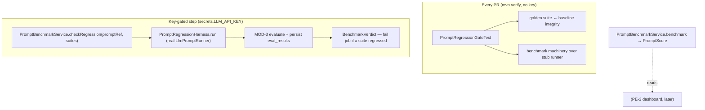

# PE-1 — Technical Design: Prompt Evaluation, Scoring & Benchmarking

**Version:** 1.0.0
**Document Type:** Implementation Technical Design
**Document Status:** Implemented — 2026-07-23 (Option A integrity+machinery; see [Implementation Outcome](#implementation-outcome))
**Last Updated:** 2026-07-22
**Roadmap item:** [`PE-1`](./AI-QA-OS-Improvement-Roadmap.md#pe-1--prompt-evaluation-scoring--benchmarking) (v2.2.0, frozen) — 🟠 P1 · Effort M · Owner AI/Eval · Phase 1 · v1.4
**Module:** `ai-qa-os-eval` (from MOD-3) · consuming `PromptVersionEntity` (via AI-3's runner) · **wired into CI (MNT-1)**
**Depends on:** **MOD-3** (evaluators, persistence) + **AI-3** (harness, golden dataset, baseline) — both done.

> **Scope discipline.** PE-1 turns AI-3's harness into a **discipline**: a formal **Prompt Score**, a **benchmark** of a prompt version against the Golden Dataset, and **regression testing wired into CI**. It does **not** add A/B routing or a leaderboard (**PE-2**) or the dashboard (**PE-3**). It productises the engine AI-3 built.

---

## 0. Roadmap Verification, the AI-3 Boundary, and the CI Reality

### 0.1 What PE-1 requires

> A **Prompt Score** and **Prompt Benchmark** (against a **Golden Dataset**) give every prompt version an objective quality signal, and **Prompt Regression Testing** blocks a change that lowers it. **Where:** `ai-qa-os-eval` consuming `PromptVersionEntity` and golden examples; **wired into CI (MNT-1)**. *The foundation for everything else in this category.*

### 0.2 What AI-3 already gave us (PE-1 builds on, does not duplicate)

| AI-3 delivered | PE-1 adds |
|---|---|
| `PromptRegressionHarness` (run → evaluate → compare vs baseline → `RegressionReport`) | A **`PromptScore`** (version-level quality signal) + **`PromptBenchmarkService`** over one or more suites |
| Per-case regression verdict, tolerance | A **suite-set verdict** productised as a pass/fail **gate** |
| Runnable, but "not the gate" | **The gate**: wired into `mvn verify` (MNT-1's CI) |
| `ClasspathGoldenDatasetProvider`, `FileBaselineStore` | Spring wiring (`EvalHarnessConfig`) so the harness is a bean |

### 0.3 The central constraint — LLMs can't run deterministically in key-less CI

A benchmark needs prompt **outputs**, and outputs come from an LLM (`LlmPromptRunner` → `LLMProviderManager`). But the MNT-1 CI job (`mvn clean verify` on every PR) runs with **no API key** and must stay deterministic and free. So PE-1 splits the gate in two:

- **Always-on gate (key-less, runs in every `mvn verify`)** — deterministic checks that need no model (see §0.4).
- **Live benchmark (opt-in, key-gated)** — a profile-activated step that runs the real benchmark where an LLM key exists, and **blocks on regression there**.

This is the honest reading of "wired into CI": the deterministic gate genuinely runs on every PR; the live-quality gate runs where a model is available.

### 0.4 / Decision for approval — what the always-on (key-less) gate asserts

| Option | The always-on CI test asserts… | Trade-off |
|---|---|---|
| **A — Baseline integrity + machinery (recommended)** | (1) every committed golden suite has a baseline covering **all** its case ids (catches baseline drift), and (2) the benchmark→score→regression pipeline runs correctly over a **deterministic stub runner** (catches broken eval wiring / thresholds). Real prompt-quality scoring runs in the **key-gated live** step. | Light, no new artifacts to maintain, always green without keys; live quality only where keys exist. |
| **B — Recorded golden outputs** | Commit an expected output per case; the always-on test replays them through the evaluators + baseline compare, producing a **real deterministic score** in every CI run. | Stronger deterministic signal (catches prompt-template changes that alter rendered output), but adds recorded-output files to keep in sync, and still can't see live-model drift. |

**Recommend A** — a prompt *regression* is a change in **model output**, which recorded outputs freeze; A keeps key-less CI honest (integrity + machinery) and puts the real quality gate where a model actually runs. B's recorded outputs are effectively a heavier, partial stand-in for the live step. This is the one decision I need.

> ✅ **Decision (confirmed 2026-07-23): Option A — integrity + machinery.** The always-on gate asserts golden-suite ↔ baseline integrity and benchmark-machinery-over-a-stub; real prompt quality is gated in the key-gated live step.

---

## 1. Technical Design

New in `ai-qa-os-eval` (package `com.aiqaos.eval.benchmark` + a config + tests):

### 1.1 Prompt Score & benchmark
- **`PromptScore`** — value object: `promptRef`, `overall` (0–1, mean case score across suites), `perSuite` scores, `caseCount`. The objective quality signal per prompt version.
- **`BenchmarkVerdict`** — `passed` + `regressedSuites`.
- **`PromptBenchmarkService`** (`@Service`) —
  - `benchmark(promptRef, suites)` → `PromptScore`: runs AI-3's `PromptRegressionHarness` per suite, aggregates case scores. *(Per-evaluator results are already persisted by MOD-3's `PromptEvaluationService` during the run — PE-3 reads that history; PE-1 adds **no** new table.)*
  - `checkRegression(promptRef, suites)` → `BenchmarkVerdict`: runs the harness per suite and fails if any suite regressed.

### 1.2 Spring wiring
- **`EvalHarnessConfig`** (`@Configuration`) — beans: `BaselineStore` (`FileBaselineStore` at `${aiqaos.eval.baseline-dir:golden}`) and `PromptRegressionHarness` (from `ClasspathGoldenDatasetProvider` + `PromptRunner` + `PromptEvaluationService` + `BaselineStore`). Makes the harness injectable so `PromptBenchmarkService` is a clean bean.

### 1.3 The CI gate
- **`PromptRegressionGateTest`** (always-on, JUnit, runs inside `mvn verify`) — asserts §0.4 Option A: golden-suite ↔ baseline **integrity** and benchmark **machinery** over a deterministic runner. No model, no key.
- **`PromptBenchmarkLiveIT`** (opt-in) — `@SpringBootTest` (minimal `EvalTestApplication` scanning `eval` + `ai-provider`) gated by `@EnabledIfEnvironmentVariable(named = "AIQAOS_PROMPT_EVAL_LIVE", matches = "true")`: runs the real benchmark and asserts no regression. **Skipped** unless enabled.
- **`deploy.yml`** — a **key-gated step** after `Build & Test` (`if: secrets.LLM_API_KEY`) running `mvn -Pprompt-eval -pl ai-qa-os-eval test` with `AIQAOS_PROMPT_EVAL_LIVE=true`; a `prompt-eval` Maven profile activates the live IT.

### 1.4 What PE-1 defers
A/B experiment routing + leaderboard (**PE-2**) · the quality dashboard (**PE-3**, which reads MOD-3's `eval_results` + `PromptExecutionEntity`) · memory-backed managed datasets remain a future enhancement on the existing provider seam.

---

## 2. Folder Structure

```
ai-qa-os-eval/src/
├── main/java/com/aiqaos/eval/
│   ├── benchmark/  PromptScore · BenchmarkVerdict · PromptBenchmarkService   [N]
│   └── config/     EvalHarnessConfig                                          [N]
└── test/java/com/aiqaos/eval/benchmark/
    ├── PromptRegressionGateTest.java     [N] always-on, deterministic
    ├── PromptBenchmarkLiveIT.java        [N] opt-in, env-gated
    └── EvalTestApplication.java          [N] minimal boot config for the live IT
AI-QA-OS-Core/
├── pom.xml or ai-qa-os-eval/pom.xml      [M] `prompt-eval` profile
└── .github/workflows/deploy.yml          [M] key-gated live-benchmark step
```

*(Additive to `ai-qa-os-eval`. No changes to other modules. No DB changes.)*

---

## 3. Required Classes (key)

| Class | Type | Responsibility |
|---|---|---|
| `PromptScore` | New | Version-level quality signal (overall + per-suite) |
| `BenchmarkVerdict` | New | Pass/fail + regressed suites |
| `PromptBenchmarkService` | New | Benchmark a version; regression gate over suites |
| `EvalHarnessConfig` | New | Wire `BaselineStore` + `PromptRegressionHarness` beans |
| `PromptRegressionGateTest` | New (test) | Always-on deterministic CI gate |
| `PromptBenchmarkLiveIT` + `EvalTestApplication` | New (test) | Opt-in live benchmark (key-gated) |

---

## 4. Database Changes

**None.** PE-1 reuses MOD-3's `eval_results` (written by `PromptEvaluationService` during every harness run) as the score history PE-3 will read. A dedicated `prompt_scores` table is **not** added (a computed `PromptScore` + the existing results suffice; a materialised table, if ever wanted, is FI-PE1-A).

---

## 5. API Changes

**None.** PE-1 is a service + a CI gate. Exposing scores over HTTP is PE-3's dashboard.

---

## 6. Sequence Diagram



---

## 7. Step-by-Step Implementation Plan

1. **Score types** — `PromptScore`, `BenchmarkVerdict`.
2. **Wiring** — `EvalHarnessConfig` (baseline-dir property, harness bean).
3. **Service** — `PromptBenchmarkService` (`benchmark`, `checkRegression`) over the harness.
4. **Always-on gate** — `PromptRegressionGateTest` (integrity + machinery; deterministic; no Mockito).
5. **Live path** — `EvalTestApplication` + `PromptBenchmarkLiveIT` (`@SpringBootTest` + `@EnabledIfEnvironmentVariable`), and a `prompt-eval` Maven profile.
6. **CI** — add the key-gated live step to `deploy.yml` after `Build & Test`.
7. **Build & validate** — `mvn -pl ai-qa-os-eval -am test`: eval tests (MOD-3 16 + AI-3 5 + PE-1's) green; `PromptBenchmarkLiveIT` **skipped** (env not set); YAML lint. Report honestly that the live benchmark's enabled path needs a provider-keyed environment and isn't executed here.
8. **Sync docs** — tracker `PE-1` → Completed; **ADR-014** (two-tier prompt-eval gate: deterministic-always-on + key-gated-live).

**Definition of Done:** `PromptBenchmarkService` computes a `PromptScore` and a regression `BenchmarkVerdict` over golden suites; the deterministic gate runs in `mvn verify` and fails on baseline/machinery breakage; the live benchmark is wired behind a profile + secret and skips cleanly without a key; PE-3 has `eval_results` as its data source.

---

## Implementation Outcome

Implemented 2026-07-23 as **Option A — integrity + machinery**. Recorded as **ADR-014**.

**Files (all new unless noted, in `ai-qa-os-eval`):**
- **benchmark/** — `PromptScore`, `BenchmarkVerdict`, `PromptBenchmarkService` (`benchmark` → score, `checkRegression` → verdict, over AI-3's harness).
- **config/** — `EvalHarnessConfig` (`BaselineStore` + `PromptRegressionHarness` beans; `aiqaos.eval.baseline-dir`/`tolerance` properties; injects `ClasspathGoldenDatasetProvider` concretely to avoid ambiguity with MOD-3's in-memory provider).
- **test/benchmark/** — `PromptRegressionGateTest` (always-on: `everyGoldenSuiteHasACoveringBaseline` + `benchmarkPipelineRunsOverGoldenData`), `PromptBenchmarkLiveTest` (env-gated), `EvalTestApplication` (minimal boot config, JPA/DataSource auto-config excluded).
- **CI** — `.github/workflows/deploy.yml` [M]: job-level `LLM_API_KEY` env + a key-conditional "Prompt evaluation (live benchmark)" step (`AIQAOS_PROMPT_EVAL_LIVE=true`, `mvn -pl ai-qa-os-eval -am test`).

**Deviation from design (minor, within scope):** the live test is gated by an **env variable** (`@EnabledIfEnvironmentVariable`) rather than a Maven `prompt-eval` profile — simpler and the same effect, so no profile was added. It is named `*Test` (Surefire-collected, then condition-skipped) rather than `*IT`.

**Validation (JDK 25 / Maven):**
- `mvn -pl ai-qa-os-eval test` → **BUILD SUCCESS**, **24 run / 0 fail / 1 skipped**. The 1 skip is `PromptBenchmarkLiveTest` (env unset — the intended clean skip); `PromptRegressionGateTest` **2/2**; MOD-3 16 + AI-3 5 unaffected.
- `deploy.yml` edit is well-formed (job `env` + conditional step, indentation mirrors the existing job).
- No new DB table (reuses MOD-3's `eval_results`).

**Honest scope note:** the live tier's **enabled** path (real LLM against golden suites) needs a provider-keyed environment and is **not executed here** — verified only that it compiles and skips cleanly. `EvalTestApplication` scans `ai-provider` for `LLMProviderManager` and excludes JPA/DataSource auto-config, but the keyed-env context load is unvalidated (consistent with AI-1/AI-2/AI-3 live paths). The always-on gate + service are the fully-validated core. CI merge-gate is now real for integrity/machinery; real prompt quality gates where a key exists. PE-2 (A/B + leaderboard) and PE-3 (dashboard over `eval_results`) remain the next Category-Q items.

---

## Appendix — Future Ideas (Outside Current Roadmap)

- **FI-PE1-A** — A materialised `prompt_scores` table (version × time) if PE-3 needs faster trend queries than aggregating `eval_results`.
- **FI-PE1-B** — Multi-run averaging for the live benchmark to smooth model non-determinism before the gate verdict.

---

## Compliance Checklist

| Rule | Status |
|---|---|
| Roadmap not modified | ✅ PE-1 metadata untouched |
| Dependency rule | ✅ additive to `ai-qa-os-eval`; builds on AI-3/MOD-3; no reversed deps |
| AI-3 not duplicated | ✅ PE-1 wraps the harness (score/benchmark/gate), doesn't reimplement it |
| PE-2 / PE-3 scope untouched | ✅ A/B, leaderboard, dashboard deferred |
| CI honesty (MNT-1/ADR-009) | ✅ deterministic gate really runs; live gate key-gated + flagged unvalidated-here |
| ADR discipline | ✅ ADR-014 to be recorded |

---

## Document Completion Status

**Status:** Implemented — 2026-07-23 (Option A — integrity + machinery). See [Implementation Outcome](#implementation-outcome).
**Version:** 1.0.0
**Implements:** `PE-1` (roadmap v2.2.0, frozen)
