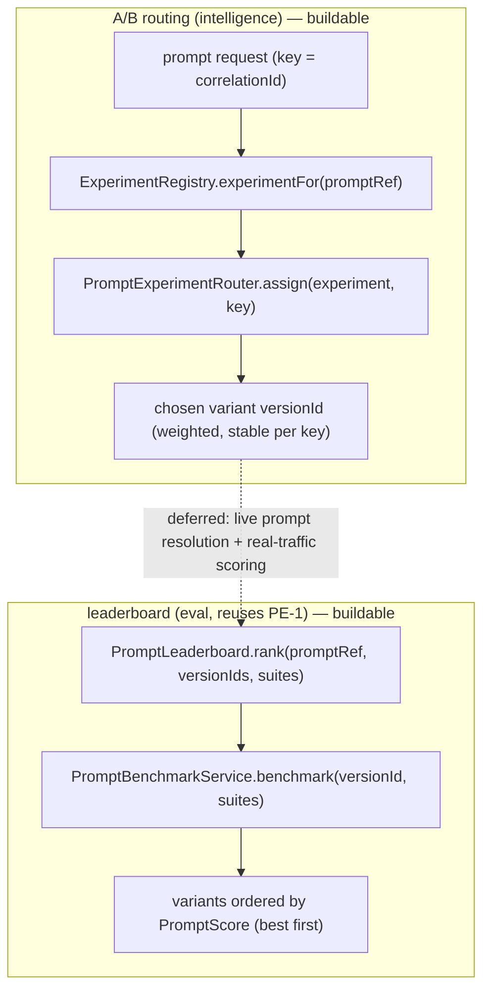

# PE-2 — Technical Design: Prompt Experimentation (A/B Testing & Leaderboard)

**Version:** 1.0.0
**Document Type:** Implementation Technical Design
**Document Status:** Implemented — 2026-07-28 (A/B routing + leaderboard; see [Implementation Outcome](#implementation-outcome))
**Last Updated:** 2026-07-28
**Roadmap item:** [`PE-2`](./AI-QA-OS-Improvement-Roadmap.md#pe-2--prompt-experimentation-ab-testing--leaderboard) (v2.2.0, frozen) — 🟡 P2 · Effort M · Owner AI / Eval · Phase 4 · v2.1
**Modules:** `ai-qa-os-intelligence` (routing) · `ai-qa-os-eval` (leaderboard, reuses PE-1).
**Depends on:** PE-1 (`PromptBenchmarkService`/`PromptScore` — the measured outcome) · MOD-3/AI-3 (eval spine).

> **Scope discipline.** PE-2 adds a prompt **experimentation layer**: assign traffic across prompt **variants** (A/B) and **rank** versions by measured score. The routing + ranking *logic* is fully buildable/validatable here; scoring on **real traffic** needs live LLM runs (deferred, exactly like PE-1's live tier). Reuses PE-1's scoring + PromptVersionEntity — no new eval infrastructure.

---

## 0. Roadmap Verification & the Existing Spine

### 0.1 What PE-2 requires

> Improving prompts requires comparing variants on real traffic. **Prompt A/B Testing** + a **Prompt Leaderboard** rank versions by measured outcome. **Where:** experiment routing in `intelligence`/`ai-provider`; results scored by `eval`; ranked via the Golden Dataset.

### 0.2 What already exists (PE-2 builds on, doesn't rebuild)

| Piece | Source |
|---|---|
| A prompt version to A/B | `PromptVersionEntity` (intelligence) |
| The measured outcome (a version's `PromptScore`) | `PromptBenchmarkService`/`PromptScore` (eval, PE-1) |
| Golden datasets to score against | `ClasspathGoldenDatasetProvider` (AI-3) |

PE-2 = **routing** (which variant serves a request) + **leaderboard** (rank variants by score). Both sit on top of the above.

### 0.3 / Environment reality

- **Buildable + validatable:** the A/B **assignment** (variant per request from weights) and the **leaderboard ranking** (order variants by their `PromptScore`) — pure logic, unit-testable.
- **Deferred (needs live LLM):** scoring variants on **real traffic** (running each variant's prompt through the model over the golden set) and wiring the router into live prompt resolution — same wall as PE-1's live benchmark.

### 0.4 / Decision for approval — the A/B assignment strategy

| Option | Approach | Trade-off |
|---|---|---|
| **A — Deterministic-by-key, weighted (recommended)** | Hash a stable key (workflow `correlationId` / a caller-supplied key) → a variant, honouring weights. The same key always gets the same variant. | Reproducible; a whole workflow run stays on one variant (coherent, debuggable); still respects the weight split across many keys. No RNG to seed. |
| **B — Weighted-random per request** | Each request independently sampled by weight. | Cleaner instantaneous split, but a single run could straddle variants and results aren't reproducible without recording every assignment. |

**Recommend A** — deterministic-by-key gives reproducible, run-coherent A/B (you can re-derive which variant served any run from its key) while still achieving the weighted split in aggregate. Assignment is pure → fully unit-testable.

> ✅ **Decision (confirmed 2026-07-28): Option A — deterministic-by-key, weighted A/B assignment** (stable hash → cumulative-weight bucket). Recorded as ADR-027 (number verified at implement).

---

## 1. Technical Design (Option A)

### 1.1 Experiment model + routing (`intelligence`)
- **`PromptExperiment`** — `experimentId`, `promptRef` (the logical prompt), and `variants` (each a `versionId` + integer `weight`); `enabled`.
- **`PromptExperimentRouter`** — `assign(experiment, key)` → the chosen variant `versionId`: hash `key` into the cumulative-weight ranges (stable, weighted). A disabled/absent experiment returns the default version (no A/B). Pure.
- **`ExperimentRegistry`** — holds active experiments (config/in-memory); `experimentFor(promptRef)`. The wiring that consults the router at prompt resolution is the deferred integration (§1.4).

### 1.2 Leaderboard (`eval`, reuses PE-1)
- **`PromptLeaderboard`** — `rank(promptRef, versionIds, suites)` → variants ordered by `PromptBenchmarkService.benchmark(versionId, suites).getOverall()` (descending), i.e. best-measured-prompt first. Returns `LeaderboardEntry`s (versionId, score, rank). Reuses PE-1's benchmark; no new scoring.

### 1.3 What PE-2 defers
Live-traffic scoring + wiring the router into `PromptManager`/prompt resolution (needs live LLM — FI-PE2-A) · durable experiment/assignment storage (FI-PE2-B) · the dashboard leaderboard view (PE-3) · statistical significance / auto-promote-winner (FI-PE2-C).

---

## 2. Folder Structure

```
ai-qa-os-intelligence/.../experiment/
    PromptExperiment.java          [N] experimentId + weighted variants
    PromptExperimentRouter.java    [N] assign(experiment, key) → versionId (deterministic, weighted)
    ExperimentRegistry.java        [N] active experiments by promptRef
ai-qa-os-eval/.../benchmark/
    PromptLeaderboard.java         [N] rank variants by PromptBenchmarkService score
    LeaderboardEntry.java          [N] versionId + score + rank
+ unit tests: router (weighted split, determinism, disabled→default), leaderboard (ordering by score).
```

---

## 3. Required Classes (key)

| Class | Module | Responsibility |
|---|---|---|
| `PromptExperiment` / `ExperimentRegistry` | intelligence | Experiment definition + active-set |
| `PromptExperimentRouter` | intelligence | Deterministic weighted variant assignment |
| `PromptLeaderboard` / `LeaderboardEntry` | eval | Rank variants by PE-1 score |

---

## 4. Database Changes

**None.** Experiments are config/in-memory; scores come from PE-1 (which already persists per-evaluator results in `eval_results`). Durable experiment/assignment tables are FI-PE2-B.

---

## 5. API Changes

**None required for the core.** (A read-only leaderboard endpoint can be added with PE-3's dashboard.)

---

## 6. Sequence Diagram



---

## 7. Step-by-Step Implementation Plan

1. **Experiment model** — `PromptExperiment` (+ weighted `Variant`), `ExperimentRegistry`.
2. **Router** — `PromptExperimentRouter.assign` (stable hash → cumulative-weight bucket; disabled → default).
3. **Leaderboard** — `LeaderboardEntry` + `PromptLeaderboard.rank` over `PromptBenchmarkService`.
4. **Tests** — router: weighted distribution over many keys, determinism (same key→same variant), disabled→default; leaderboard: correct descending order by score (stub benchmark). No Mockito.
5. **Build & validate** — `mvn clean test`; eval + intelligence + all modules green; PE-1 tests unaffected.
6. **Sync docs** — tracker `PE-2`; **ADR-027** (deterministic-by-key weighted A/B + leaderboard over PE-1 scores). Verify ADR number at implement.

**Definition of Done:** a weighted set of prompt variants deterministically assigns a variant per key, and a leaderboard ranks versions by their PE-1 `PromptScore`; both unit-proven. **Deferred:** live-traffic scoring, router→prompt-resolution wiring, durable storage, dashboard view.

---

## Implementation Outcome

Implemented 2026-07-28 (§0.4 = A deterministic-by-key). Recorded as **ADR-027**. Completes the eval spine **MOD-3 → AI-3 → PE-1 → PE-2**.

**Files:**
- **intelligence/experiment/** — `PromptExperiment` (weighted `Variant`s + default), `PromptExperimentRouter` (stable-hash → cumulative-weight bucket; disabled/empty → default), `ExperimentRegistry` (active experiments by `promptRef`).
- **eval/benchmark/** — `LeaderboardEntry` (versionId/score/rank), `PromptLeaderboard` (rank versions by PE-1 `PromptBenchmarkService.benchmark(...).getOverall()`, best first).
- **tests** — `PromptExperimentRouterTest` (3: determinism, weighted split over 2000 keys, disabled/empty/null→default), `PromptLeaderboardTest` (2: descending rank by score via a stub benchmark, empty list).

**Validation (Maven):** `mvn -pl ai-qa-os-eval,ai-qa-os-intelligence -am test` → **BUILD SUCCESS**; router **3/3** + leaderboard **2/2**; PE-1 tests unaffected. (The change is purely additive `@Component`s with satisfiable deps; a full-reactor run was skipped as redundant at the user's direction — the targeted `-am` build compiles both modules + all their deps.)

**Honest scope note:** the **routing + ranking logic is fully unit-proven**. **Deferred:** scoring variants on **real traffic** and wiring the router into live prompt resolution (`PromptManager`) — needs the LLM-keyed environment, exactly like PE-1's live tier (FI-PE2-A); durable experiment/assignment storage (FI-PE2-B); significance/auto-promote (FI-PE2-C); the dashboard leaderboard view (PE-3).

---

## Appendix — Future Ideas (Outside Current Roadmap)

- **FI-PE2-A** — Wire the router into `PromptManager` and score variants on live traffic (needs the LLM-keyed environment, as PE-1's live tier).
- **FI-PE2-B** — Durable experiment + per-assignment storage for audit/replay.
- **FI-PE2-C** — Statistical-significance gating + auto-promote the winning variant.

---

## Compliance Checklist

| Rule | Status |
|---|---|
| Roadmap not modified | ✅ PE-2 metadata untouched |
| Dependency (PE-1) | ✅ reuses `PromptBenchmarkService`/`PromptScore`; no new scoring |
| No new modules | ✅ intelligence + eval only |
| Non-breaking | ✅ additive; no schema/API change; disabled experiment = default prompt |
| Honesty (ADR-009) | ✅ live-traffic scoring + router wiring flagged deferred |
| ADR discipline | ✅ ADR-027 to be recorded (number verified at implement) |

---

## Document Completion Status

**Status:** Implemented — 2026-07-28 (§0.4 = A). See [Implementation Outcome](#implementation-outcome).
**Version:** 1.0.0
**Implements:** `PE-2` (roadmap v2.2.0, frozen) — A/B routing + leaderboard logic; live-traffic scoring deferred.
