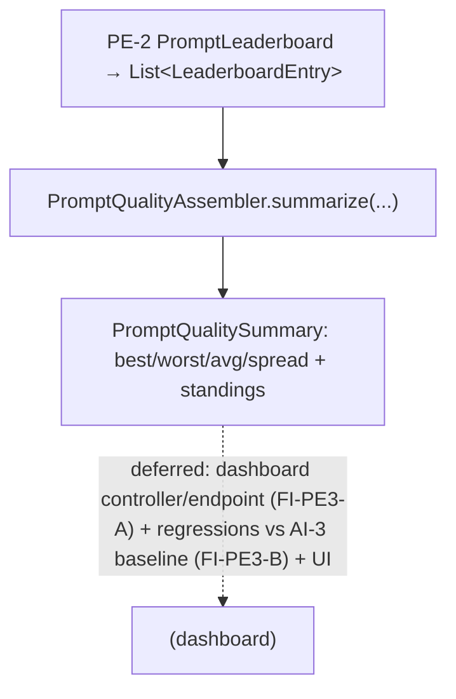

# PE-3 — Technical Design: Prompt Quality Dashboard (Read-Model Increment)

**Version:** 1.0.0
**Document Type:** Implementation Technical Design
**Document Status:** Read-model implemented — 2026-07-29 (§0.4 = A; PE-3 remains In Progress; see [Implementation Outcome](#implementation-outcome))
**Last Updated:** 2026-07-29
**Roadmap item:** [`PE-3`](./AI-QA-OS-Improvement-Roadmap.md#pe-3--prompt-quality-dashboard) (v2.2.0, frozen) — 🟡 P2 · Effort S · Owner Dashboard + AI · Phase 4 · v2.1
**Modules:** `ai-qa-os-eval` (prompt-quality read-model over the PE-2 leaderboard).
**Depends on:** PE-1/PE-2 (`LeaderboardEntry`/`PromptLeaderboard` — ✅) · OBS-3 (dashboards suite).

> **Scope discipline.** PE-3 lets prompt engineers see **scores, standings, and leaderboard** at a glance — closing the human feedback loop over eval data. This increment delivers the **prompt-quality read-model** — a pure assembler composing PE-2's `LeaderboardEntry` rows into a quality summary (best/worst/average/spread + ranked standings) — **fully validatable**. The dashboard **UI** and the dashboard-module controller are deferred (§0.3), so **PE-3 lands `In Progress`**. It completes the eval spine **MOD-3 → AI-3 → PE-1 → PE-2 → PE-3**.

---

## 0. Roadmap Verification & Scope

### 0.1 What PE-3 requires
> Prompt engineers need to see **scores, regressions, and leaderboard standings** at a glance. **A dashboard view over eval results + `PromptExecutionEntity`**, complementing the Prompt Playground (DX-4). Presentation over eval data.

### 0.2 Verified state & placement
- PE-2 produces `LeaderboardEntry` (versionId / score / rank) via `PromptLeaderboard`; PE-1 the `PromptScore`. All in **`ai-qa-os-eval`**.
- The **dashboard module does not depend on `eval`** — so the read-model composing leaderboard rows belongs in `eval`; the dashboard controller/UI is deferred cross-module wiring.

### 0.3 Environment reality
- **Validatable now:** a `PromptQualitySummary` + a pure `PromptQualityAssembler` over a `List<LeaderboardEntry>` — best/worst version, average score, spread, ranked standings. Pure logic.
- **Deferred:** the dashboard **UI** (frontend); the dashboard-module controller/endpoint (needs a `dashboard → eval` dependency — FI-PE3-A); **regression detection** vs the AI-3 committed baseline (needs the baseline source — FI-PE3-B); per-execution history over `PromptExecutionEntity` (FI-PE3-C).

### 0.4 / Decision for approval — scope

| Option | Approach | Trade-off |
|---|---|---|
| **A — Prompt-quality read-model in `eval` now; UI + regressions deferred (recommended)** | `PromptQualitySummary` + pure `PromptQualityAssembler(List<LeaderboardEntry>)` (best/worst/avg/spread + standings). UI, controller, and regression-vs-baseline deferred. PE-3 → `In Progress`. | The standings/score substance, fully validatable, zero blast radius. No UI, and regression detection waits on the AI-3 baseline. |
| **B — Also wire regressions (AI-3 baseline) + a dashboard controller now** | Compare current scores to the committed baseline + add an endpoint. | More complete, but couples to the AI-3 baseline store + a cross-module endpoint; the UI is still frontend — little validatable gain now. |

**Recommend A** — deliver the standings read-model (the at-a-glance substance) now; regression detection rides the AI-3 baseline (FI-PE3-B) and the endpoint/UI are presentation wiring (FI-PE3-A).

> ✅ **Decision (confirmed 2026-07-29): Option A — `PromptQualitySummary` + pure `PromptQualityAssembler` over PE-2's `LeaderboardEntry` list in `ai-qa-os-eval`; UI + controller + regression-vs-baseline deferred (FI-PE3-A/B). PE-3 → In Progress.** Recorded as ADR-051 (number verified at implement).

---

## 1. Technical Design (Option A)

`ai-qa-os-eval`, package `com.aiqaos.eval.benchmark`:
- **`PromptQualitySummary`** — `totalVersions`, `bestVersionId`/`bestScore`, `worstVersionId`/`worstScore`, `averageScore`, `scoreSpread` (best − worst), `standings` (the ranked `LeaderboardEntry` list).
- **`PromptQualityAssembler`** (`@Component`, pure) — `summarize(List<LeaderboardEntry>)`: best = max score, worst = min score, average, spread; empty → an empty summary.

**Defers:** dashboard UI · dashboard controller/endpoint (FI-PE3-A) · regression-vs-baseline (FI-PE3-B) · per-execution history (FI-PE3-C).

---

## 2. Folder Structure
```
ai-qa-os-eval/.../benchmark/
    PromptQualitySummary.java   [N] best/worst/avg/spread + ranked standings
    PromptQualityAssembler.java [N] @Component: summarize(List<LeaderboardEntry>)
+ unit tests: assembler (best/worst/avg/spread, single-entry, empty).
```

---

## 3–5. Classes / DB / API
Key classes above. **DB:** none. **API:** none (endpoint deferred).

---

## 6. Sequence


---

## 7. Plan
1. **Summary** — `PromptQualitySummary`.
2. **Assembler** — `PromptQualityAssembler.summarize(List<LeaderboardEntry>)` (best/worst/avg/spread + standings).
3. **Tests** — best/worst/average/spread over a ranked set; single-entry (best==worst, spread 0); empty→zeroed. No Mockito.
4. **Build & validate** — targeted `mvn -pl ai-qa-os-eval -am test -Dtest=… -Djacoco.skip=true -DargLine="-Xss40m"`; green; PE-1/PE-2 tests unaffected.
5. **Sync docs** — tracker `PE-3` → **In Progress** (read-model; UI deferred); **ADR-051** (prompt-quality read-model over the PE-2 leaderboard). Verify number at implement.

**DoD (this increment):** PE-2 leaderboard rows compose into a quality summary (best/worst/average/spread + standings) — unit-proven. **Deferred:** dashboard UI, controller, regression-vs-baseline, execution history. PE-3 stays In Progress.

---

## Implementation Outcome

Read-model implemented 2026-07-29 (§0.4 = A — prompt-quality read-model over the leaderboard). Recorded as **ADR-051**. **PE-3 remains In Progress** (UI + regressions deferred).

**Files (all new, `ai-qa-os-eval/.../benchmark/`):**
- `PromptQualitySummary` (totalVersions / best & worst version+score / averageScore / scoreSpread / ranked standings), `PromptQualityAssembler` (`@Component`, pure `summarize(List<LeaderboardEntry>)`).

**Validation (Maven):** `mvn -pl ai-qa-os-eval -am test` → **BUILD SUCCESS**; `PromptQualityAssemblerTest` **4/4** (best/worst/average/spread; standings ordered by rank; single-entry zero-spread; empty→zeroed). PE-2's `PromptLeaderboardTest` green. Ran with `-Djacoco.skip=true -DargLine="-Xss40m"`. No-arg `@Component` — no wiring traps.

**Honest scope note:** the **read-model + standings/score stats are unit-proven** — completing the eval spine's read side (MOD-3 → AI-3 → PE-1 → PE-2 → PE-3). **Deferred:** the dashboard **UI** (frontend); the dashboard controller/endpoint (needs `dashboard → eval` — FI-PE3-A); regression detection vs the AI-3 baseline (FI-PE3-B); per-execution history (FI-PE3-C). PE-3 stays In Progress.

---

## Appendix — Future Ideas
- **FI-PE3-A** — Dashboard-module controller/endpoint (add `dashboard → eval`) + the UI view.
- **FI-PE3-B** — Regression detection: compare current scores to the AI-3 committed baseline; flag drops.
- **FI-PE3-C** — Per-execution history/trend over `PromptExecutionEntity`.

---

## Compliance Checklist
| Rule | Status |
|---|---|
| Roadmap not modified | ✅ PE-3 metadata untouched |
| Over eval data (PE-1/PE-2) | ✅ composes `LeaderboardEntry` |
| Dependency reality | ✅ read-model in `eval` (dashboard doesn't depend on eval) |
| Honest status | ✅ PE-3 → In Progress (read-model; UI deferred) |
| Non-breaking | ✅ additive; PE-1/PE-2 untouched |
| Spring-wiring sanity | ✅ no-arg `@Component` assembler (per 2026-07-29 lesson) |
| ADR discipline | ✅ ADR-051 to be recorded (number verified at implement) |

---

## Document Completion Status
**Status:** Read-model implemented — 2026-07-29 (§0.4 = A). PE-3 remains In Progress. See [Implementation Outcome](#implementation-outcome). ADR-051.
**Implements:** `PE-3` (roadmap v2.2.0, frozen) — the prompt-quality read-model; UI + regressions deferred.
**Next step:** On approval + option choice, execute [§7](#7-step-by-step-implementation-plan) from Step 1.
