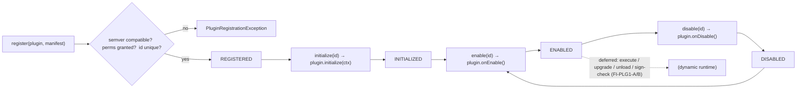

# PLG-1 — Technical Design: Plugin Architecture, Lifecycle & Registration

**Version:** 1.0.0
**Document Type:** Implementation Technical Design
**Document Status:** Implemented — 2026-07-28 (§0.4 = A in-process registry; see [Implementation Outcome](#implementation-outcome))
**Last Updated:** 2026-07-28
**Roadmap item:** [`PLG-1`](./AI-QA-OS-Improvement-Roadmap.md#plg-1--plugin-architecture-lifecycle--registration) (v2.2.0, frozen) — 🟠 P1 · Effort L · Owner Integration / Platform · Phase 4 · v2.1
**Modules:** `ai-qa-os-integration` (plugin runtime + SPI contract).
**Depends on:** none blocking. Consumed later by the Plugin SDK (DX-5, deferred) and PLG-2 integration plugins.

> **Scope discipline.** PLG-1 introduces the controlled extension seam: a **first-class plugin contract**, a **manifest** (id / version / capabilities / permissions), a **registry**, and a **managed lifecycle** (register → initialize → enable → disable) with **semantic-version compatibility** and a **permission-grant** check. The contract + registry + lifecycle + versioning are **fully validatable**. Dynamic class-loading, signature verification (SEC-6), sandboxing, and migrating the existing plugins are deferred (§0.3).

---

## 0. Roadmap Verification, What Exists, and Scope

### 0.1 What PLG-1 requires

> Define a first-class plugin contract with a managed lifecycle so extensions load, register, and run under governance. **Lifecycle:** Discover → Register → Validate & Sign-check → Initialize → Enable → Execute → Disable → Upgrade/Unload. **Registration:** plugins declare a manifest (id, version, capabilities, required permissions) → a plugin registry. **Security:** permission model, signed/verified before load (SEC-6), untrusted sandboxed. **Versioning:** semver against a declared SDK/API version; the runtime refuses incompatible plugins. **Where:** a plugin runtime in `ai-qa-os-integration`, exposing SPI contracts.

### 0.2 Verified current state

| Fact | Detail |
|---|---|
| Plugin-shaped pieces exist | `ExecutionPlugin` (`getPluginName`/`configure`) in `execution`; `PluginStep` (`getType`/`execute`) + `GithubPlugin`/`JiraPlugin`/`SlackPlugin` in `orchestration`. |
| **No common contract** | Each is bespoke — no manifest, lifecycle, registry, versioning, or permission model. Every extension is a core change. |
| Placement | `ai-qa-os-integration` is the cross-system module (depends on core/security/orchestration/execution/…); the roadmap puts the plugin runtime here. |

### 0.3 Environment reality & the contract-placement call

- **Buildable + validatable now:** the plugin **SPI contract**, **manifest**, **registry**, **lifecycle state machine**, **semver compatibility**, and **permission-grant** check — pure in-process logic, unit-testable.
- **Deferred:** dynamic JAR class-loading / unloading; **signature verification** (SEC-6, itself Deferred) and sandboxing of untrusted plugins; **migrating** the existing `PluginStep`/`ExecutionPlugin` pieces onto the new contract (they live in `orchestration`/`execution`, which don't depend on `integration` — a cross-module migration, PLG-2/FI).
- **Contract stays in `integration`** (not `core`): the only consumers now are the integration runtime + the future SDK. Per the ConfidenceGate lesson (ADR-010/015), don't promote a contract to `core` until a cross-module implementer is real — the existing plugins' migration is deferred, so no `core` placement is forced.

### 0.4 / Decision for approval — loading model

| Option | Approach | Trade-off |
|---|---|---|
| **A — In-process registry + managed lifecycle + manifest + semver (recommended)** | Plugins are registered (from Spring beans or explicit registration) into a `PluginRegistry` with a lifecycle state machine, semantic-version compatibility against a declared SDK/API version, and a permission-grant check. No dynamic class-loading / signing / sandbox. | Delivers the whole contract + governance the SDK and marketplace build on, fully validatable; respects dependency direction. Doesn't hot-load external JARs yet. |
| **B — Dynamic class-loader loading + signature verification now** | Load plugin JARs at runtime via isolated class-loaders, verify signatures (SEC-6), sandbox untrusted plugins. | Truer to "Discover/Sign-check/Unload", but needs SEC-6 (Deferred), filesystem/security infra, and is largely unvalidatable here — big infra surface, little provable logic. |

**Recommend A** — the *contract, lifecycle, registration, versioning, and permission model* are the foundation everything else (DX-5 SDK, PLG-2 plugins, PLG-4 marketplace) depends on, and they're provable now. Dynamic loading + signing is a separate infra concern that rides SEC-6/PLG-4 (both Deferred).

> ✅ **Decision (confirmed 2026-07-28): Option A — in-process registry + managed lifecycle + manifest + semver compatibility + permission-grant; dynamic loading/signing/sandbox + existing-plugin migration deferred (FI-PLG1-A/B/C).** Recorded as ADR-036 (number verified at implement).

---

## 1. Technical Design (Option A)

### 1.1 SPI contract + manifest (`ai-qa-os-integration`, package `…plugin`)
- **`Plugin`** (SPI) — `String id()`; lifecycle hooks `initialize(PluginContext)`, `onEnable()`, `onDisable()` (default no-ops so a plugin overrides only what it needs).
- **`PluginManifest`** — `id`, `version` (semver), `sdkApiVersion` (semver the plugin targets), `capabilities` (Set), `requiredPermissions` (Set).
- **`PluginContext`** — what a plugin receives at initialize: granted permissions + a config map.
- **`SemanticVersion`** — parse `major.minor.patch`; `isCompatibleWith(runtime)` = same major **and** runtime minor ≥ plugin minor.

### 1.2 Lifecycle + registry
- **`PluginState`** — `REGISTERED` → `INITIALIZED` → `ENABLED` ⇄ `DISABLED` (+ `FAILED`).
- **`PluginDescriptor`** — manifest + plugin + current state.
- **`PluginRegistry`** (`@Component`) — `register(plugin, manifest)` (reject on duplicate id, incompatible SDK version, or ungranted required permission → `PluginRegistrationException`), `initialize(id)` / `enable(id)` / `disable(id)` (enforce valid transitions → `IllegalStateException`; invoke the plugin hooks), `get(id)`, `enabled()`, `all()`.
- **`PluginProperties`** — `aiqaos.plugins.*`: `sdkApiVersion` (the runtime's, default `1.0.0`), `grantedPermissions` (Set).

### 1.3 What PLG-1 defers
Dynamic JAR discovery / class-loading / unload (FI-PLG1-A) · signature verification (SEC-6) + sandboxing untrusted plugins (FI-PLG1-B) · migrating existing `PluginStep`/`ExecutionPlugin` onto the contract (PLG-2 / FI-PLG1-C) · the published SDK artifact (DX-5) · marketplace (PLG-4).

---

## 2. Folder Structure

```
ai-qa-os-integration/.../plugin/
    Plugin.java                    [N] SPI: id + lifecycle hooks
    PluginManifest.java            [N] id/version/sdkApiVersion/capabilities/permissions
    PluginContext.java             [N] granted permissions + config at initialize
    SemanticVersion.java           [N] parse + compatibility
    PluginState.java               [N] REGISTERED/INITIALIZED/ENABLED/DISABLED/FAILED
    PluginDescriptor.java          [N] manifest + plugin + state
    PluginRegistrationException.java [N] version / permission / duplicate failures
    PluginProperties.java          [N] aiqaos.plugins.* (runtime SDK version, granted perms)
    PluginRegistry.java            [N] register + lifecycle transitions + queries
+ unit tests: SemanticVersion (parse, compatibility) + PluginRegistry (register ok/reject, lifecycle, invalid transitions).
```

---

## 3. Required Classes (key)

| Class | Type | Responsibility |
|---|---|---|
| `Plugin` / `PluginManifest` / `PluginContext` | New | The extension SPI + declaration |
| `SemanticVersion` | New | Semver parse + compatibility |
| `PluginState` / `PluginDescriptor` | New | Lifecycle model |
| `PluginRegistry` | New | Register + lifecycle + governance (version/permission) |
| `PluginProperties` / `PluginRegistrationException` | New | Config + failure signalling |

---

## 4. Database Changes

**None.** The registry is in-process; durable plugin state / marketplace is PLG-4 (Deferred).

---

## 5. API Changes

**None** in this slice. (A plugin-admin surface can arrive with PLG-2/the dashboard.)

---

## 6. Sequence Diagram



---

## 7. Step-by-Step Implementation Plan

1. **SPI + manifest** — `Plugin`, `PluginManifest`, `PluginContext`, `SemanticVersion`.
2. **Lifecycle** — `PluginState`, `PluginDescriptor`, `PluginRegistrationException`, `PluginProperties`.
3. **Registry** — `PluginRegistry` (register with version/permission/duplicate checks; initialize/enable/disable transitions invoking hooks; queries).
4. **Tests** — `SemanticVersion` (parse, compatible/major-mismatch/minor-too-new); `PluginRegistry` (register ok, reject incompatible version, reject ungranted permission, reject duplicate id, full lifecycle + hooks invoked, enable-before-initialize throws, `enabled()` filter). No Mockito.
5. **Build & validate** — `mvn -pl ai-qa-os-integration -am test` (targeted); new tests green.
6. **Sync docs** — tracker `PLG-1`; **ADR-036** (in-process plugin contract + lifecycle registry + semver/permission governance; dynamic loading/signing deferred). Verify ADR number at implement.

**Definition of Done:** a plugin declaring a manifest can be registered only when it is semver-compatible and its required permissions are granted, then driven through initialize → enable → disable with hooks invoked and invalid transitions refused — deterministic and unit-proven. **Deferred:** dynamic loading, signing/sandbox, existing-plugin migration, SDK, marketplace.

---

## Implementation Outcome

Implemented 2026-07-28 (§0.4 = A — in-process registry + managed lifecycle). Recorded as **ADR-036**.

**Files (all new, `ai-qa-os-integration/.../plugin/`):**
- `Plugin` (SPI: id + default lifecycle hooks), `PluginManifest` (id/version/sdkApiVersion/capabilities/requiredPermissions), `PluginContext` (granted permissions + config), `SemanticVersion` (parse + compatibility: same major, runtime.minor ≥ plugin.minor).
- `PluginState` (REGISTERED/INITIALIZED/ENABLED/DISABLED/FAILED), `PluginDescriptor`, `PluginRegistrationException`, `PluginProperties` (`aiqaos.plugins.sdk-api-version` / `granted-permissions`).
- `PluginRegistry` — `register` (duplicate / id-mismatch / incompatible-version / ungranted-permission → `PluginRegistrationException`), `initialize`/`enable`/`disable` (validated transitions invoking hooks; `FAILED` on throw), `get`/`all`/`enabled`.

**Placement:** in `ai-qa-os-integration` per the roadmap; contract kept there (not `core`) since migrating the existing plugins is deferred — no cross-module implementer forces a `core` promotion yet.

**Validation (Maven):** `mvn -pl ai-qa-os-integration -am test` → **BUILD SUCCESS** (17-module reactor compiled); `PluginRegistryTest` **8/8** (register ok, reject incompatible-version / ungranted-permission / duplicate / id-mismatch, full lifecycle + hooks, re-enable after disable, invalid transitions) + `SemanticVersionTest` **5/5** (parse, partial, compatible, major-mismatch / newer-minor incompatible, malformed). Ran with `-Djacoco.skip=true` (Java 25 toolchain).

**Honest scope note:** the **contract + lifecycle + registry + versioning + permission governance are fully unit-proven**. **Deferred:** dynamic JAR discovery/loading/unload (FI-PLG1-A); signature verification (SEC-6) + sandboxing (FI-PLG1-B); migrating `PluginStep`/`ExecutionPlugin` onto the contract (FI-PLG1-C); the published SDK (DX-5); the marketplace (PLG-4).

---

## Appendix — Future Ideas (Outside Current Roadmap)

- **FI-PLG1-A** — Dynamic discovery / class-loader loading / unload of external plugin artifacts.
- **FI-PLG1-B** — Signature verification (SEC-6) + sandboxing untrusted plugins.
- **FI-PLG1-C** — Migrate the existing `PluginStep`/`ExecutionPlugin` pieces onto the PLG-1 contract (first citizens).

---

## Compliance Checklist

| Rule | Status |
|---|---|
| Roadmap not modified | ✅ PLG-1 metadata untouched |
| Runtime in `ai-qa-os-integration` | ✅ contract + registry in-module |
| Dependency reality | ✅ contract in `integration` (not forced into `core` before a cross-module implementer is real) |
| Non-breaking | ✅ additive; existing plugins untouched (migration deferred) |
| Governance | ✅ semver compatibility + permission-grant enforced at register |
| ADR discipline | ✅ ADR-036 to be recorded (number verified at implement) |

---

## Document Completion Status

**Status:** Implemented — 2026-07-28 (§0.4 = A). See [Implementation Outcome](#implementation-outcome). ADR-036.
**Version:** 1.0.0
**Implements:** `PLG-1` (roadmap v2.2.0, frozen) — plugin contract + lifecycle registry + versioning/permissions; dynamic loading/signing deferred.
**Next step:** On approval + option choice, execute [§7](#7-step-by-step-implementation-plan) from Step 1. No code until approved.
