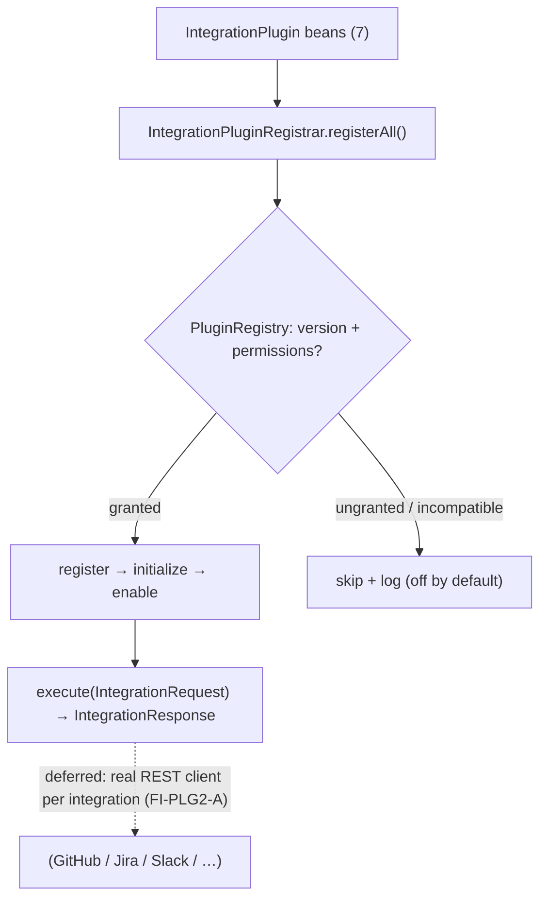

# PLG-2 — Technical Design: Integration Plugins (ALM / CI / Chat)

**Version:** 1.0.0
**Document Type:** Implementation Technical Design
**Document Status:** Implemented — 2026-07-29 (§0.4 = A uniform adapters; see [Implementation Outcome](#implementation-outcome))
**Last Updated:** 2026-07-28
**Roadmap item:** [`PLG-2`](./AI-QA-OS-Improvement-Roadmap.md#plg-2--integration-plugins-almcichat) (v2.2.0, frozen) — 🟡 P2 · Effort M · Owner Integration · Phase 4 · v2.1
**Modules:** `ai-qa-os-integration` (adapters on the PLG-1 contract).
**Depends on:** PLG-1 (`Plugin`/`PluginManifest`/`PluginRegistry` — ✅, reused).

> **Scope discipline.** PLG-2 normalises integrations behind **one** contract: GitHub / Jira / Slack (existing, migrated by delegation) plus GitLab / Azure DevOps / Jenkins / Teams (new), each a uniform `IntegrationPlugin` on the PLG-1 SPI, auto-registered into the `PluginRegistry` under governance. The adapters + manifests + registrar are **fully validatable**; live external API calls (credentials/network) are deferred (§0.3), exactly as today's plugins are already simulated.

---

## 0. Roadmap Verification, What Exists, and Scope

### 0.1 What PLG-2 requires

> Enterprises live in Jira, Azure DevOps, GitHub, GitLab, Jenkins, Slack, Teams. All should become **uniform plugins on the PLG-1 contract**. **Where:** adapters in `ai-qa-os-integration` implementing the plugin contract; the existing `GithubPlugin`/`JiraPlugin`/`SlackPlugin` migrate onto it. New ones (Teams, Azure DevOps, GitLab, Jenkins) are additive, not core changes.

### 0.2 Verified current state

| Fact | Detail |
|---|---|
| PLG-1 contract | `Plugin` SPI + `PluginManifest` + `PluginRegistry` (register/lifecycle/semver/permissions) — in `ai-qa-os-integration`. |
| Existing plugins | `GithubPlugin`/`JiraPlugin`/`SlackPlugin` (in `orchestration`) implement the old `PluginStep` (`getType`/`execute(String)`) — already **simulated** (return a string, no live API). |
| `integration` → `orchestration` | `ai-qa-os-integration` **depends on** `orchestration`, so adapters can **delegate** to the existing plugins (reuse their logic) rather than rewrite. |

### 0.3 Environment reality

- **Buildable + validatable now:** a uniform `IntegrationPlugin` family on the PLG-1 SPI (manifest + category + a simulated `execute`), delegating GitHub/Jira/Slack to the existing `PluginStep` beans, plus new GitLab/Azure DevOps/Jenkins/Teams adapters; a registrar that admits them into the `PluginRegistry` under PLG-1 governance. Pure/deterministic.
- **Deferred:** real external API calls (GitHub/Jira/Slack/… REST) — need credentials + network (SEC-2 env-injected, no live systems here); today's plugins are already simulated, so this is unchanged.

### 0.4 / Decision for approval — action surface

| Option | Approach | Trade-off |
|---|---|---|
| **A — Uniform adapters with a simulated action surface (recommended)** | Each integration is an `IntegrationPlugin extends Plugin` with a `PluginManifest` (id/version/capabilities/permissions), a `category` (SCM/ALM/CI/CHAT), and `execute(IntegrationRequest) → IntegrationResponse`; GitHub/Jira/Slack delegate to the existing `PluginStep` beans, new ones are fresh. An `IntegrationPluginRegistrar` admits them into the `PluginRegistry` (gracefully skipping any whose permissions aren't granted). | Delivers the uniform contract + registration the roadmap asks for, fully validatable; live API is deferred (unchanged from today). |
| **B — Wire real external API clients now** | Implement GitHub/Jira/Slack/GitLab/Azure/Jenkins/Teams REST clients. | Needs credentials + network for 7 systems, huge surface, unvalidatable here — and today's plugins are already simulated, so this is out of scope for "normalise behind one contract". |

**Recommend A** — the roadmap's ask is *normalisation behind one contract*, not live API build-out. Deliver the uniform adapters + governed registration now; real API clients ride each integration's own follow-up (FI-PLG2-A) under the existing SEC-2 credential model.

> ✅ **Decision (confirmed 2026-07-28): Option A — uniform `IntegrationPlugin` adapters with a simulated action surface (GitHub/Jira/Slack delegate to existing beans), governed registrar; real REST clients deferred (FI-PLG2-A).** Recorded as ADR-037 (number verified at implement).

---

## 1. Technical Design (Option A)

### 1.1 Integration SPI (`ai-qa-os-integration`, package `…plugin.integration`)
- **`IntegrationCategory`** — `SCM`, `ALM`, `CI`, `CHAT`.
- **`IntegrationRequest`** — `action` (e.g. `commit`, `issue`, `notify`, `trigger`), `payload`, `correlationId`.
- **`IntegrationResponse`** — `success`, `message`, `data`.
- **`IntegrationPlugin`** (extends PLG-1 `Plugin`) — `PluginManifest manifest()`, `IntegrationCategory category()`, `IntegrationResponse execute(IntegrationRequest)`.
- **`AbstractIntegrationPlugin`** — holds the manifest (supplies `id()`), default lifecycle hooks; concretes define category + `execute`.

### 1.2 The seven plugins
| Plugin | id | Category | Source |
|---|---|---|---|
| GitHub | `github` | SCM | delegates to existing `GithubPlugin` |
| Jira | `jira` | ALM | delegates to existing `JiraPlugin` |
| Slack | `slack` | CHAT | delegates to existing `SlackPlugin` |
| GitLab | `gitlab` | SCM | new (simulated) |
| Azure DevOps | `azure-devops` | CI | new (simulated) |
| Jenkins | `jenkins` | CI | new (simulated) |
| Teams | `teams` | CHAT | new (simulated) |

Each declares a manifest (`sdkApiVersion 1.0.0`, capabilities like `scm.commit`/`alm.issue`/`chat.notify`/`ci.trigger`, and a `requiredPermissions` such as `integration.<id>`).

### 1.3 Registration
- **`IntegrationPluginRegistrar`** (`@Component`) — injects `List<IntegrationPlugin>` + the `PluginRegistry`; `registerAll()` registers each plugin (register → initialize → enable), **gracefully skipping** (log) any whose required permissions aren't granted or whose version is incompatible — integrations are off-by-default until granted (safe). Returns the count admitted.

### 1.4 What PLG-2 defers
Real external API clients for each integration (SEC-2 credentials + network — FI-PLG2-A) · webhook inbound wiring for the new CI systems beyond WF-2's handlers (FI-PLG2-B) · a plugin-admin surface (dashboard).

---

## 2. Folder Structure

```
ai-qa-os-integration/.../plugin/integration/
    IntegrationCategory.java       [N] SCM/ALM/CI/CHAT
    IntegrationRequest.java        [N] action + payload + correlationId
    IntegrationResponse.java       [N] success + message + data
    IntegrationPlugin.java         [N] extends Plugin: manifest + category + execute
    AbstractIntegrationPlugin.java [N] manifest holder + lifecycle
    GitHubIntegrationPlugin.java   [N] SCM (delegates to GithubPlugin)
    JiraIntegrationPlugin.java     [N] ALM (delegates to JiraPlugin)
    SlackIntegrationPlugin.java    [N] CHAT (delegates to SlackPlugin)
    GitLabIntegrationPlugin.java   [N] SCM (new)
    AzureDevOpsIntegrationPlugin.java [N] CI (new)
    JenkinsIntegrationPlugin.java  [N] CI (new)
    TeamsIntegrationPlugin.java    [N] CHAT (new)
    IntegrationPluginRegistrar.java [N] admit all into PluginRegistry (skip ungranted)
+ unit tests: registrar (admits granted plugins into registry, skips ungranted) + a plugin execute/manifest test.
```

---

## 3. Required Classes (key)

| Class | Type | Responsibility |
|---|---|---|
| `IntegrationPlugin` / `AbstractIntegrationPlugin` | New | Uniform integration SPI on PLG-1 |
| 7 concrete plugins | New | GitHub/Jira/Slack (delegate) + GitLab/Azure/Jenkins/Teams (new) |
| `IntegrationPluginRegistrar` | New | Governed admission into `PluginRegistry` |
| `IntegrationCategory` / `IntegrationRequest` / `IntegrationResponse` | New | Action model |

---

## 4. Database Changes

**None.** Plugins are in-process; durable registry/marketplace is PLG-4 (Deferred).

---

## 5. API Changes

**None** in this slice. (Inbound webhooks for CI already exist via WF-2's handlers; a plugin-admin surface is later.)

---

## 6. Sequence Diagram



---

## 7. Step-by-Step Implementation Plan

1. **SPI + model** — `IntegrationCategory`, `IntegrationRequest`, `IntegrationResponse`, `IntegrationPlugin`, `AbstractIntegrationPlugin`.
2. **Plugins** — GitHub/Jira/Slack (delegate to existing `PluginStep` beans) + GitLab/Azure DevOps/Jenkins/Teams (new, simulated), each with a manifest.
3. **Registrar** — `IntegrationPluginRegistrar.registerAll()` (admit under PLG-1 governance; skip ungranted).
4. **Tests** — registrar admits granted plugins (registry `enabled()` contains them) + skips ungranted; a plugin's `execute` returns a success response and its manifest is well-formed. No Mockito.
5. **Build & validate** — `mvn -pl ai-qa-os-integration -am test` (targeted); new tests green; PLG-1 tests unaffected.
6. **Sync docs** — tracker `PLG-2`; **ADR-037** (integration plugins normalised on the PLG-1 contract via delegating adapters + governed registrar; live API deferred). Verify ADR number at implement.

**Definition of Done:** seven integrations (3 migrated by delegation + 4 new) are uniform `IntegrationPlugin`s admitted into the `PluginRegistry` under PLG-1 governance, each executing a simulated action through one contract — deterministic and unit-proven. **Deferred:** real external API clients, webhook expansion, admin surface.

---

## Implementation Outcome

Implemented 2026-07-29 (§0.4 = A — uniform adapters with a simulated action surface). Recorded as **ADR-037**.

**Files (all new, `ai-qa-os-integration/.../plugin/integration/`):**
- Model/SPI — `IntegrationCategory` (SCM/ALM/CI/CHAT), `IntegrationRequest`, `IntegrationResponse`, `IntegrationPlugin extends Plugin` (manifest + category + execute), `AbstractIntegrationPlugin` (manifest holder + factory).
- 7 plugins — `GitHub`/`Jira`/`Slack` (delegate to the existing `GithubPlugin`/`JiraPlugin`/`SlackPlugin` `PluginStep` beans), `GitLab`/`AzureDevOps`/`Jenkins`/`Teams` (new, simulated); each declares a manifest (`sdkApiVersion 1.0.0`, capabilities, `integration.<id>` permission).
- `IntegrationPluginRegistrar` — admits all into the PLG-1 `PluginRegistry`, skipping ungranted (off-by-default).

**Validation (Maven):** `mvn -pl ai-qa-os-integration -am test` → **BUILD SUCCESS**; `IntegrationPluginRegistrarTest` **3/3** (admit all 7 when granted, skip ungranted, off-by-default with no grants) + `IntegrationPluginTest` **4/4** (GitHub delegation, new-plugin simulation, categories, manifest). PLG-1 (13) unaffected. Ran with `-Djacoco.skip=true` (Java 25 toolchain).

**Honest scope note:** the **uniform contract + delegation + governed registration are fully unit-proven**. **Deferred:** real external REST clients per integration (FI-PLG2-A) under SEC-2 credentials; inbound webhook expansion (FI-PLG2-B); a plugin-admin surface.

---

## Appendix — Future Ideas (Outside Current Roadmap)

- **FI-PLG2-A** — Real REST clients per integration (GitHub/Jira/Slack/GitLab/Azure/Jenkins/Teams) under the SEC-2 credential model.
- **FI-PLG2-B** — Inbound webhook wiring for the new CI systems beyond WF-2's handlers.

---

## Compliance Checklist

| Rule | Status |
|---|---|
| Roadmap not modified | ✅ PLG-2 metadata untouched |
| Reuses PLG-1 contract | ✅ `IntegrationPlugin extends Plugin`; admitted via `PluginRegistry` |
| Migrates existing plugins | ✅ GitHub/Jira/Slack delegate to the existing `PluginStep` beans |
| Dependency reality | ✅ adapters in `integration` (depends on `orchestration`); no inversion |
| Non-breaking | ✅ additive; existing `PluginStep` beans untouched; off-by-default until granted |
| ADR discipline | ✅ ADR-037 to be recorded (number verified at implement) |

---

## Document Completion Status

**Status:** Implemented — 2026-07-29 (§0.4 = A). See [Implementation Outcome](#implementation-outcome). ADR-037.
**Version:** 1.0.0
**Implements:** `PLG-2` (roadmap v2.2.0, frozen) — integrations normalised on the PLG-1 contract; live API deferred.
**Next step:** On approval + option choice, execute [§7](#7-step-by-step-implementation-plan) from Step 1. No code until approved.
