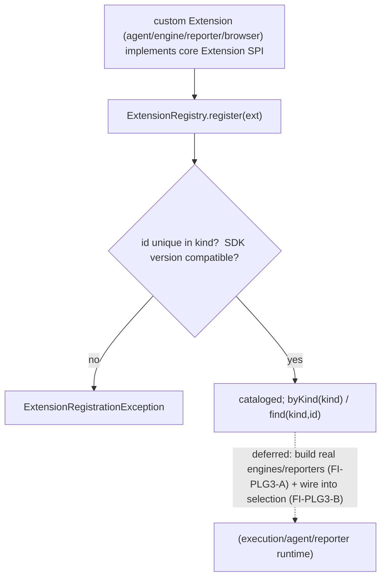

# PLG-3 — Technical Design: Extension SDKs (Agent / Execution Engine / Reporter / Browser)

**Version:** 1.0.0
**Document Type:** Implementation Technical Design
**Document Status:** Implemented — 2026-07-29 (§0.4 = A SDK seam; see [Implementation Outcome](#implementation-outcome))
**Last Updated:** 2026-07-29
**Roadmap item:** [`PLG-3`](./AI-QA-OS-Improvement-Roadmap.md#plg-3--extension-sdks-agent-execution-engine-reporter-browser) (v2.2.0, frozen) — 🟡 P2 · Effort L · Owner Platform / DX · Phase 4 · v2.2
**Modules:** `ai-qa-os-core` (the `Extension` SPI) · `ai-qa-os-integration` (the discovery registry).
**Depends on:** PLG-1 (`SemanticVersion` reused for SDK-version compat — ✅). Scaffolding by DX-2 (deferred).

> **Scope discipline.** PLG-3 turns the platform's deepest abstractions — custom **agents**, **execution engines**, **reporters**, **browsers** — into **public, discoverable extension seams** so teams add capability without touching core. This delivers the **uniform `Extension` SPI + a governed `ExtensionRegistry`** (discovery + SDK-version compatibility) — fully validatable. Building specific new extensions (a Selenium engine, an Allure reporter, …) and DX-2 scaffolding are the ongoing/deferred work (§0.3).

---

## 0. Roadmap Verification, Placement, and Scope

### 0.1 What PLG-3 requires
> The deepest extension points are custom AI agents, custom execution engines (Selenium/REST-Assured/Appium — designed, only Playwright built), custom reporters, and browser plugins. Expose these as **SDK contracts** so teams add capability without touching core. **Where:** SDK contracts derived from `agents`/`execution`/`reporting`, scaffolded by DX-2.

### 0.2 Verified state — the per-type contracts exist, but no uniform seam
- `Agent` (core/agents), `ExecutionEngine` (core/execution), `ReportGenerator` (reporting), browser plugins (execution) — each a per-type contract, but **no uniform, discoverable extension seam** across the four kinds, and no SDK-version governance.

### 0.3 Placement + environment reality
- **The `Extension` SPI must live in `core`.** A custom execution engine lives in `execution` (or a third-party module depending on `execution`+`core`); a custom agent in `agents` — none depend on `integration`. So the SPI extenders implement belongs in `core` (the genuine cross-module implementer case — the ADR-010/015 rule, unlike PLG-1 whose plugins live in `integration`). The **registry** (runtime discovery) goes in `integration` — the cross-system module that already hosts PLG-1's `PluginRegistry` and can reuse its `SemanticVersion`.
- **Validatable now:** the `Extension` SPI + `ExtensionRegistry` (register with per-kind id-uniqueness + SDK-version compatibility, query by kind). Pure logic.
- **Deferred:** building actual new extensions (Selenium/REST-Assured/Appium engines, new reporters/browsers) — needs the real frameworks + DX-2 scaffolding (FI-PLG3-A); wiring the registry into the execution/agent/reporter selection paths (FI-PLG3-B).

### 0.4 / Decision for approval — scope

| Option | Approach | Trade-off |
|---|---|---|
| **A — Uniform `Extension` SPI (core) + governed `ExtensionRegistry` (integration) (recommended)** | `Extension` SPI + `ExtensionKind` in `core`; `ExtensionRegistry` in `integration` (per-kind id-uniqueness + SDK-version compat via PLG-1's `SemanticVersion`; query by kind). | Delivers the public extension seam + governance the SDK needs, fully validatable; respects dependency direction. Doesn't build new engines/reporters (that's the deferred incremental work). |
| **B — Also implement a new extension (e.g. a Selenium engine) now** | Add a real `ExecutionEngine` impl for Selenium. | Needs the Selenium framework + a live browser — unvalidatable here; the roadmap frames new engines as the thing the SDK *enables*, built incrementally. |

**Recommend A** — deliver the SDK seam + governance now (the reusable backbone); building specific extensions rides DX-2 + the real frameworks (FI-PLG3-A).

> ✅ **Decision (confirmed 2026-07-29): Option A — `Extension` SPI + `ExtensionKind` in core; `ExtensionRegistry` (+ properties/exception) in integration, per-kind id-uniqueness + SDK-version compat via PLG-1's `SemanticVersion`; building specific extensions deferred (FI-PLG3-A).** Recorded as ADR-048 (number verified at implement).

---

## 1. Technical Design (Option A)

### 1.1 Extension SPI (`ai-qa-os-core`, package `…extension`)
- **`ExtensionKind`** — `AGENT`, `EXECUTION_ENGINE`, `REPORTER`, `BROWSER`.
- **`Extension`** (SPI) — `String id()`, `ExtensionKind kind()`, `String extensionPoint()` (what it plugs into, e.g. `"Selenium execution engine"`), and `default String sdkApiVersion()` (`"1.0.0"`). The uniform seam a custom agent/engine/reporter/browser implements.

### 1.2 Discovery registry (`ai-qa-os-integration`, package `…plugin.sdk`)
- **`ExtensionRegistry`** (`@Component`) — `register(Extension)` (reject a duplicate id **within a kind**, and an SDK version incompatible with the runtime via PLG-1's `SemanticVersion`), `byKind(kind)`, `find(kind, id)`, `all()`, `kinds()`. `ExtensionRegistrationException` on rejection.
- **`ExtensionSdkProperties`** — `aiqaos.sdk.api-version` (the runtime's, default `1.0.0`).

### 1.3 What PLG-3 defers
Building new extensions (Selenium/REST-Assured/Appium engines, reporters, browsers — FI-PLG3-A) · wiring the registry into execution/agent/reporter selection (FI-PLG3-B) · DX-2 scaffolding for extensions · the marketplace (PLG-4, Deferred).

---

## 2. Folder Structure
```
ai-qa-os-core/.../extension/
    ExtensionKind.java   [N] AGENT / EXECUTION_ENGINE / REPORTER / BROWSER
    Extension.java       [N] SPI: id + kind + extensionPoint + sdkApiVersion
ai-qa-os-integration/.../plugin/sdk/
    ExtensionSdkProperties.java      [N] aiqaos.sdk.api-version
    ExtensionRegistrationException.java [N]
    ExtensionRegistry.java           [N] register (per-kind id + version) + query by kind
+ unit tests: ExtensionRegistry (register per kind, duplicate-in-kind reject, cross-kind same-id ok, version-incompat reject, byKind/find).
```

---

## 3–5. Classes / DB / API
Key classes above. **DB:** none. **API:** none (registry is programmatic; a listing endpoint can ride a dashboard later).

---

## 6. Sequence


---

## 7. Plan
1. **SPI** — `ExtensionKind`, `Extension` (core).
2. **Registry** — `ExtensionSdkProperties`, `ExtensionRegistrationException`, `ExtensionRegistry` (integration; per-kind id-uniqueness + SDK-version compat via PLG-1 `SemanticVersion`).
3. **Tests** — register per kind; duplicate id in a kind rejected; same id across different kinds allowed; incompatible SDK version rejected; `byKind`/`find`/`kinds`. No Mockito.
4. **Build & validate** — targeted `mvn -pl ai-qa-os-integration -am test -Dtest=… -Djacoco.skip=true -DargLine="-Xss40m"`; green; PLG-1/PLG-2 tests unaffected.
5. **Sync docs** — tracker `PLG-3` → Completed (SDK seam); **ADR-048** (extension SDK: SPI in core, registry in integration, reuse PLG-1 SemVer). Verify number at implement.

**DoD:** a custom agent/engine/reporter/browser can implement one `Extension` SPI and be registered + discovered by kind under SDK-version governance — unit-proven. **Deferred:** building specific new extensions, selection-path wiring, DX-2 scaffolding.

---

## Implementation Outcome

Implemented 2026-07-29 (§0.4 = A — extension SDK seam). Recorded as **ADR-048**. **PLG-3 Completed.**

**Files:**
- **`ai-qa-os-core`/extension/** — `ExtensionKind` (AGENT/EXECUTION_ENGINE/REPORTER/BROWSER), `Extension` (SPI: `id`/`kind`/`extensionPoint`/`sdkApiVersion`).
- **`ai-qa-os-integration`/plugin/sdk/** — `ExtensionSdkProperties` (`aiqaos.sdk.api-version`), `ExtensionRegistrationException`, `ExtensionRegistry` (register with per-kind id-uniqueness + SDK-version compat via reused PLG-1 `SemanticVersion`; `byKind`/`find`/`kinds`/`all`).

**Validation (Maven):** `mvn -pl ai-qa-os-integration -am test` → **BUILD SUCCESS**; `ExtensionRegistryTest` **5/5** (register across kinds, duplicate-in-kind rejected, same-id-cross-kind allowed, incompatible-version rejected, empty-kind). PLG-1 (8) + PLG-2 (3) unaffected. Ran with `-Djacoco.skip=true -DargLine="-Xss40m"`. Single-constructor `@Component` — no wiring traps.

**Honest scope note:** the **extension SDK seam + governed discovery are unit-proven**. **Deferred (incremental):** building the designed execution engines (Selenium/REST-Assured/Appium) + new reporters/browsers as `Extension`s via DX-2 + real frameworks (FI-PLG3-A); wiring `ExtensionRegistry` into the execution/agent/reporter selection paths (FI-PLG3-B).

---

## Appendix — Future Ideas
- **FI-PLG3-A** — Build the designed execution engines (Selenium/REST-Assured/Appium) + reporters/browsers as `Extension`s via DX-2 scaffolding.
- **FI-PLG3-B** — Wire `ExtensionRegistry` into the execution/agent/reporter selection paths (choose an engine/reporter by registered extension).

---

## Compliance Checklist
| Rule | Status |
|---|---|
| Roadmap not modified | ✅ PLG-3 metadata untouched |
| SPI in `core` (real cross-module implementers) | ✅ agents/execution/reporting extenders implement it |
| Reuses PLG-1 | ✅ `SemanticVersion` for SDK-version compat |
| Dependency reality | ✅ SPI in core; registry in integration (no inversion) |
| Non-breaking | ✅ additive; existing contracts untouched |
| Spring-wiring sanity | ✅ single-constructor `@Component` (per 2026-07-29 lesson) |
| ADR discipline | ✅ ADR-048 to be recorded (number verified at implement) |

---

## Document Completion Status
**Status:** Implemented — 2026-07-29 (§0.4 = A). PLG-3 Completed. See [Implementation Outcome](#implementation-outcome). ADR-048.
**Implements:** `PLG-3` (roadmap v2.2.0, frozen) — the extension SDK seam + registry; building extensions deferred.
**Next step:** On approval + option choice, execute [§7](#7-step-by-step-implementation-plan) from Step 1.
