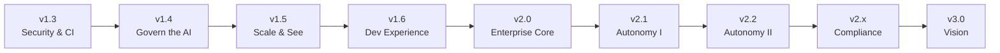

# AI-QA-OS — Release Plan

**Version:** 1.0.0
**Document Type:** Release Planning
**Document Status:** Active
**Last Updated:** 2026-07-22
**Source of truth:** [`AI-QA-OS-Improvement-Roadmap.md`](./AI-QA-OS-Improvement-Roadmap.md) v2.1.0 (finalized)

> **Purpose.** Map every finalized roadmap item into a target release. Releases are ordered by dependency, not by wish — a release ships only when its gate (exit criterion) is met. This plan groups items by their roadmap `Target Version`; it does not change any roadmap metadata. Live status is in [`AI-QA-OS-Implementation-Tracker.md`](./AI-QA-OS-Implementation-Tracker.md).

---

## Release Overview

| Release | Theme | Phase | Items | Gate to release |
|---|---|---|---|---|
| **v1.3** | Security & CI Foundation | Phase 0 | 9 | No unauthenticated endpoints; no secrets in source; CI runs tests |
| **v1.4** | Govern the AI | Phase 1 | 11 | AI output is injection-defended, confidence-gated, human-approvable, and prompt-evaluated |
| **v1.5** | Scale & See | Phase 2 | 12 | Execution runs as OS-agnostic queue-fed workers, observable end-to-end |
| **v1.6** | Developer Experience | Phase 2 | 5 | CLI + generators + validators available; architecture rules enforced in CI |
| **v2.0** | Enterprise Core | Phase 3 | 11 | Two tenants run isolated projects; AI actions audited & policy-governed |
| **v2.1** | Autonomy & Ecosystem (I) | Phase 4 | 16 | Self-healing loop closed; plugin contract live; new workflows running |
| **v2.2** | Autonomy & Ecosystem (II) | Phase 4 | 8 | Learning loop closed and governed; healing analytics live |
| **v2.x** | Compliance | Phase 3+ | 1 | Compliance frameworks mapped and reportable |
| **v3.0** | Vision | Vision | 3 | Marketplace + autonomous brain + multi-agent org |

**Total mapped:** 76 / 76 roadmap items.

> **Sequencing note.** Version windows are dependency-ordered targets, not calendar commitments. "Continuous" roadmap items are scheduled into the release where their target version falls, but may be worked in parallel throughout. No release starts before the previous release's **gate** is met — most strictly, nothing precedes **v1.3**.

---

## v1.3 — Security & CI Foundation

**Theme:** Remove every deployment blocker. Nothing else ships first.

| ID | Title | Priority | Owner |
|---|---|---|---|
| SEC-1 | Restore real authentication & authorization | 🔴 P0 | Security |
| SEC-2 | Externalize all secrets | 🔴 P0 | Security |
| SEC-5 | Supply-chain & dependency scanning in CI | 🟠 P1 | Security / DevOps |
| MNT-1 | Run the test suite in CI | 🔴 P0 | Platform Engineering |
| MNT-2 | Fix the CI deploy stage | 🟠 P1 | Platform Engineering |
| ORG-1 | Remove committed `node_modules/` from execution | 🟠 P1 | Execution / DevOps |
| MNT-4 | Remove dead code & unused dependencies | 🟡 P2 | Platform Engineering |
| MNT-5 | Establish ADRs & keep roadmap honest | 🟡 P2 | Architecture |
| ORG-4 | Move root scripts & remove stray artifacts | 🟡 P2 | Platform Engineering |

**Exit criterion:** every endpoint requires auth (except the documented allow-list); no credentials or JWT secret in source; CI runs `mvn verify` + UI tests and pushes only scanned images.

---

## v1.4 — Govern the AI

**Theme:** Make autonomous AI output safe, trustworthy, and measurable.

| ID | Title | Priority | Owner |
|---|---|---|---|
| SEC-3 | Prompt-injection & output-grounding defence | 🟠 P1 | Security + AI/Brain |
| SEC-4 | CSP & transport hardening | 🟠 P1 | Security |
| MNT-3 | Close the two highest-value test gaps | 🟠 P1 | Gateway + AI-Provider |
| MOD-3 | `ai-qa-os-eval` (evaluation & guardrails) | 🟠 P1 | AI / Eval |
| AI-1 | AI Confidence Score gate | 🟠 P1 | AI/Brain |
| AI-2 | Human-in-the-loop approval workflow | 🟠 P1 | AI/Brain + Orchestration |
| AI-3 | Prompt evaluation & regression harness | 🟠 P1 | AI / Eval |
| PE-1 | Prompt evaluation, scoring & benchmarking | 🟠 P1 | AI / Eval |
| ORG-3 | Frontend path aliases & folder separation | 🟡 P2 | Frontend |
| PERF-3 | Adopt a data-fetching cache on the frontend | 🟡 P2 | Frontend |
| DX-8 | Code Quality Automation | 🟡 P2 | Platform Engineering + DX |

**Exit criterion:** every AI output passes injection defence and a confidence gate; low-confidence output routes to a human; a prompt change is blocked by CI if it regresses the golden dataset.

---

## v1.5 — Scale & See

**Theme:** Break the single-host execution ceiling and make the platform observable.

| ID | Title | Priority | Owner |
|---|---|---|---|
| SCALE-1 | Decouple execution into a queue-fed worker pool | 🟠 P1 | Infrastructure / Execution |
| SCALE-2 | Introduce an event bus for coordination | 🟠 P1 | Infrastructure / Core |
| OBS-1 | End-to-end distributed tracing | 🟠 P1 | Observability |
| OBS-2 | Metrics, alerting & Grafana stack | 🟠 P1 | Observability / Infra |
| WF-4 | Sharded / parallel cross-browser execution | 🟡 P2 | Execution |
| ENT-5 | Backup, DR & data lifecycle | ⚪ P3 | Infrastructure |
| SCALE-3 | Standardise on one vector store | 🟡 P2 | Memory |
| MNT-6 | Consistent package naming & correlated logging | 🟡 P2 | Platform Eng + Observability |
| ORG-2 | Consolidate Flyway migrations | 🟡 P2 | Platform Engineering |
| PERF-1 | Exploit virtual threads & async pipeline steps | 🟡 P2 | Platform Engineering |
| PERF-2 | Batch embeddings & reuse semantic cache | 🟡 P2 | Memory / AI-Provider |
| MOD-5 | Make `ai-qa-os-data` real, or fold in | 🟡 P2 | Platform Engineering |

**Exit criterion:** execution runs as containerised, OS-agnostic workers off a durable queue with artifacts in object storage; a single workflow is traceable end-to-end; alerts fire on error rate, cost spikes, and queue depth.

---

## v1.6 — Developer Experience

**Theme:** Make extending the platform fast and safe.

| ID | Title | Priority | Owner |
|---|---|---|---|
| DX-1 | AI-QA-OS CLI | 🟡 P2 | Developer Experience |
| DX-2 | Scaffolding generators | 🟡 P2 | Developer Experience |
| DX-3 | Development sandbox & local AI simulator | 🟡 P2 | Developer Experience |
| DX-6 | Workspace & architecture validators | 🟡 P2 | Developer Experience + Architecture |
| DX-7 | Developer Documentation Generator | 🟡 P2 | Developer Experience + Architecture |

**Exit criterion:** a new module/agent/workflow/prompt can be scaffolded by CLI and is born compliant; the architecture validator fails CI on any dependency-direction or mediator-rule violation; developers can run the platform offline against the AI simulator.

---

## v2.0 — Enterprise Core

**Theme:** Multi-tenant, cost-governed, audited, policy-bounded.

| ID | Title | Priority | Owner |
|---|---|---|---|
| MOD-1 | `ai-qa-os-tenant` (project / tenant context) | 🟠 P1 | Platform / Enterprise |
| ENT-1 | Multi-tenancy / project isolation | 🟠 P1 | Platform / Enterprise |
| ENT-3 | LLM cost governance & quotas | 🟠 P1 | Platform / AI-Brain |
| ENT-4 | Admin & user-management surface | 🟡 P2 | Dashboard + Security |
| SCALE-4 | Separate the two apps' database concerns | 🟡 P2 | Platform Engineering |
| GOV-1 | AI audit trail | 🟠 P1 | Security / Governance |
| GOV-3 | Policy engine & Responsible AI rules | 🟡 P2 | Security / AI-Brain |
| GOV-4 | Model & prompt version registry with rollback | 🟡 P2 | Governance / AI |
| OBS-3 | Operational dashboards suite | 🟡 P2 | Observability + Dashboard |
| DX-4 | Live agent debugger & prompt playground | 🟡 P2 | Developer Experience + AI |
| SEC-6 | Signed artifacts & mTLS between services | ⚪ P3 | Infrastructure |

**Exit criterion:** two tenants run isolated projects with separate data, cost, and quotas; every AI action is audited and evaluated against policy; operators have the dashboard suite.

---

## v2.1 — Autonomy & Ecosystem (I)

**Theme:** Close the self-healing loop; open the plugin ecosystem; deepen the pipeline.

| ID | Title | Priority | Owner |
|---|---|---|---|
| HEAL-1 | Autonomous locator-healing loop | 🟠 P1 | Healing + AI/Brain |
| HEAL-2 | Healing confidence & approval workflow | 🟠 P1 | Healing + AI/Brain |
| HEAL-4 | AI Healing Memory | 🟠 P1 | Healing + Memory |
| WF-1 | Distinct scenario & test-data workflows | 🟠 P1 | Orchestration |
| WF-2 | CI-triggered & scheduled runs | 🟠 P1 | Integration + Orchestration |
| MOD-4 | Make `ai-qa-os-testdata` real | 🟠 P1 | Test Data / AI |
| PLG-1 | Plugin architecture, lifecycle & registration | 🟠 P1 | Integration / Platform |
| PLG-2 | Integration plugins (ALM/CI/chat) | 🟡 P2 | Integration |
| MOD-2 | `ai-qa-os-notification` (outbound comms) | 🟡 P2 | Integration |
| ENT-2 | Centralised notifications | 🟡 P2 | Integration |
| AI-4 | Semantic / prompt cache | 🟡 P2 | AI-Provider |
| AI-5 | Complete/remove Claude; wire local model | ⚪ P3 | AI-Provider |
| AI-6 | Context-window & cost budgeting per workflow | ⚪ P3 | AI/Brain |
| PE-2 | Prompt experimentation (A/B & leaderboard) | 🟡 P2 | AI / Eval |
| PE-3 | Prompt quality dashboard | 🟡 P2 | Dashboard + AI |
| AGT-1 | Agent roadmap & roster (begins) | ⚪ P3 | AI / Agents |

**Exit criterion:** locator drift is auto-recovered under a confidence gate with cross-run healing memory; plugins load on a formal contract; scenario/test-data steps and CI-triggered runs are live.

---

## v2.2 — Autonomy & Ecosystem (II)

**Theme:** Close and govern the continuous-learning loop; complete healing analytics; ship extension SDKs.

| ID | Title | Priority | Owner |
|---|---|---|---|
| LRN-1 | Close the continuous-learning loop | 🟠 P1 | Learning + AI/Brain |
| LRN-4 | Learning governance & safe-adoption gate | 🟠 P1 | Learning + AI/Brain |
| LRN-2 | Learning metrics | 🟡 P2 | Learning + Observability |
| LRN-3 | Learning dashboard | 🟡 P2 | Dashboard |
| HEAL-3 | Healing dashboard, analytics & locator history | 🟡 P2 | Dashboard + Healing |
| WF-3 | Test impact analysis, flaky detection, re-run-failed | 🟡 P2 | Learning |
| PLG-3 | Extension SDKs (agent/exec/reporter/browser) | 🟡 P2 | Platform / DX |
| DX-5 | Plugin SDK | ⚪ P3 | Developer Experience |

**Exit criterion:** each run measurably improves the next, and improvements only ship if they pass the safe-adoption gate; healing and learning are visible on dashboards; third parties can build agents, engines, and reporters via SDKs.

---

## v2.x — Compliance

**Theme:** Map the platform's controls to enterprise compliance frameworks.

| ID | Title | Priority | Owner |
|---|---|---|---|
| GOV-2 | Compliance frameworks & dashboard | ⚪ P3 | Governance / Enterprise |

**Exit criterion:** GDPR / SOC 2 / ISO 27001 controls are mapped to platform capabilities and reportable from the compliance dashboard. *(Scheduled flexibly within the v2.x line as enterprise demand requires.)*

---

## v3.0 — Vision

**Theme:** Marketplace, autonomous brain, multi-agent organisation.

| ID | Title | Priority | Owner |
|---|---|---|---|
| PLG-4 | Marketplace architecture | ⚪ P3 | Platform / Enterprise |
| AGT-2 | Agent collaboration, lifecycle & marketplace | ⚪ P3 | AI / Agents + Platform |
| BRAIN-1 | Staged QA Brain evolution (culminates) | ⚪ P3 | AI/Brain (Architecture) |

**Exit criterion:** third-party agents/plugins are discoverable and installable; the Brain operates end-to-end within policy with human oversight only at approval points. Aligns with the [Vision 2030](./AI-QA-OS-Improvement-Roadmap.md#25-ai-qa-os-vision-2030) trajectory. *(`AGT-1` continues incrementally through the v2.1→v3.x line.)*

---

## Release Discipline

1. **Gate before ship.** A release ships only when its exit criterion is met, verified against the tracker.
2. **Blockers first.** No v1.4+ work merges while any v1.3 P0 item is open.
3. **Dependencies respected.** Use the tracker's dependency graph; do not start an item before its predecessors are at least `Under Review`.
4. **Deferred stays deferred.** ⚪ P3 items ride along in their target release only if capacity allows; they never displace P0/P1 work.
5. **No scope creep.** New capability requires an explicit roadmap change (owner-approved), not a release-plan edit.

---

## Document Completion Status

**Status:** Active — reviewed at each release-planning checkpoint
**Version:** 1.0.0
**Convention:** Item-to-release mapping mirrors roadmap `Target Version`; if a roadmap item is re-versioned, update this plan to match — never the reverse
**Related documents:** [`AI-QA-OS-Improvement-Roadmap.md`](./AI-QA-OS-Improvement-Roadmap.md) · [`AI-QA-OS-Implementation-Tracker.md`](./AI-QA-OS-Implementation-Tracker.md) · [`AI-QA-OS-Architecture-Decisions.md`](./AI-QA-OS-Architecture-Decisions.md)
