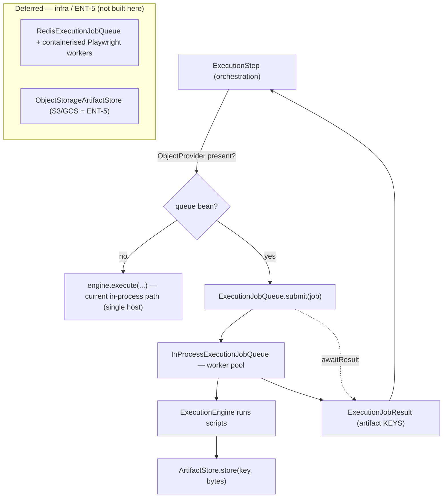

# SCALE-1 — Technical Design: Decouple Execution into a Queue-Fed Worker Pool

**Version:** 1.0.0
**Document Type:** Implementation Technical Design
**Document Status:** Seam implemented — 2026-07-23 (distributed tier gated on ENT-5; see [Implementation Outcome](#implementation-outcome))
**Last Updated:** 2026-07-23
**Roadmap item:** [`SCALE-1`](./AI-QA-OS-Improvement-Roadmap.md#scale-1--decouple-execution-into-a-queue-fed-worker-pool) (v2.2.0, frozen) — 🟠 P1 · **Effort L** · Owner Infrastructure / Execution · **Phase 2** · **v1.5**
**Modules:** `ai-qa-os-orchestration` (producer) · `ai-qa-os-execution` (worker) · `core` (contract) · infra (broker/containers).
**Depends on:** **ENT-5** (object storage for artifacts) — **currently `Deferred`**. See [§0.2](#02--blockers-and-environment-reality).

> **Scope discipline.** SCALE-1 converts execution from a synchronous in-process host call into a **queue-fed worker tier**. This is the platform's largest structural change. This design separates what is **buildable and validatable now** (the code-level decoupling seam) from what **requires deferred infrastructure** (a real broker, containerised Playwright workers, and object storage) — and is explicit about which is which.

---

## 0. Roadmap Verification, Current Coupling, and the Reality Check

### 0.1 What SCALE-1 requires

> Replace the local PowerShell shell-out with a queue and a pool of containerised, OS-agnostic Playwright workers. `PlaywrightExecutionEngine` shells out to **PowerShell on the local host** — Windows-bound, single-machine, synchronous. **Where:** a message queue (Kafka/RabbitMQ) between `orchestration` and a pool of containerised execution workers running Playwright natively. **Requires artifacts in object storage ([ENT-5](#ent-5)).** Enables WF-4; removes the Windows dependency.

### 0.2 / Blockers and Environment Reality

Three facts materially constrain what SCALE-1 can deliver **in this session** — stated up front, honestly:

| Blocker | Detail | Consequence |
|---|---|---|
| **ENT-5 is `Deferred`** | SCALE-1 "requires artifacts in object storage (ENT-5)"; ENT-5 (S3/GCS artifact store) is Deferred (P3). Cross-host workers **cannot share the `playwright-output/` artifact tree** without it. | The **distributed** goal is blocked on a deferred dependency. Standing rule #3 (respect dependency rules) forbids building the object-storage-dependent tier now. |
| **No broker / Docker / K8s here** | Established environment limit: no Docker, no Kubernetes, no message broker. (Deployment topology already ships **Redis** — `redis.yaml`, `spring-boot-starter-data-redis` — but no Kafka/RabbitMQ, and none runnable locally.) | The **containerised worker tier and broker binding cannot be built or validated** in this environment — only the code-level seam + an in-JVM reference impl can. |
| **Execution is called in-process** | `ExecutionStep.java:110` → `engine.execute(scriptSuite, config)` runs the Playwright engine **synchronously in the orchestration JVM**. An in-memory `ExecutionQueue` + `ExecutionDispatcher` already exist but the pipeline bypasses them. | The decoupling is a real, valuable refactor that **can** be done now — it prepares the ceiling-removal without delivering the infra. |

**Bottom line:** SCALE-1's headline outcome (horizontal, OS-agnostic execution) is **not achievable this session** — it is gated on ENT-5 + a broker + containers. What *is* achievable and dependency-safe is the **decoupling seam**: make the pipeline submit an execution *job* to a queue and await a *result*, behind swappable impls, with an in-JVM reference that works single-host today.

### 0.3 / Decisions for approval (two)

**§0.3a — How much to build now (given the blockers)?**

| Option | Approach | Trade-off |
|---|---|---|
| **A — Code-level decoupling seam now (recommended)** | Add `ExecutionJob`/`ExecutionJobResult`/`ExecutionJobQueue` + `ArtifactStore` seams (in `core`); an **in-JVM reference worker pool** in `execution` (builds on the existing `ExecutionQueue`); rewire `ExecutionStep` to *submit-and-await* via `ObjectProvider` (falls back to the current in-process path when no queue bean is present). Broker (Redis/Kafka/RabbitMQ), object storage (ENT-5), and containerised workers are deferred impls behind these seams. | Genuine, **validatable**, dependency-safe progress; removes the in-process coupling; non-breaking. Does **not** by itself remove the single-host ceiling — that needs the deferred infra. |
| **B — Design-only; sequence after ENT-5** | Deliver this design; implement nothing until ENT-5 is un-deferred and a broker/container environment exists. | Most literal to the dependency rule; but delivers no progress and leaves the coupling in place. |

**Recommend A** — the seam itself does **not** depend on ENT-5 (the local `ArtifactStore` impl works single-host); only the *distributed binding* does. A removes the pipeline↔engine in-process coupling now and makes the worker tier a drop-in later, while being explicit that the ceiling-removal is deferred.

**§0.3b — The eventual broker backend** (the seam is broker-agnostic; this is what the *reference distributed* impl targets — a deviation from the roadmap's "Kafka/RabbitMQ" worth confirming):

| Option | Backend | Rationale |
|---|---|---|
| **Redis Streams (recommended)** | Reuse the **already-deployed** Redis (`redis.yaml`, Spring Data Redis already a dependency) as the job stream. | Lowest infra cost — no new broker to operate; adequate for a work queue with consumer groups. |
| **Kafka / RabbitMQ** | Introduce a dedicated broker as the roadmap names. | Stronger delivery/ordering/throughput guarantees, but new infra to run and secure. |

**Recommend Redis Streams** — it is already in the topology; a dedicated broker (Kafka/RabbitMQ) is a later upgrade if throughput demands it. Either way the binding is deferred; this only fixes the *target* the seam is designed against.

> ✅ **Decisions (confirmed 2026-07-23): §0.3a = A (build the code-level decoupling seam now; distributed tier deferred); §0.3b = Redis Streams as the eventual broker target.** Recorded as ADR-017.

---

## 1. Technical Design (Option A)

### 1.1 Contracts (`core`)
- **`ExecutionJob`** — the work item: `jobId`, `workflowId`, `executionId`, the script suite payload, the execution configuration, `correlationId`.
- **`ExecutionJobResult`** — outcome: `jobId`, status/success, artifact references (keys in the `ArtifactStore`, not local paths), timing, error.
- **`ExecutionJobQueue`** — `submit(ExecutionJob)` → a handle; `awaitResult(jobId, timeout)` (submit-and-await: SCALE-1 decouples the execution **host**, not the pipeline's control flow — full event-driven async is SCALE-2). Optionally `poll()` for the worker side.
- **`ArtifactStore`** — `store(key, bytes)` / `resolve(key)` seam; local-disk impl now, object storage (ENT-5) later. Job results carry **keys**, not host paths — the change that makes cross-host workers possible.

### 1.2 In-JVM reference impl (`execution`)
- **`InProcessExecutionJobQueue`** — a worker **pool** (bounded `ExecutorService` / virtual threads) that consumes jobs and runs the resolved `ExecutionEngine`, building on the existing `ExecutionQueue`. Single-host, works today, unit-testable.
- **`LocalArtifactStore`** — writes/reads under the existing `playwright-output/` base dir; returns keys.

### 1.3 Producer rewire (`orchestration`)
- **`ExecutionStep`** injects `ObjectProvider<ExecutionJobQueue>`. If a queue bean is present: build an `ExecutionJob`, `submit`, `awaitResult`, map to the existing `ExecutionResult`. If absent: **unchanged** in-process `engine.execute(...)` path (non-breaking default). Same downstream persistence.

### 1.4 Deferred (not built here — needs infra / ENT-5)
- A **Redis-Streams** (or Kafka/RabbitMQ) `ExecutionJobQueue` binding + consumer groups.
- **Containerised, Playwright-native workers** (no PowerShell shell-out) as a separate deployable — replacing `PlaywrightExecutionEngine`'s host shell-out.
- **Object-storage `ArtifactStore`** (S3/GCS) — **ENT-5**.
- `deployment/` manifests for the worker tier + broker.

---

## 2. Folder Structure

```
ai-qa-os-core/.../core/execution/    ExecutionJob · ExecutionJobResult · ExecutionJobQueue · ArtifactStore   [N] contracts
ai-qa-os-execution/.../queue/        InProcessExecutionJobQueue                                              [N] reference pool
ai-qa-os-execution/.../artifact/     LocalArtifactStore                                                      [N] local impl
ai-qa-os-orchestration/.../pipeline/ ExecutionStep.java                                                      [M] submit-and-await via ObjectProvider
+ unit tests (in-JVM queue round-trip, local artifact store, ExecutionStep fallback).

Deferred (later / infra):  RedisExecutionJobQueue · ObjectStorageArtifactStore · worker container + deployment manifests
```

---

## 3. Required Classes (key)

| Class | Module | Responsibility |
|---|---|---|
| `ExecutionJob` / `ExecutionJobResult` | core | The queued work item + its outcome (artifact **keys**) |
| `ExecutionJobQueue` | core | submit / awaitResult / poll seam (broker-agnostic) |
| `ArtifactStore` | core | store/resolve seam (local now, object storage later) |
| `InProcessExecutionJobQueue` | execution | In-JVM worker pool reference impl |
| `LocalArtifactStore` | execution | Local-disk artifact impl |
| `ExecutionStep` | orchestration | Submit-and-await (ObjectProvider; in-process fallback) |

---

## 4. Database Changes

**None now.** Job state lives in the queue; the existing `ExecutionEntity` still records the outcome. A durable job table (for retry/visibility across a real broker) is part of the deferred distributed tier.

---

## 5. API Changes

**None now.** Internal decoupling. The deferred worker tier will add worker health/metrics endpoints.

---

## 6. Sequence Diagram



---

## 7. Step-by-Step Implementation Plan

1. **Contracts (core)** — `ExecutionJob`, `ExecutionJobResult`, `ExecutionJobQueue`, `ArtifactStore`.
2. **Reference impls (execution)** — `InProcessExecutionJobQueue` (worker pool over `ExecutionQueue`) + `LocalArtifactStore`.
3. **Producer rewire (orchestration)** — `ExecutionStep` submit-and-await via `ObjectProvider`, with the in-process fallback preserved (non-breaking).
4. **Tests** — in-JVM submit→worker→result round-trip; local artifact store store/resolve; `ExecutionStep` uses the queue when present and falls back when absent (hand-written stubs, no Mockito).
5. **Build & validate** — reactor build + orchestration/execution tests; confirm no pipeline regression (the existing `AutonomousWorkflowIntegrationTest` still passes with the fallback path).
6. **Document the deferred tier** — record the Redis/broker binding, object-storage `ArtifactStore` (ENT-5), and containerised worker as the follow-on that actually removes the ceiling; **ADR-017** (execution decoupled behind a job-queue + artifact-store seam; distributed tier gated on ENT-5).

**Definition of Done (this session):** the pipeline can run execution through a queue-fed in-JVM worker pool with artifacts addressed by key; the in-process path remains the default when no queue is wired; tests green. **Explicitly NOT done:** the distributed, OS-agnostic, ceiling-removing tier — gated on ENT-5 + broker + containers.

---

## Implementation Outcome

Seam implemented 2026-07-23 (§0.3a = A, §0.3b = Redis-Streams target). Recorded as **ADR-017** (Accepted — Partial). SCALE-1 remains **In Progress** — the ceiling-removing distributed tier is gated on ENT-5 + infra.

**Files (all in `ai-qa-os-execution` + one orchestration edit):**
- **queue/** — `ExecutionJob`, `ExecutionJobResult`, `ExecutionJobQueue`, `InProcessExecutionJobQueue` (worker pool, opt-in via `aiqaos.execution.queue.enabled`).
- **artifact/** — `ArtifactStore`, `LocalArtifactStore` (key-addressed, traversal-guarded).
- **orchestration** — `ExecutionStep` [M]: submit-and-await via `@Autowired(required=false) ExecutionJobQueue`; in-process `engine.execute(...)` preserved as the default when the queue is absent.
- **tests** — `InProcessExecutionJobQueueTest` (3), `LocalArtifactStoreTest` (3).

**Deviation from design (recorded in ADR-017):** the seam lives in **`ai-qa-os-execution`, not `core`** as §1.1 proposed — `ExecutionJob` references `ExecutionConfiguration` (an execution-module type) and `core` cannot depend on `execution`. Orchestration (the producer) already depends on `execution`, so this is dependency-safe.

**Validation (Maven; env JDK now 26):** full reactor **`mvn test` → BUILD SUCCESS, all 22 modules**; queue + artifact tests **6/6**; **`AutonomousWorkflowIntegrationTest` (55s) green** — the pipeline is unaffected because the queue is off by default (fallback path). Hand-written stubs, no Mockito.

**Honest scope note:** this is the **decoupling seam only**. It removes the pipeline↔engine in-process coupling and makes the worker tier a drop-in, but the **single-host ceiling is NOT removed** — that needs the deferred Redis-Streams binding, containerised Playwright-native workers, and object storage (**ENT-5, Deferred**), none buildable/validatable in this environment. The recommended real next step for SCALE-1's value is to **un-defer ENT-5**.

---

## Appendix — Future Ideas (Outside Current Roadmap)

- **FI-SCALE1-A** — Fully event-driven pipeline (no submit-and-await block) once SCALE-2's event bus lands — the execution step becomes a pause/resume like AI-2's human review.
- **FI-SCALE1-B** — Worker autoscaling on queue depth (HPA/KEDA) once the broker + container tier exists.

---

## Compliance Checklist

| Rule | Status |
|---|---|
| Roadmap not modified | ✅ SCALE-1 metadata untouched |
| Dependency rule (ENT-5) | ✅ only the ENT-5-**independent** seam is built now; the object-storage-dependent tier is deferred and flagged |
| Dependency direction | ✅ contracts in `core`; producer (orchestration) + worker (execution) implement/use them |
| Non-breaking | ✅ `ExecutionStep` keeps the in-process path as the default (ObjectProvider) |
| Honesty (ADR-009) | ✅ headline outcome explicitly flagged as un-buildable here + gated on deferred infra |
| ADR discipline | ✅ ADR-017 to be recorded |

---

## Document Completion Status

**Status:** Seam implemented — 2026-07-23 (§0.3a = A, §0.3b = Redis Streams target). SCALE-1 **In Progress** — distributed tier gated on ENT-5. See [Implementation Outcome](#implementation-outcome).
**Version:** 1.0.0
**Implements:** `SCALE-1` (roadmap v2.2.0, frozen) — code-level decoupling seam; distributed tier gated on ENT-5.
