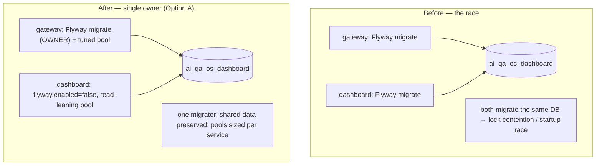

# SCALE-4 — Technical Design: Separate the Two Apps' Database Concerns

**Version:** 1.0.0
**Document Type:** Implementation Technical Design
**Document Status:** Implemented — 2026-07-28 (config-only; see [Implementation Outcome](#implementation-outcome))
**Last Updated:** 2026-07-28
**Roadmap item:** [`SCALE-4`](./AI-QA-OS-Improvement-Roadmap.md#scale-4--separate-the-two-apps-database-concerns) (v2.2.0, frozen) — 🟡 P2 · Effort M · Owner Platform Engineering · Phase 3 · v2.0
**Modules:** `ai-qa-os-gateway` + `ai-qa-os-dashboard` (config) · `deployment/`.
**Depends on:** **ORG-2** (single migration location) — *Completed*; pairs with **ENT-1** (tenancy) — *Planned*.

> **Scope discipline.** SCALE-4 removes the **dual-Flyway startup race** and decouples the two apps' data lifecycles: one **migration owner**, Flyway disabled on the follower, and **per-service connection-pool tuning**. Full schema-per-service is *not* pursued — the apps deliberately **share data** (§0.3), so isolated schemas would break that.

---

## 0. Roadmap Verification, Current State, and the Shared-Data Constraint

### 0.1 What SCALE-4 requires

> Gateway and dashboard share one PostgreSQL database and both run Flyway, creating a **startup race** and coupling their schemas. **Where:** schema-per-service or **at minimum a single migration owner** (ORG-2); connection-pool tuning per service.

### 0.2 Verified current state

| Fact | Detail |
|---|---|
| Shared database | Both `application.yml`s point at `jdbc:postgresql://…/ai_qa_os_dashboard`. |
| Dual Flyway | Both apps have `spring.flyway.enabled: true` and both carry the (ORG-2-consolidated) migrations on their classpath → both attempt to migrate the same DB on startup = the race. |
| ORG-2 done | Migrations already live in one owned location (`deployment/migration`), copied to each app's classpath — so "single migration **location**" exists; SCALE-4 adds a single **owner**. |
| Pools untuned | No explicit HikariCP sizing per service. |

### 0.3 The constraint that rules out full schema-per-service

The two apps **share tables, not just a database** — e.g. AI-2's `human_reviews` queue is written by the gateway/orchestration and **read by the dashboard**; execution/workflow rows are shared likewise. Putting each app in its own isolated schema would fork that shared state into two copies and break the review/execution flows. So SCALE-4 keeps a **shared schema for shared data** and instead fixes ownership + pooling (the roadmap's "at minimum" path, which is the *correct* path here — not a compromise).

### 0.4 / Environment reality

- **Buildable + config here:** the `application.yml` changes (Flyway ownership, pool sizing) and `deployment/` notes. The reactor build confirms both apps still **context-load** (tests use their own test profile, so prod datasource/Flyway changes don't affect them).
- **Not validatable here:** the actual **two-apps-against-a-running-Postgres** behaviour (no DB/cluster in this environment). Like SCALE-1/ENT-5, the runtime effect is proven only with live infra.

### 0.5 / Decision for approval — the migration-owner model

| Option | Approach | Trade-off |
|---|---|---|
| **A — Gateway owns Flyway; dashboard follows (recommended)** | Gateway keeps `flyway.enabled: true` (it's the primary write path); dashboard sets `flyway.enabled: false` and connects to the already-migrated DB. Per-service HikariCP tuning on both. | Minimal, pure config; kills the race immediately. Introduces a **startup ordering** expectation (dashboard needs the schema present) — fine in deployment (gateway/init runs first), a documented dev note otherwise. |
| **B — Dedicated migration job owns Flyway; both apps disabled** | Neither app migrates; a `deployment/` init job / CronJob runs Flyway. Both apps `flyway.enabled: false`. | Cleanest "single owner" (no app-ordering coupling); truest to the roadmap wording — but adds a deployment component that can't be exercised here. |

**Recommend A** — it's the smallest change that removes the race, needs no new infra, and matches the shared-DB reality; the ordering expectation is a one-line deployment/dev note. B is the better long-term ops shape and is noted as the follow-on (FI-SCALE4-A) once the deploy pipeline owns migrations.

> ✅ **Decision (confirmed 2026-07-28): Option A — gateway owns Flyway, dashboard follows (`flyway.enabled=false`) + per-service HikariCP pools.** Dedicated migration job deferred to FI-SCALE4-A. Recorded as ADR-024 (number verified at implement).

---

## 1. Technical Design (Option A)

### 1.1 Single migration owner
- **Gateway** — keep `spring.flyway.enabled: true` (owner).
- **Dashboard** — `spring.flyway.enabled: false`; it connects to the DB the gateway migrated. (Validate-only optional: `spring.flyway.validate-on-migrate` stays default; no migration attempt = no race, no lock contention.)

### 1.2 Per-service connection-pool tuning
- Explicit HikariCP sizing per app under `spring.datasource.hikari` — e.g. gateway a larger pool (it fronts the workflow write path), dashboard a smaller read-leaning pool; sensible `maximum-pool-size`, `minimum-idle`, `connection-timeout`, `pool-name` per service. Values are starting points, tunable via env.

### 1.3 Shared schema, explicit
- Keep the shared database/schema for shared data (no schema split). Document that both apps target the same schema and that the gateway owns its evolution — so the coupling is *intentional and owned*, not accidental.

### 1.4 What SCALE-4 defers
Dedicated migration job (FI-SCALE4-A) · true per-tenant/per-service schema separation (belongs with **ENT-1** tenancy) · read-replica routing for the dashboard's read load (FI-SCALE4-B).

---

## 2. Folder Structure

```
ai-qa-os-gateway/src/main/resources/application.yml     [M] flyway owner + hikari pool
ai-qa-os-dashboard/src/main/resources/application.yml    [M] flyway.enabled: false + hikari pool (read-leaning)
deployment/… (note)                                      [M?] document: gateway/init migrates before dashboard starts
```

*(Config only — no Java, no schema, no API. The migrations themselves are untouched.)*

---

## 3. Required Changes (key)

| Change | Type | Responsibility |
|---|---|---|
| gateway `application.yml` | Modified | Flyway owner; tuned pool |
| dashboard `application.yml` | Modified | Flyway disabled (follower); tuned read pool |
| deployment note | Doc | Ordering: migrate (gateway/init) before dashboard |

---

## 4. Database Changes

**No schema changes.** SCALE-4 changes *who runs* migrations and *how each app pools connections*, not the schema. (The DB stays one shared schema by design — §0.3.)

---

## 5. API Changes

**None.**

---

## 6. Sequence Diagram



---

## 7. Step-by-Step Implementation Plan

1. **Gateway** — confirm `flyway.enabled: true` (owner); add a tuned `spring.datasource.hikari` block (write-leaning).
2. **Dashboard** — `flyway.enabled: false`; add a tuned `spring.datasource.hikari` block (read-leaning).
3. **Deployment note** — record the migrate-before-dashboard ordering (gateway or an init step runs first).
4. **Build & validate** — full `mvn clean test`; both apps must still context-load + all modules green. Report honestly that the live dual-app-against-Postgres behaviour (race removal, pool effects) needs a running DB and is not exercised here.
5. **Sync docs** — tracker `SCALE-4` → Completed (config); **ADR-024** (single migration owner + shared schema by design; per-service pools). Verify the next free ADR number at implement.

**Definition of Done (this slice):** exactly one app runs Flyway; both apps have explicit per-service pools; the shared-data model is preserved and documented; both apps context-load; reactor green. **Not validated here:** the live race removal + pool behaviour (needs Postgres + both apps).

---

## Implementation Outcome

Implemented 2026-07-28 (§0.5 = A). Recorded as **ADR-024**.

**Re-ground finding:** the **migration-owner split was already in place** (ORG-2) — the gateway's `flyway.enabled` defaults to `true` and the **dashboard's already defaulted to `false`** ("to prevent migration races"). So the startup race was already resolved; SCALE-4's genuine delta was the **per-service connection pools**, which were absent.

**Files (config only):**
- **gateway `application.yml`** [M] — added a write-leaning `spring.datasource.hikari` (`pool-name: gateway-pool`, max 20 / min-idle 5, env-overridable). Flyway ownership unchanged (already the owner).
- **dashboard `application.yml`** [M] — added a read-leaning `spring.datasource.hikari` (`pool-name: dashboard-pool`, max 10 / min-idle 2). Flyway already disabled (ORG-2).

**Decisions honoured:** full schema-per-service **rejected** — the apps share data (`human_reviews` written by gateway / read by dashboard; executions), so a shared schema is kept by design. No schema/API/Java changes.

**Validation (Maven):** full **`mvn clean test` → BUILD SUCCESS, all 22 modules** (incl. dashboard controller context tests) — confirms the YAML is well-formed and both apps still context-load.

**Honest scope note:** this is a **config change**. Its actual effect — the race removal (already handled) and the pool sizing under two live apps against a running Postgres — is **not observable in this environment** (no DB/cluster; the suite uses test profiles that don't read these blocks). A dedicated migration job (removing the startup-ordering expectation) and read-replica routing are parked as FI-SCALE4-A/B; true schema separation belongs with ENT-1.

---

## Appendix — Future Ideas (Outside Current Roadmap)

- **FI-SCALE4-A** — Move Flyway ownership to a dedicated deployment migration job (both apps read-only), removing the app-startup ordering expectation.
- **FI-SCALE4-B** — Route the dashboard's read load to a Postgres read replica.
- **FI-SCALE4-C** — True per-service/per-tenant schema separation, designed together with ENT-1.

---

## Compliance Checklist

| Rule | Status |
|---|---|
| Roadmap not modified | ✅ SCALE-4 metadata untouched |
| Dependency (ORG-2) satisfied | ✅ builds on the single migration location |
| Respects shared-data reality | ✅ shared schema kept; ownership fixed (no broken review/execution flows) |
| No new modules / schema | ✅ config only |
| Honesty (ADR-009) | ✅ live dual-app DB behaviour flagged un-validatable here |
| ADR discipline | ✅ ADR-024 to be recorded (number verified at implement) |

---

## Document Completion Status

**Status:** Implemented — 2026-07-28 (§0.5 = A; ownership already via ORG-2, delta = per-service pools). See [Implementation Outcome](#implementation-outcome).
**Version:** 1.0.0
**Implements:** `SCALE-4` (roadmap v2.2.0, frozen) — single migration owner + per-service pools; full schema separation out of scope (shared data / ENT-1).
