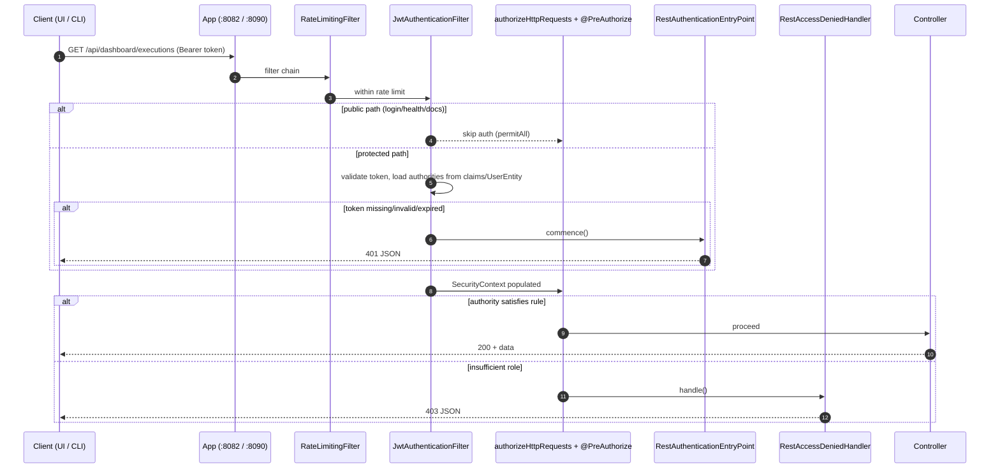
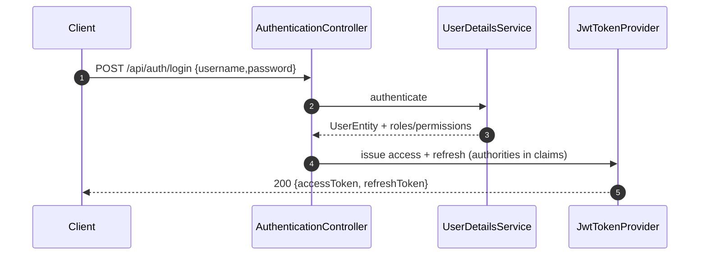

# SEC-1 — Technical Design: Restore Real Authentication & Authorization

**Version:** 1.0.0
**Document Type:** Implementation Technical Design
**Document Status:** Implemented — 2026-07-22 (see [Implementation Outcome](#implementation-outcome))
**Last Updated:** 2026-07-22
**Roadmap item:** [`SEC-1`](./AI-QA-OS-Improvement-Roadmap.md) (v2.2.0, frozen) — 🔴 P0 · Effort M · Owner Security · Phase 0 · v1.3
**Module:** `ai-qa-os-security`
**Governing ADRs:** [ADR-004](./AI-QA-OS-Architecture-Decisions.md#adr-004--the-gateway-as-the-single-public-entry-point), [ADR-005](./AI-QA-OS-Architecture-Decisions.md#adr-005--the-agent-manager-as-mandatory-mediator), [ADR-008](./AI-QA-OS-Architecture-Decisions.md#adr-008--multi-tenancy-as-a-core-context-dimension)

> **Scope discipline.** This design implements **only** SEC-1. It does not touch the roadmap, does not add features, and does not redesign architecture. Items that are *adjacent but explicitly out of scope* are listed in [§0.2](#02-explicitly-out-of-scope) and must not be pulled in.

---

## 0. Roadmap Verification & Scope

### 0.1 What SEC-1 requires (from the finalized roadmap)

> Remove the blanket `WebSecurityCustomizer.ignoring()` block; narrow `permitAll()` to only `/api/auth/**`, `/actuator/health`, `/actuator/info`, and the OpenAPI paths. Everything else authenticates. Keep `/actuator/prometheus` behind an internal-only network policy. Re-activates the JWT filter chain that already exists (`JwtAuthenticationFilter`, `RateLimitingFilter`).

**Problem being fixed.** `SecurityConfig` currently (a) `permitAll()`s nearly everything **and** (b) lists the same paths in a `WebSecurityCustomizer.ignoring()` block, which bypasses the security filter chain entirely. Net effect today: every endpoint on both runnable apps (`/api/v1/**` on gateway :8082, `/api/dashboard/**` and `/api/artifacts/**` on dashboard :8090) is reachable **with no credentials**.

### 0.2 Explicitly out of scope

These are separate frozen roadmap items and **must not** be implemented here:

| Concern | Owning item | Why excluded here |
|---|---|---|
| Externalizing the JWT secret & DB credentials | **SEC-2** | SEC-1 assumes the existing JWT infra; secret sourcing is SEC-2 |
| Content Security Policy & frame-options hardening | **SEC-4** | CSP is a distinct transport-hardening item |
| mTLS between services, signed artifacts | **SEC-6** | Infrastructure-layer, Phase 3 |
| Admin/user-management UI & endpoints | **ENT-4** | No new admin surface is created here |
| Tenant-scoped authorization | **ENT-1 / MOD-1** | Tenancy dimension not yet introduced (ADR-008 respected: design must not *preclude* it) |
| Fine-grained AI/policy authorization | **GOV-3** | Policy engine governs later; SEC-1 uses coarse role gates only |
| Frontend auth-header refactor (full) | **PERF-3** | See coordination note in [§5.4](#54-breaking-change--client-coordination) |

### 0.3 Verification checklist (done before writing any code — see [§7 Step 1](#7-step-by-step-implementation-plan))

The exploration that fed the platform docs did not read every security class line-by-line. The following **must be confirmed by reading the actual source** before implementation, and this design notes where behaviour is assumed:

- `SecurityConfig` — the `SecurityFilterChain` bean, the `WebSecurityCustomizer` bean, current `permitAll` list, filter order (assumed: `RateLimitingFilter` → `UsernamePasswordAuthenticationFilter` → `JwtAuthenticationFilter`).
- `JwtAuthenticationFilter` — does it currently populate `GrantedAuthority`s from token claims? (assumed partial).
- The JWT token provider/service and `JwtProperties` (`security.jwt.*`).
- The `UserDetailsService` / authentication provider backing `POST /api/auth/login`.
- Whether a usable bootstrap admin user + roles already exist in the database (drives [§4](#4-database-changes)).

---

## 1. Technical Design

### 1.1 Design decision

Convert the security filter chain from **"bypass everything"** to **"deny by default, allow by explicit exception."** This is a configuration correction plus three small supporting classes — **no new module, no new external dependency, no architectural change.** Because `SecurityConfig` lives in `ai-qa-os-security` and both the gateway and dashboard apps already depend on that module, **one change secures both runnable apps** (ADR-004: auth enforced at the edge for the single public entry surface).

### 1.2 Approach

1. **Delete the `WebSecurityCustomizer.ignoring()` bypass entirely.** Nothing should skip the filter chain except truly static, security-irrelevant paths (`/error` is handled inside the chain, not ignored).
2. **Replace the wide `permitAll()` with a minimal public allow-list** (deny-by-default for all else).
3. **Ensure the JWT filter runs for every protected path** and populates the `SecurityContext` with authorities derived **from the token/`UserEntity` — never from client input** (this closes the "client-chosen role" gap for the *server side*; the frontend selector becomes cosmetic).
4. **Add REST-style 401/403 handlers** so a stateless API returns JSON errors instead of a login redirect.
5. **Apply a coarse authorization baseline** using the roles that already exist (`ADMIN`, `QA_MANAGER`, `QA_ENGINEER`, `VIEWER`): authenticated-by-default, with `ADMIN` required for operational actuator endpoints.
6. **Gate enforcement with the existing flag** `aiqaos.security.enabled` so local development stays open and non-local environments enforce — no new flag invented.

### 1.3 Access-control matrix (target state)

| Path | Access | Notes |
|---|---|---|
| `POST /api/auth/login` | **Public** | Issues tokens |
| `POST /api/auth/refresh` | **Public** | Validates refresh token in body |
| `POST /api/auth/logout` | **Authenticated** | Needs a token to invalidate the session |
| `/actuator/health`, `/actuator/info` | **Public** | Liveness/readiness for orchestrators |
| `/swagger-ui/**`, `/v3/api-docs/**` | **Public** | API docs (content only; SEC-4 owns CSP) |
| `/error` | **Handled in-chain** | Never `ignoring()` |
| `/api/v1/**` (gateway) | **Authenticated** | Workflow/agent/execution/report control |
| `/api/dashboard/**` (dashboard) | **Authenticated** | All dashboard reads incl. SSE `/live/stream` |
| `/api/artifacts/**` | **Authenticated** | Raw artifact files (screenshots/video/logs) |
| `/actuator/prometheus`, `/actuator/metrics`, other `/actuator/**` | **`ADMIN` + internal network** | Roadmap: prometheus behind internal-only network policy; scraper uses a service account |

> **Coarse role baseline (uses existing roles only — no new RBAC model):** read endpoints require any authenticated role (`VIEWER`+); workflow/execution *mutations* (`POST /api/v1/workflows/**`, `/execution/run`, cancel) require `QA_ENGINEER`+; operational actuator endpoints require `ADMIN`. Finer per-endpoint policy is deferred to **GOV-3** and is *not* built here. Enforcement uses the already-enabled `@EnableMethodSecurity` (`@PreAuthorize`) plus `authorizeHttpRequests` rules — no new mechanism.

### 1.4 Rollout strategy (no big-bang breakage)

- `aiqaos.security.enabled=false` in the **local** profile → chain permits all (unchanged dev experience).
- `aiqaos.security.enabled=true` in **dev/stage/prod** → full enforcement.
- SSE (`/api/dashboard/live/stream`) validated: the `EventSource` client must send the token; where the browser `EventSource` cannot set headers, use the existing token via a query param **only if already supported** — otherwise flag for the frontend companion change (PERF-3). Confirm during [§7 Step 1](#7-step-by-step-implementation-plan).

---

## 2. Folder Structure

All changes are contained in `ai-qa-os-security` (depends on `core` only — dependency rule preserved). `[M]` = modified, `[N]` = new.

```
ai-qa-os-security/
└── src/
    ├── main/
    │   ├── java/com/aiqaos/security/
    │   │   ├── config/
    │   │   │   ├── SecurityConfig.java                 [M] remove ignoring(); deny-by-default; wire handlers
    │   │   │   └── SecurityPathsProperties.java        [N] config-driven public allow-list (optional but recommended)
    │   │   ├── filter/
    │   │   │   ├── JwtAuthenticationFilter.java        [M] skip public paths; load authorities from claims
    │   │   │   └── RateLimitingFilter.java             [-] unchanged (order preserved)
    │   │   ├── web/
    │   │   │   ├── RestAuthenticationEntryPoint.java   [N] 401 JSON for unauthenticated
    │   │   │   └── RestAccessDeniedHandler.java        [N] 403 JSON for forbidden
    │   │   ├── bootstrap/
    │   │   │   └── BootstrapAdminInitializer.java      [N] conditional, config-driven admin seed (see §4)
    │   │   ├── auth/  (AuthenticationController, token provider, UserDetailsService)   [-] unchanged
    │   │   └── entity/ (UserEntity, RoleEntity, …)     [-] unchanged
    │   └── resources/
    │       └── (no new resources; config keys added to ai-qa-os-config profiles — see §4/§5)
    └── test/
        └── java/com/aiqaos/security/
            ├── SecurityConfigAccessControlTest.java    [N] @WebMvcTest / slice: 401/403/200 matrix
            └── JwtAuthenticationFilterTest.java         [N] authority mapping + public-path skip
```

> No files are added to `ai-qa-os-gateway` or `ai-qa-os-dashboard`; they inherit the corrected chain. Profile config keys live in `ai-qa-os-config` (existing profiles), consistent with the Configuration-Driven principle.

---

## 3. Required Classes

| Class | Type | Module | Responsibility |
|---|---|---|---|
| `SecurityConfig` | **Modified** | ai-qa-os-security | Remove `WebSecurityCustomizer.ignoring()`; define deny-by-default `authorizeHttpRequests` from the [access matrix](#13-access-control-matrix-target-state); register the 401/403 handlers; preserve `STATELESS`, CSRF-disabled, and existing filter order; keep `@EnableMethodSecurity`. **CSP/frame-options left untouched (SEC-4).** |
| `JwtAuthenticationFilter` | **Modified** | ai-qa-os-security | Skip the public allow-list; on protected paths validate the bearer token and set an `Authentication` whose authorities come from token claims / `UserEntity` roles+permissions — never from request/client data. On invalid/missing token for a protected path, delegate to the entry point (401). |
| `RestAuthenticationEntryPoint` | **New** | ai-qa-os-security | `AuthenticationEntryPoint` returning `401` with a standard JSON error envelope (no redirect) for unauthenticated access. |
| `RestAccessDeniedHandler` | **New** | ai-qa-os-security | `AccessDeniedHandler` returning `403` JSON for authenticated-but-unauthorized access. |
| `SecurityPathsProperties` | **New (recommended)** | ai-qa-os-security | `@ConfigurationProperties(prefix="aiqaos.security.public-paths")` — externalizes the public allow-list so it is configuration-driven, not hardcoded. Sensible defaults match [§1.3](#13-access-control-matrix-target-state). |
| `BootstrapAdminInitializer` | **New (conditional)** | ai-qa-os-security | Idempotent startup component that creates a single bootstrap `ADMIN` user **only if none exists**, reading credentials from config/env (see [§4](#4-database-changes)). Gated by `aiqaos.security.enabled`. |

**Leveraged unchanged (verify in Step 1):** `JwtProperties`, the JWT token provider/service, `UserDetailsService`/authentication provider, `RateLimitingFilter`, `AuthenticationController`, all RBAC entities.

---

## 4. Database Changes

**Schema changes: NONE.** All required tables already exist (`V2__security`, `V8__security_users_mfa_lockout_fields`): `users`, `roles`, `permissions`, `role_permissions`, `api_keys`, `user_sessions`, `password_history`.

**Data / enablement:** enforcing authentication is unusable if no account can authenticate. Two options — recommend **Option A** (no migration, no committed secret):

| | Option A — Config-driven startup seed (recommended) | Option B — Data migration |
|---|---|---|
| Mechanism | `BootstrapAdminInitializer` creates an `ADMIN` user + baseline roles **only if absent**, on startup | `V14__seed_bootstrap_admin.sql` inserts admin + roles |
| Credentials | From `aiqaos.security.bootstrap-admin.username` / `…password` (env-injected) | Would hardcode a password hash in SQL |
| Secret exposure | None committed | Commits a credential → conflicts with SEC-2 intent |
| Reversible/idempotent | Yes (guard on existence) | Migration is permanent |
| Verdict | ✅ Preferred | ❌ Avoid |

> **Guardrail:** the bootstrap password is **read from configuration/environment**, never committed. Fully externalized secret management is **SEC-2**; SEC-1 only needs the *mechanism* to consume an injected value. If Step 1 verification shows a usable admin already exists, `BootstrapAdminInitializer` is a no-op and may be omitted.

No changes to `ddl-auto` (`validate`) and no change to Flyway ownership ([ORG-2](./AI-QA-OS-Improvement-Roadmap.md) unaffected).

---

## 5. API Changes

### 5.1 Contract changes
**None.** No endpoint is added, removed, renamed, or reshaped. Request/response bodies of `/api/auth/*`, `/api/v1/*`, `/api/dashboard/*` are unchanged.

### 5.2 Behavioural changes
- All endpoints **except the public allow-list** now require `Authorization: Bearer <accessToken>`.
- `/api/artifacts/**`, `/api/dashboard/**`, `/api/v1/**`, and operational `/actuator/**` transition from open → protected.

### 5.3 Standardized error responses
| Condition | Status | Body |
|---|---|---|
| Missing/invalid/expired token on a protected path | `401 Unauthorized` | JSON error envelope (code, message, timestamp, path) |
| Valid token, insufficient role | `403 Forbidden` | JSON error envelope |

The OpenAPI spec gains a `bearerAuth` security scheme annotation so Swagger reflects the requirement (documentation annotation only — no CSP work, that is SEC-4).

### 5.4 Breaking change & client coordination
Enforcement is a **breaking change for any unauthenticated client**. Known impacts:
- The dashboard UI must send the token on **all** protected calls. Two pages currently use raw `fetch()` and bypass `apiClient` (so they carry no `Authorization` header); the SSE stream and artifact fetches are also affected.
- **In-scope for SEC-1:** correct **server** enforcement and document the requirement.
- **Not in scope (tracked under PERF-3):** the frontend refactor to route those calls through `apiClient`. **Coordination requirement:** SEC-1 must ship to non-local environments **only alongside** the minimal client change that attaches tokens, or the UI will break. Recommended sequencing is called out in [§7](#7-step-by-step-implementation-plan). This is a *dependency to coordinate*, not a scope expansion of SEC-1.

---

## 6. Sequence Diagram

**Protected request — happy path and rejection:**



**Login (unchanged, shown for context):**



---

## 7. Step-by-Step Implementation Plan

Ordered; each step is independently reviewable. No step generates code until you approve this design.

1. **Verify current state (read-only).** Read `SecurityConfig`, `JwtAuthenticationFilter`, the token provider, `UserDetailsService`, `JwtProperties`, and query the DB for an existing usable admin. Confirm filter order and whether authorities are already loaded from claims. Record deltas against this design's assumptions ([§0.3](#03-verification-checklist-done-before-writing-any-code--see-7-step-by-step-implementation-plan)).
2. **Introduce `SecurityPathsProperties`** with defaults matching the [access matrix](#13-access-control-matrix-target-state).
3. **Add `RestAuthenticationEntryPoint` and `RestAccessDeniedHandler`** (JSON 401/403 envelopes consistent with the existing global exception format).
4. **Modify `SecurityConfig`:** remove the `WebSecurityCustomizer.ignoring()` bean; rewrite `authorizeHttpRequests` as deny-by-default from the matrix; register the two handlers; keep `STATELESS`, CSRF-disabled, existing filter order, and `@EnableMethodSecurity`. **Do not touch CSP/frame-options (SEC-4).**
5. **Adjust `JwtAuthenticationFilter`** to skip public paths and populate authorities strictly from token claims/`UserEntity`.
6. **Apply the coarse role baseline** via `@PreAuthorize` on mutation endpoints and `authorizeHttpRequests` for actuator — using existing roles only.
7. **Add `BootstrapAdminInitializer`** (only if Step 1 shows no usable admin), config-driven and idempotent.
8. **Tests:** `SecurityConfigAccessControlTest` (401 on protected without token; 403 on wrong role; 200 with correct token) and `JwtAuthenticationFilterTest` (authority mapping, public-path skip). These also start closing the security-module test gap noted for MNT-3.
9. **Profile config:** ensure `aiqaos.security.enabled` is `false` for local and `true` for dev/stage/prod; add `aiqaos.security.public-paths` defaults and `aiqaos.security.bootstrap-admin.*` placeholders (values injected, not committed — SEC-2 boundary).
10. **Client coordination gate ([§5.4](#54-breaking-change--client-coordination)):** confirm the minimal frontend token-attachment change (PERF-3) is ready before enabling enforcement in any shared environment.
11. **Manual verification:** run the existing `verify-all.ps1` / `check-api.ps1` smoke scripts with and without a token to confirm 401/200 behaviour (note: those scripts currently assume no auth — expect and document the change).
12. **Sync governance docs:** update `AI-QA-OS-Implementation-Tracker.md` (SEC-1 status) and, since the release mapping is unchanged (still v1.3), leave `AI-QA-OS-Release-Plan.md` mapping intact.

**Definition of Done:** every protected endpoint returns 401 without a valid token and 403 for insufficient role; all listed tests pass under `mvn verify`; local dev remains open via the flag; no CSP/secret/tenancy scope was touched; tracker updated.

---

## Implementation Outcome

Implemented 2026-07-22 in `ai-qa-os-security` (+ two app configs). No roadmap change; no architecture change; no module boundaries crossed.

**Verified deltas from the design (found during Step 1 read-only verification):**

1. **No user→role model exists.** `UserEntity` has no `roles` relationship and the JWT carries no roles claim. Role-based authorization would require a new join table/relationship — a schema/architecture change forbidden under the freeze. **Authorization was therefore scoped to "authenticated"** (valid token required), which matches the roadmap's literal ask ("everything else authenticates"). A baseline `ROLE_USER` authority is granted to authenticated principals. Wiring real user→role RBAC is a separate future concern (not SEC-1).
2. **No admin is seeded** by any migration, so the config-driven `BootstrapAdminInitializer` is genuinely required for the fix to be usable; it is best-effort and never blocks startup.
3. **Rollout gating** uses `aiqaos.security.enabled` (default absent → permissive) with the flag set `true` in both apps' `application.yml` and `false` in the dashboard test profile — deny-by-default in real runs, test suite unaffected.

**Files changed:**
- `SecurityConfig.java` [M] — removed `WebSecurityCustomizer.ignoring()`; dual `SecurityFilterChain` (enforced vs permissive) via `@ConditionalOnProperty`; 401/403 handlers wired; headers preserved (CSP untouched → SEC-4).
- `JwtAuthenticationFilter.java` [M] — grants `ROLE_USER` to authenticated principals.
- `web/RestAuthenticationEntryPoint.java`, `web/RestAccessDeniedHandler.java`, `web/ErrorJson.java` [N] — JSON 401/403.
- `bootstrap/BootstrapAdminInitializer.java` [N] — conditional, config-driven, best-effort admin seed.
- `ai-qa-os-gateway/application.yml`, `ai-qa-os-dashboard/application.yml` [M] — `aiqaos.security.enabled=true` + bootstrap-admin placeholders (values injected, not committed).
- `ai-qa-os-dashboard/src/test/resources/application-test.yml` [M] — `aiqaos.security.enabled=false`.
- `web/RestErrorHandlersTest.java` [N] — 401/403 unit tests.

**`SecurityPathsProperties` was not added** — the public allow-list is a documented constant in `SecurityConfig` (fixed by the roadmap). Externalizing it is noted as an optional enhancement, not implemented (avoids extra surface).

**Test results (this environment, JDK 25 / Maven 3.9.16):**
- `ai-qa-os-security`: **4/4 tests pass** (2 new 401/403 + 2 pre-existing) — BUILD SUCCESS.
- Full `gateway,dashboard` dependency chain **compiles clean**.
- `ai-qa-os-dashboard`: **4/4 tests pass**, Spring context boots with the new dual-chain config (permissive active under test profile; no bean-wiring errors) — BUILD SUCCESS.
- **Not from SEC-1:** two pre-existing failures in `ai-qa-os-core` requirement-parser tests (`RequirementParserTest`, `RequirementReaderTest`) — Markdown-parsing assertions, unrelated to auth; `ai-qa-os-core` was not touched. Logged, not fixed (out of scope).
- **Not performed:** live end-to-end enforcement against a running Postgres + real login (needs infra). Recommend a smoke test with `verify-all.ps1` / `check-api.ps1` (with and without a token) before enabling in a shared environment.

---

## Appendix — Future Ideas (Outside Current Roadmap)

Captured while designing SEC-1. **Not implemented. Do not action without explicit approval.**

- **A1 — Refresh-token rotation & reuse detection.** The current design keeps the existing refresh flow; rotating refresh tokens and detecting reuse would harden session security. *(Candidate relationship: extends SEC-1/AuthN; not in any current item.)*
- **A2 — Per-endpoint authorization as declarative policy.** SEC-1 uses coarse role gates; expressing them as data-driven policy would be cleaner — but this is the province of **GOV-3** (policy engine), so it belongs there, not in SEC-1.
- **A3 — Actuator scraping via a dedicated service-account token** rather than network policy alone, for defense-in-depth on `/actuator/prometheus`.
- **A4 — Security integration tests with Testcontainers-Postgres** (vs H2) so RBAC/migration behaviour is tested on the real engine. *(Relates to the MNT-3 test-gap theme; raise there.)*

---

## Compliance Checklist

| Rule | Status |
|---|---|
| Roadmap not modified | ✅ SEC-1 metadata untouched |
| No new roadmap items/categories/modules | ✅ config correction + 3 helper classes in existing module |
| ADR-004 (edge auth via single entry point) | ✅ enforced in shared `SecurityConfig` |
| ADR-005 (mediator model) | ✅ unaffected — no agent/brain call paths changed |
| ADR-008 (tenancy not precluded) | ✅ authority model leaves room for tenant scoping later |
| Dependency rule (inward to `core`) | ✅ all changes in `ai-qa-os-security` (→ `core` only) |
| Module boundaries | ✅ no responsibilities moved between modules |
| Out-of-scope items untouched | ✅ SEC-2/SEC-4/SEC-6/ENT-4/GOV-3 not implemented |

---

## Document Completion Status

**Status:** Draft — Awaiting Approval
**Version:** 1.0.0
**Implements:** `SEC-1` (roadmap v2.2.0, frozen)
**Next step:** On approval, execute [§7](#7-step-by-step-implementation-plan) Step 1 (read-only verification) before any code. No code will be generated until this design is approved.
