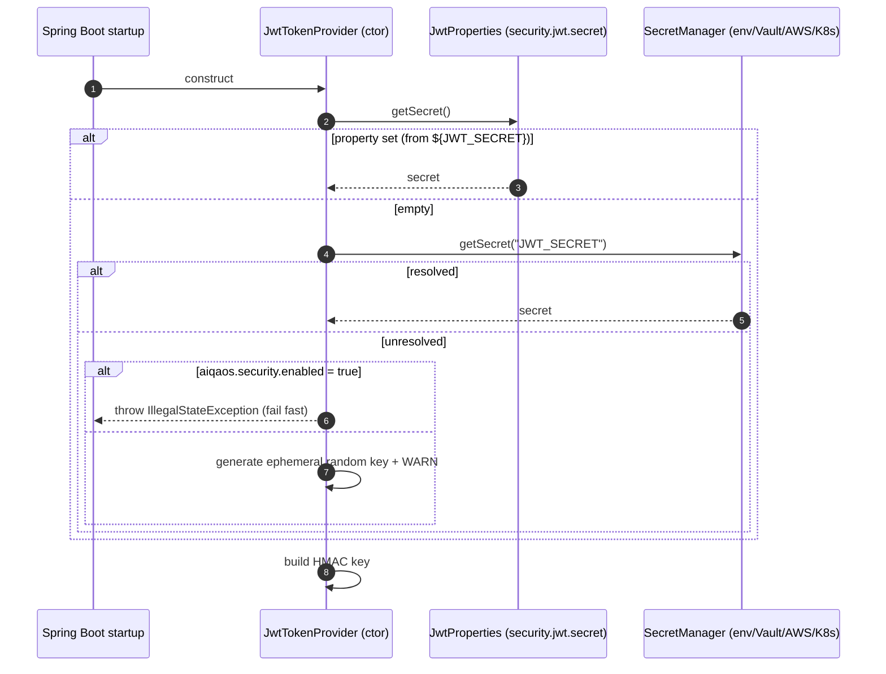
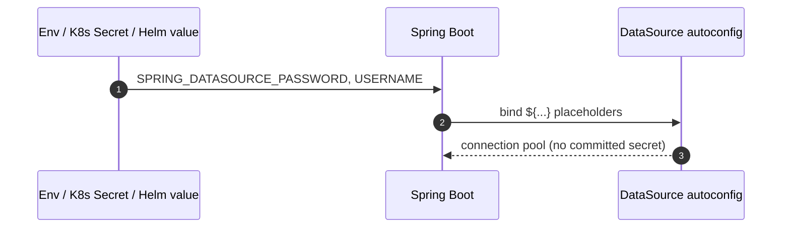

# SEC-2 — Technical Design: Externalize All Secrets

**Version:** 1.0.0
**Document Type:** Implementation Technical Design
**Document Status:** Implemented — 2026-07-22 (see [Implementation Outcome](#implementation-outcome))
**Last Updated:** 2026-07-22
**Roadmap item:** [`SEC-2`](./AI-QA-OS-Improvement-Roadmap.md) (v2.2.0, frozen) — 🔴 P0 · Effort S · Owner Security · Phase 0 · v1.3
**Modules:** `ai-qa-os-security`, `ai-qa-os-config` (+ app configs, `deployment/`)
**Governing ADRs:** [ADR-004](./AI-QA-OS-Architecture-Decisions.md#adr-004--the-gateway-as-the-single-public-entry-point), [ADR-008](./AI-QA-OS-Architecture-Decisions.md#adr-008--multi-tenancy-as-a-core-context-dimension)
**Depends on:** SEC-1 (Completed) — reuses the `aiqaos.security.enabled` flag for fail-fast behaviour.

> **Scope discipline.** Implements **only** SEC-2. No roadmap change, no new features, no architecture change. The `SecretManager` abstraction already exists (`ai-qa-os-security/secret/`); this item *wires it in and removes committed secrets* — it does not redesign it.

---

## 0. Roadmap Verification & Scope

### 0.1 What SEC-2 requires (from the finalized roadmap)

> Replace literals with `${ENV}` placeholders in the gateway and dashboard YAML. Route resolution through the already-present `SecretManager` abstraction (`VaultSecretProvider`, `AwsSecretProvider`, `K8sSecretProvider`). `deployment/kubernetes/secrets.yaml` and Helm `values-*.yaml` become the injection point. No architectural change — the secret-provider abstraction already exists and is simply not wired.

### 0.2 Verified secret inventory (read during design)

| # | Secret | Location | Current value | Classification |
|---|---|---|---|---|
| 1 | DB password | `ai-qa-os-gateway/application.yml`, `ai-qa-os-dashboard/application.yml` | `password` (plaintext) | **Real — externalize** |
| 2 | DB username | same two files | `postgres` | Credential (non-secret) — externalize with default |
| 3 | DB password (prod) | `ai-qa-os-config/application-prod.yml` | empty | **Real — externalize** |
| 4 | JWT signing secret (fallback) | `JwtTokenProvider.java` (lines 23–24) | hardcoded `9a7263…` | **Real — remove** |
| 5 | JWT signing secret (test) | `ai-qa-os-config/application-test.yml` | `9a7263…` (same value) | Test-only — replace with labeled non-prod value |
| 6 | H2 `sa` / `password` | local/test profiles | ephemeral in-memory | Non-sensitive — keep (documented) |
| 7 | LLM API keys | `ApiKeyPool` via `SecretManager` (env) | not committed | ✅ already externalized — no change |
| 8 | Bootstrap admin password | app configs (added by SEC-1) | env-injected | ✅ already externalized — no change |

`SecretManager` is `String getSecret(String key)`; `LocalSecretProvider` (`@Primary`) reads `System.getenv(key)`, with `Vault`/`Aws`/`K8s` providers as alternates.

### 0.3 Explicitly out of scope (separate frozen items)

| Concern | Owner |
|---|---|
| Prompt-injection defence | SEC-3 |
| CSP / frame-options hardening | SEC-4 |
| mTLS / signed artifacts | SEC-6 |
| Deep `spring-cloud-vault` property-source integration | Not a roadmap item — the `SecretManager` providers already cover programmatic resolution; a full Vault property source is noted under Future Ideas, not built |
| LLM API-key management | already externalized (§0.2 #7) |

### 0.4 Definition of "externalized" (the DoD bar)

**No committed value for any real secret** (inventory #1, #3, #4). Real secrets resolve from environment/secret store at runtime; a missing required secret **fails fast when enforcement is on**, and uses a safe non-persistent dev key otherwise (so local/test/CI never break). Non-secret defaults (username) and ephemeral test values (H2, test JWT key) may remain, clearly labeled.

---

## 1. Technical Design

### 1.1 Design decision

Two coordinated moves, both faithful to the roadmap and requiring **no architectural change**:

1. **Configuration:** replace every committed real-secret literal with a `${ENV_VAR}` placeholder that has **no default** (Spring resolves it from the environment / injected K8s Secret / Helm value — which *is* the platform-level `K8sSecretProvider` path).
2. **JWT secret resolution:** remove the hardcoded fallback in `JwtTokenProvider` and resolve the signing key through, in order, `JwtProperties.secret` (env placeholder) → `SecretManager.getSecret("JWT_SECRET")`. If unresolved:
   - **enforcement on** (`aiqaos.security.enabled=true`, i.e. real deployments) → **fail fast** with a clear startup error;
   - **enforcement off** (local/test/CI) → generate a secure **ephemeral random key** and log a loud `WARN`.

This removes the committed secret while guaranteeing that dev/test contexts (which load `JwtTokenProvider` as a bean) still start.

### 1.2 Why route JWT through `SecretManager`

The roadmap explicitly asks to "route resolution through the `SecretManager` abstraction." `JwtProperties.secret` already binds from `security.jwt.secret` (env-injectable). Adding the `SecretManager` lookup as a second source lets Vault/AWS/K8s providers supply the key without changing call sites — honoring the abstraction with a one-line resolution chain, not a redesign.

### 1.3 Fail-fast vs ephemeral matrix

| Context | `aiqaos.security.enabled` | `JWT_SECRET` present? | Behaviour |
|---|---|---|---|
| prod / dev / stage | true | yes | Use configured secret |
| prod / dev / stage | true | **no** | **Fail fast** at startup (misconfiguration surfaced immediately) |
| local / test / CI | false | yes | Use configured secret |
| local / test / CI | false | no | Ephemeral random key + `WARN` (no breakage) |

### 1.4 Datasource credentials

Both apps and the prod profile use `${SPRING_DATASOURCE_PASSWORD}` (**no default** → required) and `${SPRING_DATASOURCE_USERNAME:postgres}` (default retained — a username is not a secret). Spring Boot's relaxed binding already maps these env vars; explicit placeholders keep the YAML self-documenting. Local/test H2 credentials (`sa`) remain — they are ephemeral in-memory and non-sensitive.

---

## 2. Folder Structure

`[M]` modified, `[N]` new. All Java changes stay in `ai-qa-os-security` (→ `core` only); no dependency-rule impact.

```
AI-QA-OS-Core/
├── ai-qa-os-security/
│   └── src/
│       ├── main/java/com/aiqaos/security/jwt/
│       │   └── JwtTokenProvider.java                 [M] remove hardcoded fallback; resolve via SecretManager; fail-fast/ephemeral
│       └── test/java/com/aiqaos/security/jwt/
│           ├── JwtTokenProviderTest.java             [M] update constructor call to new signature
│           └── JwtSecretResolutionTest.java          [N] fail-fast-when-enforced vs ephemeral-when-not
├── ai-qa-os-gateway/src/main/resources/
│   └── application.yml                               [M] datasource creds + security.jwt.secret → ${ENV}
├── ai-qa-os-dashboard/src/main/resources/
│   └── application.yml                               [M] datasource creds + security.jwt.secret → ${ENV}
├── ai-qa-os-dashboard/src/test/resources/
│   └── application-test.yml                          [M] add test-only security.jwt.secret (context loads cleanly)
├── ai-qa-os-config/src/main/resources/
│   ├── application-prod.yml                          [M] password → ${SPRING_DATASOURCE_PASSWORD}
│   └── application-test.yml                          [M] replace shared secret with labeled test-only value
├── deployment/
│   ├── kubernetes/secrets.yaml                       [M] declare JWT_SECRET, SPRING_DATASOURCE_PASSWORD, …
│   └── helm/ai-qa-os/values-*.yaml                   [M] wire secret env refs (values, not literals)
└── .env.example                                      [N] documents required secret env vars (placeholders only)
```

> No new class is strictly required — the resolution logic folds into `JwtTokenProvider` (Effort S). A standalone `JwtSecretResolver` is noted as an optional refactor, not implemented.

---

## 3. Required Classes

| Class / File | Type | Module | Responsibility |
|---|---|---|---|
| `JwtTokenProvider` | **Modified** | ai-qa-os-security | Remove the hardcoded fallback. New constructor takes `JwtProperties`, `ObjectProvider<SecretManager>`, and `@Value("${aiqaos.security.enabled:false}")`. Resolve key: property → `SecretManager` → (enforced? fail fast : ephemeral random + WARN). Existing token generate/validate logic unchanged. |
| `JwtTokenProviderTest` | **Modified** | ai-qa-os-security | Update to the new constructor (pass a no-op `ObjectProvider` + a test secret). Existing assertions unchanged. |
| `JwtSecretResolutionTest` | **New** | ai-qa-os-security | Verify: configured secret used; enforced + missing → exception; not-enforced + missing → usable ephemeral key. |
| `application.yml` (gateway, dashboard) | **Modified** | apps | `${SPRING_DATASOURCE_PASSWORD}`, `${SPRING_DATASOURCE_USERNAME:postgres}`, `security.jwt.secret: ${JWT_SECRET}` |
| `application-test.yml` (dashboard) | **Modified** | apps | test-only `security.jwt.secret` so the context loads deterministically |
| `application-prod.yml`, `application-test.yml` (config) | **Modified** | config | externalize prod DB password; label the test secret non-prod |
| `deployment/kubernetes/secrets.yaml`, Helm `values-*.yaml` | **Modified** | deployment | injection points for the env vars |
| `.env.example` | **New** | repo root | documents required secret env vars (no real values) |

**Leveraged unchanged:** `SecretManager` + `LocalSecretProvider`/`VaultSecretProvider`/`AwsSecretProvider`/`K8sSecretProvider`, `JwtProperties`, `ApiKeyPool`.

---

## 4. Database Changes

**None.** No schema change, no migration, no data change. SEC-2 is configuration + secret-resolution only. (`ddl-auto`, Flyway ownership, entities all untouched.)

---

## 5. API Changes

**No contract or behavioural changes to any endpoint.** SEC-2 is invisible at the HTTP layer.

The one operational change: **the apps now require secret environment variables to start** in enforced environments — `SPRING_DATASOURCE_PASSWORD` and `JWT_SECRET` (plus the existing `AIQAOS_BOOTSTRAP_ADMIN_PASSWORD` from SEC-1). A missing required secret fails startup fast (by design). This is documented in `.env.example` and the deployment configs.

**Required secret env vars (summary):**

| Env var | Used by | Required when |
|---|---|---|
| `SPRING_DATASOURCE_PASSWORD` | gateway, dashboard | always (real DB) |
| `SPRING_DATASOURCE_USERNAME` | gateway, dashboard | optional (defaults `postgres`) |
| `JWT_SECRET` | security (both apps) | when `aiqaos.security.enabled=true` |
| `AIQAOS_BOOTSTRAP_ADMIN_PASSWORD` | security (SEC-1) | to auto-provision admin |

---

## 6. Sequence Diagram

**Startup — JWT signing key resolution:**



**Datasource credentials (unchanged mechanism, shown for completeness):**



---

## 7. Step-by-Step Implementation Plan

1. **Verify (read-only).** Confirm no other hardcoded secrets: `grep -ri "password\|secret\|api[-_]key"` across `src/main/resources` and Java (excluding `node_modules`). Confirm `ApiKeyPool` uses env only. Confirm the existing `JwtTokenProviderTest` sets its own secret (done — it does).
2. **Externalize datasource creds** in `ai-qa-os-gateway/application.yml`, `ai-qa-os-dashboard/application.yml`, and `ai-qa-os-config/application-prod.yml` (`${SPRING_DATASOURCE_PASSWORD}`, `${SPRING_DATASOURCE_USERNAME:postgres}`).
3. **Add `security.jwt.secret: ${JWT_SECRET}`** to both apps' `application.yml` (no default).
4. **Modify `JwtTokenProvider`:** remove the hardcoded fallback; add the property → `SecretManager` → fail-fast/ephemeral resolution ([§1.3](#13-fail-fast-vs-ephemeral-matrix)).
5. **Update `JwtTokenProviderTest`** to the new constructor; **add `JwtSecretResolutionTest`** for the three resolution cases.
6. **Test-context secrets:** add a labeled test-only `security.jwt.secret` to `ai-qa-os-dashboard/src/test/resources/application-test.yml`; replace the shared `9a7263…` in `ai-qa-os-config/application-test.yml` with a clearly non-prod value.
7. **Deployment injection points:** update `deployment/kubernetes/secrets.yaml` and Helm `values-*.yaml`; add `.env.example` (placeholders only, no real values).
8. **Build & test:** `mvn -pl ai-qa-os-security test` (security suite green) and a dashboard-context load to confirm no startup regression. Report results honestly (note the pre-existing, unrelated `ai-qa-os-core` requirement-parser test failures observed in SEC-1).
9. **Sync governance docs:** set `SEC-2` status in `AI-QA-OS-Implementation-Tracker.md`; release mapping unchanged (still v1.3).

**Definition of Done:** no committed value for any real secret (inventory #1/#3/#4 removed); real secrets resolve from env/secret store; enforced-and-missing fails fast; local/test/CI start cleanly; security tests pass; no schema/API change; tracker updated.

---

## Implementation Outcome

Implemented 2026-07-22. No roadmap change; no architecture change; Java changes confined to `ai-qa-os-security`.

**Files changed:**
- `JwtTokenProvider.java` [M] — removed hardcoded fallback secret; new constructor `(JwtProperties, ObjectProvider<SecretManager>, @Value aiqaos.security.enabled)`; resolves key via property → `SecretManager("JWT_SECRET")` → fail-fast when enforced / ephemeral random key + WARN otherwise.
- `application.yml` (gateway, dashboard) [M] — `${SPRING_DATASOURCE_PASSWORD}` (no default), `${SPRING_DATASOURCE_USERNAME:postgres}`, `security.jwt.secret: ${JWT_SECRET:}`.
- `application-dev.yml`, `application-prod.yml`, `application-stage.yml` (config) [M] — datasource password/username externalized (dev was plaintext, stage was a dummy `ENC()`, prod was empty).
- `application-test.yml` (config) [M] — shared `9a7263…` replaced with a labeled test-only key.
- `application-test.yml` (dashboard test) [M] — added a labeled test-only `security.jwt.secret` for deterministic context load.
- `deployment/kubernetes/secrets.yaml` [M] — added `SPRING_DATASOURCE_PASSWORD`, `JWT_SECRET` (base64 dummies).
- `.env.example` [N] — documents all required secret env vars (placeholders only).
- `JwtTokenProviderTest.java` [M], `JwtSecretResolutionTest.java` [N] — updated constructor + 3 resolution cases.

**Deltas / decisions during implementation:**
1. **`dev` also had a plaintext real-DB password** (not just prod) — externalized too. `stage` used a dummy `ENC()` placeholder — converted to `${ENV}` for one uniform mechanism.
2. **Helm charts do not exist** at `deployment/helm/` (the earlier exploration was inaccurate) — Helm updates skipped; K8s `secrets.yaml` + `.env.example` are the injection points.
3. **Mockito cannot mock under JDK 25** (byte-buddy) — tests use a hand-written no-op `ObjectProvider` stub instead of `mock()`.
4. **JWT placeholder uses `${JWT_SECRET:}`** (empty default) rather than no-default, so `JwtTokenProvider` — not Spring's placeholder resolver — owns the fail-fast/ephemeral decision. The **datasource password uses no default** (`${SPRING_DATASOURCE_PASSWORD}`) so a missing DB secret fails placeholder resolution immediately in real runs; test profiles override the datasource, so tests are unaffected.

**Test results (JDK 25 / Maven 3.9.16):**
- `ai-qa-os-security`: **7/7 pass** (3 new resolution + 2 updated JWT + 2 REST handlers) — BUILD SUCCESS.
- `ai-qa-os-dashboard`: **4/4 pass**, context loads the new `JwtTokenProvider` wiring — BUILD SUCCESS.
- **Not from SEC-2:** the same two pre-existing `ai-qa-os-core` requirement-parser failures (core untouched).
- **Not performed:** live end-to-end against a running Postgres with env-injected secrets (needs infra). The fail-fast paths are unit-verified; recommend a deploy-time smoke check that both apps refuse to start without `SPRING_DATASOURCE_PASSWORD` / `JWT_SECRET` when enforced.

---

## Appendix — Future Ideas (Outside Current Roadmap)

Not implemented; do not action without explicit approval.

- **B1 — `spring-cloud-vault` property source.** A first-class Vault-backed property source would let *all* Spring properties (not just JWT) resolve from Vault transparently. The `SecretManager` providers cover the programmatic path today; a property source is a larger integration than SEC-2's Effort-S scope.
- **B2 — Secret rotation & versioning** for the JWT signing key (dual-key validation during rotation).
- **B3 — Startup secret-scan self-check** that refuses to boot if a known-placeholder value (e.g. `password`, `changeme`) is detected in a real profile.
- **B4 — Encrypted-at-rest local secrets** (the `LocalSecretProvider` comment mentions "encrypted local properties" but currently reads plain env).

---

## Compliance Checklist

| Rule | Status |
|---|---|
| Roadmap not modified | ✅ SEC-2 metadata untouched |
| No new roadmap items/categories/modules | ✅ config + one modified class |
| ADR-004 (edge/config posture) | ✅ secrets injected at the edge/deployment |
| ADR-008 (tenancy-neutral) | ✅ no tenant coupling introduced |
| Dependency rule (inward to `core`) | ✅ Java change confined to `ai-qa-os-security` |
| Module boundaries | ✅ no responsibilities moved |
| Out-of-scope items untouched | ✅ SEC-3/SEC-4/SEC-6 and API-key mgmt not altered |

---

## Document Completion Status

**Status:** Draft — Awaiting Approval
**Version:** 1.0.0
**Implements:** `SEC-2` (roadmap v2.2.0, frozen)
**Next step:** On approval, execute [§7](#7-step-by-step-implementation-plan) Step 1 (read-only verification) before any code. No code will be generated until this design is approved.
