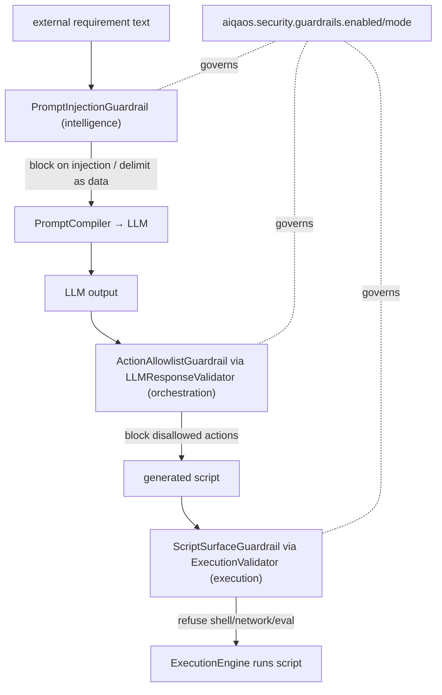

# SEC-3 — Technical Design: Prompt-Injection & Output-Grounding Defence

**Version:** 1.0.0
**Document Type:** Implementation Technical Design
**Document Status:** Implemented — 2026-07-23 (Option A promote-to-core; see [Implementation Outcome](#implementation-outcome))
**Last Updated:** 2026-07-23
**Roadmap item:** [`SEC-3`](./AI-QA-OS-Improvement-Roadmap.md#sec-3--prompt-injection-and-output-grounding-defence) (v2.2.0, frozen) — 🟠 P1 · Effort M · Owner Security + AI/Brain · Phase 1 · v1.4
**Modules:** `ai-qa-os-intelligence` (input) · `ai-qa-os-orchestration` (output) · `ai-qa-os-execution` (script surface) — **no new modules**.
**Depends on:** **MOD-3** (the guardrails home / `Guardrail` seam).

> **Scope discipline.** SEC-3 adds a **security control point at the AI boundary** by filling MOD-3's `Guardrail` seam with three real guards: **input sanitisation & delimiting** (intelligence), **output-grounding + action allow-list** (orchestration), and an **execution surface guard** (execution). It adds **no new modules** and does not build sandboxing/containerisation (infra/SCALE-1) or ML-based detection (future).

---

## 0. Roadmap Verification, the Existing Boundaries, and the Consolidation Problem

### 0.1 What SEC-3 requires

> Agents ingest **external requirement text** into LLM prompts, then act on the output (generating and executing scripts). A malicious requirement can hijack the prompt or steer script generation toward hostile commands. There is `LLMResponseValidator` but **no input sanitisation and no grounding checks**. **Where:** extend `intelligence` (prompt composition) with input-sanitisation & delimiting; strengthen `LLMResponseValidator` in `orchestration` with schema-constrained output + an action allow-list; the `execution` boundary should refuse scripts with shell/network calls outside a defined surface. **Consolidated with the guardrails home in MOD-3.** No new modules.

### 0.2 The three boundaries already exist (SEC-3 strengthens, doesn't invent)

| Boundary | Today | SEC-3 |
|---|---|---|
| **Input** (`intelligence`) | `PromptSecurityGuard.scan()` — a 3-string blocklist (`ignore previous instructions`/`system override`/`jailbreak`), called by `PromptCompiler` | Expand detection + **delimit** untrusted text as data |
| **Output** (`orchestration`) | `LLMResponseValidator` (schema/shape) | Add an **action allow-list** + grounding rejection |
| **Execution** (`execution`) | `ExecutionValidator` | Refuse scripts with **out-of-surface shell/network** calls |

### 0.3 The consolidation problem — and why the contract must move to `core`

MOD-3 put the `Guardrail` contract in **`ai-qa-os-eval`**, and **`eval` depends on `intelligence`** (verified). Nothing depends on `eval`. So `intelligence`/`orchestration`/`execution` **cannot** implement MOD-3's `Guardrail` without a dependency cycle. To *consolidate* (the roadmap's word), the shared contract must live where every module can see it: **`core`**.

This is exactly the **ConfidenceGate** pattern (AI-1 / **ADR-010**): a cross-cutting AI-safety **contract in `core`**, implementations in the modules. SEC-3 re-homes `Guardrail`/`GuardrailVerdict`/`GuardrailContext` from `eval` to `core` (a small, mechanical move — only MOD-3's `NonEmptyOutputGuardrail` references them today).

### 0.4 / Decision for approval — where the `Guardrail` contract lives

| Option | Approach | Trade-off |
|---|---|---|
| **A — Promote `Guardrail` to `core` (recommended)** | Move the 3 contract types `eval → core` (`com.aiqaos.core.guardrail`); update MOD-3's one impl; intelligence/orchestration/execution/eval all implement the **same** seam | True consolidation; mirrors ConfidenceGate/ADR-010; one guardrail model platform-wide. Touches MOD-3 (mechanically) + adds an ADR. |
| **B — Independent per-module guards** | Leave MOD-3's contract in `eval`; implement SEC-3's three controls as standalone classes in each module with **no** shared interface | No MOD-3 change, simplest; but guards are scattered — MOD-3 stays only the *thematic* home, not a shared contract. Not "consolidated." |

**Recommend A** — the roadmap explicitly says "consolidated with the guardrails home in MOD-3," and the platform already has the precedent (ConfidenceGate in `core`, impl in the Brain). A cross-cutting security seam belongs in `core`. This design is written for A; §7 notes B's reductions.

> ✅ **Decision (confirmed 2026-07-23): Option A — promote `Guardrail` to `core`.** The three contract types move `eval → com.aiqaos.core.guardrail`; MOD-3's `NonEmptyOutputGuardrail` is updated; all four modules implement the shared seam. Recorded as ADR-015.

---

## 1. Technical Design

### 1.1 Shared contract (core) — Option A
Move to `com.aiqaos.core.guardrail`: `Guardrail`, `GuardrailVerdict` (ALLOW/BLOCK/SANITIZE), `GuardrailContext` (INPUT/OUTPUT + source). Update `eval`'s `NonEmptyOutputGuardrail` import. Add an **`ExecutionGuardrail` marker** isn't needed — the one `Guardrail` seam covers all three phases.

### 1.2 Input — `PromptInjectionGuardrail` (`intelligence`)
- **Detection**: expand beyond 3 strings — instruction-override patterns (`ignore (previous|above) instructions`, `disregard …`, `system prompt`, `reveal your instructions`, `exfiltrate`, `env vars`, role-hijack markers, delimiter-break attempts). A `GuardrailVerdict.block(...)` on a high-confidence hit.
- **Delimiting**: `sanitizeAndDelimit(untrusted)` wraps external requirement text in explicit delimiters (`⟦UNTRUSTED_REQUIREMENT⟧ … ⟦/UNTRUSTED_REQUIREMENT⟧`) and neutralises attempts to close/forge those delimiters — so the model treats it as **data, not instructions** (`GuardrailVerdict.sanitize(...)`).
- **Wiring**: `PromptSecurityGuard` delegates to the new guardrail (keeps its `scan()` throw-on-egregious behaviour for `PromptCompiler`'s existing call; adds the delimit path).

### 1.3 Output — `ActionAllowlistGuardrail` (`orchestration`)
- An **allow-list** of permitted action/step types; LLM output proposing anything outside it is blocked. Grounding: reject output that echoes injected instructions to the executor or fails schema constraints.
- **Wiring**: invoked from `LLMResponseValidator` (strengthened, not replaced).

### 1.4 Execution — `ScriptSurfaceGuardrail` (`execution`)
- **Deny-list** of out-of-surface calls in generated scripts: process/shell (`child_process`, `exec`, `spawn`, `Runtime.getRuntime`, `ProcessBuilder`, `rm -rf`), network (`curl`, `wget`, `Invoke-WebRequest`, raw sockets), and dynamic-eval (`eval(`) — refuse before execution. *(Deny-list over allow-list: test scripts legitimately use a broad framework API surface; the risk is shell/network/process escape. Strict allow-list is FI-SEC3-A.)*
- **Wiring**: `ExecutionValidator` calls it pre-execution; a violation aborts with an `ExecutionException`.

### 1.5 Enforcement
Config `aiqaos.security.guardrails.enabled` (default **true**) and `aiqaos.security.guardrails.mode` (`enforce` default / `report`). Mirrors SEC-1's toggle; enforce-by-default, report mode logs without blocking for rollout. Blocked attempts logged at WARN with the source/verdict.

### 1.6 What SEC-3 defers
No new modules · no runtime sandbox/container isolation (infra) · no ML/LLM-based injection classifier (pattern + delimiting is the M-scope) · no DB audit table (WARN logs now; observability/GOV-1 wiring later).

---

## 2. Folder Structure

```
ai-qa-os-core/.../core/guardrail/     Guardrail · GuardrailVerdict · GuardrailContext   [M moved from eval]
ai-qa-os-eval/.../eval/guardrail/      NonEmptyOutputGuardrail                            [M import]
ai-qa-os-intelligence/.../component/    PromptInjectionGuardrail                          [N]
                                        PromptSecurityGuard                               [M delegate]
ai-qa-os-orchestration/.../workflow/    guardrail/ActionAllowlistGuardrail                [N]
                                        validation/LLMResponseValidator                   [M strengthen]
ai-qa-os-execution/.../component/        ScriptSurfaceGuardrail                           [N]
                                        ExecutionValidator                                [M wire]
+ config keys (aiqaos.security.guardrails.*) and unit tests in each module.
```

---

## 3. Required Classes (key)

| Class | Type | Responsibility |
|---|---|---|
| `Guardrail` / `GuardrailVerdict` / `GuardrailContext` | Moved `eval`→`core` | The shared seam (Option A) |
| `PromptInjectionGuardrail` | New (intelligence) | Detect injection + delimit untrusted input |
| `ActionAllowlistGuardrail` | New (orchestration) | Allow-list generated actions; grounding reject |
| `ScriptSurfaceGuardrail` | New (execution) | Refuse out-of-surface shell/network/eval |
| `PromptSecurityGuard` / `LLMResponseValidator` / `ExecutionValidator` | Modified | Wire the guards into existing boundaries |

---

## 4. Database Changes

**None.** Blocked attempts are logged (WARN). A durable security-event/audit table is deferred (observability/GOV-1) — FI-SEC3-B.

---

## 5. API Changes

**None.** SEC-3 is internal boundary hardening; no new endpoints or request/response shapes.

---

## 6. Sequence Diagram



---

## 7. Step-by-Step Implementation Plan

1. **Contract move (Option A)** — `Guardrail`/`GuardrailVerdict`/`GuardrailContext` `eval → core.guardrail`; fix `NonEmptyOutputGuardrail` import; rebuild `eval` (MOD-3 tests must stay green).
2. **Input** — `PromptInjectionGuardrail` (intelligence) + refactor `PromptSecurityGuard` to delegate; keep `PromptCompiler`'s contract.
3. **Output** — `ActionAllowlistGuardrail` (orchestration) + wire into `LLMResponseValidator`.
4. **Execution** — `ScriptSurfaceGuardrail` (execution) + wire into `ExecutionValidator`.
5. **Config** — `aiqaos.security.guardrails.enabled` (true) / `mode` (enforce), read where the guards are invoked; WARN logging.
6. **Tests** — per-guard unit tests (injection hits/misses, delimiter neutralisation, action allow/deny, script deny-list hits/safe passes); no Mockito (JDK-25 stubs).
7. **Build & validate** — `mvn -pl ai-qa-os-eval -am test` (contract move) + compile intelligence/orchestration/execution + their tests + reactor build. Report honestly.
8. **Sync docs** — tracker `SEC-3` → Completed; **ADR-015** (Guardrail contract promoted to `core`; the AI-boundary control point).

**Definition of Done:** untrusted input is detected/delimited before the LLM; generated actions are allow-listed; generated scripts with shell/network/eval escape are refused pre-execution; all three implement the shared `core` `Guardrail`; enforcement is configurable (enforce default); tests green; reactor builds.

---

## Implementation Outcome

Implemented 2026-07-23 as **Option A — `Guardrail` promoted to `core`**. Recorded as **ADR-015**.

**Files:**
- **core** — `com.aiqaos.core.guardrail.{Guardrail, GuardrailVerdict, GuardrailContext}` [moved from `eval`]; `eval`'s `NonEmptyOutputGuardrail` import updated.
- **intelligence** — `PromptInjectionGuardrail` [N] (regex injection detection + `sanitizeAndDelimit`); `PromptSecurityGuard` [M] delegates (null-safe fallback + `enabled`/`mode` config); pom [M] + `spring-boot-starter-test`.
- **orchestration** — `guardrail/ActionAllowlistGuardrail` [N] (output-grounding markers); `LLMResponseValidator` [M] runs it pre-parse (null-safe, config-gated).
- **execution** — `ScriptSurfaceGuardrail` [N] (deny-list: process/shell/fs-escape/eval, word-boundary so `evaluate(`/`.exec(` pass); `ExecutionValidator` [M] runs it pre-execution.
- **tests** — `PromptInjectionGuardrailTest`, `ActionAllowlistGuardrailTest`, `ScriptSurfaceGuardrailTest`.

**Config:** `aiqaos.security.guardrails.enabled` (default true) · `aiqaos.security.guardrails.mode` (`enforce` default / `report` = log-only). Guards injected `@Autowired(required=false)` + null-checked so direct-construction tests degrade gracefully.

**Validation (JDK 25 / Maven):**
- **Full reactor `mvn test` → BUILD SUCCESS, all 22 modules.**
- `LLMResponseValidatorTest` **15/15** (output-guard wiring didn't disturb the existing validator); `AutonomousWorkflowIntegrationTest` (56s E2E) green — guards don't break the live prompt→validation→execution flow; eval **24** (contract move intact); orchestration 37/4-skip (MNT-1 quarantine only).
- Deterministic guards → **no live-LLM caveat** this time (unlike AI-1/2/3/PE-1).

**Honest scope note:** detection is **pattern-based and conservative** (high-confidence markers to avoid false positives on legitimate requirements/generated code); the execution guard is a **deny-list** (process/shell/eval escape), not a strict allow-list — a full allow-list once the legitimate test-script surface is catalogued is FI-SEC3-A, and an ML classifier is FI-SEC3-C. `sanitizeAndDelimit` is exposed as the delimiting stage for callers to wrap untrusted requirement text; detection is enforced at the existing `PromptCompiler` call site today.

---

## Appendix — Future Ideas (Outside Current Roadmap)

- **FI-SEC3-A** — Strict allow-list for the execution surface (whitelist framework APIs) once the legitimate test-script surface is catalogued.
- **FI-SEC3-B** — Durable security-event audit (blocked attempts) via observability/GOV-1.
- **FI-SEC3-C** — ML/LLM-based injection classifier to complement the pattern set.

---

## Compliance Checklist

| Rule | Status |
|---|---|
| Roadmap not modified | ✅ SEC-3 metadata untouched |
| No new modules | ✅ intelligence/orchestration/execution + core (contract move) |
| Dependency rule | ✅ shared contract in `core` (nothing depends on `eval`); mirrors ADR-010 |
| MOD-3 consolidation honoured | ✅ single `Guardrail` seam filled by SEC-3's guards |
| Out-of-scope deferred | ✅ sandboxing / ML detection / audit table → FI |
| ADR discipline | ✅ ADR-015 to be recorded |

---

## Document Completion Status

**Status:** Implemented — 2026-07-23 (Option A — promote `Guardrail` to `core`). See [Implementation Outcome](#implementation-outcome).
**Version:** 1.0.0
**Implements:** `SEC-3` (roadmap v2.2.0, frozen)
