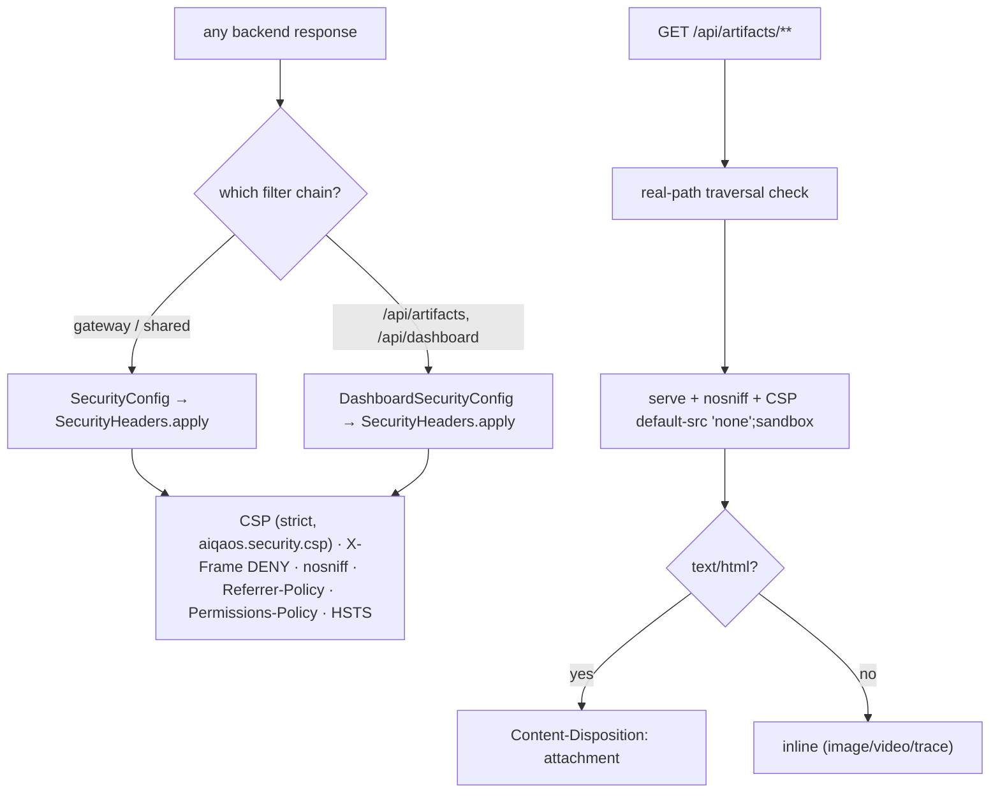

# SEC-4 — Technical Design: Content Security Policy & Transport Hardening

**Version:** 1.0.0
**Document Type:** Implementation Technical Design
**Document Status:** Implemented — 2026-07-23 (§0.3a strict/tunable, §0.3b attachment; see [Implementation Outcome](#implementation-outcome))
**Last Updated:** 2026-07-23
**Roadmap item:** [`SEC-4`](./AI-QA-OS-Improvement-Roadmap.md#sec-4--content-security-policy-and-transport-hardening) (v2.2.0, frozen) — 🟠 P1 · Effort S · Owner Security · Phase 1 · v1.4
**Modules:** `ai-qa-os-security` (`SecurityConfig`) · `ai-qa-os-dashboard` (`DashboardSecurityConfig`, `ArtifactController`).
**Depends on:** SEC-1 (the security chains this hardens).

> **Scope discipline.** SEC-4 is **configuration-level, no structural change**: replace the effectively-absent CSP + disabled frame-options with hardened response headers on **both** filter chains, and pair it with defensive artifact serving (path-traversal + anti-XSS headers) on `/api/artifacts/**`. Out of scope: CORS policy rework, new endpoints, the React SPA (served separately).

---

## 0. Roadmap Verification & Grounded Findings

### 0.1 What SEC-4 requires

> The current CSP is `default-src * 'unsafe-inline' 'unsafe-eval' data: blob:` and frame options are disabled — effectively no CSP. Combined with artifact endpoints returning user-influenced file paths, this is an XSS and clickjacking surface. **Where:** `SecurityConfig` CSP; artifact path handling in `ArtifactController`. Config-level; pair with path-traversal validation on `/api/artifacts/**`.

### 0.2 Verified facts (read during design)

| Fact | Detail |
|---|---|
| Permissive CSP | `SecurityConfig.applyCommonHardening` sets `contentSecurityPolicy("default-src * 'unsafe-inline' 'unsafe-eval' data: blob:")` and `frameOptions(disable)`. HSTS is already correct (1yr, includeSubDomains). |
| **Two chains** | The dashboard has a **`@Order(1)`** chain (`DashboardSecurityConfig.dashboardFilterChain`) matching `/api/artifacts/**`, `/api/dashboard/**`, `/swagger-ui/**` — and it sets **no `.headers(...)` at all**. So the artifact surface is *not even covered* by the shared chain's (permissive) CSP. **Both chains must be hardened.** |
| Artifact traversal | `ArtifactController.serveArtifact` already rejects `".."` and checks `normalize().startsWith(base)` — decent, but no symlink/real-path check. |
| Artifact XSS | HTML reports are served `Content-Disposition: inline` as `text/html` from the app origin — a stored-XSS vector if report content echoes user data. Playwright HTML reports are **interactive JS apps** (they need their own scripts to render). |
| Serving scope | Backend serves JSON + Swagger UI + artifacts. The React SPA is a **separate** Vite host — a strict backend CSP does not affect it. |

### 0.3 / Decisions for approval (two)

SEC-4 has two genuine tradeoffs — see §0.3a and §0.3b; both are asked at approval.

**§0.3a — Global CSP posture** (the actual "no `unsafe-inline`/`unsafe-eval`" fix). The only backend-served HTML that runs scripts is **Swagger UI** (springdoc uses an inline init script).

| Option | CSP | Trade-off |
|---|---|---|
| **A — Strict (recommended)** | `script-src 'self'` (no inline/eval), `style-src 'self' 'unsafe-inline'`, `frame-ancestors 'none'`, `object-src 'none'`, `base-uri 'self'`, `default-src 'self'` | Removes the real XSS vector. Swagger UI's inline script may need tuning — mitigated by making the CSP a **configurable property** (`aiqaos.security.csp`) so ops can relax `/swagger-ui/**` without a rebuild. |
| **B — Pragmatic** | keep `script-src 'self' 'unsafe-inline'`; drop only `'unsafe-eval'` + wildcard; add `frame-ancestors 'none'` | Zero tooling breakage; fixes clickjacking + eval + wildcard — but leaves inline scripts allowed (weaker XSS posture). |

**§0.3b — HTML artifact serving** (the roadmap's emphasised surface). Reports need JS, so "sandbox it and still render" isn't viable.

| Option | HTML artifacts | Trade-off |
|---|---|---|
| **A — Force download (recommended)** | `Content-Disposition: attachment` for `text/html` (images/video/traces stay `inline`) | Fully removes same-origin HTML XSS — a downloaded report opens from `file://`, not the app origin, so it can't steal app cookies/tokens. Changes UX: reports download instead of rendering in a tab. |
| **B — Hardened inline** | keep HTML `inline` + `nosniff` + a per-response CSP that still permits the report's own scripts | Preserves in-app viewing, but because the report needs `script-src`, residual XSS risk remains if report content is attacker-influenced. |

**Recommend A + A** — SEC-4's purpose is to remove the XSS/clickjacking surface; strict CSP (tunable via property) + download-only HTML artifacts achieve it with no residual script-execution risk. Images/videos/traces keep inline viewing.

> ✅ **Decisions (confirmed 2026-07-23): §0.3a = A (strict CSP, tunable via `aiqaos.security.csp`); §0.3b = A (HTML artifacts served as `attachment`, media stays inline).**

---

## 1. Technical Design

### 1.1 Shared hardened headers
- New `SecurityHeaders.apply(HttpSecurity http, String csp)` helper in `ai-qa-os-security` sets: CSP (from `aiqaos.security.csp`, strict default per §0.3a-A), `frameOptions(deny)` (legacy `X-Frame-Options: DENY` alongside `frame-ancestors 'none'`), `X-Content-Type-Options: nosniff` (default on), `Referrer-Policy: no-referrer`, `Permissions-Policy: geolocation=(), microphone=(), camera=()`, and the existing HSTS.
- **`SecurityConfig.applyCommonHardening`** calls it (covers gateway + non-dashboard-matched paths) — replacing the permissive CSP block.
- **`DashboardSecurityConfig.dashboardFilterChain`** calls it (covers `/api/artifacts/**` + dashboard API — the surface currently unhardened).

### 1.2 Artifact serving (`ArtifactController.serveArtifact`)
- **Path-traversal (strengthened):** keep the `".."` + `startsWith(base)` checks; add a **real-path** check (`toRealPath()` after the exists check) so a symlink inside the base cannot escape it.
- **Anti-XSS response headers:** on every served file, add `X-Content-Type-Options: nosniff` and `Content-Security-Policy: default-src 'none'; sandbox` (a served artifact never needs to load app resources).
- **HTML (per §0.3b-A):** when the content type is `text/html`, serve `Content-Disposition: attachment`; all other types keep `inline`.

### 1.3 Configuration
`aiqaos.security.csp` (strict default string) — lets ops tune CSP per environment without code change. `aiqaos.security.guardrails.*` (SEC-3) is unrelated. No new enable flag (headers apply whenever a chain is active).

---

## 2. Folder Structure

```
ai-qa-os-security/.../config/   SecurityHeaders.java        [N] shared header policy
                                SecurityConfig.java         [M] call SecurityHeaders; drop permissive CSP
ai-qa-os-dashboard/.../config/  DashboardSecurityConfig.java[M] add .headers via SecurityHeaders
ai-qa-os-dashboard/.../controller/ ArtifactController.java  [M] real-path check + nosniff/CSP + HTML attachment
+ security unit test for the CSP/header policy.
```

---

## 3. Required Classes (key)

| Class | Type | Responsibility |
|---|---|---|
| `SecurityHeaders` | New | One place defining the hardened header policy (CSP, frame, referrer, permissions) |
| `SecurityConfig` | Modified | Use `SecurityHeaders`; remove `default-src *` CSP |
| `DashboardSecurityConfig` | Modified | Apply the same headers to the `@Order(1)` chain (artifact surface) |
| `ArtifactController` | Modified | Real-path traversal check + anti-XSS headers + HTML-as-attachment |

---

## 4. Database Changes

**None.**

---

## 5. API Changes

**No new endpoints or shapes.** Behavioural change only: hardened response headers everywhere; `/api/artifacts/**` HTML now downloads instead of rendering (per §0.3b-A). Metadata endpoints unchanged.

---

## 6. Sequence Diagram



---

## 7. Step-by-Step Implementation Plan

1. **`SecurityHeaders`** helper (security module): the hardened header policy, CSP taken as a parameter.
2. **`SecurityConfig`** — replace the permissive CSP block in `applyCommonHardening` with `SecurityHeaders.apply(http, csp)`; inject `aiqaos.security.csp` (strict default).
3. **`DashboardSecurityConfig`** — add `SecurityHeaders.apply(...)` to the `@Order(1)` chain (needs the security module on the dashboard classpath — verify; else inline the same policy).
4. **`ArtifactController`** — add the real-path check + `nosniff`/`sandbox` CSP headers + HTML `attachment` disposition.
5. **Test** — a security unit/slice test asserting the hardened CSP + `X-Frame-Options: DENY` + `nosniff` appear and `unsafe-inline`/`unsafe-eval`/`*` are gone; an `ArtifactController` test for traversal rejection + HTML attachment.
6. **Build & validate** — reactor build + security/dashboard tests; confirm SEC-1's auth tests still pass. Report honestly (Swagger UI live-render is not verifiable here — the CSP is a tunable property).
7. **Sync docs** — tracker `SEC-4` → Completed; **ADR-016** (hardened security-header policy centralised + artifact anti-XSS).

**Definition of Done:** both chains emit a strict, configurable CSP + `X-Frame-Options: DENY` + nosniff + Referrer/Permissions policies; the `default-src *` / `unsafe-*` CSP and `frameOptions.disable()` are gone; `/api/artifacts/**` resists symlink/real-path traversal and serves HTML as a non-rendering download; SEC-1 auth behaviour unchanged; tests green.

---

## Implementation Outcome

Implemented 2026-07-23 (§0.3a = **A strict/tunable CSP**, §0.3b = **A HTML-as-attachment**). Recorded as **ADR-016**.

**Files:**
- **security** — `SecurityHeaders` [N] (`STRICT_CSP` + `apply(http, csp)`); `SecurityConfig` [M] — `applyCommonHardening` now calls `SecurityHeaders.apply(http, csp)`, injects `aiqaos.security.csp` (blank→strict), permissive CSP + `frameOptions.disable()` removed; javadoc updated.
- **dashboard** — `DashboardSecurityConfig` [M] — the `@Order(1)` chain (serves `/api/artifacts/**`) now calls `SecurityHeaders.apply(...)`, closing its previously header-less surface; `ArtifactController` [M] — real-path/symlink check + `X-Content-Type-Options: nosniff` + `Content-Security-Policy: default-src 'none'; sandbox` + `text/html` served as `attachment` (media stays `inline`).
- **test** — `SecurityHeadersTest` (2): strict CSP keeps the locked-down directives and drops `'unsafe-eval'` / `default-src *` / inline scripts.

**Validation (JDK 25 / Maven):**
- **Full reactor `mvn test` → BUILD SUCCESS, all 22 modules** (incl. Dashboard, which boots the new `@Order(1)` headers).
- `SecurityHeadersTest` 2/2; SEC-1's 9 security tests intact (auth/deny-by-default unchanged).
- Deterministic header policy → validated by test, not a browser.

**Honest scope note:** **Swagger UI's live rendering under the strict `script-src 'self'` is not verifiable here** (no running app) — which is exactly why the CSP is a tunable property (`aiqaos.security.csp`); if springdoc's inline script trips it in a deployment, ops relax the property (or FI-SEC4-B adds a nonce). The dashboard CORS remains permissive (`allowedOriginPatterns("*")` + credentials) — a real weakness deferred to **FI-SEC4-A** (env-specific, outside SEC-4's "Where"). HTML report links now download rather than render in-tab (the accepted §0.3b-A trade-off).

---

## Appendix — Future Ideas (Outside Current Roadmap)

- **FI-SEC4-A** — Tighten `DashboardSecurityConfig` CORS (currently `allowedOriginPatterns("*")` **with** `allowCredentials(true)`) to an explicit origin allow-list. Real weakness, but env-specific and outside SEC-4's "Where"; do when prod origins are fixed.
- **FI-SEC4-B** — Per-nonce CSP for Swagger UI so it can keep strict `script-src` without a relaxed property.
- **FI-SEC4-C** — Serve artifacts from a separate cookieless origin/subdomain for full isolation.

---

## Compliance Checklist

| Rule | Status |
|---|---|
| Roadmap not modified | ✅ SEC-4 metadata untouched |
| No structural change / new modules | ✅ config-level in security + dashboard |
| Both filter chains covered | ✅ shared + dashboard `@Order(1)` (the artifact surface) |
| Paired path-traversal validation | ✅ real-path check added on `/api/artifacts/**` |
| SEC-1 behaviour preserved | ✅ auth/deny-by-default untouched; only headers change |
| ADR discipline | ✅ ADR-016 to be recorded |

---

## Document Completion Status

**Status:** Implemented — 2026-07-23 (§0.3a = A strict/tunable, §0.3b = A attachment). See [Implementation Outcome](#implementation-outcome).
**Version:** 1.0.0
**Implements:** `SEC-4` (roadmap v2.2.0, frozen)
