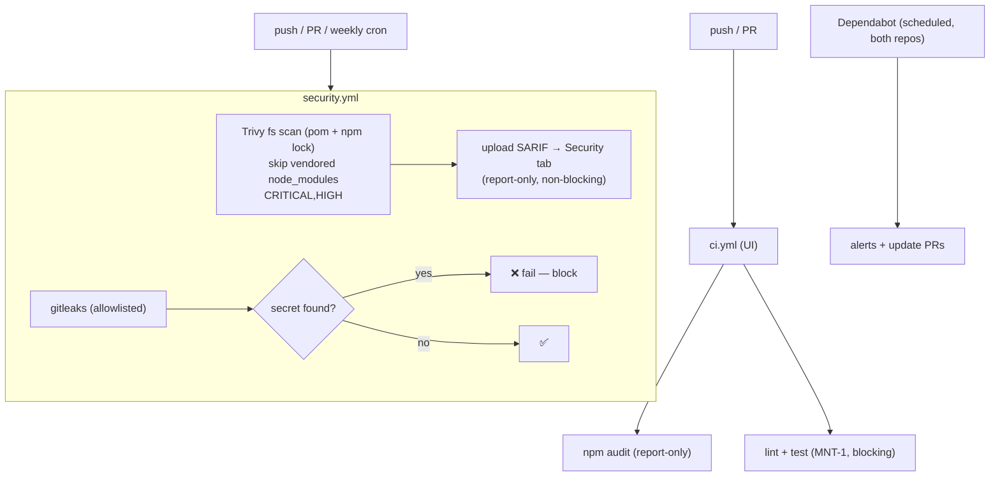

# SEC-5 — Technical Design: Supply-Chain & Dependency Scanning in CI

**Version:** 1.0.0
**Document Type:** Implementation Technical Design
**Document Status:** Draft — Awaiting Approval (no code until approved)
**Last Updated:** 2026-07-22
**Roadmap item:** [`SEC-5`](./AI-QA-OS-Improvement-Roadmap.md) (v2.2.0, frozen) — 🟠 P1 · Effort S · Owner Security / DevOps · Phase 0 · v1.3
**Module:** CI (`.github`) — Core repo + UI repo
**Depends on:** [ORG-1](./AI-QA-OS-Improvement-Roadmap.md) (remove committed `node_modules/`) — **not yet done**; see [§0.3](#03-the-org-1-coupling).

> **Scope discipline.** Implements **only** SEC-5: add dependency-CVE scanning (Maven + npm) and secret scanning to CI, plus always-on Dependabot. It does **not** upgrade dependencies, remove the vendored `node_modules/` (that is ORG-1), rotate historical secrets, or change product code.

---

## 0. Roadmap Verification & Current State

### 0.1 What SEC-5 requires (from the finalized roadmap)

> CI runs Trivy against the built image only. It does not scan Java or npm dependencies for known CVEs, and does not scan for committed secrets. The committed `node_modules/` in `ai-qa-os-execution` is an unscanned dependency tree shipped inside a JAR… Add OWASP Dependency-Check (or Snyk/`dependabot`) for Maven, `npm audit`/Trivy-fs for the UI, and a secret-scanning step (gitleaks/trufflehog).

### 0.2 Verified current state

- **Core CI** — `deploy.yml`: `build-and-test` (MNT-1) + `docker-scan-deploy` (Trivy **image** scan only, MNT-2). No dependency-CVE or secret scanning.
- **UI CI** — `ci.yml`: lint + test (MNT-1). No `npm audit`, no secret scan.
- **Neither repo** has `dependabot.yml`.
- **Baseline findings (measured during design):**
  - **UI `npm audit`: 8 vulnerabilities (1 critical, 5 high, 2 moderate)** — all in the **dev toolchain** (esbuild → vite → vite-node → vitest); the fix is a breaking `vite@8` upgrade. Not production-runtime.
  - **Vendored `node_modules/` present** in `ai-qa-os-execution/.../scripts/` (Playwright, typescript, …) — an unscanned tree (ORG-1's target).
  - Java deps (Spring Boot 3.3.0, etc.) not yet CVE-scanned; likely some HIGH/CRITICAL exist.

### 0.3 The ORG-1 coupling

SEC-5 lists **ORG-1** as a dependency because the vendored `node_modules/` is exactly the "unscanned dependency tree" SEC-5 targets. Two ways to proceed:

| | Do ORG-1 first (cleanest) | Do SEC-5 now (this design) |
|---|---|---|
| Vendored `node_modules/` | removed → nothing to skip | still present → **skip it** in the fs scan, documented |
| Result | scans are clean by construction | SEC-5 works now; the skip becomes a no-op once ORG-1 lands |

This design proceeds **now** and `--skip-dirs` the vendored path, so SEC-5 does not block on ORG-1. **Recommendation:** schedule ORG-1 soon after, then drop the skip.

### 0.4 The blocking-policy decision (user's call — see closing question)

Turning scanners on **blocking** would make CI **immediately red** (8 npm vulns incl. 1 critical, plus likely Java CVEs). Same failure mode as MNT-1's red tests. Options:

| Option | Dependency CVEs | Secret scan | Effect |
|---|---|---|---|
| **A — Visibility-first (recommended)** | **report-only** (upload to Security tab, non-blocking) | **blocking** | Findings visible immediately; no wall of red; ratchet deps to blocking after triage. Secrets (unambiguous) block. |
| **B — All blocking** | blocking (CRITICAL/HIGH) | blocking | CI red today until every CVE is fixed/waived — churny, likely stalls Phase 0 |
| **C — All report-only** | report-only | report-only | Pure visibility, no gate — weakest |

This design is written for **Option A** and notes where B/C diverge. Rationale mirrors MNT-1: a *real* gate that doesn't self-defeat on day one, with findings surfaced (never silently dropped).

> ✅ **Decision (confirmed 2026-07-22): Option A — Visibility-first.** Dependency CVEs are report-only (SARIF → Security tab); secret scanning blocks. Ratcheting deps to blocking is tracked as FI-SEC5-A.

---

## 1. Technical Design

### 1.1 Design decision

Four additions across the two repos, no product-code change:

1. **Dependabot** (`.github/dependabot.yml` in **both** repos) — native, always-on: weekly dependency-update PRs + GitHub Dependabot alerts. Maven ecosystem (Core), npm (UI). Zero CI cost, non-blocking by nature.
2. **Core dependency-CVE scan** — a new `security.yml` workflow running **Trivy filesystem scan** (`trivy fs`) over the repo (reads `pom.xml` + any `package-lock.json`), `--skip-dirs` the vendored `node_modules/`, severity `CRITICAL,HIGH`, **report-only** (exit 0), **SARIF uploaded to the GitHub Security tab**.
3. **UI dependency-CVE scan** — add an `npm audit` step to `ci.yml`, **report-only** initially (given the 8 known dev-tool vulns).
4. **Secret scan** — **gitleaks** in `security.yml`, **blocking**, with a `.gitleaks.toml` allowlist for the known **test-only** values (the labeled test JWT keys, the base64 dummies in `secrets.yaml`).

### 1.2 Tool choices & rationale

- **Trivy-fs for Maven + npm** (not OWASP Dependency-Check) — Trivy is already trusted in this pipeline (MNT-2 image scan), scans both ecosystems, is fast, needs no NVD API key, and emits SARIF. **OWASP Dependency-Check** (roadmap-named) is a valid alternative but heavier (NVD data download / API key) — noted under Future Ideas. The roadmap explicitly allows "Snyk/dependabot" alternatives.
- **Dependabot** — complements the CI scan with continuous, always-on alerts + fix PRs, independent of pushes.
- **gitleaks** — lightweight, config-driven allowlist, SARIF output; guards against re-committing the secrets SEC-2 just externalized.

### 1.3 Secret scanning & git history

gitleaks scans **history** by default. The old real-looking JWT secret (`9a7263…`) and `password: password` **still exist in prior commits** (SEC-2 removed them from the working tree, not from history). To keep SEC-5's gate meaningful without failing on the past:

- **Allowlist current test-only values** in `.gitleaks.toml` (the labeled non-prod signing keys, k8s base64 dummies).
- **Scan scope:** on PRs, scan the **diff** (new secrets only); on push, scan the tree. Known historical fingerprints go in `.gitleaksignore`.
- **Operational note (out of SEC-5 scope):** the historical `9a7263…` secret should be treated as **compromised and rotated** — SEC-2 already stopped using it; purging git history is a separate action.

### 1.4 What SEC-5 is not

No dependency upgrades (Dependabot proposes them; merging is separate), no `node_modules/` removal (ORG-1), no history rewrite, no license/SBOM policy (Future Ideas).

---

## 2. Folder Structure

`[N]` new, `[M]` modified. CI/config only.

```
AI-QA-OS-Core/
└── .github/
    ├── dependabot.yml                         [N] Maven ecosystem — weekly update PRs + alerts
    ├── gitleaks.toml (or .gitleaks.toml)      [N] allowlist for test-only values
    └── workflows/
        ├── security.yml                       [N] Trivy-fs (deps, report-only + SARIF) + gitleaks (secrets, blocking)
        └── deploy.yml                          [-] unchanged (image scan stays in MNT-2)

ai-qa-os-dashboard-ui/
└── .github/
    ├── dependabot.yml                         [N] npm ecosystem
    └── workflows/
        └── ci.yml                              [M] add `npm audit` step (report-only)
```

---

## 3. Required Classes

**None.** SEC-5 is CI + config only.

| Artifact | Type | Purpose |
|---|---|---|
| `AI-QA-OS-Core/.github/dependabot.yml` | New | Maven dependency alerts + weekly PRs |
| `ai-qa-os-dashboard-ui/.github/dependabot.yml` | New | npm dependency alerts + weekly PRs |
| `AI-QA-OS-Core/.github/workflows/security.yml` | New | Trivy-fs dependency scan (report-only, SARIF) + gitleaks secret scan (blocking); push/PR + weekly cron; `security-events: write` for SARIF upload |
| `AI-QA-OS-Core/.github/gitleaks.toml` | New | Allowlist for labeled test-only secrets & dummies |
| `ai-qa-os-dashboard-ui/.github/workflows/ci.yml` | Modified | Add `npm audit` step (report-only) |

---

## 4. Database Changes

**None.**

---

## 5. API Changes

**None.** No runtime/service change; CI-only. (Operational: findings appear in the GitHub Security tab; secret hits block the PR/push.)

---

## 6. Sequence Diagram



---

## 7. Step-by-Step Implementation Plan

1. **Verify (read-only).** Confirm current workflows (done — §0.2), the vendored `node_modules/` path to skip, and the exact test-only secret strings to allowlist (the labeled keys from SEC-2 + k8s base64 dummies).
2. **Dependabot.** Add `dependabot.yml` to both repos (Maven / npm, weekly).
3. **gitleaks allowlist.** Add `AI-QA-OS-Core/.github/gitleaks.toml` allowlisting the test-only signing keys and `secrets.yaml` dummies.
4. **Core `security.yml`.** New workflow, triggers push + PR (main) + weekly cron; `permissions: security-events: write`. Job 1: Trivy-fs (`scan-type: fs`, `--skip-dirs` vendored path, `CRITICAL,HIGH`, **`exit-code: 0`**, SARIF format) → `github/codeql-action/upload-sarif`. Job 2: gitleaks (**blocking**, using the allowlist).
5. **UI `ci.yml`.** Add an `npm audit --audit-level=high` step that is **report-only** (does not fail the job) initially.
6. **Validate.** Parse/lint the new workflow YAML (as in MNT-2). Optionally run `npm audit` locally (baseline captured: 8 vulns) and confirm the allowlist regexes match the test-only strings. Report honestly — Trivy/gitleaks Actions run only on the real runner.
7. **Sync governance docs.** Set `SEC-5` status in the tracker; release mapping unchanged (v1.3). Note the ORG-1 follow-up (drop `--skip-dirs`).

**Definition of Done:** every push/PR runs dependency-CVE scanning (Maven + npm, findings in the Security tab) and **blocking** secret scanning (allowlisted for test-only values); Dependabot is enabled in both repos; no product code changed; the vendored tree is skipped (pending ORG-1); tracker updated. Ratcheting dependency scans to **blocking** is a tracked follow-up once the CVE backlog is triaged.

---

## Implementation Outcome

Implemented 2026-07-22 (Option A — Visibility-first). CI + config only; no product code, no dependency upgrades.

**Files created/changed:**
- `AI-QA-OS-Core/.github/dependabot.yml` [N] — Maven + github-actions, weekly.
- `ai-qa-os-dashboard-ui/.github/dependabot.yml` [N] — npm + github-actions, weekly.
- `AI-QA-OS-Core/.github/gitleaks.toml` [N] — allowlist: `application-test.yml`, `secrets.yaml`, `.env.example`, `**/node_modules/**`, and the two labeled test-only keys (the SEC-2 signing phrase + the `JwtTokenProviderTest` base64 key).
- `AI-QA-OS-Core/.github/workflows/security.yml` [N] — `dependency-scan` (Trivy-fs, `CRITICAL,HIGH`, `exit-code: 0` report-only, SARIF → Security tab, vendored `node_modules` skipped) + `secret-scan` (gitleaks via Docker, `--no-git`, **blocking**); triggers push/PR/weekly-cron; `security-events: write`.
- `ai-qa-os-dashboard-ui/.github/workflows/ci.yml` [M] — added `npm audit --audit-level=high || true` (report-only).

**Decisions/deltas during implementation:**
1. **Second test key found** — `JwtTokenProviderTest.java` holds a base64 test key that gitleaks' generic rules could flag; added it to the allowlist to prevent a false-positive block.
2. **gitleaks via Docker CLI, not the marketplace action** — `gitleaks-action@v2` requires a license key for GitHub *organizations*; the `ghcr.io/gitleaks/gitleaks` image avoids that and works for org or personal repos.
3. **`--no-git` scan** — gates the current working tree (not history), so it won't fail on the pre-SEC-2 secrets still in commit history (rotation/purge tracked as FI-SEC5-C).

**Validation (JDK 25 / Node; no Docker locally):**
- All four YAML files **parse clean**; `security.yml` jobs `dependency-scan` + `secret-scan`, permissions `{contents: read, security-events: write}`.
- Allowlist verified: regex matches the test-only key; path regexes match `application-test.yml`, `secrets.yaml`, `.env.example`; confirmed the test-only key occurs **only** in allowlisted files.
- **Not executable here:** the Trivy/gitleaks GitHub Actions, SARIF upload, and a local gitleaks run (Docker unavailable). These run only on the CI runner.

**Sequencing note:** SEC-5 skips the vendored `node_modules/` pending **ORG-1**; once ORG-1 removes it, drop the `skip-dirs` line.

---

## Appendix — Future Ideas (Outside Current Roadmap)

Not implemented; do not action without approval.

- **FI-SEC5-A — Ratchet dependency scans to blocking** once the current CVE backlog (npm dev-tool chain, Java deps) is triaged/waived.
- **FI-SEC5-B — OWASP Dependency-Check** as an additional/alternative Maven scanner (roadmap-named; heavier, NVD key).
- **FI-SEC5-C — Purge & rotate historical secrets** (`9a7263…`, `password`) from git history (BFG/filter-repo) and rotate the keys.
- **FI-SEC5-D — SBOM + license policy** (Trivy/Syft SBOM, disallowed-license gate).
- **FI-SEC5-E — Pin scanner action versions** (`trivy-action`, gitleaks) to release tags for reproducibility (ties to FI-MNT2-D).

---

## Compliance Checklist

| Rule | Status |
|---|---|
| Roadmap not modified | ✅ SEC-5 metadata untouched |
| No new roadmap items/categories/modules | ✅ CI + config only |
| No product/architecture change | ✅ no code edits; no dep upgrades |
| ORG-1 dependency handled | ✅ vendored tree skipped, documented; ORG-1 recommended next |
| Findings surfaced, not hidden | ✅ SARIF to Security tab; secrets blocking; no silent skips |
| Out-of-scope items untouched | ✅ upgrades/history-purge/SBOM deferred |

---

## Document Completion Status

**Status:** Implemented — 2026-07-22 (Option A — Visibility-first; see [Implementation Outcome](#implementation-outcome))
**Version:** 1.0.0
**Implements:** `SEC-5` (roadmap v2.2.0, frozen)
**Next step:** On approval + option choice, execute [§7](#7-step-by-step-implementation-plan) from Step 1. No code until approved.
