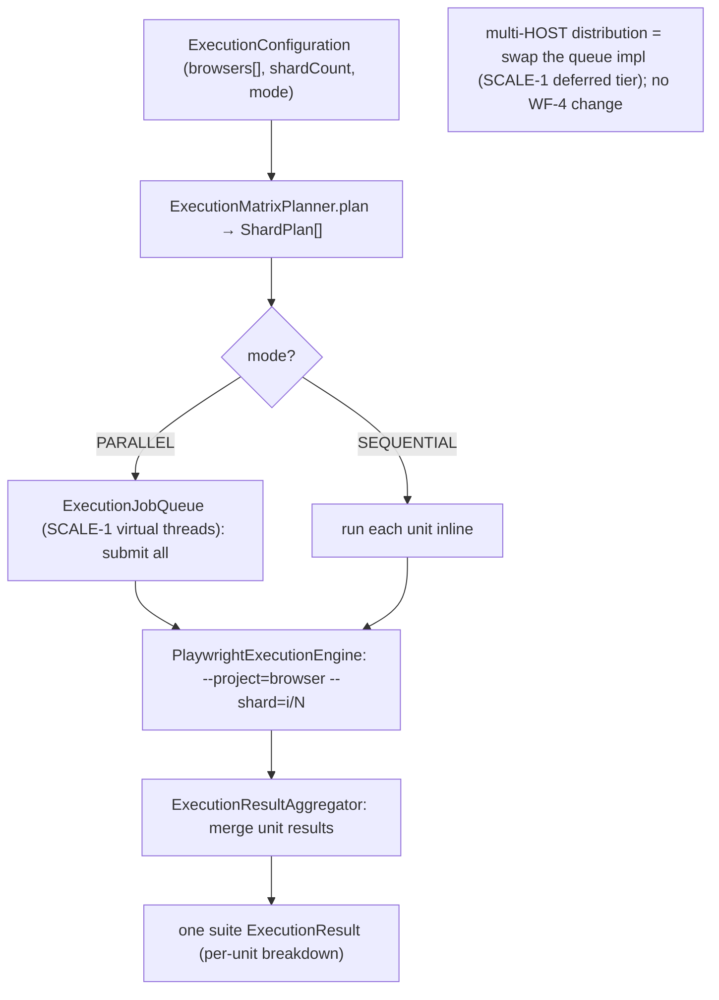

# WF-4 — Technical Design: Sharded / Parallel Cross-Browser Execution

**Version:** 1.0.0
**Document Type:** Implementation Technical Design
**Document Status:** Implemented — 2026-07-28 (single-host matrix; see [Implementation Outcome](#implementation-outcome))
**Last Updated:** 2026-07-23
**Roadmap item:** [`WF-4`](./AI-QA-OS-Improvement-Roadmap.md#wf-4--sharded--parallel-cross-browser-execution) (v2.2.0, frozen) — 🟡 P2 · Effort M · Owner Execution · Phase 2 · v1.5
**Module:** `ai-qa-os-execution` (dispatcher + scheduler + engine).
**Depends on:** **SCALE-1** (queue-fed workers) — *In Progress*; its **virtual-thread `InProcessExecutionJobQueue`** already gives single-host parallelism.

> **Scope discipline.** WF-4 turns single-browser, sequential execution into a **shard × browser matrix** fanned out in parallel. Playwright shards natively (`--shard=i/N`); WF-4 orchestrates the matrix and aggregates results. Single-host parallel is buildable now (SCALE-1's virtual-thread queue); **multi-host distribution rides SCALE-1's deferred distributed tier**.

---

## 0. Roadmap Verification, Current State, and Reality

### 0.1 What WF-4 requires

> Execution is sequential and single-host. Real suites need parallel, sharded runs across browsers and machines. **Playwright supports sharding natively; the platform does not orchestrate it.** **Where:** `ai-qa-os-execution` dispatcher + scheduler, coordinated by SCALE-1.

### 0.2 Verified current state

| Fact | Detail |
|---|---|
| Config is single/sequential | `ExecutionConfiguration`: one `BrowserType browser` (CHROME), `ExecutionMode` (`SEQUENTIAL` \| `PARALLEL` — PARALLEL already exists but unused), no shard/matrix fields. |
| Engine already per-browser | `PlaywrightExecutionEngine` shells out to `run-playwright.ps1` via `ProcessBuilder` and already maps the browser to Playwright's `--project` flag — it just needs `--shard=i/N` added. |
| Orchestration hooks exist | `ExecutionScheduler`, `ExecutionDispatcher`, `ExecutionPlanner` are present; SCALE-1's `InProcessExecutionJobQueue` now runs on **virtual threads** (parallel dispatch is free). |
| Browsers | `BrowserType`: CHROME, EDGE, FIREFOX, SAFARI. |

### 0.3 Environment reality

- **Buildable + validatable here:** the **fan-out planning** (a run → shard × browser units) and **result aggregation** — pure logic, unit-testable with a stub runner; plus the `--shard`/`--project` argument construction.
- **Deferred (needs infra):** actually running Playwright (no Node/Playwright here) and **multi-host** distribution (SCALE-1's containerised worker tier). Single-host parallel *is* exercised via the virtual-thread queue.

### 0.4 / Decision for approval — scope, given SCALE-1's distributed tier is deferred

| Option | Approach | Trade-off |
|---|---|---|
| **A — Single-host shard×browser matrix now (recommended)** | Extend config (browser matrix + shard count); a scheduler fans a run into `shard i/N × browser` units, dispatches them through SCALE-1's virtual-thread queue (parallel) or sequentially; the engine passes `--shard`/`--project`; results aggregate into one suite outcome. | Real parallel/sharded cross-browser execution on one host today; validatable fan-out + aggregation. Multi-host is the SCALE-1 increment (a swap of the queue impl — no WF-4 rework). |
| **B — Defer WF-4 until SCALE-1's distributed tier** | Wait for containerised workers before orchestrating shards. | Nothing ships; but the roadmap's own value ("parallel across browsers") is achievable single-host now. |

**Recommend A** — Playwright native sharding + the virtual-thread pool deliver WF-4's headline (parallel, sharded, cross-browser) on a single host now; cross-*host* distribution later is a queue-impl swap behind the same fan-out, not a WF-4 change. Sharding uses Playwright's native `--shard` as the roadmap directs.

> ✅ **Decision (confirmed 2026-07-23): Option A — single-host shard×browser matrix now** (parallel over SCALE-1's virtual-thread queue); multi-host distribution deferred to SCALE-1's tier. Recorded as an ADR (number verified at implement).

---

## 1. Technical Design (Option A)

### 1.1 Config (`ExecutionConfiguration`)
- Add `List<BrowserType> browsers` (the matrix; defaults to `[browser]` for back-compat) and `int shardCount` (default `1`). `executionMode` (`PARALLEL`/`SEQUENTIAL`) governs dispatch. Back-compat: an unset matrix + `shardCount=1` = today's single run.

### 1.2 Fan-out planning (`execution.scheduler`)
- **`ShardPlan`** — an immutable value: `browser`, `shardIndex` (1-based), `shardCount`.
- **`ExecutionMatrixPlanner`** — `plan(config)` → `List<ShardPlan>` = every `browser × shardIndex` in the matrix (e.g. 3 browsers × 2 shards = 6 units). Pure, unit-testable.

### 1.3 Dispatch + aggregate (`ExecutionScheduler`)
- **`ShardedExecutionScheduler`** — for each `ShardPlan`, build an execution unit and run it through the resolved runner: in `PARALLEL` via SCALE-1's `ExecutionJobQueue` (submit-all then await-all — virtual threads); in `SEQUENTIAL` inline. Collect the per-unit `ExecutionResult`s.
- **`ExecutionResultAggregator`** — merge the unit results into one suite `ExecutionResult`: success = all-succeeded; union artifacts/screenshots; sum durations/counts; label per-unit results by `browser`+`shard`. Pure, unit-testable.

### 1.4 Engine (`PlaywrightExecutionEngine`)
- Accept the `ShardPlan` for a unit and pass `--project=<browser>` (existing) + **`--shard=<i>/<N>`** to `run-playwright.ps1` (extend its positional args). No-op when `shardCount=1` (omit `--shard`).

### 1.5 What WF-4 defers
Live Playwright execution (no Node here) · **multi-host** shard distribution (SCALE-1 distributed tier) · dynamic shard sizing / test-impact-aware sharding (WF-3 synergy → FI).

---

## 2. Folder Structure

```
ai-qa-os-execution/.../engine/ExecutionConfiguration.java     [M] + browsers matrix + shardCount
ai-qa-os-execution/.../engine/PlaywrightExecutionEngine.java  [M] + --shard arg
ai-qa-os-execution/.../scheduler/ShardPlan.java               [N]
ai-qa-os-execution/.../scheduler/ExecutionMatrixPlanner.java  [N] config → shard×browser units
ai-qa-os-execution/.../scheduler/ShardedExecutionScheduler.java [N] dispatch (queue/parallel or sequential)
ai-qa-os-execution/.../scheduler/ExecutionResultAggregator.java [N] merge unit results → suite result
ai-qa-os-execution/.../resources/scripts/run-playwright.ps1   [M] accept a shard argument
+ unit tests: planner (matrix expansion), aggregator (merge/success), scheduler (stub-runner fan-out).
```

---

## 3. Required Classes (key)

| Class | Type | Responsibility |
|---|---|---|
| `ExecutionConfiguration` | Modified | Browser matrix + shard count |
| `ShardPlan` / `ExecutionMatrixPlanner` | New | Expand config → shard×browser units |
| `ShardedExecutionScheduler` | New | Parallel (queue) / sequential dispatch |
| `ExecutionResultAggregator` | New | Merge unit results → one suite result |
| `PlaywrightExecutionEngine` | Modified | Pass `--shard=i/N` (+ existing `--project`) |

---

## 4. Database Changes

**None.** Existing `ExecutionEntity`/artifact records are per-unit; aggregation is in-memory. (Persisting a shard breakdown, if wanted, is FI-WF4-A.)

---

## 5. API Changes

**None to endpoints.** `ExecutionConfiguration` gains optional fields (JSON back-compat via `@JsonIgnoreProperties`, already present); an unset matrix behaves exactly as today.

---

## 6. Sequence Diagram



---

## 7. Step-by-Step Implementation Plan

1. **Config** — `ExecutionConfiguration` + `browsers` / `shardCount` (back-compat defaults).
2. **Planner** — `ShardPlan` + `ExecutionMatrixPlanner.plan(config)` (matrix expansion).
3. **Aggregator** — `ExecutionResultAggregator.merge(units)` (success/artifacts/durations).
4. **Scheduler** — `ShardedExecutionScheduler`: parallel via SCALE-1's queue (submit-all/await-all) or sequential; wire into the existing execution flow behind the config.
5. **Engine + script** — pass `--shard=i/N`; extend `run-playwright.ps1` args (omit when shardCount=1).
6. **Tests** — planner (3×2 → 6 units, defaults → 1), aggregator (all-pass/any-fail, artifact union), scheduler fan-out with a stub runner. No Mockito.
7. **Build & validate** — `mvn clean test`; all modules + integration E2E green; single-browser default path unchanged (non-breaking). Report that live Playwright + multi-host are deferred.
8. **Sync docs** — tracker `WF-4`; **ADR-021** (shard×browser fan-out over the SCALE-1 queue; native Playwright sharding).

**Definition of Done:** a run with N browsers × M shards fans out to N×M units, executes them in parallel over the virtual-thread queue (or sequentially), and aggregates one suite result; the engine emits `--shard`/`--project`; the single-browser default is unchanged; fan-out + aggregation unit-proven. **Not done:** live Playwright run + cross-host distribution (deferred).

---

## Implementation Outcome

Implemented 2026-07-28 (§0.4 = A, single-host matrix). Recorded as **ADR-023**. Fully validated at the module + integration level.

**Files (all in `ai-qa-os-execution` + one orchestration edit):**
- **engine/** — `ExecutionConfiguration` [M] +`browsers[]`/`shardCount`/`shardIndex` (defaults = today's single run); `PlaywrightExecutionEngine` [M] passes native `--shard=i/N` (omitted when unsharded).
- **scheduler/** — `ShardPlan`, `ExecutionMatrixPlanner` (browser×shard expansion + per-unit config), `ExecutionResultAggregator` (merge → suite result), `ShardedExecutionScheduler` (PARALLEL over `newVirtualThreadPerTaskExecutor` / SEQUENTIAL; single-unit runs the engine directly).
- **resources/scripts/** — `run-playwright.ps1` [M] +`$Shard` param, splats `--shard` only when set (ASCII-safe).
- **orchestration** — `ExecutionStep` [M] calls the scheduler (null-safe field injection) in the non-queue branch.
- **tests** — `ExecutionMatrixPlannerTest` (3), `ExecutionResultAggregatorTest` (3), `ShardedExecutionSchedulerTest` (3: default→1 unit, parallel 2×2→4 units aggregated, sequential).

**Validation (Maven; env JDK 26):** full **`mvn clean test` → BUILD SUCCESS, all 22 modules**; the 9 scheduler tests pass; `AutonomousWorkflowIntegrationTest` (75s) green — exercising the real `ExecutionStep → ShardedExecutionScheduler` path.

**Incidental fix:** the first run failed to boot the integration context on a **pre-existing, unrelated AI-4 bug** — `LlmSemanticCacheManager` (`@Component`, two constructors, neither `@Autowired`) → *"No default constructor found"*. Fixed with `@Autowired` on its 3-arg injection constructor (with the user's go-ahead). Not a WF-4 concern.

**Honest scope note:** delivers real single-host parallel/sharded cross-browser execution; the fan-out (planner/aggregator/scheduler) is unit-proven. **Not validated here:** live Playwright runs (no Node) and **multi-host** distribution — the latter is a swap of the dispatch executor for SCALE-1's containerised worker tier behind the same planner/aggregator (FI-WF4-C), no WF-4 rework.

---

## Appendix — Future Ideas (Outside Current Roadmap)

- **FI-WF4-A** — Persist a per-shard/per-browser execution breakdown for the dashboard.
- **FI-WF4-B** — Test-impact-aware sharding (feed WF-3's impact analysis into shard assignment) instead of even splits.
- **FI-WF4-C** — Cross-host shard distribution once SCALE-1's containerised worker tier lands.

---

## Compliance Checklist

| Rule | Status |
|---|---|
| Roadmap not modified | ✅ WF-4 metadata untouched |
| Dependency (SCALE-1) | ✅ uses the virtual-thread queue single-host; multi-host rides SCALE-1's deferred tier |
| No new modules | ✅ within `ai-qa-os-execution` |
| Non-breaking | ✅ single-browser/`shardCount=1` = today's behaviour; JSON back-compat |
| Native sharding | ✅ Playwright `--shard`, per the roadmap |
| ADR discipline | ✅ ADR-021 to be recorded (verify next free ADR number at implement) |

---

## Document Completion Status

**Status:** Implemented — 2026-07-28 (§0.4 = A, single-host shard×browser matrix). See [Implementation Outcome](#implementation-outcome).
**Version:** 1.0.0
**Implements:** `WF-4` (roadmap v2.2.0, frozen) — single-host shard×browser matrix; multi-host deferred to SCALE-1.
